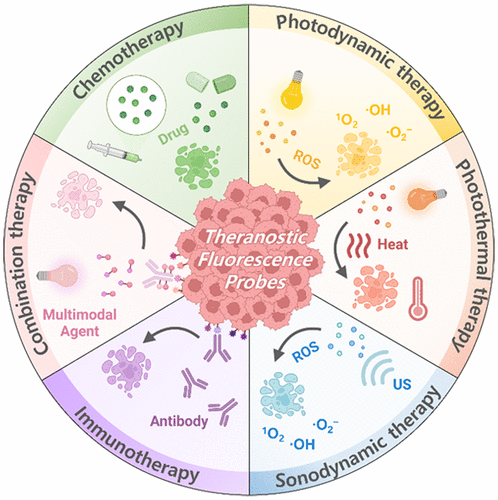

 

#  【最全总结】十万字总结-诊疗一体化探针 
 

Grenemal

读完需要

6

全文字数  字

**诊疗一体化探针**

Theranostic Fluorescent Probes

•

这篇综述文章（[【诊疗探针】癌症治疗中的治疗诊断荧光探针综述](http://mp.weixin.qq.com/s?__biz=MzkzOTI1OTMwNg==&amp;mid=2247489349&amp;idx=2&amp;sn=faf34e35a1839fc12ef385fb216b1da2&amp;chksm=c2f2f380f5857a960eb1ecfb89014a58218f0ff4615afc4fe9bd873f0f443da9542875b0e209&amp;scene=21#wechat_redirect)），主要探讨了在癌症治疗中使用的诊断性荧光探针，特别是那些能够在肿瘤微环境中被激活的探针，以及它们在化疗、光动力治疗（PDT）、光热治疗（PTT）和声动力治疗（SDT）等多种治疗模式中的应用。

**1. 前言：**

文章首先介绍了癌症的定义和其对人类健康的威胁，以及现有治疗方法的局限性。随后，文章详细讨论了诊断性荧光探针的概念，特别是那些能够在肿瘤微环境特定条件下被激活的探针，如酸性 pH、高水平的葡萄糖胺（GSH）、过氧化物（ROS）、特定酶的存在等。这些探针通常由一个荧光基团和一个药物组成，通过特定的化学连接器相连，这些连接器对肿瘤微环境的特定刺激物质敏感，能够在适当的条件下释放药物并产生荧光信号，从而实现药物靶向投递和实时监测。

**2. 化疗中的荧光探针：**

[【诊疗探针】化疗中治疗诊断荧光探针](http://mp.weixin.qq.com/s?__biz=MzkzOTI1OTMwNg==&amp;mid=2247489643&amp;idx=1&amp;sn=70ec69305b08ddaa5867920afe77f1cb&amp;chksm=c2f2fcaef58575b8f6be8bb24d731ffcadee7558a8c84ec051d00af52a80d999bb356484270d&amp;scene=21#wechat_redirect)

[【化疗探针】pH响应荧光探针](http://mp.weixin.qq.com/s?__biz=MzkzOTI1OTMwNg==&amp;mid=2247489643&amp;idx=5&amp;sn=47018ab9eeb77520ac1d8d98bb17a818&amp;chksm=c2f2fcaef58575b85058d6e44bf2583c3e6e77dcbfd59ab2efb283680e2ae3fd6fd71578e260&amp;scene=21#wechat_redirect)

[【化疗探针】GSH响应荧光探针](http://mp.weixin.qq.com/s?__biz=MzkzOTI1OTMwNg==&amp;mid=2247489643&amp;idx=6&amp;sn=181703ed4c1751e0142afb8217ae0a3b&amp;chksm=c2f2fcaef58575b8d04e205db643fbfcd1318efbde6aa363555000e82ec48bc49639df9efc21&amp;scene=21#wechat_redirect)

[【化疗探针】过氧化氢响应治疗诊断探针](http://mp.weixin.qq.com/s?__biz=MzkzOTI1OTMwNg==&amp;mid=2247489643&amp;idx=2&amp;sn=9dc46c89efe0bc7c0dc4eb715c0c63a0&amp;chksm=c2f2fcaef58575b86d922dd45daea035fda135a401cf7e422d46f2eb174706f978b399a102eb&amp;scene=21#wechat_redirect)

[【化疗探针】其他ROS响应治疗诊断探针](http://mp.weixin.qq.com/s?__biz=MzkzOTI1OTMwNg==&amp;mid=2247489643&amp;idx=3&amp;sn=495b4f38e44e8702c065aa15949cd0a8&amp;chksm=c2f2fcaef58575b8b5a433198505f042cba1a1fb1195cfda408af8f2c5bce879d98092f1c26c&amp;scene=21#wechat_redirect)）

[【化疗探针】硫化氢响应治疗诊断探针](http://mp.weixin.qq.com/s?__biz=MzkzOTI1OTMwNg==&amp;mid=2247489643&amp;idx=7&amp;sn=029e29ac0c020af453a496630ca812ba&amp;chksm=c2f2fcaef58575b829c6efbe131c5f7662b4694bc4ef314bfa0c8a6012aa78fd34fa00c1e521&amp;scene=21#wechat_redirect)

[【化疗探针】酶响应治疗诊断探针](http://mp.weixin.qq.com/s?__biz=MzkzOTI1OTMwNg==&amp;mid=2247489643&amp;idx=4&amp;sn=082b72c8fcaccfaafb80723e1de67dfe&amp;chksm=c2f2fcaef58575b8f5649b97d6c8e49c4b3dc44423f92b3572287cf99dddba0ad5ef1a08e59d&amp;scene=21#wechat_redirect)

[【化疗探针】双刺激响应治疗诊断探针](http://mp.weixin.qq.com/s?__biz=MzkzOTI1OTMwNg==&amp;mid=2247489643&amp;idx=8&amp;sn=e33a296d77053aff10dacdcb21e81c28&amp;chksm=c2f2fcaef58575b854bcc1fcd522e1c3e1d628ce2fb1b5d46831a46d04b37bf98b489a03852f&amp;scene=21#wechat_redirect)

**3. 免疫治疗中的荧光探针：**

[【免疫诊疗探针】免疫治疗中的治疗诊断荧光探针](http://mp.weixin.qq.com/s?__biz=MzkzOTI1OTMwNg==&amp;mid=2247489673&amp;idx=1&amp;sn=e255f8a833f43db044dfd3acd3c8c1f0&amp;chksm=c2f2fc4cf585755ad18fbf43595f0131e7bf13f1709a1f2961e40ad4fc0e970ca8c8a85c0039&amp;scene=21#wechat_redirect)）

**4. 光动力治疗（PDT）中荧光探针：**

[【PDT诊疗探针】酶激活治疗诊断荧光探针](http://mp.weixin.qq.com/s?__biz=MzkzOTI1OTMwNg==&amp;mid=2247489674&amp;idx=4&amp;sn=3794ca79ccd6f78cea2e7bdc832fb207&amp;chksm=c2f2fc4ff58575593a29a2800a88f4a24e9a8f2e393d8bce7b19407c21756c043c29f4021c2a&amp;scene=21#wechat_redirect)

[【PDT诊疗探针】ROS/RNS/H₂S可激活治疗诊断探针](http://mp.weixin.qq.com/s?__biz=MzkzOTI1OTMwNg==&amp;mid=2247489674&amp;idx=1&amp;sn=e85eeda5ea87f6af2e733dabc040f66e&amp;chksm=c2f2fc4ff58575594e1101818b555279733739ee9dcf2a4a225ed23be2bb832d94f3e0a3eb92&amp;scene=21#wechat_redirect)

[【PDT诊疗探针】pH可激活治疗诊断探针](http://mp.weixin.qq.com/s?__biz=MzkzOTI1OTMwNg==&amp;mid=2247489674&amp;idx=2&amp;sn=50a2de4e62791a3f3b997293c2422600&amp;chksm=c2f2fc4ff58575596565da39e04349e71e6afef4e5da7e47a5e4334c5da62cf3fca3a9e87e1d&amp;scene=21#wechat_redirect)

[【PDT诊疗探针】生物硫醇可激活的治疗诊断探针](http://mp.weixin.qq.com/s?__biz=MzkzOTI1OTMwNg==&amp;mid=2247489674&amp;idx=3&amp;sn=9a42f235801149a77ec38f9869b40d89&amp;chksm=c2f2fc4ff585755980bb7ff17b1ed445a7726464e40ae7a7e031350d7949091af09bcb0d3f5e&amp;scene=21#wechat_redirect)）

**5. 光热治疗中的荧光探针：**

[【PTT诊疗探针】肿瘤微环境(TME)激活的治疗诊断探针](http://mp.weixin.qq.com/s?__biz=MzkzOTI1OTMwNg==&amp;mid=2247489675&amp;idx=1&amp;sn=3195d135353496efd373aaf2fc9c1199&amp;chksm=c2f2fc4ef5857558f2b64086df0af4c7cbb111fae3649ae272babaab47cb08e8daba23a17dd7&amp;scene=21#wechat_redirect)

[【PTT诊疗探针】肿瘤特异性酶和其他生物分子激活的治疗诊断探针](http://mp.weixin.qq.com/s?__biz=MzkzOTI1OTMwNg==&amp;mid=2247489675&amp;idx=2&amp;sn=da5bb9052c4b9d8e34b14d24e99e3db5&amp;chksm=c2f2fc4ef5857558f5c9833630c9971d97760728515497c841562910a3f0d9e865c12565334b&amp;scene=21#wechat_redirect)

[【PTT诊疗探针】缺氧激活治疗诊断荧光探针](http://mp.weixin.qq.com/s?__biz=MzkzOTI1OTMwNg==&amp;mid=2247489675&amp;idx=3&amp;sn=7900fbfa1c2af02351c84fdd6efd95ec&amp;chksm=c2f2fc4ef5857558db074ead52490a19cb4fb72c0f83beb46c4efec219b5dfa819190c6f0d0a&amp;scene=21#wechat_redirect)）

**6.声动力治疗中的荧光探针：**

[【SDT诊疗探针】H₂O₂多因素协同激活治疗诊断荧光探针](http://mp.weixin.qq.com/s?__biz=MzkzOTI1OTMwNg==&amp;mid=2247489676&amp;idx=3&amp;sn=b01b60616125d3f0a4f676f73db1994c&amp;chksm=c2f2fc49f585755faa6faee4f324820aa33701af87cdc97d04ba99512d4b23bbf832ab548a44&amp;scene=21#wechat_redirect)

[【SDT诊疗探针】缺氧激活治疗诊断荧光探针](http://mp.weixin.qq.com/s?__biz=MzkzOTI1OTMwNg==&amp;mid=2247489676&amp;idx=2&amp;sn=0f170291a22b2059bc3134b8028ae957&amp;chksm=c2f2fc49f585755f3d3d4df11ae6bfa653139c905ab0b05ef6be0901ba5687cc493f6a3f3474&amp;scene=21#wechat_redirect)

[【SDT诊疗探针】TME可激活治疗诊断荧光探针](http://mp.weixin.qq.com/s?__biz=MzkzOTI1OTMwNg==&amp;mid=2247489676&amp;idx=1&amp;sn=176817b1459d5455f7332e5fe6744ef5&amp;chksm=c2f2fc49f585755f20da2323ac6d4fdb835898aae7e00be2513785c3a1fc46ac2ae73f111a17&amp;scene=21#wechat_redirect)）

**7.结论与展望：**

最后，文章强调了虽然诊断性荧光探针在癌症治疗中的巨大潜力，但它们的临床应用仍面临许多挑战，包括生物相容性、药物稳定性、靶向性和体内代谢等问题。研究人员需要进一步探索和优化这些探针的设计，以克服这些障碍，实现它们在临床中的广泛应用（[【诊疗探针】临床转化与结论](http://mp.weixin.qq.com/s?__biz=MzkzOTI1OTMwNg==&amp;mid=2247489349&amp;idx=3&amp;sn=590d643e32dae1936c71b880f97c360f&amp;chksm=c2f2f380f5857a968d232a0bb30b2184a047568ce4bb1beb52c2041fbe35a534c61497a33e85&amp;scene=21#wechat_redirect)）。

## **参考文献**

**Ref**

Chem. Rev. 2024, 124, 5, 2699–2804

**点击蓝字 关注我们**

预览时标签不可点

素材来源官方媒体/网络新闻

 [阅读原文](javascript:;) 

  继续滑动看下一个 

 轻触阅读原文 

    

