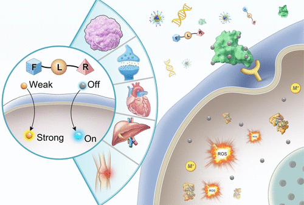

 

#  【最全总结】十万字管饱，用于疾病诊断的荧光探针 
 
  [科研趣味](javascript:void%280%29;) 

Grenemal

读完需要

6

全文字数  字

**疾病诊断荧光探针**

Fluorescent Probes for Disease Diagnosis

 
•
 
本文主要讨论了荧光探针在疾病诊断中的应用，特别是在神经退行性疾病、癌症、器官损伤、心血管疾病和炎症等常见疾病中检测关键生物活性分子的最新进展和荧光探针设计策略。

文章首先介绍了荧光探针的基本原理和设计要素，包括识别单元、荧光基团和连接器。

**神经性疾病**

随后详细探讨了荧光探针在神经退行性疾病[【神经疾病诊断探针】用于神经系统疾病诊断的荧光探针总论](http://mp.weixin.qq.com/s?__biz=MzkzOTI1OTMwNg==&amp;mid=2247489734&amp;idx=1&amp;sn=a81ae8639e58d096c2982ebb8b43885c&amp;chksm=c2f2fc03f5857515823e2548e1673de82cc367dfc919d1ada98cb4b9d3b0aaadc6857aa1be36&amp;scene=21#wechat_redirect)如阿尔赫海默病[【神经疾病诊断探针】用于阿尔茨海默症诊断的荧光探针](http://mp.weixin.qq.com/s?__biz=MzkzOTI1OTMwNg==&amp;mid=2247489734&amp;idx=2&amp;sn=e55a0578a26affdd77d6e9cd7c72165e&amp;chksm=c2f2fc03f585751536df6057dfcd9bb34916a3b7c3d72e70b50cbefac6a0d1cb21ceaad10123&amp;scene=21#wechat_redirect)、癫痫[【神经疾病诊断探针】用于癫痫诊断的荧光探针](http://mp.weixin.qq.com/s?__biz=MzkzOTI1OTMwNg==&amp;mid=2247489734&amp;idx=3&amp;sn=e786dbd59f8510893c94bedb85d6000a&amp;chksm=c2f2fc03f5857515a068ecbdf5a216bb83fb261df9bc31c46fb4cbd9002184ec5638a2d2896c&amp;scene=21#wechat_redirect)、威尔逊氏病病[【神经疾病诊断探针】用于威尔逊氏病诊断的荧光探针](http://mp.weixin.qq.com/s?__biz=MzkzOTI1OTMwNg==&amp;mid=2247489734&amp;idx=4&amp;sn=87e87eb0e21cff8d505db5867897f65b&amp;chksm=c2f2fc03f5857515250ec835108cc9634554282f6537b2e9a1a22e8f777dcdad0a9884ecc3c2&amp;scene=21#wechat_redirect)、中风[【神经疾病诊断探针】用于中风诊断的荧光探针](http://mp.weixin.qq.com/s?__biz=MzkzOTI1OTMwNg==&amp;mid=2247489734&amp;idx=6&amp;sn=8ecde7de60029dbbce077e68f5939817&amp;chksm=c2f2fc03f5857515fcc67ffe2bd1e549a2c5d7c11052b8d7901107ee8f47fd3823e58b12f823&amp;scene=21#wechat_redirect)、脑胶质瘤[【神经疾病诊断探针】用于胶质瘤诊断的荧光探针](http://mp.weixin.qq.com/s?__biz=MzkzOTI1OTMwNg==&amp;mid=2247489734&amp;idx=7&amp;sn=e131d5474cbab58cfd3c3e0dc4865660&amp;chksm=c2f2fc03f5857515fa763495f3f2beff9670a7f395c6e8e96546f6f05ee5045a8b01f496d18a&amp;scene=21#wechat_redirect)和抑郁症[【神经疾病诊断探针】用于抑郁症诊断的荧光探针](http://mp.weixin.qq.com/s?__biz=MzkzOTI1OTMwNg==&amp;mid=2247489734&amp;idx=5&amp;sn=f39d17f5d1fc7cad48b2cf0f76b71d7c&amp;chksm=c2f2fc03f585751522da086e882bc5f92c0b7ff9d8bf03e378e281701b7b3e6fdaa2df250e87&amp;scene=21#wechat_redirect)等方面的应用。文章列举了多种针对这些疾病的特定荧光探针，如检测 β-amiloid 蛋白、氮氧化物、铜离子、乙酰胆碱酶和其他相关生物标志物的探针。

**癌症**

接着，文章讨论了荧光探针在癌症如乳腺癌[【癌症荧光探针】用于乳腺癌诊断的荧光探针](http://mp.weixin.qq.com/s?__biz=MzkzOTI1OTMwNg==&amp;mid=2247489848&amp;idx=2&amp;sn=038e955fd1686521280b3517c07841d2&amp;chksm=c2f2fdfdf58574ebf476b915976050e7539d25cbe03ceae7c762d9bfafbb3478dfe60aee046c&amp;scene=21#wechat_redirect)、肝癌[【癌症荧光探针】用于肝癌诊断的荧光探针](http://mp.weixin.qq.com/s?__biz=MzkzOTI1OTMwNg==&amp;mid=2247489848&amp;idx=3&amp;sn=8485e7377369670dbc8cef281da5ae53&amp;chksm=c2f2fdfdf58574eb91dc5faeadb403a798f0163e26595731f4315543a406ae99bd7db8673e3a&amp;scene=21#wechat_redirect)、肺癌[【癌症荧光探针】用于肺癌诊断的荧光探针](http://mp.weixin.qq.com/s?__biz=MzkzOTI1OTMwNg==&amp;mid=2247489848&amp;idx=4&amp;sn=5b532c1285a72801a7643d206c4ad29a&amp;chksm=c2f2fdfdf58574eb30d9bde659e93c5e72ce371c31cda2059d1b7f357a31a40b572fda460188&amp;scene=21#wechat_redirect)、卵巢癌[【癌症荧光探针】用于卵巢癌诊断的荧光探针](http://mp.weixin.qq.com/s?__biz=MzkzOTI1OTMwNg==&amp;mid=2247489848&amp;idx=5&amp;sn=fdd00baffdff37f6da08e26a29941bee&amp;chksm=c2f2fdfdf58574ebb0569ba82214c7e4358f14e6eff29e64af3811d43f11e5c05b908243e77a&amp;scene=21#wechat_redirect)和宫颈癌[【癌症荧光探针】用于宫颈癌诊断的荧光探针](http://mp.weixin.qq.com/s?__biz=MzkzOTI1OTMwNg==&amp;mid=2247489848&amp;idx=6&amp;sn=8daa30f0f86fd9a626571751644b353d&amp;chksm=c2f2fdfdf58574eb18a2719411084b48a61c777d52ee058a844d88bee73b6ae4b0e313795ecf&amp;scene=21#wechat_redirect)及其他癌症[【癌症荧光探针】用于其他癌症癌诊断的荧光探针](http://mp.weixin.qq.com/s?__biz=MzkzOTI1OTMwNg==&amp;mid=2247489848&amp;idx=7&amp;sn=06f26b942ee00dea77a83ce3a6fade03&amp;chksm=c2f2fdfdf58574eb7511a4f48fcd97dad7ca2137e7b17dc42278b4aae5b21f26e750dd95d0c3&amp;scene=21#wechat_redirect)中的应用，包括检测活性氧化物、酶活性、蛋白质表达和其他相关生物标志物的探针。

**器官损伤**

之后，文章讨论了荧光探针在器官损伤[【疾病诊断荧光探针】器官损伤荧光探针总论](http://mp.weixin.qq.com/s?__biz=MzkzOTI1OTMwNg==&amp;mid=2247489868&amp;idx=1&amp;sn=ecd883e638e2673052b0c3edc1beef3d&amp;chksm=c2f2fd89f585749fa3a289c3db0519c409f7a7b1208d2e4599e50e454de82b72268f6e4760cd&amp;scene=21#wechat_redirect)如肝损伤[【器官损伤荧光探针】肝损伤荧光探针](http://mp.weixin.qq.com/s?__biz=MzkzOTI1OTMwNg==&amp;mid=2247489868&amp;idx=2&amp;sn=25d7eb1f3b580a4d21e8910d170c972e&amp;chksm=c2f2fd89f585749fe8f2ef953d92de77adbc1b756ada074c47e352040c78dc2c7d3bc28a339c&amp;scene=21#wechat_redirect)、肾损伤[【器官损伤荧光探针】肾损伤荧光探针](http://mp.weixin.qq.com/s?__biz=MzkzOTI1OTMwNg==&amp;mid=2247489868&amp;idx=3&amp;sn=01a8dc83d919d51be1f51bffd3c84863&amp;chksm=c2f2fd89f585749ff59aeaff99434f4ba6ab2a988fb943d68a4f739284839d0bb889d7875d1a&amp;scene=21#wechat_redirect)及脑外损伤[【器官损伤荧光探针】治疗脑外伤的荧光探针](http://mp.weixin.qq.com/s?__biz=MzkzOTI1OTMwNg==&amp;mid=2247489868&amp;idx=4&amp;sn=df55e81fd2b6cf20c17f99bea7faf8da&amp;chksm=c2f2fd89f585749feaf40f3ece923d5ff2fc95cd41278ce45fbdba58cf42032a12013d318a77&amp;scene=21#wechat_redirect)等疾病中的应用。

**心血管疾病**

然后，文章介绍了荧光探针在心血管疾病[【疾病诊断荧光探针】心血管疾病的荧光探针总论](http://mp.weixin.qq.com/s?__biz=MzkzOTI1OTMwNg==&amp;mid=2247489871&amp;idx=1&amp;sn=90ed4bf07ce0273f60a37a7feae39651&amp;chksm=c2f2fd8af585749c1caf6ce5f58ff96dc847a4b20c8edb931542d1f61a06a23b461520d82a77&amp;scene=21#wechat_redirect)如缺血再灌注[【心血管疾病的荧光探针】缺血再灌注损伤的荧光探针](http://mp.weixin.qq.com/s?__biz=MzkzOTI1OTMwNg==&amp;mid=2247489871&amp;idx=2&amp;sn=af678a22ace124da9cafd3f55145f801&amp;chksm=c2f2fd8af585749c3ba6c84a1cbd8bf3f11215edd8f7b994d862de360f11d1a52731c762803c&amp;scene=21#wechat_redirect)、动脉粥样硬化[【心血管疾病的荧光探针】动脉粥样硬化荧光探针](http://mp.weixin.qq.com/s?__biz=MzkzOTI1OTMwNg==&amp;mid=2247489871&amp;idx=3&amp;sn=a92e76399310dec1326766169117a7c4&amp;chksm=c2f2fd8af585749c96e894185dc8180437b10fbdba9795a201f837a948792f735f9e4f6f631d&amp;scene=21#wechat_redirect)及其他疾病[【心血管疾病的荧光探针】其他探针](http://mp.weixin.qq.com/s?__biz=MzkzOTI1OTMwNg==&amp;mid=2247489871&amp;idx=4&amp;sn=08cdcef5d924ab83641f6a6dee9d6da9&amp;chksm=c2f2fd8af585749c99092fe61ac64aa8fb6b807e3c39ccb18443415e746882791f0e5dc9fb10&amp;scene=21#wechat_redirect)中的应用。

**05**

**炎症**

随后，文章介绍了荧光探针在炎症[【疾病诊断荧光探针】炎症荧光探针总论](http://mp.weixin.qq.com/s?__biz=MzkzOTI1OTMwNg==&amp;mid=2247489863&amp;idx=1&amp;sn=9e2dfdd376e270bb5438a7ab982f16b6&amp;chksm=c2f2fd82f5857494c5b9bac0e0544fb234b57cb4e9e46da17c5c1dbab5da90fc7ecb1a4e03ea&amp;scene=21#wechat_redirect)方面的应用。

最后，文章提供了荧光探针在临床应用中的前景，包括它们在疾病诊断和手术导航中的潜在作用。

观点

Fluorescence

荧

光

**1**

荧光探针因其高敏感性和高选择性，成为了检测和监测疾病相关生物活性分子的有效工具。

**2**

荧光探针的设计需要考虑目标分子的识别单元、荧光基团的选择以及连接器的稳定性。

**3**

荧光探针在神经退行性疾病的诊断中尤其重要，能够帮助研究者更好地理解疾病的发展和病理机制。

**4**

在癌症诊断中，荧光探针能够检测到癌细胞特有的生物标志物，有助于早期诊断和治疗效果评估。

**5**

荧光探针的多功能性和生物相容性是其在生物医学领域应用的关键优势。

**6**

荧光探针的开发和应用面临一些挑战，包括提高其特异性、生物稳定性和通过生物屏障的能力。

## **参考文献**

**Ref**

Chem. Rev. 2024, 124, 11, 7106–7164
 
**点击蓝字 关注我们**

预览时标签不可点

素材来源官方媒体/网络新闻

  继续滑动看下一个 

 轻触阅读原文 

    

