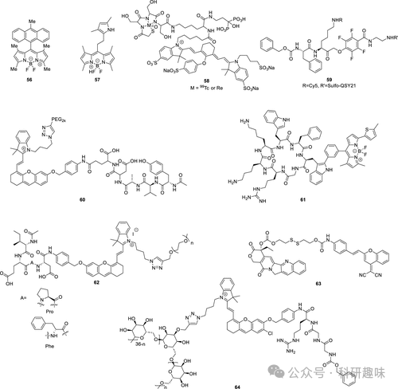
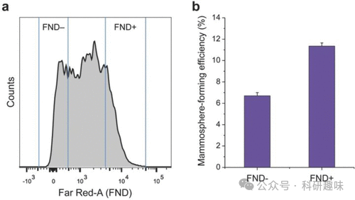

## **乳腺癌荧光探针**

乳腺癌，作为全球范围内最为普遍的恶性肿瘤之一，平均每十名女性中就有一人在其生命旅程的某个阶段面临罹患的风险。尽管近年来，得益于早期诊断技术的进步和有效治疗策略的实施，乳腺癌的死亡率已显著下降，但这一领域仍有待于进一步的优化和提升（如图24所示）。

图 24.部分乳腺癌荧光探针。

在癌症的复杂机制中，与神经系统疾病相似，ROS（以及RNS）和更广泛的氧化应激扮演着核心角色。2017年，Boyle等人基于BODIPY-anthracene的二体结构设计出荧光探针56，用于细胞内单线态氧（^1O₂）的实时监测。该探针在激发状态下，通过光诱导电子转移（PeT）产生局部激发的三重态，进而与分子氧反应生成^1O₂。随后，^1O₂与蒽反应，依次生成蒽过氧化物、蒽环氧化物和多环乙醛，从而释放出明亮的荧光信号。

在癌症环境中，HClO同样普遍存在。2014年，Peng等人报道了一种高灵敏度的荧光探针57，专门用于监测癌细胞中HClO的生成。该探针以BODIPY荧光团为基础，通过吡咯基团实现对HClO的特异性识别。在无分析物存在时，由于PeT效应，荧光被淬灭；而当遇到强氧化性的HClO时，吡咯基团被氧化，阻断PeT过程，荧光随即”点亮”。探针57具有极低的检测限（0.56 nM）和快速的响应时间（&lt;1秒），使其成为监测肿瘤细胞中HClO水平变化的理想工具。通过此探针，研究人员成功对依来氯莫尔诱导的MCF-7细胞中HClO随时间变化的升高进行了成像，为实时监测肿瘤中HClO浓度提供了有力的技术支撑。

2008年，Frangioni小组成功设计并合成了SPECT/NIR双模式荧光探针58，用于羟基磷灰石（HA）的成像研究。该探针以氰基为荧光团，通过双磷酸盐实现对HA的特异性识别。与其他钙盐相比，探针58对HA的反应速度快了8倍。通过荧光成像和SPECT分析，研究团队在乳腺癌大鼠模型中成功观察到骨形态发生蛋白-2（BMP-2）的异位表达。

半胱氨酸蛋白酶家族在细胞生理及包括乳腺癌在内的多种人类疾病中发挥着重要作用。2013年，Bogyo小组报道了一类新型淬灭荧光探针（如探针59），这些探针通过高度亲电的苯氧甲基酮亲电“弹头”与被分析物的活性位点亲核物发生反应。该研究团队通过改进的连接剂，将具有光活性的Cy5和QSY21连接起来，实现了无目标分子时的高效佛斯特共振能量转移（FRET）荧光淬灭。当半胱氨酸蛋白酶存在时，多肽序列被裂解，释放出淬灭剂，导致荧光信号的恢复。与先前探针相比，探针59在溶解性和体内特性上均有所改进，对更多半胱氨酸螯合蛋白具有更广泛的反应活性，显著提高了标记和肿瘤成像的效果。在活体荧光成像实验中，该探针成功区分了乳腺癌小鼠与正常小鼠之间半胱氨酸蛋白酶活性的差异，为开发此类淬灭荧光探针提供了重要的工具和思路，并在传感领域得到广泛应用。

程序性细胞死亡（PCD）的实时成像对于癌症发展、治疗、抗药性机制及个性化治疗方案的监测至关重要，因为PCD逃避是癌症的典型特征。因此，2023年，Pu等人研发了一种双锁串联激活的近红外荧光探针60，用于小鼠肿瘤细胞热凋亡的监测。 该探针以Cy5为荧光团，并通过改性PEG增强其水溶性。通过连接γ-谷氨酰转肽酶（GGT）和Casp1的多肽序列，形成探针60。在肿瘤细胞内，探针依次被Casp1和GGT酶切割，恢复分子内电荷转移（ICT）并在710纳米波长处恢复荧光。利用探针60，研究人员成功观察了乳腺癌的热休克水平，并对癌症免疫疗法进行了实时评估。此外，该探针还能区分肿瘤内和正常的热蛋白沉积，为利用光学成像评估潜在抗癌药物的热原活性提供了有力工具。

2022年，Vendrell等人针对PCD的另一重要方面进行了深入研究，他们开发了荧光探针61，用于快速检测化疗诱导的细胞凋亡。该探针采用对环境敏感的BODIPY作为荧光单元，结合先前开发的凋亡肽作为靶向单元。其中，环肽能够高效结合凋亡细胞膜，而不与健康细胞结合。一旦结合，周围环境的极性发生显著变化，导致BODIPY荧光团发出以600纳米为中心的亮红色荧光。探针61在体外和体内均能以良好的选择性快速识别凋亡细胞与健康细胞。探针60和61均为细胞死亡成像提供了卓越的显像效果，为区分健康细胞与凋亡/猝死细胞提供了有力工具，并为研究癌症中不同的PCD机制及更好地理解治疗效果的本质提供了重要手段。

免疫激活的实时成像在癌症免疫疗法和药物发现中扮演着举足轻重的角色。然而，当前多数应用于此领域的探针均基于持续发光的荧光团设计，导致荧光反应与免疫反应之间的关联性不佳。为克服这一局限，Pu等人于2020年成功研发出一种针对颗粒酶B的近红外大分子荧光探针62，特别适用于癌症免疫疗法的实时评估。该探针巧妙结合了青色荧光团与颗粒酶B特异性多肽，其荧光变化与肿瘤组织中细胞毒性T淋巴细胞（CD8+）和T辅助细胞（CD4+）的活性密切相关。这种探针不仅能通过被动靶向方式渗透小鼠肿瘤细胞，且展现出了极高的肾清除效率，24小时内清除率高达60%。这一创新探针为监测肿瘤免疫疗法效果提供了强有力的工具，有望推动免疫疗法的进一步发展。

在药物开发中，了解原药的生物分布和体内活化机制至关重要。为此，Zhu等人于2014年设计了一种针对乳腺癌研究的探针63。他们通过二硫键将二氰基甲基-4H-吡喃衍生的近红外荧光团与抗癌剂喜树碱（CPT）相连，并巧妙地将此系统嵌入纳米颗粒之中。当肿瘤细胞内的GSH浓度升高时，连接体会被裂解，从而释放抗癌剂CPT并激活荧光信号，实现药物分布的实时监测。体内实验证实，探针63不仅展现出与CPT药物本身相当的治疗效果，还具备通过近红外荧光追踪药物释放的能力。

针对浸润性和非浸润性乳腺癌的区分问题，Pu和Miao等人于2020年设计出一种特异性响应浸润性乳腺癌中过表达尿激酶型纤溶酶原激活剂（uPA）的荧光探针64。该探针在酰胺键裂解去除靶向肽后，通过激活ICT机制，触发近红外荧光和PA信号。值得一提的是，探针64采用了葡聚糖骨架设计，不仅提升了溶解性，还确保了化合物能够顺利通过肾脏清除，从而极大降低了潜在毒性。葡聚糖骨架及其在传感和治疗学中的应用将在后续部分进行深入探讨。

尽管识别和分离癌症干细胞（CSC）在癌症治疗中具有重要意义，但受限于当前成像技术的局限性，这一目标尚未得到有效实现。2015年，Chang和Yu等人成功研发出一种名为荧光纳米金刚石（FND）的材料（探针65），旨在追踪和定位缓慢增殖/静止的癌干细胞（如图25所示）。该探针由具有高发光性能的CuInSe2/ZnS核/壳量子点和肿瘤靶向肽（Cys-Gly-Lys-Arg-Lys，CGKRK）组成。体外实验表明，探针65不仅具有优异的光稳定性和良好的生物相容性，还能准确量化乳腺癌细胞系的干细胞频率，为分离这些关键干细胞提供了重要支持。

图 25.荧光纳米钻石阳性细胞（FND+）和荧光纳米钻石阴性细胞（FND-）的流式细胞分析（a）和乳球形成效率（b）。
