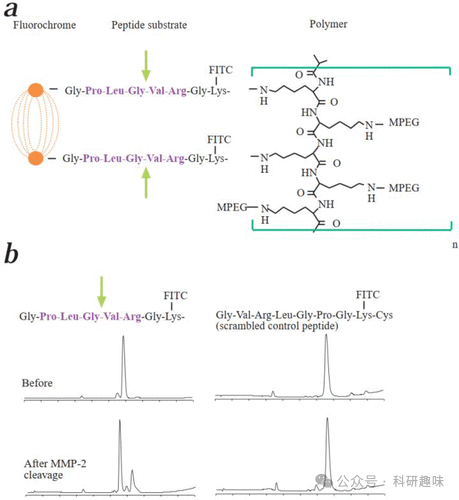
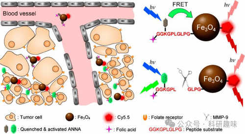

 

#  【癌症荧光探针】用于其他癌症癌诊断的荧光探针 
 

Grenemal

读完需要

9

全文字数 3000 字

**疾病诊断荧光探针**

Fluorescent Probes for Disease Diagnosis

**其他癌症的荧光探针**

在介绍了针对五种最常见癌症的结构和机理各异的荧光探针之后，本小节将介绍一些针对其他各种癌症和肿瘤开发的探针的有趣实例。

2016 年，Chang 等人展示了一种多位点结合荧光探针 85，它能对细胞内 ATP 水平的快速变化做出反应。（156） 罗丹明 B 被用作荧光单元，并引入苯硼酸基团以维持闭环无荧光状态。加入 ATP 后，多种共价和非共价相互作用会促进罗丹明转为 "开放 "形式。其中包括硼酸与 ATP 核糖之间共价形成的硼酸酯、85 的蒽与腺嘌呤 ATP 之间的 π-π 相互作用，以及探针二乙胺基团与 ATP 磷酸单元之间的静电和氢键作用。在开放构型下，探针会发出荧光，从而在与 ATP 结合时发出明亮的红光。体外实验表明，该探针能快速、特异地对 ATP 作出反应，暴露于 ATP 时荧光增强约 18 倍。细胞实验表明，该探针的生物毒性低、细胞穿透性好，并能在线粒体定位。作者利用探针 85 观察了口腔鳞状细胞癌（OSCC）和 HeLa 细胞中 ATP 水平的变化。值得注意的是，由于大多数传感相互作用的非共价性质以及硼酸酯形成的易逆性，传感事件很容易逆转，例如，加入吡咯酶（ATP水解酶）就能逆转过程，并通过从系统中去除ATP来关闭荧光，从而使探针85以封闭的螺环形式再生。

2017 年，Martinez-Manez 和 Serrano 设计了一种 TP 荧光探针 86，用于观察体内肿瘤细胞的衰老。（157）作者在 l-组氨酸甲酯的 N 端添加了荧光萘二甲酰亚胺，然后将乙酰化半乳糖连接到氨基酸的咪唑环上，得到了荧光探针。在细胞中，糖苷被β-半乳糖苷酶裂解，释放出荧光团，产生286倍的荧光增强效果。作者利用 palbociclib 诱导 SK-MEL-103（人类黑色素瘤）细胞衰老（老化），使用探针 86 可以观察到这一现象，从而证明了它能够靶向衰老细胞并对其成像。当将该探针注射到用帕博西尼诱导衰老的皮下黑色素瘤小鼠模型中时，发现探针在肿瘤部位发出荧光，从而可以识别和观察所述肿瘤。

2016年，Zhu和Guo等人精心设计了比率计量的近红外荧光探针87，旨在实时监测结直肠癌中β-半乳糖苷酶的活性。（158） 该探针的核心在于一种DCM荧光团，其独特设计的半乳糖掩蔽对羟基作为荧光掩蔽酶的可切除触发器。当探针87与β-半乳糖苷酶接触时，半乳糖单元被特异性酶解，导致在685纳米波长处产生显著增强的荧光信号，同时500纳米波长处的荧光信号减弱，从而实现了对半乳糖苷酶分析物的比率式追踪。值得一提的是，该探针展现出优异的光稳定性，并在细胞（如293T肿瘤细胞、OVCAR-3卵巢癌细胞）以及体内小鼠结直肠肿瘤模型中均成功验证了其对半乳糖苷酶的实时跟踪能力。

与这一研究紧密相关的是Scanlan和Gunnlaugsson的工作，他们开发了一系列基于萘二甲酰亚胺共轭聚糖结构的糖基化-Nap探针和原药。（159，160） 这些药物能够在不同癌细胞系中通过糖苷酶介导的活化机制释放活性成分，药物的释放速率和活性受癌细胞中过表达的酶以及糖的性质所调控，为实时监测药物的吸收和活性提供了有力工具。

2013年，Peng等人成功报道了COX-2靶向荧光探针88，该探针在癌症与炎症环境的区分上展现出显著效果。（161） 探针88的构建巧妙地将COX-2底物吲哚美辛通过线性烷基二胺间隔物与荧光团NANQ相连。在无COX-2环境下，探针呈现低能量折叠状态，导致荧光淬灭。然而，当吲哚美辛基团与COX-2特异性结合时，探针构象发生转变，展开成活性状态，同时阻断IMC对NANQ的淬灭作用，使荧光恢复。在炎症和肿瘤模型中，探针88在615纳米波长处展现出增强的荧光信号。有趣的是，随着COX-2浓度的增加（0.12-3.32 μg/mL），615纳米处的荧光信号逐渐减弱，而555纳米处的荧光信号增强。这种独特的性质源于癌症和炎症环境中COX-2表达水平的差异，使得探针88成为区分这两种病理状态的有力工具。通过简单的喷洒和手持式紫外灯照射，即可直观地识别癌症组织、正常组织和炎症组织，为肿瘤检测、识别及切除手术提供了重要的潜在临床应用。

2015年，Shih等人开发了一种针对单胺氧化酶A的近红外荧光探针89，其在前列腺癌的检测和治疗领域展现出巨大潜力。（162） 该探针以单胺氧化酶A抑制剂氯吉林为靶向基团，结合荧光庚氨羰花青染料作为荧光团。研究表明，探针89不仅能精准识别并定位前列腺癌肿瘤，还能有效抑制肿瘤的进一步生长和扩散，为前列腺癌的治疗提供了新的治疗策略。

2012年，Nagano等人提出了一种基于FRET技术的基质金属蛋白酶（MMP）可视化系统，即探针90。（163） 该探针采用暗淬灭剂BHQ-3作为FRET受体，与近红外BODIPY荧光供体通过MMP肽底物相连。在生理条件下，BODIPY与BHQ-3之间的FRET作用导致荧光淬灭。然而，在MMP的作用下，肽底物被酶切断，FRET对分离，荧光得以”点亮”。体外实验表明，探针90具有高渗透性，能有效进入靶细胞。在小鼠异种移植肿瘤模型中，荧光共聚焦成像实验成功检测到了MMP的活性。与先前的成像工具相比，探针90展现出更快的响应速度和更高的信噪比，为研究人员检测癌症中MMP活性提供了有力工具。

2017年，Dickinson等人报道了一种创新的小分子荧光探针91，用于检测细胞中半胱氨酸S-脱棕榈酰化过程。（164） 该探针巧妙利用氨基甲酸酯连接剂将棕榈酰化半胱氨酸残基与罗丹明染料相连，使罗丹明呈现内酯低荧光状态。在酰基蛋白硫酯酶（APT，一种去棕榈酰化酶）作用下，探针的硫醇酯去乙酰化，释放出硫醇，进而分子内裂解氨基甲酸酯连接体，释放出罗丹明染料，使其恢复荧光。利用探针91，作者成功地对A431细胞和HEK293T细胞中的内源性APT活性进行了成像。此外，探针所揭示的信号为动态脂质信号转导提供了新的见解，为蛋白质调控中这一鲜为人知且研究不足的领域提供了新线索。

同年，Tan等人介绍了一种基于固态ESIPT的探针92，用于活细胞中碱性磷酸酶（ALP）的可视化。（165） 在其未激活状态，探针通过添加磷酸基团掩盖氢键供体苯酚，从而抑制ESIPT能力并关闭荧光。这一设计同时使探针具有良好的水溶性。当ALP分解磷酸盐时，探针92释放并快速沉淀，产生明亮的固态荧光。研究表明，探针92能以高信噪比成功检测ALP活性，并在骨肉瘤细胞系（U-2OS和Saos-2）中成功成像内源性ALP活性。这种探针为探索ALP的生理和病理功能提供了有价值的工具，同时其新颖的设计为开发新型肿瘤生物标志物检测传感器提供了有趣的新平台。

早在2001年，Welssleder等人就报道了一种用于检测小鼠肿瘤中MMP活性的生物相容性近红外荧光探针（图32，探针93）。（166） 该探针将一种近红外染料与MMP-2多肽底物结合，并固定于非免疫原性聚合物骨架上。由于聚合物紧密堆积，初始状态下荧光被淬灭。然而，当MMP-2分解多肽时，荧光发射恢复，在肿瘤部位产生近红外信号。作者在人类纤维肉瘤细胞（HT1080）的肿瘤小鼠模型中验证了这一系统的成像能力，表明该聚合物传感系统能有效检测MMP-2活性的变化，并可用于评估肿瘤中MMP活性的动态变化。这一研究不仅为肿瘤进展的监测提供了新的视角，还为开发新的抗肿瘤药物提供了潜在的靶点。

在材料学和化学领域，这些荧光探针的设计和应用展示了精细的化学修饰和靶向策略如何实现对生物分子和生物过程的特异性识别和监测。这些研究成果不仅扩展了我们对生物过程的理解，还为疾病诊断、治疗以及药物研发提供了新的思路和方法。随着技术的不断进步和创新，预计将有更多高性能的荧光探针被开发出来，为生物医学领域带来更多的突破和进展。

图 32.（a） MMP-2 敏感探针 93 的结构。（b） MMP-2 分解前后肽底物的 HPLC 图谱。

2018年，Gao等人精心构建了一种双比率荧光探针，旨在实时监测肿瘤相关蛋白酶活性和pH值的变化（如图33所示，探针94）。（167） 在这一设计中，pH敏感的荧光染料ANNA通过特定的多肽序列被锚定在Fe3O4纳米粒子表面，初始状态下，通过荧光共振能量转移（FRET）机制使得ANNA的荧光被关闭。同时，探针上还引入了Cy5.5染料，该染料在整个反应过程中保持稳定的”点亮”状态，作为荧光参照。

当肿瘤相关的蛋白酶MMP-9发生作用，特异性裂解多肽序列时，FRET机制被中断，导致ANNA的荧光得以恢复，从而指示蛋白酶MMP-9的活性。通过比较恒定发光的Cy5.5与依赖于MMP的ANNA的荧光强度，可以精确地量化MMP-9的活性。

通过体内和体外实验验证，这一双比率荧光探针成功地为肿瘤部位的MMP-9蛋白活性和pH值提供了量化的实时监测信息，为肿瘤的诊断和治疗提供了新的有力工具。

图 33.ANNA 纳米探针（探针 94）在肿瘤细胞中的作用机制。

**点击蓝字 关注我们**

预览时标签不可点

素材来源官方媒体/网络新闻

  继续滑动看下一个 

 轻触阅读原文 

    

