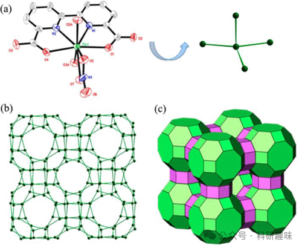

 

#  【癌症荧光探针】用于卵巢癌诊断的荧光探针 
 

Grenemal

读完需要

2

全文字数 600 字

**疾病诊断荧光探针**

Fluorescent Probes for Disease Diagnosis

**卵巢癌荧光探针**

尽管卵巢癌的发病率相较于其他已讨论的癌症类型较低，但其致死率却异常高。这主要归因于卵巢癌发病机制尚不清晰，且疾病在确诊前即存在极高的转移风险，导致预后效果极差（图 26）。

在2015年，Fan等人成功研制出两种新型荧光探针76（其中R代表CO2Et或Me），这些探针旨在特异性成像肿瘤细胞中的γ-谷氨酰转肽酶（GGT）。这些探针的分子结构由GGT特异性GSH单元和BODIPY荧光团组成。当探针穿透细胞后，GGT会裂解GSH链上的谷氨酸，通过SNAr机制触发分子内的S-N重排，生成氨基取代的BODIPY-Cys，其荧光强度显著增加（约12倍）。利用这一特性，Fan等人成功地将卵巢癌细胞与正常细胞区分开来。

同年，Urano等人介绍了一种基于罗丹明的高灵敏度β-半乳糖苷酶荧光探针77，该探针的设计基于优化罗丹明核心的内酯-齐聚物平衡。通过精细的结构调整，探针的pKcycl值被精确调整至约5.4，这使得探针在pH 7.4的缓冲液中几乎完全（大于99%）以无荧光的螺环形式存在，有效降低了基于罗丹明系统的常见背景荧光问题。研究结果显示，该探针能在体外选择性地检测β-半乳糖苷酶的活性。更重要的是，作者通过开发七种卵巢转移癌小鼠模型，持续观察到癌症的转移情况。这种探针及其他类似探针有望在卵巢癌检测中找到临床应用，同时，其支架的灵活性也为多种肿瘤相关活性酶的检测提供了可能。

此外，Zaworotko等人在2015年开发了两种具有Rho拓扑结构的镧系沸石类金属有机框架（Ln-ZMOFs），具体为探针78（图 29）。这些材料通过4联镧系元素分子构建模块和联吡啶-二羧酸配体的自组装合成，展现出良好的合成便利性。通过调整Tb3+与Eu3+（会产生延迟的镧系元素中心发射）的比例，该材料能够高效检测溶血磷脂酸，这是一种血浆中卵巢癌的生物标志物。这一设计为发光混合晶体Ln-MOF的开发提供了新的思路，并有望催生一系列新的工具，在肿瘤检测领域发挥重要作用。

图 29.（a） Tb-ZMOF 的晶体结构（探针 78）。（b）Tb-ZMOF 中 α 笼和β笼的透视图（点 = Tb3+；线 = 羧基）。（c） Tb-ZMOF 的 rho 拓扑平铺图。

**点击蓝字 关注我们**

预览时标签不可点

素材来源官方媒体/网络新闻

  继续滑动看下一个 

 轻触阅读原文 

    

