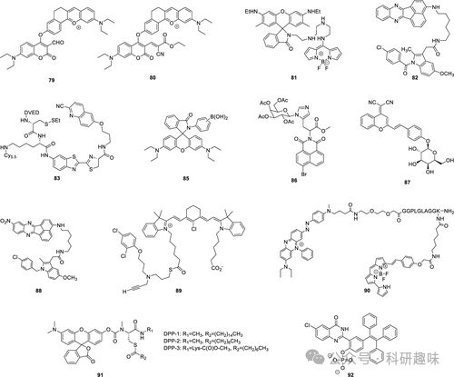
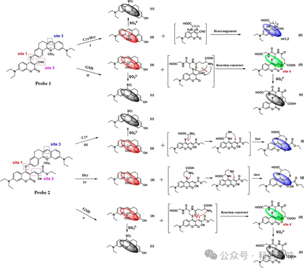

## **宫颈癌荧光探针**

宫颈癌作为第四大常见癌症，预计在2020年将新增超过60万例病例，其发病率与高危人乳头瘤病毒（HPV）感染紧密相连。尽管宫颈癌的发病率高，但得益于现代医疗技术的进步，其治疗率也相应提升，即便是晚期宫颈癌患者，通过精心的治疗和切除手术，也能有效遏制肿瘤的生长（图 30）。

在2020年，Yin等人提出了两种新型荧光探针79和80，它们在同一通用支架上通过引入不同的反应位点，实现了对宫颈癌中硫醇和二氧化硫生物标志物的差异化监测（图 31）。这些探针的设计精妙，基于三个关键的反应位点。反应位点一作为两者的共有特征，由双芳醚连接构成，其可以通过与Cys、Hcy或GSH硫醇的相互作用进行裂解，进而产生发出红色荧光的五环吡咯荧光团。随后，这一物质会与反应位点三中的SO32-（SO2供体）发生反应，通过磺酰化作用打破共轭体系，从而抑制红色荧光。而反应位点二则是每种探针所独有的，它涉及与醚连接体裂解产生的硫醇化合物发生分子内反应，形成新的环状硫醚香豆素，并发出蓝色荧光。特别地，在第二个探针中，GSH的加入会触发一系列反应，生成一个含有噻吩和亚胺的绿色荧光物质，该物质在进一步与SO32-反应时会分解。图 31详细展示了这一复杂的级联反应过程。

基于这些独特的荧光变化，Yin等人成功地检测了硫醇及其代谢物。通过体内和体外成像实验，这些探针的实用性和对硫醇、二氧化硫分析物进行差异化检测的能力得到了充分验证。这些成果不仅展示了复杂多位点多活性探针开发的潜力，还为监测复杂和竞争性代谢过程提供了有力的工具，具有广阔的应用前景。

图 30.宫颈癌和其他特定癌症的荧光探针。

图 31.探针 79 和 80 对硫醇和二氧化硫的反应机制。这些探针会产生几种不同的产物，用小字母表示。

2018年，Ahn等人精心设计了TP荧光探针81，旨在实现溶酶体内ATP浓度变化的成像分析。该探针81巧妙融合了氨基-BODIPY和罗丹明6G两个荧光团，并通过四胺链连接，其中四胺链在ATP识别中扮演了核心角色。在无ATP条件下，探针在403纳米激发下发出454纳米的荧光。然而，当ATP加入时，会触发氨基-BODIPY与罗丹明6G之间的FRET效应，导致探针在557纳米处呈现黄色荧光。Ahn等人利用此探针，成功实时监测了HeLa细胞（一种宫颈癌细胞）中的接吻-奔跑和完全塌陷融合过程，并精确量化了这些过程中溶酶体内ATP浓度的变化。

2013年，Peng等人开发了一种针对癌细胞高尔基体中环氧化酶-2（COX-2）的荧光成像探针82。该探针82结合了荧光团苊[1，2-b]喹喔啉（ANQ）和吲哚美辛（一种高效的COX抑制剂）作为COX-2的靶向基团。在水溶液中，探针呈现折叠构象，ANQ与IMC单元之间的PeT效应导致ANQ荧光淬灭。然而，一旦探针与高尔基体上的COX-2结合，其构象展开，PeT淬灭受到抑制，荧光得以恢复。Peng等人利用探针82成功地对不同细胞中的COX-2活性进行了成像，并快速区分了正常细胞和癌细胞（HeLa细胞）。此外，该探针还可用于观察肿瘤细胞凋亡过程中高尔基体的动态变化。

2014年，Rao等人报道了一种能在体内自组装的小分子荧光探针83，用于caspase活性的成像。该探针83由氨基荧光素支架、连接d-半胱氨酸基团和2-氰基-6-羟基喹啉基团、以及L-DEVD（Asp-Glu-Val-Asp）封顶肽序列组成，其中二硫键用于caspase-3/7介导的裂解和细胞内硫醇介导的还原。该探针可被caspase-3/7选择性激活，进而触发生物正交大环化和纳米聚集，实现对caspase（即细胞凋亡）活性的可视化监测，从而有效评估肿瘤治疗反应。这一设计在HeLa细胞和HeLa肿瘤小鼠模型中均得到了验证。

早在2006年，Kwon等人便报道了一种基于DEVD的纳米颗粒探针84，用于凋亡成像。这些纳米颗粒融合了Cy5.5荧光团和特异性DEVD序列。由于染料与纳米颗粒紧密结合，未激活状态下荧光被淬灭。然而，与酶反应后，肽段被裂解，导致间距增大，荧光淬灭减少，近红外信号得以显现。体外实验表明，该纳米粒子对caspase-3和caspase-7的荧光强度增强了10倍。利用此探针，Kwon等人成功观察到了HeLa细胞中膜囊泡的收缩和形成，实现了对癌细胞凋亡过程的可视化分析和监测。
