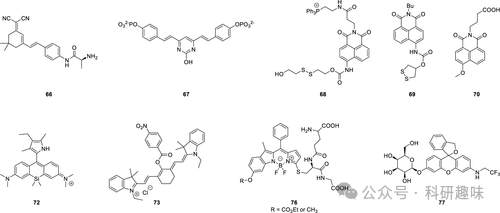
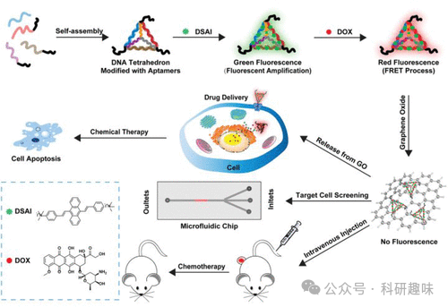

 

#  【癌症荧光探针】用于肝癌诊断的荧光探针 
 

Grenemal

读完需要

7

全文字数 2100 字

**疾病诊断荧光探针**

Fluorescent Probes for Disease Diagnosis

**肝癌荧光探针**

肝癌，作为全球面临的重大健康挑战，不仅是第四大死因，更是第六大常见癌症。其中，肝细胞癌（HCC）以其超过80%的诊断比例，成为了肝癌中发病率最高的类型。肝癌的形成往往与肝脏的损伤和疤痕紧密相关，这些损伤可能源于慢性炎症、酗酒、肝炎或脂肪肝等多种因素。由于肝癌的早期症状往往难以察觉，许多患者往往在病情发展到中期或晚期时才被确诊，这无疑为治疗带来了极大的困难，进而影响了患者的预后效果。因此，肝癌的早期检测显得尤为重要，这为实现早期干预提供了可能。例如，通过荧光检测技术来识别与癌症相关的生物标记物，已成为一种有效的肝癌早期诊断方法（如图26所示）。

图 26.肝癌、肺癌和卵巢癌的部分荧光探针。

癌症治疗中的一大难题在于复发风险，这往往源于手术切除的不完全性。因此，开发一种能够精准、快速地识别正常组织与肿瘤组织的工具显得尤为重要，因为它能有效降低癌症复发的风险。在胶质瘤的治疗中，CD13/氨基肽酶N（APN）作为一个关键的特异性标志物，因其与肝癌发展和转移密切相关而受到关注。基于此，Peng等人于2020年成功研发了APN响应型荧光探针66，旨在通过监测内源性APN活性来指导手术过程。 探针66的设计巧妙结合了二氰基异佛尔酮荧光团作为信号报告单元和l-丙氨酸元素作为识别位点。当探针与APN作用时，l-丙氨酸被特异性裂解，释放出二氰基异佛尔酮的胺基，从而触发ICT效应，在650纳米波长下发出强烈荧光。通过原位喷涂此探针，研究人员能够清晰地区分肿瘤组织与正常组织，并在皮下肿瘤、肝脏和脾脏转移瘤中分别获得了13.86、4.42和6.25的荧光强度比（肿瘤/正常，T/N）。尤为重要的是，探针66能够精确识别和切除小于1毫米的肿瘤转移灶，为癌症诊断和图像引导手术提供了新的可能。

在癌症诊断领域，Yao等人于2012年开发了一种名为TP荧光探针67的创新工具，用于内源性磷酸酶活性的成像研究。该探针通过在2-羟基-4，6-双（4-羟基苯基）嘧啶染料的两个酚羟基单元上连接吸电子的磷酸基团，实现了对荧光的抑制。当探针67与磷酸酶作用时，这些磷酸基团发生水解，从而恢复了荧光，为内源性磷酸酶活性的监测提供了直观的信号。利用这一探针，研究人员不仅成功观察到了肝癌细胞内磷酸酶活性的变化，还将其应用于果蝇大脑中100μm深度内的磷酸酶活性成像。

Kim及其团队于2012年设计了一种名为探针68的线粒体靶向荧光探针，旨在用于线粒体硫代氧化酶（Trx）活性的成像分析。该探针结合了萘二甲酰亚胺荧光团、三苯基膦线粒体靶向单元以及作为荧光开关的二硫键。在Trx的作用下，二硫键被还原性裂解，生成硫醇，进而对邻近的氨基甲酸酯进行分子内攻击，释放出荧光氨基萘二甲酰亚胺。通过这一机制，探针68能够在低至53 nM的浓度下检测到Trx，使研究者能够观察到HepG2癌细胞线粒体中Trx的活性。这一发现为深入理解Trx的生物功能提供了新的视角。

与Trx相关的研究不同，Fang等人在2014年设计了一种名为探针69的新型荧光探针，用于检测哺乳动物硫氧还蛋白还原酶（TrxR）。该探针由萘二甲酰亚胺荧光基团和1，2-二噻烷反应“传感”单元组成。在还原性条件下，二硫键被裂解，释放出游离硫醇，进而对邻近的氨基进行脱保护，从而恢复荧光氨基萘二甲酰亚胺的荧光。探针69具有高灵敏度和良好的选择性，能够区分不同TrxR活性的细胞提取物。此外，通过荧光细胞成像实验，研究人员发现荧光信号随肿瘤细胞中TrxR活性的变化而变化，为筛选TrxR抑制剂和进一步探索TrxR介导的生理过程提供了有力的工具。

在药物代谢和毒性评估方面，Yang等人于2015年报道了一种比率型TP荧光探针70，用于检测人类细胞色素P450 1A（CYP1A）。通过对萘二甲酰亚胺核心进行C-4取代基筛选，研究人员成功调节了系统的ICT荧光特性。其中，甲氧基对CYP1A具有良好的亲和力，而N-羧丙基取代基则赋予了探针对CYP1A而非其他CYP同工酶的高度选择性。在CYP1A的作用下，探针70通过甲氧基C-O键的氧化裂解转化为释放荧光的4-羟基萘二甲酰亚胺。体外实验表明，随着CYP1A浓度的增加，452纳米波长处的荧光逐渐降低，而564纳米波长处的荧光则相应增加。这一特性使得探针70能够在HepG2细胞和肝细胞等癌症相关细胞实验中按比例测定CYP1A的浓度。

2021年，Tang等人成功研发了一种基于氧化石墨烯的荧光纳米材料（探针71），专门设计用于体内肝癌的高效诊断与治疗。该创新材料由几个关键组件构成：首先，通过自组装技术，适配体修饰的ssDNA形成稳定的DNA四面体（DNA-tetra）结构；其次，该结构被赋予化疗药物多柔比星（DOX）和基于聚集诱导发光（AIE）的荧光团DSAI。这一设计中，DOX与DSAI间的荧光共振能量转移（FRET）过程显著增强了DOX的荧光信号，使得整个纳米材料在激发下发出明亮的红色荧光。

值得注意的是，ssDNA支架上的发夹型适配体修饰使其能够与氧化石墨烯表面形成紧密的氢键结合，进而有效地淬灭荧光信号。然而，当探针71进入肝脏肿瘤细胞时，由于细胞内部环境的特异性，适配体与DNA纳米材料一同从氧化石墨烯表面释放，同时释放出DOX和DSAI，不仅引发了强烈的荧光信号变化，还触发了对癌细胞的杀伤作用。

在体外和体内实验中，探针71均展现出了优异的生物相容性，这为其在肝癌成像诊断与治疗领域的应用提供了强有力的支持。这种新型多功能材料不仅为肝癌的诊断提供了高灵敏度和高特异性的工具，还通过其携带的化疗药物实现了对癌细胞的直接杀伤，展现了在癌症治疗领域的巨大潜力。此外，这种组合材料的成功开发也为未来开发用于药物输送、疾病诊断与治疗的多组分材料提供了有益的启示。

图 27.用于诊断和治疗肝癌的氧化石墨烯荧光 DNA 材料（探针 71）。

**点击蓝字 关注我们**

预览时标签不可点

素材来源官方媒体/网络新闻

  继续滑动看下一个 

 轻触阅读原文 

    

