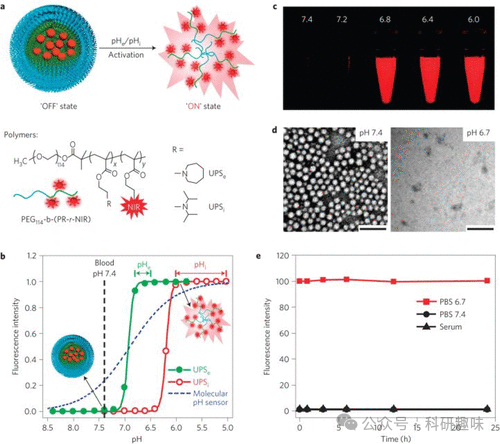

## **肺癌荧光探针**

根据世界卫生组织（WHO）的统计数据，2020年新增肺癌患者预计将超过221万，且肺癌死亡人数将超过180万，使肺癌成为最具致命性的癌症之一。当前，肺癌的主要致病因素包括吸烟、慢性肺炎以及环境暴露。肺癌的临床表现错综复杂，其症状主要取决于肿瘤的具体位置和类型。类似肝癌，肺癌的早期症状往往轻微甚至无明显症状，因此实现早期发现成为一项重大挑战（图 26）。

在活性氧种类（ROS）研究领域，Guo等人于2017年开发了探针72，该探针被设计用于特异性成像肺肿瘤细胞溶酶体中的ROS。探针72中的Si-罗丹明荧光核心通过与之相连的吡咯的光诱导电子转移（PeT）效应被淬灭。吡咯部分易于被高活性ROS如HOCl、-OH和ONOO-等氧化（类似于乳腺癌探针60），从而中和淬灭作用，使探针在680纳米处发出强烈的红色荧光信号。探针72对自氧化和光氧化均展现出良好的稳定性。在β-拉帕酮刺激的非小细胞肺癌人体模型中，该探针成功实现了对癌细胞溶酶体中ROS变化的实时成像，有力证明了其区分正常细胞和癌细胞的能力。

Li和Feng等人于2015年开发了探针73，这是一种基于近红外波段的荧光探针，用于检测缺氧肿瘤中硝基还原酶（NTR）的活性。经过对五种不同修饰的氰基染料衍生探针的探索，作者最终选择了探针73的设计。探针73的特征结构为对硝基苯甲酸酯，该结构在NTR的作用下被还原为对氨基苯甲酸酯，从而导致荧光显著增强。体外研究表明，探针73在NTR作用下荧光增强达110倍，表现出良好的响应性。细胞和体内实验进一步证实，这种荧光探针能够特异性地成像肿瘤中的NTR，并可用于描述肿瘤部位的缺氧状态。这充分表明，许多简单合成、成本较低的传感器/化学模拟物在复杂生物分子过程的研究中能够产生卓越的效果，并为我们提供深刻的见解。

最后，鉴于pH值在肿瘤微环境中的重要性，Gao等人于2014年开发了一种对pH值敏感的纳米探针，用于检测小鼠体内的肿瘤组织（图 28）。他们的纳米探针（探针74和75）由三个关键部分组成：一个独特的pH敏感疏水胶束作为核心、RGD序列作为靶向基团以及青色荧光团。每个纳米粒子所包含的pH识别单元和荧光单元的数量均经过精确优化，以实现最佳响应性能。利用这种探针，研究人员能够准确地区分肿瘤组织和正常健康组织。

图 28.（a） UPSe（探针 74）和 UPSi（探针 75）的结构。（b） UPSe 和 UPSi 纳米探针的归一化荧光强度与 pH 值的函数关系。（c） UPSe-Cy5.5 纳米探针溶液在不同 pH 值缓冲液中的荧光图像。（d） UPSe 纳米探针的透射电子显微照。（e） UPSe 纳米探针的稳定性实验。

