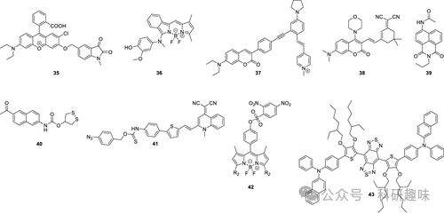
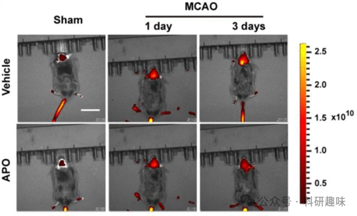

## **中风荧光探针**

中风，亦称为脑血管意外（CVA），是一种紧急医疗状况，它涉及大脑某个区域的血液流动中断或显著减少，进而导致脑组织出现缺血性损伤。中风的典型症状涵盖面部、手臂或腿部的突然麻木或无力，言语表达和理解上的困难，视力异常，头晕以及剧烈的头痛。这些症状的长期影响可能极为严重，包括不可逆的脑损伤。鉴于中风的严重性，目前已有大量研究致力于其早期诊断和治疗方法的探索（如图15所示）。

图 15.部分中风荧光探针。

在探讨中风的病理机制中，ROS（活性氧物种）和RNS（活性氮物种）再次扮演了至关重要的角色，它们在血液和血管组织中的浓度与中风的发病密切相关。Liu等人在2020年设计了一种双光子荧光探针35，专门用于ONOO-（过氧亚硝酸根）的检测。该探针以罗丹明衍生物为荧光团，结合1-甲基吲哚啉-2，3-二酮作为ONOO-的特异性反应位点。探针35不仅能够成功追踪活细胞和斑马鱼体内的内源性ONOO-，还能通过TP（双光子）显微镜实时观察缺血性和出血性中风大鼠脑微血管中的ONOO-。这一突破性的设计解决了长期以来使用光学探针区分ONOO-与其他ROS/RNS的难题，为评估与ONOO-相关的生理和病理事件，尤其是中风，提供了有力的工具。

据Li在2019年的报道，已成功开发了36号探针，用于在中风模型中成像ONOO-。在该探针中，对羟基苯胺被选为ONOO-感测的反应性触发器，而α-氯苯并-BODIPY作为荧光团。探针36能够轻松穿越BBB（血脑屏障），追踪微血管中的ONOO-，并对缺血引起的脑损伤进行成像。这一特性使其能够实时监测血栓形成过程和早期缺血时大脑中ONOO-的过度生成，为研究ONOO-在中风神经血管损伤进展过程中的分子作用提供了一种极具前景的工具。

2022年，James等人设计了一种独特的TP比率荧光探针37，用于实时监测氧-葡萄糖剥夺/再氧合（OGD/R）过程中的自噬和氧化应激。ONOO-能够轻易地将炔烃单元氧化为相应的醛，导致分子共轭结构和分子内电荷转移发生显著变化，进而影响其吸收和荧光发射特性。探针37能够对OGD/R过程中的自噬和氧化应激进行实时的比率分析和可视化。研究结果显示，在细胞OGD/R过程中会产生ONOO-，引发细胞氧化应激，并在大约15分钟后出现自噬信号。这一成果为开发新型的中风诊断、治疗和药物设计内聚系统提供了巨大的潜力。

同样在2022年，Li等人专注于自噬成像的研究，成功构建了溶酶体靶向荧光探针38。该探针以香豆素衍生物为TP荧光团，结合乙烯基偶联异佛尔酮衍生物作为粘度传感单元，并通过吗啉衍生物实现溶酶体的定位。这一设计使得探针能够准确检测溶酶体粘度，进而实现自噬水平的原位检测和评估。研究结果表明，中风期间自噬水平显著升高，而抑制氧化应激则能有效降低自噬程度（如图16所示）。这一发现证实了中风引发的氧化应激可导致自噬的发生。

图 16.在大脑中动脉闭塞（MCAO）过程中，使用探针 38 在不同时间段对不同处理方法下的大脑自噬进行活体成像：Sham 组（未进行 MCAO 的小鼠）、MCAO 组（进行 MCAO 的小鼠）、载体组（向小鼠尾静脉注射生理盐水）和 APO 组（向小鼠腹腔注射阿朴霉素）。

2016年，Wang等人成功开发了一种对Fe²⁺具有高灵敏度和选择性的“关-开”型荧光探针39，鉴于Fe²⁺在缺血性脑卒中相关氧化应激中的关键角色。该探针融合了萘二甲酰亚胺荧光团和可还原的O-酰羟胺作为Fe²⁺的特异性识别单元。通过探针39，研究人员能够监测Zn²⁺诱导的脑细胞中Fe²⁺的释放，并观察到缺血脑组织中Fe²⁺水平的显著升高。

鉴于中风与脑部氧化应激的紧密联系，以及硫氧还蛋白还原酶（TrxR）在维持细胞氧化还原平衡中的核心作用，研究者们开发了专门用于监测中风模型中TrxR活性的探针。其中，TP荧光探针40是通过将1，2-二硫环戊烷分子与带有氨基甲酸酯连接体的2-乙酰基-6-氨基萘荧光团结合设计而成。这一系统不仅通过TP荧光成像技术追踪了TrxR在斑马鱼体内的分布，还揭示了脑缺血再灌注损伤后小鼠脑内TrxR功能的下降，从而证明了TrxR作为中风潜在治疗靶点的价值。

2022年，James等人开发了一种新型的近红外荧光探针41，该探针通过H₂S触发和H₂S释放机制，实现了对铁突变的高保真原位成像。探针41采用偶氮苯作为硫化氢的识别单元，并通过硫代氨基甲酸酯（H₂S前体）与喹啉乙腈荧光团相连。连接体的旋转能力使得探针分子具有可调节的荧光输出，受粘度影响。因此，探针41在高粘度环境中对铁突变进行特异性成像时，展现出高灵敏度（LOD = 1.3 nM）和高选择性。细胞实验表明，尽管有无探针41在麦拉宁诱导的铁突变过程中无明显差异，但硫化氢触发和释放机制的应用显著提高了成像的准确性，避免了探针本身对铁突变的干扰。

同年，Gu等人合成了一种用于检测谷胱甘肽（GSH）的荧光探针42。该探针基于BODIPY荧光支架，在3位上引入了2，4-硝基苯磺酸作为GSH的识别基团。为了验证探针的实用性，研究者构建了OGD/R和MCAO模型来模拟中风条件，并利用探针42在体内外对脑缺血再灌注（I/R）过程中的GSH进行了荧光成像。这一方法特别突出了再灌注过程中氧化还原平衡的紊乱，证明了探针42在时空上的高度特异性。这不仅为脑缺血再灌注的研究提供了新的视角，还作为高灵敏度成像平台，为术后器官诊断等临床应用提供了有力工具。此外，该方法还可扩展至其他涉及细胞脱氧和复氧的病理生理过程。

Hong等人于2022年开发了一种基于苯并双（1，2，5-噻二唑）（BBTD）结构的近红外-II（1000-1700纳米，第二个近红外窗口）荧光探针43。在此探针中，BBTD作为电子受体，而3，4-双（烷氧基）噻吩环和N，N-二苯基萘-2-胺（BPN）则作为电子供体。噻吩单元上的3，4-双（2-乙基己氧基）链不仅作为良好的电子供体，还增大了BBTD与噻吩之间的二面角（达52°），从而显著改善了探针的AIE（聚集诱导发光）特性（I/I₀ &gt; 13）。探针43展现出了强烈的AIE特性，在近红外-II区的荧光量子产率高达14.45%。Hong的研究进一步证实，探针43是一种有效的成像剂，可用于缺血性中风的图像引导药物治疗。此外，他们还利用探针43证明了灯盏细辛注射液在促进血管生成、保护缺血性脑部方面的潜在作用。

   

