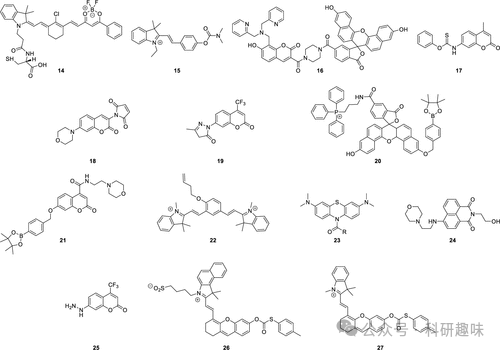
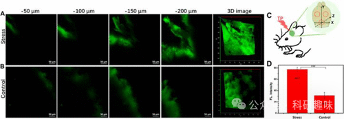
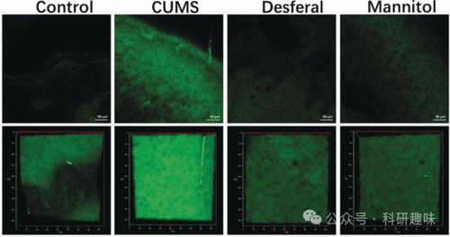

## **抑郁症荧光探针**

抑郁症，作为一种以持续低落情绪为主要特征的神经系统疾病，给重度患者带来了生活质量的普遍下降以及严重的自残风险。然而，遗憾的是，抑郁症的发病机理尚未明确，这无疑为新疗法（如抗抑郁药物）的开发带来了极大挑战。因此，科研人员正积极投入于研究抑郁症的分子和生物机制，旨在通过开发一系列新型探针，以实现对与抑郁症相关的生物标记物的精准感知、可视化以及追踪（如图8所示）。这些努力将有助于我们更深入地理解抑郁症的病理过程，从而为未来的治疗策略提供科学依据。

图 8.部分抑郁荧光探针。

脑源性神经营养因子（BDNF，又称abrineurin）在抑郁症的发病过程中扮演着至关重要的角色。鉴于高尔基体在proBDNF加工中的核心作用，其微环境（特别是极性）被认为与BDNF水平紧密相关，从而推测高尔基体极性的变化可能作为抑郁症发展的一个潜在标志。为了监测这一变化，Tang及其团队在2019年报道了一种半胱氨酸衍生探针14，该探针以高尔基体为靶点，通过美蓝和二氟硼酸苯甲酰分别作为电子供体和受体基团，利用激发态分子内电荷转移（ICT）来检测高尔基体的极性。在极性环境中，由于溶解探针与溶剂间的偶极-偶极相互作用，激发态能量被耗散，导致探针14发出较弱的荧光。相反，在非极性介质中，随着极性的降低，探针14的荧光显著增强。研究发现，抑郁表型小鼠大脑中的高尔基体极性显著高于非抑郁小鼠，这可能导致BDNF合成减少，为抑郁症的诊断提供了新的视角，并为探索其发病机制提供了有力的工具。

另一个与抑郁症紧密相关的因素是乙酰胆碱酯酶（AChE），其抑制剂在缓解某些抑郁症状中展现出潜在价值。为了监测抑郁小鼠大脑中AChE的活性，2019年研究者们开发了一种双光子（TP）荧光探针15。该探针采用新斯的明（neostigmine）作为AChE的识别基团，并结合梅洛青（merocyanine）作为荧光团。探针15在未被激活时显示微弱的荧光，这是因为其苯酚基团被二甲基氨基甲酸酯所掩蔽，削弱了其电子供能能力，从而抑制了基于ICT的推拉电子效应。然而，当探针15与AChE接触时，酯键被裂解/水解，释放出强供体苯酚，从而激活荧光团，产生强烈的荧光信号。探针15对AChE显示出高度的选择性。此外，研究还发现，乙酰胆碱酯酶的活性与抑郁表型呈正相关（图9）。因此，探针15不仅为探索AChE相关疾病提供了有力的工具，还为抑郁症的治疗策略提供了有价值的参考信息。

图 9.用探针 15 对应激小鼠（A，连续 14 天的慢性束缚应激）和对照组小鼠（B）大脑进行原位 TP 荧光成像。（C）三种不同的 TP 荧光成像区域示意图。（D）A 和 B 中小鼠的相对荧光强度：480-650 纳米。标尺 = 50 μm。

N-甲基-D-天冬氨酸（NMDA）受体，作为离子谷氨酸受体的一种关键亚型，不仅作为离子通道蛋白在神经元发育和突触可塑性中扮演核心角色，其活性还受到调节结合伙伴（如Zn²⁺和H⁺）的密切影响，从而影响神经抑制过程。为了深入探究这一关系，2020年成功开发出一种双色荧光探针16，该探针能够同步监测抑郁小鼠大脑中Zn²⁺和H⁺的浓度变化。该探针融合了荧光素作为荧光团，利用DPA（2，2′-二二甲胺）作为Zn²⁺的特异性识别基团，以及萘荧光素作为酸敏感的质子识别单元。研究揭示了DPA基团通过光诱导电子转移（PeT）机制抑制了香豆素核心的荧光。一旦与Zn²⁺结合，PeT被阻断，导致在460纳米波长处产生明亮的蓝色荧光。同时，在酸性条件下，萘荧光素基团会经历可逆的醌型至螺内酯型的转变，导致680纳米波长处的红色荧光强度降低。这一发现表明，在氧化应激条件下，PC12细胞中的Zn²⁺和H⁺水平均有所上升。而在具有抑郁症样行为的小鼠大脑中，Zn²⁺浓度和pH值均呈现下降趋势，这暗示了Zn²⁺、H⁺水平以及NMDA受体活性的变化可能与抑郁症的发病机制相关联。

如前文所述，ROS的过量生成会导致大脑氧化应激，进而损害蛋白质、核酸等生物大分子，这可能是抑郁症发病的潜在因素。因此，内源性还原剂Cys的成像技术成为评估氧化应激的重要工具。基于此，2020年开发了一种TP荧光探针17。当Cys与探针中的硫代羰基发生选择性亲核加成反应时，会形成一个稳定的五元硫唑啉环，与香豆素产生基于ICT的推拉电子效应，从而显著增强荧光信号。利用该探针，研究者们成功追踪了抑郁样行为小鼠大脑中的Cys水平，并发现Cys水平与抑郁样行为程度呈负相关，这与ROS/氧化应激的增加与抑郁状态的正相关关系相吻合。

为了进一步研究抑郁症中Cys的变化，Ma等人在2022年提出了一种新的荧光探针18，专门用于监测Cys水平。该探针以香豆素为荧光团，马来酰亚胺基团作为Cys的特异性识别基团。在未与Cys结合时，荧光团与马来酰亚胺基团之间的PeT效应抑制了荧光发射。而当Cys的硫醇基团与马来酰亚胺发生加成反应后，PeT效应减弱，探针的荧光特性得以恢复。Ma及其合作者观察到Cys水平与抑郁程度之间的负相关关系，这一发现与探针17的研究结果相呼应。这两项互补性研究不仅展示了设计此类探针的通用原则，还突出了其在研究神经疾病中生物巯基（尤其是Cys与抑郁症关系）方面的潜力。

在众多内源性ROS中，羟基自由基（-OH）因其强大的氧化能力而备受关注，它能严重破坏生物大分子，加速细胞衰老，并可能诱发神经系统疾病。为了探究-OH浓度变化与抑郁症之间的联系，2019年开发了一种特异性检测-OH的探针19。该探针采用带有β-三氟甲基取代基的香豆素作为荧光团，这一取代基不仅增强了香豆素的推拉效应，还提高了其亲脂性，有助于探针穿过血脑屏障（BBB）。在羟基自由基的作用下，探针中的3-甲基吡唑酮识别单元经历单电子氧化导致吡唑酮开环，形成一个高效的ICT荧光体系，从而显著增强荧光发射。通过探针19，研究者们成功地对抑郁样行为小鼠大脑中-OH含量的增加进行了成像（图10）。这一研究结果表明，-OH可能通过抑制SIRT1的活性参与抑郁症的发病过程，进一步证明了探针19是研究-OH相关疾病的有力工具，对于深入理解抑郁症的分子机制具有重要意义。
图 10.探针 19 对小鼠体内羟自由基的原位 TP 成像。对照组：无 CUMS 的小鼠。CUMS：易受 CUMS 影响的小鼠。去铁剂：注射去铁胺的易感小鼠。甘露醇注射甘露醇的易感小鼠。荧光图像使用 800 纳米光源获得。三维图像（第二行）由轴向（z）增量为 2 μm 的横截面（xy 截面，400 μm）堆叠生成。荧光发射窗口：400-650 纳米。比例尺 = 50 μm。
在深入探究抑郁症模型中的ROS成像技术的同时，研究者们还开发了一系列探针，旨在成像除羟基自由基（-OH）外的其他ROS，如过氧化氢（H₂O₂）、臭氧（O₃）、次氯酸（HClO）或次溴酸（HBrO）。例如，2022年研发的荧光探针20和21分别针对线粒体和溶酶体中的H₂O₂进行了检测。这两款探针均基于广泛应用的苄基频哪醇硼酸酯过氧化物识别单元。探针20以荧光素为荧光团，结合三苯基膦作为线粒体靶向分子；而探针21则结合香豆素荧光核心和吗啉基溶酶体靶向单元。荧光成像技术揭示了线粒体H₂O₂可影响小鼠大脑溶酶体中葡萄糖脑苷脂酶的活性。

臭氧作为一种ROS，会通过臭氧分解与不饱和脂肪酸反应，生成更多具有强氧化性的活性ROS，从而对细胞关键成分造成进一步损害。2019年，研究者使用近红外荧光探针22直接在小鼠大脑中观察到了臭氧的存在。该探针基于氰基-7型荧光团前体，并通过3-丁烯基官能团与O₃发生环加成（臭氧分解）反应。此系统特定的环化反应导致氧化、碎裂和重排，最终产生相关醌，从而在与O₃反应时产生明亮的近红外荧光发射。与正常小鼠相比，抑郁症模型小鼠脑组织中O₃的原位成像显示有所增加，提示臭氧可能通过诱导过量IL-8的生成而诱发抑郁症。

为间接评估神经递质释放和抗抑郁药效果，研究者开发了多功能荧光平台23用于监测HClO。该平台基于亚甲基蓝（MB）构建，亚甲基蓝因其出色的抗炎特性和光学性质而广受认可。神经递质或抗抑郁药通过脲键与MB共价连接，这种脲键仅能被HClO特异性裂解。行为学测试和生化分析表明，探针23能有效降低ROS水平，缓解氧化应激/炎症，并减轻小鼠的抑郁症状。与常用抗抑郁药相比，探针23采用协同治疗策略，展现出更优的抗抑郁效果、更少的副作用和更短的治疗时间。此外，探针23还成功实现了对小鼠抑郁症的初步诊断，为抑郁症的诊断和治疗提供了一个新的、有前景的平台。

鉴于次溴酸（HOBr）的潜在危害，2022年研究者设计了TP荧光探针24，用于实时监测和可视化活体系统中的HOBr水平。该探针由1，8-萘二甲酰亚胺荧光团和N-（2-氨基乙基）-吗啉溶酶体靶向基团组成，其中1，2-氨基乙醇基团有助于提高溶解度。当吗啉被HOBr氧化时，通过SEAr反应生成多取代的荧光萘二甲酰亚胺。该探针表现出出色的选择性、快速响应时间（5秒）和高灵敏度（LOD = 15 nM）。探针24成功检测了炎症组织、乳腺癌模型以及抑郁症小鼠大脑中增加的HOBr水平。

丙二醛（MDA）和甲醛（FA）作为高活性、毒性和亲脂性的活性羰基物种（RCS），能够轻易穿透血脑屏障（BBB），对大脑内蛋白质功能造成损害，可能与抑郁症等脑部疾病相关。为解决这一问题，2022年研究者开发出一种TP荧光探针25，能够同时检测MDA和FA，并产生光谱分辨信号。探针25的肼基作为识别基团，与MDA反应生成吡唑，与FA反应生成肼基，从而实现MDA和FA的准确区分。类似探针19，三氟甲基的引入有望增强探针穿越BBB的能力，实现在活体组织中检测MDA和FA。探针25在活细胞和体内同时对MDA和FA进行成像，首次证明抑郁症小鼠大脑中MDA和FA的浓度高于正常健康小鼠。

去甲肾上腺素（NE）水平与抑郁症密切相关，赵等人于2023年合成了探针26，实现了近红外荧光光声（PA）成像。该探针以氰基为荧光团，添加磺酸基团以提高溶解性和生物相容性，同时利用酚羟基作为反应位点，并通过与NE-选择性甲苯硫醚基团进行官能化。因此，采用探针26的大脑可视化技术不仅可用于诊断模型小鼠的抑郁症，还能监测药物干预对NE水平的影响。

Yin等人于2022年开发了一种类似的探针27。虽然“正常”细胞和“抑郁”细胞之间的NE基线含量无显著差异，但在暴露于高钾水平时，抑郁细胞分泌的NE却少于正常细胞。这一发现揭示了NE在抑郁症病理过程中的潜在作用。该研究还评估了抗抑郁药和G蛋白偶联受体拮抗剂对抑郁细胞和正常细胞的影响，进一步证实了NE的外排与抑郁症之间的关联，并提示抑制NE受体可能会影响NE的释放。

探针27的设计基于先进的荧光成像技术，其独特的分子结构使其能够高选择性地与NE相互作用，并在近红外区域产生强烈的荧光信号。这种近红外荧光成像技术具有出色的组织穿透能力和低背景干扰，使得在活体动物模型中实时监测NE水平成为可能。

通过利用探针27进行的研究，研究者们不仅加深了对NE在抑郁症中作用机制的理解，还为开发新的抗抑郁药物提供了有力的工具。此外，该探针还可用于评估抗抑郁药物的治疗效果，为个体化治疗方案的制定提供重要依据。

总之，随着化学和材料科学领域的不断进步，越来越多的先进技术和方法被应用于生物医学研究中。通过开发新型荧光探针，研究者们能够更深入地了解抑郁症等复杂疾病的病理机制，并为开发更有效的治疗方法提供新的思路。

   

