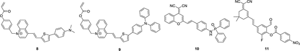
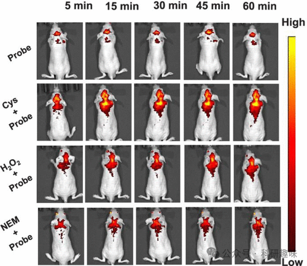

 

#  【神经疾病诊断探针】用于癫痫诊断的荧光探针 
 

Grenemal

读完需要

5

全文字数 1500 字

**疾病诊断荧光探针**

Fluorescent Probes for Disease Diagnosis

**癫痫的荧光探针**

荧光探针在癫痫研究中已成为一种备受青睐的方法（如图4所示），癫痫作为一种神经系统疾病，其特征在于脑电活动的异常紊乱，进而引发不受控制的癫痫发作或抽搐。癫痫发作的临床表现多样，包括但不限于意识丧失、肌肉痉挛以及感觉障碍等。然而，遗憾的是，癫痫的治疗仍然面临诸多挑战，迫切需要开发新的、更有效的治疗方法。这种迫切的需求推动了荧光探针在癫痫成像及其病理机制理解方面的深入研究。通过荧光探针技术，我们能够更深入地了解癫痫在分子和细胞层面的变化，为开发新的治疗方法提供重要依据。

图 4.部分癫痫荧光探针。

癫痫，与注意力缺失症相似，其显著特征之一是大脑内氧化应激的加剧。在研究氧化应激的过程中，硫醇半胱氨酸（Cys）作为一个关键生物还原剂，直接参与细胞内ROS（活性氧物种）的调节，因此备受关注。有研究表明，血浆中半胱氨酸水平的降低可作为颞叶癫痫的生物标志物，这暗示了持续存在的氧化应激状态。

2020年，Li及其合作者报道了一种名为探针8的近红外发射成像探针，该探针能够追踪戊四唑（PTZ）诱导癫痫发作期间大脑中的内源性Cys。探针8的设计基于Mito-Q荧光团，并融入了N，N-二甲基氨基电子供体、喹啉阳离子电子受体（形成推拉式分子内电荷转移（ICT）结构）以及丙烯酸酯结构（作为Cys识别位点）。探针8展现出优异的血脑屏障（BBB）穿透性，通过静脉注射后能迅速进入大脑，进而绘制Cys的分布图。

在多种生物模型中，包括培养细胞、斑马鱼和小鼠，探针8均能有效检测Cys浓度的变化，无论是外部添加的还是氧化应激引起的内源性变化（如图5所示）。这些发现为理解线粒体Cys水平与癫痫的发病、进展以及治疗策略之间的关系提供了新的视角。

图 5.活体小鼠腹腔注射各种影响 Cys 的制剂后，用探针 8 绘制 5、15、30、45 和 60 分钟的 Cys 通量图。

在Cys成像的荧光机制中，聚集诱导发光（AIE）技术备受关注，它特指分子在聚集或接近时发光的现象。基于此原理，He等人于2023年研发了探针9， 这是一种基于AIEgen的双通道Cys响应近红外荧光探针，旨在实现脂滴和线粒体的特异性成像。探针9的设计结构类似于探针8，包含三苯胺基团作为脂滴靶向分子、喹啉基团作为线粒体靶向分子，以及丙烯酸酯基团以实现Cys的特异性识别。利用探针9，He等人通过免洗荧光生物成像技术，成功监测了细胞凋亡过程中线粒体和脂滴中的Cys水平（双通道）。在癫痫患者的细胞凋亡事件研究中，探针9揭示了线粒体Cys在癫痫中的重要作用，为癫痫的治疗和诊断提供了新的潜在靶点。

作为氧化应激的关键标志物之一，ONOO-的过表达在癫痫早期诊断中展现出极高的信息价值。为此，Yu及其合作者于2021年设计了一种近红外荧光探针10，用于追踪细胞和体内ONOO-水平的变化。该探针由近红外二氰基亚甲基-4H-吡喃（DCM）荧光团单元和二苯基膦酰胺识别分子构成。当暴露于ONOO-时，膦酰胺的P-N键断裂，释放出的苯胺为荧光系统提供自由电子，导致在685纳米波长处的荧光发射显著增强。探针10在癫痫模型大鼠的海马中成功追踪了内源性ONOO-，尤其在凯因酸盐诱导的癫痫模型中表现出色。此外，该探针还用于评估抗氧化剂白藜芦醇的效果，随着药物浓度的增加，荧光强度显著降低，表明ONOO-的过表达得到有效抑制。因此，探针10为实时监测神经组织中ONOO-的波动提供了强大工具，进一步助力癫痫疾病的诊断。

最后，去甲肾上腺素（NE）作为多种神经系统疾病的关键生物标志物，包括癫痫，因其在神经递质调节中的核心作用而备受关注。Yin等人于2023年采用了一种创新的“狩猎-射击”设计策略，通过探针11克服了NE检测中特异性不足的难题。探针11的荧光团基于2-（环己-2-烯-1-亚基）丙二腈衍生物，并配备了一个悬挂的醛作为反应单元。醛与NE反应后，4-硝基苯甲酸酯荧光掩蔽基团脱落，释放出高荧光性物质。这种探针能够高效穿透BBB，用于观察癫痫前后小鼠大脑内NE释放的动态变化。通过对脑组织的解剖研究，可以绘制出癫痫前后NE在大脑不同区域的分布和水平变化图。

以上案例展示了荧光探针在穿越BBB并有效成像难以感应的生物标志物方面的成功应用，为神经系统疾病的发病机制研究和诊断提供了有力的工具。

**点击蓝字 关注我们**

预览时标签不可点

素材来源官方媒体/网络新闻

  继续滑动看下一个 

 轻触阅读原文 

    

