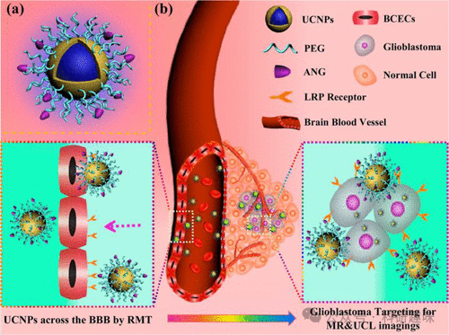
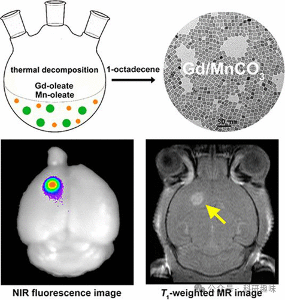
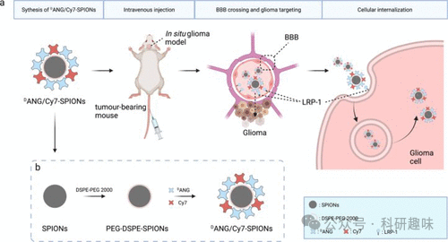
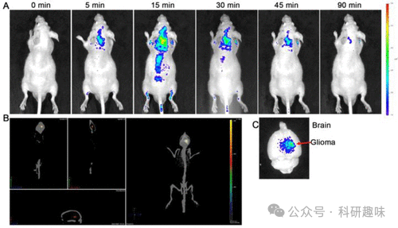
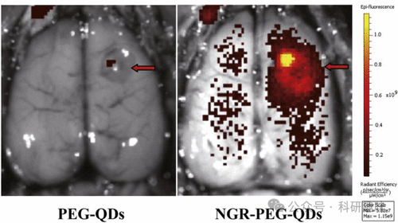
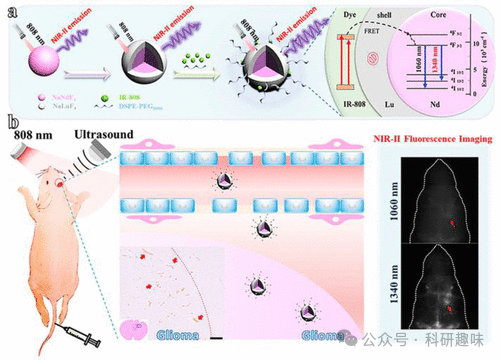
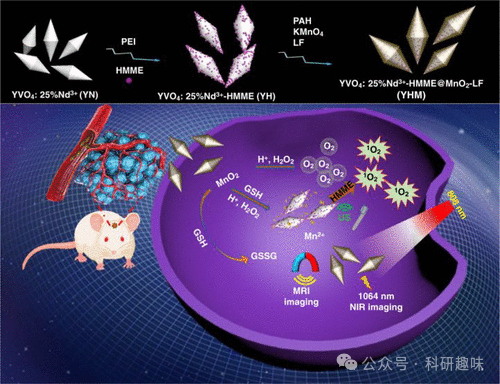

## **胶质瘤荧光探针**

胶质瘤，作为源自大脑或脊柱胶质细胞的一种原发性脑肿瘤，其常见临床表现涵盖头痛、癫痫发作、视力或听力异常，以及记忆力和注意力的减退。尽管当前临床实践中手术、放疗和化疗的综合治疗策略已取得一定成效，但仍有待进一步优化。鉴于此，荧光成像技术因其独特的优势，正被广大研究者应用于开发新型的手术导航、早期诊断以及优化治疗模式。

多功能材料，与先前探讨的小分子探针相比，因其在发挥多种功能方面的显著优势而备受瞩目。以2014年Shi等人研发的一种脑纳米探针（ANG/PEG-UCNPs，图17，探针44）为例，该探针不仅具备穿越血脑屏障（BBB）的能力，还能精准靶向胶质母细胞瘤（GBM），这是一种高级别且生长迅速的胶质瘤类型。该探针的核心结构由钆（III）修饰的上转换纳米粒子（UCNPs）构成，并锚定于聚乙二醇（PEG）基底之上，同时结合双靶向配体Angiopep-2（ANG， TFFYGGSRGKRNNFKTEEY）。这一配体能够特异性地与低密度脂蛋白受体相关蛋白结合，而后者在BBB和GBM细胞中均呈现过度表达的状态。

细胞和动物实验结果表明，探针44通过受体介导的内吞作用成功穿越BBB，并有效靶向GBM。这些双模纳米探针在无创荧光成像领域展现出巨大的应用潜力，尤其是在脑肿瘤的术前诊断和定位方面，其成像性能甚至超越了临床广泛使用的磁共振成像（MR）。这一研究成果不仅验证了利用荧光成像技术对胶质母细胞瘤进行诊断和定位的可行性，更为高效的肿瘤手术提供了有力的技术支撑。

图 17.（a） 双靶向探针 44 的设计。（b） 双靶向系统探针 44 的示意图，通过 LRP 介导的内吞作用穿过 BBB 并靶向胶质母细胞瘤，实现颅内胶质母细胞瘤的 MR 和 UCL 成像。

2015年，Ye等人成功报道了1 nm大小的掺钆MnCO₃纳米粒子，这些粒子通过锰油酸酯（探针45）的引导进行热分解处理，实现了对微小脑胶质瘤的精准靶向磁共振（MR）和荧光成像。（101） 在此研究中，研究者们巧妙地在MnCO₃纳米粒子中引入了钆（III）元素，并通过羧酸末端硅烷配体交换和PEG共轭技术，赋予了这些纳米粒子出色的水分散性和水稳定性。

为了进一步提升纳米粒子的功能性和应用潜力，探针45进一步融合了近红外染料5.5号氰基与靶向配体叶酸（FA），构建了一种多功能纳米探针。这种纳米探针巧妙地结合了核磁共振成像技术的高空间分辨率优势和荧光成像技术的高灵敏度特点（如图18所示），为早期胶质瘤的有效检测提供了强有力的工具。

图 18.多功能探针 45 的合成示意图以及近红外荧光图像和磁共振图像。

2021年，Pilar等人成功开发了磁共振成像（MRI）和荧光成像双重共轭的聚合物纳米粒子（CPNs），即探针46，用于检测胶质母细胞瘤（GBM）。 这些CPNs通过纳米沉淀法合成，其中金属氧化物磁核（Fe₃O₄/NiFe₂O₄纳米粒子）被巧妙地嵌入到油酸封端的基质中。所得的纳米粒子展现出优异的生物相容性和细胞渗透性。在静脉给药后，这些CPNs 46能够在异位GBM模型的肿瘤和排泄器官中被有效检测到，并成功应用于活体GBM的成像研究，为多模态成像探针的开发提供了新的方向。

同年，Gong等人报道了一种双模态成像纳米探针，该探针结合了磁共振成像（MRI）和近红外荧光（NIRF）技术，以实现体内恶性胶质瘤的精确定位。 这些纳米探针利用内源性触发配体Angiopep-2（ANG）来识别并结合在脑毛细血管内皮细胞和胶质瘤细胞上过度表达的低密度脂蛋白受体蛋白1（LRP1）。这种特异性识别使得ANG能够穿越血脑屏障（BBB）并直接靶向胶质瘤细胞。通过将超顺磁性氧化铁纳米粒子（SPIONs）与近红外荧光染料吲哚菁（Cy7）和ANG结合，Gong等人构建了一种双模式成像探针（图19，探针47）。探针47通过MRI和NIRF成像技术，能够精确地将纳米探针聚集在胶质瘤部位并进行检测。这一创新方法为术前诊断和术中定位提供了巨大的潜力，使探针47成为胶质瘤靶向造影剂领域的一个有前景的候选者。

图 19（a） 47 号探针的构造和功能示意图，包括其穿过 BBB 和靶向胶质瘤细胞的机制；（b） 其合成过程。

荧光碳点（CDs）以其低毒性、高稳定性、多功能性和生物可降解性等卓越特性，在荧光传感和成像领域展现出巨大的应用潜力。2015年，Sun等人以d-葡萄糖和l-天冬氨酸为前驱体，成功合成了胶质瘤靶向的碳点（CD-Asp），即探针48。该探针48展现出极高的生物相容性，无需引入额外的靶向分子即可实现对胶质瘤细胞的精准定位。体内成像研究进一步证实，探针48在胶质瘤部位的累积量显著高于正常脑组织，显示出其作为脑胶质瘤靶向荧光成像剂的巨大潜力（如图20所示）。此项工作不仅验证了CD-Asp在成像领域的有效性，更为构建集诊断、靶向和治疗于一体的智能纳米药物平台提供了有力的材料基础。

图 20.尾部静脉注射 48 号探针后胶质瘤小鼠的体内和体外成像。（A） 注射后探针 48 的全身分布与注射时间的关系。（B） 注射探针 48 20 分钟后探针 48 在大脑中分布的三维重建图。（C） 注射探针 48 90 分钟后的脑部活体成像。

2015年，Gao等人基于CD平台，开发了一种针对U87胶质瘤的生物成像探针（RGD-PEG-CDs，探针49）。该探针通过RGD配体特异性地识别肿瘤细胞和新生血管细胞上高表达的αvβ3受体，并通过PEG化处理有效附着于CD表面。体内实验显示，探针49能够主动靶向U87胶质瘤，并且肿瘤切片中的荧光分布证实了其对新生血管的靶向能力，这与αvβ3的高表达相吻合。

另一项创新研究来自Yuan等人，在2022年报道了仿生物纳米探针Pdots-C6，专门用于胶质瘤的靶向检测（探针50）。他们利用三苯胺（TPA）官能化的PTZ作为电子供体，苯并噻唑（BBT）作为电子受体，在PTZTPA-BBT聚合物骨架内诱导分子内电荷转移（ICT），从而制备出具有长波长光学活性的Pdots。接着，他们将Pdots包裹在C6胶质瘤细胞膜上，不仅增强了探针50的生物相容性和同源靶向能力，还显著提升了其在近红外-II区的胶质瘤成像效果。这一工作为胶质瘤精准诊断领域提供了一种仿生物纳米平台的新思路。

2017年，Cheng及其团队设计了一种纳米探针（QD-Apt），结合了PEG量子点（QDs）与适配体（探针51）的优势，用于肿瘤靶向检测。他们选用A32这一单链DNA（ssDNA），因其能特异性结合广泛存在于胶质瘤细胞表面的表皮生长因子受体变体III（EGFRvIII）。通过将A32与QDs表面耦合，成功构建了生物素-aptamer-共轭链霉亲和素-PEG-CdSe/ZnS QDs（QD-Apt）纳米探针，实现了对肿瘤的特异性结合。探针51在体内外均展现出强烈的荧光信号，并特异性地与EGFRvIII结合。此外，该探针还能在脑瘤小鼠模型中清晰描绘出U87-EGFRvIII原位胶质瘤的肿瘤边界，为外科医生提供精确指导，以实现胶质瘤的最大限度切除。探针51及其衍生系统的进一步开发，有望为胶质瘤的分子诊断、图像引导手术和术后监测提供强有力的工具。

同年，Cheng的研究团队还合成了另一种纳米探针（NGR-PEG-QDs），旨在实现胶质瘤和肿瘤血管的靶向检测（探针52）。这些纳米探针通过识别仅存在于肿瘤血管中的丙氨酸氨肽酶CD13，实现了对胶质瘤和肿瘤血管的高特异性成像。这是通过将能特异性识别CD13的生物素化天冬酰胺-甘氨酸-精氨酸（NGR）肽与阿维丁-聚乙二醇包覆的QDs共轭实现的。如图21所示，探针52能够穿越血脑屏障（BBB），对胶质瘤和肿瘤血管进行高效成像，并且可在低毒性浓度下工作，为临床纳米药物的发展提供了新的可能性。

图 21.尾静脉注射 PEG-QDs 或 NGR-PEG-QDs（探针 52）8 小时后大鼠脑部肿瘤的荧光成像。

在2014年的研究中，Xu等人成功合成了纳米荧光探针AsT（探针53）。他们将肽TGN与AS1411结合，用于靶向血脑屏障（BBB）递送。AS1411是一种富含鸟嘌呤的适配体，通过与胶质瘤中过表达的核素蛋白相互作用，引导纳米粒子导向胶质瘤细胞。TGN和AS1411通过PEG连接器巧妙耦合，而在AS1411的末端，研究人员添加了3号氰基荧光标签，以便追踪AsT纳米探针的动向。体外细胞摄取实验和胶质瘤球体摄取实验均显示，探针53能够被胶质瘤和内皮细胞有效摄取，并具备穿透内皮细胞单层及被胶质瘤球体摄取的能力。进一步的体内实验进一步证实了探针53能够高效且高强度地靶向胶质瘤。

2019年，Li及其团队合成了基于NaNdF4的纳米颗粒，这种纳米颗粒展现出强大的近红外-II荧光性能，为检测正位胶质母细胞瘤提供了新的可能性（图22，探针54）。他们在NaNdF4纳米粒子表面涂覆了一层惰性的NaLuF4，并通过近红外染料（IR-808）敏化，使其常规发射强度增加了10倍。研究人员巧妙地利用聚焦超声波将这些纳米粒子有效输送至肿瘤组织，从而暂时性地打开了小鼠的BBB。荧光成像和脑组织的稀土染色结果均证实，这些纳米粒子能够特异性地针对肿瘤，从而证明了染料敏化稀土纳米粒子在胶质母细胞瘤诊断中的潜在应用价值。这一研究不仅为利用弱长波长荧光增强近红外-II成像提供了新思路，也为未来胶质瘤的诊断和治疗开辟了新的方向。

图 22.（a） 水溶性染料敏化核壳 NaNdF4@NaLuF4/IR-808@DSPE-PEG5000 NPs（探针 54）的合成及其能量传递机制示意图。（b） 这些核壳 NPs 在超声波介导的 BBB 开放情况下应用于正位胶质母细胞瘤的近红外-II 荧光成像，并在送入大脑后对脑组织进行稀土染色。

Zhang等人于2022年成功研发了一种名为YHM的纳米治疗剂，该治疗剂在原位胶质瘤的诊断与治疗领域展现出显著潜力（如图23所示，标记为探针55）。在YHM的构造中，低能声子钒酸钇（YVO4）与Nd3+粒子构成了其核心部分，而超声敏化剂血卟啉甲醚则担任了载体的角色。尤为引人注目的是，MnO2纳米片不仅为原位胶质瘤提供了近红外-II/MRI成像的功能，还作为高效声动力治疗（SDT）的关键元件。

研究数据表明，探针55能够轻松穿越血脑屏障（BBB），进而实现对胶质瘤的近红外-II荧光和MRI成像。更为重要的是，探针55能在原位对胶质瘤实施SDT治疗。在这一过程中，MnO2外壳不仅释放氧气，还同时释放Mn2+离子，这一特性显著增强了SDT的治疗效果。这一发现不仅拓宽了掺稀土离子的YVO4发光纳米粒子的应用领域，也为胶质瘤的诊疗一体化提供了新的策略。

图 23.YHM 纳米疗法的组装和作用模式示意图。

   

