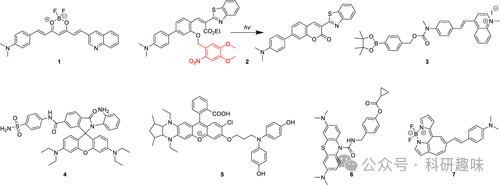
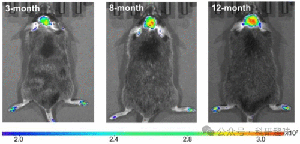

## **阿尔茨海默症荧光探针**

阿尔茨海默症（AD）是一种逐渐恶化的脑部疾病，严重影响个体的记忆、思维和行为能力，最终引发痴呆、严重的认知衰退及生活质量的显著降低。AD作为一种复杂的疾病，其确切的发病机制尚未明晰，但当前研究普遍认为，大脑中特定蛋白质（特别是淀粉样蛋白β，简称Aβ）的异常累积是疾病发展的关键。这些异常累积的蛋白质会形成淀粉样蛋白斑块，进而导致组织细胞的死亡和神经网络的严重损伤。因此，在AD的诊断和研究中，荧光探针（如图2所示）被广泛应用于检测典型的生物标志物，如Aβ以及氧化应激的一般生物标志物，如活性氧（ROS）和活性氮（RNS），这些标志物对于理解疾病进程和评估治疗效果具有重要意义。

图 2.部分阿尔茨海默症荧光探针。

Aβ是一种由36至43个氨基酸组成的多肽，通过β和γ分泌酶对淀粉样前体蛋白（APP）的水解作用生成。其异常沉积形成淀粉样斑块，与阿尔茨海默症（AD）的发病和疾病进展密切相关。Aβ特异性荧光探针的最新进展之一是由Qian及其团队在2021年开发的姜黄素衍生物探针1。这款探针能够利用多光谱光声断层扫描和荧光成像技术，对脑淀粉样变性进行精准检测。研究表明，探针1不仅能特异性地定量检测Aβ纤维，还能有效区分这些纤维与Aβ的单体形式。免疫组化分析进一步证实，在arcAβ小鼠的脑切片中，探针1与Aβ沉积物共定位，凸显了其高度的特异性。探针1在AD病理动物模型中的成功应用，为纵向监测Aβ治疗效果和揭示疾病演变机制提供了有力工具。

同样值得关注的是，Wang等人在2022年开发的探针2。该探针采用“光触发”荧光机制，能够检测Aβ聚集。在光照条件下，探针2中的6-硝基藜芦酰保护基团发生光裂解，导致酚基环化至邻近的酯上，进而产生荧光香豆素核心。这一新形成的荧光团虽荧光较弱，但结合Aβ后能产生强烈的局部荧光反应。实验证实，探针2在APP/PS1转基因AD模型小鼠体内能有效检测Aβ聚集，且光照后血脑屏障（BBB）通透性良好。这种创新的“光触发”方法为设计高信噪比、靶向特定蛋白质的荧光探针提供了新的思路。

氧化应激作为导致注意力缺失症的重要因素之一，由ROS或RNS的产生和积累失衡所引发。2023年，Wong及其合作者开发了荧光探针3， 该探针不仅能靶向Aβ，还能实时响应活细胞和AD小鼠模型中过氧化氢（H2O2）浓度的变化。探针3采用甲基喹啉鎓荧光单元和苯硼酸频哪醇酯（BPin）作为H2O2识别单元，具有较长的荧光波长（λem = 574 nm），适用于直接定位Aβ。一旦与斑块结合，探针3便能迅速与H2O2反应，氧化BPin并释放出新物种，该物种在更长波长（λem = 660 nm）下发光，从而实现对Aβ位点H2O2浓度变化的比率可视化和测量。研究显示，探针3能成功地对神经元细胞和AD小鼠模型中Aβ物种诱导的过氧化氢含量变化进行实时成像。

2022年，Ma及其同事开发了高尔基体靶向荧光探针4， 该探针能够检测AD小鼠体内的一氧化氮（NO）。探针4由6-羧基罗丹明B荧光团、4-氨基苯磺酰胺高尔基体靶向基团和邻二氨基苯NO传感基团组成。这款探针在检测NO方面展现了出色的高尔基体靶向能力和高特异性。利用探针4，研究人员发现Aβ诱导的AD中高尔基体内的NO水平显著升高。因此，探针4为高尔基体内NO的原位成像提供了宝贵的新工具，有助于揭示NO在疾病相关信号通路中的关键作用。此外，该探针还展示了荧光探针的“模块化设计概念”，通过替换2-羧基反应基团为其他生物靶向单元，即可识别不同的生物分析物，实现对高尔基体中多种生物分子的可视化。

Kim及其合作者于2022年发明了探针5， 这是一款用于检测过氧化亚硝酸盐（ONOO-）的近红外荧光探针。探针5采用二氨基取代的罗多染料NIR-Rd-3作为荧光团，结合4-氨基苯酚基团作为ONOO-的识别单元。通过探针5，研究人员成功实现了对AD小鼠体内ONOO-的原位成像（图3），并证明了ONOO-可作为AD的生物标志物。

图 3.不同年龄（3、8 和 12 个月）的 AD 小鼠通过尾部注射探针 5 进行体内荧光成像，显示随着年龄的增长，大脑中 ONOO- 的浓度也在增加。

在AD的诊断和研究中，丁酰胆碱酯酶（BChE）作为一个显著的靶点，其水平在疾病进程中呈现上升趋势。2021年，Ding等人巧妙设计并合成了基于BChE和ROS双“逻辑门”的荧光探针6。该探针融合了BChE特异性环丙基甲酸酯基团以及酰胺/酯键作为ROS反应基团，仅在同时与ROS和BChE反应时才会触发荧光信号，从而实现了高选择性和高灵敏度的双分析检测（LOD = 1.08 μg·mL⁻¹）。值得一提的是，Ding等人还深入探讨了具有不同连接长度的类似荧光团，并最终发现脲基和酚基之间的单亚甲基单元为最佳选择。

神经纤维缠结（NFTs），由异常高磷酸化的tau蛋白构成，是AD及其他tau病的典型特征之一。为了实现对NFTs的高特异性成像，Cui及其合作者在2022年研发了融合环庚三烯-BODIPY衍生物的荧光探针7。研究表明，探针7不仅能有效穿越血脑屏障（BBB），还能与NFTs特异性结合，从而在tau小鼠的大脑中清晰地识别NFTs。这一创新性的荧光探针为NFTs的成像研究提供了有力的工具。

   

