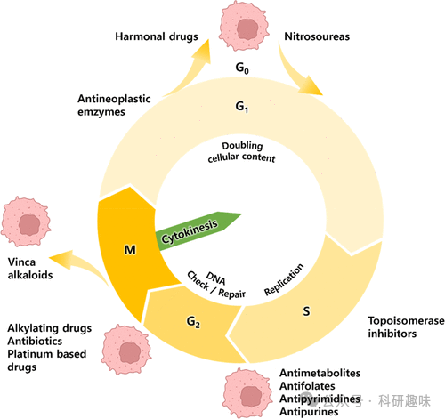
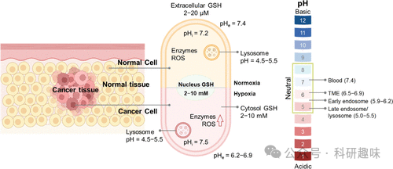

## **化疗中的治疗诊断荧光探针**

化疗的概念起源于1947年首次报道芥子气对淋巴组织具有损伤作用的研究，后续在动物模型（小鼠）中通过氮芥对淋巴瘤的有效抑制得到验证。化疗药物通过抑制癌细胞的增殖速度和缓解肿瘤负担发挥作用，利用癌细胞相较于正常细胞更快的生长速率和增殖特性，实现对前者更显著的抑制作用。随时间推移，多种抗癌药物应运而生，它们通过多样化的机制干预肿瘤发展，有的干扰细胞新陈代谢，有的则针对关键酶进行靶向。文献中记载的大部分药物作用于DNA损伤修复、DNA复制、免疫响应调节及细胞凋亡等关键细胞过程（图3），这些作用机制赋予了药物高度活性，但同时也限制了其对肿瘤组织的特异性，导致非目标组织的毒性副作用，即脱靶效应。为克服这一限制，通过结构改造，产生了治疗探针，这些探针能选择性靶向癌细胞或肿瘤微环境(TME)，并在适当条件下释放活性药物（药物本体），即便药物本体本身不具备选择性。掩蔽/去掩蔽策略是实现这一目标的关键，确保了治疗活性仅在癌细胞内释放。类似策略亦应用于可激活的诊疗性荧光探针的开发中。  
  

图3.临床实践中不同类别的化疗药物。G0-休息阶段；G1-生长；S——DNA合成和复制；G2-生长和有丝分裂准备；M-有丝分裂。肿瘤微环境(TME)与正常组织微环境在多个生理参数上存在显著差异，包括酸性pH值、活性氧(ROS)水平升高、细胞内谷胱甘肽(GSH)浓度增加、特定酶的过度表达以及还原性或乏氧条件，这些特征为区分恶性肿瘤与周围正常组织提供了依据（图4）。  
图4.正常组织和肿瘤组织不同微环境示意图[pH=细胞内pH；pHe=细胞外pH，ROS=活性氧]。本文后续将依据治疗探针在肿瘤微环境中的激活机制，对应用于化疗、光动力治疗(PDT)、光热治疗(PTT)、声动力治疗(SDT)、免疫疗法等多种治疗模式的探针进行细分讨论，以此突出不同策略在精准激活和治疗效果上的独特性。

