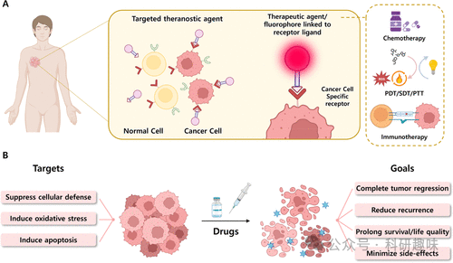

 

#  【诊疗探针】癌症治疗中的治疗诊断荧光探针综述 
 

**诊疗一体化荧光探针**

Theranostic Fluorescent Probes

**癌症治疗中的治疗诊断荧光探针**

肿瘤作为异常细胞集群，可分为良性与恶性两大类别。尽管两者间的区别构成了癌症病理学的核心议题，但简而言之，良性肿瘤，例如皮肤疣，通常局限于原始生长位置，不显著侵犯周围正常组织，也不发生远端转移。相反，恶性肿瘤则倾向于通过血液或淋巴系统扩散至全身，因此常被称作癌，其因具有扩散潜能，对局部治疗策略表现出更强的抵抗性。恶性肿瘤内部复杂的微环境，特别是通过多种机制促进的微环境协作，对于肿瘤细胞的存活、增殖及转移能力至关重要。

尽管癌症研究已取得显著进展，但仍有许多癌症种类难以实现根治，一大原因在于难以在早期阶段识别体内的致癌变化。近年来，液体活检技术，主要通过检测患者血液中变异蛋白质、DNA、RNA及其他升高标志物，成为了早期癌症诊断的前沿方法。而传统的组织活检及临床验证的影像学技术也广泛应用于癌症的早期发现。然而，这些领域的进步仍有待加强。现有的治疗手段，包括化疗、光动力疗法（PDT）、光热疗法（PTT）、声动力疗法（SDT）和免疫疗法，由于缺乏直接识别和定位恶性细胞的能力，限制了治疗效果。这种靶向性缺失构成了治疗的主要瓶颈，表现为治疗物质难以精准递送至肿瘤组织。过去几十年中，已涌现出多种新型递送策略，为未来的治疗方案带来曙光，尤其是癌症靶向治疗药物及其递送系统，在减少对周边健康组织的毒副作用方面展现出潜力（图2），有助于防止治疗过程中对机体的附带伤害及潜在的器官损伤。尽管如此，多数此类策略尚处于临床前研究阶段，迫切需要进行关键性的临床试验，以严谨评估其实际效益。

图2.用于癌症治疗的靶向治疗诊断剂的示意图。

预览时标签不可点

素材来源官方媒体/网络新闻

  继续滑动看下一个 

 轻触阅读原文 

    

