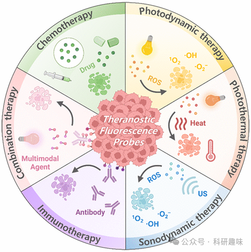
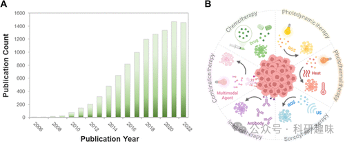

  

在药物递送过程中实现时空信息的获取及控制，特别是在特定条件下的精准调控，使得诊疗性荧光探针成为了一个极富吸引力且研究活跃的领域。近十年间，该领域的文献数量显著增长，直观反映了学者们对此的浓厚兴趣。诊疗性荧光探针展现为多样化的形式，其核心构造通常涉及一个荧光团与一种药物分子的智能偶联，该药物分子在特定刺激（既有内在也有外在的）作用下得以释放，而这一释放过程通过荧光信号的显现得以即时反馈。尤为重要的是，精心挑选的荧光团不仅使荧光“点亮”成为药物释放的直接指示器，还为光动力疗法（PDT）、光热疗法（PTT）及声动力疗法（SDT）等治疗模式提供了有效的实施平台。

本文聚焦于诊疗性荧光探针的最新研究进展，特别强调那些专为肿瘤微环境激活设计的探针。同时，我们也概述了为应对神经退行性疾病、抗菌治疗等其他医疗挑战而开发的探针研究。综览内容广泛涵盖了从简单的小分子体系到复杂的纳米级材料设计的各种创新策略。我们的目标是深入分析这一新兴研究领域的前沿动态，并探讨其对临床医学潜在的革命性影响。

**1.简介**

癌症的本质在于一组细胞失控性增殖的病理状态，这些细胞表现出对促生长信号的高度响应及抗抑生长信号的不敏感性，伴随无限繁殖、抗凋亡特性、新生血管形成、侵袭邻近组织及远端转移的能力。目前，全球每年新增癌症确诊病例已逾千万，并预计未来癌症相关死亡将持续攀升。据世界卫生组织（WHO）预测，至2030年，癌症将成为导致超过1310万人死亡的主要原因之一。

近年来，得益于烟草控制、肿瘤生物学的深入理解、诊断技术的进步以及治疗手段的创新，癌症相关死亡率略有下降。现有癌症治疗手段主要包括外科手术、化学治疗、放射治疗、免疫治疗及其组合策略。传统化疗药物通过干扰DNA合成及阻断细胞分裂周期，针对性清除快速分裂的肿瘤细胞，但其非特异性作用亦会伤及正常组织，引发如恶心、食欲减退等严重副作用，并受限于对健康组织的损伤，影响诊疗试剂量及临床疗效。加之众多化疗药物生物利用度低，肿瘤内摄取不足，往往要求较高剂量施用，加剧了正常组织毒性和耐药性问题，尤其是对于转移性癌症的控制构成了重大挑战。另一方面，癌症的复发源于肿瘤细胞对治疗药物的获得性耐药，这是长期治疗中不容忽视的难题。

鉴于传统疗法的局限性，科研界正深入探索癌症的分子机制，旨在设计更为精准的治疗方案。基于“癌基因成瘾”理论，即特定肿瘤依赖单一激活的致癌途径维持其恶性特征，靶向治疗策略应运而生，旨在精确打击疾病相关机制，绕过传统治疗的障碍。理想的癌症治疗策略需精确瞄准病灶，精准调控药物浓度，以最小化全身毒性，实现局部病变控制，这要求在诊断与治疗的紧密整合、患者分层细化、个体化疗法设计等方面取得突破。

在此背景下，“诊疗学”概念脱颖而出，这是一种融合成像与治疗功能于一体的先进体系，通过特异性分子修饰实现诊疗试剂的肿瘤靶向递送。利用光成像、核医学成像、光声成像、超声成像和磁共振成像等技术，结合靶向载体，可在不同层次上增强治疗的精确度与监测能力。特别是，基于荧光的光学成像技术因高灵敏度和分辨率而在诊疗学领域备受关注，尽管当前主要应用于浅表部位的诊疗指导，如手术导航和眼科应用，而针对深层肿瘤的应用受限于自发荧光干扰和光散射问题。采用近红外（NIR）荧光团可在一定程度上克服上述限制，其临床转化潜力巨大，但仍面临诸多挑战。

此外，前药策略作为一种有效载荷递送手段，通过特定化学修饰暂时抑制活性药物，直至遇特定生物标志物激活，实现治疗效果的同时减少副作用，展现出优化药代动力学和药效学特性的潜力，加速药物研发进程。近年来，诊疗性荧光探针作为研究热点，相关文献量激增，标志着该领域正处于快速发展之中，预示着未来癌症治疗方式的重大变革。

图1.(A)每年有关“治疗诊断荧光探针”的出版物数量（WebofScience）。(B)治疗诊断探针及其作为靶向诊断和治疗的应用的示意图。

本文旨在凸显科学认知上的空白，并深入剖析癌症诊疗学领域未能充分实现其提升患者存活期望值背后的因素，勾勒出当前肿瘤生物学的认知框架，着重于其与靶向递药系统及理性设计的癌症治疗方案的相关性。特别地，将聚焦于一类在肿瘤微环境特异激活的氟基治疗探针，探讨它们在增强化疗、光动力治疗（PDT）、光热治疗（PTT）、声动力治疗（SDT）及多种复合疗法中的应用潜力（图1）。此外，文中亦将概览这些荧光标记治疗探针在阿尔茨海默病、抗衰老及抗菌等新兴领域的初步探索，每一种系统均会详述其激活机制，并与标准疗法的疗效进行对比，旨在评估创新疗法的附加值并指引未来的优化方向。

同时，将不可回避地触及临床应用转化过程中遭遇的壁垒。期望本文能激发该领域更多的探索活动，加速诊疗试剂的研发进程，使之更贴近临床应用的实际需求。尽管基于纳米粒子的治疗药物不在此综述核心范围内，但我们仍会在适当时机提及纳米技术在特定治疗策略中展现出的独特优势。鉴于近年来该领域的迅猛发展，本文无意全面覆盖所有进展，而是通过精选的关键案例，展现过去五年来的主要成就。综述中未涵盖的文献并非代表其贡献微小，实则是出于对该领域广泛性的尊重与篇幅限制的考虑。欲获取更全面的信息，读者可参考各章节引用的综合评述文献。

   

