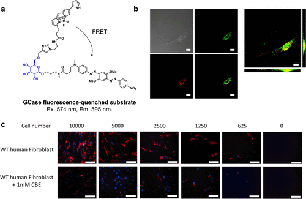

 

#  超全总结，用于癌症诊疗的激活型荧光探针-基于 FRET 机制的可激活荧光探针 
 
  科研趣味 

Grenemal

读完需要

12

全文字数  2761 字

**用于癌症成像的可激活探针**

**2.1. 基于 FRET 机制的可激活荧光探针**

**2.1.1. 基于 FRET 的蛋白酶活性荧光探针**

根据FRET机制，一系列蛋白酶反应型癌症成像探针得以设计。1999年，Weissleder团队基于染料-染料FRET机制，研制出一种近红外荧光探针，专用于溶酶体蛋白酶的癌症特异性成像（图8）。这种探针，即C-PGC，利用Cy5与聚赖氨酸和甲氧基聚乙二醇琥珀酸酯长循环接枝共聚物的连接，通过EPR效应选择性积聚于癌组织。在初始状态下，C-PGC的荧光因FRET而淬灭；然而，与溶酶体蛋白酶反应后，聚赖氨酸裂解，从而激活荧光。体外LX-1细胞观察及裸鼠体内近红外荧光成像均证实其有效性。

图 8.基于染料 FRET 的蛋白酶活化近红外探针。

鉴于半胱氨酸酪蛋白酶在多种肿瘤细胞中的过度表达，它们成为癌症成像的理想靶点。Weissleder团队进一步利用染料-染料FRET机制，开发出针对酪蛋白酶D、B和K的近红外荧光探针，实现更特异的酶激活荧光。

2013年，Verdoes等人提出基于染料淬灭剂FRET的qABP（淬灭荧光活性探针）BMV-109（图9(a)）。该探针由Cy5荧光团与磺基QHY淬灭剂组成，通过可被蛋白酶破坏的PMK连接体相连。凝血酶反应后，淬灭剂与Cy5分离，荧光激活。BMV-109显示出广泛的半胱氨酸酪蛋白酶标记特性，并成功应用于小鼠乳腺癌模型的癌组织可视化（图9(b)）。此外，为适应临床滤光片设置，他们开发了以ICG为荧光团、QC-1为淬灭剂的VGT-309（图9(a)），可有效标记各种小鼠模型中的癌组织（图9(c)）。2022年，Kennedy等人使用VGT-309对人类肺癌进行可视化研究，这表明其已经进入了临床二期。

图 9.与胰蛋白酶反应的 qABP、BMV-109 和 VGT-309

虽然ABPs如BMV-109和VGT-309能在荧光团与酶活性位点间形成共价键，实现荧光团在靶细胞中的保留，但酶活性位点的阻断限制了信号的酶催化放大，从而影响了其在癌症成像中的亮度和T/N比。

为克服这一限制，Ofori等人于2015年报道了一种新型酪蛋白反应探针，利用潜在阳离子溶酶体定位效应（LLE）增强细胞保留（图10(a)）。他们设计的6QC-NIR探针含有一个可被酪蛋白酶裂解的酰胺键，而非ABPs中的PMK分子。裂解后产生的荧光片段因游离氨基的质子化作用而在溶酶体中蓄积，从而实现癌症特异性保留（图10(b)）。由于没有形成共价键，荧光信号得以通过酶催化周转放大，实现了高亮度的癌症成像（图10(c)）。

图 10.用于癌症成像的潜溶酶体效应（LLE）探针。

为进一步提高癌症检测的灵敏度和特异性，Widen等人于2021年报道了AND 逻辑门光学探针，这种探针需要两种底物同时被癌症特异性酶处理（图11(a)）。他们通过连接cathepsin和caspase-3底物，将荧光团与两种淬灭剂相连（图11(b)）。例如，DEATH-CAT-FNIR仅在cathepsin和caspase-3同时存在时激活，与6QC系列相比，其荧光信号对癌症组织的敏感性和特异性显著提高。

图 11.用于癌症成像的 AND 逻辑门对比探针。

2017年，Miampamba等人开发出针对基质金属蛋白酶（MMPs）的比率荧光探针AVB-620（图12(a)）。他们利用PLGC(Me)AG MMP底物连接体，将Cy5修饰的聚-d-精氨酸8-mer细胞穿透肽（CPP）与Cy7修饰的聚-d-谷氨酸5-mer相连。探针设计中，不对称肽骨架的荧光染料标记提高了水溶性。在完整分子状态下，AVB-620展现出从Cy5供体到Cy7受体的FRET，导致Cy5荧光淬灭。

图 12.使用针对 MMPs 的比率荧光探针对乳腺癌进行灵敏的体内可视化。

2023年，Faucher等人提出了一种创新的策略，成功将淬灭荧光探针转变为比率对比探针（如图13(a)所示）。在这项研究中，他们利用特定的技术将cathepsin反应探针6QC-Cy5改造为双荧光团探针6QC-RATIO，这一改造使得探针能够在小鼠皮下乳腺癌模型中实现对cathepsin L活性的比率测量成像，从而显著提升了T/N值（如图13(b)-(e)所示）。此外，他们还成功将AND门探针Death-Cat-NIR转化为比率型探针Death-Cat-RATIO，并证实这种转化能够进一步提升癌症检测的灵敏度（如图13(f)-(h)所示）。这些令人振奋的结果预示着，这些比率测量探针在改善癌症手术切除方面将发挥重要作用。

图 13.针对蛋白酶活性的比率荧光探针。

**2.1.2. 基于 FRET 的糖苷酶活性荧光探针**

基于FRET机制设计的探针常用于蛋白酶活性检测，但针对糖苷酶的FRET探针设计更具挑战性，这主要源于糖苷酶活性位点的独特口袋状拓扑结构，与蛋白酶中常见的裂隙状结构迥异。2006年，研究团队成功开发了一种β-半乳糖苷酶反应型FRET探针CMFβ-gal，具备蛋白质标记能力（图14(a)）。在400纳米波长激发下，探针通过香豆素与荧光素间的FRET作用发出515纳米绿色荧光。然而，当荧光素分子被β-半乳糖苷酶去除后，仅余香豆素分子发出蓝色荧光，从而实现β-半乳糖苷酶活性的比率检测（图14(c)）。在活细胞成像中，通过显微注射探针，可将β-半乳糖苷酶活性以比率图像形式可视化（图14(d)）。尽管标记能力可能受蛋白质结构，特别是目标亲核氨基酸位置的影响，但研究团队仍利用醌甲酰胺化学反应，成功用香豆素荧光团标记了β-半乳糖苷酶（图14(b)）。

图 14.基于 FRET 的 β-半乳糖苷酶反应荧光探针。

2015年，Yadav等人基于葡萄糖6位修饰对人类溶酶体β-葡萄糖苷酶1（GBA1，GCase）的耐受性，设计出一种GBA1荧光淬灭底物（图15(a)）。他们在葡萄糖6位引入了BODIPY荧光团，并通过烷基连接物在异构中心连接淬灭剂。该探针可用于观察溶酶体中内源性GBA1的活性水平（图15(b)）。加入抑制剂环氧缩酮B（CBE）可有效抑制荧光（图15(c)）。尽管GBA1尚未确立为癌症成像的生物标记酶，但如果发现癌症特异性糖苷酶具有不同的允许糖化学修饰位点，则糖苷酶反应型FRET探针的设计思路可望得以应用。其他类型的糖苷酶反应型FRET探针亦有所报道。

图 15.基于 FRET 的荧光淬灭底物的 GCase 依赖性处理。

酶激活FRET探针的实例如图16所示。尽管近红外荧光团共轭体系长度给荧光分子设计带来挑战，但FRET机制可有效且轻松淬灭近红外荧光团。因此，基于FRET的癌症成像探针常采用在670-850纳米范围内发射荧光的近红外荧光团设计，以提供高组织穿透性。然而，基于FRET的探针因分子结构庞大，可能导致溶解度降低和细胞膜渗透性差。为解决此问题，常在FRET探针中引入水溶性磺酸基团、PEG链或细胞穿透肽（CPP）等修饰物。

图 16.已报道的基于 FRET 的酶激活型荧光探针的化学结构、光学特性和成像目标

鉴于近红外荧光团的荧光量子产率（Φfl）通常较低，提高病变部位亮度以实现高灵敏度癌症成像至关重要。这可通过酶转换或增强所产生荧光团在细胞内的保留来实现。由于这些探针在短时间内产生足够信号较为困难，因此已开发出多种全身用药的探针。患者酶活性的异质性给确定探针给药与手术开始之间的最佳时机带来了挑战。尽管针对蛋白酶已开发出有效的基于FRET的癌症成像探针，但针对其他生物标记酶（包括糖苷酶）的高效FRET探针仍显匮乏，这仍是该领域面临的重要挑战。不过，一些近红外FRET探针已进入临床试验阶段，预示着适合临床术中成像的探针有望在不久的将来问世。

Fujita, K.; Urano, Y. Activity-Based Fluorescence Diagnostics for Cancer. Chem. Rev. 2024, 124 (7), 4021–4078. https://doi.org/10.1021/acs.chemrev.3c00612.

**点击蓝字 关注我们**

预览时标签不可点

素材来源官方媒体/网络新闻

  继续滑动看下一个 

 轻触阅读原文 

    

