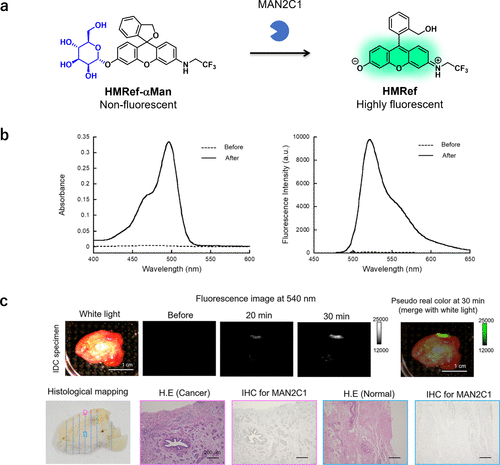

 

#  超全总结，用于癌症诊疗的激活型荧光探针-基于 PeT 工艺的可激活荧光探针 
 
  科研趣味 

Grenemal

读完需要

24

全文字数  7800 字

**用于癌症成像的可激活探针**

**2.2. 基于 PeT 工艺的可激活荧光探针**

荧光素衍生物由呫吨荧光团和垂直排列的苯分子组成（图 17(a)）。2005年，研究团队发现，苯分子的电子密度决定了其荧光是否通过PeT途径被调控。PeT涉及单激发荧光团的非辐射去活化过程，即激发的荧光团与附近电子供体或受体间的电子转移导致荧光淬灭（图 17(b)）。根据电子转移方向，PeT可分为两类：受体激发型PeT（a-PeT），即激发态荧光团作为电子受体；供体激发型PeT（d-PeT），激发态荧光团充当电子供体。当PeT发生速度足够快时，荧光团的荧光会被有效淬灭。

图 17.PeT 机制示意图。

研究团队深入研究了TokyoGreen （TG）衍生物的荧光特性与氧化电位，发现其Φfl值受氧化电位和苯分子最高占位分子轨道（HOMO）能级影响。同时，研究团队观察到在不同pH值下的Φfl值变化：阴离子形式（pH 13）与中性形式（pH 3.4）的Φfl值存在显著差异（图 18(a)）。当苯分子氧化电位高于1.7 V（相对于SCE）时，阴离子形式的Φfl值异常高。而在中性形式中，阈值则转向更高的氧化电位。当氧化电位低于1.7 V（相对于SCE）时，中性形式的Φfl几乎为零，这归因于苯分子与呫吨分子间的a-PeT反应（图 18(a)）。特别地，2-Me-4-OMe TG在阴离子和中性形式间Φfl差异最大，因为其间甲氧基甲苯的氧化电位约1.7 V（相对于SCE）。

图 18.TGs 荧光量子效率（Φfl）的动态变化取决于其苯分子的氧化电位和 HOMO 能级

为了将TGs的这些光学特性转化为可激活探针的设计，研究团队聚焦于阴离子与中性形式间荧光发射阈值的差异。研究团队认为这种差异源于氧杂蒽分子的还原电位。鉴于TG O-甲基酯的还原电位与中性形式相近，研究团队提出通过在TG的羟基上引入如糖等底物分子来设计可激活荧光探针。在目标酶裂解这些底物分子后，这些探针将转变为高荧光阴离子形式，此时a-PeT途径受到抑制。

**2.2.1. 基于 PeT 的糖苷酶活性荧光探针**

研究团队利用a-PeT途径成功设计了一系列糖苷酶反应型癌症成像探针。采用a-PeT荧光控制策略，研究团队首创了TG-βGal作为高灵敏度的β-半乳糖苷酶反应性荧光探针。初始状态下，TG-βGal的荧光因a-PeT效应而熄灭，类似于中性形式的2-Me-4-OMe TG。然而，当其与β-半乳糖苷酶发生酶促反应后，荧光得以激活，转变为高荧光阴离子形式的2-Me-4-OMe TG，此时a-PeT途径受到抑制（图19(a)）。值得注意的是，TG-βGal的荧光增强仅在β-半乳糖苷酶活性存在时显著，且其反应速度远超著名的β-半乳糖苷酶底物荧光素二-O-β-半乳糖苷（FDG）（图19(b)）。此外，TG-βGal在β-半乳糖苷酶阳性细胞中表现出良好的可视化效果（图19(c)）。然而，该探针的一个主要局限在于生成的荧光团在细胞内的保留能力较差，容易扩散至周围细胞，因此难以实现高对比度的癌症组织成像。

图 19.基于 PeT 机制的靶向 β-半乳糖苷酶的荧光探针。

为了解决上述问题，研究团队于2007年对TG-βGal结构进行了优化，开发出AM-TG-βGal。该探针在与β-半乳糖苷酶反应时荧光显著增强，其独特之处在于酯分子能被细胞内广泛存在的酯酶水解，生成具有良好亲水性和荧光稳定性的产物，从而有效保留在细胞内（图20(a)）。通过使用阿维丁-β-半乳糖苷酶偶联物作为报告酶对SHIN3肿瘤细胞进行预标记，研究团队成功地在小鼠模型体内观察到癌症病灶（图20(b)和(c)）。与TG-βGal相比，AM-TG-βGal的细胞保留率显著提高，即使在PBS冲洗后依然如此（图20(d)）。此外，基于其他TG衍生物的PeT探针也已得到开发，并成功应用于多种酶活性的检测。

图 20.利用 a-PeT 的 β-半乳糖苷酶反应荧光探针对 SHIN3 肿瘤进行荧光成像。

**2.2.2. 基于 PeT 的蛋白酶活性荧光探针**

2018年，Xiao等人针对APN在癌症中的活性，成功开发出治疗原药NBFMel。由于a-PeT的存在，NBFMel初始状态下几乎无荧光，但与APN反应后，会转化为高荧光的尼罗河蓝荧光团和美法仑（图21（a）和（b））。这一特性使得NBFMel能够报告肿瘤的存在，并实时追踪肿瘤小鼠模型中的药物释放情况（图21（c）和（d））。此外，由于美法仑具有抗癌作用，通过小鼠静脉注射NBFMel可有效抑制肿瘤生长。

图 21.基于 PeT 的 APN 反应荧光探针。

2019年，研究团队精确调控红色荧光骨架SiR600的a-PeT过程，开发出一种可激活DPP-IV的红色荧光探针。研究团队合成了多种SiR600和Ac-SiR600衍生物，并深入研究了苯分子的HOMO能级与SiR600和Ac-SiR600荧光量子产率（Φfl）之间的关系（图22(a)和(b)）。研究结果表明，Φfl与苯分子的HOMO能级密切相关。脱乙酰化触发荧光转换的阈值水平约为-0.215 hartree。SiR600氨基上脱乙酰化引起的Φfl值变化，归因于最低未占分子轨道（LUMO）能量的降低和蒽分子激发能量的增加，这两个因素共同决定了PeT驱动力。这些发现表明，SiR600衍生物的荧光特性受PeT过程调控。在众多SiR600衍生物中，研究团队选择了2OMe SiR600作为荧光团骨架，因其具有高荧光性（Φfl = 0.32），而其乙酰化衍生物几乎无荧光（Φfl = 0.001）。基于这一骨架，研究团队成功开发出用于检测DPP-IV活性的EP-2OMe SiR600（图22(c)）。EP-2OMe SiR600具有极低的背景信号，在与DPP-IV反应时，不仅吸收光谱发生红移，而且由于a-PeT过程受到抑制，展现出显著的荧光活化，从而实现对食管癌临床标本的高灵敏度和高T/N检测（图22(d)-(f)）。

图 22.基于 a-PeT 和波长偏移的靶向 DPP-IV 的红色荧光探针。

同年，基于d-PeT工艺，研究团队还开发了首个以2MeTG为核心荧光团的PSMA羧肽酶反应荧光探针。通过评估芳基谷氨酸偶联物与PSMA的反应性，研究团队发现Phe-AF-Glu因含有偶氮甲酰基连接体，可被PSMA有效识别和水解（图23(a)）。研究团队重点研究了这种偶氮甲酰基底物，认为PSMA介导的水解会导致芳基电子密度显著变化，进而通过PeT过程转化为荧光激活。基于这一机制，研究团队设计并合成了5GluAF-2MeTG，其在2MeTG的苯基上引入了偶氮甲酰基-Glu分子作为底物。该探针初始荧光被d-PeT抑制，但在与PSMA反应后，由于d-PeT受到抑制，荧光得以激活（图23(b)和(c)）。该探针能够选择性检测PSMA阳性的LNCaP前列腺癌细胞，而在PSMA阴性的PC3前列腺癌细胞中则无荧光信号（图23(d)和(e)）。此外，在PSMA阳性的人类前列腺癌组织中，该探针显示出明显的荧光增强（图23(f)-(h)）。然而，该探针的一个限制是，由于PSMA在正常前列腺组织中的非特异性表达，它可能在某些标本中显示出背景荧光。

图 23.使用基于 d-PeT 工艺的 PSMA 反应荧光探针对前列腺癌进行荧光检测。

2021年，研究团队采用d-PeT工艺，以荧光素为荧光团核心，开发出碱性羧肽酶反应型荧光探针5ArgAF-FI。该探针初始荧光被d-PeT抑制，但在与碱性羧肽酶反应后，由于d-PeT受到抑制，荧光得以显著激活（图24(a)）。尽管该探针能够在体外检测碱性羧肽酶的活性，但由于其膜渗透性较差，无法有效观察到碱性羧肽酶阳性细胞。为了优化细胞成像探针，研究团队在荧光素分子中引入了乙酰基，合成了5ArgAF-FDA。该探针的设计思路是在与细胞外羧肽酶M（CPM）反应后，生成膜渗透性良好的荧光素二乙酸酯（FDA），随后FDA在细胞内酯酶的作用下进一步反应，产生荧光素，从而实现对CPM阳性MDCK细胞的选择性可视化（图24(b)和(c)）。鉴于CPM是某些类型癌症的生物标志物，这种探针在癌症特异性成像方面具有潜在应用价值。

图 24.基于 PeT 的 CPM 反应荧光探针。

**2.2.3. 基于 PeT 的醌氧化还原酶活性荧光探针**

2013年，Silvers等人成功开发出首个基于d-PeT机制的NQO1反应荧光探针（图25(a)），这一创新为化学与材料学领域带来了新突破。他们所设计的Q3NI探针，其荧光原初因d-PeT与醌丙酸分子相互作用而淬灭。一旦底物分子被移除，荧光团NI便完全去淬，并在约470纳米波长处呈现出强烈的荧光信号。借助此探针，研究人员成功地在体外对HT-29和A549细胞中的NQO1活性进行了检测（图25(b)）。

图 25.基于 d-PeT 的 NQO1 反应荧光探针。

2017年，Shen等人进一步研发了一种针对hNQO1的波长可移动近红外荧光探针Q3STCy（图26(a)），为癌症成像提供了新的手段。在与hNQO1反应后，TCy中位的氨基甲酸酯键发生裂解，导致吸收和荧光的最大波长出现了显著的蓝移现象（图26(b)）。鉴于Q3STCy的量子产率（0.0046）远低于TCy报告物的量子产率（Φ = 0.063），研究团队深入探讨了其淬灭机制。他们利用雷姆-韦勒方程、伏安半波电位以及光谱数据进行分析，得出结论：从TCy激发态至缺电子醌分子的电子转移（d-PeT）在热力学上具备可行性。因此，Q3STCy的荧光被认为是通过d-PeT过程受到抑制。值得一提的是，在腹腔注射Q3STCy后，研究人员成功观察到SHIN3腹膜转移灶（图26(c)），这进一步验证了该探针在癌症成像中的潜在应用。

图 26.基于 d-PeT 和波长偏移的 hNQO1 近红外荧光探针。

基于PeT的酶促活化探针在癌症成像领域具有广泛应用前景。如图27所示，本文介绍的TG衍生物中，荧光量子产率（Φfl）受到苯分子的氧化电位和HOMO能级，以及呫吨分子的还原电位的影响，因此这些基于PeT的探针的荧光可以实现精确控制。利用雷姆-韦勒方程和马库斯的电子转移反应理论，可以预测PeT的速率，从而合理设计PeT探针。迄今为止，PeT途径已成功应用于设计各种荧光探针，用于检测金属离子、H2O2和NO等生物分析物。尽管可以开发出具有高Φfl的小分子探针，但在反应前完全淬灭荧光需要对决定PeT驱动力的多个因素进行精细调整。不完全淬灭可能导致本底荧光，这在癌症成像中可能引发问题，特别是针对波长较长的可激发荧光团。

图 27.已报道的基于 PeT 的酶促活荧光探针的化学结构、光学特性和成像目标。

正如EP-2OMe SiR600和Q3STCy所展示的那样，部分基于PeT的荧光探针在酶反应后会发生吸收波长的偏移，这与2.4节所述的吸收波长偏移探针具有相似的荧光开启机制。这些基于波长偏移的可激活荧光探针需根据其吸光度或荧光光谱选择适合的带通滤波器。然而，由于光谱分离不足或缺乏合适的滤光片设置，这些探针有时会出现较高的背景信号。相对而言，无论滤光片如何设置，基于PeT工艺的可激活荧光探针的初始荧光都能得到很好的淬灭。这一优势使得PeT工艺成为体内外癌症成像的理想淬灭机制。结合使用PeT过程和波长偏移技术，可以实现更高的激活倍数。

近年来，随着相关生物标记酶的发现，基于PeT荧光转换机制的PSMA反应探针已相继问世。这些创新性的荧光探针有望为癌症成像提供重要的选择。

**2.2.4. 基于分子内螺环化的可活化荧光探针**

2011年，研究团队通过精准调控罗丹明分子的螺环化平衡，成功开发出一种用于酶活性检测的可激活荧光探针。传统的罗丹明绿（RG）荧光特性并不受pH值影响。然而，通过羧基转化为更具亲核性的羟甲基，研究团队制备了羟甲基罗丹明绿（HMRG），其在碱性pH值（&gt;9）下以无色、无荧光的螺环形式存在（图28(a)）。值得一提的是，在HMRG的一个氨基上引入酰胺键，会显著改变其螺环化平衡常数。例如，Ac-HMRG仅在酸性环境（pH&lt;6）中展现出荧光开环状态，而在生理pH值下则保持无色、无荧光的封闭状态。

图 28.基于分子内螺环化的荧光探针的开发。

基于这种pKcycl的变化，研究团队设计了一种可激活荧光探针。在没有目标酶存在时，探针保持无色、无荧光状态；而当癌症特异性氨肽酶水解底物肽时，会产生高荧光强度的HMRG，其量子产率高达0.81（图28(b)）。以亮氨酸氨肽酶（LAP）为例，LAP反应的Leu-HMRG在LAP活性作用下，荧光增强超过400倍（图28(c)）。这一成果为酶活性检测提供了新的有力工具。

**2.2.5. 基于螺环化的蛋白酶活性荧光探针**

基于分子内螺环化设计策略，研究团队成功开发出一种癌症成像专用的氨肽酶反应性荧光探针。GGT作为一种标志性的生物标志物氨肽酶，在癌细胞中的表达水平显著上升。2011年，研究团队验证了螺环化设计可激活探针的实用性，通过合成具有GGT反应性的gGlu-HMRG，利用γ-谷氨酰分子作为底物氨基酸，实现了对表达GGT的癌细胞的体外选择性检测。同年，研究团队在腹膜转移小鼠模型中验证了该探针的效用，结果显示，给药后短时间内即可观察到微小癌结节。为验证探针在实际人体癌症组织中的效用，研究团队进一步在各种人体癌症手术标本上评估了gGlu-HMRG。然而，由于正常组织与癌症组织间GGT活性的差异不足，部分标本呈现出背景荧光。因此，研究团队将目光转向其他酶靶标。

图 29.利用螺环化设计策略的 GGT 反应荧光探针

2016年，鉴于癌症中氨肽酶活性的普遍升高，研究团队利用手术切除的人类食管鳞状细胞癌（ESCC）标本评估了多种氨肽酶反应探针，发现DPP-IV在ESCC中活性特异性增强，进而开发出适用于ESCC荧光成像的DPP-IV反应性EP-HMRG。

图 30.使用 DPP-IV 反应荧光探针对 ESCC 进行荧光成像

2014年，研究团队专注于半胱氨酸蛋白酶cathepsin家族的研究，特别是cathepsin B和cathepsin L，并成功合成了具有cathepsin底物分子的荧光探针Z-Phe-Arg-HMRG和Z-Arg-Arg-HMRG。鉴于Z-Phe-Arg-HMRG展现出更高的酪蛋白酶特异性，研究团队对其在癌症成像中的应用进行了评估。由于SKOV-3细胞缺乏显著的GGT活性，gGlu-HMRG对其检测效果不佳。2017年，研究团队进一步研究了在前列腺癌中过度表达的2型跨膜丝氨酸蛋白酶家族成员hepsin和matriptase，通过在HMRG中引入它们的底物分子，成功开发出hepsin和matriptase反应探针Ac-KQLR-HMRG。小鼠腹腔注射该探针后，成功观察到PC3前列腺癌。

图 31.使用基于 cathepsin 反应的 HMRG 探针对 SKOV-3 模型小鼠进行荧光成像。

此外，研究团队还基于分子内螺环化设计策略，开发了红色发光和黄色发光的蛋白酶反应型荧光探针。通过合成多种单久留利定融合类似物并测量其pKcycl值，研究团队筛选出HMJSiR和HMJCR作为有效的荧光团 骨架，它们具有最佳的pKcycl值，可用于开发检测GGT活性的红色或黄色发光荧光探针，进而实现癌症组织的多色成像。

图 32.针对 GGT 的红色或黄色荧光探针。

2020年，研究团队提出了一种基于量子化学计算的新颖方法，旨在精确预测羟甲基罗丹明（HMR）探针的pKcycl值。通过深入的计算分析，研究团队发现，在估算荧光开环与非荧光封闭形式间的自由能差时，考虑水分子的影响至关重要。利用此方法，研究团队成功预测了未知HMR衍生物的pKcycl值，并成功开发出了用于GGT活性检测的红色发光gGlu-HMRR和黄色发光gGlu-HMRY探针（图32(c)）。这些探针在癌症成像领域具有广泛应用（图32(d)），显著减少了设计荧光探针时合成一系列HMR衍生物的需求。

图 33.通过静脉注射 gGlu-HMRG 对小鼠模型中的 A549 肿瘤进行荧光成像。

在荧光成像实验中，研究团队采用了局部喷洒探针溶液或腹腔给药的方式。2022年，研究团队进一步探索了通过静脉注射基于HMRG的探针对深部肿瘤进行染色的可能性。令人欣喜的是，通过静脉注射1 mg/kg gGlu-HMRG，研究团队成功观察到了小鼠皮下A549肿瘤（图33(a)）。然而，研究团队也注意到非肿瘤组织的本底荧光有所增强。给药30分钟后，肿瘤部位的荧光强度达到峰值（图33(b)）。此外，研究团队观察到gGlu-HMRG在血浆中的清除速度较快（t1/2 = 0.114 h），而HMRG的清除速度相对较慢（t1/2 = 0.548 h）（图33(c)）。组织分布实验结果显示，gGlu-HMRG在肾脏、肝脏和胰腺等正常器官中也有激活现象（图33(d)），这可能是非肿瘤组织本底荧光增强的原因。此外，研究团队还验证了通过静脉注射gGlu-HMRG可以观察到小鼠模型中的A549肺癌（图34）。

图 34.给 A549 肿瘤小鼠静脉注射（0.33 毫克/千克）gGlu-HMRG 后，浅层和深层肺肿瘤的体内外荧光成像。

螺环化设计策略不仅局限于氨基肽酶，同样适用于羧肽酶等其他蛋白酶。2018年，研究团队建立了一种基于分子内螺环化的羧肽酶反应性荧光探针的多功能设计策略，通过羧肽酶催化的脂肪族羧酰胺到脂肪族羧酸盐的结构转换实现荧光活化。基于此设计，研究团队成功开发出针对羧肽酶A（CPA）的荧光探针diClHMRBC-CONH-Phe和针对羧肽酶B（CPB）的荧光探针diClHMRBC-CONH-Arg（图35(a)）。在CPA存在下，diClHMRBC-CONH-Phe的荧光增强了23倍；而在CPB存在下，diClHMRBC-CONH-Arg的荧光增强了80倍。值得一提的是，diClHMRBC-CONH-Arg还能通过可视化羧肽酶活性来检测小鼠体内外的胰液渗漏（图35(b)）。尽管激活倍数不高，但这些探针在胰瘘的术中诊断中具有潜在应用价值。鉴于不同癌症中羧肽酶的表达水平存在差异，这种设计方法有望为癌症诊断领域开发一系列羧肽酶反应探针提供新思路。

图 35.基于螺环化设计策略的羧肽酶荧光探针。

**2.2.6. 基于螺环化的糖苷酶活性荧光探针**

2011年，研究团队研究团队成功研发了一种新型 骨架——羟甲基N,N-二甲基荧光染料（HMDER），用于开发β-半乳糖苷酶反应探针。通过在HMDER的氧杂蒽分子羟基上引入底物半乳糖，研究团队合成了HMDER-βGal（图36(a)）。在酶促反应前，HMDER-βGal呈无荧光螺环形式，但与β-半乳糖苷酶作用后，其荧光强度提升76倍（图36(b)）。该探针能够监测培养癌细胞中的β-半乳糖苷酶活性。然而，受正常组织背景荧光影响，小鼠模型中微小癌组织的β-半乳糖苷酶活性难以特异性观察。这主要源于HMDER-βGal的螺环化平衡pKcycl值为6.9（图36(c)）。

图 36.基于螺环化设计策略的针对 β-半乳糖苷酶的荧光探针。

为降低探针在生理pH下的荧光背景，研究团队于2015年对HMDER化学结构进行了优化。发现在rhodol的的N原子上引入三氟乙基可使pKcycl值向酸性pH移动。基于这一发现，研究团队成功开发了一种高灵敏度的β-半乳糖苷酶反应荧光探针——羟甲基N-三氟乙基rhodol (HMRef)-βGal，其pKcycl值为5.4，意味着在生理pH下，该探针以非螺环形式存在的比例超过99%（图37(a)和(b)）。此外，荧光产物HMRef的荧光量子产率（Φfl = 0.78）远高于HMDER（Φfl = 0.14）。得益于优化的pKcycl值和增强的荧光量子产率，HMRef-βGal的荧光增强倍数超过1400倍，成功在小鼠模型中观察到小于1毫米的腹膜卵巢癌。因此，HMRef 骨架在检测具有增强糖苷酶活性的微小癌症组织方面展现出巨大潜力（图37(c)）。此外，HMRef 骨架还被广泛应用于各种糖苷酶活性荧光探针的开发。

图 37.基于 HMRef 骨架的高灵敏度 β-半乳糖苷酶反应荧光探针。

2016年，研究团队专注于结肠癌中β-己糖胺酶活性的研究，利用HMRef成功开发了一种β-己糖胺酶反应探针HMRef-βGlcNAc（图38(a)）。研究团队通过HEXA和HEXB验证了该探针的活化能力，并成功应用于HEX阳性的人类结直肠癌标本的观察（图38(b)）。荧光区域与病理确定的癌症病灶及HEXA过表达区域高度吻合。2020年，研究团队还报道了一种基于HMRef骨架的硅糖苷酶反应探针HMRef-S-Neu5Ac。

图 38.使用 β-己糖胺酸酶反应荧光探针对人类结直肠癌进行荧光成像。

同年，研究团队开发了多种糖苷酶反应探针，并通过第4节所述的人体手术标本直接筛查方法，确定MAN2C1为乳腺癌的潜在生物标志酶。以α-甘露糖为底物的探针HMRef-αMan在α-甘露糖苷酶活性存在时表现出显著的荧光增强，为乳腺癌组织的高灵敏度和特异性观察提供了有力工具（图39）。荧光区域与病理确定的癌症病灶及MAN2C1基因缺失区域高度一致。

图 39.使用 MAN2C1 反应荧光探针在术中快速观察乳腺癌。

在最近的研究中，研究团队还探索了利用酶活化荧光探针组合对肿瘤类型进行光学鉴别的可能性。有趣的是，研究团队发现纤维腺瘤（FA）的MAN2C1活性通常高于恶性乳腺癌。与浸润性导管癌（IDC）或导管原位癌（DCIS）等乳腺癌组织相比，HMRef-αMan在纤维腺瘤组织中展现出更高的荧光增量，而GGT反应探针在恶性和良性组织中的激活情况相似。因此，研究团队提出结合使用绿色发光的α-甘露糖苷酶反应型HMRef-αMan和红色发光的GGT反应型gGlu-2OMe SiR600来区分癌症和良性病变（图40(a)）。实际上，在绿色通道中，FA组织比癌症组织显示出更高的荧光激活度，而在红色通道中，癌症组织和FA组织的荧光激活度相似。另一方面，正常乳腺组织在两个通道中几乎无荧光激活。在合成图像中，正常区域无荧光，癌症组织显示为红色，FA组织显示为黄色，从而实现了基于特定酶活性的正常组织、乳腺癌和良性病变的光学鉴别（图40(b)）。

图 40.应用荧光探针对乳腺癌和乳腺良性病变进行光学鉴别。

**2.2.7. 基于螺环化的醌氧化还原酶活性荧光探针**

2017年，Best等人发表了关于以HMRG为骨架荧光团的hNQO1反应荧光探针Q3HMRG的研究报告（图41）。当存在hNQO1时，Q3HMRG的荧光强度显著提升。此外，他们还成功利用Q3HMRG对hNQO1阳性的HT29和OVCAR-3细胞进行了观察。

图 41. 基于螺环化设计的 hNQO1 反应荧光探针。

**2.2.8. 具有细胞保留能力的功能化荧光探针**

2016年，研究团队借助甲脒醌化学手段，设计出了一种功能化荧光探针SPiDER-βGal，其能以单细胞分辨率精准检测β-半乳糖苷酶活性。该探针的结构灵感来源于HMDER，当其底物分子遭遇酶裂解时，不仅荧光激活，同时获得与细胞内蛋白质结合的能力，确保荧光产物稳固地留存在活细胞中（图42(b)）。基于这一特性，研究团队成功实现了β-半乳糖苷酶lacZ阳性HEK细胞的单细胞分辨率标记（图42(c)），且这种标记与免疫组化染色兼容，使得lacZ阳性组织的选择性荧光标记成为可能（图42(d)）。

图 42.能以单细胞分辨率检测 β-半乳糖苷酶活性的功能化荧光探针。

至2021年，研究团队进一步评估了SPiDER-βGal在胃癌转移观察方面的应用潜力，结果表明该探针能够精准检测小鼠模型中胃癌细胞系的腹膜转移（图43(a)），甚至在新鲜切除的人体手术标本中也能观察到胃癌的踪迹（图43(b)）。

图 43.用 β-半乳糖苷酶反应荧光探针 SPiDER-βGal 观察胃癌腹膜转移。

同年，研究团队深入研究了偶氮醌甲醚的反应特性，并据此开发出一款具备细胞保留能力的功能化GGT反应荧光探针4-CH2F-HMDiEtR-gGlu（图44(a)）。与SPiDER-βGal相似，该探针在GGT活化过程中生成甲氧基偶醌中间体，该中间体进一步与细胞内亲核物（如半胱氨酸和谷胱甘肽GSH）反应，使探针牢固锚定于细胞内，有效标记表达GGT的细胞（图44(b)和(c)）。此外，该探针还成功应用于病人异种移植（PDX）小鼠的癌症成像，且兼容癌症组织的固定和免疫组化染色（图44(d)）。

图 44.用于持久肿瘤成像的功能化 GGT 反应荧光探针。

螺环化设计为研究团队提供了开发可激活酶探针的灵活框架。通过在氧杂蒽分子的羟基或氨基上引入不同底物分子，研究团队可以定制针对各种酶活性的荧光探针。同时，螺环化设计也适用于开发光敏剂。借助量子化学计算预测罗丹明衍生物的pKcycl值，研究团队得以理性设计用于癌症成像的骨架荧光团。这些基于螺环化的探针在反应前荧光几乎被完全淬灭，与目标酶反应后则展现出高倍荧光增强和极低背景，大大提高了检测灵敏度和特异性。

图 45.已报道的螺环化酶促荧光探针的化学结构、光学特性和成像目标。

HMRG和HMRef等荧光团在可见光范围内（500-600纳米）具有高荧光量子产率，使得这些探针能够高灵敏、高可见度地检测癌症。因此，它们成为快速检测和术中实时使用的理想选择，通过局部喷洒探针溶液，即可迅速识别手术边缘的微小癌结节。此外，结合内窥镜检查，这些探针还可用于食道癌、胃癌和结肠癌等的检测，但前提是开发能够检测500-600纳米波长范围内荧光发射的内窥镜。目前，研究团队正利用各种人体外科癌症标本筛选荧光探针，已发现多种适用于不同癌症的有效成像探针。这些探针未来或可用于系统用药，但其在癌症组织中的保留能力和血液半衰期尚需进一步优化。值得一提的是，部分基于螺环化设计的探针已进入临床试验阶段，展现了良好的应用前景。

Fujita, K.; Urano, Y. Activity-Based Fluorescence Diagnostics for Cancer. Chem. Rev. 2024, 124 (7), 4021–4078. https://doi.org/10.1021/acs.chemrev.3c00612.

**点击蓝字 关注我们**

预览时标签不可点

素材来源官方媒体/网络新闻

  继续滑动看下一个 

 轻触阅读原文 

    

