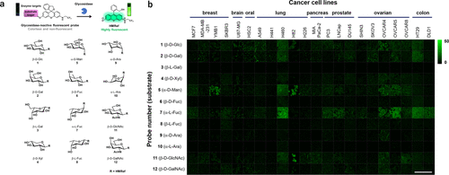
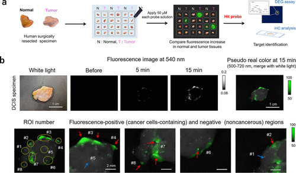
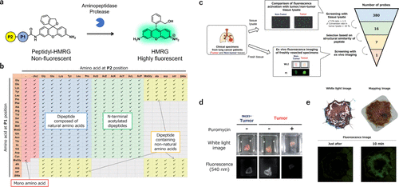
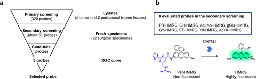
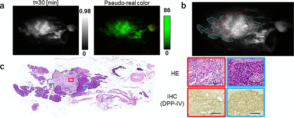
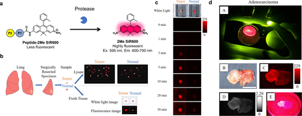
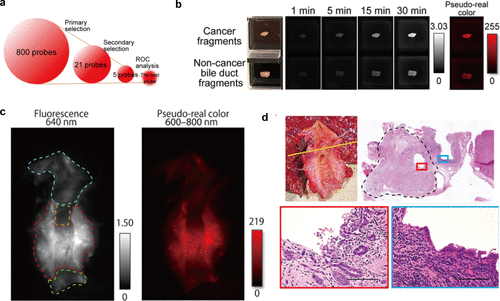
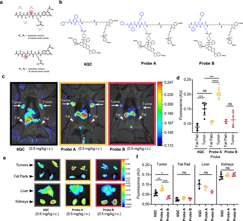

 

#  超全总结，用于癌症诊疗的激活型荧光探针-基于库的癌症成像荧光探针开发方法 
 

Grenemal

读完需要

6

全文字数  字

**3. 基于库的癌症成像荧光探针开发方法**

在某些复杂的生物学场景中，由于肿瘤组织与非肿瘤组织的生物标志物酶活性差异并不显著，针对某些知名生物标志物酶（例如GGT）设计的荧光探针，在非肿瘤组织中可能展现出强烈的背景荧光，从而干扰了肿瘤组织的准确识别。此外，不同癌症类型所展现出的最有效生物标记酶活性往往存在异质性，这种差异使得单一荧光探针很难实现对所有类型癌症的高灵敏度和特异性检测。因此，研究团队亟需寻找一种更为灵敏且特异的酶生物标记物，并发展出一种能够针对每种癌症进行有效检测的策略或方法，以提高癌症诊断的准确性和可靠性。

**3.1. 筛选各种糖苷酶活性荧光探针**

鉴于糖苷酶在癌症诊断中的潜在价值，研究团队于2020年成功合成了一系列包含12种不同荧光探针的集合，旨在检测多种糖苷酶的活性（图 65(a)）。这些探针展现出了在活癌细胞中检测糖苷酶活性增强的能力，为癌症研究提供了有力的工具（图 65(b)）。

图 65.糖苷酶荧光探针

进一步地，研究团队直接在人体手术标本中对这些探针进行了筛选。结果显示，糖苷酶的活性确实因肿瘤类型的不同而有所差异，其中部分探针在癌症特异性成像方面表现出色（图 66(a)）。值得一提的是，α-甘露糖苷酶反应荧光探针 HMRef-αMan 在乳腺癌成像中展现出了极高的灵敏度和特异性，灵敏度达到90%，特异性更是高达100%（AUC = 0.985），为乳腺癌的早期诊断提供了有力的支持（图 66(b)）。

图 66.识别和利用生物标记糖苷酶，实现术中癌症的快速可视化

通过粒状电泳凝胶（DEG）检测，研究团队进一步确定了MAN2C1为靶酶，并验证了其在多种乳腺肿瘤中的过表达现象。这种直接利用手术标本筛选荧光探针的方法不仅为发现各种肿瘤中酶活性的增强提供了便捷的途径，而且筛选出的探针在开胃和内窥镜手术中具有广阔的临床应用前景。

**3.2. 筛选蛋白酶活性荧光探针库**

2022年，研究团队致力于探索癌症的有效生物标记蛋白酶。通过固相合成技术，研究团队将一系列单肽或二肽底物与HMRG荧光基团相结合，成功构建了一个包含380个荧光探针的库（图 67(a) 和 (b)）。为了验证这些探针的实用性，研究团队利用手术切除的癌症和正常组织裂解物对这380个探针进行了初步筛选。结果表明，部分探针在癌症组织中表现出显著的荧光增强现象，显示出其作为特异性探针的潜力。随后，研究团队根据探针与底物肽的结构相似性进一步筛选，并通过体外荧光成像技术评估了这些筛选出的探针（图 67(c)）。其中，KK-HMRG在肺癌组织检测中展现出84.8%的灵敏度和84.2%的特异性（AUC = 0.727），成为肺癌诊断的有力工具（图 67(d)）。此外，通过DEG检测技术，研究团队确定了PSA为KK-HMRG的靶酶。在胃癌病例的研究中，研究团队发现KH-HMRG能够特异性地增加非癌区的荧光，实现对癌症病灶的阴性染色，为胃癌的精准诊断提供了新的思路（图 67(e)）。同时，APN被证实为KH-HMRG的靶酶。对于胶质母细胞瘤，研究团队从筛选中挑选出8个候选探针，其中PR-HMRG以100%的灵敏度和58.5%的特异性（AUC = 0.794）成功检测出胶质母细胞瘤组织（图 68），钙蛋白酶1（CPN1）被确定为PR-HMRG的靶酶。此外，研究团队还发现GP-HMRG在胰腺癌成像中表现出优异的性能，并确定DPP-IV为其靶酶（图 69(a)-(c)）。这些研究成果充分证明，研究团队基于文库的方法在发现用于癌症选择性成像的新型荧光探针/生物标记酶活性对方面具有广泛的应用前景。

图 67.用于检测蛋白酶活性的荧光探针库

图 68.发现用于检测胶质瘤的生物标记物/探针对

图 69.发现用于检测胰腺癌的生物标记物/探针配对。

同年，研究团队还报道了通过筛选包含400个蛋白酶红色荧光探针的库，成功发现了一种高效的肺癌成像探针（图 70(a)和(b)）。在实验中，研究团队发现QA-2Me SiR600在人类肺癌组织中的荧光强度显著高于正常肺组织（图 70(c)）。与QA-2Me SiR600相比，QA-2OMe SiR600的背景荧光更低，其在肺癌检测中展现出96.3%的灵敏度和85.2%的特异性（AUC = 0.962），显示出更高的诊断价值（图 70(d)）。进一步的研究揭示，PSA和DPP-IV是QA-2OMe SiR600的双靶酶，为肺癌的精准治疗提供了新的靶点。

图 70.用于检测蛋白酶活性的红色荧光探针库。

2023年，研究团队进一步扩展了研究范围，在人类胆管癌标本中筛选了包含糖苷酶和蛋白酶绿色荧光探针库以及蛋白酶红色荧光探针库在内的共800个探针（图 71(a)）。经过严格的筛选和评估，研究团队发现PM-2Me SiR600在胆管癌检测中表现出色，其灵敏度为80.0%，特异性为94.4%（AUC = 0.860），成为胆管癌诊断的有力工具（图 71(b)-(d)）。同时，研究团队确定了PSA为PM-2Me SiR600的靶酶，为胆管癌的治疗提供了新的思路。这些研究成果不仅丰富了研究团队对癌症生物标记物的认识，也为癌症的精准诊断和治疗提供了有力的支持。

图 71.通过对 800 种荧光探针的筛选，发现了一种用于检测胆管癌的高效荧光探针。

**3.3. 筛选多种底物库**

2020年，Tholen等人报道了利用组织提取物筛选多种底物库以设计荧光探针的方法。在他们的研究中，他们利用小鼠肿瘤病变的裂解液对混合组合底物库（HyCoSuL）进行了定位扫描。为了降低混合物复杂性，他们巧妙地将直接邻近裂解位点的P1残基固定为精氨酸，因为许多蛋白酶对碱性氨基酸具有P1特异性（图 72(a)）。随后，在酸性pH条件下，他们对P2扫描和P3扫描HyCoSuL文库进行了筛选。这两个子文库的P2和P3位置残基均经过精心设计，变化范围涵盖了所有天然氨基酸（除半胱氨酸和蛋氨酸外）以及一组110个非天然氨基酸。

图 72.利用组织提取物筛选各种底物库，开发荧光探针。

在筛选非天然氨基酸的过程中，他们惊喜地发现了一些比最佳天然残基活性更高的氨基酸。基于这些筛选结果，他们成功开发了FRET型荧光探针，例如基于6QC设计的探针A和B（图 72(b)）。尽管探针B在裂解物实验中展现出高效的性能，但在癌症模型小鼠的成像实验中却未能显著增加荧光，这很可能是由于其细胞膜渗透性不佳所致。然而，与他们之前报道的6QC相比，探针A在周围正常组织和器官中展现出更显著的荧光增幅和更低的背景荧光（图 72(c)-(f)）。

综上所述，他们通过筛选多种底物库找到了一种高效底物，并开发出一种新型癌症成像探针，而无需事先了解酶的靶标。正如本节所述，最近开发的基于文库的方法为获取各种生物标记物/探针对信息或针对不同类型癌症的有效底物序列提供了有力工具。与传统方法相比，基于文库的方法无需事先获得靶标信息，即可无偏见地开发探针，具有广阔的应用前景。因此，这种方法有望成为未来开发高效癌症成像探针的既定方法。

Fujita, K.; Urano, Y. Activity-Based Fluorescence Diagnostics for Cancer. Chem. Rev. 2024, 124 (7), 4021–4078. https://doi.org/10.1021/acs.chemrev.3c00612.

**点击蓝字 关注我们**

预览时标签不可点

素材来源官方媒体/网络新闻

  继续滑动看下一个 

 轻触阅读原文 

    

