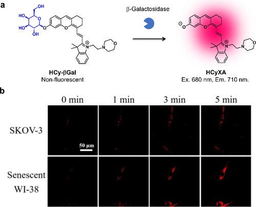

 

#  超全总结，用于癌症诊疗的激活型荧光探针-基于波长偏移的可激活荧光探针 
 

Grenemal

读完需要

13

全文字数 4400 字

**用于癌症成像的可激活探针**

**2.3. 基于波长偏移的可激活荧光探针**

据报道，存在多种可激活荧光探针，它们基于吸收或荧光波长偏移的原理设计。这些探针在初始状态下，通过底物与荧光团羟基或氨基的结合，有效地抑制了荧光的发射。然而，当这些探针遭遇酶反应时，会引发波长偏移现象，进而激活荧光。这种波长偏移现象可归因于多种机制，包括简单的分子结构变化、分子内电荷转移（ICT）和分子内重排，或是这些机制的协同作用。这些机制的运用，使得这类探针在化学和生物探测领域具有广阔的应用前景。

**2.3.1. 基于波长偏移的蛋白酶活性荧光探针**

2022年，研究团队成功研发了基于非对称Si-罗丹明（SiR）的LAP或DPP-IV靶向近红外荧光探针。在研究中，研究团队观察到，当蒽分子上的氨基转化为酰胺基时，部分Si-罗丹明染料的吸收最大值会发生显著的蓝移（超过110纳米）。基于这一特性，研究团队成功开发出LAP反应型Leu-SiR640和DPP-IV反应型EP-SiR640荧光探针（图46(a)）。在637纳米波长激发下，Leu-SiR640在665纳米波长处的荧光强度提升了669倍，而EP-SiR640则增强了220倍（图46(b)）。这些探针在小鼠癌症模型以及人体ESD标本的局部应用中均展现出良好的癌症检测效果（图46(c)和(d)）。此外，研究团队依据SiR衍生物的吸收波长偏移机制，进一步开发了一系列2Me SiR600荧光探针，用于蛋白酶的检测。通过局部喷洒探针溶液，研究团队成功地观察到人类肺癌和胆管癌的病灶，相关研究成果详见第4节。

图 46.针对 DPP-IV 的近红外荧光探针。

2021年，Mukaimine等人成功研制出首个基于不对称铋-罗丹明的GGT反应探针BiRGlu（图47）。他们证实，在红色激发光下，BiRNH表现出优异的发射和光敏特性，而N-乙酰化衍生物BiRAc则显示出较低的吸收波长色移以及发射和光敏能力的减弱。在GGT活性存在的情况下，BiRGlu能够选择性地生成BiRNH，并在A549细胞中实现荧光增强和光毒性。

图 47.基于不对称铋-罗丹明的含氟光敏剂

2018年，Li等人以二氰异佛尔酮为核心近红外荧光团，开发出一种GGT反应探针NIR-SN-GGT（图48(a)）。该探针在初始状态下近红外区域的荧光较弱，但在GGT的作用下，由于荧光波长的红移，其近红外荧光显著增强（图48(b)和(c)）。与GGT反应后，荧光强度提升了21.8倍，这主要归因于ICT的恢复。在小鼠模型中，通过瘤内注射该探针，研究团队成功观察到GGT阳性的癌症病灶（图48(d)）。该探针具有210纳米的大斯托克斯偏移，有效避免了自吸收。然而，这种荧光团的本底荧光较高，导致其折叠激活性相对较低。

图 48.基于二氰异佛尔酮的 GGT 反应近红外探针。

2020年，Li等人聚焦于癌症中的APN活性，以二氰异佛尔酮为荧光团核心，开发出一种近红外荧光探针YH-APN，用于检测APN活性（图49(a)）。与NIR-SN-GGT类似，该探针在初始状态下近红外区域的荧光较弱，但在APN的作用下，其荧光显著增强（图49(b)）。计算结果显示，该探针对APN的检测限达到0.13纳克/毫升。通过局部喷洒该探针，研究团队成功观察到具有高信噪比的HepG-2异种移植肿瘤（图49(c)和(d)）。

图 49.基于二氰异佛尔酮的 APN 反应近红外探针

2016年，Gu等人设计了一种以二氰基亚甲基-4H-吡喃为核心荧光团的近红外荧光探针，专门用于检测LAP活性（图50(a)）。(136)当该探针与LAP发生反应后，不仅出现了显著的斯托克斯偏移（达到205纳米），其吸收光谱和荧光光谱也呈现出了红色偏移的特征（图50(b) 和 (c)）。这种荧光增强的现象主要归因于ICT的恢复。此外，该探针成功实现了对活体HeLa细胞中LAP活性的比率成像（I660nm/I535nm），为相关研究提供了有力工具（图50(d)）。

图 50.基于二氰亚甲基-4H-吡喃荧光团的 LAP 反应型近红外荧光探针。

2017年，Luo等人研发了一种基于美罗青荧光团（mCy-Cl）的GGT反应性近红外荧光探针GANP（图51(a)）。他们巧妙地利用自巯基连接体将GGT的底物分子与mCy-Cl的羟基相结合。在GGT的作用下，GANP的荧光强度显著提升了100倍（图51(b)），并在近红外区域展现出了高量子产率（Φfl = 0.3）。这一特性使得GANP能够在小鼠模型的HCT116肿瘤中实现高效的荧光成像，为肿瘤检测提供了新方法（图51(c)）。

图 51.基于美蓝荧光团的 GGT 靶向近红外荧光探针。

2019年，Zhou等人以GSH基团为反应基团，以Pyronin B为荧光团，开发了一种GGT反应比率荧光探针Py-GSH（图52(a)）。GGT能够裂解Py-GSH中的γ-谷氨酰基，进而触发快速的分子内重排反应。由于Py-GSH和转化后的Py-CG在发射波长上存在75纳米的差异，因此该探针能够实现对GGT活性的比率荧光检测（图52(b)）。此外，Py-GSH在小鼠腹膜转移的小肿瘤检测中表现出了良好的应用前景（图52(c)和(d)）。

图 52.基于分子内重排的 GGT 比率荧光探针。

同年，Ou-Yang等人成功研制出首个以GGT为靶标的零交叉比度近红外荧光探针Cy-GSH（图53(a)）。(221)在GGT的作用下，Cy-GSH展现出了从805纳米到640纳米的大幅发射偏移（图53(b)）。这种转变同样归因于快速的分子内重排反应，导致Cy-GSH转化为Cy-N结构。通过小鼠模型中的肿瘤和转移灶成像实验，他们验证了Cy-GSH在荧光成像引导手术中的潜在应用价值（图53(c)）。这些基于分子内重排原理的探针因其光学特性的显著变化而实现了高对比度成像。然而，目前这些探针的应用范围仍受限于GGT，因为它们的底物分子需要具备GSH结构。

图 53.使用基于分子内重排的 GGT 靶向零交叉比值近红外探针进行癌症成像。

**2.3.2. 基于波长偏移的糖苷酶活性荧光探针**

2011年，研究团队以TokyoMagenta（TM）骨架为基础，成功开发出一种具备高关断/开启比的β-半乳糖苷酶靶向红色荧光探针2-Me TM βgal（图54(a)）。通过利用2-Me TM在羟基去质子化时吸收光谱发生大幅蓝移的特性，研究团队实现了高关/开比率的糖苷酶红色荧光探针的开发。这一特性使得2-Me TM βgal成为β-半乳糖苷酶的优异荧光探针。在β-半乳糖苷酶的作用下，该探针的荧光强度显著增强（图54(b)），并能够选择性地在lacZ阳性的HEK293细胞中发光（图54(c)）。

图 54.基于 TM 荧光团的靶向 β-半乳糖苷酶的红色荧光探针。

2016年，Gu等人以二氰基亚甲基-4H-吡喃（DCM）为核心荧光团，成功开发出一种靶向β-半乳糖苷酶的近红外荧光探针（图55(a)）。(154) 该探针DCM-βgal在440纳米波长处呈现出典型的宽吸收带，这归因于其固有的分子内电荷转移（ICT）特性。在β-半乳糖苷酶的作用下，DCM-βgal在440nm处的吸收峰降低，同时伴随着ICT的恢复，在约535nm处出现了一个新的吸收峰。当使用535nm的光激发时，该探针在685nm处展现出强烈的近红外荧光，从而实现了对β-半乳糖苷酶活性的高效荧光检测（图55(b)）。他们进一步证实了这种探针在临床前应用中的实用性，能够以低背景信号特异性地观察到小鼠的肿瘤病灶（图55(c)-(f)）。

图 55.基于 DCM 荧光团的β-半乳糖苷酶反应型近红外荧光探针。

2022年，Wu等人以CS-OH(Cl)为核心荧光团，开发出一种灵敏的近红外荧光探针NIR-βGal-2，用于靶向β-半乳糖苷酶（图56(a)）。NIR-βGal-2的近红外荧光在初始状态下受到抑制，但在与β-半乳糖苷酶反应后，其吸收光谱发生显著的红移，并伴随近红外荧光的增强，从而实现对β-半乳糖苷酶活性的检测（图56(b)）。通过在底物与荧光团CS-OH(Cl)之间引入自巯基连接体，促进了探针与β-半乳糖苷酶的反应。这种探针在培养的癌细胞中成功观察到β-半乳糖苷酶的活性（图56(c)），并在肿瘤模型中通过局部应用展示了其在荧光引导手术方面的潜力（图56(d)）。

图 56.基于 CS-OH(Cl)荧光团的灵敏近红外 β-半乳糖苷酶反应荧光探针。

2023年，Pan等人开发出近红外荧光探针HCyXA-βGal，用于快速精确成像卵巢癌细胞和衰老细胞中β-半乳糖苷酶的活性。与NIR-βGal-2类似，HCyXA在羟基上引入的β-半乳糖底物导致近红外荧光淬灭（图57(a)）。(224) 在与β-半乳糖苷酶反应后，探针展现出近红外荧光，从而实现对SKOV-3癌细胞和WI-38衰老细胞中β-半乳糖苷酶活性的荧光成像（图57(b)）。

图 57.基于 HCyXA 荧光团的靶向 β-半乳糖苷酶的快速近红外荧光探针。

2020年，Chen等人以BODIPY为核心荧光团，开发出针对β-半乳糖苷酶的荧光探针BOD-M-βGal。他们通过引入乙烯单元，延长了BODIPY 3位上的π-共轭，从而获得了在第二个近红外窗口区（NIR-II，1000-1700纳米）具有荧光响应性的探针（图58）。与β-半乳糖苷酶反应后，BOD-M-βGal在近红外区域的荧光显著增强，并伴随着130nm的较大斯托克斯位移。这种近红外-II（1000-1200 nm）区域的荧光发射尾迹对于体内癌症成像尤为有利。在小鼠模型中，通过瘤内注射探针，可观察到β-半乳糖苷酶阳性的SKOV-3衍生皮下肿瘤。此外，在存在d-半乳糖的情况下，荧光激活受到抑制。值得注意的是，BOD-M-βGal的近红外-II信号即使在2毫米的组织深度下也能被有效检测到。

图 58.β-半乳糖苷酶的近红外-II 荧光探针。BOD-M-βGal 与 β-半乳糖苷酶发生酶促反应后的活化情况。

Zhang等人则开发了一种基于1,8-萘二甲酰亚胺骨架的β-半乳糖苷酶反应荧光探针NI-βGal（图59）。(226) 在β-半乳糖苷酶的作用下，NI-βGal会表现出黄蓝发射比的变化。通过瘤内注射，该探针可用于观察体内表达LacZ的U87肿瘤。然而，目前尚不清楚该探针与原生人类β-半乳糖苷酶的反应性如何，因此还需要进一步的研究来阐明其在临床成像方面的潜力。

图 59.基于 1,8-萘二甲酰亚胺的 β-半乳糖苷酶反应荧光探针。

综上所述，近年来在荧光探针领域的研究取得了显著的进展。通过精心设计和优化荧光团及其与目标酶的相互作用，研究人员成功开发出了一系列针对β-半乳糖苷酶的灵敏且特异的荧光探针。这些探针不仅能够在体外有效检测酶的活性，还能够在体内实现对特定组织的荧光成像，为疾病诊断和治疗提供了有力的工具。然而，尽管取得了一些重要的成果，但仍然存在许多挑战和未解决的问题，需要进一步的研究和探索。未来，随着材料科学和荧光技术的不断发展，相信研究团队能够开发出更加高效、稳定和可靠的荧光探针，为医学研究和临床应用提供更强大的支持。

**2.3.3. 基于波长偏移的碱性磷酸酶活性荧光探针**

2017年，Liu等人成功研发出一种针对ALP活性的近红外荧光探针（图60(a)）。起初，该探针NALP在近红外区域并不展现荧光特性，然而在与ALP发生反应后，由于分子内电荷转移（ICT）的恢复，其产物展现出了显著的荧光性质（图60(b)）。为了验证其实际应用效果，他们进一步检测了细胞内的ALP活性，并通过在小鼠模型中实施肿瘤内注射探针，成功观察到癌症组织的荧光信号（图60(c)和(d)）。

图 60.基于信息和通信技术的体内肿瘤可视化 ALP 靶向近红外荧光探针。

到了2020年，Zhang等人又开发出一种新型的近红外比率荧光探针APT，专门针对ALP活性进行设计（图61(a)）。这种探针APT具有快速检测ALP活性的能力，其光谱从580纳米显著转移到650纳米，实现了高灵敏度的荧光响应。更值得一提的是，荧光比值F650/F580增加了高达14倍，显示了其出色的比率荧光特性（图61(b)）。通过应用该探针，研究人员成功观察到HeLa细胞中的ALP活性（图61(c)），为ALP相关研究提供了新的有力工具。

图 61.针对 ALP 的比率法近红外探针。

**2.3.4. 基于波长偏移的醌氧化还原酶活性荧光探针**

2014年，Hettiarachchi等人报道了一种基于萘二甲酰亚胺荧光团的hNQO1反应荧光探针（图62(a)）。在hNQO1的存在下，底物分子发生裂解，产生了一种由于分子内电荷转移（ICT）恢复而引发荧光红移的产物。利用该探针，研究者成功观察到了HT29细胞中hNQO1的活性（图62(b)）。

图 62.基于 ICT 的 NQO1 反应荧光探针。

2018年，Punganuru等人基于二氰异佛尔酮荧光团（图63(a)）开发出了一种hNQO1反应型近红外荧光探针NQ-DCP。与hNQO1反应后，NQ-DCP在近红外区域展现出显著的荧光增强，并伴随着巨大的斯托克斯位移（145 nm）（图63(b)）。令人瞩目的是，该探针在静脉注射后仅10分钟内便能观察到小鼠模型中的U87MG肿瘤（图63(c)）。由于hNQO1在肿瘤组织中的选择性活性，该探针在其他器官中并未显示明显的背景荧光（图63(d)），从而提高了成像的准确性和特异性。

图 63. 基于二氰异佛尔酮的 hNQO1 反应荧光探针。

综上所述，基于波长偏移的可激活荧光探针已经得到了广泛开发。这类探针采用了多种骨架荧光团，如罗丹明、二氰基异佛尔酮和萘二甲酰亚胺衍生物等。与FRET探针相比，这类探针能够设计相对较小的近红外荧光探针，适用于各种活性酶的检测。尽管这些探针需要合适的滤光片设置以实现光谱分离，但许多探针已展现出高活化性，并显示出在临床癌症成像中的潜在应用价值。此外，还有其他基于波长偏移的可激活荧光探针的报道，这些探针在化学和材料学领域的研究中发挥着重要作用。图64 收集了基于波长偏移的可激活探针的研究进展。

图 64.基于波长偏移的可激活荧光探针的化学结构、光学特性和成像目标。

Fujita, K.; Urano, Y. Activity-Based Fluorescence Diagnostics for Cancer. Chem. Rev. 2024, 124 (7), 4021–4078. https://doi.org/10.1021/acs.chemrev.3c00612.

   

