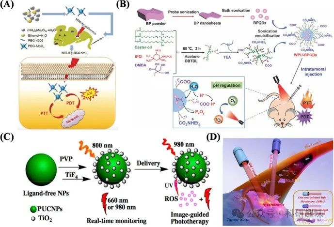

 

#  近红外光疗纳米材料——无机金属纳米粒子 
 

## 近红外光疗纳米材料——无机金属纳米粒子

# 金纳米粒子（Au NPs）

金纳米粒子（Au NPs），凭借其卓越的生物相容性、高效的光热转换效率（PCE）以及在近红外区域的强烈吸收能力，能够深入穿透组织，已成为光热疗法（PTT）中极具吸引力的光疗剂，并构建起一个高效的治疗平台。这些纳米粒子可通过精细调控，形成多样化的形态，如纳米棒、纳米壳、纳米笼及纳米球等（图3A），其治疗效率则高度依赖于其尺寸、形状及精细结构的优化。

自2003年起，Hirsch及其团队便前瞻性地利用了金属纳米壳的独特光学共振可调性，率先探索了金纳米粒子在PTT中的应用潜力。他们成功制备了PEG修饰的金/二氧化硅纳米壳，该材料在极短时间内（4-6分钟）即可实现显著的温度提升（ΔT = 37.4 ± 6.6°C），从而在体内引发不可逆的肿瘤损伤（https://doi.org/10.1073/pnas.2232479100）。此外，Singh等人的研究进一步揭示了金氧化物浓度与温升之间的正相关关系，即温升效应呈现出明显的染料浓度依赖性（图3B）（https://doi.org/10.1166/jbn.2016.2196）。

近年来，鉴于金纳米粒子介导的PTT所展现出的卓越治疗效果，该领域的研究得到了广泛而深入的拓展。特别是，金氧化物与光敏剂（PSs）的共轭策略，为实现多模式癌症治疗提供了可能。Wang等人便报道了一种创新的多功能Au NPs（PTX-PP@Au NPs），该纳米平台巧妙融合了PTT、PDT及化疗三种治疗手段，展现出优异的药物释放特性。通过阻断细胞周期及TRPV6阳离子通道，该纳米体系有效抑制了前列腺癌的生长，并同步产生了理想的热效应与丰富的活性氧（ROS），且在治疗过程中未观察到显著副作用（图3C和D）（https://doi.org/10.1016/j.biomaterials.2019.05.009）。这一研究成果不仅为癌症治疗开辟了新途径，也彰显了金纳米粒子在精准医疗领域的巨大潜力。

图 3：（A）金纳米颗粒的重要特性（https://doi.org/10.3390/ijms19071979）。(B) 不同浓度的金纳米棒随时间的温度升高，颜色表示温度升高的摄氏度（https://doi.org/10.1166/jbn.2016.2196）。(C）协同处理 ARPC 细胞的概况。(D）前列腺肿瘤细胞中钙钛矿-AM的荧光图像。PTX-PP@Au NPs + NIR 组活细胞较少（绿色）（标尺 = 50 μm）（https://doi.org/10.1016/j.biomaterials.2019.05.009）

金氧化物因其独特的理化性质，在临床试验中亦展现出重要应用潜力。具体而言，Aurolase® 在800纳米波长下展现出高摩尔吸收率，成为光热疗法（PTT）领域备受瞩目的候选材料（https://doi.org/10.1039/d0bm00222d）。截至目前，已有两项针对Aurolase®的临床试验完成招募与实施，其研究目的分别聚焦于评估该材料在治疗原发性或转移性肺肿瘤（临床试验注册编号：NCT01679470，于ClinicalTrials.gov可查）以及难治性或复发性头颈部肿瘤中的抗肿瘤疗效（临床试验注册编号：NCT00848042，同样可于ClinicalTrials.gov检索）。值得注意的是，这两项临床试验均已在2014年前顺利完成，然而，其详细研究结果尚未正式公布。

综上所述，金氧化物作为一类极具前景的光治疗剂，其在癌症光疗领域的临床应用潜力不可忽视。然而，同时也需审慎考量其稳定性问题以及在体内可能存在的长期滞留风险，这些因素对于其临床转化与安全应用至关重要。未来研究应致力于进一步优化金氧化物的物理化学性质，提升其稳定性与生物相容性，以推动其在癌症治疗领域的广泛应用。

# 银纳米粒子（Ag NPs）

银纳米粒子（Ag NPs），作为一类成本效益显著的贵金属纳米材料，凭借其简便的合成工艺、卓越的物理与电学性能、显著的抗菌活性以及独特的光疗潜力，在生物医学领域引起了广泛关注。尤为突出的是，Ag NPs能够诱导肿瘤细胞内产生强烈的氧化应激反应，进而触发细胞凋亡机制，展现出针对肿瘤治疗的直接效果。

Cui及其研究团队创新性地开发了白蛋白稳定的银纳米点，这些纳米点在治疗后能够迅速提升肿瘤表面温度至高达20°C的增幅，通过热效应直接诱导肿瘤细胞死亡，且在治疗过程中未观察到显著的副作用，为肿瘤热疗提供了一种高效且安全的新策略（https://doi.org/10.1021/acsami.6b16133）。

此外，Ag NPs还展现出在光动力疗法（PDT）与光热疗法（PTT）协同治疗中的巨大潜力。Yang等人巧妙利用疏水作用原理，成功合成了Pt1Ag28纳米复合材料，并通过荧光成像（FI）技术实现了对肿瘤组织的精准定位与可视化。同时，该复合材料展现出的双模式靶向效应显著增强了PDT与PTT的联合治疗效果，为肿瘤的多模式治疗开辟了新途径（图4A）（https://doi.org/10.1016/j.colsurfb.2020.111346）。

尽管Ag NPs在成本上相较于金纳米粒子（Au NPs）具有明显优势，但其在实际应用中仍面临易氧化、生物相容性欠佳等挑战，这些因素在一定程度上限制了其在癌症光疗领域的广泛应用。因此，未来研究需进一步聚焦于提升Ag NPs的稳定性与生物安全性，以充分发挥其在肿瘤治疗中的独特优势。

图 4：（A）Pt1Ag28@ACD 平台用于自组装、增强靶向递送和聚集诱导的 FI 辅助 PDT/PTT 协同效应（https://doi.org/10.1016/j.colsurfb.2020.111346）。(B) u-Cu2-xS NDs 的合成过程，该 NDs 被设计为由单一成分组成的 PA 成像引导的 PTT 治疗纳米平台（https://doi.org/10.1002/smll.201403249）。(C) 光控 DOX 在 HepG2 细胞中释放的荧光图像。比例尺 = 50 μm （https://doi.org/10.1016/j.msec.2018.11.020）。(D) 磁靶向 MRI 和近红外光热疗法 （https://doi.org/10.1016/j.biomaterials.2014.04.063）。(E）用 PBS、（NH4）xWO3 纳米管和（NH4）xWO3 纳米管治疗的小鼠在 1064 纳米激光照射后的代表性肺部图像。以及通过 BLI 检查确定的 4 个 T1-Luc 乳腺肿瘤的肺转移情况（https://doi.org/10.1016/j.biomaterials.2015.02.054）。

# 铜纳米粒子（Cu NPs）

硒化铜、碲化铜、氧化铜及硫化铜等多样化的铜基纳米粒子（Cu NPs）展现出强烈的近红外（NIR）吸收特性，这一现象归因于空位掺杂半导体NPs中p型载流子所诱导的局部表面等离子体共振效应。在众多纳米材料中，硫化铜（CuS）因其在NIR区域（700-1100纳米）内可调谐的吸收特性而备受瞩目。该区域的光子几乎不被生物组织所吸收，从而有效降低了背景噪声干扰，显著提升了光声成像（PAI）的空间分辨率，并最大限度地减少了对正常组织的非特异性损伤。

Mou及其团队研发了一种超小型（直径小于5纳米）的近红外响应Cu2-xS纳米粒子（u-Cu2-xS NPs），这些纳米粒子展现了卓越的光热转换能力，在激光照射下能够诱导HeLa细胞发生显著的消融与凋亡过程（图4B所示）（https://doi.org/10.1002/smll.201403249）。此外，Cu NPs还展现出固有的光动力学活性，为癌症的光动力疗法（PDT）与光热疗法（PTT）联合治疗提供了可能。

Li等人则通过精巧的合成策略，制备了具有局部表面等离子体共振帽的空心CuS NPs。这种特殊结构不仅增强了纳米粒子在NIR区域的吸收效率与光热转换效率（PCE），还揭示了释放的Cu+离子与活性氧（ROS）生成之间的关键联系。在NIR光照射下，CuS NPs能够通过内吞或巨胞饮作用被HepG2细胞迅速摄取，这一过程可通过FITC荧光标记（呈现绿色荧光）直观地验证（图4C所示）（https://doi.org/10.1016/j.msec.2018.11.020）。

尽管Cu NPs在癌症光疗领域展现出巨大的应用潜力，但在迈向临床应用的道路上仍面临诸多挑战，包括其药代动力学的不可预测性、生物相容性的进一步提升需求，以及Cu基NPs在体内滞留可能引发的毒性问题等。因此，未来的研究需聚焦于解决这些关键障碍，以确保Cu NPs在癌症治疗中的安全、有效应用。

# 铁纳米粒子（Fe NPs）

铁纳米粒子（Fe NPs），凭借其卓越的生物相容性、独特的磁性特征、理想的生物降解性以及低毒性，在生物医学领域占据了举足轻重的地位。尤为引人注目的是，其表面性质的特异性使得Fe NPs能够精准靶向癌细胞并深入肿瘤组织内部，这一特性进一步拓宽了其在临床应用的潜力。值得注意的是，美国食品和药物管理局（FDA）已正式批准部分铁纳米粒子作为造影剂应用于临床实践中，这标志着其在医疗领域的认可与接受。

近年来，针对Fe NPs在近红外辐射下产生的高热效应进行了广泛而深入的研究。Zhou等人成功制备了PEG化的Fe@Fe3O4 NPs，这些纳米粒子在808纳米激光照射仅10分钟后，便展现出对HeLa细胞的特异性靶向与高效消融能力（图4D所示）。此外，PEG化的Fe@Fe3O4 NPs还兼具磁共振成像功能，加之其易获取性、高稳定性及低毒性，为其未来的临床应用奠定了坚实基础（https://doi.org/10.1016/j.biomaterials.2014.04.063）。

为进一步提升Fe NPs的靶向效能，Yang等人创新性地开发了透明质酸修饰的超顺磁性氧化铁NPs（HA-SPIONs），这些纳米粒子能够特异性地识别并结合CD44（透明质酸受体）过表达的乳腺癌细胞。体内外实验均证实，HA-SPIONs不仅显著增强了药物在肿瘤部位的积累，还在近红外光照射下迅速诱导了光热消融效应，展现了良好的治疗效果（https://doi.org/10.2147/IJN.S121249）。

尤为重要的是，Fe NPs在临床应用中展现出了一项独特优势——磁性靶向递送能力。这一特性使其能够克服传统PDT/PTT疗法中高激光功率可能对周围健康组织造成的不利影响。例如，由FeO NPs构成的NanoTherm®疗法，在外部磁场的激活下可产生热量（即磁热疗法），该疗法已获欧洲药品管理局（EMA）批准用于治疗脑肿瘤，并在美国进行积极的临床研究（https://doi.org/10.2217/nnm-2017-0336）。

尽管纳米技术的迅猛发展极大地推动了Fe NPs在肿瘤治疗中的应用前景，但当前仍面临智能设计、简易制造及可重复大规模生产等挑战，这些限制了其临床应用的广泛推广。此外，对于Fe NPs在生物体内的长期效应及安全性评估也亟待深入研究与明确。

# 其他金属纳米粒子

钨（W）纳米粒子，凭借其外层d价电子的独特构型，展现出显著的局域表面等离子体共振效应，这一特性赋予了它们强大的近红外吸收能力和较高的光热转换效率（PCE）。Guo及其研究团队通过创新的高温溶热法成功制备了(NH4)xWO3纳米粒子（NPs），这些NPs能够迅速提升肿瘤区域的温度，实现高效的肿瘤消融效果。尤为值得关注的是，在乳腺癌肺转移模型的实验中，(NH4)xWO3 NPs展现出了令人鼓舞的抑制肿瘤转移效率，达到了预期目标（如图4E所示）（https://doi.org/10.1016/j.biomaterials.2015.02.054）。然而，不容忽视的是，W基NPs的粒径普遍超过100纳米，这一尺寸特性可能引发长期毒性的风险。因此，未来研究应聚焦于结构优化，旨在提升治疗效果的同时，探索更为安全的生物排泄路径。

作为过渡金属半导体纳米结构的杰出代表，钼基纳米粒子（Mo NPs）凭借其卓越的生物相容性、高PCE以及优异的近红外吸收特性，在光疗领域掀起了一股研究热潮。Yin等人通过简便高效的水热法，成功合成了PEG修饰的MoOx纳米粒子（PEG-MoOx NPs）。这种生物相容性优异的PEG-MoOx NPs不仅兼具光热疗法（PTT）与光动力疗法（PDT）的协同治疗效果，还能被细胞高效摄取。在1064纳米激光的照射下，PEG-MoOx NPs能够显著抑制体内癌细胞的生长（如图5A所示）（https://doi.org/10.1039/c7nr07927c）。尽管Mo NPs在癌症治疗领域展现出巨大的潜力，但其临床应用的道路仍充满挑战。未来需进行更为系统深入的研究，全面评估Mo NPs的潜在毒性、生物安全性以及药物代谢特性，为其早日走向临床奠定坚实基础。

图 5：（A）PEG-MoOx NPs 的合成及 NIR-II 1064 nm 激光诱导的协同 PTT 和温和热疗条件下的肿瘤 PDT 的示意图。(B) WPU-BPQD 治疗示意图。(C）使用 PUCNPs@TiO2 进行实时监测和图像引导光疗的光开关 PDT 方案。(D）二维生物可降解 Nb2C（用 PVP 修饰）在近红外-I 和近红外-II 生物窗口中用于体内光热消融肿瘤的示意图。

## 参考文献

> Zhang, Y.; Zhang, Y.; Zhang, G.; Wu, J.; Wang, L.; Dong, Z.; Zheng, Y.; Huang, Q.; Zou, M.; Liao, R.; Wang, F.; Liang, P. Recent Advances and Clinical Challenges of Phototherapeutic Nanoparticles in Cancer Monotherapy or Combination Therapy. Coordination Chemistry Reviews 2024, 518, 216069. https://doi.org/10.1016/j.ccr.2024.216069.

#### 相关阅读

### 1 

### 2

### 3

预览时标签不可点

素材来源官方媒体/网络新闻

 [阅读原文](javascript:;) 

  继续滑动看下一个 

 轻触阅读原文 

   

