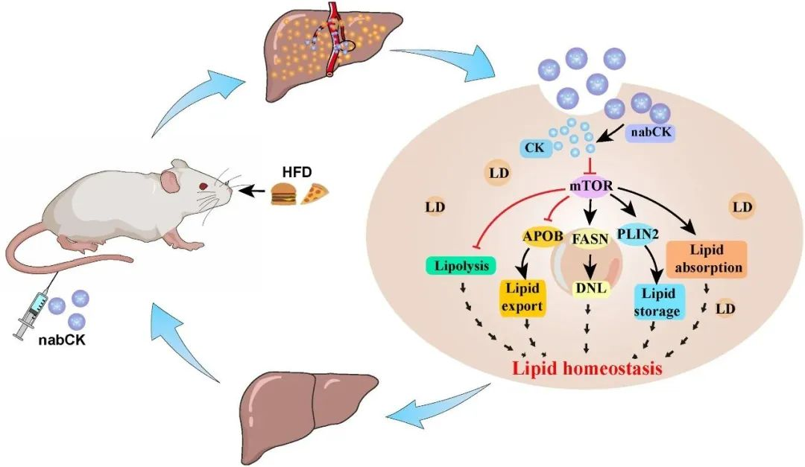
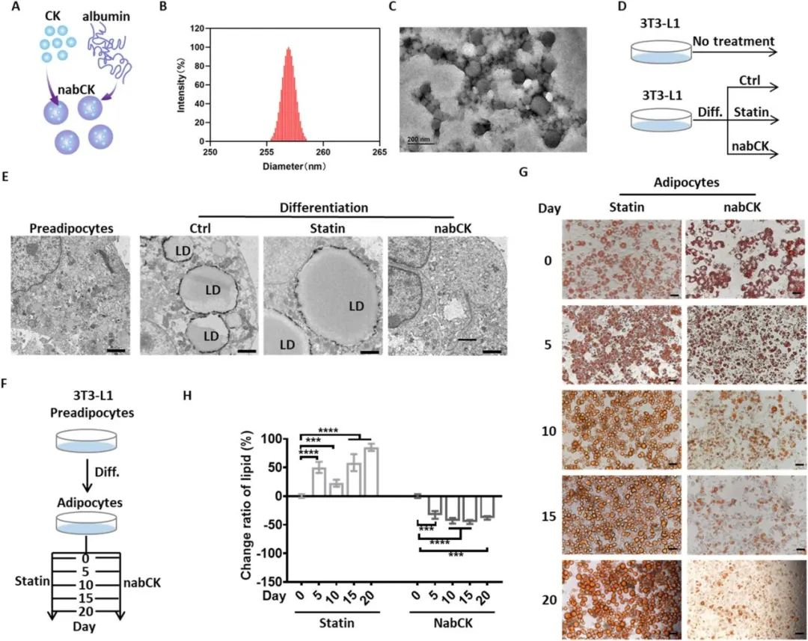
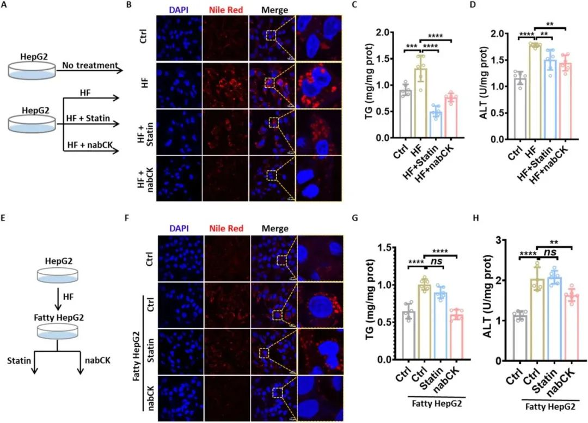
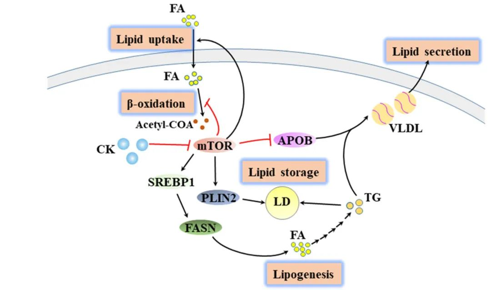
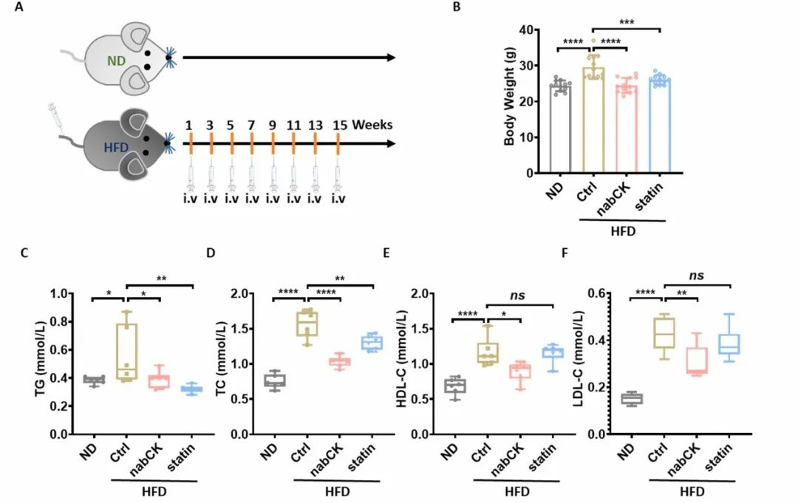

 

#  【Biomaterials】不喝酒也会就酒精肝，非酒精性脂肪肝怎么治疗？ 
 

Non-alcoholic fatty liver disease

非酒精性脂肪肝

这项研究中，作者成功开发了一种长效、低毒性的纳米候选药物——nabCK，nabCK由天然化合物人参皂苷化合物K（CK）和白蛋白构成。作为人参的主要代谢产物，人参皂苷CK对脂质代谢具有良好的调节作用，白蛋白是肝脏分泌和代谢的重要载体，有助于提高CK的溶解度和靶向肝脏的效果。在脂肪细胞和肝细胞中，nabCK可有效预防脂肪沉积并减少脂滴的形成。

**制备及表征**

首先，为了增加人参皂苷C-K的溶解度，作者使用白蛋白对人参皂苷C-K进行封装，得到了纳米颗粒（nabCK），其平均水动力学尺寸为272 nm（见图1B），透射电子显微镜（TEM）和扫描电子显微镜（SEM）显示nabCK颗粒呈现独特的球形形态（见图1C和图S1B）。因为高脂会促进前脂肪细胞分化为成熟的脂肪细胞，而脂肪细胞的增加则是肝脏脂质毒性的主要来源。因此作者首先评估了nabCK对前脂肪细胞分化的影响（图1D）。在分化结束时，他汀处理的细胞中观察到了很强的着色强度，这表明他汀并没有减轻分化过程中脂质积累的情况，不能抑制前体脂肪细胞向成熟的脂肪细胞分化。相反，使用nabCK培养的细胞呈现出明显较弱的信号，表明nabCK能够抑制脂质积累并延缓前脂肪细胞的分化（图1E）。接下来，作者探讨了 nabCK 逆转分化的可能性（图 1F），在 nabCK 培养下，分化脂肪细胞中的脂滴含量随着时间的推移逐渐减少。十天后，脂质含量基本稳定（图 1G），而他汀类药物处理则明显加速了脂质的积累（图 1H）。这些结果表明，除了抑制脂质储存，nabCK 还能进一步促进脂质排出，逆转分化进程。

图 1.NabCK 阻止前脂肪细胞分化。(A) 生成 nabCK 的方案。(B) nabCK 的 DLS 分析。(C) 用 TEM 进行形态学分析。(D) nabCK 对分化的预防效果分析程序。在前脂肪细胞 3T3-L1 上进行分化诱导，并在过程中添加 nabCK 或他汀。(E）用 TEM 分析 3T3-L1 细胞的超微结构。刻度线，2 μm。(F）分化的 3T3-L1 脂肪细胞中 nabCK 的逆转效应分析程序。分化后，加入 nabCK 或 Statin 以监测脂质消除效果。每 5 天采集一次图像。(G) 用油红 O 染色测量脂质含量。刻度线，20 微米。(H）与分化脂肪细胞有关的脂质变化比率。提取与脂质（G）相连的油红 O，并在 570 nm 处用吸光度定量。平均值 ± SEM。ns：无显著性，\*P &lt; 0.05，\*\*P &lt; 0.01，\*\*\*P &lt; 0.001，\*\*\*\*P &lt; 0.0001。

**细胞水平检测**

过多的脂质会在肝细胞中积聚并导致脂毒性损伤。作者用高脂肪（HF）培养基诱导 HepG2 肝细胞脂肪沉积。同时，加入nabCK 或 Statin 以评估它们对高脂诱导脂肪肝的预防作用（图 2A）。诱导24小时后，nabCK 能显著抑制高脂诱导的 LDs 形成（图 2B，C），丙氨酸氨基转移酶（ALT）会因肝损伤而升高，已被用作非酒精性脂肪肝的临床生物标志物,因此，作者评估了脂肪肝过程中 ALT 的变化（图 2D）。结果表明，他汀类药物和 nabCK 对ALT 升高有抑制作用（图 2D）。接下来，作者研究了 nabCK 在脂肪肝 HepG2 细胞中的去脂作用（图 2E）。荧光成像显示 HF 处理的 HepG2 细胞中信号增强，表明脂肪变性的发生（图 2F）。用nabCK 处理脂肪细胞 24 小时后，信号明显减弱，这表明 nabCK 促进了沉积脂质的清除。然而，他汀对脂肪肝细胞的脂质消除没有明显影响。定量结果进一步证实了这些发现（图 2G）。所有这些发现都表明，nabCK 可通过防止肝细胞脂质沉积和促进脂肪肝细胞排出脂质来恢复脂质代谢和修复损伤的肝细胞。

图2. NabCK 可减轻脂肪肝细胞中的脂质积累。(A) 评估预防高脂肪诱导的脂肪变性效果的示意图。(B) 用指定处理方法对肝细胞中的脂质进行共聚焦成像。刻度线，10 微米。(C) 指定处理肝细胞中的甘油三酯（TG）水平。平均值 ± SEM。单因素方差分析。(D) 指定处理的肝细胞中丙氨酸转氨酶（ALT）水平。平均值 ± SEM。单因素方差分析。(E）脂肪肝细胞中脂质清除效果的评估示意图。(F）脂肪肝细胞中脂质的共聚焦成像。刻度线，10 μm。(G）脂肪肝细胞中的 TG 水平。平均值 ± SEM。单因素方差分析。(H）指定处理下肝细胞中的 ALT 水平。平均值 ± SEM。ns：无显著性，\*P &lt; 0.05，\*\*P &lt; 0.01，\*\*\*P &lt; 0.001，\*\*\*\*P &lt; 0.0001。

**基因检测**

NabCK可以通过纠正多种脂质通路改善脂肪变性的发展过程，包括脂肪吸收、脂肪输出、脂肪酸合成、脂质储存和炎症等通路，从而恢复脂质代谢的平衡。这些通路都受到mTOR的调节，而NabCK可以抑制mTOR的活化，从而恢复脂质代谢的平衡。此外，在高脂饮食诱导的NAFLD小鼠中，NabCK可以减缓脂肪变性和纤维化的发展，并对心脏组织的脂毒性产生保护作用。

图3. NabCK 抑制 mTOR 激活，消除脂肪肝细胞的脂质毒性

**动物检测**

作者在高脂饮食诱导的小鼠模型中验证了NabCK的效果。具体来说，作者测量了小鼠的体重和血液中的脂质生物标志物，包括三酰甘油、总胆固醇、高密度脂蛋白胆固醇和低密度脂蛋白胆固醇。此外，作者还对小鼠的肝脏进行了油红O染色以评估脂质含量，对心脏组织进行了H&E染色以检查心脏损伤，对肝脏组织进行了染色以评估纤维化程度。最后，作者通过相对病变大小的纤维化定量来评估纤维化程度。这些实验结果表明，NabCK可以减缓脂肪变性和纤维化的发展，并对心脏组织的脂毒性产生保护作用。

图4. NabCK 延缓高氟酸诱导的非酒精性脂肪肝的发展

**结论**

作者开发出了一种低毒、高效、可用于肝脏选择的纳米天然候选药物，可用于 NFALD 治疗。通过多组学方法，作者揭示了 nabCK 作为 mTOR 抑制剂改变脂质代谢的特殊机制。作者的数据表明，nabCK 可通过促进脂质输出、抑制 DNL 和脂质吸收，形成一个受 mTOR 调节的反馈网络，从而恢复脂肪肝肝细胞的脂质平衡，缓解脂肪肝肝细胞的脂毒性。值得注意的是，这种纳米天然药物能延缓纤维化的发展，保护心脏系统免受脂肪肝的损害。因此，综合安全性、高效性、生物利用度、肝脏选择性和保护作用等因素，作者认为 nabCK 具有压倒性优势，有望成为缓解非酒精性脂肪肝的候选药物。

Yue, C.; Li, D.; Fan, S.; Tao, F.; Yu, Y.; Lu, W.; Chen, Q.; Yuan, A.; Wu, J.; Zhao, G.; Dong, H.; Hu, Y. Long-Term and Liver-Selected Ginsenoside C–K Nanoparticles Retard NAFLD Progression by Restoring Lipid Homeostasis. Biomaterials 2023, 301, 122291. https://doi.org/10.1016/j.biomaterials.2023.122291.

**关注公众号并回复**

**10.1016/j.biomaterials.2023.122291**

**可获得原文下载链接**

[【Anal. Chem.】\[华中师范大学冯国强团队\] 急性深肾损伤怎么判断，查一下SO2浓度先](http://mp.weixin.qq.com/s?__biz=MzkzOTI1OTMwNg==&amp;mid=2247484059&amp;idx=1&amp;sn=385fc8fcdb95972f56307c53d338d2af&amp;chksm=c2f2e65ef5856f4856a8959c1a2a0eeff93a440fcb1d554bd19001530cbc6a0176ddb0a0c124&amp;scene=21#wechat_redirect)

[【JACS】\[清华大学储凌课题组\]荧光成像新选择，自恢复蛋白标签](http://mp.weixin.qq.com/s?__biz=MzkzOTI1OTMwNg==&amp;mid=2247484033&amp;idx=1&amp;sn=a845fb8aaf2d3588b6a713aae760779c&amp;chksm=c2f2e644f5856f52deed411562ca58cb3998d9f5f2a3573c25ae1ac345cfb17444b1c78ecce0&amp;scene=21#wechat_redirect)

[科技资讯0816](http://mp.weixin.qq.com/s?__biz=MzkzOTI1OTMwNg==&amp;mid=2247484007&amp;idx=1&amp;sn=d2453d87f7b3a44246e22666be6e9a3c&amp;chksm=c2f2e6a2f5856fb4e87f9d21aecfbbd1664c2d855513c99feea65756102ef92294e5dd91b570&amp;scene=21#wechat_redirect)

预览时标签不可点

  继续滑动看下一个 

 轻触阅读原文 

    

