 

#  【Coord. Chem. Rev.】不容错过，一文看懂细菌识别机制、材料特性及识别方法的应用 
 

Grenemal

读完需要

51

全文字数 17000 字

**细菌识别**

Multiple Bacteria Recognition

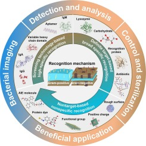
•

在人类历史的长河中，不断涌现的致病细菌始终是全球公共卫生领域的一大挑战。与此同时，人类亦在不懈探索细菌的潜在应用价值。深入理解细菌的表面化学和生物信息，对于细菌相关研究及其在实际应用（如锚定、成像和抑制）中具有重要意义。

本综述以新颖的视角，将细菌识别机制依据不同的识别单元进行了分类。这些识别单元包括基于筛选技术的高特异性识别（如各类抗体、适配体和噬菌体等），基于明确靶标的广特异性识别（如生物成分、抗生素等），以及基于非靶标的非特异性识别（如改性纳米材料、染料等）。这种分类方法为我们提供了一个全新的视角来解读病原菌表面生化信息的传递机制，进而有助于我们更深入地理解细菌的粘附机制。

此外，本综述还探讨了不同识别机制在细菌成像、检测、控制和有益应用等方面的实际应用。这些应用不仅展现了细菌识别技术的广泛性和实用性，更为未来在诊断和疫苗开发中的细菌识别元件应用提供了新的启示，为实现对病原菌的有效控制甚至利用提供了可能。

在追求“变废为宝”的过程中，需要所有利益相关者之间的跨学科合作与交流。本综述围绕“细菌识别-控制-利用”这一系统主线展开，旨在为维护微生物世界的自然平衡、消除微生物危害提供重要的理论支撑和实践指导。

**1. Introduction**

细菌感染是发达国家和发展中国家共同的致命威胁，它渗透至我们生活的各个方面，包括食品污染（特别是食源性病原体）、人体皮肤直接接触导致的病原体感染，以及耐药细菌对医疗系统的威胁。每年，全球有数百万人因食物和水源受到细菌污染而罹患疾病，对人类健康构成严重威胁。预计到2050年，这一数字将攀升至每年1000万人，给全球经济带来约100万亿美元的损失。

金黄色葡萄球菌、鼠伤寒沙门氏菌、大肠杆菌O157:H7、李斯特菌、结核菌、链球菌、产气荚膜梭菌和蜡样芽孢杆菌等是引发大多数细菌性疾病的主要病原体。此外，抗生素的过度使用和不恰当管理导致了超级细菌的出现，进一步加剧了这一全球性问题。

细菌入侵宿主细胞的首要步骤是细菌粘附到细胞表面，这一过程由细菌粘附素介导。细菌表面分子与宿主细胞或细胞外基质结合，不同种类的细菌具有不同的细胞表面分子结构。例如，化脓性链球菌拥有纤连蛋白结合蛋白（蛋白F）和茶酸（teichoic acid），它们能够与细胞表面和细胞外基质中的纤维蛋白结合。此外，某些细菌具有细丝状的缘膜，缘膜顶端的特定氨基酸序列决定了它们粘附宿主细胞的特异性。

为应对细菌性疾病的传播，研究人员致力于深入研究细菌，包括细菌成像、检测、控制和杀灭等方面。这些研究的基础在于全面了解细菌的组成和特性。细菌的早期成像、检测和分离依赖于对细菌的识别和捕获。因此，探索细菌的表面结构、表位抗原和结合位点成为操纵细菌的关键突破点。

细菌表面的复杂性导致了识别机制的多样性。以革兰氏阴性细菌为例，其细胞壁由薄薄的肽聚糖层组成，位于细胞质膜和细胞外膜之间。相反，革兰氏阳性细菌的表面结构则包括较厚的肽聚糖层、聚合物茶酸盐层和位于肽聚糖下方的细胞质膜。就细菌表面的大分子物质而言，革兰氏阳性菌富含茶酸，而革兰氏阴性菌则含有较多的脂质和蛋白质，尤其是表面存在的脂多糖、磷脂和多种外膜蛋白。尽管细胞壁成分有所不同，但革兰氏阳性和阴性细菌表面的羧基、酰胺、磷酸盐和碳水化合物相关特征在两种类型的细菌中是一致的。这使得细菌表面通常带有负电荷，这种负电荷主要来源于羧酸盐和磷酸盐的去质子化作用。

识别细菌表面元素的关键需要聚焦于蛋白质和多糖等大分子。这些识别位点的独特性质及其相互作用力直接决定了识别的特异性。尽管过去的综述已经对细菌的识别元素进行了广泛概述，但关于识别机制的系统梳理仍显不足。

针对细菌的表面特征，深入理解不同细菌的识别机制对于掌握其生长规律、实现早期诊断、确保食品安全、环境监测以及高效防控具有至关重要的理论意义。细菌捕获技术作为靶向研究的基础技术手段，为不同应用模式提供了选择相应识别元件和机制的可能性。

本文基于识别的特异性，结合细菌表面的化学和生物学信息，全面总结了细菌的识别机理及其相互作用特点。针对细菌捕获的实际需求，本文探讨了这些识别机制在细菌成像、检测、控制和有益应用中的实际应用。

最后，基于细菌表面特殊大分子物质的特点，本文合理预测了细菌识别元件的发展前景，并提出了对识别机理进行深入研究的必要性。通过对细菌表面生化信息的深入研究，本文期望能够全面揭示细菌的识别机制，从认识细菌到早期诊断、中期防控乃至后期利用，为成功解决细菌污染问题提供必要的科学资源和专业知识。

**2. Recognition mechanisms**

基于细菌表面的生物和化学信息，研发人员精心设计了多样化的识别单元，这些单元涵盖了抗体、生物大分子、化学基团以及功能纳米材料等多个类别。这些识别单元根据其工作原理，可大致分为三类：基于免疫学的特异性识别机制、基于靶向识别的广义识别机制，以及基于非靶向识别的非特异性识别机制。

值得注意的是，随着从特异性识别到非特异性识别的过渡，这些识别机制的特异性会逐渐降低。具体而言，基于免疫学的特异性识别机制依赖于高度特异的抗体-抗原结合，提供了极高的识别精度。而基于靶向识别的广义识别机制则通过特定的生物大分子或化学基团与细菌表面的特定区域结合，虽然仍具有一定的特异性，但相对较弱。最后，基于非靶向识别的非特异性识别机制则通过功能纳米材料等与细菌表面进行非特异性的相互作用，其特异性最低。

这种分类不仅有助于我们深入理解各种识别机制的工作原理，也为我们在不同应用场景下选择合适的识别单元提供了指导。

2.1. Screening technology-based high-specific recognition

细菌之所以触发免疫反应，是因为它们的细胞表面通常覆盖着囊多糖（CPS）或脂多糖（LPS）的外层，或者两者兼有。重要的是，病原菌引发的免疫反应特异性主要依赖于CPS的结构，而其反应的强度则与其分子量紧密相关。当人体感染病原菌后，通过从血清中分离出能够特异性识别病原菌的蛋白质，可以获取到相应的抗体。抗体与抗原表位之间的结合力，即抗体亲和力，是一种非共价作用力，它涵盖了氨基酸间的吸引力、氢键、疏水作用等多种机制。

大多数感染会触发体液免疫反应，其典型特征是抗原特异性免疫球蛋白（Ig）M抗体水平的初始升高。随后，在亲和力成熟和同型转换过程中，可以观察到抗原特异性IgG、IgA和IgE抗体水平的上升。因此，IgM在识别病原菌时展现的特异性相对较低，而IgG、IgA和IgE则展现出更高的特异性。从结构上看，这些抗体亚型都是由基本免疫球蛋白单位经过修饰构成的。

不论抗体的来源如何，免疫球蛋白均可根据其识别位点被划分为单克隆抗体（mAbs）和多克隆抗体（pAbs）。除了完整的抗体结构外，通过蛋白质水解或基因工程技术获得的不完整抗体也在免疫识别研究中得到了越来越多的应用（图1A）。其中，单链可变片段（scFv）和片段抗原结合区（Fab）是重组抗体中最常见的形式，因为它们具有生产周期短、抗原亲和力高和结构稳定等优点（图1B）。

近年来，可变重链域（VHH），也称为纳米抗体（Nb），已成为一种极具吸引力的免疫试剂。这些Nb源自驼科动物和软骨鱼血清中的天然纯重链抗体VHH，是最小的完整Fab片段（图1C）。抗原与抗体之间的主要相互作用力包括氢键、范德华力和静电吸引力。抗体的合成依赖于一个具有免疫原性的识别位点。通常，抗体对细菌表面的蛋白质、碳水化合物等大分子具有高度的亲和力。基于抗体的病原体识别方法具有显著优势，如高特异性、强抗原抗体结合力和快速响应。
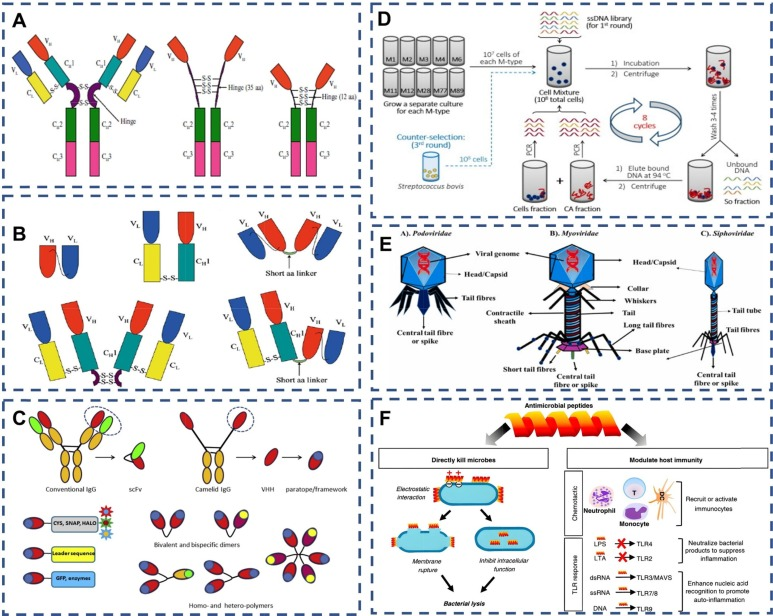
图 1. (A) 基本免疫球蛋白的结构 .。(B) scFv、Fab 片段、(scFv)2、F(ab′)2 和 Fab-scFv 的结构 .。(C) 纳米抗体和纳米抗体构建体的结构 。(D) 生成与特定 M 型化脓性链球菌细胞结合的适配体的方案 。(E) 尾部噬菌体结构和附着细菌受体的识别位点。(F) AMPs 的生物功能。AMP 通过静电作用与细菌膜结合，或破坏膜，或进入细菌体内抑制细胞内功能。

适配体（Aptamer）是经过体外筛选技术——指数富集配体系统进化（SELEX）——筛选出的结构化寡核苷酸序列（RNA或DNA），它们对特定靶分子（图1D）展现出极高的识别性和亲和力。从随机序列库出发，适配体经过优化，能够以高亲和力与靶标结合。与某些单克隆抗体（mAbs）相比，适配体的解离常数范围广泛，从皮摩尔（pM）到微摩尔（mM）不等，显示出对靶标的极高亲和力。与氢键和静电吸引相比，范德华力虽然较弱，但适配体中的极性负电荷DNA分子理论上能提供更多氧原子和电子对，形成更多氢键，从而增强相互作用，维持结构的稳定性。此外，适配体的识别位点极其广泛，几乎所有靶标都有其相应的适配体，即使在细菌缺乏免疫原结构的情况下，也能找到相应的适配体。更值得一提的是，适配体能够区分不同的蛋白质亚型，这为其在多个领域的应用提供了巨大潜力。

噬菌体（phage）是一类能够感染细菌、真菌、藻类、放线菌或螺旋体等微生物的病毒。噬菌体之所以得名，是因为其能够导致宿主细菌裂解。噬菌体识别并与细菌表面结合的关键结构被称为受体结合蛋白（RBPs）。同一种噬菌体可能拥有多种RBPs，这些蛋白的主要功能是特异性地识别并结合细菌受体。噬菌体主要分为Podoviridae、Myoviridae和Siphoviridae三类（图1E）。其中，Podoviridae家族的P22噬菌体通过尾刺蛋白gp9的C端识别细菌外膜上的脂多糖（LPS）。而Myoviridae家族的T4噬菌体则通过其细丝结构进行吸附，这些细丝包括6条长细丝和6条短细丝。其中，长尾的gp37是一个受体结合结构域，能够以可逆的方式与细菌的LPS或外膜蛋白OmpC结合。短细丝则由gp12编码，不参与噬菌体的宿主特异性，与LPS的结合是不可逆的。P2噬菌体则采用底物吸附模式，其不可逆的吸附过程依赖于底物。当噬菌体的小管蛋白粘附域与细菌表面结合时，底物RBP会识别细胞壁中的特定糖基。

抗菌肽（AMPs）是一类由昆虫诱导产生的具有抗菌活性的碱性多肽，分子量约为2000∼7000道尔顿，由20∼60个氨基酸残基组成。这些活性肽通常具有强碱性、热稳定性和广谱抗菌等特点。抗菌肽的作用机制主要包括与细菌细胞壁合成的前体分子结合，干扰肽聚糖的合成；或与肽聚糖、丹宁酸等细菌细胞壁的关键成分结合，导致细胞壁破坏。对于针对细胞膜的抗菌肽，它们能够与细菌细胞膜上富含的带负电荷酸性磷脂通过静电吸附结合（图1F）。抗菌肽的疏水区域能够聚集在细胞膜的两性磷脂表面，并在膜表面积聚。对于革兰氏阴性菌，抗菌肽能够与带负电的外膜中的脂多糖结合，形成肽脂复合物和跨膜通道，破坏膜的完整性。而对于革兰氏阳性细菌，抗菌肽则能够与细胞表面的鞣酸结合并附着在细胞表面，通过其两亲结构形成构象簇，穿透膜的表面成分（如鞣酸、脂甘酸、脂多糖和肽聚糖层），进而达到细胞膜并造成膜损伤。

这些经过严格筛选的识别因子因其高亲和力和特异性，常被应用于需要精确区分病原体的领域，如感染的分析和检测。

2.2. Definite target-based broad specific recognition

抗生素作为医药领域的关键杀菌剂，是细菌识别与杀灭的重要工具。在杀菌机制中，特别值得一提的是那些针对细胞壁的抗生素，它们通常具备特异性识别位点Ⅳ。**其中，β-内酰胺类抗生素，以其独特的β-内酰胺环结构在化学上独树一帜，青霉素和头孢菌素便是这一类别中的佼佼者，广泛应用于临床治疗。**

以青霉素为例，其杀菌的关键在于与细胞膜上的青霉素结合蛋白（PBPs）形成稳定复合物。抗生素的作用具有高度的选择性，不同的抗生素对于不同的病原体展现出不同的杀菌效果。**这种对特定病原体的敏感性定义了抗生素的抗菌谱，即该抗生素能够覆盖的病原体种类。**

在抗生素分类中，有一类被称为窄谱抗生素，它们仅对单一的菌株或菌属具有抗菌作用。例如，苄基青霉素主要对革兰氏阳性菌有抑制作用。

此外，值得一提的是万古霉素（VAN），这是一种糖肽类抗生素。它通过五点氢键的特异性作用，与革兰氏阳性菌细胞壁上的肽聚糖末端D-Ala-D-Ala形成稳定的共轭结构，从而发挥其独特的抗菌效果。
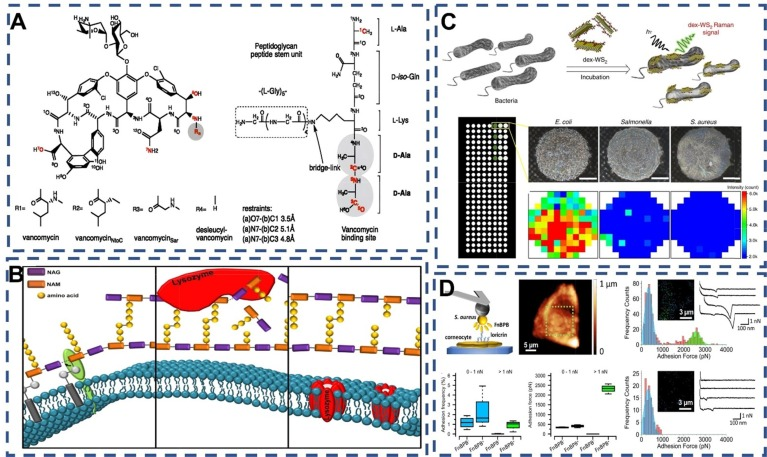
图 2：（A）万古霉素、万古霉素衍生物和 PG 的化学结构。。(B) 溶菌酶杀菌机制方案 .. (C) 使用葡聚糖分子量为 40,000 的改性 WS2 光学检测细菌的示意图 . (D) FnBPB 在金黄色葡萄球菌活细胞上的表达导致与暴露在角质细胞表面的配体形成高度稳健的单分子复合物 .

溶菌酶（Lysozyme），也称为蕈酰胺酶或N-乙酰蕈酰胺糖水解酶，是一种碱性酶，具备水解细菌粘多糖的能力。其主要作用机制是通过断裂细胞壁中正乙酰基水杨酸与正乙酰氨基葡萄糖之间的β-1，4-糖苷键，将不溶性粘多糖分解为可溶性糖肽，进而促使被破坏的细胞壁内容物释放，实现细菌的溶解。此外，溶菌酶还能直接与带负电荷的细菌蛋白质结合，并与DNA、RNA和去颤蛋白质形成复合物，使细菌失活。

人血清白蛋白表面的肽基同样能与细菌的细胞壁发生相互作用。类似地，因为细菌能表达与乳铁蛋白具有高亲和力的受体，乳铁蛋白也能与细菌结合。

在生物大分子活性物质与细菌的结合效应中，豆类凝集素A是一种非免疫源结合蛋白，它具备凝集细胞或沉淀多糖和多糖结合的能力，能特异性识别并与碳水化合物可逆结合。特别是，它能与细菌表面的末端α-D-mannosyl和α-D-Glucosyl基团特异性结合，因此被用作病原体的识别分子。

许多病原体利用哺乳动物表面的碳水化合物作为附着锚，导致感染。El-Boubbou等人开发了一种基于磁性糖纳米粒子（MGNP）的系统，该系统凭借磁性纳米粒子和各种碳水化合物的生物活性特殊结合，能有效捕获高达88%的大肠杆菌，并在5分钟内快速检测病原体。

在物理因素对疾病、生理和病原体行为的影响中，大肠杆菌FimH粘附蛋白的甘露糖粘附作用显著增强了病原体的粘附性。这是一种在分子水平上得到充分研究的微生物接合键。大肠杆菌O157:H7具有包括含有FimH蛋白的1型鞭毛和与肾盂肾炎相关的纤毛在内的碳水化合物结合位点。FimH凝集素是一种与甘露糖结合的蛋白质（解离常数Kd = 2.3 μM），但对葡萄糖的亲和力较低（Kd = 9.4 mM）。

Tae等人采用葡聚糖多价相互作用方法，在水溶液中同时剥离二维过渡金属二硫化物复合物并使其功能化。与大肠杆菌特异性抗体和适配体相比，产生的葡聚糖/TMD杂交物或dex-TMD对大肠杆菌O157:H7（C）表现出更强的亲和力（Kd = 11 nM）。

天然细胞膜上的受体蛋白也能识别细菌。树突状细胞（DC）作为抗原处理细胞，在激活人体免疫系统中的先天性免疫反应和获得性免疫反应中起着关键作用。树突状细胞膜上的受体（TLRs）负责识别病原体。

金黄色葡萄球菌表面的特异性蛋白质表现出广泛且多样化的特点，为其与识别因子之间建立了特异性物理结合和化学识别的桥梁。Marion等人的研究表明，纤维蛋白原与葡萄球菌表面蛋白SpsD之间的对接、锁定和闩锁相互作用是稳健的，并具有非典型的捕捉-滑动转变。Thaina等人通过单分子力谱（图2D）揭示了锚定在金黄色葡萄球菌细胞壁上的纤连蛋白结合蛋白B（FnBPB）与Loricrin之间的弱结合力和强（2 nN）结合力。

金黄色葡萄球菌表面的蛋白A（SPA）、蛋白G（SPG）和蛋白L（PPL）也是其独特的蛋白质组成。这些蛋白在结构和功能上既相似又不同，其中SPA、G和L是免疫球蛋白结合分子，与哺乳动物IgG上的特定位点有强亲和力。SPA作为一种42 KDa的因子，包含五个高度同源的细胞外Ig结合区E、D、A、B和C。SPG则包含两到三个结构域，可与哺乳动物IgG恒定区的Fc位点结合。与SPA和SPG不同，蛋白L（PPL）仅与哺乳动物的κ型IgG轻链结合。这些蛋白的单个结构域已被证明能与IgG结合，因此，哺乳动物的IgG蛋白可作为金黄色葡萄球菌和链球菌的识别要素。

基于生物成分的识别机制主要聚焦于病原体表面的独特结构和化学组成，这种识别机制通常展现出广泛的特异性。此外，其识别的亲和力尤为显著，这主要得益于对病原体表面复杂结构的深入理解以及结合机制的深入研究。通过不断探索和解析这些结构和机制，基于生物成分的识别方法为病原体识别领域提供了更多的可能性，从而提高了识别的准确性和效率。这种识别机制不仅体现了化学和材料学的专业知识，也展示了生物技术在病原体检测领域的重要应用。

2.3. Nontarget-based nonspecific recognition

非特异性识别，特别是在细菌识别领域，指的是一种识别机制，其目标成分的作用部位或作用力并非仅针对细菌，然而，这种方法在细菌识别中仍具有广泛的应用。近年来，苯硼酸及其衍生物在生物共轭物领域受到了极大的关注，主要归因于它们与含有顺式二醇结构（如聚糖、糖蛋白、核苷和核苷酸等）的生物分子之间的可逆连接能力。

具体而言，苯硼酸及其衍生物能够与细菌表面的糖蛋白、脂多糖和肽聚糖中的顺式二醇分子发生共价连接，形成可逆的环状顺式二醇酯。这种连接机制为细菌识别提供了新的途径。

硼酸基团与顺式二元醇之间的相互作用复杂且多样，主要包括疏水作用、路易斯碱效应、离子作用、氢键作用和硼酸盐亲和力等五种类型。这些相互作用共同决定了苯硼酸及其衍生物与顺式二醇结构的结合能力和稳定性。如图图3A所示，这些相互作用及其影响因素已经得到了深入的研究和总结，为苯硼酸及其衍生物在生物共轭物领域的应用提供了重要的理论依据。
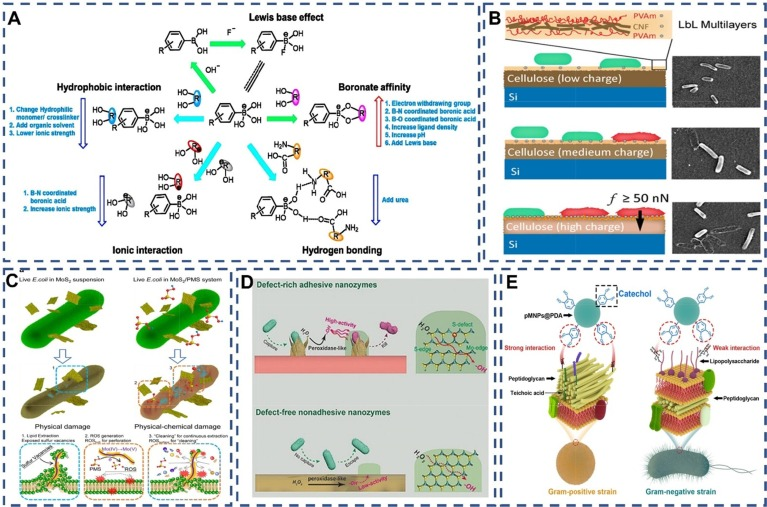
图 3. (A) 硼酸盐亲和层析的选择性操作和影响性能的因素。绿色箭头表示有利的相互作用，蓝色箭头表示不利的相互作用。红色向上箭头的出现表明给定元素有可能促进相互作用，而蓝色向下箭头的出现表明指定因素可以抑制相互作用。Copyright © 2015 John Wiley & Sons, Ltd. 版权所有。。(B) 基于阳离子聚电解质在纤维素材料表面的物理吸附的接触活性抗菌方法方案。。(C) 用于改善细菌捕获和消除的粘附纳米酶方案 . . (D) 大肠杆菌通过脂质提取或 ROS 氧化死亡的一般机制示意图 . (E) pMNPs@PDA 与革兰氏阳性细菌的选择性结合能力示意图 . ，

染料作为有机化合物，能够赋予物质鲜明且持久的颜色。在病原体检测中，传统的染色方法如革兰氏染色法和染料-病原体结合法主要依赖于病原菌表面蛋白质的标记。值得注意的是，唐研究团队在2001年对聚集诱导发光材料（AIEgens）进行了开创性的研究，显著提升了病原体检测的效率。相较于传统荧光团，AIEgens在细菌成像和检测中展现出更高的信噪比、光稳定性和信号可靠性，因此在荧光细菌传感领域备受关注。

鉴于革兰氏阴性菌和革兰氏阳性菌在外膜结构上的差异，AIE分子对它们的结合效力也各不相同。革兰氏阳性和阴性细菌的细胞膜均带有负电荷，有利于带正电荷的AIEgens与之结合。特别是革兰氏阳性菌，其单层脂质膜被多层交联肽聚糖层所包裹，与革兰氏阴性菌的多层外包膜结构形成鲜明对比。革兰氏阴性菌的外膜上存在的多孔通道对微小分子的渗透形成屏障，而静电和疏水相互作用使得阳离子AIEgens更易于进入革兰氏阳性细菌。

纳米粒子在细菌识别中主要依赖于静电吸附，通过对纳米材料表面结构和电荷的精准设计实现。Wang等人构建的富氮碳纳米粒子，因其表面正电荷，能够有效捕获沙门氏菌。Chen等人则通过改变纤维素模型表面的电荷分布，采用阳离子聚乙烯胺（PVAm）/阴离子纤维素纳米纤维/PVAm的多层铺设，实现广泛的细菌结合。纳米粒子的结构设计还可提高细菌的粘附性，细菌与粗糙表面间的拓扑相互作用以及鞭毛和纤毛的存在，使细菌易于粘附在动物细胞、人体组织或生物材料上。

受生物的启发，研究人员开发出能够捕捉细菌的粘合涂层，这主要归功于其粗糙表面。例如，粗糙纳米二氧化硅的尖刺表面显著增强了细菌的粘附能力。此外，利用柔性多晶纳米线阵列构成的粗糙表面，结合后的直纳米线迅速弯曲，能够迅速截留细菌。二维片状纳米材料，如Chen等人证明的二维二硫化钼（MoS2）纳米片，其锋利的边缘结构能够插入病原菌体内，实现粘合。Liu等人则构建了可编程和刚度介导的抗菌纳米线（NiCo(OH)2CO3 NWs），通过机械方式穿透β-内酰胺耐药菌的细胞膜。这些研究不仅证明了粗糙表面和锋利边缘结构在增强细菌粘附力方面的作用，也为开发高效的细菌捕获材料提供了新思路。

纳米材料通过精心设计的功能基团和纳米结构，实现了与病原体的特异性结合。Li等人的研究以PDA（聚多巴胺）为例，揭示了多巴胺修饰的磁性纳米球与PGN（肽聚糖）的结合效力（29.7%）显著高于LPS（脂多糖）（12%）。这归因于PGN层中丰富的二糖和氨基酸，特别是赖氨酸中的胺基，它们能与PDA的邻苯二酚基团通过席夫碱反应或迈克尔加成反应形成稳定的共价连接。而LPS主要由多糖和脂质组成，缺乏与PDA发生反应的特定官能团。

此外，PGN中的胺基与PDA的儿茶酚基团形成的氢键较儿茶酚与LPS的羟基所形成的氢键更为牢固。同时，胺基与儿茶酚之间的阳离子-π相互作用也进一步增强了PDA与PGN的结合。这种基于PDA的纳米材料及其类似物对革兰氏阳性菌和革兰氏阴性菌的选择性结合能力，正是源于它们之间的结构差异。

尽管这种非特异性识别方法无法精确区分不同的病原体，但通过针对特定需求的结构设计，可以在低成本下实现有效的识别。结合化学基团和生物成分的修饰，将功能性与识别性相结合，从而实现高效捕捉并完成任务。因此，非特异性识别方法作为一种经济高效的解决方案，特别适用于对目标要求不高的应用领域。

**3. Application of bacteria recognition**

3.1. Bacterial imaging

为了深入探究微生物群落的生长与增殖机制，乃至精确调控基于细菌的疗法或诊断手段，准确描绘细菌在宿主体内的分布位置显得尤为关键。在细菌成像技术中，荧光探针已成为广泛采用的标记工具。相应地，荧光显微镜也成为了细菌成像领域中不可或缺的重要仪器。尽管细菌研究的方法日新月异，但受限于这些微生物的尺寸（通常在1至10微米之间）及其厚实的细胞膜（多具有不透水特性），成像过程仍面临诸多挑战。这些难以渗透的细胞膜成为了荧光标签应用中的一大障碍。

因此，多数研究聚焦于观察细胞外成分。鉴于重要的聚合与交联过程多发生在细菌细胞表面与溶剂接触的区域，肽聚糖（PGs）的生物合成途径便成为了细菌识别的重要目标。肽聚糖作为细菌细胞壁的主要成分，其生物合成途径不仅揭示了细菌生长的关键步骤，同时也为细菌的识别和成像提供了新的视角。

**3.1.1. Bacterial imaging based on specific recognition**

体内靶向细菌标记依赖于高度特异性的识别因子。早在20世纪，抗体就被广泛用于细菌成像，基于抗体的特异性细菌成像方法已成为早期被广泛接受的技术。最初，非特异性人类免疫球蛋白或抗原特异性单克隆或多克隆抗体作为识别因子被广泛采用。这些抗体结合放射性元素标记策略，不仅确保了识别的特异性，还提升了传统成像剂的效率。相应地，细菌成像技术也为筛选高亲和力抗体提供了基础，这主要依赖于细菌和抗体之间的靶向性。

Mailis等人开发了一种新型的mAb筛选方法，利用高含量成像技术和基于图像的形态分析，成功筛选出一种针对大肠杆菌ST131（图4A）的O25b O抗原的特异性mAb。此外，噬菌体在细菌成像中也展现了其独特的价值。筛选出的噬菌体在体外检测中表现出优异的特异性，适用于特定细菌的成像。Yang等人采用噬菌体T7作为识别因子，并通过定量图像分析评估噬菌体诱导的细菌裂解效果。这种方法在体外成像和检测中展现了高灵敏度和特异性。然而，在体内成像实验中，仅有少数研究获得了特异性成像结果。
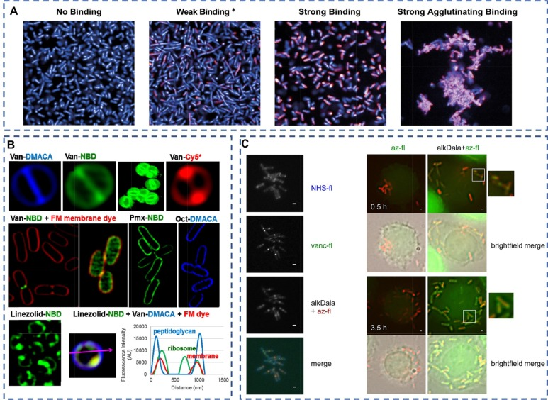
图 4（A）针对临床大肠杆菌 ST131 分离物筛选 KM467 发现了四种不同的结合表型。观察到四种抗体结合表型（a）：无结合、弱结合、强结合和强凝集结合。. (B) 使用超分辨率结构照明显微镜技术用万古霉素荧光团标记金黄色葡萄球菌 ATCC 25923。结果显示，隔膜的定位非常准确，细菌小于 0.6 μm。此外，还利用 Van-NBD 探针对金黄色葡萄球菌进行了三维图像重建 SIM。野生型或突变型 lpxC 大肠杆菌暴露于 Van-NBD 和 FM4-64X（一种红色膜染料）时，其外膜穿透力在正常细菌中仅限于分裂部位。然而，在受损的 OM 中，这种穿透力明显增强。应用多粘菌素-NBD 或八肽-DMACA 探针可看到大肠杆菌 ATCC 25922 的膜定位。金黄色葡萄球菌 ATCC 25923 的利奈唑胺-NBD 探针出现了内化现象，可能是在核糖体靶点。对金黄色葡萄球菌 ATCC 25923 菌株用绿色 Linezolid-NBD、蓝色 Van-DMACA 和红色 FM4-64X 膜染料进行共染。横截面图像显示肽聚糖和膜都被准确标记。(C) AlkDala 可标记体外和体内新合成的单核细胞增多性乳酸杆菌肽聚糖。

抗生素介导的肽聚糖（PGs）生物合成途径是一种广泛采用的细菌荧光标记技术。青霉素和其他β-内酰胺类抗生素通过抑制肽键蛋白（PBPs）的转肽活性来发挥抗菌作用。PBPs是维持细胞完整性所必需的，因为它们负责产生肽交联。这些酶的化学标记依赖于其使用β-内酰胺环的活性，该设计模拟了PGs干肽底物的末端部分，即D-Ala-D-Ala。因此，受β-内酰胺结构启发的探针也被用于研究细菌蛋白质的功能。

如图4B所示，超分辨率结构照明显微镜图像揭示了万古霉素、多粘菌素、八肽和利奈唑胺荧光探针对细菌细胞的标记效果。据此，作者提出万古霉素的荧光标记物（Van-FL）可作为观察活细胞中PG生成过程的有效工具。使用Van-FL探针处理的枯草杆菌显示螺旋状侧壁染色减少，而在分裂部位染色最为显著，预示着新生PG在此处合成。Van-FL已成为多种革兰氏阳性细菌（如肺炎链球菌、共生链霉菌和谷氨酸棒状杆菌）追踪PG活性生成的关键工具。目前，只有革兰氏阳性细菌的荧光标记万古霉素和雷莫拉菌素被证实有助于解析PG的生物合成过程，这是因为革兰氏阴性细菌的外膜与致密的脂多糖（LPS）相连，形成了这些大分子的天然屏障。

值得一提的是，Ramoplanin通过封存脂质II到目标结构来参与细胞壁的生物合成。在针对枯草芽孢杆菌细胞的研究中，荧光素偶联的ramoplanin显示出剂量依赖性的标记效果。在较低探针浓度下，可观察到螺旋状侧壁图案以及分裂间隔和细胞的染色。

除了抗生素外，小分子有机物也能有效参与PG的生物合成。在PG生物合成的关键位置，荧光d-氨基酸能有效地整合到多种细菌的PG中，从而在不影响细菌生长的情况下实现对细菌生长的有针对性的共价探测。研究小组报告称，使用荧光团连接的d-氨基酸（荧光d-氨基酸，FDAA）可以插入PG干肽中。例如，含有微小荧光团的d-丙氨酸和d-赖氨酸类似物（如羟基香豆碳酰基-氨基-d-丙氨酸，HADA）的开发，有助于通过荧光显微镜识别活细胞中最近生成的PG。这些探针在一系列革兰氏阳性和革兰氏阴性细菌上进行了初步测试，包括枯草杆菌、大肠杆菌、金黄色葡萄球菌、肺炎双球菌、农杆菌和新月体。

此外，如图C所示，一种含d-丙氨酸类似物（特别是(R)-丙炔基甘氨酸）的可点击炔烃已被用于标记单核细胞增多症L.在巨噬细胞感染情况下的新生PG。这些相关反应使得荧光素能够标记细菌的细胞壁，从而实现细菌成像的精确性。

**3.1.2. Bacterial imaging based on nonspecific binding**

荧光成像技术因其操作简便、原位观测能力以及高时空分辨率而备受青睐。在细菌荧光成像中，荧光染料的精心设计和应用显得尤为关键。鉴于细菌表面常带有电负性，研究人员倾向于选择带正电荷的染料。如图5A所示，Sangrim等人发现，相较于其他菌株，带正电荷的含二胺的BMeS-p-A染料对革兰氏阴性鲍曼不动杆菌（AB）及其耐碳青霉烯类变种（CRAB）展现出更为出色的选择性染色能力。这归因于革兰氏阴性菌与革兰氏阳性菌表面结构的不同，导致它们对带有不同正电荷的荧光染料有不同的亲和力。

传统荧光团常受限于聚集诱导淬灭（ACQ）现象，而AIEgens（聚集诱导发光分子）则因其能够选择性地在高浓度下聚集，特别适合用于细菌和细胞器的成像。这些AIEgens具有一系列优势特性，如高亮度、出色的光稳定性以及卓越的信噪比。因此，基于这一结构特征，AIE结构被特意设计为能够在病原菌表面聚集，从而实现病原菌的成像。

例如，Zhao等人设计了一种名为TPE-Bac的AIE分子，它是一种两亲分子，具备两条疏水烷基链和两个带正电荷的亲水胺基团。这种分子能够插层进入细菌细胞膜，实现细菌的成像与裂解（图5B）。通常，AIE分子都被设计成带有正电荷的基团，以便通过静电吸附与病原菌结合。

Dou等人的研究进一步开发了一种名为TBP-1的AIE分子。通过分子模拟观察，他们发现TBP-1的三苯胺基团首先与细胞膜建立初步接触，而非带正电荷的吡啶基团。当TBP-1完全插入细胞膜后，其疏水性三苯胺基团会定位在细胞膜的疏水核心内。这种定位限制了TBP-1的分子变化，从而触发了荧光“开启”现象和细菌“点亮”效果（图5C）。AIE分子与细菌表面的结合依赖于AIE结构的设计，其中化学基团的分子间作用力和静电吸附力在这一过程中发挥着至关重要的作用。
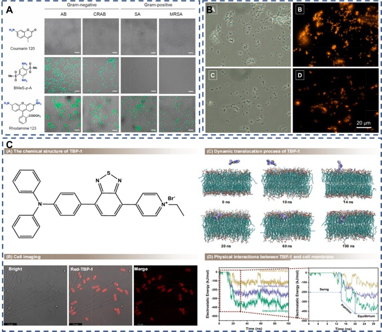
图 5：(A) AB、CRAB、SA 和 MRSA 与 BMeS-p-A、香豆素 120 和罗丹明 123 染料菌株的共焦激光扫描显微镜图像. 。(B) 表皮葡萄球菌和大肠杆菌与 10 μM TPE-Bac 培养 10 分钟后的明视野和荧光图像。(C) AIEgens 使细菌 "发光 "的特征和机制。

3.2. Analysis and detection

在病原菌的分析和检测过程中，特异性识别因子与目标之间的精确结合是核心步骤，同时，这些识别因子还需能赋予病原菌明确的检测信号。为实现这一目标，特异性识别因子与信号标签的有效耦合显得尤为关键。在化学和材料学领域，一系列基于识别和结合病原菌表面化学的检测方法已被广泛应用，包括但不限于侧向层析检测法、酶联免疫吸附检测法、微流控装置以及电化学分析法等。这些方法通过高度特异性的识别因子，实现对病原菌的精准识别和检测，为疾病的预防和控制提供了强有力的技术支持。

**3.2.1. Lateral flow assay (LFA)**

侧流层析（LFA）因其操作简便、反应迅速、可视化读数以及无需大型仪器的特点，成为现场病原体快速检测的主流技术之一。在LFA检测中，分析物的成功识别依赖于高特异性的检测抗体与标签的精准结合，通过毛细管作用使金纳米粒子在测试区和控制区聚集，实现信号的有效传导。

LFA检测病原体的主要机制是夹心法，这需要一对特定的抗体：一种是固定在硝酸纤维素膜（NC膜）上的检测抗体，另一种是捕获抗体。然而，由于配对抗体的筛选具有技术挑战、成本高且耗时长，研究者们不断开发新的识别技术来优化LFA。因此，非标记或非配对抗体的检测技术逐渐成为研究热点。

根据现有数据，使用更特异的识别元件构建的信号标签通常能够实现更低的检测限，其中识别元素的质量也起着关键作用。尽管无标记策略在信号标签构建中颇为常见，但LFA检测线上最常用的信号标签仍然是抗体。这主要归因于以下几个原因：首先，抗体作为高特异性的识别因子，能确保检测的精确性和特异性；其次，其他捕获因子（如短肽和适配体）因体积较小，通常需要先与载体蛋白结合再固定于LFA组件（如NC膜和共轭垫）上，而抗体作为大分子蛋白质，其固定在NC膜上的能力更强；最后，抗体对病原菌的捕捉效率高，能在较短时间内捕获到目标病原菌。

根据粗略统计，抗体作为识别因子的检测时间通常小于或等于20分钟，而其他识别策略的检测时间则较长。这些优势使抗体成为固定识别因子的理想选择。

Table 1. Application of multiple identification mechanisms of pathogenic bacteria in LFA.
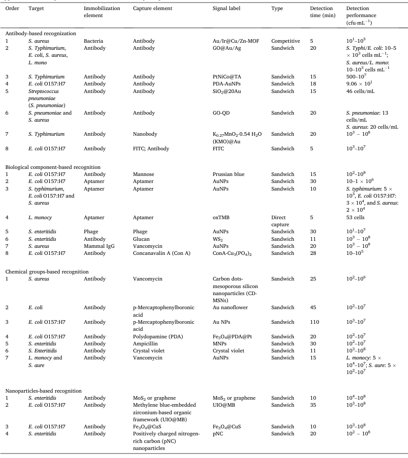

**3.2.2. Enzyme-linked immunosorbent assay (ELISA)**

ELISA（酶联免疫吸附测定）作为一种传统且高效的生化传感技术，其核心在于利用酶促反应驱动的化学比色法，实现对极低浓度分析物的精准定量。与LFA（侧流检测法）类似，免疫测定中抗体与抗原之间的“特异性结合”原理，在实验室研究和临床诊断中得到了广泛应用。

ELISA的核心机制在于抗原与抗体的特异性结合，进而通过信号输出实现对细菌的检测。这一原理与LFA在利用病原菌表面化学成分进行检测方面存在相似之处。尽管ELISA的检测时间通常较LFA长，但其较长的结合时间确保了抗原与识别因子（如抗体）的充分结合，从而提高了检测的灵敏度和准确性。

此外，ELISA技术在固定微小尺寸捕获成分方面表现出色，这使得如VHH（重链抗体可变区片段）等新型成分在ELISA构建中得到了更广泛的应用。然而，值得注意的是，ELISA过程中可能存在的非特异性吸附问题也是实验设计中需要着重考虑的因素。通过优化实验条件和选择合适的试剂，可以有效降低非特异性吸附对实验结果的影响。

**3.2.3. Others**

微流控技术作为一种集成化分析平台，将样品制备、反应、分离和检测等步骤巧妙地整合于微米尺度的芯片之上，实现了分析过程的自动化和高效化。在食源性细菌监测中，微流控芯片凭借其体积小、自动化程度高、无缝集成、处理效率高及资源占用少等显著优势，成为了重要的工具。对于病原菌检测，微流控技术的重要性在《微生物学》一书中得到了详尽的阐述。

特异性识别因子在细菌精确分析中扮演着不可或缺的角色。如图6A所示，Etayash等人开发了一种双材料微悬臂，其内表面嵌有微流体通道，这些通道通过化学或物理方法与受体功能化，能够选择性地捕获流经的细菌。特别地，抗单核细胞增多症mAb或单核细胞增多症靶向抗菌肽被用作特定识别元件，以识别并捕获单核细胞增多症细菌。这种技术同样适用于开发健康质量监测的生物传感器。

Mannoor等人则创新性地结合了石墨烯、电极和蚕丝，构建了混合结构，并应用于生物材料领域，包括牙釉质和组织。如图6B所示，该结构进一步被双功能石墨烯-AMP生物识别分子功能化，展现出极高的化学和生物传感灵敏度，甚至能够检测到单个细菌。此外，该设备还具备无线供电和读取功能，为牙齿健康监测提供了新的可能，成为预防和控制细菌威胁的有力工具。

Liu等人则利用万古霉素涂层纳米磁珠的细菌分离策略，通过一系列步骤（包括样品处理、细菌分离、细菌裂解、核酸扩增和光学检测）成功检测了与假体周围关节感染相关的四种细菌（金黄色葡萄球菌、耐甲氧西林金黄色葡萄球菌、大肠杆菌和鲍曼不动杆菌）。该方法检测限低至100 cfu mL^-1，为临床诊断和治疗提供了有力支持。

Shi等人则通过精确控制颗粒间的相互作用，实现了颗粒的可控聚集和跳跃功能。他们利用改造后的功能性抗体，实现了对单个细菌的可视化分析和检测（图6C）。然而，这种检测方法对抗体亲和力要求较高，高亲和力抗体能够确保细菌细胞与微粒的有效结合和分离。

在细菌检测领域，电化学生物传感器同样发挥着重要作用。Ding等人构建了一种基于适配体识别诱导滚环放大（RCA）/G-四重策略的比例双信号电化学生物传感器，实现了对致病菌（10 cfu mL^-1）的超灵敏检测（图D）。该传感器在检测人血清中的金黄色葡萄球菌时表现出良好的重现性，且无基质效应，为临床分析提供了新的可能性，有望将检测服务从专业实验室扩展到医院、非医院护理机构或家庭等公共场所。
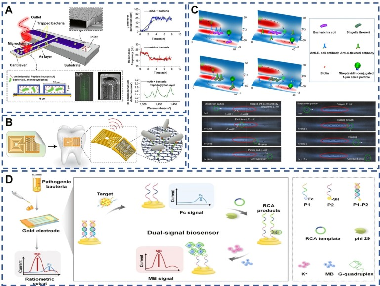
图 6. (A) 双材料悬臂及其多工作模式示意图。由包括细菌在内的两种材料制成的悬臂固定在硅衬底上。在最下部，双材料悬臂被一层厚度为 300 纳米的金层包裹。由于氮化硅层和金层之间的膨胀系数不同，产生的局部热量会导致悬臂偏转，因此这一层起到了附加元件的作用。双材料悬臂上覆盖着专门针对细菌设计的受体，并暴露在波长精确的可调红外光下。(B) 生物可转移石墨烯无线纳米传感器。利用可生物吸收的蚕丝印刷石墨烯，从而形成包含无线线圈的触点。将纳米传感结构生物转化到牙齿表面的过程。显示无线显示的传感组件放大图。石墨烯纳米传感器上多肽的自组装促进了病原菌的结合。(C) 通过选择性结合和跳跃选择抗体。在与生物素标记的抗大肠杆菌抗体和生物素标记的抗变形杆菌抗体共轭后，大肠杆菌和变形杆菌被困在热点中。(D) 基于aptamer识别诱导的滚动圈扩增（RCA）/G-四链式策略的超灵敏检测病原菌的比率双信号电化学生物传感器 .

在病原菌的分析与检测中，基于识别因子捕获机制的方法尤其强调识别因子的高度特异性。对于微流控等捕获技术，通常使用如抗体、抗菌肽等单一高特异性元件作为捕获元件。然而，在LFA（侧流免疫层析）和ELISA（酶联免疫吸附测定）这类技术中，普遍采用的是三明治结构检测方法，该方法中捕获的元素通常涉及两种特异性识别因子。

在构建三明治结构检测体系时，关键在于确保这两种识别元件的捕获结果能够精确匹配目标病原体。因此，与这种夹层结构相匹配的病原体识别元件，在化学和材料学领域具有更为广泛的选择范围，以适应不同病原体的特异性检测需求。

3.3. Control and sterilization

**3.3.1. Specific recognition-based sterilization**

在病原体研究的前沿，消除与控制有害微生物一直是备受关注的议题。本综述聚焦于杀菌剂与细菌识别及结合的研究进展。抗菌肽作为一种关键工具，能够特异性地与细菌结合，通过分裂细胞膜来实现杀菌目的。Wang等人报道了一种基于pH响应肽自组装与拆卸的多功能动态生物界面，这种界面能有效捕获细菌，并在微酸性环境中释放肽，进而特异性杀灭细菌，同时保持界面的抗感染性能。

在另一方面，Feng等人开发了一种创新的纳米复合材料，结合了超细双金属Au/Cu纳米粒子与溶菌酶淀粉样纳米纤维网络（LNF）。这种混合纳米酶体系显著提高了细菌捕获和催化攻击的效率，不仅在体外显示出优异的抗菌性能，而且在体内杀菌方面也展现出巨大潜力。

抗生素作为控制感染的传统策略，其重要性不言而喻。然而，随着病原菌耐药性的日益严重和耐药机制的复杂化，我们已迈入后抗生素时代。值得注意的是，抗生素对革兰氏阴性菌和阳性菌的控制效果因细菌表面结构的差异而有所不同。为了应对这一挑战，纳米技术为抗生素提供了新的应用途径。通过结合纳米材料和其他能与细菌结合的分子，抗生素能够更有效地穿透细菌外膜，进入细胞质中发挥作用。这一过程中，识别因子与抗生素的结合机制在进一步杀菌中起到了关键作用，值得深入研究和探索。

**3.3.2. Wide recognition-based sterilization**

与抗生素的作用机制不同，纳米材料通常直接导致暴露细菌的死亡。这主要归因于革兰氏阴性菌与革兰氏阳性菌在细胞膜结构上的差异，导致杀菌剂对革兰氏阴性菌的渗透性较低。在细菌细胞壁抗菌机制中，静电作用占据了重要地位。然而，在控制和杀灭细菌方面，识别因子与病原菌的特异性结合往往不是主要关注点。基于纳米材料的病原菌控制机制主要包括两方面。

首先，物理杀灭机制通过分子识别系统将纳米材料插入致病菌的细胞结构中，破坏生物体的完整性。这种纳米粒子刺穿细胞壁和细胞膜的方式类似于医学治疗中的纳米刀技术。当纳米材料刺穿内膜时，脂多糖和膜蛋白会从内膜渗出，导致膜通透性改变，细胞内物质外泄，最终引发细胞死亡。例如，Mo等人的研究表明，垂直排列的纳米小柱的窄边能够有效渗入细菌膜并造成伤害，而细菌则倾向于粘附在倾斜的纳米结构上并发生伸长，最终导致死亡。从骨修复的角度来看，倾斜的纳米结构在促进成骨的同时，也起到了物理消毒的作用。此外，光热热解也是一种有效的物理杀菌方式，如Zhang等人通过在Au@Pt NRs表面引入铂纳米点，不仅提高了光热转化率，还增强了其对细菌的亲和力，实现了对细菌的光热裂解。

其次，化学杀灭机制主要依赖于活性氧（ROS）的产生。ROS是杀死Ⅴ类致病菌的关键成分。ROS的杀菌机制主要包括两种：(a) 纳米粒子直接与细菌细胞壁相互作用，破坏细胞壁并渗入细胞内部，产生影响DNA、核糖体和蛋白质的ROS；(b) 纳米粒子与细胞外细菌环境相互作用产生ROS，ROS通过破坏细胞壁进一步进入细胞，影响DNA、核糖体和蛋白质。Liu等人根据铜绿假单胞菌独特的表面结构，设计了带有苯硼酸和季铵盐双功能基团的荧光共轭聚合物纳米颗粒。这种纳米颗粒通过糖桥接和静电作用在细菌表面紧密组装，产生ROS，有效杀死细菌。此外，杀菌剂还可以通过干扰细菌的正常生理功能（如DNA复制和蛋白质翻译）来入侵并杀死细菌，这些策略通常会导致从外到内的持续损害。

在杀菌应用中，通常不特别强调杀菌剂与细菌结合的特异性。因此，病原体结合方法通常包括基于靶标的广泛特异性识别和基于非靶标的非特异性识别。

Table 2. The design scheme of bacteria control based on nanomaterials.
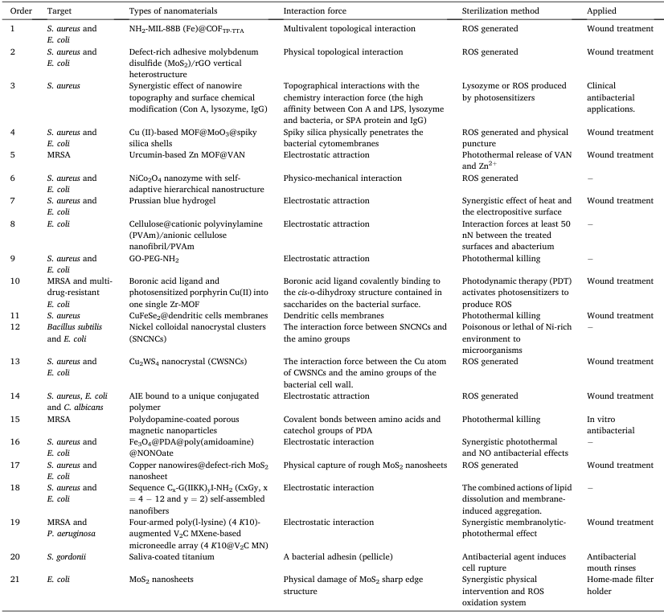

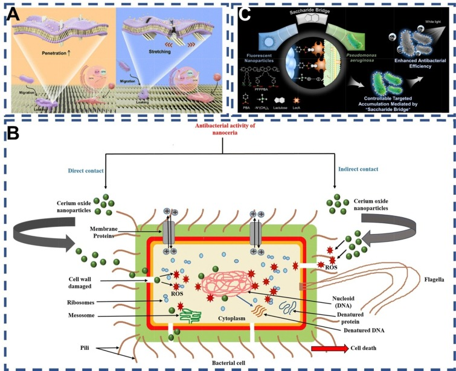
图 7. (A) 病原体倾斜和垂直纳米胶束结构物理杀灭细菌的示意图 . (B) 纳米陶瓷的抗菌机制 . . (C) 铜绿菌与聚合物 PFPFPBA 荧光共轭聚合物纳米粒子之间的糖桥结合示意图，以提高杀菌效率 . ，

3.4. Beneficial application of bacteria

**3.4.1. Hybrid bacteria**

细菌，以其固有的大规模、丰富的功能基团，以及将生物废物转化为功能材料的能力（作为关键信号标签候选之一），被视为合成纳米材料的潜在生物工厂。基于金黄色葡萄球菌表面SPA蛋白与哺乳动物IgG抗体Fc段的特异性亲和性，标记的金黄色葡萄球菌成为了理想的信号标签。如图A所示，Bu等人构建了一系列基于金黄色葡萄球菌的信号标记LFIA（侧向流免疫分析），用于快速检测玉米赤霉烯酮——一种由玫瑰镰刀菌产生的霉菌毒素。细菌表面的固有蛋白，作为优秀的靶标结合位点，通过合理利用这些位点，细菌成为了监测食品安全的优秀辅助生物材料。

此外，细菌因其良好的生物相容性，在靶向治疗和药物输送领域发挥着重要作用。与纳米材料的互补结合，为构建新型抗肿瘤治疗平台提供了解决方案。这种结合是相辅相成的，特别是在缺氧环境中靶向肿瘤的细菌，如兼性或兼性厌氧菌（如艰难梭菌、双歧杆菌、大肠杆菌、沙门氏菌等）。

关于纳米药物与细菌的作用机制，已有广泛研究。细菌与纳米材料之间的相互作用包括物理、化学和生物作用。物理作用涉及非共价作用，如静电吸附和范德华力，尽管在早期杂交细菌构建中相对容易实现，但在复杂基质环境（如体液）中稳定性受限。化学作用则涵盖共价键的形成、生物正交反应和生物矿化，其中生物矿化涉及在细菌表面捕获金属离子并将其转化为金属元素的过程。共价键的结合为细菌与纳米材料之间提供了更高的稳定性，适用于解决纳米材料在运输过程中的不稳定性问题。

如图8B所示，Chen等人将益生菌大肠杆菌Nissle 1917封装于磁性纳米粒子中，构建了生物杂交微机器人。这种探针集成了磁性、热敏性、缺氧敏感性和内部荧光蛋白，成为热敏和定位信号的双重报告器，可用于癌症靶向治疗。该研究整合了物理、生物和化学特性，以实现集体感知并促进癌症靶向治疗。

在生物相互作用方面，抗原-抗体特异性结合和受体-配体相互作用确保了特异性和稳定性。因此，在选择细菌与纳米材料的最佳组合时，应根据实际应用情况做出决策。完成靶向药物装载后，纳米材料-细菌复合物需要精准给药。在此过程中，细菌表面的鞭毛和指状体赋予其良好的运动性能和定植能力，确保任务的高效完成。更重要的是，对杂交细菌的药效进行实时跟踪，并探索药物作用机制，以便对理想的组合做出更全面的评估。
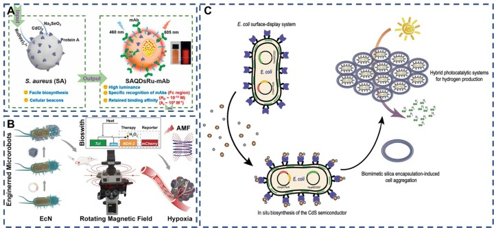
图 8. (A) 基于金黄色葡萄球菌的 QDs-Ru(bpy)32+ 的制造过程示意图。(B) 带有磁热生物开关的工程细菌杂交微机器人示意图，用于远程集体感知和图像引导的癌症治疗。(C) 拟议的表面显示生物杂交方法，用于空气中的光驱动制氢 .

**3.4.2. Engineering bacteria**

此外，细菌细胞在表达重组蛋白方面展现出显著潜力。通过基因工程技术的运用，我们能够在细菌系统中表达目标大分子，进而应用于重组细菌疫苗、生物燃料电池、全细胞催化剂、生物修复和生物传感器等领域。大肠杆菌细胞作为一种常用的表达系统，已被广泛应用于各种表面展示策略中。这些策略涉及利用外膜蛋白、脂蛋白、纤毛蛋白和鞭毛蛋白等作为载体，在细菌细胞表面展示目标蛋白质。

对于革兰氏阴性菌的表面展示，关键在于确保所表达的蛋白质能够穿越内膜并成功锚定在外膜上。例如，Wei等人通过设计工程大肠杆菌细胞中的自我光合成诱导制氢的生物修复方法，并利用表面展示系统原位生物合成了生物相容性硫化镉纳米粒子。此外，他们还引入了仿生二氧化硅封装策略，使得混合系统能够在自然有氧条件下连续生产氢气长达96小时，为太阳能化学生产提供了重要的参考策略。

细菌表面展示系统的主要优势之一在于其能够展示较大的分子，包括活性酶。这方面的研究主要集中在革兰氏阴性细菌表面展示活性酶上。这些展示酶的细菌不仅作为有价值的分子识别分子，还作为信号生成分子，为电化学生物传感器的制造提供了基础。

然而，与革兰氏阴性细菌的表面展示相比，革兰氏阳性细菌的表面展示蛋白通常通过共价键固定在细胞壁上。革兰氏阴性细菌产生的蛋白质往往定位于细胞质周围，而革兰氏阳性细菌分泌的蛋白质则释放到细胞外介质中，或通过不同类型的锚定基团（如LPXTG基团、LysM结构域或细胞膜上的脂蛋白）固定在细胞壁成分上。因此，革兰氏阳性细菌似乎更适合开发用于表面展示系统的应用。

**4. Conclusion, prospect, and challenge**

细菌的复杂化学和生物信息表面赋予了识别因子的多样性，这些识别因子是防御细菌感染的关键策略。本综述深入探讨了细菌的识别要素及其结合机制，并阐述了这些识别过程在细菌成像、检测、控制和有益应用中的潜在应用。这些研究成果为下一代抗菌药物和快速检测工具的开发提供了宝贵的见解，但仍有待进一步挖掘其潜力。

为了扩大识别元件的应用范围和场景，我们需开发更多细菌识别元件。纳米抗体（Nbs）作为传统单克隆抗体（mAbs）的替代品，在保持高识别度的同时，显著改善了理化特性。其优势主要体现在：一、易于标记，可通过融合多种标签实现抗体标记，甚至荧光标记，如绿色荧光蛋白；二、大规模生产便利；三、在耐热性、可逆显影性、水解性和溶解性等方面展现出良好的稳定性；四、其分子量小（15 kDa），比传统IgG（150 kDa）、Fab片段（55 kDa）或scFv（28 kDa）更小，且能保持纳摩尔级别的亲和力。这些特性使Nbs在临床诊断中展现出巨大潜力，尽管在实际应用中，Nbs与细菌的尺寸悬殊是否会影响其捕获效率仍需进一步观察。

在细菌分析中，金黄色葡萄球菌和大肠杆菌分别作为革兰氏阳性和阴性菌的代表，被广泛研究。然而，由于对其他细菌识别过程缺乏全面了解，广谱捕获策略的发展受到限制。鉴于细菌细胞壁成分与其致病性的直接关联，更深入地了解细菌表面的特定蛋白质或表位对于管理这些生物至关重要。因此，开发更多技术以确定细菌与识别元素的结合方式显得尤为关键。分子对接、电位分析、X射线光电子能谱（XPS）分析和模拟技术等已被用于描述细菌与识别元件的结合特征，但细菌表面基团的复杂性导致额外共价键的形成过程尚未得到深入研究。

基于当前对细菌识别因子的探索，未来研究应致力于提高捕获效率，并从识别特异性、效率和稳定性等方面开发抗体替代品。这将有助于在更多领域探索准确识别细菌的可操作性，为细菌引起的疾病提供有针对性的治疗策略。在准确性方面，我们期望通过识别区分益生菌和病原体，避免在治疗过程中误杀益生菌。最终，我们希望开发出高生物安全性的病原体清除剂，并应用于食品安全、环境安全等领域，有效防止二次污染。

在探讨病原体识别和应用的广泛前景时，我们也面临着多重挑战。首先，新识别单元和先进材料技术的设计尚存空间。从人体天然免疫系统的进化中，我们可以观察到微生物细胞壁成分，如革兰氏阴性菌的脂多糖（LPS）、革兰氏阳性菌的肽聚糖（peptidoglycan）、脂美酸（lipoteichoic acid）、TLA等，作为病原体相关分子模式（PAMPs）触发天然免疫和炎症反应。这些PAMPs的识别依赖于一系列模式识别受体（PRRs），包括Toll样受体（TLRs）、核苷酸寡聚体结构域（NOD）样受体（NLRs）、视黄酸诱导基因I样受体（RLRs）和C型凝集素受体（CLR）。尽管PRRs的识别机制已被深入研究，但其开发和应用仍有待进一步拓展。

除了天然识别因子外，纳米技术的快速发展为细菌识别和应用提供了新途径。通过工程细菌技术，我们可以实现细菌与纳米粒子的紧密结合。结合基因工程技术和纳米技术，我们能够开发出更多与细菌特异性结合的工程纳米粒子，并探索它们与细菌之间的协同作用机制，为细菌的有益应用开辟更多可能性。

此外，细菌生物膜（Bacterial biofilm，BF）作为细菌常见的生存状态，在细菌识别机制的研究中不应被忽视。细菌生物膜是细菌在接触表面粘附并被其分泌的细胞外基质包裹形成的多细胞微生物群落。然而，在现有的识别因子开发中，针对生物膜的特定识别元件尚待开发。目前，染料是常用于直接与生物膜结合的物质，但基于生物膜的快速检测方法仍有待突破。

在宿主体内细菌检测方面，检测细菌分泌的毒素是一种潜在的识别机制。这种新型识别机制在其他领域的应用值得进一步探索，可能为细菌检测提供新的视角和方法。

## **参考文献**

**Ref**

Yin, X.; Shan, J.; Dou, L.; Cheng, Y.; Liu, S.; Hassan, R. Y. A.; Wang, Y.; Wang, J.; Zhang, D. Multiple Bacteria Recognition Mechanisms and Their Applications. Coordination Chemistry Reviews 2024, 517, 216025. https://doi.org/10.1016/j.ccr.2024.216025.

**点击蓝字 关注我们**

预览时标签不可点

素材来源官方媒体/网络新闻

 [阅读原文](javascript:;) 

  继续滑动看下一个 

 轻触阅读原文 

   

