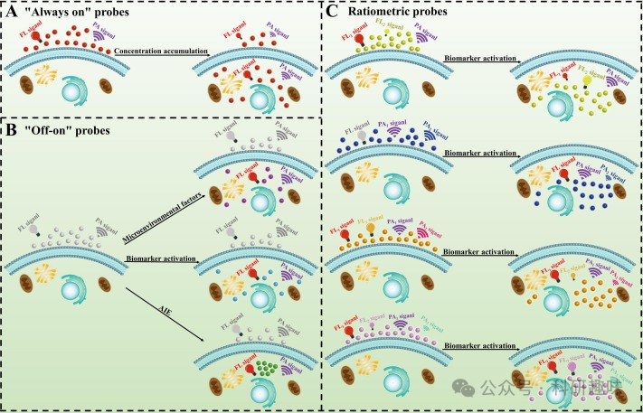

 

#  【Coord. Chem. Rev.】二区近红外荧光/光声双模态成像探针-前言及探针设计策略 
 

Grenemal

读完需要

11

全文字数 3600 字

**NIR-II FL/PA 双模态成像探针**

NIR-II fluorescence/photoacoustic dual-modality imaging probe

•

近红外-II（NIR-II）荧光成像（FLI）技术，以其独特的低自发荧光背景、出色的组织穿透能力和高分辨率特性，在生物医学成像领域受到了广泛的研究关注。与此同时，光声成像（PAI）作为一种新兴的非侵入性成像技术，其结合了光学成像的高对比度和声学成像的深穿透力，已成为当前研究的热点之一。

在此背景下，近红外-II探针作为能够实现荧光（FL）与光声（PA）双模式成像的先进工具，为成像技术的发展提供了新的方向。这种双模态成像探针不仅展现了在生物医学成像领域的巨大潜力，还为多模态成像技术的联合应用开辟了新的道路。

本综述旨在全面介绍近红外-II FL/PA双模态成像探针的研究进展。首先，我们将详细探讨探针的设计策略，包括如何优化探针的光学和声学性质，以实现高效的双模态成像。接着，我们将对探针的分类进行梳理，以便读者更好地理解不同探针的特点和应用范围。

此外，我们还将关注可激活探针的开发，这类探针能够在特定条件下被激活，从而实现更精确的成像效果。同时，我们也将探讨这些探针在生物医学领域的应用，包括肿瘤诊断、血管成像和神经科学研究等方面。

最后，我们将对近红外-II FL/PA双模态成像探针的发展情况进行总结，并展望其未来的发展前景和面临的挑战。我们希望通过这篇综述，能够激发读者对近红外-II FL/PA双模态成像探针研究的兴趣，并为其在生物医学领域的应用提供有益的参考。

**目录**

1引言

2. 近红外-II FL/PA 双模态成像探针的设计策略

2.1. “常亮”型探针

2.2. “点亮”型探针

2.3. 比率型探针

3. 近红外-IIFL/PA双模态成像探针的分类

3.1. 有机材料

3.1.1. 有机小分子荧光染料

3.1.2. 有机小分子纳米粒子

3.1.3. 聚合物纳米粒子

3.2. 有机-无机纳米复合材料

3.2.1. 金属硫化物复合纳米粒子

3.2.2. 金纳米复合粒子

3.2.3. 稀土金属参杂的纳米粒子

3.2.4. 碳复合材料

3.2.5. 其他复合材料

4. 可激活的近红外-II荧光/光声（FL/PA）双模态探针

4.1. NO 激活探针

4.2. 生物硫醇激活探针

4.3. ROS 激活探针

4.4. pH激活的探针

4.5. NTR 激活探针

4.6. 其他激活探针

5. 生物医药应用

5.1. 体内成像

5.1.1. 肿瘤治疗

5.1.2. 血管成像

5.1.3.其他部位的成像

5.2. 肿瘤治疗

5.2.1. 手术导航

5.2.2. 药物递送

6. 结论与展望

**引言**

随着近红外（NIR，700-1700 nm）成像技术的迅猛发展，荧光（FL）探针技术已成为科研与工业界瞩目的焦点。特别地，二区近红外（NIR-II，1000-1700 nm）荧光成像（FLI）技术，凭借其低毒性、卓越的时空分辨率、深度穿透能力、无创性、高信噪比（SNR）以及成本效益，已成为科学研究和医疗诊断的重要工具。根据发射波长的差异，NIR-II 可细分为NIR-IIa'（1000-1300 nm）、NIR-IIa（1300-1400 nm）和NIR-IIb（1500-1700 nm）三个子区域。

目前，用于合成NIR-II荧光探针的荧光团主要包括有机小分子染料、半导体聚合物、量子点（QD）以及碳纳米管等。与此同时，光声（PA）现象作为一种新兴的分子成像技术，近年来逐渐受到重视。此前，尽管正电子发射断层扫描（PET）、磁共振成像（MRI）和计算机断层扫描（CT）等成像技术层出不穷，但由于各自存在的局限性，如PET的放射性照射、MRI对金属物体的限制以及CT的低软组织对比度，使得结合了光学成像和超声成像优势的PAI逐渐崭露头角。当生物组织受到激光照射时，造影剂会发生光热转换，产生超声波，这些信号随后通过光声成像系统转化为图像。其中，多光谱光声断层成像（MSOT）以其多波长照射和三维（3D）图像采集能力，在生物成像领域展现出巨大的潜力。

多模态成像技术通过融合两种或多种成像模式，不仅吸收了各自的优势，还克服了单一模式的局限性，从而实现了生物成像的灵活性和准确性。为了克服FLI中光散射和PAI灵敏度低的问题，研究者们越来越多地转向FL/PA双模态成像模式。当前，近红外-II FL/PA双模态成像探针主要以近红外-II FL/NIR-I PA成像为主，仅有少数实现了近红外-II FL/NIR-II PA成像。

针对这一领域的研究现状，本文综述了近五年来NIR-II FL/PA双模态成像探针的研究进展。首先，我们深入探讨了”常量”、”点亮”以及比率测量探针分子的设计策略。随后，对探针分子的分类进行了详细介绍。进而，评估了用于生物标志物检测的可激活近红外-II FL/PA双模态成像探针。最后，我们讨论了近红外-II FL/PA双模态成像探针在生物医学领域的应用前景、面临的挑战以及未来发展方向。

**近红外-II FL/PA 双模态成像探针的设计策略**

基于探针分子在响应不同信号时展现的特性，近红外-II FL/PA双模态成像探针的设计策略可细分为四种主要类型：“开-关”型、”常量”型、“关-开”型以及比率测量型。

首先，“开-关”型探针，在初始状态下具有较强的荧光强度，但一旦与待测物发生反应，其荧光会显著减弱甚至完全消失。这种特性使得它们特别适用于检测那些能够引起荧光淬灭效应的生物标记物。然而，值得注意的是，温度和氧气等环境因素也可能导致荧光淬灭，从而可能引入误差，影响检测结果的准确性。此外，虽然“开-关”型探针分子在设计上相对简单，但荧光衰减导致的低信噪比和低灵敏度限制了它们在生物应用中的进一步应用。

鉴于“开-关”型探针的局限性，本文将重点介绍”常量”、“关-开”和比率测量型这三种设计策略。这些策略在保持高信噪比和灵敏度的同时，能够更准确地反映生物体内复杂环境的变化，为生物医学研究提供更可靠的实验工具。

“常亮”型探针

"常亮"探针在荧光成像技术中扮演着重要角色。通过监测探针分子在正常与病变区域积累的浓度差异，我们可以捕获到不同的信号强度，进而指示病变部位（如图1A所示）。为了维持持续的信号发射，这类探针需要精心选择荧光团，以确保其提供稳定且持久的荧光信号。余辉发光材料因其在外部激发停止后仍能持续发射光子的特性，常被用于设计"常亮"探针。

尽管"常亮"探针无法选择性地激活特定区域内的荧光信号，但通过引入具有光活化特性的荧光团，我们可以提高探针的时空分辨率，从而实现对特定区域变化的精确观测。此外，优化探针的亲水性-疏水性、生物相容性和尺寸效应，有助于其在体内的定向累积和渗透保留。

然而，"常亮"探针在生物体内通过血液循环分布于全身时，过于依赖信号强度的收集可能导致较低的信噪比（SBR），从而增加成像信号的误判风险。为了克服这一局限性，成像探针技术不断发展，结合了光学和超声成像优势的PAI（光声成像）技术应运而生。基于"始终开启"的近红外-II FL/PA双模态成像探针也被成功开发。

目前，大多数近红外-II FL/PA双模态成像探针均采用了”常量”型设计。与传统的”常量”式单模态探针相比，近红外-II双模态探针凭借其更高的分辨率和更深的组织穿透力，为生物医学成像领域带来了显著的进步。同时，FL/PA双模态成像方法能够有效提供不同空间分辨率和不同深度的生物组织信息，从而显著提高了成像的准确性和可靠性。

图1.(A)”常亮”近红外-IIFL/PA双模态成像探针的设计策略；(B)NIR-IIFL/PA双模态成像探针的"关闭-开启"设计策略；(C)比率测量NIR-IIFL/PA双模态成像探针的设计策略；

“点亮”型探针

鉴于“常亮”探针的局限性，科研人员开发了一种具有可激活特性的“非常亮”探针，即”点亮”探针。相较于”常量”探针，”点亮”探针不受探针分子浓度的影响，展现出更低的成像错误率、更高的灵敏度和特异性。然而，这些探针亦存在挑战，例如光稳定性欠佳、对环境波动的敏感性以及定量检测的困难。

“点亮”探针的设计策略涵盖了可激活型和聚集诱导发光（AIE）型。可激活探针通过引入特定的反应基团来检测与疾病相关的生物标记物（如阳离子、阴离子、活性氮物种（RNS）和活性氧物种（ROS））和微环境差异（如微酸和缺氧）。探针分子初始时处于信号关闭状态，一旦受到病变微环境的刺激或与目标物发生特异性反应，会触发显著的信号开启现象（如图1B所示）。基于NIR-II FL/PA双模态成像的”点亮”探针，能够通过无创成像实现对生物标记物和微环境因素的快速、可控和实时检测，为疾病发病机制的揭示提供了有力工具。

2001年，Tang研究团队首次提出了AIE机制的科学概念。经过20余年的研究，基于AIE机制的“开关”探针在化学、生物医学和材料科学领域发挥着关键作用。这类探针分子在稀溶液中发光微弱甚至不发光，但在分子聚集状态下，荧光会显著增强（如图1B所示）。AIE机制有效地解决了传统有机发光材料中的聚集淬灭（ACQ）问题，成为了当前探针研究领域的热点。

AIE机制的核心原理是分子内运动限制（RIM），包括分子内旋转限制和分子内振动限制，它们通过降低激发态弛豫来产生发光效应。常见的AIE类荧光团如四苯基乙烯（TPE）和三苯胺等，这些结构具有能够旋转的螺旋桨状构象。在光激发下，分子内的剧烈旋转会导致激发态的能量主要通过非辐射衰变途径消耗，这一过程具有高的光热转换效率（PCE），是光声成像（PAI）的关键因素。因此，AIE机制在近红外-II FL/PA双模态成像中得到了广泛应用。

此外，具有AIE特性的分子在聚集时能够显著提高产生ROS的效率，为光动力疗法提供了平台。由于有机小分子在水溶性和稳定性方面的不足，通常将具有AIE功能的探针分子制备成纳米粒子，以提高其在生物体内的生物相容性。基于AIE机制的NIR-II FL/PA双模态成像探针，能够克服传统光学成像在光穿透深度和荧光效率方面的限制，展现出临床转化的巨大潜力。

比率型探针

"点亮"探针通常采用单通道发射技术，以实现目标的定性检测。然而，随着技术的发展，双通道或多通道发射的比率荧光探针因其独特的优势而受到青睐。这类探针通过自我校准内部信号，能够有效消除仪器参数和环境因素对实验结果的影响，从而提供更为准确的半定量和定量检测。作为生物医学研究的重要工具，比率测量探针的未来发展将聚焦于提升检测精度、优化生物相容性、增强稳定性和抗光漂白性，以及实现多功能深度成像和临床转化等目标。

在设计比率测量探针时，通常有两种策略。第一种策略是引入一个对目标不敏感的参考信号作为内标，同时结合对目标有响应的传感信号，并对传感信号进行归一化处理，以实现比率测量。第二种策略更为灵活，它涉及在探针分子中引入两个相关的响应感应信号。当探针分子与目标物发生反应时，一个感应信号增强，而另一个感应信号减弱，从而实现信号可逆的比率测量检测。与依赖参考信号的比率测量法相比，这种方法具有更低的信噪比（SBR）。

目前，基于近红外-II FL/PA双模态成像的比率荧光探针已经取得了显著进展。这些探针主要可分为FL比率法、PA比率法和FL/PA双比率法（如图1C所示）。近红外-II双模态比率成像技术不仅提高了活体成像的准确性，还显著改善了空间分辨率、时间分辨率和深层组织穿透能力。此外，比率成像探针还能够实时监测细胞内生物标记物的波动，并进行定量分析，为疾病的诊断和治疗提供了强有力的支持。总之，近红外-II FL/PA双模态成像的比率测量探针对未来医学领域的发展具有重要意义。

## **参考文献**

**Ref**

Pan, W.; Rafiq, M.; Haider, W.; Guo, Y.; Wang, H.; Xu, M.; Yu, B.; Cong, H.; Shen, Y. Recent Advances in NIR-II Fluorescence/Photoacoustic Dual-Modality Imaging Probes. Coordination Chemistry Reviews 2024, 514, 215907. https://doi.org/10.1016/j.ccr.2024.215907.

**点击蓝字 关注我们**

预览时标签不可点

素材来源官方媒体/网络新闻

 [阅读原文](javascript:;) 

  继续滑动看下一个 

 轻触阅读原文 

    

