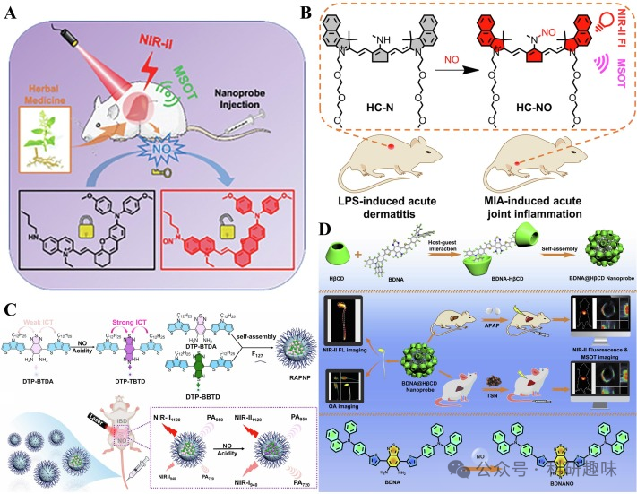
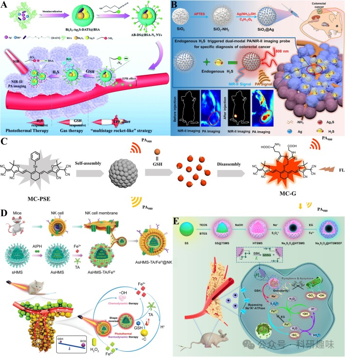
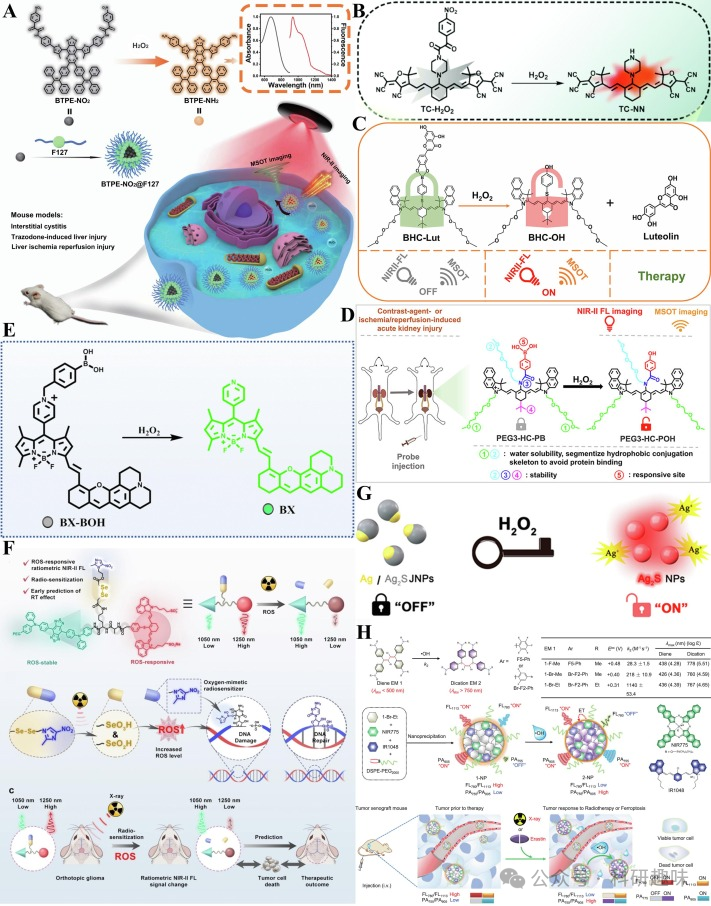
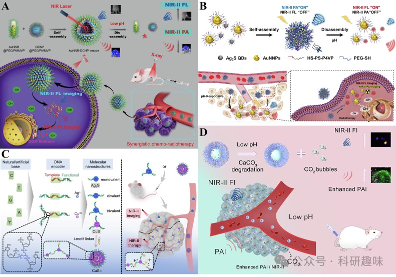
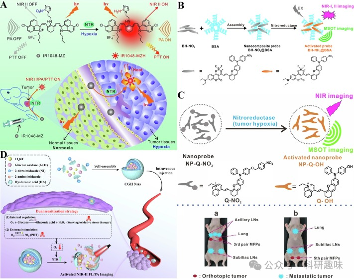
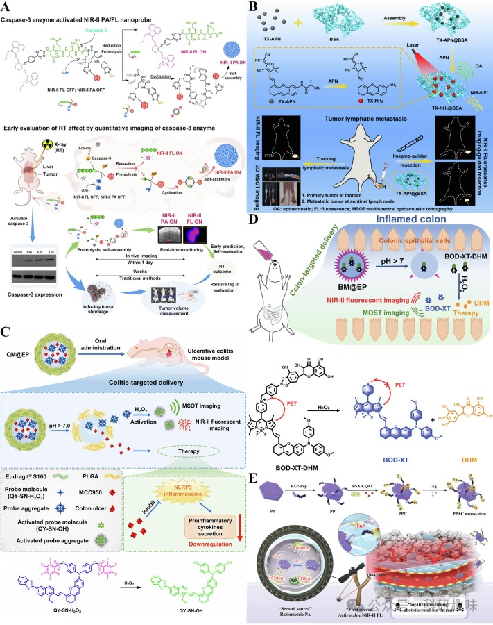

 

#  【Coord. Chem. Rev.】二区近红外荧光/光声双模态成像探针-多种可激活探针介绍 
 

Grenemal

读完需要

20

全文字数 6600 字

**NIR-II FL/PA 双模态成像探针**

NIR-II fluorescence/photoacoustic dual-modality imaging probe

**目录**

- NO 激活探针
- 生物硫醇激活探针
- ROS 激活探针
- pH激活的探针
- NTR 激活探针
- 其他激活探针

**可激活的近红外-II荧光/光声（FL/PA）双模态探针**

可激活的近红外-II荧光/光声（FL/PA）双模态探针，作为一种具备独特功能的新型材料，具备与目标分子反应后产生显著信号变化的特性。当前，多数报道的此类探针都采用了“关闭-开启”机制。这种机制使得这些探针在生物成像、药物筛选以及疾病诊断等领域展现出巨大的应用潜力，特别是在检测生物体内各种生物标志物的异常状态方面，其独特的性能更是备受瞩目。

NO 激活探针

一氧化氮（NO）在人体生理过程中占据核心地位，它调节血管张力、具有抗炎特性，并参与神经传递、免疫调节和细胞凋亡等关键生物过程，因此被视为一种至关重要的信号分子。在生物医学成像领域，NIR-II荧光/光声（FL/PA）双模态成像技术通过FL信号定位并显示生物样本中的NO水平，而PA信号则用于定量分析，两者结合能提供更准确、可靠的成像结果。然而，由于目前大多数NO探针采用不可逆的键合反应机制，实现内源性NO的原位和动态实时监测仍面临挑战。

药物性肝损伤（DILI）通常导致肝脏NO水平升高，使其成为DILI的直接生物标志物。Wu研究小组开发了一种基于聚集诱导发光（AIE）机制的NIR-II FL/PA双模态探针，用于检测中药诱导的DILI（https://doi.org/10.1002/adhm.202100867）。该探针分子QY-N上的电子负载丁胺结构能有效削弱喹啉的电子吸收能力，实现荧光淬灭（图11A）。丁胺作为芳香环上的仲胺，与NO发生N-亚硝基化反应，形成亚硝基，进而引发FL和PA信号的“关闭-开启”变化。这一纳米探针成功应用于无创原位监测和跟踪三苯氧胺诱导的肝损伤。

随后，Wu研究小组在2022年提出了一种针对近红外II FL/PA急性炎症成像的NO响应探针HC-N（https://doi.org/10.1039/d2cc05386a）。与QY-N类似，HC-N上的电子供体仲胺也能与NO发生N-亚硝基化反应，形成HC-NO（图11B）。在急性皮炎和关节炎小鼠模型中，HC-N通过近红外-II FL/PA双模态成像技术成功检测了原位生物标记物NO，为急性炎症的检测提供了一种有效方法。

为了克服荧光自淬和背景信号干扰，Xiao等人开发了首个用于检测NO的NIR-II FL/PA双模态比率探针RAPNP（https://doi.org/10.1016/j.biomaterials.2023.121993）。在弱酸性条件下，DTP-BTDA上的氨基能被NO快速氧化生成DTP-TBTD，这一转变产生了强烈的分子内电荷转移效应，从而激活了F127胶束中的FL和PA信号，并导致吸收和发射波长的显著位移。作为内参的DTP-BBTD对NO无响应，但在950纳米波长处提供光声信号，在1120纳米波长处提供荧光信号（图 11C）。RAPNP是首个基于二噻吩基吡咯结构的NIR-II FL/PA双模态成像探针，适用于炎症性肠病中内源性NO的比率测量检测。

此外，Chen等人利用探针分子BDNA上的邻二氨基作为反应位点，通过与NO氧化环化生成BDNANO（https://doi.org/10.1016/j.xcrp.2021.100570）。BDNA与2-hydroxypropyl-β-cyclodextrin形成两性复合物BNDA-HβCD，进而在水介质中自组装成纳米探针BNDA@HβCD（图 11D）。这一纳米探针通过近红外-II FL/PA双模态成像技术，成功实现了托森丹和对乙酰氨基酚诱导的DILI小鼠模型的病灶定位。同时，BNDA@HβCD也展现出检测内源性NO的强大能力，成功应用于大豆芽内NO的近红外-II FL/PA双模态成像。

图11.(A)QY-N的NO反应机制和肝损伤应用示意图；版权所有2021年，Wiley-VCH；(B)氮氧化物反应机制示意图和HC-N的急性炎症应用；(C)RAPNP制备、NO响应机制和FL/PA信号变化示意图.(D)BNDA@HβCD的制备、肝损伤应用和NO响应机制示意图.

生物硫醇激活探针

生物硫醇，即含有巯基（-SH）官能团的非芳香族化合物，在生物体内扮演着至关重要的角色，常见的包括硫化氢（H₂S）、谷胱甘肽（GSH）、同型半胱氨酸和半胱氨酸，它们与生物体的多种生理和病理过程紧密相关。近年来，为了精确检测和分析肿瘤微环境中的生物硫醇，研究人员致力于开发新型的可激发荧光探针，这些探针通过特定的化学结构与生物硫醇发生反应，从而实现生物硫醇的定量和定位分析。

生物硫醇激活荧光探针的反应机制多样，包括还原反应、迈克尔加成、芳香族亲核取代、醛环化和硫解等，这些机制利用硫醇基团与探针的特定化学结构相互作用，导致荧光或光声信号的变化。其中，可激活的近红外-II荧光/光声（NIR-II FL/PA）双模态探针以其高灵敏度和高选择性，成为生物硫醇检测领域的新星。

2020年，Zhang研究小组成功开发了一种基于NIR-II FL/PA双模态成像系统，该系统利用二烯丙基三硫醚（DATS）和叠氮基团（-N₃）的引入，实现了对GSH和H₂S的连续刺激响应（https://doi.org/10.1039/D0NR02543G）。该系统通过光声成像技术，将近红外-II荧光探针与光声造影剂相结合，实现了生物硫醇的双重检测（图 12A）。Zeng研究小组则提出了一种基于SiO₂@Ag的内源性H₂S触发的NIR-II FL/PA双模态智能纳米探针(https://doi.org/10.1021/acs.analchem.1c02200)。在该探针中，H₂S与Ag发生硫化反应，生成Ag₂S纳米点，从而产生强烈的PA信号和红移NIR-II发射荧光。这一成果为结直肠癌的早期检测提供了新的成像方法（图 12B）。

Gong课题组设计了一种基于氰基染料自组装和解组装的可激活探针MC-PSE，用于体内GSH的近红外-II FL/PA双模态成像（https://doi.org/10.1021/acs.analchem.3c02664）。该探针通过硒苯基与GSH发生亲核取代反应，实现了对GSH的特异性识别和荧光/光声信号的双重变化（图 12C）。MC-PSE是首个实现体内GSH荧光和比率光声双模态成像的NIR-II探针分子。

2021年，Liu研究组开发了一种NIR/GSH顺序激活的纳米探针AsHMS-TA/FeIII@NK(https://doi.org/10.1002/advs.202103498)。该纳米探针由自然杀伤（NK）细胞膜和类病毒二硫键掺杂的中空介孔二氧化硅AsHMS-TA/FeIII组成。该探针在肿瘤部位聚集后，通过激光照射触发NK细胞膜裂解，进而释放出的GSH与二硫键反应，产生自由基引发剂（AIPH），诱导肿瘤细胞凋亡，抑制肿瘤生长（图 12D）。近红外-II FL/PA双模态成像技术证实了该纳米探针在肿瘤部位的有效聚集能力。

最近，Liu研究组又报道了一种新型NIR-II FL/PA双模态成像探针，该探针通过将Na₂S₂O₈纳米晶体封装成空心四硫化物，并引入介孔二氧化硅，形成类似“蛋黄壳”结构的纳米系统Na₂S₂O₈@HTSMSEF(https://doi.org/10.1002/EXP.20230054)。在肿瘤细胞中，GSH裂解四硫化物释放AIPH，产生硫酸根自由基和-OH，有效诱导肿瘤细胞凋亡。与之前的纳米探针相比，Na₂S₂O₈@HTSMSEF在肿瘤部位的蓄积时间更长，通过长时间的NIR-II FL/PA双模态成像可以更准确地确定肿瘤的位置、大小和形态（图 12E）。
             
图12.(A)AB-DS@BSA-N3Nys的制备及GSH/H2S响应机制.(B)SiO2@Ag的制备和H2S响应机制示意图.(C)MC-PSE的结构和GSH响应机制示意图.(D)AsHMS-TA/FeIII@NK的制备及近红外/GSH顺序活化示意图.(E)Na2S2O8@HTSMSEF的制备和GSH响应机制示意图.

ROS 激活探针

活性氧（ROS）是一系列关键的化学活性氧分子，其家族成员包括超氧阴离子、单线态氧、过氧化氢（H₂O₂）和羟基自由基（-OH）等。ROS在细胞代谢中占据核心地位，作为细胞内氧化还原状态的关键指示剂，能够调控代谢酶和转录因子的表达，进而影响细胞的分化、增殖以及炎症反应过程。此外，ROS作为体内氧化应激的主要产物，长期被视为肿瘤发生、发展及复发的重要因素之一。

为精准检测病变微环境中的ROS，研究者们开发了多种可激活的ROS探针，其中，针对近红外-II荧光/光声（NIR-II FL/PA）双模态成像的ROS标记物，特别是H₂O₂和-OH，展现出显著的优势。这些探针克服了传统ROS激活探针波长短、组织穿透性差以及体内成像困难等挑战。然而，ROS的完整功能和作用机制尚未被全面揭示，探针分子在特异性ROS检测中的靶向性、选择性和抗干扰性仍需进一步优化。

2021年，Wu研究团队提出了一种新型H₂O₂可激活的纳米探针BTPE-NO₂，用于间质性膀胱炎和肝缺血再灌注损伤的NIR-II FL/MSOT双模态成像（https://doi.org/10.1038/s41467-021-27233-4）。该探针两端的硝基苯氧乙酰胺基团不仅有效淬灭荧光，还能特异性识别H₂O₂。炎症性疾病的病灶区域会大量产生H₂O₂，进而诱导硝基苯氧乙酰胺基团的裂解，产生强烈的荧光信号，显著提升病灶检测的准确性（图13A）。随后，Wu团队进一步拓展了H₂O₂激活探针的种类，包括TC-H₂O₂（https://doi.org/10.1039/D1CC02845F）、BHC-Lut（https://doi.org/10.1016/j.aca.2022.339831）、PEG3-HC-PB（https://doi.org/10.1021/acsami.3c00956）和BX-BOH（https://doi.org/10.1039/d2cc06031k）。这些探针分别利用硝基苯氧乙酰胺基团、硼酸键和苯硼酸基团作为反应位点，展现出不同的作用机制和成像效果（图13B-E）。在各种小鼠肝损伤模型中，这些探针成功应用于NIR-II FL/MSOT双模态成像，为炎症性疾病的诊断提供了新的工具。

Song研究小组报道了一种ROS响应型NIR-II FL/PA双模态成像探针BBT-IR/Se-MN（https://doi.org/10.1002/anie.202305744）。该探针上的吸电子硝基通过提升肿瘤细胞内的ROS水平，增强了放射治疗的效果。同时，ROS诱导分子中二硒化物的裂解，导致近红外-II比率荧光信号的变化。通过PAI技术验证了缺氧程度与肿瘤大小的正相关性。这一探针不仅可预测早期放疗对原位胶质瘤的疗效，还能实时定量监测ROS水平（图13F）。

此外，Song团队还介绍了一种等离子体H₂O₂激活探针Ag/Ag₂S JNPs（https://doi.org/10.1021/acs.nanolett.1c00197）。在激光照射下，Ag和Ag₂S之间的电子补偿效应维持荧光"关闭"状态。当病变部位的Ag被内源性H₂O₂氧化成Ag+时，电子补偿效应减弱，Ag₂S NPs的荧光被激活（图13G）。该探针在NIR-II FL/PA双模态成像中的卓越性能使其能够无创定位体内炎症和肿瘤。

Ye研究小组则报道了一种-OH可激活的NIR-II FL/PA双模态成像探针1-NP（https://doi.org/10.1038/s41467-021-26380-y）。该探针中的二烯电致变色材料1-Br-Et可被肿瘤中的-OH氧化并带正电荷，转化为2-NP。与-OH反应后，探针分子的吸收增强和光热效应导致近红外-II FL/PA双比率信号变化，实现了肿瘤内源性-OH的实时无创成像。1-NP具有高选择性和灵敏度，检测限低至3.69 nM，能够在铁死亡和放疗过程中准确监测-OH水平（图13H）。

图13.(A)BTPE-NO2的制备、H2O2响应机制和应用示意图；(B)TC-H2O2与H2O2响应机制示意图.(C)BHC-Lut与H2O2反应机制示意图.(D)PEG3-HC-PB与H2O2反应机制示意图.(E)BX-BOH@BSA与H2O2反应机制示意图.(F)BBT-IR/Se-MN的结构、ROS响应机制和应用示意图.(G)Ag/Ag2SJNPs与H2O2响应机制示意图.(H)1-NP的制备和近红外-IIFL/PA双模态成像-OH响应机制示意图.

pH激活的探针

pH值是维持生物体内环境稳态的关键参数。首先，酸碱平衡对于生物体进行正常的生命活动至关重要。例如，过酸或过碱的环境会干扰蛋白质合成和能量转换等基本生命过程，对生物体的存活构成威胁。其次，酸碱度对生物体的多个系统如免疫系统、神经系统和循环系统具有显著影响。在过酸条件下，它可能刺激呼吸系统和胃酸分泌，引发呼吸加速和胃溃疡等疾病；而过碱环境则可能导致皮肤症状如瘙痒、红肿，严重时甚至导致休克。

为了实时监测细胞和组织内酸碱度的变化，并研究细胞新陈代谢、信号传导、肿瘤和其他疾病机制，研究人员开发了可激活pH值的探针，这些探针特别适用于近红外-II荧光/光声（NIR-II FL/PA）双模态成像。近红外-II成像技术克服了近红外-I成像在穿透深度和分辨率方面的限制。目前，大多数pH活化近红外-II FL/PA双模态成像探针的表面都集成了酸响应物质，这些物质在肿瘤细胞的酸性微环境中会发生特定的化学变化。由于肿瘤细胞内外pH值波动较小，因此设计具有高灵敏度和窄阈值的pH响应探针显得尤为重要。

Chen等人成功设计并制备了一种pH响应型自组装纳米囊泡AuNNR-DCNP混合等离子体（https://doi.org/10.1007/s12274-020-3000-9）。这些囊泡在酸性条件下会裂解，释放纳米封装的金纳米棒（AuNNRs）和DCNPs，显著增强光学效应。由于高糖酵解活性的肿瘤细胞特异性吸收并酸化AuNNR-DCNP，因此能够产生强烈的NIR-II荧光和NIR-II光声信号，从而实现肿瘤的精准可视化（图14A）。

Lv等人提出了一种由金纳米粒子（AuNNPs）和Ag2S量子点（QDs）自组装而成的AuNNPs-Ag2S混合囊泡（https://doi.org/10.1002/adom.202200694）。在自组装过程中，金纳米粒子产生的强大局部表面等离子体共振效应增强了近红外-II光声信号，而Ag2S QDs的近红外-II荧光信号则被淬灭。这种混合囊泡的表面覆盖了对pH敏感的聚合物，在肿瘤酸性环境下分解，导致AuNNPs的等离子体耦合反应减弱，近红外-II光声信号降低，而Ag2S QDs的近红外-II荧光信号增强。这种设计实现了肿瘤的近红外-II荧光和近红外-II光声双模式成像，并促进了精确的放射治疗（图14B）。

Wang等人基于DNA编码策略，组装了一种pH可激活的NIR-II FL/PA双模式成像探针CuS-i（https://doi.org/10.1002/anie.202316562）。通过在CuS-i中引入具有pH响应特性的i-motif连接器，实现了探针在酸性和中性条件下的可逆组装。CuS-i能够穿透肿瘤血管，进入肿瘤实质，为深部组织提供清晰的近红外-II荧光/光声双模态成像（图14C）。此外，DNA编码合成的Ag2S QDs具有肾脏清除能力，降低了生物毒性。与传统的NIR-II FL/PA双模态成像探针相比，基于DNA编码策略组装的探针展现出更高的智能化、清晰度、精确度和成像效率。

Xu等人开发了一种镧系元素掺杂的上/下转换平台LDACs，该平台对肿瘤微环境的pH值变化敏感，并适用于NIR-II FL/PA双模态成像（https://doi.org/10.1016/j.jcis.2023.12.088）。LDACs表面覆盖有碳酸钙（CaCO3）涂层，在肿瘤酸性环境下分解并产生二氧化碳（CO2）气泡。随着CaCO3的降解，NIR-IIb荧光信号逐渐增强。同时，由于二氧化碳气泡引发的惯性空化效应，纳米探针内装载的Au NPs的光声信号也相应增强（图14D）。LDACs的发射波长位于近红外-IIb区域，实现了信号自增强的双模态肿瘤成像。

图14：（A）AuNNR-DCNP纳米粒子的制备和pH响应机制示意图；(B)AuNNPs-Ag2S混合囊泡的制备、pH响应机制和应用示意图.(C)CuS-i的DNA编码策略和pH响应机制示意图.(D)LDACs的pH响应机制示意图

NTR 激活探针

硝基还原酶（NTR）作为细胞能量代谢的关键酶，其催化硝基化合物向胺的转化在生物学过程中占据重要地位。NTR的活性受到缺氧环境的显著影响，这种特性赋予它在生物体内的多重生理功能，包括氮代谢的调节和抗氧化应激的能力。近年来，NTR在生物医学领域的应用日益凸显，特别是在药物合成、生物传感以及疾病诊断等领域。

在实体瘤中，由于血管供应不足和细胞增殖迅速，常常出现缺氧现象，这导致NTR水平升高。因此，NTR成为实体瘤的潜在生物标志物，为开发近红外-II荧光/光声（NIR-II FL/PA）双模式成像的激活型探针提供了契机。这类探针在动物模型中已展现出优异的成像效果，预示着在肿瘤的诊断和治疗中的巨大潜力。

然而，目前这些探针的设计仍面临挑战，特别是在实现特定病变器官的靶向性、穿越血脑屏障以检测脑部NTR异常，以及平衡FL和PA信号强度以提高成像的适用性、准确性和转化能力方面。

Cai课题组于2018年成功合成了有机小分子探针IR 1048-MZ，该探针通过连接近红外II染料和NTR响应配体实现（https://doi.org/10.7150/thno.26607）。硝基咪唑分子的退电子感应效应在探针中发挥了关键作用，它能够减弱近红外-II FL/PA信号。在肿瘤缺氧环境中，NTR将硝基还原为氨基，生成IR 1048-MZH，从而显著增强NIR-II FL/PA信号（图 15A）。这种探针凭借其深组织穿透性、高空间分辨率和低自背景荧光，为缺氧相关疾病的双模态成像提供了有力工具。

Wu研究组则设计了一种可激活NTR的纳米复合探针BH-NO2@BSA，结合具有聚集诱导发光（AIE）特性的近红外-II荧光成像技术和MSOT光声成像系统，实现了早期肝癌的原位检测（https://doi.org/10.1021/acs.analchem.0c01596）。在肝脏肿瘤缺氧环境中，探针中的硝基被NTR还原为氨基，产生强烈的NIR-II FL/PA信号（图 15B）。该探针具有良好的生物相容性，适用于体外和体内的高对比度双模态成像，并展示了在肝脏肿瘤术前定位和术中导航方面的应用潜力。

随后，Wu的研究小组进一步提出了NTR响应型荧光探针NP-Q-NO2（https://doi.org/10.1002/anie.201913149）。该探针在硝基被NTR还原为氨基后，醚键发生自诱导消除反应，生成羟基。NP-Q-NO2以其高选择性和稳定性，为乳腺癌向远处器官转移的近红外-II FL/PA双模态成像提供了有效工具（图 15C）。

Zheng等人则构建了一种周期性增强的NTR响应纳米探针CGH NAs，通过双重敏化策略精确激活NIR-II FL/PA双模态成像引导的肿瘤协同治疗（https://doi.org/10.1016/j.mtbio.2022.100478）。探针表面的2-硝基咪唑在肿瘤细胞内NTR的作用下还原为水溶性2-氨基咪唑，同时HA的分解释放出CQ4T和GOX，产生大量ROS以杀死肿瘤细胞（图 15D）。这种双重增敏策略不仅提高了治疗效果的准确性和可靠性，还为NTR在不同肿瘤缺氧阶段的高灵敏度反应提供了新的解决策略。

图15.(A)IR1048-MZ与NTR反应机制和肿瘤内反应示意图.(B)BH-NO2@BSA的制备及NTR反应机制示意图.(C)NP-Q-NO2和NTR反应机制示意图.(D)CGHNas的制备和NTR响应机制示意图.

其他激活probes

除了前面提及的可激活近红外-II FL/PA双模态成像探针外，还有少数探针能够针对其他与疾病紧密相关的生物酶（如Ⅴ类）进行检测。近年来，双响应探针在环境监测、生物分析和医学成像领域展现出了巨大的应用潜力，其设计与应用已成为一个充满活力且充满挑战的研究领域。在此，我们将介绍几种用于近红外-II FL/PA双模态成像的其他可激活探针。

Fu等人研发了一种能够响应凋亡酶caspase-3的近红外-II FL和近红外-II PA双模态成像探针AuNNP@DEVD-IR1048（https://doi.org/10.1002/ange.202112237）。该探针在初始状态下不显示FL和PA信号，但在X射线照射下，诱导产生的大量ROS会激活caspase-3。随后，活化的caspase-3特异性地切断肽链，释放NIR-II荧光染料IR-1048和AuNNPs聚集体，从而触发NIR-II FL和NIR-II PA信号的显著增强。其中，AuNNPs聚集体的形成可增强局部表面等离子体共振效应，进一步影响探针的吸光度和PA信号强度。这种可激活的有机-无机杂化纳米复合材料不仅可用于早期疗效评估，还为新型治疗系统的开发提供了有力工具。

氨基肽酶N（APN）在肿瘤细胞的增殖、侵袭和转移过程中起着关键作用。Chen等人开发了一种可激活APN的纳米探针TX-APN@BSA，用于NIR-II FL/PA双模态成像（https://doi.org/10.1021/acs.analchem.2c01241）。该探针中的丙氨酸在肿瘤中过表达的APN作用下转化为氨基，从而激活探针的近红外-II FL/PA信号。这种双模态成像技术能够准确描绘肿瘤的原位位置和追踪淋巴转移路径。

Wu研究小组设计了一种pH/H2O2双响应NIR-II FL/PA双模态成像纳米系统QM@EP（https://doi.org/10.1016/j.biomaterials.2022.121468）。该系统在结肠的特定pH值下发生裂解，释放内部探针分子QY-SN-H2O2。随后，QY-SN-H2O2上的五氟苯磺酸盐被结肠内壁产生的H2O2分解，生成羟基，进而活化QY-SN-OH并增强其AIE效应，从而显著增强近红外-II FL/PA信号。这一系统为溃疡性结肠炎等疾病的检测提供了新的可能。

此外，Wu研究小组还提出了另一种基于BODIPY的pH/H2O2双响应近红外-II FL/PA双模态成像纳米系统BM@EP（https://doi.org/10.1002/adhm.202201544）。该系统中的BOD-XT-DHM上的硼酸酯键在H2O2作用下分解形成BOD-XT，阻断光致发光电子传递过程，从而显著增强近红外-II FL/PA信号。

Zheng等人报道了一种针对成纤维细胞活化蛋白（FAP）和H2O2的双响应NIR-II FL/PA双模态成像纳米系统PPAC（https://doi.org/10.1002/smll.202201179）。该系统利用钯纳米片上的FAP响应肽被肿瘤基质成纤维细胞中过表达的FAP特异性裂解，释放BSA-CQ4T，开启NIR-II FL信号。同时，纳米平台负载的Ag也被H2O2氧化成Ag+，导致比率PA信号的变化。PPAC主要通过肝脏和肠道清除，是一种极具前景的双激活近红外-II荧光/PA双模式成像系统。

图16.(A)AuNNP@DEVD-IR1048与caspase-3的反应机制和应用示意图.(B)TX-APN@BSA的制备、APN响应机制和应用示意图.(C)pH/H2O2双响应机制示意图及QM@EP的应用.(D)pH/H2O2双重响应机制示意图及BM@EP的应用.(E)PPAC的制备和FAP/H2O2双响应机制示意图.

## **参考文献**

**Ref**

Pan, W.; Rafiq, M.; Haider, W.; Guo, Y.; Wang, H.; Xu, M.; Yu, B.; Cong, H.; Shen, Y. Recent Advances in NIR-II Fluorescence/Photoacoustic Dual-Modality Imaging Probes. Coordination Chemistry Reviews 2024, 514, 215907. https://doi.org/10.1016/j.ccr.2024.215907.

**点击蓝字 关注我们**

预览时标签不可点

素材来源官方媒体/网络新闻

 [阅读原文](javascript:;) 

  继续滑动看下一个 

 轻触阅读原文 

    

