 

#  【Coord. Chem. Rev.】二区近红外荧光/光声双模态成像探针-探针的分类 
 

Grenemal

读完需要

35

全文字数 11500 字

**NIR-II FL/PA 双模态成像探针**

NIR-II fluorescence/photoacoustic dual-modality imaging probe

**目录**

- “常亮”型探针
- “点亮”型探针
- 比率型探针

**近红外-IIFL/PA双模态成像探针的分类**

随着探针技术的不断进步，用于近红外-II FL/PA 双模态成像探针的材料类型也呈现出持续增长的趋势。从有机小分子染料到有机纳米材料，再到有机-无机纳米杂化材料，近红外-II FL/PA 双模态成像探针层出不穷。本节综述了用于构建近红外-II 双模态成像的有机小分子染料、有机小分子纳米粒子和有机-无机纳米杂化材料，并介绍了各种材料的优缺点，希望能为开发新材料提供参考思路。

3.1. 有机材料

**3.1.1. 有机小分子荧光染料**

有机小分子染料作为一类分子量较小的荧光化合物，在化学、生物和医学领域扮演着至关重要的角色。这类染料凭借其易于标记、优异的光学性能和良好的可控性，在多个领域中展现出广泛的应用前景。然而，随着成像波长扩展到近红外-II区域，对有机小分子染料的连续共轭程度提出了严峻的挑战。

共轭体系的增加虽能带来某些性能上的提升，但往往会导致有机小分子染料在水中的溶解度降低，稳定性下降，以及生物相容性变差。多数有机小分子染料在有机溶剂中表现出较高的溶解度，而在水中溶解度较低，这一特性限制了它们在生物系统中的应用。

在常见的有机小分子染料中，苯并噻二唑（BTD）、氰基和硼-二吡咯并二胺（BODIPY）衍生物等因其独特的化学结构而备受关注。这些染料多具备供体-受体-供体（D-A-D）的推拉电子结构，通过合理的共轭体系设计，能够显著提升探针分子的生物相容性、光稳定性、发射波长和斯托克斯位移。

特别地，用于近红外-II荧光/光声（FL/PA）双模态成像的有机小分子探针，其结构往往以苯并噻唑和氰基等为基础（如示例1所示）。这些多样化的化学结构不仅提升了探针的性能，还为生物医学应用提供了高质量的近红外-II荧光/光声双模态成像，极大地推动了生物医学成像技术的发展。
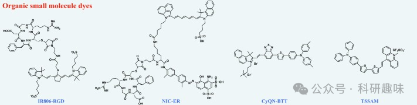
示例1.用于近红外-IIFL/PA双模态成像的有机小分子染料的化学结构；

在2021年，Wang等人成功研制了一种名为NIC-ER的NIL-II FL/PA双模态成像青色染料，该染料具有内源性白蛋白的携带能力（https://doi.org/10.1186/s12951-021-01075-0）。NIC这一不对称氰基染料是通过将苯并[c,d]吲哚引入吲哚菁绿羧酸（ICG-COOH）的一侧苯并吲哚来合成的。随后，通过对其羧基进行修饰，并引入环状新生血管靶向肽和白蛋白结合基团，赋予了NIC-ER主动靶向和携带白蛋白的能力（如图2A所示）。

NIC-ER在1030纳米波长下展现出了明亮的近红外-II发射，并且其荧光强度随着人血清白蛋白（HSA）溶液浓度的增加而逐渐增强（如图2B所示）。这种高荧光强度和光稳定性为近红外-II FL/PA双模态成像提供了坚实的基础（如图2C和2D所示）。此外，NIC-ER探针分子能够在肿瘤部位聚集，从而实现对肿瘤轮廓的清晰观察。双模态成像的相互印证进一步证明了NIC-ER在肿瘤成像中的巨大应用价值。

Peng研究组则以苯并芘为受体，合成了三种用于近红外-II双模态成像的单分子光敏剂（如图2E所示）（https://doi.org/10.1039/d2sc02879d）。其中，CyQN-BTT由于分子中引入了BTD的π桥结构，在NIR-II区域表现出强烈的尾发射（如图2F所示）和优异的光热稳定性（如图2G所示）。与CyE-TT和CyQN-TT相比，CyQN-BTT的结构更为扭曲，这种扭曲的分子内电荷转移机制使得探针分子更容易受到非辐射跃迁的影响，从而导致了较低的荧光量子产率（QY）和荧光强度。然而，当水溶液比例增加时，分子聚集限制了分子旋转，导致荧光强度显著增强，并呈现出聚集诱导发光（AIE）的特性（如图2H所示）。

此外，CyE-TT和CyQN-TT结构中的正电荷赋予了它们良好的线粒体靶向能力。而CyQN-TT中的双电荷结构更是能够特异性地靶向癌细胞。这些特性使得NIR-II FL/PA双模态成像技术能够实现对小鼠肿瘤的精确成像。
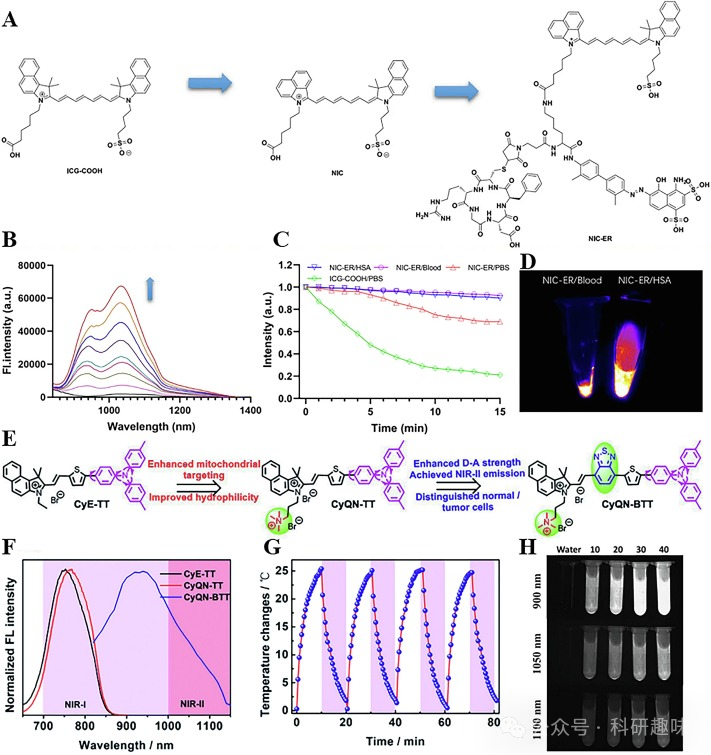
图2.(A)NIC-ER的设计策略；(B)NIC-ER在不同浓度HSA中的荧光发射光谱；(C)NIC-ER和ICG-COOH的光稳定吸收光谱；(D)NIC-ER在血液和HSA中的近红外-II荧光成像；(E)CyE-TT、CyQN-TT和CyQN-BTT的设计策略；(F）CyE-TT、CyQN-TT和CyQN-BTT的归一化荧光光谱；(G）CyQN-BTT的光热稳定性曲线；(H)CyQN-BTT在不同体积水溶液中的近红外-II荧光成像；

**3.1.2. 有机小分子纳米粒子**

鉴于有机小分子在体内靶向性、溶解性和稳定性不佳，且血液循环时间较短，难以穿越血管壁抵达病变部位，纳米粒子（NPs）已成为近年来备受关注的研究领域。为了解决这些难题，研究者通过巧妙设计，利用DSPE-PEG和Pluronic F127等有机聚合物对有机小分子化合物进行表面包覆，成功制备出水溶性有机小分子纳米粒子（OSMNPs）（示例 2）。

OSMNPs的尺寸范围通常介于1-100纳米之间，这一特性赋予了它们更高的比表面积和优异的生物相容性，使其能够更轻松地在生物体内分散和吸附，并通过循环系统迅速渗透到各个组织和器官中。OSMNPs的合成方法丰富多样，它们充分利用了有机小分子卓越的光电特性，在近红外-II荧光/光声（FL/PA）双模态成像中扮演了至关重要的角色。

然而，纳米粒子在生物体内长期积累可能会引发一定的毒性反应，因此，开发具有低毒性且可生物降解的OSMNPs成为了未来研究的重点方向。这将有助于进一步推动OSMNPs在生物医学领域的应用，为实现更高效、安全的诊断和治疗手段提供有力支持。
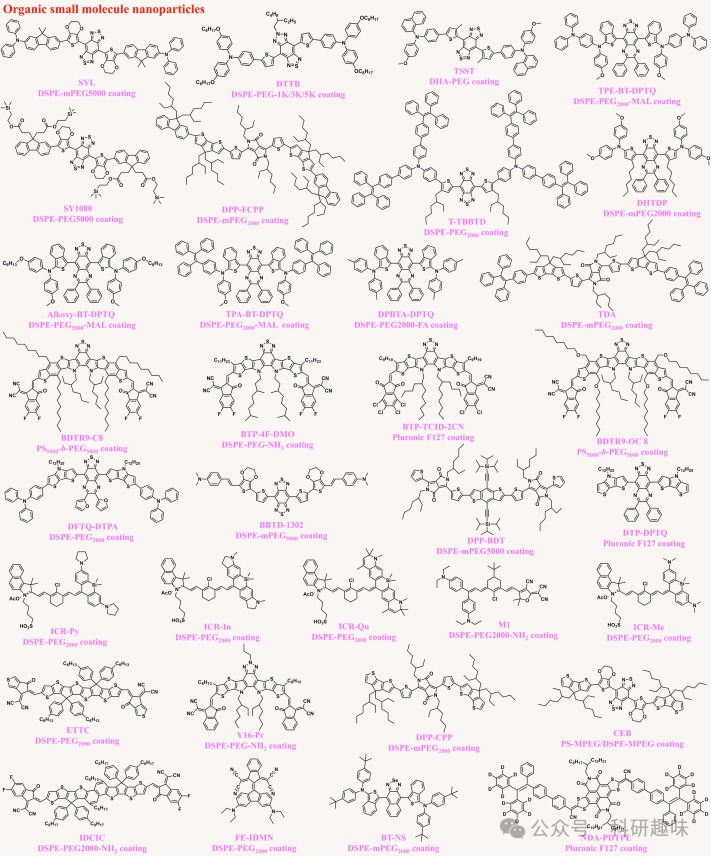
示例2.用于近红外-IIFL/PA双模态成像的有机小分子纳米粒子的化学结构.

在2020年，Sun等人报道了一种基于聚集诱导发光（AIE）机制的新型近红外二区（NIR-II）荧光/光声（FL/PA）双模态成像探针ZSY-TPE（https://doi.org/10.1016/j.biomaterials.2020.120315）。ZSY-TPE的设计以具有强电子受体苯并二噻二唑（BBTD）为核心，两侧配备TPE和咔唑基团作为供体单元，共同构建了D-A-D结构的ZSY-TPE（如图3A所示）。TPE赋予了探针分子优异的光稳定性（图3B），较长的发射波长以及高达290 nm的斯托克斯位移，从而显著减少了生物损伤和背景干扰（图3C）。由于ZSY-TPE具有连续的大共轭体系，其水溶性相对较差。当水溶液比例增加至90%时，探针分子发生强烈聚集，荧光强度达到峰值（图3D）。为了克服水溶性不佳的局限，研究者采用DSPE-PEG5000表面活性剂对ZSY-TPE进行封装，形成了ZSY-TPE纳米点。此外，ZSY-TPE纳米点还展现出抗肿瘤和抗金黄色葡萄球菌的潜力。相较于单模态成像，NIR-II FL/PA双模态成像为伤口细菌感染和抗肿瘤治疗提供了更为精准的指导。

随后，在2021年，Tang研究小组提出了三种苯并噻二唑-喹喔啉衍生物（https://doi.org/10.1002/anie.202111767）。与BBTD型探针分子相比，这些衍生物具有更为紧凑的结构，增强了分子的稳定性，并抑制了分子的迁移，从而有利于AIE机制的实现（图3E）。其中，TPA-DPTQ在水溶液中展现出卓越的AIE效果，但其发射波长仅限于910 nm，限制了其在近红外二区成像中的应用。DPTA-DPTQ则因分子间相互作用力的影响，其AIE效应受到抑制，呈现出聚集诱导猝灭（ACQ）效应。仅有DPBTA-DPTQ表现出近红外二区发射（1120纳米）和微弱的AIE效应（图3F）。通过使用两亲性DSPE-PEG2000-FA对DPBTA-DPTQ进行纳米化（图3G），得到的纳米粒子展现出优异的光电转换效率（PCE），有助于FL/PA双模态成像（图3H）。

最近，Lan等人报道了一种基于半氰基结构的NIR-II荧光探针M1，并通过DSPE-PEG2000-NH2制备了水溶性M1纳米粒子（图3I）（https://doi.org/10.1021/cbmi.2c00004）。该分子结构融合了强电子供体二乙氨基和强电子受体氰基，形成了具有稳定光热特性的供体-π-受体结构（图3J）。同时，两个可自由旋转的N,N-二乙基氨基苯基增加了非辐射能量消耗，使得PCE高达77.5%（图3K）。M1纳米粒子不仅具有长发射波长（图3L），还具备抗肿瘤作用。
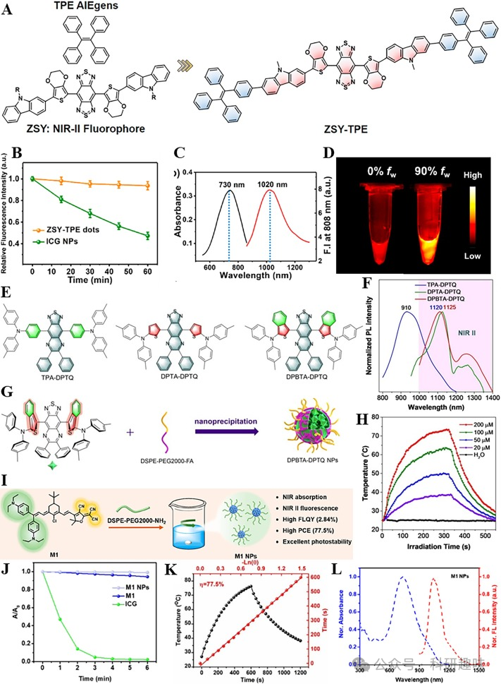
图3.(A)ZSY-TPE的结构；(B)ZSY-TPE和ICGNPs的光稳定性吸收光谱；(C)ZSY-TPE的吸收和发射光谱；(D)ZSY-TPE在不同体积水溶液中的NIR-IIFLI；(E)TPA-DPTQ、DPTA-DPTQ和DPBTA-DPTQ的结构；(F)TPA-DPTQ、DPTA-DPTQ和DPBTA-DPTQ的归一化荧光光谱；(G）DPBTA-DPTQNPs的制备；(H）DPBTA-DPTQNPs的光热转换行为；(I)M1NPs的制备；(J)M1NPs、M1和ICG的光稳定吸收光谱；(K)M1NPs的光热转换行为；(L)M1NPs的归一化吸收和发射光谱；

**3.1.3. 聚合物纳米粒子**

共轭聚合物（CP）作为一种前沿的功能性发光材料，其独特的π共轭体系由连续交替的单键和双键构成。这种结构中离域π键的形成显著扩大了π电子的活动范围，降低了体系能量，减小了能级间距，从而改变了材料的吸光特性和导电能力。与有机小分子相比，CP展现出更高的荧光亮度和光稳定性，因此在荧光染料和光电器件领域得到了广泛应用。

然而，CP的聚合选择性不佳，且容易形成结构缺陷，这些缺陷对材料的光电性能造成负面影响。此外，聚合物的扭曲形态还会降低分子内电荷转移的效率。因此，开发具有卓越光电转换效率和高稳定性的CP材料对于生物成像领域而言至关重要。

为了提升生物成像中的生物相容性，研究人员成功将CP转化为水分散的球形共轭聚合物纳米粒子（CPNs）。这些CPNs的化学结构以及包覆的两亲嵌段共聚物类型已在示例3中详细阐述。

值得一提的是，半导体聚合物纳米粒子（SPNs）作为CPNs的一个重要分支，因其高导电性在健康监测和医疗设备等领域展现出巨大的应用潜力。然而，合成具有可拉伸性能和高迁移率的SPNs仍面临诸多挑战。未来的研究将致力于克服这些挑战，以推动SPNs在更多领域的应用。
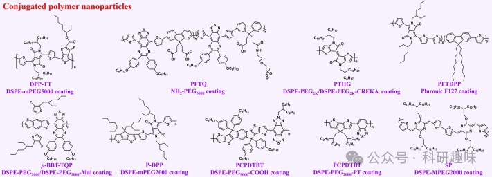
示例3.用于近红外-IIFL/PA双模态成像的聚合物纳米粒子的化学结构.

共轭聚合物纳米粒子以其卓越的近红外吸收和出色的光稳定性，在光声成像（PAI）领域展现出非凡的潜力。鉴于当前共轭聚合物纳米粒子（CPN）多用于单模态成像的现状，开发适用于近红外-II荧光/光声（FL/PA）双模态成像的CPN具有巨大的研究前景。

Cong团队成功设计了一种基于吡嗪和噻吩结构的共轭聚合物SP（如图4A所示），并通过与两亲性聚合物DSPE-PEG2000的共沉淀法，制备出SPN（如图4B所示）（https://doi.org/10.1002/cbic.201900309）。这种SPN展现出优异的NIR-II发射性能（如图4C所示）和出色的光稳定性，其在猪肉组织中的穿透深度可达4毫米。随后，他们进一步开发了基于环戊二烯噻吩结构的共轭聚合物P-TT和P-DPP（如图4D所示）（https://doi.org/10.1039/C9TB01196J）。利用DSPE-PEG2000，他们成功制备了相应的纳米粒子（如图4E所示）。与SPN相比，P-TT和P-DPP形成的CPN在荧光发射波长上表现出显著的红移（如图4F所示）。特别地，P-DPP具有更高的荧光量子产率（1.5%）和更强的组织穿透性（8毫米），为近红外-II FL/PA成像提供了极具前景的造影剂。

在2022年，Xie等人通过改性PEG SPNs和酚类SPNs的自组装方法，合成了一种名为PFG-MPNs的NIR-II FL/PA双模态成像纳米粒子（如图4G所示）（https://doi.org/10.1021/jacs.1c09753）。PFG-MPNs展现出1063 nm的近红外-II发射波长（如图4H所示），并在溶液中显示出良好的稳定性（如图4I所示）。随着PFG-MPNs溶液浓度的增加，FL和PA信号均逐渐增强，证实了其卓越的近红外-II FL/PA双模态成像能力（如图4J所示）。尤为重要的是，该纳米粒子中封装了外泌体抑制剂和铁死亡诱导剂，为加速肿瘤细胞的铁死亡并抑制恶性肿瘤的生长和转移提供了新策略。
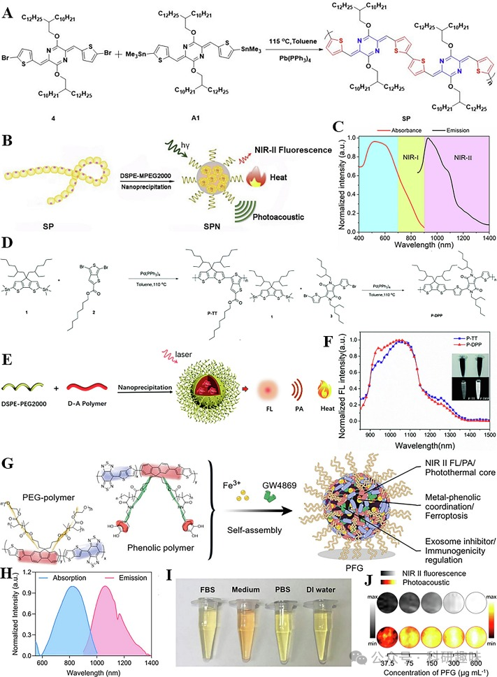
图4：（A）SP的合成；(B)SPN的制备；(C)SPN的归一化吸收光谱和发射光谱；(D)P-TT和P-DPP的合成；(E)P-TTCPNs和P-DPPCPNs的制备；(F)P-TTCPNs和P-DPPCPNs的归一化发射光谱；；(G)PFG-MPNs的制备；(H）PFG-MPNs的归一化发射光谱；(I)PFG-MPNs在不同溶液中放置7天的稳定性照片；(J）不同浓度PFG-MPNs的FLI和PAI；

3.2. 有机-无机纳米复合材料

**3.2.1. 金属硫化物复合纳米粒子**

金属硫化物纳米粒子（MSNPs）作为一类由金属元素和硫元素构成的纳米级材料，展现出独特的结构和性质。这些纳米粒子的尺寸通常在1至100纳米之间，其高量子尺寸效应和较大的比表面积赋予它们卓越的反应活性和表面活性。MSNPs的多样性晶相结构允许通过调整能带和电子结构来优化其光学和电子传输特性。此外，MSNPs还因其优异的抗菌性、热稳定性和光稳定性而广泛应用于食品包装、能量储存、环境监测、光电设备和催化领域。

然而，金属硫化物面临离子扩散速率低和导电性不佳的挑战，这要求通过孔隙掺杂等手段来提升其离子导电性能。同时，MSNPs的生物降解性有限，易在生态环境中受pH值和光照等因素影响，转化为潜在的有毒物质，通过食物链累积在生物体内，对生物健康构成威胁。因此，绿色MSNP的研发成为当前的研究热点。

在生物医学领域，MSNP的NIR-II荧光/光声（FL/PA）双模态成像技术发挥着重要作用，其中Ag₂S基纳米材料尤为突出。随着纳米技术的飞速发展，从单一的Ag₂S纳米材料逐步演进至有机-无机杂化的多组分纳米系统，显著丰富了纳米材料的功能性。例如，Chen课题组于2017年报道了一种Ag₂S纳米点，其通过精确调控HSA纳米笼中Ag₂S的生长，实现了尺寸依赖性的Ag₂S-NDs合成（图5A）（https://doi.org/10.1021/acsnano.6b07866）。这些纳米点展现出与颗粒大小相关的近红外-II荧光发射（图5B），并具备高达35%的光电转换效率（PCE），产生了强烈的FL和PA信号（图5C）。随着纳米点浓度的增加，FL和PA信号均呈现线性增强（图5D和5E）。尤为值得一提的是，Ag₂S-NDs还展现出强大的抗光漂白能力，为肿瘤部位的长效积累和体内快速清除提供了可能，为MSNPs在NIR-II FL/PA双模态成像中的应用奠定了基础。

此外，Zhao等人构建了一种基于Ag₂S和多肽的杂化纳米凝胶系统（https://doi.org/10.1039/C7CC09266K）。通过将Ag₂S量子点（QD）嵌入多肽自组装水凝胶PC10ARGD中，成功合成了Ag₂S QD@PC10ARGD纳米复合材料（图5F）。该纳米系统通过Ag₂S QD改变多肽与水之间的折射率，实现了10nm的发射波长红移（图5G）。同时，随着Ag₂S QD浓度的增加，纳米凝胶系统的荧光强度也呈现上升趋势（图5H），计算得到的PCE为28.7%，为肿瘤的NIR-II FL/PA双模态成像提供了有力支持。

金属有机框架（MOFs）作为一种快速发展的三维多孔配位聚合物，为MSNPs的应用提供了新途径。2022年，Li等人利用MOFs将Ag₂S QD和透明质酸酶（HAase）封装在合成的AHZ NPs中（https://doi.org/10.1021/acsami.2c08930）。在肿瘤细胞的酸性环境中，AHZ NPs能够释放HAase和Ag₂S QD（图5J）。HAase能够降解透明质酸（HA），破坏肿瘤细胞基质，从而抑制肿瘤细胞的扩散和转移。同时，Ag₂S QD能够轻松穿越肿瘤基质，深入肿瘤组织，提供显著的NIR-II FL/PA成像。此外，随着AHZ NPs浓度的增加，荧光强度逐渐增强，表现出浓度依赖性（图5K），为肿瘤的精确治疗提供了重要的指导。

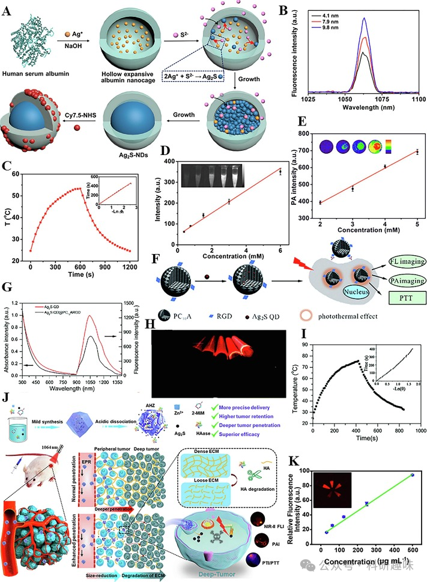
图5.(A)Ag2S-NDs的制备；(B)不同粒径Ag2S-ND的荧光发射光谱；(C)9.8nmAg2S-NDs的光热转换行为；(D）不同浓度的Ag2S-NDs与荧光强度的线性图；(E)不同浓度的Ag2S-NDs与PA强度的线性图；(F）Ag2SQD@PC10ARGD的制备；(G）Ag2SQD和Ag2SQD@PC10ARGD的吸收和发射光谱；(H）不同浓度Ag2SQD@PC10ARGD的近红外-IIFLI；(I）Ag2SQD@PC10ARGD的光热转换行为；(J）AHZNPs的制备及肿瘤穿透图；(K)不同浓度的AHZNPs与FL强度的线性图.

**3.2.2. 金纳米复合粒子**

金（Au）作为一种化学稳定性卓越的元素，其纳米形态展现出了独特的光电性质和优异的生物相容性。因此，金纳米材料（Au NMs）的研发在纳米科技领域一直备受瞩目，其结构发展从零维扩展至三维，完成了从点到体的跨越。不同尺寸和形态结构的金纳米材料展现出了多样化的物理化学特性，并在多个领域拥有广泛的应用前景。

在近红外-II FL/PA双模态成像领域，金纳米材料主要可分为两类：金纳米团簇（Au NCs）和金纳米粒子（Au NPs）。Au NCs作为一种特殊的纳米材料，由数十至数百个金原子组成，具有小尺寸、大比表面积、优异的光稳定性、高发光效率和良好的生物相容性，适用于生物检测和成像。其独特的能级带间离散电子跃迁能够在可见光区域产生特征吸收峰，减少生物成像中的背景干扰。

与Au NCs不同，Au NPs由更多金原子组成，具有更大的纳米尺寸，但其发光效率相对较低。然而，Au NPs独特的表面等离子体共振（SPR）吸收峰显著增强了拉曼散射信号，适用于通过NIR-II FL/PA双模态成像进行实时监测和痕量检测。为了提升Au NPs的稳定性，通常会在其表面吸附不同类型的保护剂，这些保护剂的电荷性质决定了整个Au NPs凝胶团的电荷状态。

金纳米棒（Au NRs）作为一种具有独特光学和电子特性的胶囊状金NPs，其SPR波长可通过调节长宽比实现从可见光区到近红外-II区的连续可调。这种连续可调的光电转换效率（PCE）有助于双模态成像在癌症诊断和治疗中的应用。

尽管金纳米材料在生命科学领域取得了显著成果，但仍需通过表面改性来克服免疫抑制和蛋白质电晕等问题，以实现在人体内的更好应用。

**3.2.2.1. 金纳米簇复合材料**

Gui的研究团队最近报道了一种基于金纳米氧化物的双模态成像诊断剂，该诊断剂在近红外-II区域实现了荧光（FL）和光声（PA）双模态成像（https://doi.org/10.1039/d2tb02096c）。通过对牛血清白蛋白（BSA）进行精确改性，该纳米材料展现出了卓越的生物相容性和稳定性。其中，AuPd-BSA复合纳米簇（CNs）不仅与葡萄糖氧化酶（GOX）具有相似的催化活性，能有效促进活性氧（ROS）的产生（如图6A所示），而且通过掺杂钯（Pd）与金形成Au-Pd合金，显著增强了其FL（图6B）和PA（图6C）信号强度，为近红外II区FL/PA双模态成像提供了强有力的工具。

与此同时，Yuan研究团队也开发了一种新型的Au44纳米簇，即Au44MBA26-Cy7 NCs，用于近红外II区FL/PA双模态成像（https://doi.org/10.1039/d2sc05729h）。他们通过点击化学反应将荧光染料Cy7成功地连接到纳米团簇表面，不仅显著增强了纳米材料的近红外II区荧光信号，还提高了其光电转换效率（PCE），使得该探针能够无损地进行体内双模态成像（如图6D所示）。值得注意的是，Au44MBA26-Cy7 NCs在近红外-II区域拥有两个发射峰，最大发射峰位于约1300纳米处，这一特性显著提高了近红外-II荧光成像的组织穿透深度和成像清晰度（如图6E所示）。此外，Au44MBA26 NCs和Au44MBA26-Cy7 NCs的浓度与其荧光强度呈现出良好的线性关系（如图6F所示）。更重要的是，Au44MBA26-Cy7 NCs展现了出色的生物安全性，成为首个利用NIR-II FL/PA双模态成像技术来指导癌症无创精准治疗的金纳米簇。
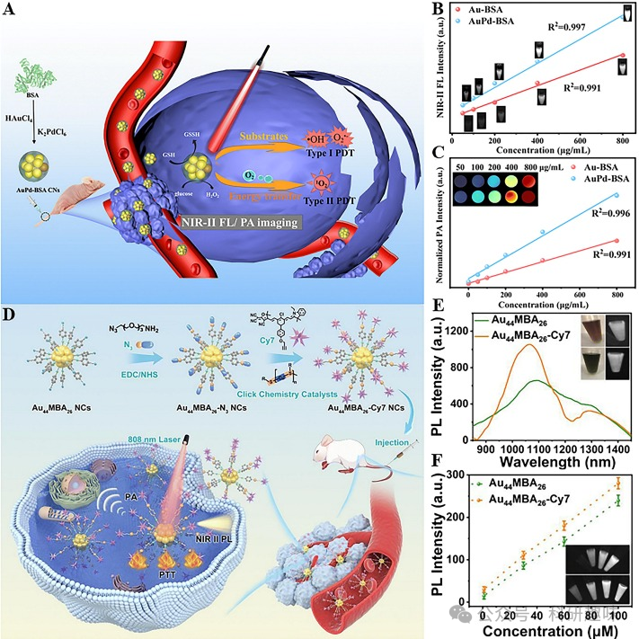
图6.(A)AuPd-BSACNs的制备及用于指导癌症治疗的NIR-IIFL/PA双模态成像示意图；(B)不同浓度的Au-BSACNs和AuPd-BSACNs的荧光强度图；(C)不同浓度Au-BSACNs和AuPd-BSACNs的PA强度图；(D)Au44MBA26-Cy7NCs的制备和用于指导癌症治疗的NIR-IIFL/PA双模式成像示意图；(E)Au44MBA26NCs和Au44MBA26-Cy7NCs的近红外-II荧光发射光谱；(F）不同浓度的Au44MBA26NCs和Au44MBA26-Cy7NCs的荧光强度图；

**3.2.2.2. 金纳米粒子复合材料**

纳米金氧化物（Au NEs）是一种独特的二聚体金基纳米材料，其表面布满了可调长宽比的金纳米棒（Au NRs）。这些Au NRs的几何特性显著增强了表面等离子体共振效应，进而展现出高摩尔吸收系数和紫外至近红外-IIb区的宽光谱吸收，为深穿透和高对比度近红外-II光声成像（PAI）提供了可能。金NEs通常表现出优异的上转换能力，使其在近红外-II成像领域展现出高灵敏度和光稳定性。

2016年，Hwang研究团队成功开发出一种金NEs，能够同时应用于近红外-II荧光（FL）和近红外-II光声（PA）成像（https://doi.org/10.1002/admt.201600107）。为了提升Au NEs-PEG-folate的生物相容性和肿瘤靶向性，通过聚丙烯酸和NH2-PEG-folate对Au NEs表面进行了精细修饰（图7A）。与其他有机小分子染料和纳米粒子（NPs）相比，Au NEs-PEG-folate展现出了更高的摩尔吸收系数，其紫外吸收波长可延伸至1700纳米（图7B）。该探针在674纳米波长处具有显著的上转换荧光发射，且所需激光功率远低于其他Au NPs，有效减少了皮肤损伤的风险（图7C）。此外，Au NEs在低强度激光照射下成功实现了近红外-II FL和近红外-II PA的双模态成像。

2020年，Song研究团队报道了一种Au NRs囊泡光敏剂AuNR@PEG/PolyRu Ves，用于NIR-II FL和NIR-II PA双模态成像（https://doi.org/10.7150/thno.44376）。该囊泡通过自组装技术将钌聚合物（PolyRu）、PEG和NIR-II荧光染料IR 1061涂覆在Au NRs表面而制得（图7D）。在近红外激光照射下，PolyRu被激活，导致囊泡裂解并释放出IR 1061和Ru复合物，进而产生可检测的近红外-II FL和近红外-II PA信号变化。随着激光照射时间的延长，近红外-II PA信号逐渐减弱（图7E），而近红外-II FL信号则逐渐增强（图7F）。在MCF-7细胞中，AuNR@PEG/PolyRu Ves展现出了相似的FL和PA信号变化（图7G）。此外，该Au NRs囊泡还显示出良好的抗肿瘤作用，为近红外-II FL/NIR-II PA双模态成像指导下的肿瘤诊断和治疗提供了新途径。

Zhang等人则制备了哑铃状的金纳米哑铃（AuNDs），用于NIR-II双模态引导的肿瘤免疫治疗（图7H）（https://doi.org/10.1016/j.nantod.2020.100987）。通过多核苷酸修饰金纳米棒的表面，并调控两者比例，成功将金纳米棒转化为AuNDs。这些合成的AuNDs相较于普通Au NRs展现出了更高的热稳定性和光电转换效率（PCE，高达84.9%），为近红外-II PA成像提供了理想平台（图7I）。随着AuNDs浓度的增加，体外近红外-II PA信号强度逐渐增强，并显示出浓度依赖性（图7J）。为了增强肿瘤靶向性和细胞摄取率，研究人员进一步采用靶向核仁蛋白的核酸适配体AS1411和mPEG2000-SH对AuNDs表面进行修饰，制备了Ap-AuNDs（图7K）。这种Ap-AuNDs具有免疫原性，可通过近红外-II双模态成像介导肿瘤免疫治疗。
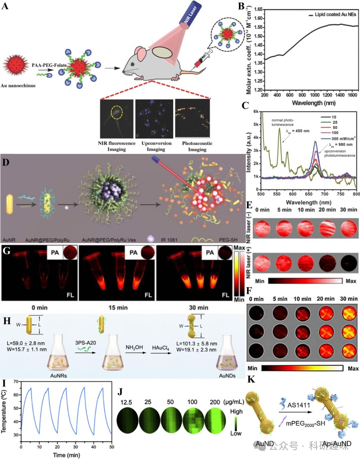
图7.(A)AuNEs-PEG-folate的制备；(B)AuNEs-PEG-folate的摩尔吸光度光谱；(C)AuNEs-PEG-folate的上转换荧光光谱；(D)AuNR@PEG/PolyRuVes的制备；(E)AuNR@PEG/PolyRuVes经激光照射和未经激光照射时的PA图像；(F）不同激光照射时间下AuNR@PEG/PolyRuVes的近红外-IIFLI；(G)不同激光照射时间、PBS溶液中MCF-7细胞的近红外-IIFLI和近红外-IIPAI；(H)AuNDs的制备；(I)AuNDs的光热稳定性曲线；(J）不同浓度AuNDs的体外PAI；(K)表面修饰AuNDs以制备Ap-AuNDs；

**3.2.3. 稀土金属参杂的纳米粒子**

稀土金属，由钇、钪以及镧系元素共17种化学元素组成，其中钇和钪因常与镧系元素共生于同一矿床并展现相似的化学性质，亦被纳入稀土金属范畴。稀土金属因其独特的4f电子层结构，在外部光照射下，f-f或f-d组态间会发生复杂的能级跃迁与辐射转变，进而产生紫外至红外波段的光辐射。掺杂稀土的纳米粒子（RENPs）作为一类功能型纳米材料，其光物理性质深受掺杂稀土元素类型、浓度以及基体材料影响。RENPs的发光性能，特别是上转换和下转换发光，源于其独特的能级结构和跃迁特性。此外，RENPs还具备光稳定性强、发光性能可调、生物毒性低、自背景荧光弱等特性，为NIR-II FL/PA双模态成像技术提供了有力支持，并在生物成像、传感以及3D显示等领域展现出广阔的应用前景。然而，RENPs在尺寸控制、表面缺陷以及合成策略等方面仍面临挑战。

2019年，Cheng研究团队提出了一种基于掺稀土偶氮苯聚合物的近红外-II FL/PA双模态成像材料（https://doi.org/10.1002/adom.201900045）。通过在纳米粒子中掺杂NaYF4和NaYbF4，实现了NIR-II荧光发射及高上转换效率。如图8A所示，该材料UCNPs@PAA-Azo是通过在上转换纳米粒子（UCNPs）表面改性光开关聚合物制得。与UCNPs相比，UCNPs@PAA-Azo在紫外线和蓝光区域的吸收强度较低，但光声（PA）强度显著增强（图8B和8C），这归因于其能将短波长的可见光转化为超声波，从而增强上转换PA信号的强度。此外，UCNPs与UCNPs@PAA-Azo的荧光强度相近，表明改性光开关聚合物对近红外-II荧光吸收无显著影响（图8D）。这种双模态成像技术不仅可实现实时肿瘤监测，还能通过PAI的高时间分辨率提高成像效率，两者优势互补，增强了UCNPs@PAA-Azo在疾病成像中的效果。

2020年，Cheng研究小组进一步开发了一种具有聚多巴胺（PDA）涂层的下转换纳米粒子（DCNPs），作为近红外-II FL/PA双模态造影剂（https://doi.org/10.1016/j.bios.2019.112000）。DCNP@PDA NPs通过核壳结构设计，在掺入不同稀土元素后，实现了从壳到核的能量转移，并产生具有大斯托克斯位移的NIR-II FL发射（图8E）。这种稀土掺杂的DCNPs不仅具有低生物毒性、强抗光漂白能力以及良好的生物交联灵活性，而且PDA涂层进一步提高了探针分子的生物相容性。DCNP@PDA NPs的FL和PA信号强度均与浓度相关，为各种生物实验提供了有效的探针选择（图8F和8G）。该纳米探针以其高空间和时间分辨率，为胃肠道等生物组织的实时成像提供了强有力的支持。

最近，Wu等人利用镧系元素、Fe3+和没食子酸（GA）合成了一种有机-无机杂化纳米复合材料Ln@Fe NPs（图8H）（https://doi.org/10.1016/j.cej.2023.143827）。该探针分子中掺杂的镧系元素提供了近红外I波段的多波段上转换发射和近红外IIb波段的反斯托克斯发射（图8I）。此外，探针中的GA能够还原Fe3+为Fe2+，通过芬顿反应产生强氧化性的羟自由基（-OH），对癌细胞造成氧化损伤并诱导铁死亡。Ln@Fe NPs在肿瘤诊断和治疗中展现出了巨大的潜力，通过其引发的氧化应激与近红外-II FL/PA双模态成像技术，为疾病的诊疗提供了一个全新的平台。
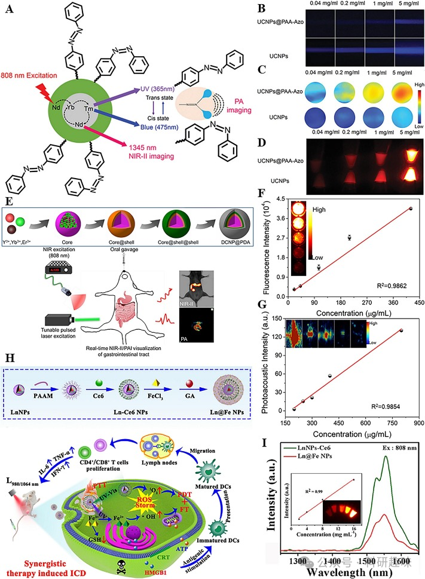
图8.(A)UCNPs@PAA-Azo的NIR-IIFL/PA双模态成像示意图；(B)不同浓度UCNPs@PAA-Azo和UCNPs的可见光图像；(C)不同浓度UCNPs@PAA-Azo和UCNPs的PA图像；(D)不同浓度UCNPs@PAA-Azo和UCNPs的FL图像；(E)DCNP@PDANPs的制备和NIR-IIFL/PA双模态成像示意图；(F）不同浓度的DCNP@PDANPs与荧光强度的线性图；(G）不同浓度的DCNP@PDANPs与PA强度的线性图；(H）Ln@FeNPs的制备及肿瘤治疗机制；(I）LnNPs-Ce6和Ln@FeNPs的荧光发射光谱.

**3.2.4. 碳复合材料**

碳，作为生物体的基石元素和地壳中极为丰富的元素，其纳米形态——碳纳米材料（CNMs）因无污染、轻质、高导电性等特点，在材料科学领域占据着举足轻重的地位。传统的CNMs包括碳纳米球、碳纳米管和碳纳米纤维等，它们凭借纳米尺度的优势，展现出了卓越的电学、光学、热学和机械性能，已广泛应用于透明导电薄膜、储能设备、光电设备、气体传感器和生物成像等多个领域。

然而，CNMs的稳定性和溶解性等问题限制了其性能。为解决这些问题，科研人员通过有机分子、无机纳米粒子、聚合物和生物大分子的掺杂，成功制备了具有特殊几何形状和理化性质的新型杂化CNMs，显著拓宽了其应用领域。碳原子的不同杂化模式（sp³、sp²和sp）亦对CNMs的电子结构和光学特性产生深远影响，为生物成像提供了不同的对比度和分辨率。特别地，杂化CNMs的高生物相容性、生物柔韧性、光电转换性能、低生物组织损伤和低信号背景干扰等特点，使其成为近红外-II FL/PA双模态成像的理想选择。尽管如此，针对深部组织的成像分辨率和信号强度的优化仍是未来研究的重点。

纳米酶，作为一类具有酶活性的人工合成仿生物纳米材料，不仅继承了纳米材料的光电磁和物理化学特性，还具备独特的类酶催化活性。在生物传感领域，纳米酶通过高效的信号传导和调制，显著提高了生物物质的检测效率，展现出巨大的应用潜力。Zheng等人通过精心设计的合成步骤，成功制备了多合一纳米酶HSC-2，该材料在肿瘤纳米催化治疗方面展现出显著优势（https://doi.org/10.1002/smll.202103252）。HSC-2的合成过程涉及沸石型纳米分子筛的水热合成、离子液体吸附、高温碳化以及氮掺杂碳中间体的形成。氮掺杂碳不仅改善了碳材料的电化学性能，还通过精确控制Si/C比（图9A），赋予了HSC-2优异的近红外-II FL和近红外-II PA成像功能(图9B和9C)。Guo等人则通过引入碳缺陷，成功构建了新型碳化硼纳米片，实现了近红外-II FL/NIR-II PA双模态成像的显著优化(https://doi.org/10.1021/acsbiomaterials.1c00578)。碳缺陷的引入有效调节了材料的光学和声学特性，增强了光吸收和声发射，从而大幅提升了杂化碳纳米片的成像性能(图9D)。此外，B4C@C和B4C的吸收波长从紫外-可见光区扩展至近红外-II区(图9E)，进一步促进了近红外-II区的FL/PA双模式成像(图9F)。

最近，Shi小组提出了飞秒激光泵浦光声空化技术，并结合碳化铌（Nb2C）和聚乙烯吡咯烷酮（PVP）制备了Nb2C-PVP纳米片，实现了近红外-II FL/NIR-II PA双模态成像(图9G) (https://doi.org/10.1039/D3NR03665K)。Nb2C作为一种新型二维过渡金属碳化物，具有高机械韧性和大比表面积，同时其表面的亲水端基官能团为纳米材料的加工和功能化提供了丰富的反应位点。Nb2C-PVP在近红外-II波段展现出宽而强的吸收带，有利于成像应用(图9H)。此外，Nb2C-PVP良好的水分散性和亲水性，以及与生物体的优异相容性(图9I)，为其在生物医学领域的应用提供了有力支持。在NIR-II飞秒激光的照射下，Nb2C产生的PA信号比纳秒激光更强，为肿瘤的连续高精度爆破治疗提供了新途径(图9J)。
             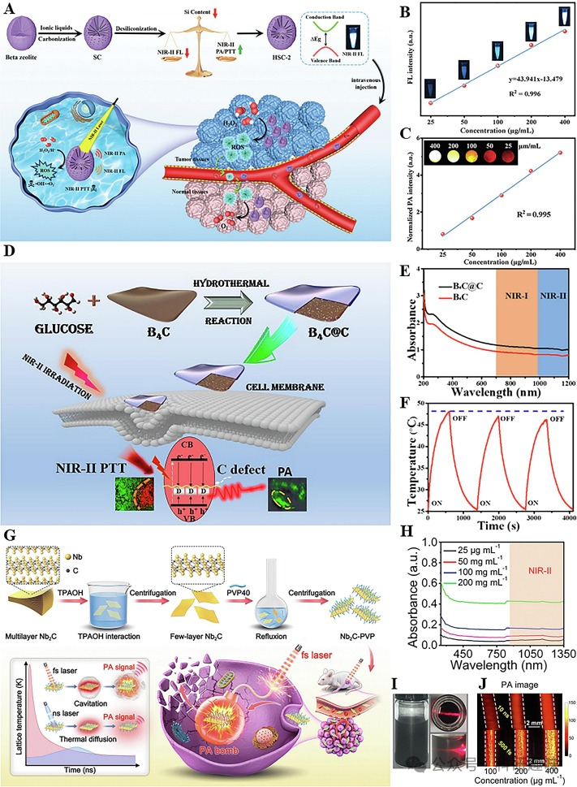
图9.(A)HSC-2制备和近红外-IIFL/NIR-IIPA双模态成像示意图；(B)不同浓度的HSC-2与FL强度的线性图；(C)不同浓度的HSC-2与PA强度的线性图；(D)B4C@C的制备；(E)B4C@C和B4C的紫外吸收光谱；(F)B4C@C的光热稳定性曲线.(G）制备Nb2C-PVP和飞秒激光泵浦光声空化爆破肿瘤的示意图；(H）不同浓度Nb2C-PVP的紫外吸收光谱；(I）保存一周的Nb2C-PVP水分散性照片；(J)纳秒和飞秒激光照射下毛细管中Nb2C纳米片的PA图像；

**3.2.5. 其他复合材料**

除了前述的有机-无机纳米杂化材料外，还有多种杂化纳米材料同样适用于近红外-II荧光/光声（FL/PA）双模态成像，例如放射性金属掺杂的纳米材料、沸石咪唑框架（ZIF）基材料和纳米聚集体。这些材料以其多样化的形态结构以及易于表面功能化修饰的特性，在吸附、光电、催化、磁性和生物成像等领域备受关注。然而，它们也面临着稳定性不足、生物相容性差以及合成挑战等问题。

2020年，Hu's团队开发了一种基于稀有放射性金属锝的杂化纳米材料，用于淋巴结转移的近红外-II FL/PA双模态成像（https://doi.org/10.1021/acsami.0c14576）。他们首先通过自组装技术将NIR-II有机荧光染料IR-1061与聚乳酸-乙醇酸等有机聚合物合成荧光聚合物（FIP），随后将放射性同位素99mTc螯合到FIP表面，形成FIP-99mTc纳米复合材料（图10A）。由于IR-1061在二氯甲烷溶液和FIP中的环境差异，FIP的最大发射波长出现蓝移（图10B）。此外，FIP还具有宽范围的光声信号（图10C）和良好的浓度线性关系（图10D），使其成为淋巴结转移的NIR-II FL/PA双模态成像的多功能纳米平台。

Qu等人报道了一种基于ZIF的杂交纳米粒子ZIMH，在近红外-II FL/PA双模态成像中展现出优异性能（https://doi.org/10.1039/D0RA09545A）。他们通过将近红外荧光染料IR820均匀地封装在ZIF内部，有效避免了聚集导致的猝灭（ACQ）效应。同时，在ZIF外部涂覆具有良好水溶性和生物相容性的透明质酸（HA）（图10E），进一步提高了其生物应用潜力。体外实验表明，ZIMH的浓度与生物体内光声成像（PAI）的信号强度呈线性相关（图10F）。ZIMH的发射光谱延伸至近红外II段，能够高效吸收近红外线，从而显著促进近红外II段荧光成像（FLI）（图10G）。这一研究为实现小鼠肿瘤的定位和可视化提供了有力工具。

An等人则探究了一种基于白蛋白-锰纳米聚集体的C-BM/I复合物在肿瘤治疗和近红外-II FL/PA双模态成像中的应用（https://doi.org/10.1039/d2tb02529a）。他们通过交联反应将白蛋白与锰纳米粒子结合，形成具有敏化T1弛豫的C-BM纳米聚集体。随后，将吲哚菁绿（ICG）负载于C-BM上，形成C-BM/I复合物（图10H）。实验表明，相较于游离的ICG在激光照射下易发生光漂白、荧光强度逐渐降低的现象（图10I），负载于C-BM上的ICG在激光照射下展现出良好的光稳定性（图10J）。细胞内的吸收实验进一步揭示，虽然C-BM/I的荧光强度略低于ICG，但其光声强度却优于ICG（图10K和10L）。这一发现不仅证明了C-BM在提高ICG近红外-II荧光稳定性的同时，还增强了其光声效应，为白蛋白-锰纳米团聚体在近红外-II FL/PA双模态成像中的应用开辟了新途径。
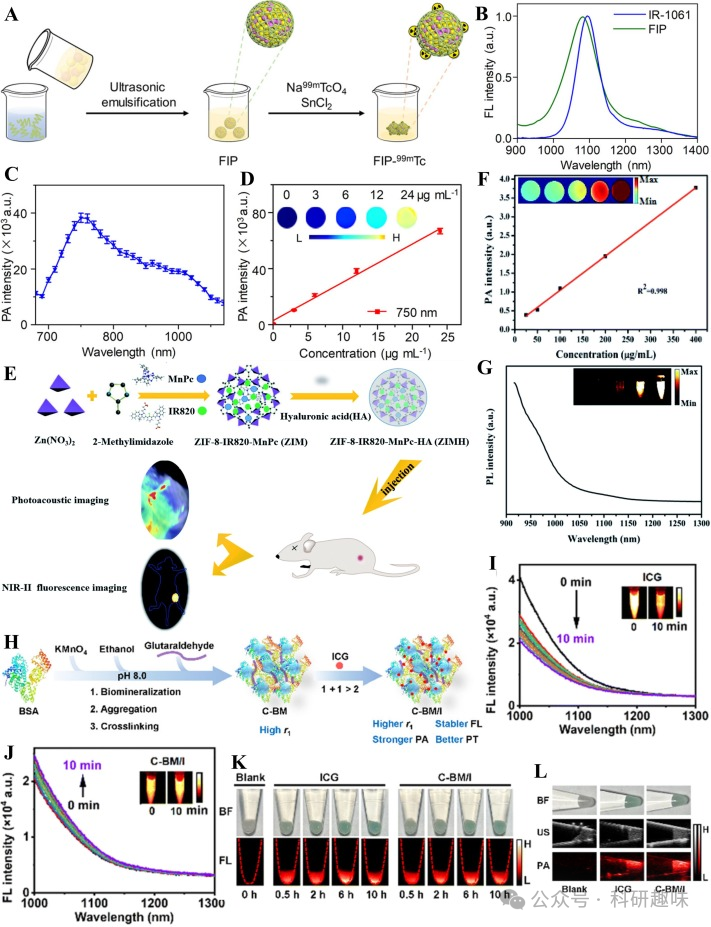
图10.(A)FIP-99mTc的制备；(B)IR-1061和FIP的荧光发射光谱；(C)FIP的PA光谱；(D)不同浓度下FIP与PA强度的线性图；(E)ZIMH和NIR-IIFL/PA双模态成像制备示意图；(F）不同浓度ZIMH与PA强度的线性图；(G）ZIMH的荧光发射光谱；(H)C-BM/I的制备；(I)激光照射10分钟后ICG的荧光发射光谱；(J）激光照射10分钟后C-BM/I的荧光发射光谱；(K)ICG和C-BM/I的NIR-IIFL图像；(L)ICG和C-BM/I的PA图像；

在此，我们系统地归纳了用于构建近红外-II荧光/光声（FL/PA）双模态成像技术的有机小分子染料、有机纳米粒子以及有机-无机纳米杂化材料的详细参数（表 1）。在众多近红外-II FL/PA双模态成像探针中，有机小分子纳米粒子占据主导地位。然而，值得注意的是，大多数探针的发射波长主要集中在近红外-IIa'区域，仅有少数能在近红外-IIb区域进行高效的荧光成像。考虑到近红外-II FL/NIR-II PA双模态成像探针能够提供更深入的生理和病理信息，目前这类探针的数量仍然相对较少，但其在生物医学领域的应用潜力巨大。

为了进一步推动近红外-II FL/PA双模态成像技术的发展，我们需要针对粒度、量子产率（QY）和光声转换效率（PCE）等关键参数进行优化。这些优化工作将有助于提高探针的生物分布均匀性、组织穿透深度、细胞内化效率和体内稳定性，从而为实现更精准的生物医学成像提供有力支持。

Table 1. Classification and parameters of NIR-II FL/PA dual-modality imaging probes.

| Probe name | λmax abs/nm | FLmax em/nm | PAex/nm | Size/nm | QY/% | PCE/% | Biomedical applications |
| --- | --- | --- | --- | --- | --- | --- | --- |
| NIC-ER | 910 | 1030 | 910 | – | 3.56 | – | Tumor and vascular imaging |
| CyQN-BTT | 677 | 938 | 671 | – | 0.12 | 37.8 | Tumor imaging |
| IR806-RGD | 815 | 855 | 808 | – | 0.17 | – | Tumor imaging |
| TSSAM | ∼640 | 950 | 660 | – | 0.156 | 40.1 | Tumor imaging |
| ZSY-TPE | 730 | 1020 | 808 | ∼90 | 3.1 | 28.4 | Tumor imaging and antimicrobial |
| DPBTA-DPTQ | 817 | 1125 | – | ∼105 | 0.16 | 40.6 | Tumor imaging |
| M1 | 734 | 1040 | 808 | 100 | 2.84 | 77.5 | Tumor imaging |
| SYL | ∼765 | ∼976 | 760 | ∼120 | – | ∼21.8 | Tumor imaging |
| SY1080 | 820 | 1080 | 808 | ∼120 | 1.5 | 22.3 | Tumor imaging |
| TPA-BT-DPTQ | 853 | 1117 | 870 | 54.1 | 0.13 | 23 | Tumor imaging |
| CEB | ∼900 | ∼1120 | 820 | ∼100 | 0.98 | – | Tumor imaging |
| TSST | 731 | 1077 | 808 | ∼120 | – | – | Tumor imaging and ferroptosis |
| DTTB@PEG | 750 | 1050 | 808 | ∼80 | 13.4 | 47.3 | Tumor and vascular imaging, drug delivery |
| BDTR9-OC8 | 757 | 1072 | 808 | ∼28 | 0.41 | 78 | Tumor imaging |
| BDTR9-C8 | 766 | 1054 | 808 | ∼36 | 1.89 | 71 | Tumor imaging |
| DHTDP NP@M | 840 | 1050 | – | ∼118 | 0.125 | – | Tumor imaging |
| BBTD-1302 | 942 | 1302 | 980 | ∼80 | 2.4 | 28.6 | Tumor imaging |
| BTP-4F-DMO | 650 − 850 | ∼900 | – | ∼33 | – | 90.5 ± 5 | Tumor imaging |
| BTP-TCID-2CN | – | 914 | – | ∼178.3 | 3.77 | 33.5 | Tumor imaging |
| AIE@R837 | – | 1163 | 808 | ∼150 | – | 27.9 | Tumor and vascular imaging |
| DFTQ–DTPA | 922 | 1127 | 922 | ∼89.8 | 0.064 | 51.6 | Tumor and vascular imaging |
| DTP-DPTQ | 852 | 1120 | 852 | ∼65 | 0.01 | 51.55 | Tumor and vascular imaging |
| ICR-QuNPs | 770 | 1032 | 808 | 176.8 | 1.47 | 81.1 | Tumor imaging |
| DPP-BDT | 625 | 980 | 660 | ∼90 | 0.52 | 23 | Tumor imaging |
| ETTC | – | 900 − 1200 | – | 59.3 | 3 | 52.8 | Tumor imaging |
| TTT-4 | 568 | 813 | – | 32.14 | 0.8 | 39.9 | Tumor imaging |
| TPEDCAc | 460 − 580 | 980 | 660 | 70 | 0.4 | 44.1 | Tumor imaging |
| Y16-Pr-PEG | 600 − 900 | 920 | – | 126 | – | 82.4 | Tumor imaging |
| FE-IDMN | 1050 | – | 808 | ∼160 | 0.066 | 82.6 | Tumor imaging |
| DPP-FCPP | 611 | 1090 | 760 | ∼100 | 0.82 | 16 | Liver imaging |
| IDCIC | 760 | ∼1000 | – | ∼80 | 1.2 | 78.9 | Tumor imaging |
| TDA | 625 | 935 | 825 | ∼103 | 0.62 | 20.5 | Liver imaging |
| FEAA | 637 | 1109 | 760 | ∼65 | 0.81 | 23.4 | Liver imaging |
| SPN | ∼521 | ∼930 | 530 | 92.5 ± 1.01 | ∼0.2 | 29.7 | Liver imaging |
| P-DPP | 763 | 1066 | 530 | ∼80 | 1.5 | 15 | Liver and vascular imaging |
| PFG | 826 | 1063 | 808 | ∼80 | – | 75.6 | Tumor imaging and ferroptosis |
| PFTQ-PEG-Gd | 760 | 1056 | 760 | 138.4 ± 3.1 | 0.38 | 26 | Tumor and vascular imaging |
| B@SP-C | 1310 | – | 1260 | 168 | – | 73 | Thrombus imaging |
| DPP-TT | − | 1000 − 1400 | 808 | 90 | – | 45.4 | Tumor imaging |
| PFTDPP-SNAP | 550 − 900 | 1060 | 808 | 52 | 2.2 | 48 | Tumor and vascular imaging |
| Tat-BTNP | 854 | 1106 | 532, 840 | ∼45 | 0.1 | – | Vascular imaging and inflammation tracking |
| SPN-PT | 703 | 961 | 695 | 124.24 ± 1.34 | – | 41.8 | Tumor imaging |
| Ag2S-NDs | – | 1060 | 800 | 32.8 | 1.26 − 1.32 | 35 | Tumor and vascular imaging |
| Ag2S@DP-FA | – | ∼1100 | 523, 744 | ∼200 | – | – | Tumor and vascular imaging |
| CPCC-Ag2S | – | 1099 | 744 | 3.44 | 3.78 | 21 | Tumor imaging |
| ICG@PEG-Ag2S | ∼800 | 1100 | 780 | 172.2 | – | – | Atherosclerosis imaging |
| Au NEs-PEG-folate | 980 | 500 − 800 | 1064 | ∼350 ± 50 | – | – | Tumor imaging |
| APHA@CM | – | 1170 | – | 172.6 ± 18.3 | – | 26.89 | Tumor imaging |
| UCNPs@PAA-Azo | 976 | 1345 | 808 | 37.6 ± 2.1 | 5.6 | – | Organs and vascular imaging, image-guided surgery |
| DCNP@PDA | – | 1340 | 700 | 32.3 ± 2.7 | – | 40 | Gastrointestinal tract imaging, image-guided surgery |
| Ln@Fe | – | 1550 | 808 | ∼88.6 | – | 40.3 | Tumor and vascular imaging, ferroptosis |
| HSC-2 | – | ∼957 | 808 | 142.2 | 0.412 | 41.41 | Tumor imaging |
| B4C@C | 200 − 1200 | – | 1064 | 120 ± 2 | – | 45.4 | Tumor imaging |
| Nb2C-PVP | 750 − 1350 | – | 1035, 1064 | ∼220 | – | 37.48 | Tumor imaging |
| QD@Si/GO–FA | – | 1120 | 523, 744 | 250 ± 7 | ∼1.12 | 30.6 | Tumor and vascular imaging |
| FIP-99mTc | 1069 | 1095 | 750 | 182 | – | ∼32.8 | Tumor imaging |
| ZIMH | 820 | – | 880 | 213.9 | – | – | Tumor imaging |
| C-BM/I | 786 | – | 830 | ∼309 | – | 16 | Tumor imaging |

## **参考文献**

**Ref**

Pan, W.; Rafiq, M.; Haider, W.; Guo, Y.; Wang, H.; Xu, M.; Yu, B.; Cong, H.; Shen, Y. Recent Advances in NIR-II Fluorescence/Photoacoustic Dual-Modality Imaging Probes. Coordination Chemistry Reviews 2024, 514, 215907. https://doi.org/10.1016/j.ccr.2024.215907.

**点击蓝字 关注我们**

预览时标签不可点

素材来源官方媒体/网络新闻

 [阅读原文](javascript:;) 

  继续滑动看下一个 

 轻触阅读原文 

    

