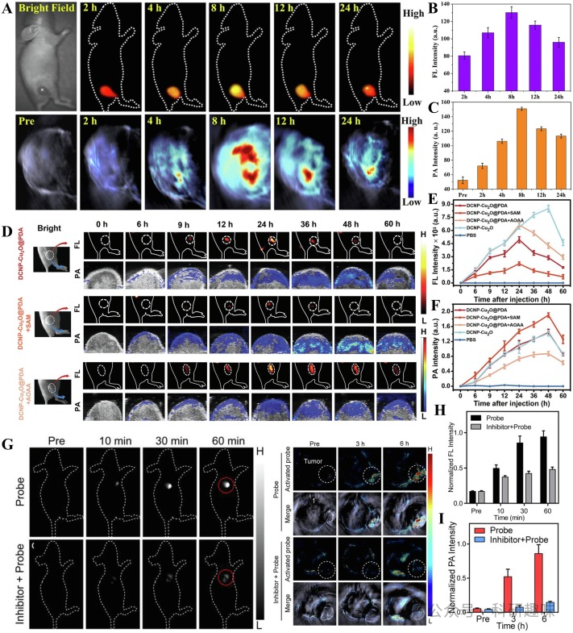
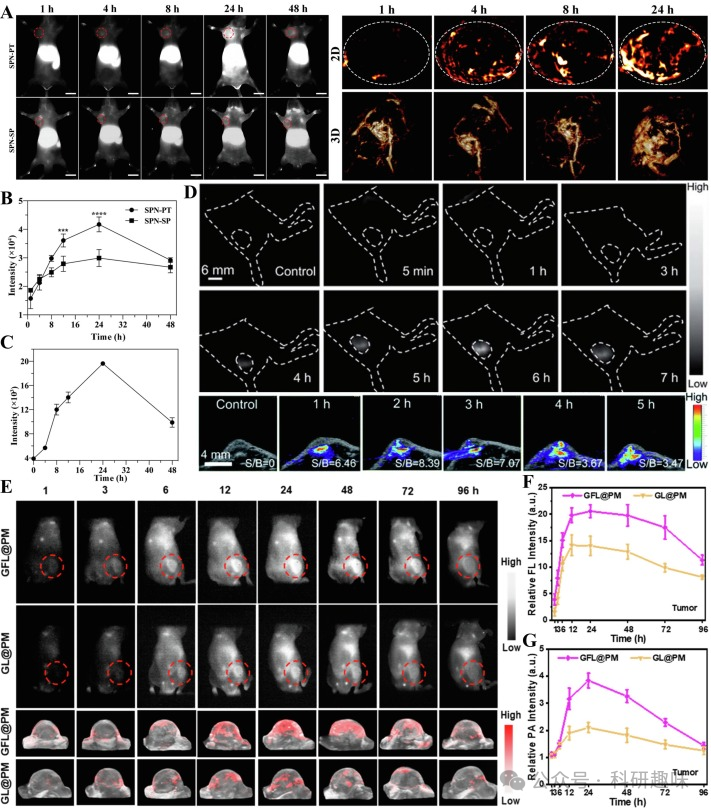
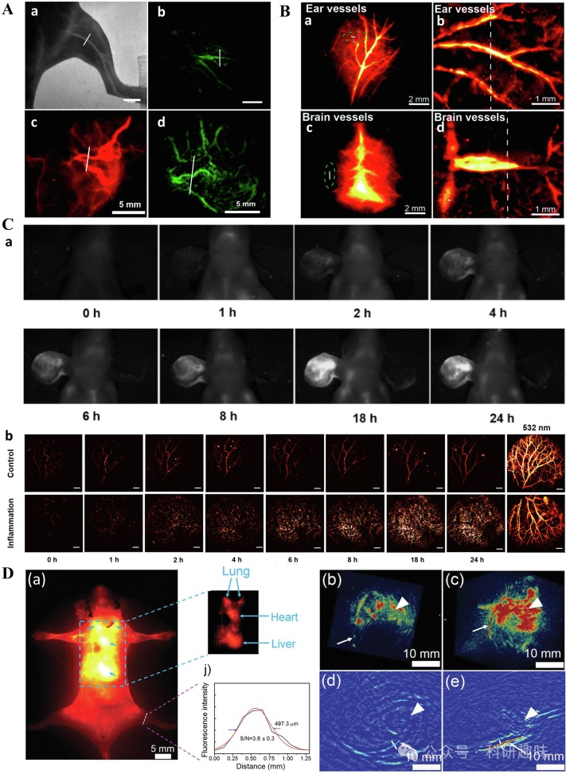
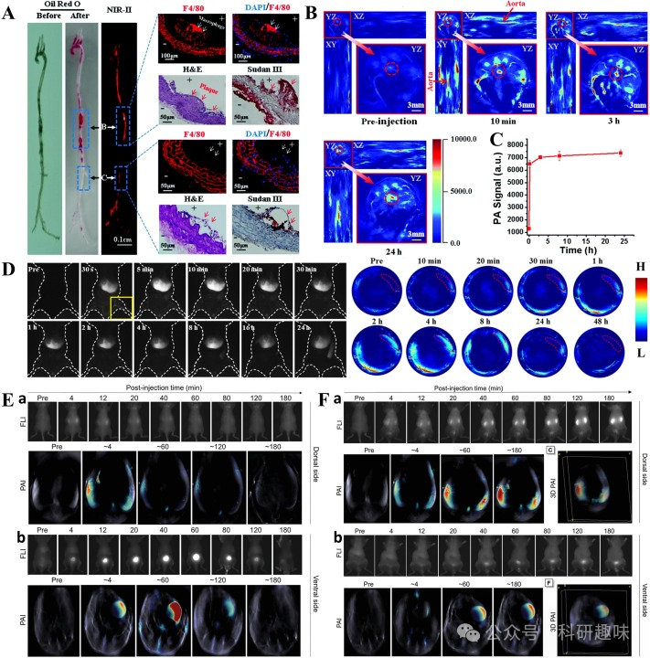
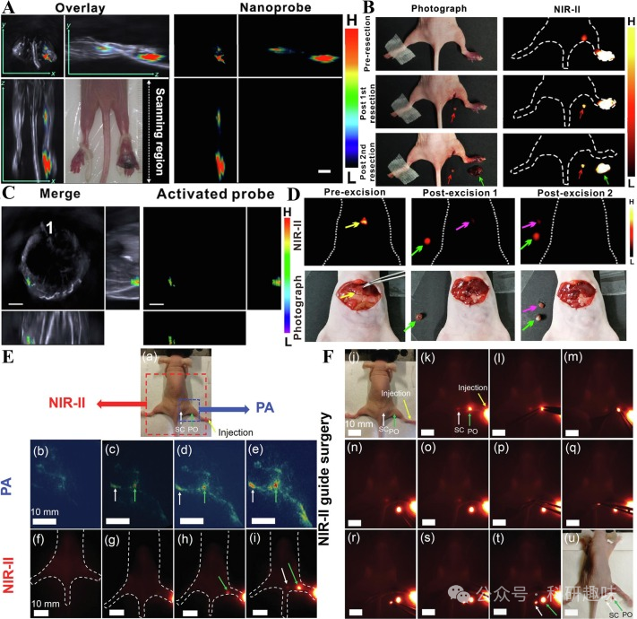
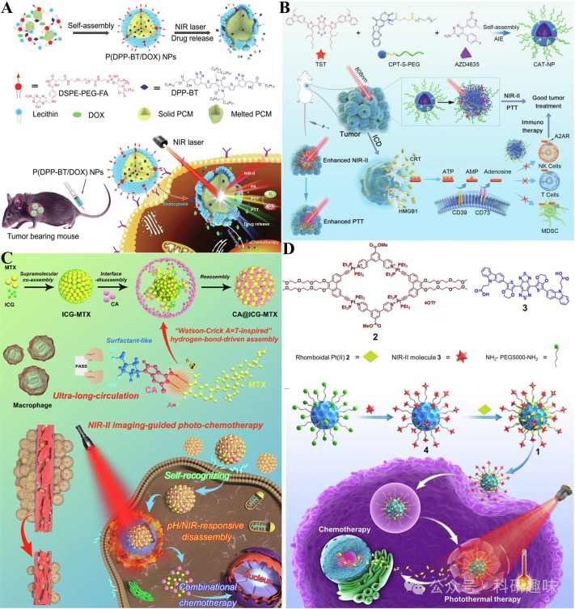

 

#  【Coord. Chem. Rev.】二区近红外荧光/光声双模态成像探针-生物医药应用及未来展望 
 

Grenemal

读完需要

22

全文字数 7200 字

**NIR-II FL/PA 双模态成像探针**

NIR-II fluorescence/photoacoustic dual-modality imaging probe

**目录**

- 体内成像
- 肿瘤治疗
- 血管成像
- 其他部位的成像
- 手术导航
- 药物递送
- 结论与展望

**5. 生物医药应用**

近红外-II荧光/光声（FL/PA）双模态成像技术，作为一种先进的生物医学成像方法，巧妙地将近红外-II荧光成像（FLI）与光声成像（PAI）的优势相结合。这种双模态成像技术不仅克服了单模态成像技术的局限性，更在成像的准确性和可靠性上实现了显著提升。在生物医学领域，近红外-II FL/PA双模态成像技术展现出广泛的应用前景，特别是在体内成像和肿瘤治疗监测方面，其独特的成像能力为疾病的早期诊断和治疗提供了有力的支持。

5.1. 体内成像

**5.1.1. 肿瘤治疗**

癌症作为全球性的主要健康威胁，其发病率和死亡率因环境污染、饮食模式的转变及人口老龄化而预计将持续攀升。早期且准确的肿瘤诊断对于提高患者的存活率及生活质量至关重要。为此，科研人员采用近红外-II荧光/光声（NIR-II FL/PA）双模态成像技术，以实现癌症的早期精准诊断。

肿瘤靶向策略可划分为被动靶向和主动靶向两类。被动靶向依赖于肿瘤部位特有的生理和病理特征以及探针本身的性质，使其在肿瘤区域有效积累。而主动靶向则基于探针表面分子与肿瘤部位特定分子的主动识别，实现探针分子在肿瘤细胞和组织中的选择性聚集。当前，多数探针主要通过肿瘤血管的通透性和滞留性增强效应（EPR）实现被动靶向，但这种方法仅适用于实体瘤形成后，此时肿瘤可能已发生转移。因此，开发不依赖EPR效应的新型主动靶向探针，对于早期肿瘤的诊断和治疗至关重要。

在近期研究中，Sun等人成功将小分子染料与黑色素纳米粒子结合，形成用于喉癌NIR-II FL/PA双模态成像的探针（https://doi.org/10.2147/IJN.S284520）。通过NH2-PEG-NH2高分子复合物的表面修饰，显著改善了探针的水溶性、毒性和体内循环性，展现出明显的EPR效应，实现对肿瘤组织的被动靶向。实验结果显示，小鼠注射后8小时，近红外-II荧光信号达到峰值（图17A），肿瘤荧光成像的信号背景比（SBR）约为130.2 ± 6.6（图17B）。同时，肿瘤区域的PA信号也被量化（图17C），为肿瘤诊断提供了更为全面的成像信息。

PDA因其良好的生物相容性、光热转换性能、表面附着力和化学反应活性，常被用于构建肿瘤靶向探针。Wang等人利用PDA在DCNP表面形成涂层，实现了结肠癌的NIR-II FL/NIR-II PA双模态成像（图17D）（https://doi.org/10.1002/adom.202302796）。经尾静脉注射后，探针DCNP-Cu2O@PDA通过EPR效应迅速在结肠肿瘤部位聚集，24小时后NIR-II FL信号达到峰值（图17E）。该探针能与肿瘤内源性H2S反应生成DCNP-Cu2-XS@PDA，导致NIR-II FL信号减弱，而NIR-II PA信号增强，并在48小时达到峰值（图17F）。通过L-蛋氨酸（SAM）和氨基氧乙酸（AOAA）调控内源性H2S的产生，研究人员进一步验证了该探针在不同H2S水平下的双模态成像能力。

Zhang等人则通过π偶联共轭荧光团与聚乙二醇链的连接，合成了近红外-II FL/PA双模态成像探针Flavchrom-4（https://doi.org/10.1021/acsmaterialslett.2c00451）。该探针能够被动靶向卵巢肿瘤组织，并检测内源性β-半乳糖苷酶水平（图17G）。尾静脉注射60分钟后，探针的NIR-II FL信号达到最大值。经β-半乳糖苷酶抑制剂预处理的肿瘤部位FL信号变化不明显，表明探针能被β-半乳糖苷酶有效激活（图17H）。通过三维MSOT横截面成像，发现PA信号强度在注射6小时后达到峰值，证明了该探针在卵巢肿瘤靶向和成像方面的优异性能（图17I）。

图17.(A)MNPH2的活体近红外-IIFL/PA双模态成像；(B)MNPH2的活体近红外-IIFL信号强度图；(C)MNPH2的活体PA信号强度图；(D)DCNP-Cu2O@PDA组和SAM、AOAA预处理组的体内NIR-IIFL/NIR-IIPA双模态成像；(E)DCNP-Cu2O@PDA组和SAM、AOAA预处理组的体内近红外-IIFL信号强度图；(F）DCNP-Cu2O@PDA组和SAM、AOAA预处理组的活体PA信号强度图；(G)Flavchrom-4的体内近红外-IIFL/PA双模态成像；(H)Flavchrom-4的体内近红外-IIFL归一化信号强度图；(I)Flavchrom-4的体内PA归一化信号强度图；

Yuan等人通过精心设计的化学合成，将半导体聚合物与靶向肽相结合，成功制备了NIR-II荧光/光声（FL/PA）双模态成像探针SPN-PT和SPN-SP（https://doi.org/10.1186/s12951-022-01249-4）。这些探针分子展现出了与骨肉瘤特定靶点结合的主动靶向能力（如图18A所示）。在980 nm长通滤光片（LP）的条件下，肿瘤区域的近红外-II荧光强度在24小时内逐渐增强，并在24小时时达到最大值，其中SPN-PT在肿瘤中的聚集能力显著优于SPN-SP（如图18B所示）。此外，SPN-PT的二维/三维光声成像显示，注射后4至8小时内信号强度显著上升，24小时时达到峰值（如图18C所示）。尽管NIR-II荧光成像在灵敏度上占据优势，但光声成像技术却能够提供更清晰的肿瘤精细结构信息，为诊断提供有力支持。

Xu等人则通过化学合成手段，制备了基于噻二唑-苯并三唑（TBZ）的多功能NIR-II FL/PA双模态成像探针DTPA-TBZ（https://doi.org/10.1039/D0SC03160G）。该探针外表面被叶酸（FA）修饰的磷脂聚合物所覆盖，能够特异性地与肿瘤细胞膜表面高表达的叶酸受体结合并内化，实现主动肿瘤靶向。在体内注射后，DTPA-TBZ的NIR-II荧光信号在6小时内达到峰值。而在790 nm激光的激发下，其光声信号在1小时内达到峰值，且信号背景比（SBR）高达3.47至8.39（如图18D所示）。DTPA-TBZ所展现出的优异肿瘤主动靶向性和双模态成像能力，为肿瘤的早期诊断提供了有力工具。

Lin研究团队则以聚乙二醇胶束为载体，通过共载NIR-II pH响应探针Fe2+和葡萄糖氧化酶（GOX），成功构建了NIR-II FL/PA双模态成像平台GFL@PM（如图18E所示）（https://doi.org/10.1021/acsnano.3c03279）。在肿瘤的酸性微环境中，GFL@PM通过电荷反转的阳离子化作用，显著增强了在肿瘤部位的聚集能力。同时，GOX催化引发的pH值降低也进一步促进了这一过程。因此，在注射后24小时，GFL@PM组的近红外-II荧光/光声信号强度明显高于未加载Fe2+的GL@PM对照组（如图18F和18G所示）。这项研究为全面优化用于肿瘤诊断的NIR-II FL/PA双模态成像技术提供了一种新的策略。

图18.(A)SPN-PT/SPN-SP的活体NIR-IIFL成像和SPN-PT的PA成像；(B)SPN-PT/SPN-SP的体内NIR-IIFL信号强度图；(C)SPN-PT的活体PA信号强度图；(D)DTPA-TBZ的活体NIR-IIFL/PA双模态成像；(E）GFL@PM/GL@PM的体内NIR-IIFL/PA双模态成像；(F）GFL@PM/GL@PM的体内FL信号强度图；(G）GFL@PM/GL@PM的活体PA信号强度图；

**5.1.2. 血管成像**

血管系统作为生命活动不可或缺的部分，在营养输送、代谢废物排除、体温调节、酸碱平衡维持以及免疫防御等方面扮演着核心角色，对维持人体健康及预防疾病至关重要。近年来，近红外-II（NIR-II）荧光探针因其独特的深组织穿透能力而被广泛应用于小鼠血管动态信息的获取。然而，尽管NIR-II荧光波段具有显著的穿透力，但生物组织的散射和吸收作用依然对其图像分辨率和对比度构成挑战。相较之下，光声（PA）成像技术以其更高的组织穿透深度和空间分辨率，能够更精确地描绘血管的形态结构与狭窄程度。随着科学技术的不断进步，NIR-II FL/PA双模态成像技术的应用将日益广泛，为医生准确诊断血管异常相关疾病提供有力支持。

在NIR-II FL/PA双模态血管成像领域，小鼠的后肢、肿瘤、耳朵和大脑成为研究的主要部位。Cheng等人通过Affibody-DAPs探针，成功实现了小鼠后肢及甲状腺肿瘤内血管的NIR-II FL/PA双模态成像（https://doi.org/10.1021/acsnano.7b05966）。在1000 nm长通滤光片下，小鼠后肢股血管清晰可见，分界线处血管宽度经测量为346 μm，与PAI计算所得的300 μm相近，表明两种成像模式在空间分辨率上具有一致性。甲状腺肿瘤成像则揭示了两种模式在血管密度呈现上的相似性，并允许通过信号强度量化血管密度（如图19A所示）。

Li课题组则以TBZ为核心，构建了具备NIR-II FL/PA双模态成像能力的纳米探针BTB，用于小鼠耳部和脑部血管的观测（https://doi.org/10.1039/D1TB02282B）。在1000 nm长通滤光片下，该探针展现出高荧光测量精度和空间分辨率，小鼠耳血管和脑血管的半峰全宽分别为71.67 μm和110.31 μm。此外，PAI所显示的血管结构相较于NIR-II FLI更为精细，为耳部和脑血管疾病的精确成像提供了新方向（如图19B所示）。

Li的研究小组进一步利用Tat-BTNP标记的中性粒细胞，对炎症小鼠的耳部血管异常进行了NIR-II FL/PA双模态成像研究（https://doi.org/10.1021/acs.analchem.1c00690）。注射后，耳部炎症血管的双模态成像信号在2小时后开始增强，并于18小时后达到峰值，显示出探针在实时追踪炎症部位中性粒细胞反应方面的能力。在PAI中，耳朵的血管结构清晰可见，且532 nm激发下的成像分辨率优于840 nm激发（如图19C所示），为监测炎症区域功能细胞的作用和变化提供了有力工具。

Cheng小组则对小鼠后肢进行了NIR-II FL/PA双模态成像研究（https://doi.org/10.1002/adom.201900045）。使用UCNPs@PAA-Azo探针，近红外-II FL成像显示的股血管宽度为497.3 μm，略低于PA成像的558.1 μm，这表明NIR-II成像在分辨率上具有一定优势。然而，PAI的信噪比却是NIR-II FLI的两倍，成像均匀性和细节表现更佳。二维和三维PAI进一步证实了PAA-Azo在增强PA信号方面的能力（如图19D所示）。尽管NIR-II FL/PA双模态成像在血管可视化方面展现出巨大潜力，但目前仍缺乏能够灵敏监测和评估血管内功能障碍的特异性探针，这将是未来研究的重要方向。
             
图19.(A)a和b分别为注射Affibody-DAPs后，后肢血管的NIR-IIFL和PA成像；c和d分别为注射Affibody-DAPs后，甲状腺肿瘤血管的NIR-IIFL和PA成像；美国化学学会2017年版权所有；(B)a和b分别为注射BTB后耳血管的NIR-IIFL和PA成像；c和d分别为注射BTB后脑血管的NIR-IIFL和PA成像；(C)a和b分别为注射Tat-BTNP标记的中性粒细胞后耳血管的近红外-IIFL和PA成像；(D)a为注射UCNPs@PAA-Azo后的活体NIR-IIFL图像和荧光强度分布；b和c分别为注射UCNPs和UCNPs@PAA-Azo后的后肢血管三维PA图像；d和e分别为注射UCNPs和UCNPs@PAA-Azo后的后肢血管二维PA图像；

**5.1.3.其他部位的成像**

除了上述常规区域的NIR-II FL/PA双模态成像技术外，科研人员还通过采用特定的荧光探针标记不同的生物大分子或组织结构，实现了对其他病灶区域的成像，为生物医学信息的获取提供了更全面、更精确的视角。

Wang研究团队成功合成了针对动脉粥样硬化的NIR-II FL/PA双模态成像探针ICG@PEG-Ag2S。（https://doi.org/10.1039/C6NR00060F）主动脉的近红外-II荧光成像结果表明，该探针能够选择性地聚集在动脉粥样硬化斑块区域。通过免疫组化切片分析，该探针能够清晰地检测出动脉粥样硬化斑块，并揭示了斑块边缘富含巨噬细胞的现象（如图20A所示）。在载脂蛋白E基因敲除小鼠模型中，注射ICG@PEG-Ag2S后，PA信号强度随时间逐渐增加（如图20B所示），并在3小时后达到空白组的6倍，且信号持续长达24小时（如图20C所示）。这一成果为临床动脉粥样硬化疾病的靶向成像提供了一种新的策略。

Li研究团队则开发了一种用于近红外-II FL/PA双模态肝脏成像的黑磷纳米探针BP@lipid-PEG（https://doi.org/10.1021/acsami.9b05825）。静脉注射后仅5分钟，肝脏区域的NIR-II FL信号即达到峰值。随后，随着探针逐渐被肝脏代谢，荧光强度逐渐降低。PA成像显示，8小时后信号强度达到最大，而48小时后探针被肝脏完全代谢（如图20D所示）。BP@lipid-PEG探针具有优异的生物降解性和高信噪比。

Tang研究小组利用AIE-4PEG550探针实现了对小鼠肾脏纤维化的近红外-II FL/PA双模态成像（https://doi.org/10.1002/adma.202206643）。在正常小鼠中，注射探针后4分钟，肾脏和膀胱的近红外-II FL信号达到最大值，随后在40分钟内逐渐消失。PA成像结果与NIR-II FL信号趋势相吻合（如图20E所示）。值得注意的是，肝脏中几乎无信号出现，表明探针主要通过肾脏系统清除。此外，利用FA诱导的肾脏纤维化小鼠模型显示，探针能够在肾脏和膀胱中长期累积。由于肾纤维化小鼠的尿液代谢速度较慢，其肾脏中的近红外-II FL/PA信号高于正常小鼠，而膀胱中的信号则相对较低。最后，通过三维PA成像技术，研究人员清晰地描绘了小鼠肾脏和膀胱的轮廓（如图20F所示）。这项研究通过近红外-II FL/PA双模态成像技术有效地区分了正常肾脏和纤维化肾脏，为相关疾病的诊断和治疗提供了有力支持。
             
图20.(A)注射ICG@PEG-Ag2S后动脉粥样硬化斑块的NIR-IIFL成像和免疫组化切片图像；(B）注射ICG@PEG-Ag2S后的主动脉PA成像；(C）注射ICG@PEG-Ag2S后的主动脉PA信号强度图；(D)注射BP@lipid-PEG后肝脏的NIR-IIFL/PA双模态成像.(E)a和b分别为正常小鼠注射AIE-4PEG550后肾脏和膀胱的NIR-IIFL/PA双模态成像；(F)a和b分别为肾纤维化小鼠注射AIE-4PEG550后肾脏和膀胱的近红外-IIFL/PA双模态成像；

5.2. 肿瘤治疗

肿瘤治疗是一个多样化的领域，包括各种治疗方法和策略。利用近红外-II荧光/PA双模态成像技术治疗肿瘤的主要方法包括图像引导手术和纳米给药系统（DDs）。

**5.2.1. 手术导航**

近红外-II FL/PA双模态成像技术在图像引导手术应用中展现出显著价值。在手术过程中，该技术不仅能为外科医生提供实时的解剖结构和功能数据，实现手术的精准监控和导航，还有助于更准确地定位并切除病灶，从而优化手术策略和结果，降低并发症和复发率，提升手术成功率和患者的生活质量。然而，当前在无创区分病变区域与正常组织边界方面仍面临挑战。

Chen等人借助NIR-II FL/PA双模态成像技术，成功实现了小鼠前哨淋巴结转移瘤和足底原发肿瘤的精准切除（https://doi.org/10.1021/acs.analchem.2c01241）。首先，通过三维MSOT成像技术精确确定了肿瘤的位置（如图21A所示）。接着，在手术前将探针TX-APN@BSA注入小鼠足底，观察到肿瘤区域呈现出强烈的近红外-II荧光信号。在图像引导下，他们成功实施了第一次手术以切除淋巴结转移瘤，并在随后的第二次手术中切除了原发性足底肿瘤，验证了探针分子在引导小鼠肿瘤切除过程中的准确性（如图21B所示）。

类似地，Zeng等人也利用类似方法指导了肝脏肿瘤切除术（https://doi.org/10.1021/acs.analchem.0c01596）。在手术前，通过三维MSOT成像技术实现了肝脏肿瘤的定位和大小评估（如图21C所示）。由于生物发光和组织光散射的影响，肿瘤及其边缘的精确位置难以确定。因此，他们将探针溶液喷洒在肝组织上，由肿瘤内的APN激活后发出强烈的NIR-II信号。这些肿瘤边缘产生的荧光信号为手术的切除提供了明确指导（如图21D所示）。

BH-NO2@BSA作为一种可激活的近红外-II FL/PA双模态成像探针，为术前和术后的图像引导手术提供了新的思路。此外，Cheng的研究小组利用UCNPs@PAA-Azo探针实现了骶骨和腘窝淋巴结的精确切除（https://doi.org/10.1002/adom.201900045）。将探针注入小鼠足底后，10分钟即可获得骶骨和腘窝淋巴结的PA信号，而腘窝淋巴结的NIR-II FL信号则在30分钟后被收集。探针的PAI技术提供了更高的时间分辨率（如图21E所示），使得淋巴结的边缘在10分钟内即可被清晰分辨，从而降低了手术过程中的失血风险，提高了手术引导的切除成功率（如图21F所示）。

图21.(A)注射APN@BSA后前哨淋巴结转移瘤和足底原发肿瘤的PA成像；(B)注射APN@BSA后前哨淋巴结转移瘤和足底原发肿瘤的近红外-IIFL成像和图像引导下的肿瘤切除术；(C）BH-NO2@BSA引导下手术切除肝脏肿瘤的PA成像；(D)BH-NO2@BSA在肝脏上的近红外-II荧光成像以及手术引导下的肿瘤切除.(E)a为UCNPs@PAA-Azo的NIR-IIFL/PA双模态成像区域示意图；b-e分别为探针在0、10、30和120分钟时的PA成像；f-i分别为探针在0、10、30和120分钟时的NIR-IIFL成像；(F)j是图像引导下手术切除淋巴结的位置示意图；k-u是UCNPs@PAA-Azo引导下切除淋巴结的过程；

**5.2.2. 药物递送**

化疗作为目前临床治疗肿瘤的主要手段之一，尽管效果显著，但传统给药方式面临药物利用率低和肿瘤靶向性差的挑战。化疗药物在杀灭肿瘤细胞的同时，不可避免地损害正常细胞，导致诸如过敏、呕吐、脱发、骨髓抑制和肝肾功能异常等严重副作用。随着纳米材料和肿瘤学研究的飞速进步，药物递送系统（DDS）在肿瘤治疗中显示出巨大潜力。DDS通过提高药物溶解度、改善肿瘤靶向性、增强药物稳定性和利用率，并降低药物剂量和毒副作用，为肿瘤治疗带来了新希望。

纳米DDS凭借其独特的尺寸、形貌可控性和易于修饰的特点，能有效封装、吸附或共价交联亲水/疏水药物分子，成为药物递送领域的研究热点。其中，NIR-II FL/PA双模态成像探针在监测给药过程中的不良反应、药物在体内的生物分布以及评估药物疗效方面展现出独特优势。

Fan研究小组开发了一种由单波长激光触发的多功能药物载体P(DPP-BT/DOX)（https://doi.org/10.1002/adfm.201901480）。该载体利用有机相变材料实现了有机小分子染料DPP-BT和化疗药物多柔比星（DOX）的负载，并通过FA功能化两亲分子实现肿瘤主动靶向。DPP-BT不仅作为NIR-II FL/PA双模态成像对比剂，还兼具光热剂功能。在730纳米激光照射下，DPP-BT产生的热量导致纳米粒子相变，释放DOX，发挥多重抗肿瘤作用（图 22A）。这一智能DDS为癌症的诊疗一体化提供了有力支持。

Yu研究小组则合成了具有近红外-II FL/PA双模态成像功能的新型AIE分子TST（https://doi.org/10.1002/advs.202104793）。TST、喜树碱酯化合物和腺苷受体拮抗剂AZD4635被自组装到药物载体CAT-NP中。纳米粒子进入癌细胞后，喜树碱酯化合物被降解释放TST，加速光热转换，有利于PA成像。释放的喜树碱抑制DNA拓扑异构酶I，发挥抗癌作用；而AZD4635则维持免疫细胞活性，促进肿瘤细胞杀伤（图 22B）。

Li课题组成功构建了无载体纳米药物CA@ICG-MTX，包含ICG、甲氨蝶呤和氯法拉滨（https://doi.org/10.1021/acsami.0c09090）。该纳米药物具有可激活、自靶向和超长循环等特点，通过FA受体促进肿瘤细胞吸收。在酸性肿瘤微环境和近红外光刺激下，纳米药物裂解释放药物，实现联合化疗。NIR-II FL/PA双模态成像技术实时监测纳米药物在肿瘤部位的积累情况（图 22C）。

Stang研究小组将小分子染料和离散铂(II)金属环嵌入黑色素纳米粒子，构建出具有近红外-II FL/PA双模态成像特性的纳米载体（https://doi.org/10.1073/pnas.1908761116）。黑色素点高比表面积和PCE特性不仅提升药物装载量，还将热量转化为PA信号，用于肿瘤治疗引导。在肿瘤细胞中，纳米粒子裂解释放铂(II)金属环，与DNA结合抑制肿瘤细胞增殖（图 22D）。

此外，Wu小组开发的双响应探针QM@EP（https://doi.org/10.1016/j.biomaterials.2022.121468）和BM@EP（https://doi.org/10.1002/adhm.202201544），分别携带炎性囊泡抑制剂MCC950和二氢杨梅素，为溃疡性结肠炎的治疗提供了新思路，为生物标记响应DDS的研究提供了重要见解（图 16C 和 16D）。

图22.(A)P(DPP-BT/DOX)制备和肿瘤靶向治疗示意图.(B)CAT-NP制备和肿瘤靶向治疗示意图.(C)CA@ICG-MTX的制备和肿瘤靶向治疗示意图.(D)纳米载体1的制备和肿瘤靶向治疗示意图；

**6. Conclusion and outlook**

近红外-II FL/PA双模态成像探针，作为一项尖端的生物医学成像技术，融合了近红外-II荧光成像（FLI）和光声成像（PAI）两种模态的优势，为疾病诊断和治疗提供了更为精准的信息。相较于传统的单模态成像技术，近红外-II FL/PA双模态成像展现出更高的灵敏度和特异性，能够生成高对比度和高分辨率的生物图像。其无创、高保真、高时空分辨率等特点，使得该技术能够实时动态地监测活体组织和器官，同时保持生物体的正常生理功能。因此，开发近红外-II FL/PA双模态成像探针对于深入理解生理过程和疾病机制具有举足轻重的意义。

在探讨近红外-II FL/PA双模态成像探针的设计策略时，我们详细阐述了三种不同方法。其中，比率测量探针因其出色的抗环境干扰能力和定量分析能力，在未来的生物医学研究和临床诊断中展现出更为广泛和可靠的应用前景。此外，我们还系统地梳理了近红外-II FL/PA双模态成像探针的分类，从有机材料到有机-无机纳米杂化材料，材料的多样性不仅为科学研究提供了丰富的工具和方法，也推动了多学科的交叉融合。探针材料的发展将围绕高亮度、低毒性、可降解、性能强、合成简单等方向展开。

针对可激活的NIR-II FL/PA双模态成像探针的研究进展，我们进行了深入探讨。目前已知的生物标志物和微环境因素种类繁多，而现有的近红外-II FL/PA双模态成像探针仅覆盖了其中的一小部分。因此，开发更多种类的可激活探针，以满足不同疾病诊断和监测的需求，成为当前研究的重点。

在回顾近红外-II FL/PA双模态成像探针的生物医学应用时，我们注意到该技术主要应用于体内成像和肿瘤治疗。尽管在药物发现、神经科学和再生医学等领域的应用潜力巨大，但仍需进一步开发。

尽管近红外-II FL/PA双模态成像探针具有诸多优势，但在实际应用中仍面临一系列技术挑战。基于这些挑战，我们对该技术的未来发展提出以下建议：首先，探针的设计和合成需要精确控制，以确保其光学特性和生物相容性；其次，提高探针的稳定性和靶向性是提高成像可靠性和准确性的关键；第三，尽管某些近红外-II FL/PA双模态成像探针有望应用于临床，但从实验室到临床的转化仍面临诸多挑战；第四，降低先进成像技术和探针的生产成本，以推动其在资源有限的医疗环境中的广泛应用；第五，增强探针的多功能性，以充分释放其在生物医学中的潜力；第六，进一步关注比率计量近红外-II探针的开发，以减少信号背景的干扰；最后，提高成像仪器的性能，以满足近红外-II生物通道双模式成像探针的更高要求。

总之，近红外-II FL/PA双模态成像探针凭借其独特的物理和化学特性以及高量子产率，在生物医学领域展现出广阔的应用前景。随着该技术的不断进步和应用领域的不断拓展，相信它将在未来的生物医学领域发挥更加重要的作用。

## **参考文献**

**Ref**

Pan, W.; Rafiq, M.; Haider, W.; Guo, Y.; Wang, H.; Xu, M.; Yu, B.; Cong, H.; Shen, Y. Recent Advances in NIR-II Fluorescence/Photoacoustic Dual-Modality Imaging Probes. Coordination Chemistry Reviews 2024, 514, 215907. https://doi.org/10.1016/j.ccr.2024.215907.

**点击蓝字 关注我们**

预览时标签不可点

素材来源官方媒体/网络新闻

 [阅读原文](javascript:;) 

  继续滑动看下一个 

 轻触阅读原文 

   

