 

#  【Coord.Chem.Rev.】你想知道的癌症诊疗一体化知识都在这，一文了解各种成像与治疗手段的优劣势 
 

Grenemal

读完需要

34

全文字数 11250 字

**文章亮点**

• 简要总结了纳米复合材料在癌症成像方面的最新进展。

• 系统地回顾了杂化纳米材料在不同治疗方法中的应用。

• 简要讨论了杂化纳米材料在癌症诊疗中的发展前景。

**Introduction**

癌症是全球范围内的重大疾病，其高发病率和死亡率每年都带来巨大的医疗负担。每年，超过1,930万的患者被诊断出患有癌症，导致1,000万人死亡。这些惊人的统计数据推动了科研在纳米技术领域的快速发展，以实现精准的癌症诊断和有效的治疗策略。癌症是由基因和环境等多种因素复杂交互作用引起的疾病。为了更好地治愈癌症，科研人员提出了一个具有革命性意义的术语——“治疗诊断一体化”。这个术语描述的是通过成像引导治疗、诊断和检测的系统。在这个领域中，纳米材料，特别是金属/有机杂化纳米材料，受到了特别的关注。

金属/有机杂化纳米材料是由金属离子/簇和有机桥联配体之间相互作用形成的混合物，例如金属有机框架（MOFs）、金属配位纳米颗粒以及金属-聚合物纳米颗粒。除了金属离子本身所带有的独特特性之外，这些材料中的功能性聚合物或有机配体也可以赋予纳米颗粒一些独特的特性，例如pH响应型聚合/降解、活性氧（ROS）响应性产生、靶向性以及长时间肿瘤滞留等。金属/有机杂化纳米材料具有良好的生物活性、多样性和易于与各种生物分子进行修饰的特性。它们不仅可以作为癌症诊断的探针，还可以作为传递抗癌药物的载体以实现治疗效果。由于其特殊的光学、磁学、热学、催化和电学特性，这些材料特别适用于成为造影剂（CAs）和光学探针。高电子密度的金、铋和镓可以用作造影剂，提供目标器官与附属组织之间适当的分辨率密度。此外，由于一些金属/有机杂化纳米材料具有独特的表面等离子共振（SPR），通过吸收、散射、荧光和喇曼散射等方式可以很容易地增强光学成像能力。就治疗剂而言，研究人员设计了一系列金属/有机杂化纳米材料，这些材料对特定肿瘤微环境具有特异性反应，从而提高其生物利用度和安全性。这些材料越来越多地应用于协同治疗，以改善治疗效果并解决传统化疗、手术或放疗（RT）的局限性。在金属/有机杂化纳米材料上修饰一些分子（如抗原、抗体、药物、光敏剂等），旨在实现更佳的治疗效果并最大化利用它们。在化学动力学治疗（CDT）、光热疗法（PTT）、光动力疗法（PDT）和饥饿疗法等领域，金属/有机杂化纳米材料已经取得了重大突破。将不同的治疗方法集成在一个平台上正渐渐成为趋势，并在近年来取得了显著的成果。基于金属的显像方法（如PET、MRI、CTI、PAI、FI）和多种治疗方法（如化疗、化学动力学治疗、光动力疗法、光热疗法）在生物领域取得了重大进展。这些方法在肿瘤的未来临床治疗及诊断中展现出了不可忽视的作用。本综述介绍了基于金属/有机杂化纳米材料的生物显像和联合癌症治疗。由于一些金属/有机杂化纳米材料可以同时作为造影剂和治疗剂，因此治疗诊断在体内时空分布高度一致。金属/有机杂化纳米材料的显像和治疗功能的结合将成为当前研究的热点和难点。本文概述了金属/有机杂化纳米材料在癌症治疗中的潜在临床应用，以及其发展面临的挑战和未来发展方向。
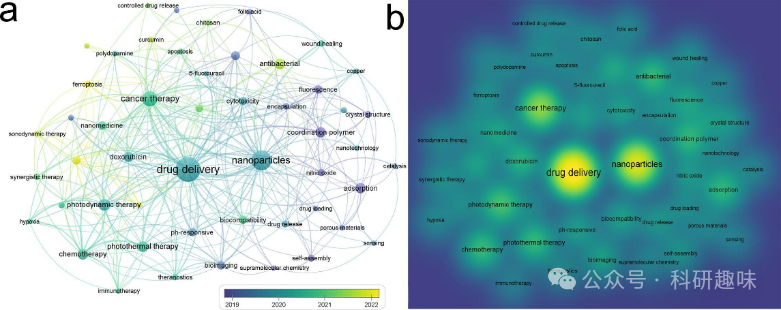
图1. (a) 不同关键词的出现时间，用标签表示关键词的主要集中年份。(b) 不同关键词的密度分析，颜色越亮表示关键词出现的频率越高。

**Synthesis**

金属/有机杂化纳米材料通过金属离子与有机配体的结合形成，展现出丰富的组成和结构形式，例如金属-有机框架（MOFs）、金属配位纳米颗粒以及金属-聚合物纳米颗粒。MOFs的特点在于其金属中心或无机团簇是通过金属-配体协同键连接而成的无限网络。确实，合成MOFs的方法多样，包括水/溶剂热法、电化学法、机械化学法和微波辅助合成等。这些方法在控制MOFs的结构、形状、粒子大小和功能方面表现出高度的灵活性，从而实现了定制属性和多样化应用。每一种方法都有其独特的优点，并能形成具有独特特性的MOFs，适用于各种工业和科学领域。

金属配位纳米颗粒和金属聚合物纳米颗粒是另一种形式的金属/有机杂化纳米材料。这些纳米颗粒通过非共价相互作用（如金属配位键、氢键、宿主-客体相互作用和π-π相互作用）结合在一起，涉及金属离子或团簇与有机配体之间的配位作用。它们经过精心设计，可靶向特定的肿瘤标志物或组织，从而实现肿瘤的精确成像和诊断。此外，它们还应用于靶向药物传递，其中金属配位或金属聚合物纳米颗粒可以装载治疗剂并定向输送到肿瘤部位，从而最大限度地减少全身性副作用。

金属/有机杂化纳米材料相较于传统的无机/有机材料具有显著的优势，在各个应用领域展现出广阔的发展前景：

1.多样性的特性：金属离子嵌入特定配体场中表现出独特的热力学、动力学、化学、物理和结构特性，使其成为多功能的生物医学平台。

2.设计灵活性：大量的金属离子和有机配体提供了灵活的结构设计。通过选择不同的配体或金属离子，可以实现物质组成的适应性。

3.响应性：金属-配体相互作用具有动态性和对外部刺激（例如pH值、温度等）的响应性，使得这些纳米材料能够在形态和功能之间切换，成为功能材料开发的多功能平台。

4.多孔结构和稳定性：金属/有机杂化纳米材料拥有多孔结构、稳定的化学/物理特性和良好的生物相容性，为各种应用提供了坚实的基础。

综上所述，金属/有机杂化纳米材料的独特特性、设计灵活性、对外部刺激的响应性、多孔结构、稳定性和生物相容性使其在生物医学、催化、传感和能量存储等领域具有极高的应用前景。该领域正在进行持续的研究和开发，预计会发现更多的应用，推动纳米材料科学的进步。

**Bioimaging**

金属/有机杂化纳米材料在生物成像技术中的应用，凭借其独特的结构和物理化学特性，已逐渐成为理想的造影剂候选物。这些材料的可调性十分引人注目：首先，配体的变化能够轻松调整其激发和发射特性，这种无机合成特性为制备过程带来了诸多便利；其次，这些材料在血液中展现出相对稳定且快速的分布特性，通过增强渗透性和滞留（EPR）效应，能够精确到达目标组织；最后，它们可以被制备成介孔或中空结构，具备较长的发光寿命，这无疑对生物传感和生物成像具有积极意义，特别是在给药后能够实现高肿瘤背景（T/B）的比较。

在此背景下，作者深入探讨了金属/有机杂化纳米材料的单模式和多模式成像技术。文章重点聚焦于几种常见的成像方法，包括荧光成像（FI）、磁共振成像（MRI）、光声成像（PAI）、计算机断层扫描成像（CTI）以及正电子发射断层扫描成像（PET）。这些技术不仅在生物医学领域具有广泛的应用前景，同时也为药物研发和个性化治疗提供了强有力的工具。

**Fluorescence imaging (FI)**

###  

光学成像技术，特别是基于荧光的成像，由于其高灵敏度、高时空分辨率、非电离辐射以及低成本和便利性，在观察和评估活体生物过程方面具有巨大的价值。其中，650-1700 nm的近红外荧光成像在生物成像中展现出优于可见光的特性。在临床应用中，近红外荧光成像已广泛应用于肝功能评估、炎症性关节炎反应监测、肿瘤成像以及术中肿瘤引导等。值得注意的是，尽管某些金属/有机杂化纳米材料具有利用不同配体将近红外红移至第二区域的能力，并具有改善穿透性、低自发荧光、良好的时空分辨率和高信噪比的优势，但在涉及金属/有机杂化纳米材料时，对于药物在肿瘤内的局部递送和成像确认仍缺乏关注。这为未来的研究提供了新的方向和挑战。
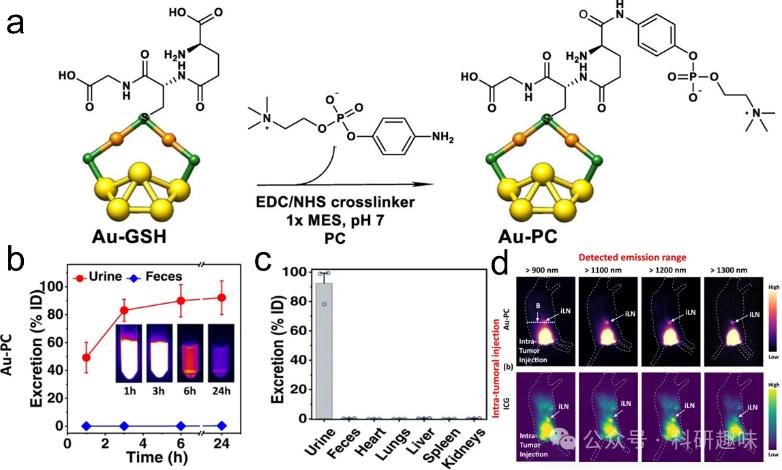
图2. 金属/有机杂化纳米材料用于荧光成像。(a) Au-PC共轭物结构的图示概要。(b和c) Au-PC的快速肾脏排泄和主要器官分布。(d) 淋巴节点的荧光成像。

**Magnetic resonance imaging (MRI)**

磁共振成像（MRI）是医学诊断中常用的非侵入性成像技术之一。它通过强磁场和射频波的组合，能够生成身体内部结构的详细图像。MRI造影剂（CAs）在临床诊断中发挥着重要的作用，它们能够提供生理、病理信息和详细的解剖细节，从而提高诊断的准确性和可靠性。值得注意的是，MRI的对比度与水分子中的氢核的弛豫过程密切相关。这一过程受到纵向弛豫时间（T1）、质子密度和横向弛豫时间（T2）的控制。由于不同组织的质子密度变化相对较小，因此开发的CAs主要通过影响组织的弛豫速率来发挥作用，这些造影剂通常被称为T1和T2造影剂。在金属/有机杂化纳米材料中，含有Gd3+、Mn2+和Fe3+等金属离子的材料已被广泛用作体内生物成像的磁共振造影剂。这些材料具备独特的优势，如高金属含量和自身活性成分，使其在磁共振成像中表现出高效性。
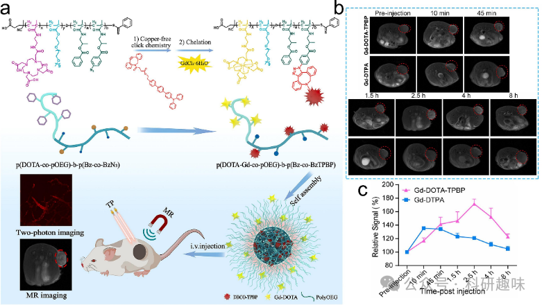
图3. 金属/有机杂化纳米材料用于MRI。(a) Gd-DOTA-TPBP探针的示意图和合成。(b) Gd-DOTA-TPBP的体内MRI。(c) 相对MRI信号增强的半定量分析。

**Photoacoustic imaging (PAI)**

相较于传统的光学成像（OI）和超声成像（USI），光声成像（PAI）在对比度和空间、时间分辨率方面表现出更优越的性能。PAI技术巧妙地结合了光学成像和超声成像的优势，通过组织对脉冲激光光束的吸收产生宽频声波，从而形成瞬时热弹性膨胀并进一步产生超声波。作为一项非侵入性的成像方法，PAI主要依赖于组织中的光吸收系数。由于组织中光吸收分布的变化会直接影响光声信号，因此PAI对组织具有独特的敏感性。考虑到PAI对内源性光吸收的敏感性，内源性造影剂如脂质、黑色素、水和血红蛋白在区分恶性与良性肿瘤以及成像相关微血管网络方面表现出有效性。然而，由于内源性造影剂的光吸收能力较弱，难以满足实际成像需求，因此需要引入外源性造影剂以增强体内成像的深度和对比度。金属/有机杂化纳米材料在这方面展现出巨大的潜力。它们能够结合两种材料的特点，实现靶向成像和特定波长的响应，从而提高成像对比度。
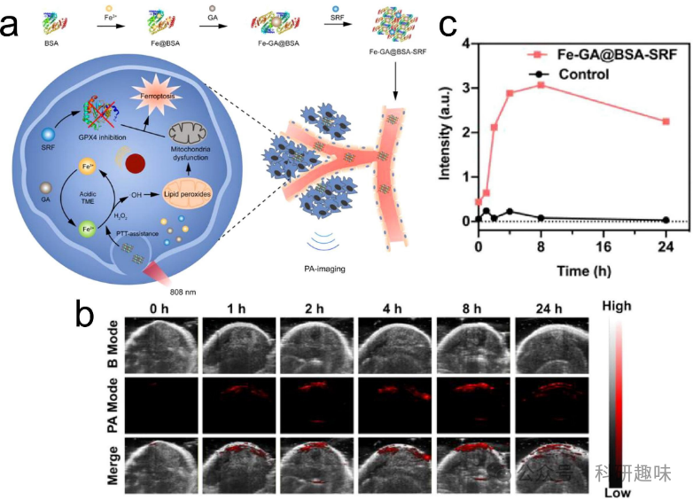
图4. 金属/有机杂化纳米材料用于光声成像（PAI）。(a) Fe-GA@BSA-SRF纳米药物的示意合成。(b) FGB-S纳米医药后肿瘤部位的图像。(c) 肿瘤部位的信号强度。

**Computed tomography imaging (CTI)**

计算机断层扫描成像（CTI）利用X射线衰减的原理，实现对物体内部结构的三维可视化。在CTI中，X射线源发射出一束狭窄的X射线，经过被成像的物体。当X射线经过不同组织或结构时，会发生不同程度的衰减（削弱）。然后，衰减后的X射线被放置在物体对面的探测器阵列检测到。值得一提的是，高电子密度金属（如铋、金等）在CTI中用作高效的造影剂，能够提供目标器官和附属器官之间良好的密度差异。而金属/有机杂化纳米材料则成为一种用于肿瘤CTI的高效三维造影剂的理想选择。
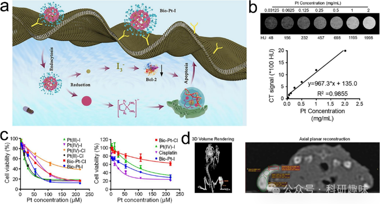
图5. 金属/有机杂化纳米材料用于计算机断层扫描成像（CTI）。(a) Bio-Pt-I的治疗机制示意图。(b) Bio-Pt-I纳米颗粒的CT信号。(c) 细胞毒性分析。(d) 体内三维体积重建和轴向平面重建的CT成像。

**Positron emission tomography (PET)**

正电子发射断层（PET）成像技术利用放射性同位素标记感兴趣的生化调节途径中的分子，以评估代谢过程。这一方法方便快捷，通过成像生化调节途径并评估代谢过程，在肿瘤代谢成像方面具有巨大潜力。PET成像可用于监测肿瘤的转移和复发情况，评估风险。基于金属的PET放射性同位素主要集中在锆-89（89Zr）、镓-68（68Ga）、锆-89（89Zr）和铜-64（64Cu），这些同位素具有独特的物理特性，适用于PET成像。然而，在PET成像中使用的放射性同位素的选择可能会因其他肿瘤代谢差异而有所不同。针对不同类型的肿瘤，选择适当的放射性同位素进行PET成像显得尤为重要。不同肿瘤对同位素的摄取和代谢方式存在差异，这直接影响着PET图像的质量和准确性。因此，在选择放射性同位素时，应充分考虑肿瘤的类型、大小、位置以及与周围组织的对比度等因素。
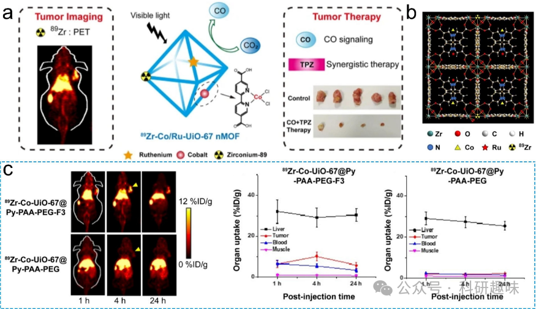
图6. 金属/有机杂化纳米材料用于正电子发射断层显像（PET）成像。(a) 89Zr-Co/Ru-UiO-67 nMOF的图解概述。(b) Co/Ru-UiO-67空间结构的示意图。(c) 典型的PET图像。感兴趣区域（ROI）的分析。

**Multimodality imaging**

考虑到各种成像方法均存在一定的局限性和独特优势，通过金属/有机杂化纳米材料将多种成像方法集成到一个单一平台上，有望为肿瘤部位提供更可靠、准确的成像信息。虽然磁共振成像（MRI）是目前应用最广泛的医学成像技术，但其空间分辨率相对较低。近红外（NIR）成像具有高分辨率和良好的空间可视性，但其应用受到组织透光性较差的限制。计算机断层扫描（CT）存在运动伪影问题，且无法获得动态器官（如心脏）的高分辨率图像。因此，将单一成像方法整合到多模式成像中，以克服各自的不足之处，是一个可行的解决方案。金属/有机杂化纳米材料在这方面具有独特的优势，能够结合两种或多种成像方法，从而更准确地诊断肿瘤。此外，金属有机框架（MOF）也可用于肿瘤诊断和监测的成像目的。通过将荧光染料或造影剂等成像剂纳入MOF结构中，可以实现多模态成像，包括荧光成像（FI）、磁共振成像（MRI）或正电子发射断层显像（PET）。这样不仅可以实现肿瘤的实时可视化，还可以评估治疗反应、追踪药物释放和分布情况。
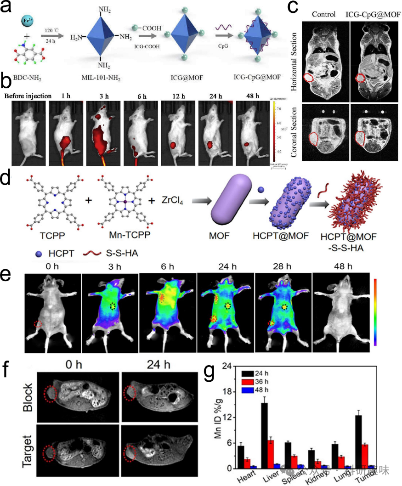
图7. 金属/有机杂化纳米材料用于多模态成像。(a) ICG-CpG@MOF的制备示意图。(b) 肿瘤近红外荧光成像的时间序列。(c) 核磁成像图像。(d) HCPT@MOF-S-S-HA纳米复合材料的合成方案。体内荧光成像（e）和磁共振成像（f）。(g) 锰的生物分布。

**Cancer therapy**

传统的肿瘤治疗方法存在诸多弊端，如副作用大、术后恢复差以及非靶向性等。随着研究的深入，金属纳米颗粒因其独特的光电性能、磁性能和热性能等特点，在肿瘤治疗领域备受关注。这些特性使得金属/有机杂化纳米材料在药物输送和增强药物疗效方面具有巨大潜力，为肿瘤治疗提供了全新的思路。通过利用不同的小分子、聚合物和药物对金属/有机杂化纳米材料进行修饰，可以进一步提高其在癌症治疗中的效率和特异性。特别是当这些材料被设计成能够响应肿瘤微环境（TME）时，它们在治疗肿瘤方面的效果更佳。

**Single cancer therapy**

**Chemotherapy**

自5000年前以来，许多含有金属离子的化合物已被用于各种医疗应用。1965年，Barnett Rosenberg偶然发现了具有抗癌活性的顺铂，它可以与脱氧核糖核酸(DNA)发生共价结合，为金属药物在癌症化疗中的应用奠定了基础。除了顺铂外，其他以铂为基础的金属/有机杂化纳米材料也已用于临床治疗。尽管传统的化疗作为主要的癌症治疗方法存在一些缺点，例如靶向性差和副作用高，但纳米药物的出现为解决这些限制提供了潜力。与大多数化疗小分子药物和其他无机金属材料相比，金属/有机杂化纳米材料具有更高的可调性。例如，钌、铂和金等元素可以与其他化疗药物、功能性小分子、蛋白质、核酸等进行配位形成纳米颗粒。这不仅增强了安全性和功能性，还简化了制备过程，无需进行重复修饰和药物装载。
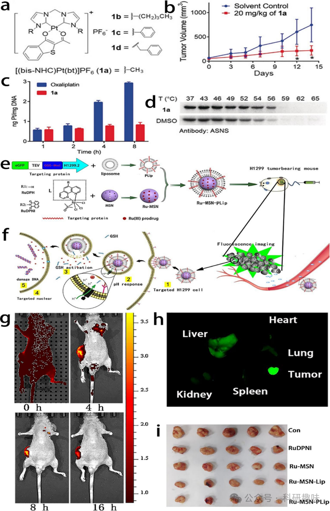
图8. 用于化疗的金属/有机杂化纳米材料。(a) 1a的化学分子结构。(b) 使用1a或溶剂治疗的平均肿瘤体积。(c) 在NCI-H460 (b)细胞实验中，Pt (II) 配合物的内吞作用(10 mm)及其与DNA结合的部分。(d) 使用ASNS抗体进行细胞热稳定性分析的免疫印迹(p &lt; 0.01)。(e) Ru-MSN-PLip和H1299.2靶向肽的合成示意图。(f) Ru-MSN-PLip和Ru (III) 前药的作用机制。(g) 静脉注射Ru-MSN-PLip后，H1299肿瘤小鼠的荧光照片。(h) 荧光强度分析。(i) 肿瘤组织大小(n = 5)。

**Radiotherapy (RT)**

在癌症治疗领域，手术切除、化疗和放射治疗（RT）是三大主要技术手段。其中，大约有一半的患者在疗程中会接受一次或多次放疗。放射治疗利用高能射线的电离辐射效应，产生ROS或利用肿瘤细胞对正常细胞的放射敏感性，导致细胞的DNA、细胞膜和细胞器受损，进而引发肿瘤细胞凋亡和坏死。然而，与化疗一样，放疗也会对周围的正常组织和器官产生影响。尽管正常细胞和肿瘤细胞之间存在放射敏感性上的差异，但这种差异并不足以明确区分。此外，肿瘤环境的复杂性，如缺氧、异常血管和独特力学性质等，进一步限制了放疗的疗效。为了增强放疗的疗效，科研人员提出了几种策略，包括加速分割和超分割放射剂量，以及使用放射治疗增敏剂。添加放射治疗增敏剂可以增加局部剂量积累，从而提高治疗效果。近期研究表明，具有较高原子序数值（Z）的金属元素，如Au、Ba、Bi、Pt、Hf和W，展现出卓越的阻挡辐射能力，从而使肿瘤组织暴露于更高的辐射能量。
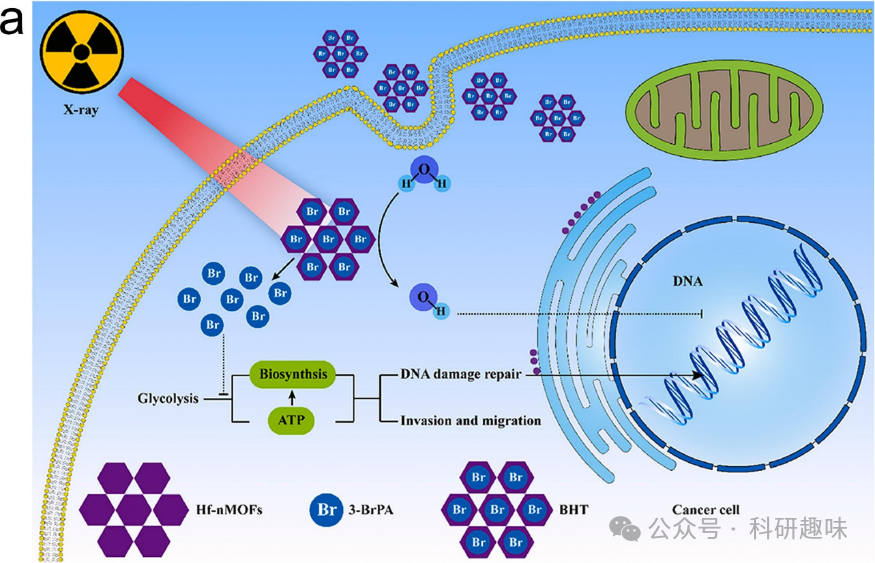
图9. 用于放射治疗的金属/有机杂化纳米材料。(a) 3-BrPA@Hf-nMOFs增强放射治疗的机制。

**Photothermal therapy (PTT)**

光热疗法（PTT）利用光敏剂在近红外光的照射下产生局部高温，从而杀死肿瘤细胞。由于其在非侵入性肿瘤组织消融方面的显著效果，PTT被视为一种极具潜力的癌症治疗方法。在无机光热传导剂（PTA）中，贵金属材料是最常用的，包括钯（Pd）、铂（Pt）、银（Ag）、钌（Ru）和金（Au）。这些材料能够吸收激光中的能量，并通过非辐射衰减的方式将光能高效地转化为热能。
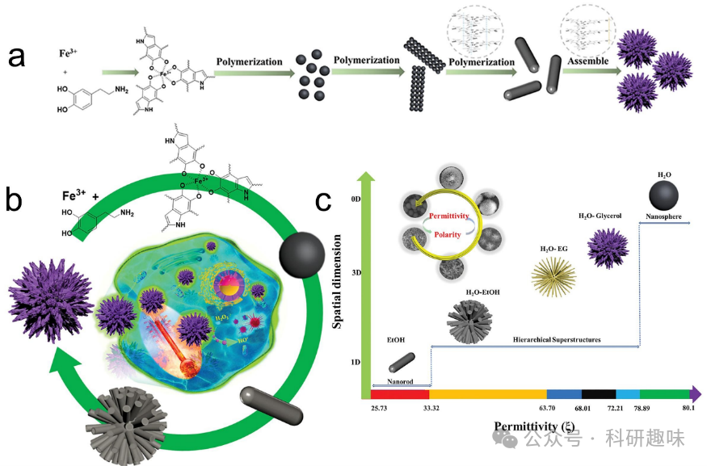
图10. 用于光热疗法的金属/有机杂化纳米材料。(a) 分层超结构制备机制。(b) Fe3+-多巴胺分子组装成可调谐的分层超结构。(c) 通过反应溶液介电性控制聚多巴胺-Fe3+的空间尺度。

**Photodynamic therapy (PDT)**

光动力疗法（PDT）是利用光敏剂在光激发下产生ROS以实现对肿瘤的治疗。值得注意的是，光敏剂本身并不具有毒性，但当其在光和氧分子的共同作用下，会释放出对细胞有害的ROS，包括对蛋白质、核酸、脂质、膜和细胞器造成损伤的自由基，从而诱导细胞凋亡。光敏剂在光的作用下主要通过两种反应类型来发挥作用。一型反应是通过光诱导的电子转移，在光敏剂的三重态和底物之间产生阳离子或阴离子自由基，如自由基.OH和O2。而二型反应则是通过氧化还原反应将分子氧（3O2）转化为高活性的单重态氧（1O2）。尤其值得注意的是，在肿瘤缺氧的条件下，一型反应的光动力疗法效果更为显著。
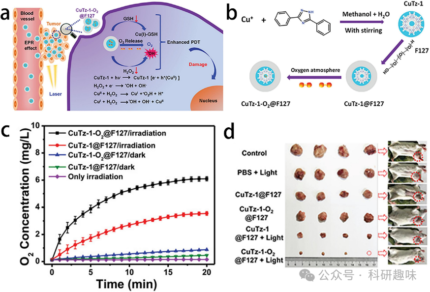
图11. 用于光动力疗法的金属/有机杂化纳米材料。(a) CuTz-1-O2@F127纳米颗粒的示意图。(b) 制备方案的示意图。(c) 氧气产生曲线。(d) 抗肿瘤效果。

**Chemodynamic therapy (CDT)**

化学动力疗法（CDT）作为一种创新的肿瘤特异性治疗方案，利用肿瘤细胞内的催化化学反应诱导细胞破坏，已逐渐受到广泛关注。具体来说，CDT的机制主要依赖于金属离子（如Mn2+、Cu2+、Fe2+、Cr4+和Fe3+等）介导的芬顿或类芬顿反应。这些反应能催化低毒性的H2O2转化为极具细胞毒性的自由基·OH。这一过程显著增强了细胞内的氧化还原电位，成功实现了铁依赖性途径在肿瘤细胞中的应用。值得一提的是，CDT在肿瘤微环境（TME）中具有高度的特异性，这主要归功于高浓度的谷胱甘肽（GSH）和H2O2。与光动力疗法（PDT）相比，CDT对健康组织的副作用极小。尽管CDT具有诸多优势，但其局限之处在于催化效率相对较弱，导致ROS产生有限。因此，在CDT中，提高芬顿反应的催化速率是关键，以便最大化ROS的细胞毒性。此外，根据肿瘤部位的化学特性提供具有高催化活性的金属离子来源，是进一步提高CDT疗效的重要治疗策略。
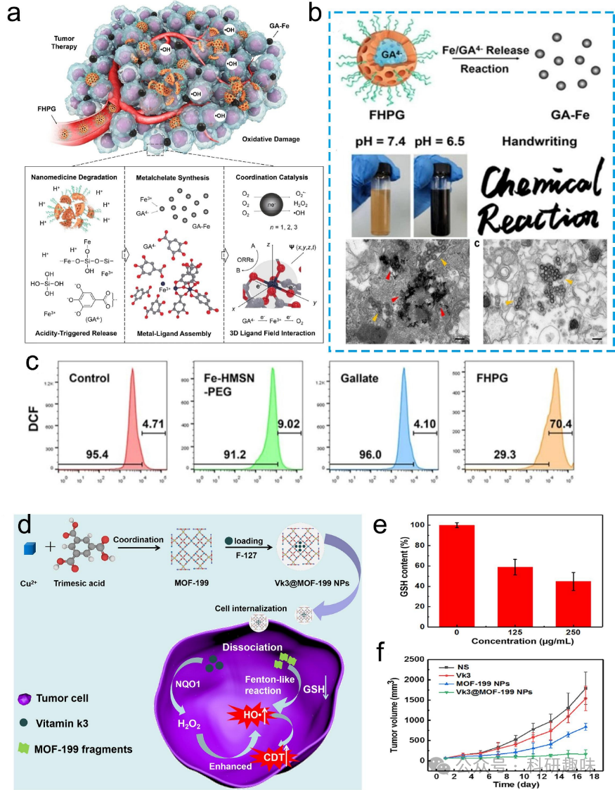
图12. 用于化学动力疗法的金属/有机杂化纳米材料。(a) 化学机制原理示意图。(b) 在酸性条件下，FHPG转化为GA-Fe NPs的演变；不同pH值下FHPG的数码照片和HeLa细胞（右侧）和HUVECs（左侧）的生物-透射电子显微镜图像。比例尺为500纳米。(c) 利用流式细胞仪研究自由基dotOH的产生。(d) Vk3@MOF-199 NPs的合成示意图。(e) 细胞内谷胱甘肽（GSH）含量。(f) 肿瘤体积曲线。

**Starvation therapy**

饥饿疗法利用细胞内的葡萄糖，通过分解和消耗葡萄糖来切断能量供应，进而抑制细胞生长。同时，葡萄糖在分解过程中产生的H2O2还能转化为O2，有效缓解肿瘤缺氧状况，并与光动力疗法（PDT）结合，增强治疗效果。这些优势使得饥饿疗法成为一种极具前景的治疗策略。金属纳米酶具有出色的酶样活性，在催化、生物传感、成像和治疗方面具有巨大潜力。它们被开发为固体肿瘤饥饿疗法中的新型纳米反应器。为了增强治疗效果，设计一个生物催化级联系统变得尤为重要。
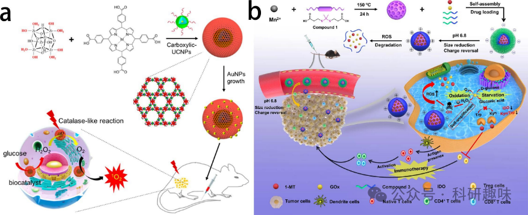
图13. 用于饥饿疗法的金属/有机杂化纳米材料。(a) UMOFs@Au NPs的示意图。(b) PCP-Mn-DTA@GOx@1-MT纳米体系的合成和示意图。

**Immunotherapy**

免疫系统在维护人体正常功能和健康中起到至关重要的作用。在癌症的发展过程中，肿瘤会产生特定的抗原，通常会被免疫系统识别并清除。1891年，美国骨科医生威廉·科利观察到，一些患有红斑性链球菌感染的肉瘤患者在感染后出现了肿瘤缓解或退缩的情况。受此启发，他开发出了“科利混合毒素”，即活体和灭活的链球菌和致病变色杆菌的混合物，并用于治疗肉瘤患者，从而开创了免疫疗法这一领域。免疫疗法旨在增强或调整身体自身的免疫系统，使其能够对抗肿瘤。目前，免疫疗法主要分为以下几大类别：溶瘤病毒、单克隆抗体、疫苗、细胞因子疗法、CAR T细胞疗法和免疫检查点抑制剂。然而，免疫疗法的效果在个体之间存在显著差异，并非所有患者都能从中受益。肿瘤微环境（TME）的特殊性是影响免疫疗法效果的重要因素之一。肿瘤的致密细胞外基质最初阻碍了免疫细胞对肿瘤的浸润。此外，细胞外基质还通过多种途径促使T细胞在TME中失活。因此，如何引发有效的免疫反应仍然是亟待解决的一大挑战。
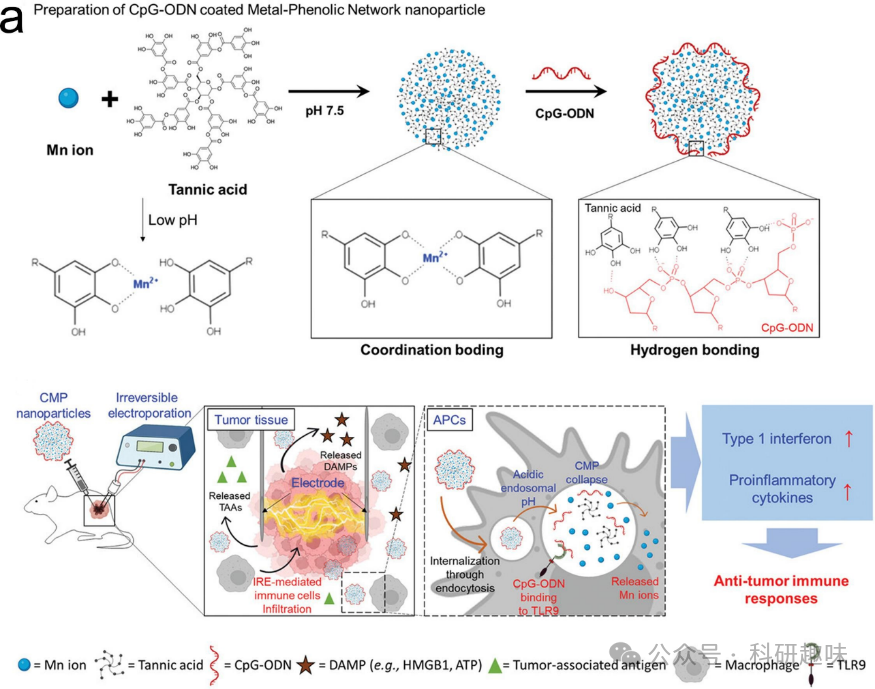
图14. 用于放射治疗的金属/有机杂化纳米材料。(a) 结合CMP纳米颗粒和IRE的癌症免疫疗法的示意图。

**Combination of cancer therapy**

**Combination of chemotherapy and PTT**

单独使用光热疗法（PTT）来消融肿瘤细胞具有一定的挑战性，因为随着组织深度的增加，近红外光的能量逐渐减弱。这是由于光在传播过程中受到组织的吸收和散射作用。然而，PTT产生的热能可以有效地增强细胞代谢和膜通透性，从而促进肿瘤细胞对药物的摄取，进而提高治疗效果。因此，将光热疗法与化疗相结合对于癌症治疗具有重要意义。这种结合方式能够充分发挥两者的优势，弥补单独使用时的局限性，为癌症治疗提供新的方向和策略。大量研究已经证明，与单独使用每种方法相比，将化疗与PTT相结合能够产生协同效应，显著增强治疗效果。
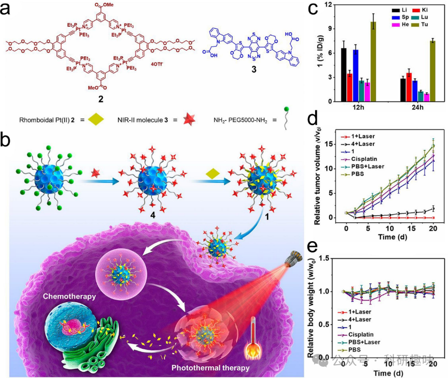
图15. 用于化疗和PTT联合治疗的金属/有机杂化纳米材料。(a) NIR-II 分子染料3和分散的 Pt (II) 金属环2 的结构。(b) 纳米载体1 的示意图。(c) 纳米载体1 的分布情况。(d) 使用不同配方治疗携带肿瘤的小鼠的相对肿瘤体积。(e) 对应的相对体重。

**Combination of chemotherapy and PDT/CDT**

在光动力疗法（PDT）中，高水平生成的ROS可以对细胞生物分子，如脂质、蛋白质和DNA，造成氧化损伤，进而增强化疗药物的抗肿瘤活性优势。因此，将化疗与PDT相结合是一种具有潜力的治疗方法。然而，由缺氧引起的肿瘤抗药性仍是PDT和化疗所面临的主要挑战。肿瘤缺氧主要是由于异常的肿瘤血管生成和癌细胞异常增殖所导致。PDT在光激发的光敏剂下产生细胞毒性的1O2，会消耗肿瘤中的氧气，导致缺氧显著限制PDT的效果。此外，缺氧环境下会激活缺氧诱导因子α（HIF-1α），进而提高P-糖蛋白（P-gp）的表达水平。P-gp作为一个外排泵，能将药物从细胞内转运至细胞外，导致由缺氧引起的肿瘤抗药性。因此，如何缓解肿瘤缺氧是提高PDT结合化疗疗效的关键所在。
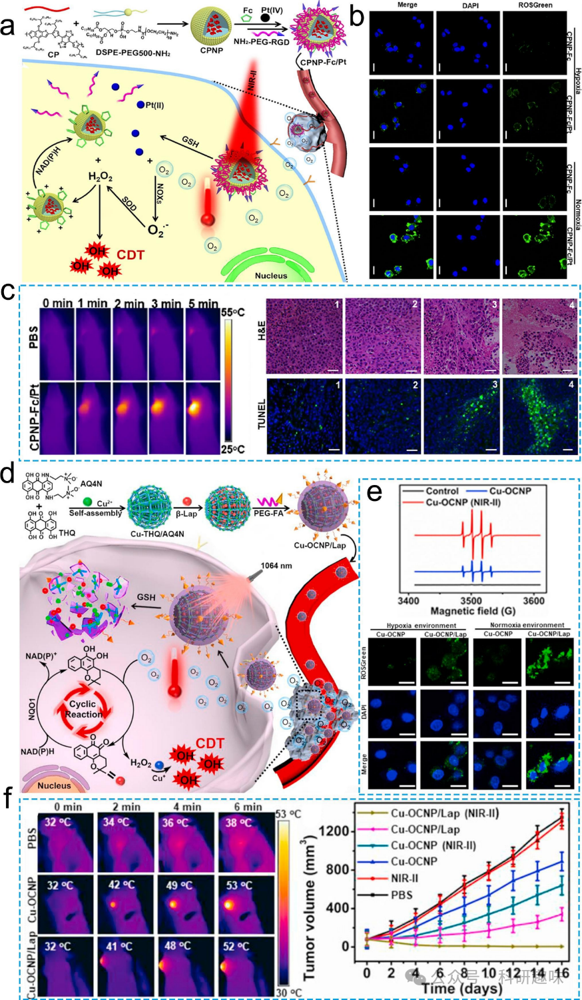
图17。金属/有机杂化纳米材料用于CDT和PTT的结合。（a）CPNP-Fc/Pt的示意图解。（b）细胞的CLSM图像。（比例尺：40 μm）。（c）CPNP-Fc/Pt和PBS注射的光热图像。（d）Cu-OCNP/Lap合成的示意图解。（e）细胞的EPR光谱和CLSM图像。（比例尺：25 μm）。（f）光热图像和肿瘤体积。f（右侧）的数据错误条表示均值±标准偏差（n = 5）。

**Combination of CDT and PDT**

基于铁、锰和铜等价金属离子的纳米平台在化学动力疗法（CDT）的设计中具有显著优势，它们展现出良好的生物安全性和治疗效率。CDT正是利用肿瘤微环境中高过氧化物水平和弱酸性的特性来进行靶向治疗。这一特性使得CDT仅在特定的肿瘤细胞中起效，从而在正常组织中产生较低的副作用。另一方面，与光动力疗法（PDT）不同，CDT在穿透肿瘤组织时，由于没有外部能量输入，能阻止能量迅速衰减。CDT中的Fenton试剂可以在特定肿瘤微环境中持续生成自由基·OH，破坏细胞内的氧化还原平衡，并调节ROS水平。这使得PDT中的1O2在激光照射下加剧肿瘤细胞的氧化损伤。
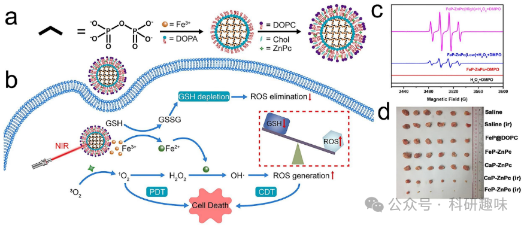
图 18.结合 CDT 和 PDT 的金属/有机杂化纳米材料。(a) FeP-ZnPc 的构建方法。(b) FeP-ZnPc 增强了 ROS 介导的 PDT 和 CDT 治疗机制。(c) EPR 光谱监测产生的 OH。(d) 小鼠肿瘤照片。

**Combination of CDT and starvation therapy**

近年来，化学动力疗法（CDT）因其独特性而备受关注，这一疗法独立于局部的O2生成和ROS，为癌症治疗提供了新的方向，有望替代传统的治疗方法。然而，肿瘤细胞中有限的H2O2含量和低效的催化剂限制了CDT在特定模式下的应用。为了解决这些问题，饥饿疗法成为了一个有效的手段。在饥饿治疗过程中，葡萄糖和氧气的消耗导致肿瘤生长受到抑制。与正常组织相比，葡萄糖浓度的变化更容易影响肿瘤细胞的代谢活动。天然酶葡萄糖氧化酶（GOx）可以将D-葡萄糖高效转化为葡萄糖酸，同时将氧气转化为H2O2，从而消耗肿瘤细胞所需的资源。基于这些发现，科研人员开发了一种具有Fenton活性和GOx传递能力的治疗系统。通过触发癌细胞中的铁基酶/Fenton级联反应，这一治疗系统显著增强了CDT的治疗效果。这一突破性的研究为癌症治疗提供了新的策略，并有望为患者带来更好的治疗结果。
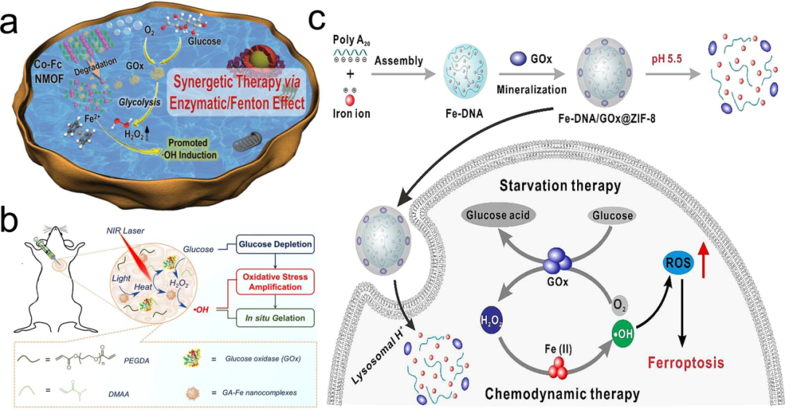
图 19.结合 CDT 和饥饿疗法的金属/有机杂化纳米材料。(a) Co-Fc@GOx 的示意图。(b) 复合物结构示意图和机理图。(c) 用于增强 CDT 的 Fe-DNA/GOx@ZIF-8 方案。

**Combination of PTT and PDT**

光热疗法（PTT）和光动力疗法（PDT）通常被视为两种不同的光疗手段。PTT主要通过近红外辐射对肿瘤进行热疗，而PDT则是利用光敏剂产生ROS来破坏肿瘤。由于治疗过程中组织的氧消耗，PDT的疗效往往会随着治疗的进行而降低，因此更适合作为早期治疗手段。相比之下，PTT的热效应会随着治疗时间的延长而累积，因此在治疗后期表现出更好的疗效。

将PTT与PDT结合使用，不仅可以覆盖肿瘤治疗的整个过程，还能通过ROS和热疗的协同作用，获得更强大的抗肿瘤效果。这种联合疗法已成为一个值得推荐的治疗选择。在光敏剂的典型过程中，它吸收光能后达到单重激发态（S1），然后经过系统交叉过程转变为三重激发态（T1）。随后，通过电子转移或能量转移过程产生ROS。高的系统交叉（ISC）效率可以显著增强ROS的产生。然而，如何在光热和光动力之间取得平衡是一个关键问题。如果大部分能量被转化为热量，导致强烈的光热效应，那么ISC效率将会降低，从而减少ROS的产生。
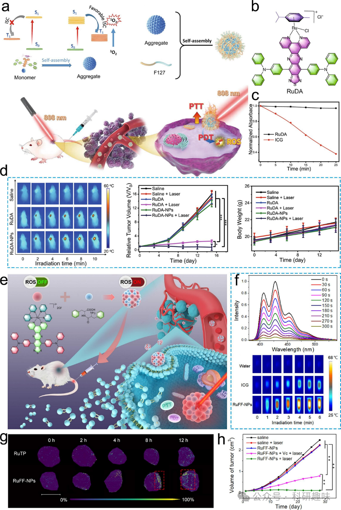
图 20.用于 PTT 和 PDT 组合的金属/有机杂化纳米材料。(a) RuDA 用于近红外激活 PDT 和 PTT 的示意图。(b) RuDA 的化学结构。(c) 激光照射下随时间变化的吸光度值。(d) 红外热图像以及相对肿瘤体积和体重曲线。(e) 用于 PTT/PDT 的 RuFF-NPs 示意图。(f) ABDA 随时间变化的荧光光谱。(g) 肿瘤组织中具有代表性的 MALDI 图像（条 = 5 毫米）。(h) 平均肿瘤生长体积曲线。

**Combination of RT and immunotherapy**

放射治疗是常用的局部治疗方法，常用于控制肿瘤生长。然而，近年来的研究揭示了其触发全身性免疫反应的潜力。这一观点可以追溯到Dr. RH Mole于1953年提出的“异位效应”概念，描述了局部放射治疗如何导致其他部位的肿瘤退缩。这一现象现在被认为与放射治疗触发的免疫反应紧密相关。这一发现为放射治疗与免疫治疗的结合提供了坚实的理论基础。电离辐射作为放射治疗的主要媒介，能够诱导产生dAMPs，进而引发肿瘤细胞的免疫细胞死亡。这一过程促进了抗原呈递和巨噬细胞对肿瘤源性抗原的摄取。放射治疗与免疫治疗的联合策略已广泛应用于多种癌症的治疗，并取得了充满希望的结果。
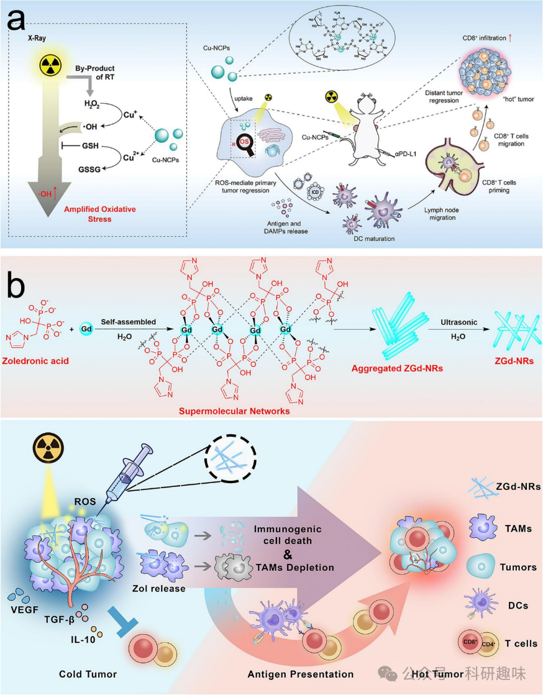
图 21.结合 RT 和免疫疗法的金属/有机杂化纳米材料。(a) Cu-NCPs 增强放射治疗的 ICD 诱导和 T 细胞浸润。(b) ZGd-NRs 制备示意图和 ZGd-NR 敏化辐射诱导 ICD 和 TAM 耗竭以协同增强抗肿瘤免疫的机制。

然而，仍存在几个挑战需要克服：

1.放射治疗诱发的免疫反应与剂量密切相关，因此需要仔细确定适当的放疗剂量，以引发充分的免疫反应，并优化放射治疗和免疫治疗的治疗顺序。

2.在各种可用的免疫治疗方法中，选择最有效的方法仍是一个具有争议的话题。

3.增强全身性免疫反应至关重要。

4.尽管免疫治疗在某些患者中显示出效果，但克服抵抗力和扩大反应患者的数量仍是一大挑战。5.肿瘤微环境的复杂性和患者肿瘤特征的差异突显了更个体化和个别化治疗方案的需求。

**cancer theranostics**

在治疗过程中，仅具有疗效的纳米颗粒在准确追踪肿瘤大小和位置方面存在局限性。然而，一些多功能金属/有机杂化纳米材料则能同时实现诊断与治疗，兼具成像与治疗效果。这些金属/有机杂化纳米材料因其独特的光学、磁性、热性、催化性和电性能，以及良好的可调性，引起了研究人员的广泛关注。它们不仅可作为癌症诊断的探针，还具备治疗效果和/或作为载体，用于传递抗癌药物进行定向治疗。以下作者总结了近年来在癌症治疗和诊断中应用的金属/有机杂化纳米材料（如表1所示）。
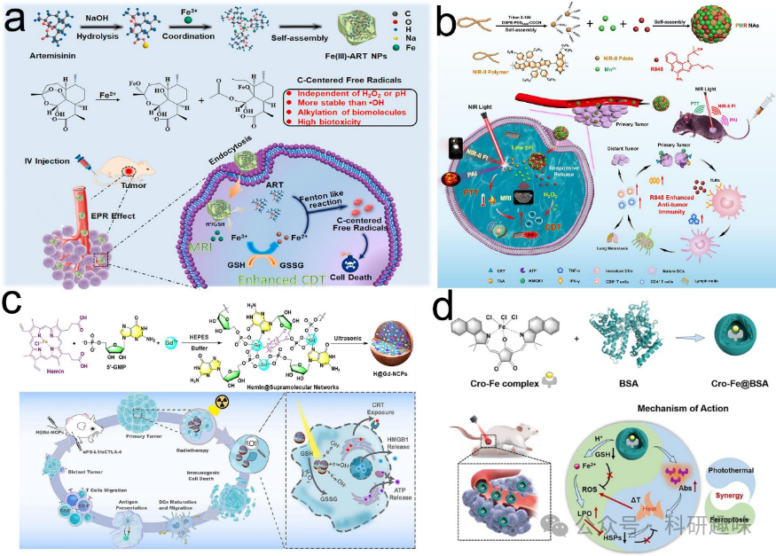
图 22.用于癌症治疗的金属/有机杂化纳米材料。(a) Fe (III)-ART NPs 的示意图和机理。(b) PMR NAs 的示意图。(c) H@Gd-NCPs 的示意图和机理。(d) Cro-Fe@BSA 的制备和机理。

**Conclusions and outlooks**

金属/有机杂化纳米材料在多个领域展现出巨大的潜力，尤其在生物医学领域，它们在药物传递、肿瘤诊断和治疗方面展现出显著的优势。这些材料凭借其独特的磁性、表面等离子体共振（SPR）和放射性等特性，实现了磁共振成像（MRI）、计算机断层扫描（CTI）和正电子发射断层扫描（PET）等多种成像方式。

除了成像能力，金属/有机杂化纳米材料在药物装载、表面物理化学和光学特性方面也具有显著优势，为肿瘤治疗提供了更多的设计思路。例如，受顺铂在临床上的成功启发，研究人员成功研发了多种金属配合物作为基于金属的抗癌药物，如钌、铁等金属配合物。基于这些配合物的催化特性和光学特性，研究人员还开发了光动力治疗（PDT）、光热治疗（PTT）等多种治疗方法。多模态成像和联合治疗比单一的成像或治疗方法更具优势，能够提供更强的功能和疗效，展示出巨大的临床应用前景。然而，金属/有机杂化纳米材料在临床实践中的应用仍面临一些关键挑战。

首先，生物安全性是首要考虑的因素。为了便于临床应用，需要深入了解金属/有机杂化纳米材料在不同组织中的生物分布、积累、转化和代谢途径，以及可能产生的急性或慢性毒性。研究表明，纳米粒子的尺寸和表面修饰对人体的毒性有显著影响，适当的尺寸和表面修饰可以有效降低金属复合纳米粒子的毒性。

稳定性是另一个关键因素，特别是在复杂的血液循环中。金属/有机杂化纳米材料必须具有良好的稳定性，以确保在分解后仍能在肿瘤部位发挥治疗效果。表面修饰不仅可以赋予材料优秀的生物相容性和降解性，还直接影响其在体内的稳定性、血液半衰期、肿瘤靶向能力以及器官分布。

靶向效率是另一个重要的考量因素。尽管EPR效应被视为纳米材料进入肿瘤的主要机制，但在大型动物或人类中，这一效应的有效性仍存在争议。因此，开发能够高效靶向肿瘤的金属/有机杂化纳米材料是当前研究的重点。利用肿瘤细胞膜上的受体过度表达的特点，通过特异性主动靶向治疗肿瘤是一种有前景的方法。此外，结合治疗或针对肿瘤区域的特定应答可能实现更低剂量、更好的效果以及对正常组织毒性的降低。

随着技术的进步，设计集诊断与治疗于一体的“一站式”平台成为可能。这种平台可以利用一些金属的成像功能，同时实现诊断和治疗的功能。然而，要达到最佳的治疗效果，需要平衡金属/有机杂化纳米材料在肿瘤成像和治疗之间的浓度。高浓度的金属/有机杂化纳米材料可能在成像方面表现更好，但对肿瘤的治疗可能会产生更严重的副作用。因此，开发能够针对特定组织或器官发挥治疗效果的纳米复合材料是未来的研究方向。

此外，多金属有机配体纳米复合材料的发展也值得关注。目前的研究主要集中在单金属有机配体纳米材料上，而多金属有机配体纳米材料可以提供更多的反应位点，使功能更加多样化。它们还可以调整金属中心的组合和配位环境，增强对特定目标的识别和调控能力。多个金属中心和配体结构之间的协同效应也是一大优势，通过调整金属中心和配体的组合，多金属有机配体可以同时具有治疗、磁共振和放射性等多种性质，从而实现多模态成像和协同治疗的综合应用。

人工智能技术在材料设计中的应用也是未来的一个重要发展方向。通过结合低级特征学习和预测复杂数据的能力，人工智能可以帮助研究人员快速筛选和预测多金属有机配体复合纳米材料的性能。这种技术可以大大加速新材料的开发进程，提高效率和成功率。

癌症发病率不断上升，而传统治疗方法存在不足。纳米医药学的快速发展为癌症的诊断和治疗提供了新的解决方案。金属/有机杂化纳米材料由于其独特的性质和易于修饰的特点，已成为抗癌治疗的药物候选物之一。随着研究的不断深入和技术的发展，相信未来会有更多高效、安全且具有创新性的金属/有机杂化纳米材料应用于癌症的诊断和治疗中。

Ye, Z.; Bao, Y.; Chen, Z.; Ye, H.; Feng, Z.; Li, Y.; Zeng, Y.; Pan, Z.; Ouyang, D.; Zhang, K.; Liu, X.; He, Y. Recent Advances in the Metal/Organic Hybrid Nanomaterials for Cancer Theranostics. *Coordination Chemistry Reviews* **2024**, *504*, 215654. https://doi.org/10.1016/j.ccr.2023.215654.

**关注并回复文章DOI获取全文：**

10.1016/j.ccr.2023.215654

**点击蓝字 关注我们**

预览时标签不可点

素材来源官方媒体/网络新闻

 [阅读原文](javascript:;) 

  继续滑动看下一个 

 轻触阅读原文 

   

