 

#  【Coord. Chem. Rev.】可再生AIE材料：从光物理机制到生物医学应用 
 

Grenemal

读完需要

34

全文字数 11100 字

**一、简介**

光作为生命的起源和社会发展的推动力，与人类社会的进步紧密相连。随着科技的进步，光学材料在显示、照明、医疗等领域的需求日益增长，对其性能要求也不断提升。

传统荧光材料的研究多集中在单分子态的发光特性上。然而，当这些荧光材料制成薄膜或纳米颗粒后，荧光分子会发生聚集，导致其光物理性质不尽如人意，常常出现聚集导致荧光猝灭（ACQ）的问题。这主要是由于大多数传统荧光分子具有平面共轭结构，在聚集状态下易于发生π-π堆积，导致激发态能量损失严重，从而影响了其发光性能。为解决这一问题，研究者们尝试采用物理或化学方法来改善分子的传统发光性能。

2001年，唐本忠院士及其团队提出了聚集诱导发光（AIE）的概念，其机制在于分子内运动的限制（RIM）。AIE发光材料因其独特的光学特性，在光电器件、检测、生物成像和生物治疗等领域展现出了广阔的应用前景。

尽管AIE分子通常通过有机合成获得，但这种方法存在原料不可再生、合成工艺繁琐以及产物分离困难等缺点。近年来，研究人员发现某些可再生资源材料也具有AIE特性。与传统合成的AIE分子相比，这些可再生资源AIE分子具有更高的生物相容性、绿色可再生性以及更低的成本，因此在实际应用中更具竞争力。

在生物医学领域，利用可再生资源向新兴能源利用技术转型显得尤为重要。然而，由于大多数生物医学应用是在水溶液中进行的，可再生资源的水溶性差成为了限制其应用的主要缺点。因此，本文旨在综述天然可再生资源材料的AIE发光特性及其在生物医学领域的应用，为相关研究和应用提供有价值的参考。

天然AIE材料种类繁多，其中包括众多来自大自然的小分子（图1和表1）。在异喹啉生物碱可再生资源产品中，研发团队发现了小型的AIE分子，例如盐酸小檗碱(BBR)、巴马汀(PA)、血根碱(San)和白屈菜红碱(Che)。类黄酮中则包括了槲皮素(QC)、杨梅素、山奈酚(Kae)、芒果苷以及表没食子儿茶素没食子酸酯(EGCG)。此外，香豆素中的5-MOS和6-MOS，维生素中的核黄素(Rf，即维生素B2)，二萜中的丹参酮IIA，以及其他植物化学物质如纤维素和海藻酸钠，也都是天然的AIE材料。这些天然产物的存在无疑为研发团队提供了丰富的选择，引起了人们对天然产物的广泛关注。

大自然是一个充满绿色、可持续材料的宝库。本文对AIE材料的相关研究进行了系统的总结，并基于可再生资源的水溶性问题，对天然水溶性AIE材料进行了深入的探讨和展望。研发团队期望通过这篇文章，能够引导更多的研究者关注并挖掘天然产物的潜力，为未来的科学研究和技术应用开辟新的道路。

Table 1. Small molecule of AIE behavior from natural products.

| Name | λex (nm) | λem (nm) | Fluorescent color | Structure |
| --- | --- | --- | --- | --- |
| Alkaloids |  |  |  |  |
| Berberine | 405 | 530 | Green | 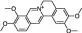 |
| Palmatine | 365 | 545 | Green | 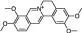 |
| Chelerythrine | 320/330 | 450/580 | Red | 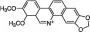 |
| Sanguinarine | 320/330 | 450/580 | Red | 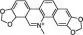 |
|  |  |  |  |  |
| Flavonoids |  |  |  |  |
| Quercetin | 370 | 410/565 | Blue, Green | 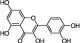 |
| Myricetin | 380 | 430/530 | Blue Green | 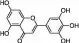 |
| Mangiferin | 280 | 420/545 | Green | 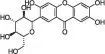 |
| Kaempferol | 370 | 425 | Blue |  |
| Epigallocatechin |  |  | Blue, Green, Red | 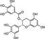 |
| Gallate (EGCG) | 280–400 | 350–500 |  |  |
|  |  |  |  |  |
| Coumarins |  |  |  |  |
| 5-MOS | 360 | 470 | Green | 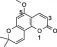 |
| 6-MOS | 360 | 470 | Green | 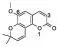 |
|  |  |  |  |  |
| Vitamin |  |  |  |  |
| Vitamin B2 | 405 | 530 | Green | 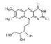 |
|  |  |  |  |  |
| Diterpenes |  |  |  |  |
| Tanshinone IIA | 453 | 583 | Red | 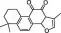 |

**二. 天然产物AIE性能研究**

天然植物产品涵盖了小分子和大分子，其中主要类别包括生物碱、黄酮类、维生素、纤维素以及木质素。这些植物化学物质直接源自植物，其获取相对容易，并且在成本上具有一定的竞争力。

**2.1.生物碱**

大多数生物碱都拥有复杂的含氮环结构，并展现出显著的抗菌和光学活性。近年来，众多研究团队发现某些生物碱具有AIE特性，例如从黄连中提取的盐酸小檗碱、从植物Fibraurea reisa Pierre的茎和根中提取的巴马汀，以及从白屈菜中提取的血根碱和白屈菜红碱。这些生物碱在生物成像和生物治疗领域具有潜在的应用价值。

**盐酸小檗碱**

盐酸小檗碱是一种从中草药中分离得到的AIE分子，其在固态时展现出强烈的荧光，并且具有良好的水溶性。实验研究表明，盐酸小檗碱的AIE现象源于分子内振动限制（RIV）和扭曲分子内电荷转移（TICT）现象。BBR是一种从中药黄连中分离出来的季铵生物碱（如图2A所示）。BBR在良溶剂水中表现出良好的溶解性，随着不良溶剂THF的比例从0增加到99%，其亮绿色荧光强度逐渐增强（如图2B和图2C所示）。动态光散射（DLS）结果表明，在添加THF后形成的聚集体粒径约为100nm（如图2D所示）。

为了更深入地了解BBR的AIE特性，研究团队测量了其发射寿命。结果表明，BBR的粉末寿命（4.86ns）和晶体寿命（7.93ns）远高于溶液状态（0.68ns），这与其AIE特性相吻合。与化学结构中具有旋转体的典型AIE分子不同，BBR在单一水溶剂中几乎无法记录到光致发光(PL)信号，这归因于分子内运动(RIM)的限制。然而，随着THF不良溶剂的增加，聚集体的形成限制了分子内振动。这些结果均证实了BBR固有的AIE特性。
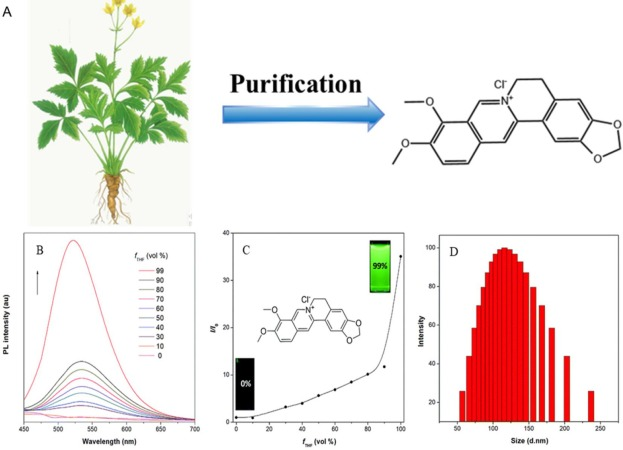
图2. (A) BBR制备示意图 (B) BBR氯化物在不同水/THF混合物中的PL光谱。(C) I/I 0 值与水含量的关系图。(D) BBR 氯化物的 DLS 结果 (f THF = 90 %)。

为了深入探究BBR内在的AIE机制，研究团队对其在不同极性溶剂中的光物理行为进行了详细分析，并发现了扭曲分子内电荷转移（TICT）效应的存在。如图3A和图3B所示，随着BBR溶剂极性的增加，荧光强度显着降低，同时峰位置发生红移。这一现象充分说明了TICT在BBR中的重要作用。此外，通过观察HOMO轨道和LUMO轨道的电子云分布，研发团队发现π-π\* 跃迁具有一定的电荷转移特性（如图3C所示），这一发现为BBR的AIE行为提供了进一步的补充和解释。
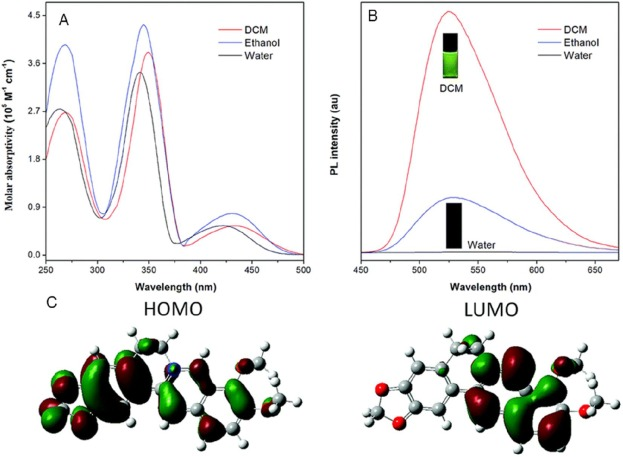
图 3. (A) BBR 氯化物在 H2O、乙醇和 DCM 溶剂中的紫外-可见光谱。(B) BBR 氯化物在 H 2 O、乙醇和 DCM 溶剂中的荧光光谱。(C) BBR 氯化物的 HOMO 和 LUMO 能级。

**巴马汀**

随着全球对绿色可持续发展技术的追求，绿色化学已成为推动这一进程的关键方法。在中国，中草药研究源远流长，众多水溶性良好的天然草药资源丰富，为绿色化学提供了宝贵的素材。巴马汀（PA）便是从Fibraurea Reisa Pierre植物的茎和根中提取的一种重要生物碱。

如图4A所示，PA的吸收强度在不同极性溶剂中基本保持稳定。然而，在较稀的PA水溶液中，其发射几乎无法观测，但随着THF含量的增加（从0%至90%），发射强度显著增强。与此同时，随着溶剂极性的提升，最大吸收峰出现了轻微的蓝移，变化幅度仅有几纳米。图4B和C清晰地展示了随着THF含量从0%增加至90%，PA的荧光强度显著增强。此外，有研究表明葫芦[7]脲（CB7）能够有效限制PA的分子运动，进一步证实了PA的AIE机制与分子内运动限制（RIM）有关。

如图4D所示，与PA粉末状态相比，溶液状态的PA寿命明显缩短。动态光散射（DLS）结果则表明，形成的聚集体尺寸约为200nm（图4E），这为PA的AIE特性提供了有力证据。为了更深入地理解PA的AIE行为，研发团队分析了其HOMO和LUMO能级，发现PA中季铵离子中的苯环位点处于弯曲状态。在PA分子间振动受限的情况下，苯环和季盐离子趋于共平面状态。此外，能带隙差为3.18eV，表明PA分子作为AIE分子能够更有效地促进发射。
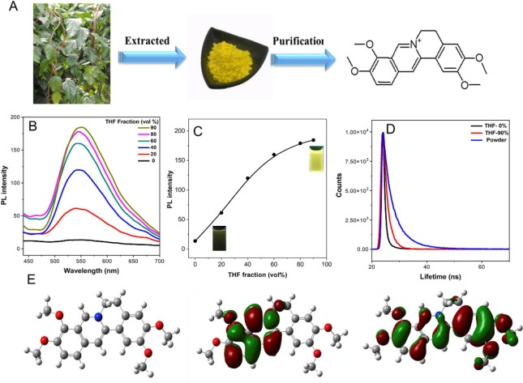
图 4. (A) 从 Fibraurea Reisa Pierre 中提取的巴马汀的示意图。(B)不同比例的巴马汀THF的荧光光谱。(C) 巴马汀的荧光强度散点图。(D) 巴马汀的寿命。(E) 巴马汀的 LUMO 和 HOMO 分子轨道。

**血根碱**

血根碱（San）主要分布于白屈菜全草、堇菜的块根、波洛灰全草以及血水草的地上部分（图5A）。对于San而言，甲醇是一种良溶剂，而水则被视为不良溶剂。如图5B所示，当纯甲醇中逐渐添加水时，观察到吸收强度显著增加，并在278 nm和330 nm处形成两个明显的吸收峰。此外，随着水含量的增加，出现了显著的聚集诱导发光（AIE）现象。

图5C进一步揭示了随着水含量的增加，荧光发射（PL）强度明显增强的趋势。这表明，在不良溶剂如水的诱导下，San形成了聚集体，从而展现了San的AIE行为。为了从更深层次上验证San的AIE行为，研发团队基于密度泛函理论（DFT）原理对其骨架进行了优化分析。结果显示，San的共轭平面结构是其AIE行为的基础。图5D展示了通过计算得到的HOMO能量为-8.61 eV，LUMO能量为-5.79 eV，以及带隙差为2.82 eV。这些数值均进一步支持了San具有AIE行为的结论。
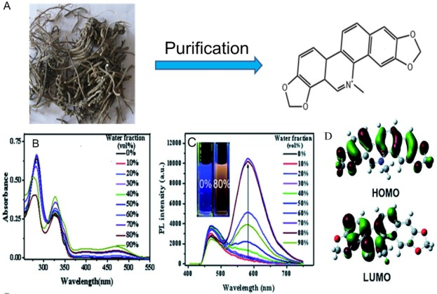
图5.(A)血根碱AIEgen的制备。(B) 血根碱的紫外-可见吸收光谱。(C) 血根碱在不同比例的水不良溶剂中的PL光谱。(D) 血根碱HOMO能级和LUMO能级的电子分布。

**白屈菜红碱**

白屈菜红碱（Chelerythrine，简称Che）主要源自芸香科白屈菜的根部与叶血，以及罂粟科白屈菜的全草（图6A）。令人瞩目的是，在CH3OH/H2O混合溶剂中观察到了Che的聚集诱导发光（AIE）行为。随着不良溶剂水含量的增加，Che在320nm处的吸收峰逐渐变窄，同时在338nm处形成了一个新的肩峰（图6B）。随着含水量从30%增加到90%，Che在570nm处的荧光发射强度不断增强，至90%时达到最大值（图6C）。这一现象归因于随着水的不良溶剂效应增强，Che分子间形成聚集体，进而限制了分子内运动（RIM）并促进了J-聚集，这些都是AIE行为的关键驱动力。

此外，对Che的HOMO和LUMO能级分析显示，电子云主要分布在共轭平面结构的骨架中。特别值得注意的是，HOMO能级为-9.08 eV，LUMO能级为-6.03 eV，带隙差为3.05 eV。而且，LUMO主要分布在异喹啉部分（图6D）。这些结果都强有力地证实了Che的AIE行为，并为研发团队深入理解其发光机制提供了重要线索。
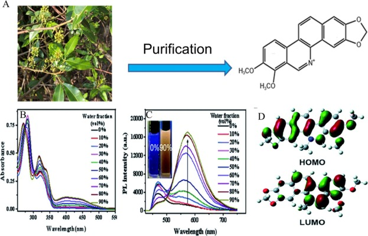
图 6. (A) 白屈菜红碱 AIEgens 的制备 (B) 白屈菜红碱的紫外-可见吸收光谱。(C) 不同比例水中白屈菜红碱的 PL 光谱。(D)白屈菜红碱HOMO能级和LUMO能级的电子分布。

**2.2.黄酮类化合物**

**槲皮素**

槲皮素（QC）是一种广泛分布于多种植物茎皮、花、叶、芽、种子和果实中的化合物，常常以苷类形式存在，如芦丁、金丝桃素等。特别值得一提的是，荞麦、沙棘、山楂和洋葱的茎叶中槲皮素的含量相对较高。

QC通常是从芦丁中提取得到的（如图7A所示），当QC溶解于其良溶剂四氢呋喃（THF）中时，可以观察到烯醇和酮两种形式的发射。随着不良溶剂水比例的增加，QC的酮型荧光强度逐渐增强，而烯醇型的发射则相应减弱。这种酮型的发射行为可归因于QC的聚集诱导发光（AIE）性能（如图7B和图7C所示）。然而，当水的比例达到90%时，荧光强度减弱，这可能是由于QC从溶液中沉淀到底部，从而降低了其实际浓度。

此外，随着纯THF溶液中QC浓度的增加，其荧光强度也显著增强。这是因为在高浓度溶液中，更容易形成具有AIE荧光特性的聚集体（如图7D和图7E所示）。
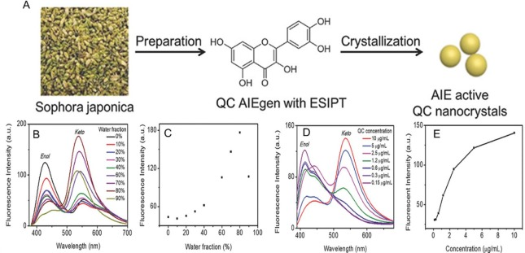
图7. (A)采用ESIPT机制制备槲皮素(QC)AIEgen纳米晶的示意图。(B) QC 在四氢呋喃和水的混合物中的荧光光谱 (λ ex = 365 nm)。(C) 四氢呋喃和水混合物中 QC 在 535 nm 处的荧光光谱 (λ ex = 365 nm)。(D) 不同浓度 QC 在四氢呋喃中的荧光光谱 (λ ex = 365 nm)。(E) 不同浓度的 QC 在四氢呋喃中的荧光光谱，发射峰在 535 nm（λ ex = 365 nm）。

**杨梅素**

杨梅素，一种黄酮醇化合物，经由中国保健茶和藤茶的纯化过程得到（图8A），具有显著的生物活性，能够强效抑制多种酶类，包括酵母α-葡萄糖苷酶、葡萄糖苷酶I、体外葡萄糖苷酶I以及牛奶中的黄嘌呤氧化酶。在杨梅素的存在下，儿茶酚在氧气环境中可氧化为苯醌类化合物，这一现象导致杨梅素的荧光光谱发生红移，同时荧光强度得到增强。

在杨梅素的良溶剂THF中，可以观察到两个明显的荧光发射峰，分别位于420 nm和530 nm，分别对应着烯醇和酮的主链发射。其中，酮的发射强度显著弱于烯醇。随着溶剂中水含量的逐渐增加（从0%至80%），酮基团的发射强度逐渐增强，而烯醇基团的发射强度也呈现增强的趋势（图8B和C）。

通过透射电子显微镜（TEM）的观察，研发团队发现了杨梅素在THF/水溶液中的形态变化。当水的比例达到80%时，杨梅素形成了尺寸约为205 nm的聚集体（图8D）。此外，杨梅素的激发态分子内质子转移（ESIPT）过程也得以详细阐述。该过程从烯醇基态（E）开始，吸收3.69 eV的能量后跃迁至第一激发态（E），随后发生HOMO-LUMO跃迁。在T态下，质子从-OH转变为C=O。最终，释放出2.43 eV的能量，T态转变为T态，即酮的发射态。同时，还释放出3.48 eV的能量，对应于E-E的跃迁（图8E）。在这一过程中，LUMO-HOMO跃迁导致C=O附近的苯基上电子分布增多，进一步促进了ESIPT过程的进行。
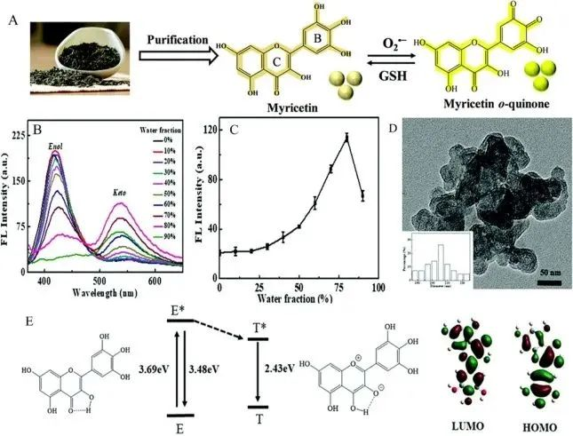
图8 保健茶中杨梅素提取示意图 (A) 不同含水量四氢呋喃中杨梅素的荧光光谱 (B) 不同含水量四氢呋喃中杨梅素的荧光强度(530 nm) (C) 杨梅素THF 中的晶体 (D) THF/水 (20/80, v/v) TEM 图像 (E) 基于 B3LYP/6-31G\* 水平计算的杨梅素 ESIPT 过程。LUMO 和 HOMO 分子轨道处于烯醇形式的基态。

**山奈酚**

近年来，具有聚集诱导发光（AIE）特性的天然产物因其出色的生物相容性在材料科学领域受到了广泛关注。山奈酚（Kaempferol），一种主要来源于生姜科植物山奈（Kaempferia galanga L.）根茎的天然产物，广泛分布于各种水果和蔬菜中（如图9A所示）。在四氢呋喃（THF）溶液中，山奈酚表现出良好的溶解性。然而，令人惊讶的是，由于分子内的快速旋转导致的非辐射跃迁过程，山奈酚在THF溶液中的荧光强度几乎完全猝灭。

如图9B和C所示，在稀释的THF溶液中，山奈酚几乎不发出荧光。然而，随着不良溶剂水的逐渐加入，山奈酚的荧光强度显著增强。当不良溶剂水的比例增加至50%时，荧光强度变化不大；但当水的比例进一步增加至60%时，荧光强度明显增加。这一现象表明，水的加入促进了山奈酚分子的聚集，从而增强了其荧光发射。

动态光散射（DLS）实验结果显示，山奈酚聚集体的平均直径约为178纳米（如图9D所示），这进一步证实了聚集体的形成。聚集体的形成限制了芳基的自由旋转，从而减少了非辐射跃迁过程的发生，增强了荧光发射，这就是山奈酚在聚集状态下表现出AIE效应的机制。
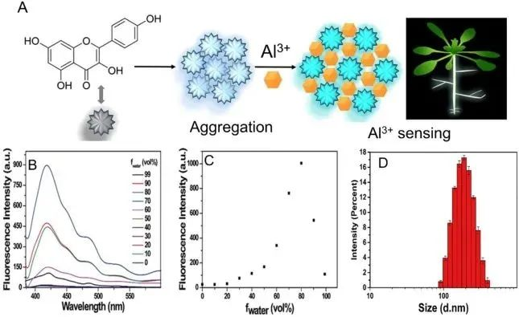
图9. (A) 山奈酚AIE分子及其资源的示意图。(B) 不同水份中山奈酚的荧光光谱。(C) 山奈酚的荧光散点图。(D)山奈酚聚集体的粒径。

**芒果苷**

芒果苷，一种优质的水溶性呫吨酮化合物，是从芒果叶中提取并经过结晶处理的（图10A）。随着THF添加比例的增加，研发团队可以观察到其光谱行为的变化。当THF比例增加到30%时，285nm处出现了一个明显的尖锐吸收峰。随着THF比例进一步增加到90%，这一吸收峰的强度显著增强。然而，当THF比例达到99%时，整个吸收峰发生了红移，并伴随着肩峰的出现。这些现象可能与基态芒果苷分子间的相互作用和/或J-聚集体的形成有关。

在荧光光谱（图10C和D）方面，值得注意的是，存在一个较大的斯托克斯位移（165nm）。随着THF不良溶剂的加入，荧光强度明显增强，随后出现了蓝移（24nm）。DLS和SEM的结果均显示，在THF不良溶剂中形成了聚集体。随着THF比例的增加，水合直径显著增加到3750nm，进一步证实了THF溶剂中聚集体的形成（图10E和F）。TEM的结果与DLS一致，揭示了芒果苷在H2O/THF(10/90，v/v)溶液中形成的聚集体的晶距为0.23nm（图10G）。因此，芒果苷发射强度的增强可以归因于聚集体的形成，这证明了芒果苷是一种活性AIE分子。为了更好地理解芒果苷的AIE特性，研发团队基于TD-DFT（B3LYP/6–31 G\*，H2O溶液）进行了计算，得到了HOMO和LUMO的分子水平信息。在基态下，电子云主要分布在芒果苷HOMO和LUMO单体和二聚体的共轭主链中（图10H和I）。当处于二聚体状态时，电子可以在LUMO的两个单体中分布，这进一步证实了芒果苷在基态下的分子间相互作用。此外，芒果苷二聚体的结构可以限制分子内运动（RIM）并增加刚性构象，从而阻断非辐射弛豫并增强聚集态的荧光强度。
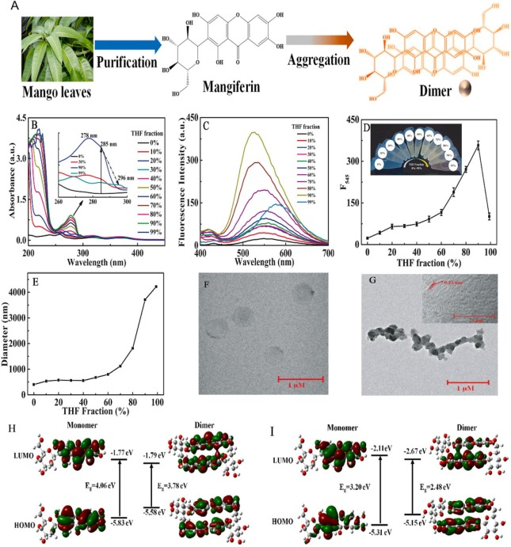
图 10. (A) 芒果苷 AIEgens 的制备。(B) 不同THF 组分中芒果苷(vol%) 的UV-Vis 吸收光谱 (C) 不同THF 组分中芒果苷的FL 光谱。(D) 不同THF组分中芒果苷的散点图。(E) 不同THF组分中芒果苷的粒径。(F) H 2 O 中 TEM（透射电镜）芒果苷粒径。(G) H 2 O/THF (10 /90，v/v）。基于TD-DFT优化结构（B3LYP/6-31G\*能级，H 2 O溶液）计算了芒果苷的基态（H）和激发态（I）。

**EGCG**

EGCG是绿茶中富含的生物活性成分，具备良好的溶解性和较低的毒性。由于其丰富的存在、优异的生物相容性、生物可降解性以及出色的化学和物理性质，EGCG已被广泛研究并应用于构建生物和功能材料。Juyoung Yoon团队在一次偶然中发现了“绿茶渍”的荧光行为，并随后揭示了其AIE现象（如图11A和B所示）。
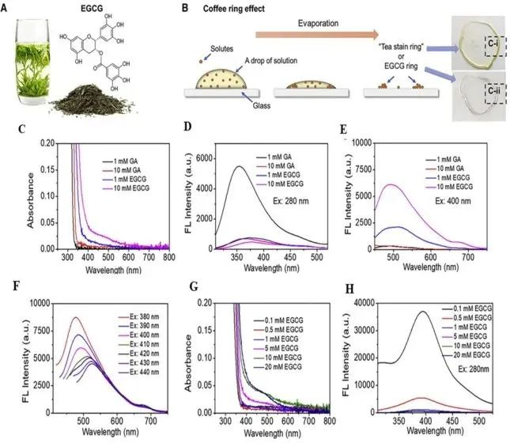
图 11. (A) 绿茶提取物的主要成分 EGCG 的结构。(B)咖啡环效应在蒸发过程中形成溶质的聚集，最终在玻璃上形成“茶环”或“EGCG环”。(C) GA 和 EGCC 的紫外可见吸收。(D) 水中 EGCG 和 GA 的 FL 光谱。(E) EGCG 和 GA 的 FL 光谱。(F) EGCG 的激发依赖性。(G) 不同浓度 EGCG 的紫外可见吸收。(H)不同浓度EGCG的荧光光谱。

GA、EGC、EGCG的结构优化及其二聚体的吸收和发射光谱如图12A和B所示。GA呈现出平面结构，其二聚体通过苯环间的分子间相互作用形成。为了深入理解这些化合物的光谱特性，研发团队进一步计算了GA、EGCG以及EGCG二聚体的吸收和发射光谱。基于密度泛函理论（DFT）的计算结果与1 mM浓度下的紫外可见吸收实验数据相吻合。从计算结果（图12C）中可以观察到，EGCG的吸收峰位于280 nm，而发射峰则位于600 nm。此外，通过分析EGCG二聚体的自然跃迁轨道（NTO）在给电子跃迁中的表现，进一步证实了EGCG的聚集诱导发光（AIE）行为。这些计算结果不仅提供了关于这些化合物光谱性质的深入理解，而且为EGCG在材料科学和生物学领域的应用提供了有价值的参考。
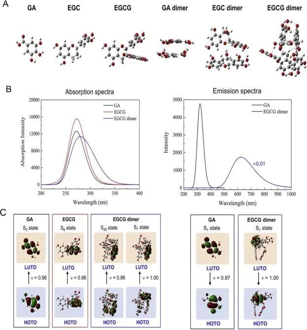
图12 (A) GA、EGC、EGCG及其二聚体的优化结构 (B) 计算了GA、EGCG和EGCG二聚体的吸收和发射光谱以及给电子跃迁的自然跃迁轨道(NTO)。

**2.3.香豆素**

T. asiatica 是一种广泛分布于南亚和东非的天然植物。在365 nm紫外光照射下，干燥的黄连根可发出明亮的蓝色荧光（如图13A所示）。观察新植株根部在紫外灯下的荧光形态，同样呈现出荧光特性。从图13B和C中可看出，5-MOS在DMSO溶剂的溶液中展现出强烈的发射，最大发射波长位于473 nm，而6-MOS分子的荧光发射相对较弱，其最大发射波长位于428 nm。

为了深入探究这两种香豆素在聚集状态下的发光特性，研发团队测量了它们在不同混合溶液中的荧光光谱。对于5-MOS，随着不良溶剂水比例的增加，发射波长发生红移，并且荧光强度逐渐减弱。当不良溶剂水的比例高达99%时，荧光几乎完全消失。这种现象与ACQ（聚集导致猝灭）行为极为相似。与5-MOS不同，6-MOS在不良溶剂水比例增加时，其荧光强度显著增强，展现出明显的AIE（聚集诱导发光）行为。
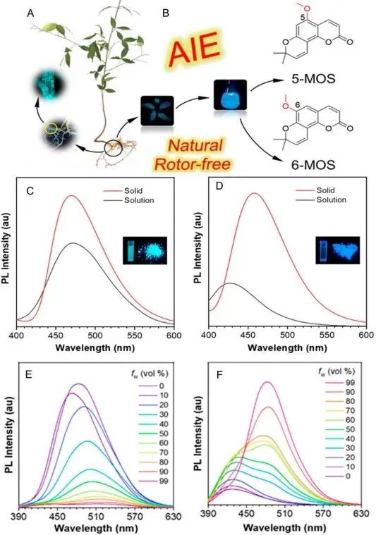
图 13. 香豆素 (A) 新鲜植物和根在 365 nm 紫外光和共聚焦显微镜下的荧光行为。(B)5-MOS和6-MOS的制备过程及结构。5-MOS (C) 和 6-MOS (D) 在溶液 (DMSO) 和粉末中的荧光光谱。(E) 5-MOS 和 6-MOS (F) 在不同比例的 DMSO/水混合物中的 AIE 曲线。

为了更好地揭示AIE现象背后的机制，研发团队深入分析了单晶的相关信息。对于5-MOS，它呈现出平面构象，其中分子内的C-H···O相互作用距离分别为2.52 Å和2.53 Å。从5-MOS的能量面激发态扭转情况来看，最低能量的平面构象在热力学上是稳定的（如图14A所示）。相较于5-MOS，6-MOS中的C-H…O分子内相互作用较弱，这使得6位甲氧基的移动更为自由（如图14B所示）。

在5-MOS的晶体结构中，分子规则地排列成层状平面结构，这些层之间具有反平行位移，层间距为3.41 Å，而分子间的距离分别为2.56 Å和2.85 Å（如图14C所示）。正是这种平面的构象和刚性的结构，与5-MOS在溶液状态下所展现出的强烈发射行为紧密相关。而在6-MOS的晶体中，可以清晰地观察到成对反向平行移位的二聚体，这些二聚体之间的平面间距为3.35 Å。每个二聚体在空间上交错排列，并最终组装成三维堆叠结构（如图14D所示）。C-H··O相互作用的多个分子间距离从2.49 Å到2.99 Å，这些距离有效地限制了分子内的振动，从而使得6-MOS在固态下的发射比在溶液中更为强烈。
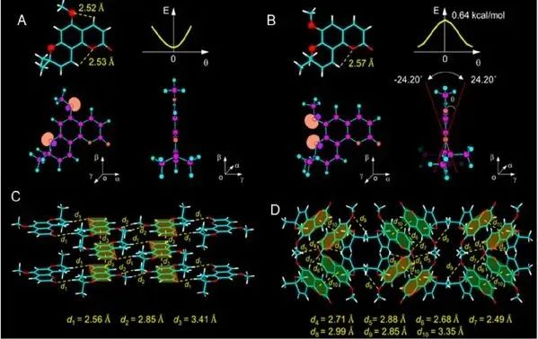
图14.标记氧原子自然键轨道的优化构象，以及5-MOS（A）和6-MOS（B）的激发态扭转势能面。5-MOS（C）和6-MOS（D）的单晶堆叠结构和分子间。

**2.4.维他命**

维生素是人和动物维持正常生理功能不可或缺的一类微量有机物质，它们虽不直接参与人体细胞的形成，也不提供能量，但在生长、代谢和发育过程中扮演着至关重要的角色。因此，必须通过饮食摄入足够的维生素以维持身体的正常运作。

核黄素，也被称为维生素B2，是一种新型且具有活性的AIE生物分子，在自然界中广泛存在。它主要作为黄素腺嘌呤二核苷酸（FAD）和黄素单核苷酸（FMN）的辅因子发挥作用。核黄素可轻易地从多种自然资源中获取，包括蔬菜（如图15A所示）、大豆、牛奶、鸡蛋以及动物产品等。

图15B揭示了核黄素的光学特性：在375 nm处的吸收峰对应于从第一激发态(S1)到第二激发态(S2)的跃迁，即n-π 跃迁。而450 nm处的吸收峰则归因于电子从基态（S0）到第一激发态（S1）的π-π 跃迁。此外，图15C和D展示了核黄素在不同溶剂中的行为：随着THF不良溶剂的比例增加，核黄素形成了聚集体，导致其荧光强度显著增强。当THF = 90%时，核黄素的荧光寿命为1.45 ns，明显高于THF = 0%时的0.54 ns，这一变化进一步证实了核黄素的AIE行为。
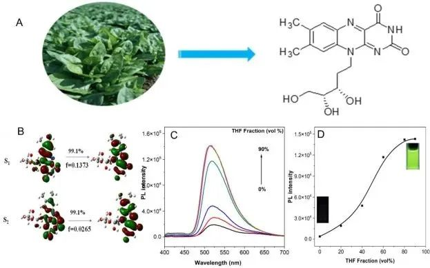
图 15. (A) 从菠菜中提取的 Rf。(B) 基于TD-DFT原理计算的第一电子激发态(S 1 )和第二电子激发态(S 2 ) (C) THF谱中不同部分的Rf。λ ex = 365 nm。(D) 具有不同 THF 分数的 Rf (10 μg/mL) 的 PL 光谱的荧光散射。

**2.5.二萜类**

丹参酮 IIA 是一种从丹参的干燥根和根茎中提取的化合物（如图 16A 所示）。为了研究其聚集诱导发光（AIE）行为，研发团队采用了光致发光（PL）光谱技术。当向丹参酮 IIA 中加入不良溶剂水时，研发团队观察到其荧光强度显著增强。当水含量为80%时，其荧光发射强度是原始强度的28倍。

此外，从图16B和C中可以明显看出，丹参酮IIA在固态下的发光峰位于616nm，且其量子产率为3%。图17D进一步揭示了丹参酮IIA的分子构型特点，其相对共面的分子结构有助于实现良好的分子内电子离域。其中，HOMO轨道主要离域在甲基、呋喃和苯环部分，而LUMO轨道则主要分布在二羰基区域。基于上述观察，研发团队可以推断丹参酮IIA的RIM（Restricted Intramolecular Motion）机制与其C-H·O相互作用密切相关。这些研究结果表明，丹参酮IIA是一种典型的红光发射型AIEgen（聚集诱导发光分子）。
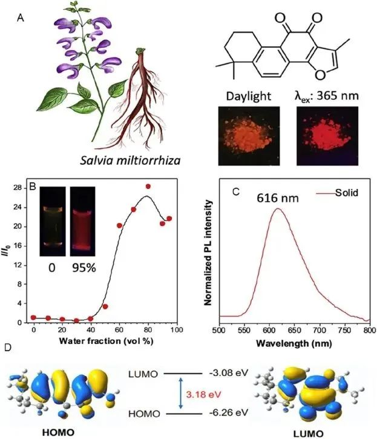
图 16. (A) 从丹参中提取丹参酮 IIA 的路线。(B) 丹参酮IIA的最大发射峰与相对发射强度(I/I 0 )之间的线性关系。(C) 丹参酮 IIA 固态的 PL 光谱。(D) 基于丹参酮 IIA 的 HOMO 和 LUMO 能级的 B3LYP/6–31 + G(d) 的计算。

**2.6 多糖**

**纤维素**

纤维素，作为一种由葡萄糖构成的大分子多糖，是植物界中最丰富的生物质材料。传统发光体多依赖于显著的共轭系统，然而，近期研究发现，某些发光体展现出基于亚基的非共轭结构，这种非传统发光现象被归因于簇发光（CL）机制。陈等人深入研究了非共轭羧甲基化纳米纤维素（C-CNC）的光物理性质，并发现C-CNC在固态下能发出明亮的蓝光。在C-CNC的聚集状态下，分子的羟基紧密排列，增强了分子内和分子间的空间相互作用，形成了扩展的电子离域，这正是AIE性能，也即CL机制的表现。

**海藻酸钠**

海藻酸钠（SA），是从褐藻海带或马尾藻L-古洛糖酸（G）中提取的天然多糖，因其稳定性、溶解性、粘度以及安全性，被广泛应用于药物制剂辅料。如图17A和图17B所示，海藻酸钠展现出浓度依赖的荧光增强性能，且其粉末存在激发依赖性行为（如图17C所示）。图17D为SA分子的结构及其化学发光机理的示意图。在SA分子中，氧原子之间彼此接近，当这些氧原子间的距离小于范德华半径时，便能产生有效的电子相互作用，进而形成离域延伸。这种SA体系的扩展使得体系中的有效共轭长度得以增长。除此之外，除了构象刚性和体系内的氢键相互作用，SA分子内氧原子之间较小的距离使得它们易于接触，从而有利于发光。同时，聚合物链之间的缠结和分散相互作用能形成簇生色团，这减少了SA的非辐射跃迁过程，进一步增强了SA分子的发射。
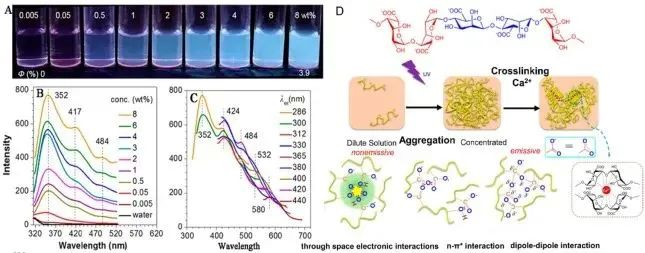
图 17. (A) 在 365 nm 紫外光下拍摄的荧光照片。(B) 不同浓度SA的PL光谱。(C) 不同λ ex 的PL光谱海藻酸钠的聚类诱导发光示意图。(D) SA 分子从孤立状态到聚集状态以及簇内可能的分子内和分子间相互作用的示意图。

**三. 应用**

**3.1.生物成像**

荧光成像技术因其在提供活细胞和体外组织详细信息方面的独特优势，已成为研究多种生物现象的重要工具，相较于磁共振成像、超声等其他成像方法，其应用价值日益凸显。鉴于AIE材料的水溶性特性，它们在免洗生物成像领域展现出了巨大的应用潜力。

在探索BBR生物成像的应用中（如图18A-D所示），研发团队发现当HeLa细胞与BBR共同孵育时，BBR能够有效进入细胞内的脂滴（LD）。随后，通过油酸处理HeLa细胞，可以诱导细胞产生丰富的中性脂质。值得注意的是，这些LDs具有选择性地被BBR染色的能力。为了验证BBR对LDs染色的特异性，研发团队采用了MeOTTMN商业染料进行共染色实验，结果显示两者之间的重叠度良好（皮尔逊相关系数：0.89）。

此外，研发团队还发现PA能够进入HeLa细胞的细胞核，并在核区产生绿色荧光（如图18E-F所示），这表明PA能够被HeLa细胞摄取并进入细胞内。由于PA是一种天然的AIE材料，因此，它在生物成像领域的应用前景广阔。更重要的是，作为一种天然产物，PA具有良好的生物相容性，可作为潜在的生物标记染料。
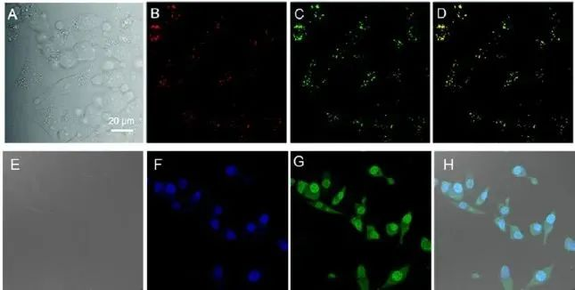
图 18. HeLa 细胞与 BBR 一起孵育的共焦荧光图像 (A) 明场 (B) HeLa 细胞用 MeOTTMN (2 mM) 染色 (C) 用 BBR (10 mM) 染色 30 分钟。(D) 合并图像。

芒果苷的靶向性能如图19A所示，其能够透过简单的扩散作用和载体介导的方式进入细胞内部。经过3小时的孵育后，观察到SW480、Hela、SKOV-3、MCF-7细胞中出现了明显的红色荧光信号，同时线粒体结构清晰可见。相比之下，在正常细胞系NCM460、H8、IOSE80、MCF-10A中几乎未检测到荧光信号，这表明芒果苷具有针对肿瘤细胞的特异性。

为了进一步研究芒果苷在体内的分布情况，研发团队通过尾静脉将芒果苷注射到荷瘤的MCF-7小鼠体内，并监测了不同时间点的荧光信号变化（如图19B所示）。结果显示，注射后60分钟即可在肿瘤组织中观察到荧光信号的出现。随着时间的推移，荧光信号逐渐增强，并在120分钟时达到峰值，随后保持稳定至300分钟。此外，在荷瘤小鼠和正常裸鼠的胃、小肠、大肠等器官中也检测到了较弱的荧光信号，这可能是由于芒果苷的代谢过程所致。
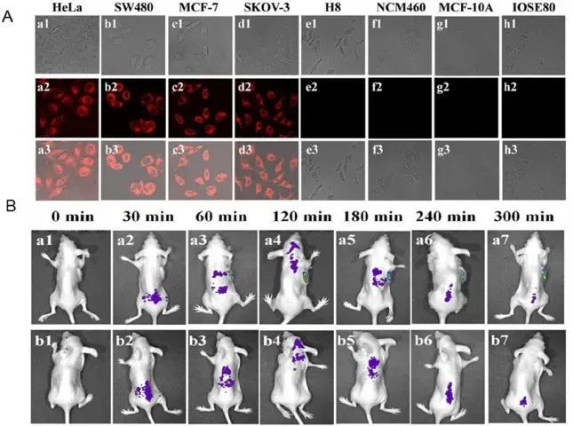
图 19. (A) 不同细胞与芒果苷孵育 3 小时的荧光图像。(B) 静脉注射芒果苷后荷瘤小鼠的体内荧光成像。

对生物膜形成以及与生物膜传染病相关的其他细菌类型进行深入研究。实验结果显示，当细菌与10 mM的丹参酮IIA共同孵育后，细菌密集区域展现出了强烈的红色荧光信号（如图20所示）。具体来说，对于粪肠球菌，经过两天的培养，在密集的菌斑中可以观察到明显的红色荧光发射。类似地，在大肠杆菌聚集的地方也观察到了较弱的红色荧光发射。然而，对于枯草芽孢杆菌，由于其细菌聚集现象不明显，因此几乎没有观察到丹参酮IIA的标记。这些结果表明，这两种细菌的自聚集和生物膜形成过程较为缓慢，导致细菌生长较为松散，没有形成坚固的生物膜基质。

值得注意的是，丹参酮IIA作为一种具有AIE活性的分子，并未触发RIMS（受限分子内运动）现象，因此在添加丹参酮IIA后并未观察到明显的红色荧光发射。通过丹参酮IIA对细菌进行染色，研发团队可以发现生物膜作为细胞质基质外的聚合物粘液，能够摄取丹参酮IIA纳米颗粒，从而在共焦成像中观察到红色荧光发射。这一现象为研发团队提供了一种新的方法来研究和观察细菌生物膜的形成和结构。
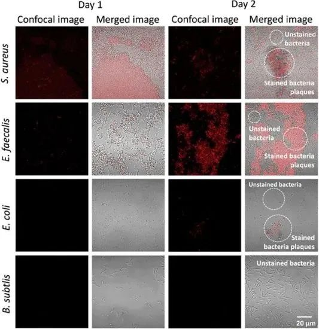
图 20. 用丹参酮 IIA 处理 60 分钟、1 天和 2 天的细菌的共焦图像。

**3.2.生物传感器**

鉴于BBR氯化物与CB7能够形成稳定的主客体复合物，BBR氯化物得以高效进入CB7的疏水空腔。这一过程不仅有效限制了BBR氯化物的分子内振动，还在孔道内构建了非极性微环境，从而显著增强了荧光发射。如图21A所示，随着BBR溶液中CB7浓度的逐步增加，BBR氯化物的荧光强度呈现出明显的增强趋势，这充分表明BBR氯化物具有作为生物传感器的潜力，能够高灵敏度地检测CB7的浓度变化。

同样地，BBR氯化物还能够通过静电相互作用与DNA紧密结合，从而抑制分子内振动，并显著增强荧光发射（如图21B所示）。这些特性共同表明，BBR氯化物可以作为一种高效、灵敏的生物传感器，用于检测CB7和DNA的浓度和存在状态。
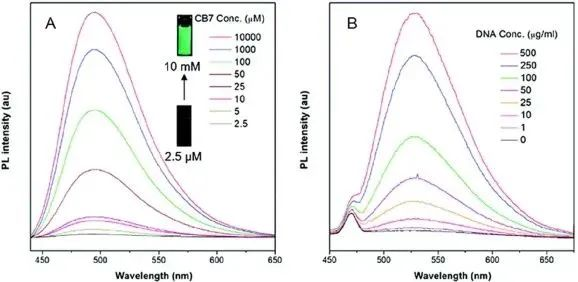
图 21. 含有不同浓度 (A) CB7 的 BBR 荧光光谱。(B) 不同浓度的牛胸腺 DNA 水溶液。

铝离子（Al3+）是人体不可或缺的营养成分，同时也是人体内含量最为丰富的金属离子。它在人体细胞代谢及酶催化过程中扮演着至关重要的角色。随着Al3+浓度的增加，370nm处的吸收强度逐渐减弱，而425nm处则出现新的吸收峰并逐渐增强。这一变化表明，Kae（可能是某种化学物质或生物分子）能够与Al3+发生配位作用，形成Kae-Al3+配合物。

通过（图22A-B）的实验数据可知，Kae与Al3+的结合比例为3:1。为了进一步研究Kae聚集体的传感特性，研发团队观察了在不同Al3+浓度下，其荧光发射强度的变化。如图22C所示，随着Al3+的逐渐加入，421nm处的发射强度逐渐减弱，而486nm处的发射强度则逐渐增强。此外，研发团队还发现，在0~70μM的浓度范围内，I486/I421的荧光强度比与Al3+浓度之间存在线性关系（图22D）。这一发现表明，Kae的探针（prob）能够定量检测Al3+的浓度。
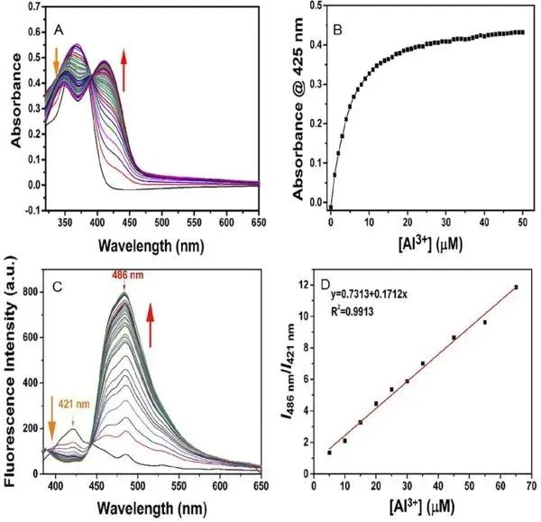
图 22. (A) 在不同浓度的 Al 3+ 后 Kae (30 µM) 在 H 2 O/THF (8:2, v/v) 中的紫外-可见光。(B) 425 nm 处的吸收强度与 Al 3+ 浓度的函数关系。(C) Kae 在 H 2 O/THF (8:2，v/v) 中具有不同浓度 (0–200 µM) Al 3+ 的荧光光谱。(D) 最大荧光强度比值与 Al 3+ 浓度的函数关系图。

大多数San和Che分子以季铵盐的形态存在，它们在酸性环境中以离子形式存在，而在碱性环境中则以非离子形式存在，这两种形态之间保持着动态平衡。为了深入探究San和Che的pH敏感特性，研发团队研究了它们的构象变化。随着pH值的上升，观察到582nm和570nm的发射峰显著下降并最终猝灭，同时428nm和477nm的发射峰逐渐增强（如图23A-B所示）。这种荧光发射行为的变化清晰地表明，季铵盐状态的San和Che在此过程中逐渐转变为非离子状态。鉴于San和Che的pH敏感行为，研发团队可以通过调整溶液的pH值来调控其生物传感器的性能。为了进一步验证San和Che在酸碱形式之间的发光行为是否可逆，研发团队将溶液的pH值从酸性调整为碱性，并记录了相应的发光变化。如图23C和D所示，实验结果表明，San和Che在酸和碱形式之间的转变是可逆且稳定的。这一发现为San和Che在pH敏感型生物传感器中的应用提供了有力的支持。
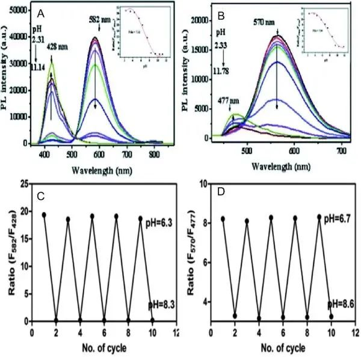
图 23. (A) pH 从 2.31 到 11.14 的 San 在 CH 3 OH/H 2 O 混合物 (2: 8 v/v) 中的荧光光谱。插图：pH敏感发射曲线的拟合线（F 582 nm /F 428 nm ）。(B) CH 3 OH/H 2 O 混合物 (1: 9 v/v) 中 pH 值从 2.33 到 11.78 的 Che 的荧光光谱。

**四. 总结与展望**

**4.1.总结**

天然AIE资源的研究主要聚焦于生物碱、黄酮类、香豆素、维生素、萜类以及多糖等领域。对于天然传统小分子AIE材料，如BBR、PA等，随着不良溶剂的加入和浓度的提升，其荧光强度显著增强。在不同极性溶剂中，荧光强度随波长红移而明显下降，这揭示了这些分子所具备的TICT效应。为了验证这些天然分子的AIE特性，研发团队利用DFT原理计算了HOMO和LUMO电子云分布，从而补充并证实了这些分子的RIM机制。至于槲皮素、杨梅素和核黄素等化合物，它们的作用机制则涉及到ESIPT和ESPT过程。

对于生物多糖的天然非传统光物理行为，研发团队发现某些具有与C=O相互作用的基团的物种能够发光。这一现象归因于簇发色团的整体空间电子离域，进而增强了n-π\* 的重叠，使CL机制更为合理。此外，研发团队还深入探讨了这些基于天然产物的AIE材料在细胞成像、体内成像以及生物传感等领域的应用潜力。

**4.2.展望**

基于天然AIE分子的深入光物理机理研究和应用开发，为科研人员提供了丰富的原始材料基础。这些研究不仅有助于发现具有更佳光物理特性的新材料，更为天然产物的广泛发掘提供了坚实的支撑。新型天然AIE材料的涌现，进一步拓展了其应用领域，为材料科学研究和技术应用注入了新的活力。来自不同科学领域的关注与合作，将深化研发团队对光物理过程的理解，并为新兴应用的开发提供有力支持。

然而，当前仍有许多具有AIE特性的天然产物等待研发团队去发现和探索。因此，利用可再生资源替代非天然化学品成为了一个重要且紧迫的任务。尽管可再生资源领域取得了显著进展，但由于植物可再生资源的提取和分离技术的挑战，以及植物化学分子具有AIE性质的潜在性较低，植物化学衍生物成为了研究的重点。这些衍生物是通过化学手段对天然可再生资源进行改造得到的，具有更好的应用潜力。

此外，易于提取的植物化学物质同样具有重要意义。它们在生物传感试剂/探针、纳米技术、智能显示、生物成像、可穿戴技术等领域的应用前景广阔。随着科学技术的不断进步，研发团队有理由相信，天然AIE分子及其衍生物将在未来发挥更加重要的作用，为人类社会带来更多创新和价值。

Xu, L. Renewable Resource of Aggregation-Induced Emission Materials: From Photophysical Mechanisms to Biomedical Applications. Coordination Chemistry Reviews 2024, 506, 215701. https://doi.org/10.1016/j.ccr.2024.215701.

**关注并回复文章DOI获取全文：**

10.1016/j.ccr.2024.215701

**点击蓝字 关注我们**

预览时标签不可点

素材来源官方媒体/网络新闻

 [阅读原文](javascript:;) 

  继续滑动看下一个 

 轻触阅读原文 

    

