 

#  【Coord. Chem. Rev.】超全的细胞器成像总结，原理、设计思路、结构、物质检测、超分辨，你需要的这里都有 
 

Grenemal

读完需要

33

全文总共 10800 字

**导言**

亚细胞分子，包括离子、活性氧（ROS）、活性氮（RNS）和活性硫（RSS），在细胞信号传导、氧化应激反应、免疫调节等生理和病理过程中起着至关重要的角色。因此，了解亚细胞分子的动态行为和空间分布对于揭示其功能和在细胞事件中的作用至关重要。然而，传统的荧光显微镜和共聚焦显微镜由于受到阿贝尔衍射极限的限制，无法观察到200纳米以下的亚细胞器结构，这阻碍了对细胞内超细结构和分子事件的精确观察。

幸运的是，超分辨率成像技术的进步突破了这一限制，彻底改变了这一领域。其中，结构照明显微镜（SIM）因其高时空分辨率、对荧光蛋白或分子要求低、成像速度快且适合活细胞内细胞器的动态成像等特点，被广泛应用于亚细胞水平的细胞生物过程和细胞动态跟踪。SIM基于摩尔纹效应，将不同角度的结构光与物体结合，形成样品的快照，然后通过计算重建最终图像。此外，STED显微技术利用受激发射效应实现超分辨率成像，而PALM和STORM采用随机批量照射目标分子的方法进行超分辨率定位。

这些超分辨率成像技术与荧光探针的整合为亚细胞分子的研究提供了前所未有的细节和分辨率。这种强大的组合使研究人员能够观察和研究亚细胞分子的分布模式、相互作用和行为，从而揭示其在细胞生理活动中的作用。
‍‍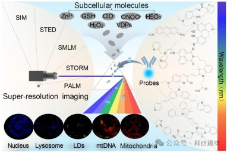‍‍
图 1.将探针与基于单细胞器定位的亚细胞分子超分辨率成像技术相结合。

**超分辨率成像小分子探针的设计**

如图2所示，大多数超分辨率小分子探针都包含一个大型共轭结构作为荧光团，与特定的结合基团连接，从而与特定的亚细胞分子或细胞器靶向基团反应，在特定细胞器内聚集。这些探针的最终任务是在细胞或动物体内提供光学信号，以反映特定生物过程的变化。

为了制造出光学性能稳定、响应速度快、抗干扰能力强的理想探针，以获得高质量的成像，应考虑以下五项设计原则：

1.小分子探针在超分辨率成像中应表现出较高的量子产率；

2.应为长期动态成像提供稳定的光学特性；

3.应考虑窄光谱特性和大斯托克斯位移，以获得高信噪比；

4.应包含与亚细胞分子反应的特定结合基团；

5.还应包含细胞器靶向基团，以确保在特定细胞器内富集。

设计符合上述要素的探针可以缩短反复试错的过程。因此，许多小分子探针已根据上述要素构建并应用于单色/双色/多色成像，靶向特定细胞器，以及同时识别多个亚细胞分子。这些探针已被用于细胞成像，并揭示了许多生物过程，包括铁死亡。

为了更好地理解探针的设计原则，作者总结了最近报道的探针，重点介绍了它们的荧光团、结合基团和细胞器靶向基团（图2a）。在上述设计标准中，荧光团主要对应前三项，结合基团主要对应第四项，细胞器靶向基团主要对应第五项。大多数探针都是由荧光团、结合基团和细胞器靶向基团组成（图2b），它们通过烷基链连接（如Mito-Bor），或者两三个组成共轭体系（如QVD-B和Coupa）。
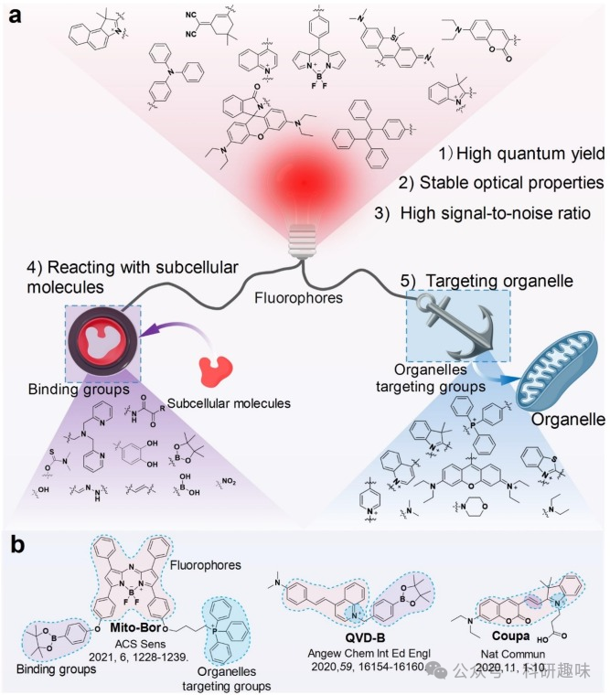
图 2.亚细胞分子的探针设计策略。

**常见荧光团**

荧光团是在紫外-可见光-近红外区域展现荧光特性的化学有机分子，具备对环境变化敏感的特性，因此被广泛应用于环境监测、食品质量检测、基础研究和临床治疗中，作为信号分子来报告环境中的微妙变化。在荧光探针的结构修饰后，其荧光特性能够通过环境变化而发生改变。一般来说，荧光探针的激发/发射波长主要受到其共轭体系的影响。共轭体系越长，荧光激发/发射波长越长。由于短波长对细胞有害，长波长（650-900 nm）荧光团成为研究人员构建新型探针的首选工具。

一些常见的荧光团如香豆素（j）、喹啉（g）、咔唑（p）、萘酰亚胺 (r)、三苯胺等，都是由苯环和其他杂原子五/六元环合并而成的共轭体系。然而，合并两个或三个环的共轭体系提供的波长有限。为了获得波长更长的荧光团，可以将多个环合并形成共轭体系，如 BODIPY (t) 和罗丹明 (x)。

此外，为了进一步拓宽荧光团的波长范围，人们还通过荧光团组装构建了一些超大型共轭体系，以获得近红外探针，如香豆素-水杨碱和香豆素-咔唑共轭体系。这些超大型共轭体系在图3中有所展示。
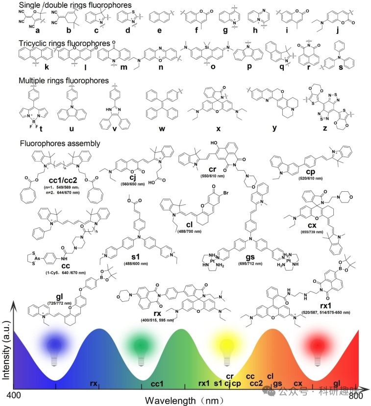
图 3. 一些典型的荧光团

**亚细胞分子的结合基团**

如图4所示，结合基团作为荧光探针的关键分子部分，就像一个“开关”，通过与亚细胞分子的特异性结合被激活，从而引发显著的荧光反应。为了设计出理想的荧光探针，结合基团必须具备合理的构型。因此，对各种结合基团进行分类和总结至关重要，这有助于作者理解它们在设计探针时的适用性和局限性。

包括针对离子的螯合剂基团、针对ROS的硼酸酯基团、以及针对RSS的C=C双键基团等，这些结合基团已被证明可以选择性地与特定类型的亚细胞分子结合，从而为探针提供了关键的识别功能。
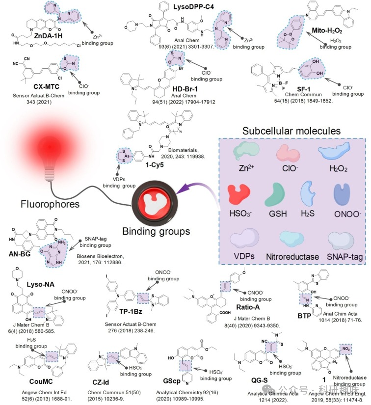
图 4.探针结构及其与 Zn2+、ClO-、H2O2、ONOO-、GSH、HSO3-、H2S、VDPs、硝基还原酶和 SNAP-tag 的亚细胞分子结合基团。

**螯合剂基团**

识别离子的方法之一是将离子-螯合剂结合基团与荧光团连接起来。在众多离子中，Zn2+ 可与几种螯合剂结合，如二二甲胺（DPA）、N,N,N',N'-四（2-吡啶甲基）乙二胺（TPEN）、N,N,N',N'-双（吡啶-2-基甲基）乙烷-1,2-二胺（BPEA）、N,N,N'-三（吡啶-2-基甲基）乙烷-1,2-二胺（TPEA）和乙二胺四乙酸（EDTA）等。通过将这些螯合剂与荧光团连接，可以使其与 Zn2+ 结合。

**硼酸酯和硼酸基团**

一些易氧化基团常被用作ROS的结合基团，其中包括硼酸酯和硼酸。H2O2作为一种强氧化性ROS，具有氧化硼酸酯或硼酸的能力，导致电子分布发生变化，从而引发荧光反应。

**双键基团**

作为另一种易氧化基团，双键（如 C=C 或 C=N 键）也可以用于结合 ROS、RNS 和 RSS。当与 ROS 和 RNS 结合时，双键容易被氧化并完全断裂。然而，当与 RSS 结合时，双键会发生加成反应，并不会完全断裂。

**N,N-二甲基硫代氨基甲酸酯基团**

N,N-二甲基硫代氨基甲酸酯（DMTC）是一种常用的ClO-结合基团，它通过醚键与荧光团相连接。当ClO-与DMTC结合时，醚键会被破坏，从而使DMTC从荧光团上被移除。这一过程会导致探针的电子分布发生变化。因此，这些荧光探针在面对ClO-时通常会表现出比色和比率荧光反应。

**其他基团**

尽管使用了上述基团作为识别亚细胞小分子的结合基团，但也使用了其他结合基团，如丙烯酰氧基和溴来识别 GSH，二羟基用于结合 ClO- ，罗丹明 B 用于识别 ONOO- ，α-酮酰胺基用于识别 H2O2 。有几组化合物被用来识别亚细胞大分子，例如利用罗丹明支架上的硝基来识别线粒体中的硝基还原酶 。Cy5（1-Cy5）上的 1,3,2-二硫代二烯醇基团被用来识别线粒体外膜上的邻位二硫醇蛋白（VDPs）。萘酰亚胺（AN-BG）上的 O6-苄基鸟嘌呤基团被用来识别 SNAP-标记。应该注意的是，有些结合基团可能会对多种亚细胞分子产生反应，从而表现出交叉反应性。例如，硼酸酯不仅能对 H2O2 产生荧光反应，还能对 ONOO- 产生荧光反应。探针的整体结构和化学环境会影响其结合的特异性。因此，所构建的探针需要进行体外荧光光谱筛选，以评估其对所需亚细胞分子的选择性和特异性。许多类型的结合基团都能结合特定的亚细胞分子或产生交叉荧光反应，这使它们成为实现亚细胞分子荧光的基石。因此，在设计荧光探针时，除了选择结合基团外，还需要研究探针结构的稳定性并进行光学性质筛选。总结这些亚细胞分子的相应结合基团，有助于指导开发用于设计探针的小型结合基团库。

**细胞器靶向基团**

细胞器是细胞质中的重要组成部分，它们具有独特的形态结构和生理功能。例如，线粒体呈杆状，主要负责进行有氧呼吸；溶酶体呈现圆形，负责执行消化功能；而网状内质网则参与蛋白质和脂质的合成。这些细胞器的微环境也存在显著差异，例如，溶酶体的pH值通常呈酸性，大约在4.5～6.0之间，而线粒体的pH值则呈弱碱性，大约在8.0左右。这些细胞器因其独特的生理功能在能量代谢、蛋白质合成和有氧呼吸等过程中发挥着关键作用。实时监测这些细胞器的生理活动变化有助于深入了解细胞器功能的变化与疾病发生之间的关系。因此，科研人员根据细胞器微环境的特性，设计了针对特定细胞器的荧光工具。

目前已知的荧光探针可靶向的细胞器包括线粒体、溶酶体、脂滴、细胞核和内质网等。为了提高荧光探针对特定细胞器的靶向准确性，作者总结了以下几种主要的探针结构组（如图5所示）。
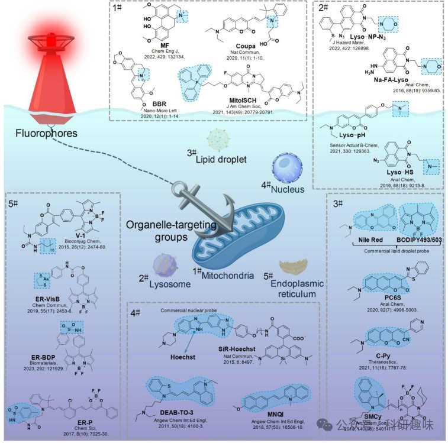
图 5.线粒体、溶酶体、脂滴、细胞核和内质网探针及靶向基团的结构。

**用于靶向线粒体的带正电基团**

通过电子显微镜观察，作者发现线粒体呈现出多种形态，包括球形、杆形和丝状颗粒，它们广泛存在于细胞中。作为细胞内的关键细胞器，线粒体参与了能量生成、蛋白质合成、钙循环和其他生物化学过程的调节。值得注意的是，线粒体在产生大量RNS和ROS方面发挥着重要作用。线粒体的结构由多个部分组成，包括线粒体外膜/内膜、线粒体膜间隙、线粒体基质、嵴和mtDNA。其中，外膜与质膜相似，主要由蛋白质和磷脂（1：1）构成，主要起细胞器边界膜的作用。而线粒体内膜则由蛋白质和磷脂（3：1）组成，形成了较大的线粒体跨膜电位，为生化反应提供了所需的电化学环境。

基于线粒体的这些特性，科研人员开发了多种针对线粒体的正电基团，如半氰胺、苯并噻唑、喹啉、三苯基膦（TPP）、罗丹明和吡啶。例如，一系列荧光半氰胺探针通过半氰胺结构的N阳离子靶向线粒体，如图5所示的线粒体探针。由于这些探针具有良好的线粒体靶向性和成像效果，一些基于半氰基的线粒体探针已经商业化，如Coupa。除了人工构建的线粒体靶向基团外，一些天然化合物也具有固有的线粒体靶向结构。例如，木兰花碱（MF）和小檗碱（BBR）。这些天然化合物因其独特的化学结构和生物活性，在针对线粒体的研究中具有潜在的应用价值。

**用于靶向溶酶体的亲脂性胺基团**

溶酶体是一种消化细胞器，由单层薄膜包裹，其厚度为7-10纳米，直径为0.025-0.8微米，呈圆形或卵圆形。溶酶体的微环境呈酸性，含有多种水解酶，这些酶能够分解碳水化合物、核酸和蛋白质等亚细胞分子。溶酶体在生物过程中发挥着重要的消化作用，能够将外源食物消化成生物大分子，同时也能消化细胞分化过程中产生的衰老细胞器。这些过程为人体自身的组织更新提供了必要的原材料，并参与细胞凋亡、死亡和防御等多种生命活动。

基于溶酶体微环境中亲脂性胺转化为质子胺的特点，作者设计了具有亲脂性胺的溶酶体探针。这种设计改变了探针的亲脂性，使其无法穿透溶酶体膜，从而在溶酶体中积聚，如图5所示的溶酶体探针。在已报道的溶酶体探针中，4-(2-羟乙基)吗啉和N,N-二甲胺/N,N-二乙胺是最常用的溶酶体靶向基团。

基于线粒体的这些特性，科研人员开发了多种针对线粒体的正电基团，如半氰胺、苯并噻唑、喹啉、三苯基膦（TPP）、罗丹明和吡啶。例如，一系列荧光半氰胺探针通过半氰胺结构的N阳离子靶向线粒体，如图5所示的线粒体探针。由于这些探针具有良好的线粒体靶向性和成像效果，一些基于半氰基的线粒体探针已经商业化，如Coupa。除了人工构建的线粒体靶向基团外，一些天然化合物也具有固有的线粒体靶向结构。例如，木兰花碱（MF）和小檗碱（BBR）。这些天然化合物因其独特的化学结构和生物活性，在针对线粒体的研究中具有潜在的应用价值。

**用于靶向脂滴的荧光团**

尽管细胞生物学家曾认为脂滴是惰性的脂肪堆积，但实际上，它们是具有独特结构和功能的细胞器，在细胞内无处不在。脂滴是由磷脂分子和相关蛋白质组成的颗粒状结构，能够将中性脂肪包裹在一层分子膜中。它们的尺寸范围广泛，直径可以从20纳米到100微米不等。在细胞内，脂滴通过合成和消耗参与多种生理活动。它们在脂肪酸的储存、运输和降解过程中发挥关键作用，同时还参与炎症反应、蛋白质储存和降解以及病毒复制等过程。这些过程与肥胖、神经退行性疾病、癌症、高脂血症及相关疾病的发生有密切关联。

为了更好地了解这些过程，对细胞内生理活动中脂滴的变化进行成像和追踪至关重要。目前，常用于追踪脂滴的商业探针包括尼罗红和BODIPY 493/503等，这些探针结构简单，能够靶向脂滴。

**用于靶向细胞核的商用核靶向染料**

细胞核是真核细胞中的核心组成部分，主要负责储存大部分遗传物质，并发挥着细胞遗传学和新陈代谢的调节中心的作用。为了深入研究细胞核如何参与生物活动，科研人员开发了一系列针对细胞核的荧光染料。其中，商业化的Hoechst染料和4′，6-二氨基-2-苯基吲哚染料（DAPI）是两种广泛应用的染料。这两种染料具有强渗透性和DNA特异性，使其成为追踪细胞核生理活动的有力工具。然而，它们的共轭体系相对较小，需要紫外线激发，这可能对细胞造成损伤并引发自发荧光现象。因此，Hoechst染料和DAPI结构经常被用作靶向细胞核的功能基团，如图5所示的细胞核探针。

**针对内质网的基团**

内质网在细胞中扮演着重要的角色，尤其在调节新陈代谢方面。它不仅参与脂肪代谢，还支持细胞间亚细胞分子的交换，如蛋白质、碳水化合物和离子，从而维持细胞的正常功能。内质网的新陈代谢主要由膜系统中的脂质成分所控制。然而，当膜系统中的过饱和脂肪酸积累过多，可能会引发内质网应激，破坏内质网的平衡，甚至导致细胞死亡。

因此，对内质网生理活动的成像和追踪至关重要，有助于作者深入了解其生物功能以及与疾病的关系。目前，已报道的内质网靶向探针具有一个共同特点，即包含一个小的两亲或亲油阳离子基团，如图5所示的内质网探针。

**其他细胞器的靶向基团**

除了上述提到的细胞器，高尔基体和质膜等其他细胞器也在细胞的生理活动中扮演着关键角色。为了研究这些细胞器的功能，科研人员也开发了相应的靶向基团。例如，Wang等人报道了一种苯磺酰胺作为高尔基体靶向基团，可以检测高尔基体应激过程中半胱氨酸浓度的变化。此外，癸基链被证实是一种质膜靶向基团。其他常见的细胞器靶向基团包括TPP和阳离子氮基团用于线粒体，二甲基叔胺用于溶酶体等。这些细胞器靶向探针在细胞内的定位和积累主要取决于细胞器微环境的特性。

除了通过化学反应引入的靶向基团外，一些天然化学结构（如木兰花碱和小檗碱）中的氮阳离子也可直接用于靶向细胞器。虽然有些细胞器的靶向基团尚未确定，如细胞核和内质网，但这并不妨碍针对它们的探针的开发。例如，市售的Hoechst染料常用于染色细胞核，因此也可用作靶向细胞核的基团。通过与特定的荧光团连接，可以获得不同荧光波长的核探针。

随着对细胞器的深入研究，相信会有更多新型的细胞器靶向基团结构和特征被发现和设计出来，为追踪细胞的生理活动提供强有力的工具。

**其他**

在探讨上述探针的主要结构之余，作者还应关注几个能够优化探针性能的关键功能基团：

1.水溶性基团，例如磺酸和羧酸，能够显著提高探针的水溶性，这对于细胞内环境中的探针应用尤为重要。

2.烷基链的引入可以增强探针的脂溶性，使其更好地渗透进入细胞膜或特定的细胞器膜，从而更精确地定位和追踪。

3.环辛四烯或硝基苯甲醇等基团能够增强探针的光稳定性，这对于长时间观察和记录细胞活动至关重要。

4.使用醚键或烷基链将不同结构的探针连接起来，可以创造出具有多重特性的探针，以适应不同的应用需求。

综上所述，设计出结构合理且具备特定荧光特性的探针，将为细胞器超微结构的超分辨率成像提供一种光学性能卓越的工具，为深入了解细胞活动和功能提供强有力的手段。

**亚细胞分子的超分辨率成像**

上文对小分子探针的重要结构进行了全面概述，包括荧光团、结合基团和细胞器靶向基团，为超分辨率成像提供了坚实的理论基础。近期，用于超分辨成像的代表性小分子探针策略主要遵循上述设计路线。因此，为了进一步深入了解，作者有必要对具有代表性的超分辨探针进行全面分析，以识别不同的亚细胞分子。这些亚细胞分子既包括维持细胞正常生理活动所必需的大分子，也包括参与细胞器物质交换和信息传递的亚细胞小分子，如H2O2、GSH和Zn2+等。

**亚细胞小分子超分辨率成像**

亚细胞小分子在生物体内发挥着至关重要的作用，它们包括离子、活性氧（ROS）、活性氮（RNS）和还原性/氧化性硫（RSS）等种类。这些小分子在细胞生长、肌肉收缩、信号转导等生命活动中扮演着重要角色。其中，Zn2+、Na+、K+等离子在生物体内具有不可或缺的生理功能。例如，Zn2+参与DNA合成、蛋白质折叠和细胞周期调控等过程。Na+和K+则维持细胞的渗透压平衡和动作电位的产生。ROS家族中的成员，如H2O2、O2--、ROO-、·OH和O3，主要由线粒体电子传递链中的电子泄漏产生。这些分子在细胞内外的氧化还原反应中起到关键作用，参与细胞信号转导和防御机制。RNS家族主要包括ONOO-、NO2和NO，这些分子由NO介导，在血管舒张、神经传导等方面发挥重要作用。而RSS家族则包括H2S、HSO3-、Hcy、GSH和Cys等分子，它们控制着细胞的氧化还原平衡。这些小分子在细胞分裂、新陈代谢和免疫反应等过程中发挥关键作用，它们的异常含量与多种疾病的发生和发展密切相关。因此，及时准确地检测这些亚细胞小分子的含量对于评价细胞的平衡调控具有重要意义，并为疾病的预防、诊断和治疗提供有价值的参考信息。

**同时追踪多个细胞器中的 Zn2+**

Zn2+在体内的波动与各种生理活动和疾病的发生有着密切的联系。Zn2+不仅参与细胞信号的调节和传递，还涉及到细胞器的各种生理活动，例如自噬过程中Zn2+的波动。此外，前列腺癌、糖尿病、神经退行性疾病、脂肪肝等疾病的发生都与Zn2+的异常波动有关，这使得Zn2+成为治疗这些疾病的潜在靶点。
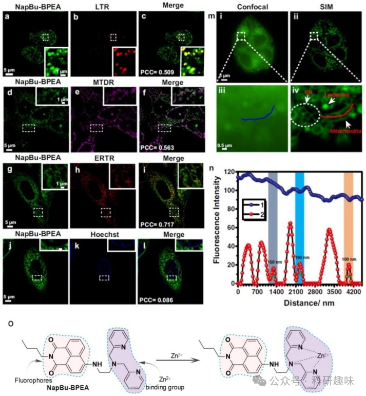
图 6.NapBu-BPEA 染色多个细胞器。

**线粒体中 H2O2 的灵敏快速追踪**

H2O2作为活性氧家族中的关键成员，对许多生物过程起到至关重要的调控作用。其在细胞内的水平与众多生物过程的调控紧密相连。当H2O2含量异常时，可能导致蛋白质结构的破坏，从而增加患糖尿病、癌症、神经退行性疾病、帕金森病等疾病的风险。因此，开发一种高灵敏度、高选择性的方法来快速检测细胞内H2O2的浓度，对于揭示相关疾病机制及寻找治疗靶点具有重要意义。
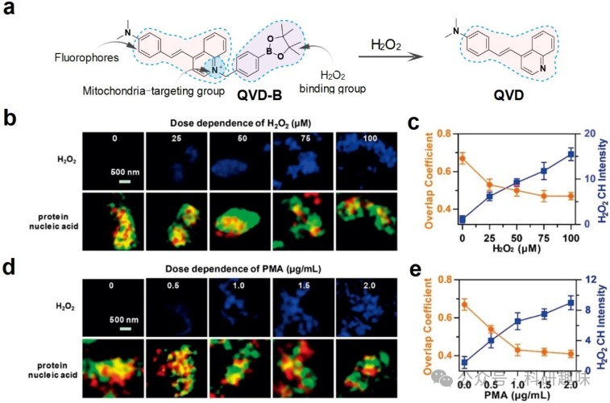图 7.HepG2 细胞线粒体 H2O2、蛋白质和核酸的 STED 图像。
**铁死亡过程中线粒体中 ClO- 的追踪**

在亚细胞小分子中，ClO-参与了众多细胞内生理过程，而其过量则与多种疾病的发生有关。因此，及时监测ClO-的含量在疾病的预防和治疗中具有重要意义。

Wei等人发现了一种名为magnoflorine（MF）的天然线粒体靶向药物分子，它对ClO-具有荧光响应特性，并可追踪线粒体中的ClO-含量。MF具有大型共轭结构和高量子产率，其结构中的N阳离子能够靶向线粒体。通过SIM技术，线粒体中ClO-含量的变化能够在纳米级别上实现可视化。此外，利用MF评估了铁死亡过程中ClO-的产生情况。结果表明，MF作为一种无需进一步结构修饰的天然线粒体标记药物，能够通过荧光准确观察药物在细胞器中的分布。更重要的是，ClO-被确定为MF的结合靶点，这有助于作者深入了解药物在疾病发展过程中的调控机制。
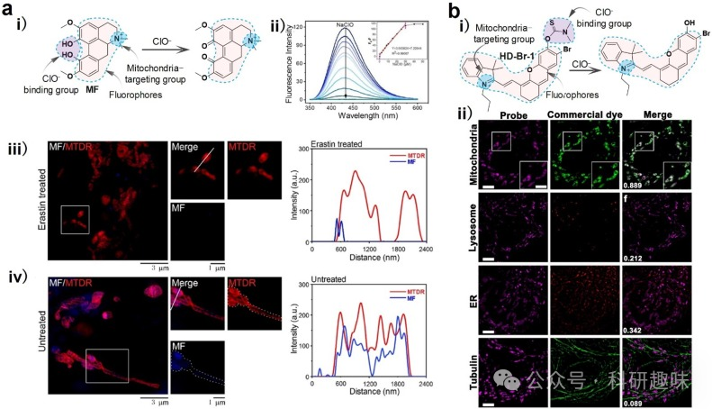
图 8.活细胞中线粒体 ClO- 的 SIM 图像。

**追踪线粒体嵴中 ONOO-**

ONOO-，一种主要在线粒体中产生的RNS，由一氧化氮和超氧阴离子自由基通过快速自由基偶联反应生成。它具有氧化和硝化能力，参与多种生物过程。值得注意的是，一些神经源性疾病如帕金森病（PD）的发生与细胞内ONOO-的异常含量紧密相关。因此，监测ONOO-在细胞不同区域的分布有助于作者更深入地理解其与某些疾病的关系。

2021年，Liu等人提出了一种名为“地雷战策略”的方法，通过将探针L-1与SIM技术相结合，成功识别了ONOO-。这种方法不仅解决了探针的非特异性靶向问题，还实现了在纳米级别上观察线粒体嵴中ONOO-的形成。L-1对ONOO-具有高灵敏度，其检测限（LOD）低至85.7 nM。当细胞质中的ONOO-与L-1接触时，C双键N键发生断裂，进而引发荧光发射。此外，针对脂多糖刺激产生的ONOO-，研究人员也使用了L-1，并观察到了颗粒状的荧光聚集体。这些研究结果表明，这种策略可用于追踪ONOO-的分布并深入了解其生物功能。
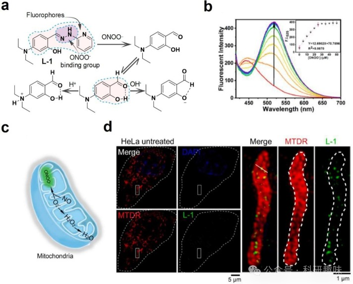
图 9.线粒体 ONOO- 探针设计和 SIM 超分辨率成像

**线粒体-溶酶体接触点的 H2S/HSO3- 双色追踪**

作为 RSS 的关键组成部分，H2S 和 HSO3- 展现出显著的抗菌和抗氧化特性，因此在食品、饮料和药品的防腐中得到了广泛应用，以抑制其降解。然而，生物医学研究也指出，长时间暴露于 H2S 或 HSO3- 环境中可能引发一系列健康问题，如呼吸系统反应、肺癌、脑癌、神经系统问题以及心血管疾病。因此，开发一种能在复杂环境和细胞样本中，对 H2S 和 HSO3- 进行选择性检测的方法显得尤为重要。

Chen 等人成功构建了一种双色探针 Coupa，用于追踪线粒体和溶酶体间的互动事件（图 10a）。在以溶酶体为观察目标时，Coupa 显示出红色荧光。而当它与线粒体中的 H2S 发生反应后，会转化为另一种发出蓝色荧光的分子。利用 Coupa，研究人员能够可视化线粒体-溶酶体接触点（MLC），并监测由 MLC 触发的线粒体局部粘度变化。这为作者跟踪有丝分裂和其他生物过程提供了有力工具。
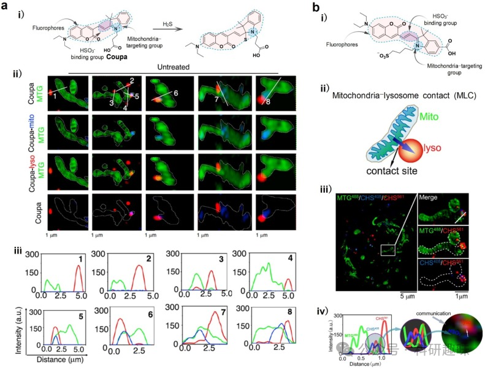
图 10.线粒体 H2S 或 HSO3- 探针设计和 SIM 成像下的动态跟踪。

**实时跟踪线粒体内的 GSH**

谷胱甘肽（GSH）作为 RSS 的核心组成部分，广泛分布在细胞的不同区域，参与多种细胞生理活动。尤其在线粒体中，GSH 主要发挥抗氧化作用，有助于限制潜在的氧化损伤。因此，快速了解细胞内 GSH 含量的变化对于深入理解 GSH 的生物学意义至关重要。

Chen 等人成功开发了一种线粒体靶向荧光探针（MitoRT），旨在实时监测线粒体内 GSH 的动态变化（图 11a）。MitoRT 巧妙地结合了线粒体靶向官能团 TPP 和迈克尔受体结合剂 GSH，两者通过优化的 4 碳连接体相连接。当与 GSH 结合时，MitoRT 会显示出比率荧光，从而揭示了活细胞优先维持线粒体 GSH 水平的生物现象。
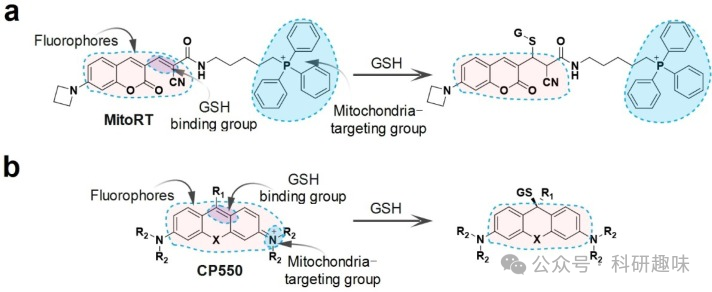
图 11.响应线粒体 GSH 的探针的化学结构设计。

**其他**

细胞器间的通讯对于维持细胞平衡至关重要。例如，线粒体与溶酶体之间的接触可以传递活性离子（如 Ca2+、HSO3- 等），这些离子在细胞内平衡中起到关键作用。与线粒体和溶酶体功能异常相关的疾病常表现出 Ca2+ 调节障碍。为了深入了解线粒体和溶酶体之间是否存在直接的相互作用，以及它们如何调节细胞内 Ca2+ 平衡，Peng 等人利用线粒体靶向钙探针 Mito-R-GECO1，观察线粒体 Ca2+ 的动力学。当通过 MLSA1 激活溶酶体的 TRPML1 通道并释放 Ca2+ 时，他们发现线粒体总 Ca2+ 显著增加。使用其他小分子激动剂激活 TRPML1 也得到了同样的结果，这表明溶酶体通过 TRPML1 将 Ca2+ 转移到线粒体基质中，进而调节线粒体 Ca2+ 动力学。

一氧化氮（NO）是一种重要的内源性分子，参与细胞内的信号转导、血管扩张和免疫反应等多种生理活动。此外，NO 还对线粒体融合和分裂等生理活动具有调节作用。He 等人研发了一种新型 NO 供体探针（NOD550），用于超分辨率观察 NO 与线粒体动力学之间的协同效应（图 12）。NOD550 可被紫外线激活，分解成 NO 和罗丹明染料。通过激活的 NOD550 的荧光，可以直接监测释放出的 NO。
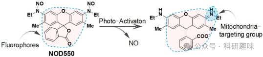                    
图 12.响应线粒体 NO.3.2 的 NOD550 化学结构设计。
**亚细胞大分子超分辨率成像**

亚细胞大分子是构成生物体的基本物质，包括蛋白质、核酸、多糖和脂质。这些大分子在细胞中发挥着各自独特的功能，相互之间紧密协作，共同维持细胞的正常运作。

蛋白质是由氨基酸聚合而成的生物大分子，参与细胞内的许多关键生化反应。它们既可以作为酶，催化细胞内的化学反应，也能塑造和维持细胞的结构，同时在信号转导过程中起到至关重要的作用。

核酸则是由核苷酸组成的，可以分为DNA和RNA两种类型。DNA作为细胞遗传信息的载体，储存着遗传指令，确保生物体的遗传特征得以传递。而RNA在蛋白质合成中起到关键作用，作为信使，将DNA中的遗传信息转录到细胞质中的核糖体上，进而指导蛋白质的合成。

多糖是由单糖分子聚合而成的链状或支链状聚合物，主要功能是为细胞提供能量。它们通过糖解和三羧酸循环等代谢途径，将储存的能量释放出来，供细胞使用。

脂类主要包括脂肪酸和甘油等物质，它们在细胞膜中发挥着重要的结构和功能作用。脂类不仅维持了细胞膜的完整性，还参与了细胞识别、物质运输等重要生理过程。

这些亚细胞大分子在细胞内相互依赖、相互影响，共同参与并完成各种复杂的生理过程，确保细胞的正常运作和生物体的健康。

**追踪线粒体中的蛋白质**

蛋白质作为生物体的核心成分，参与了维持正常新陈代谢的多个方面。这些重要的生理过程，包括酶促反应和激素调节，都离不开蛋白质的参与。例如，酶蛋白在食物消化、吸收和利用中起催化作用；胶原蛋白则有助于伤口愈合；免疫球蛋白参与防御系统，对抗细菌入侵；肌球蛋白调节肌肉收缩；血红蛋白在血液中负责运输氧气；而甲状腺激素则促进生长和发育。

Thiel 等人研发了一种基于罗丹明的化学探针1，并成功将其应用于线粒体中硝基还原酶的超分辨率成像（图 13a）。该探针的硝基基团能够与硝基还原酶反应，引发荧光反应。通过双色、三维和单分子定位显微镜，他们能够观察线粒体亚组织的详细结构。研究结果表明，硝基还原酶主要存在于线粒体中，且分布不均，呈聚集状态。

此外，Ye 等人也报道了一种新型罗丹明探针（Rh-Gly），用于靶向线粒体，具有极佳的时间分辨率和高精度定位（图 13b）。Rh-Gly 经 HaloTag 配体修饰后，可与组蛋白 H2B 蛋白结合，展示了其扩展功能。类似的，通过添加异硫氰酸酯基团，Rh-Gly 被修饰为 Rh-Gly-NCS，从而能够与针对α-微管蛋白的一抗和二抗结合。Rh-Gly-NCS 被用于对固定细胞中的微管进行超分辨率成像。这些结果表明，Rh-Gly 不仅为 PALM 成像提供了一种有吸引力的工具，同时也为开发新型罗丹明探针开辟了新的研究途径。

Chen 等人则构建了针对线粒体外膜VDPs的荧光探针1-Cy5，并利用STORM技术对活细胞中的线粒体进行成像。该探针通过与线粒体膜上的1-VDP结合，实现了对线粒体融合、分裂和管化过程的荧光可视化。
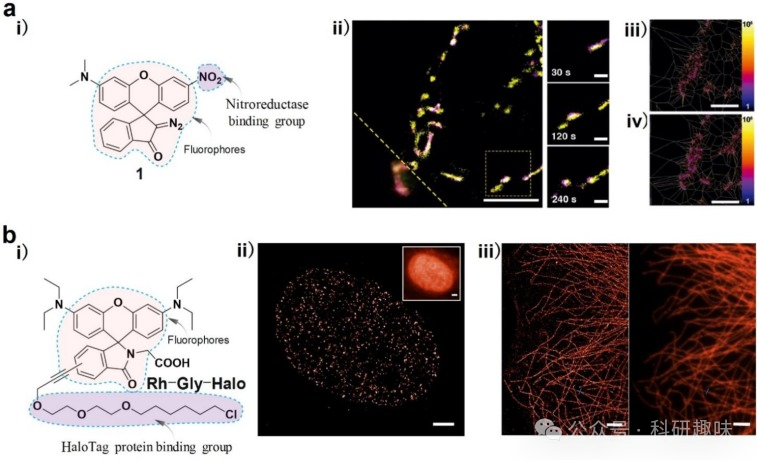图 13.超分辨率成像蛋白质。
**追踪线粒体中 mtDNA 的变化**

线粒体DNA（mtDNA）是一种具有环状双链结构的遗传物质，存在于线粒体中，负责编码参与线粒体内电子传递链的酶和蛋白质。它具有自我复制能力，但这一过程受到核DNA的控制，因为用于复制的DNA聚合酶是由核DNA编码的。由于mtDNA对过氧化物敏感、自我修复功能不全以及缺乏组蛋白保护，其发生突变的概率高于细胞核。目前，mtDNA突变是癌症形成的主要因素之一，许多遗传疾病也与之密切相关。因此，实时跟踪mtDNA生理形态的变化对疾病的预防和治疗至关重要。

然而，目前常用的监测mtDNA的技术，如荧光原位杂交（FISH）或聚合酶链反应（PCR），存在重复性差、杂交度低等问题。因此，开发一种高精度、实时的mtDNA定位和成像策略是迫切需要的。基于咔唑的CNQ与mtDNA具有合适的小沟槽结合模式，结合后CNQ的荧光增加了182倍，斯托克斯位移达到140nm。体外活性测试表明，CNQ可特异性识别mtDNA。SIM共定位成像实验表明，CNQ能靶向活细胞中的mtDNA，还能监测多柔比星诱导的mtDNA损伤。这些结果表明，CNQ是一种有望靶向mtDNA的化学工具。

Uno等人构建了一系列基于N-芳基吡啶半氰基的DNA靶向探针，这些探针具有长吸收波长。在STED的支持下用于超分辨观察不同类型细胞中的DNA时，显示出较高的DNA特异性和较强的膜渗透性。MitoMN的蓝色荧光与商用线粒体脂质染料MTR的共定位高度重叠，表明MitoMN的蓝色荧光来自线粒体脂质。MitoMN的绿色荧光与同源POLG2-mcherry血浆的共定位值很高，表明MitoMN的绿色荧光来自mtDNA。MitoMN可用于观察光刺激下肿瘤线粒体的动态变化，包括线粒体肿胀、体积增大以及最终的癌症凋亡。在SIM的支持下，双靶标MitoMN揭示了肿胀线粒体之间的相互作用和融合，并表明这一过程是不可逆的。这些结果表明，MitoMN是一种有用的荧光工具，可用于观察肿瘤加速发展之前、期间和之后的亚细胞动态变化。
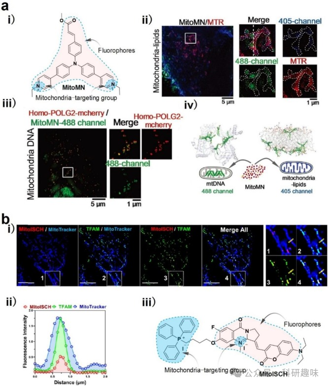
图 14.mtDNA 的 SIM 图像。

**其他**

在细胞膜上，糖蛋白和糖脂参与了众多生理过程，如细胞粘附、信号转导、肿瘤侵袭和内吞等。细胞表面碳水化合物的变化与肿瘤细胞的迁移行为关系密切，但由于这些亚细胞分子的结构相当复杂，人们对它们的了解尚不全面。

Chen等人利用超分辨率成像技术，通过与Alexa647链接的WGA，观察了N-乙酰葡糖胺在细胞膜上的分布。他们进一步分析了N-乙酰葡糖胺簇与脂质筏之间的关系。而Jing等人则利用超分辨率成像技术，通过使用适配体探针和凝集素来观察另一种细胞表面碳水化合物——N-乙酰半乳糖胺。他们发现，与凝集素相比，适配体与N-乙酰半乳糖胺结合的特异性更高。

如表格1所示，小分子探针被设计成具有特定的光学特性，并与先进的超分辨率成像技术结合，用于追踪亚细胞分子的动力学行为和实现单个细胞器的定位。尽管这些探针的光学特性已被应用于超分辨率成像，但它们仍有一些待改进之处，以提高其实用性。

例如，有一些探针能够识别ClO-，其中一些的检测限较低，但其波长并不理想。此外，在与超分辨率成像技术相结合的小分子探针中，线粒体和溶酶体的定位研究最为广泛，而对其他细胞器的定位分析还有待进一步探索。

因此，设计理想的荧光探针需要充分考虑三个主要组成部分：荧光团、结合基团和细胞器靶向基团。它们可以与先进的成像技术结合，实现单个细胞器的定位，从而追踪亚细胞分子微观动力学，发现新的生物信息。

Table 1. Optical properties of probes recognizing subcellular molecules.

| Name | λex/λem nm | Subcellular molecules | LOD (nM) | Applications | Technologies |
| --- | --- | --- | --- | --- | --- |
| NapBu-BPEA | 454/540 | Zn2+ | 4.98 | Mitochondria, lysosomes, and ER | SIM |
| QVD-B | 405/580 | H2O2 | – | Mitochondria | STED |
| Mito-Bor | 700/730 | H2O2 | 23 | Mitochondria | – |
| MF | 405/436 | ClO− | 90.36 | Mitochondria | SIM |
| HD-Br-1 | 640/710 | ClO− | 89.7 | Mitochondria | SIM |
| SF-2 | 550/586 | ClO− | 4.3 | Golgi                             complex, lysosomes | SIM |
| L-1 | 360/525 | ONOO− | 85.7 | Mitochondria | SIM |
| Coupa | 560/650; 405/480 | H2S, SO3− | – | Mitochondria, lysosomes | SIM |
| CHS | 560/674; 405/493 | H2S, HSO3− | 356 | Mitochondria, lysosomes | SIM |
| MitoRT | 488/567; 405/488 | GSH | – | Mitochondria | SIM |
| CP550 | 352/570 | GSH | – | Mitochondria | SMLM |
| Mito-R-GECO1 | – | Ca2+ | – | Mitochondria, lysosomes | STORM |
| NOD550 | 520/550 | NO | – | Mitochondria | PALM |
| 1 | 532/550 | nitroreductase | – | Mitochondria | STORM |
| Rh-Gly | 552/600 | H2B proteins, immunostaining antibodies | – | Mitochondria, microtubules | PALM |
| 1-Cy5 | 640/670 | VDPs | – | Mitochondria | STORM |
| PC1 | 532/546 | mtDNA | – | Mitochondria, nuclear | STED |

**总结与展望**

在这篇综述中，作者系统地总结并探讨了荧光探针与超分辨率成像技术结合，如何在实时活体监测中揭示细胞器超微结构内亚细胞分子的动态变化。荧光探针的设计包括三大关键部分：普通荧光团、亚细胞分子结合团和细胞器靶向团（图3、图4、图5），这些可以根据研究需求进行灵活组合，有助于构建各种特定的小分子荧光探针。这些荧光探针为亚细胞分子的荧光追踪提供了不同程度上的可视化，如表1所示。

原则上，任何参与 ROS 反应的内源性荧光团都能产生自身生物发光。然而，大多数内源性荧光团的发射时间很短，这妨碍了现有光子检测设备对自身生物发光的检测，因此很少将其用于成像。Kobayashi 等人证实，人体皮肤的自发生物发光可用于成像，生成 "发光脸 "图像，尤其是脸部和颈部。

根据现有的报道和总结，荧光探针与超分辨率成像技术的结合已成为追踪亚细胞分子动态的首选方案。该领域未来的发展前景广阔，主要涵盖以下几个方面：

1.开发多色荧光色彩转换靶向探针，这种探针能实时捕捉细胞器间的快速物质流交换，从而避免使用多种细胞器靶向探针进行延时图像捕捉的需求。

2.开发分布在多个细胞器中的响应探针，这种探针可用于定量生物分析，评估亚细胞分子在亚细胞结构中的分布。

3.将超分辨率成像技术与相关光学显微镜、电子显微镜等其他辅助技术结合，有望对亚细胞分子进行全面、多模态的表征。

4.不断提高成像分辨率是当前显微成像技术的重要发展趋势。

总的来说，构建合适的荧光探针并与超分辨率成像技术配合使用，将有助于疾病的预防和治疗，并加深不同领域研究人员间的合作与交流。

Fang, G.; Liu, D.; Zhang, M.; Shao, L.; Shao, X.; Chen, J.; Meng, C.; Wang, Y.; Zeng, K.; Chen, Q. Single-Organelle Localization-Based Super-Resolution Imaging for Subcellular Molecules Micro-Dynamics. *Coordination Chemistry Reviews* **2024**, *504*, 215670. https://doi.org/10.1016/j.ccr.2024.215670.

**关注并回复文章DOI获取全文：**

10.1016/j.ccr.2024.215670

**点击蓝字 关注我们**

预览时标签不可点

素材来源官方媒体/网络新闻

 [阅读原文](javascript:;) 

  继续滑动看下一个 

 轻触阅读原文 

    

