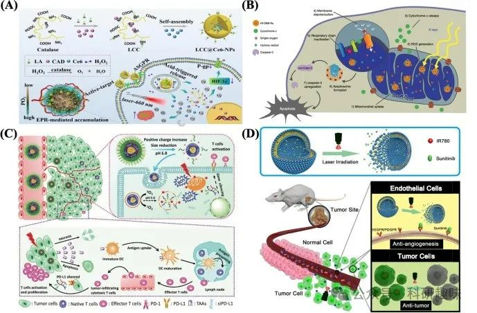
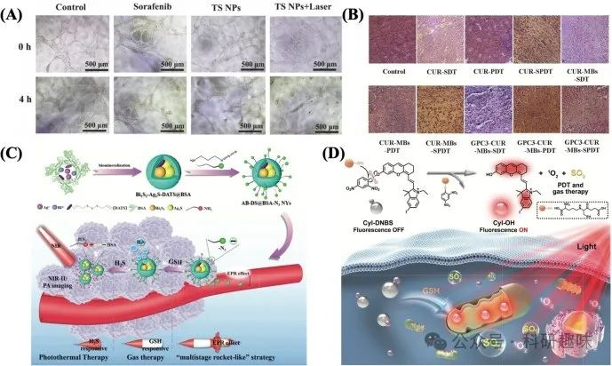
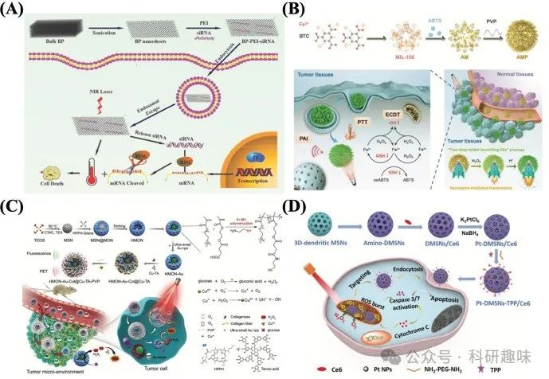

 

#  近红外光疗纳米材料——基于光疗的联合治疗 
 

## 近红外光疗纳米材料——基于光疗的联合治疗

癌症光疗，作为一种前沿的非侵入性治疗手段，正逐渐崭露头角成为极具竞争力的癌症治疗策略之一。然而，该疗法面临若干固有挑战，显著制约了其临床应用的广泛推广。这些挑战主要包括：首先，光的组织穿透深度有限，限制了治疗深度；其次，光动力疗法（PDT）在肿瘤微环境（TME）中的缺氧条件下效果受限；再者，光热疗法（PTT）可能引发的获得性热休克效应亦不容忽视。此外，PTT与PDT过程中产生的高温和活性氧物种（ROS）虽能有效杀伤肿瘤细胞，但也可能对周围健康组织造成不必要的损伤。尽管在动物模型中，光疗对实体瘤的治疗展现出积极成效，但在应对人类肿瘤复发问题上仍显不足。

鉴于此，将癌症光疗与其他治疗模式相结合的策略应运而生，旨在通过优势互补，克服单一疗法的局限性，从而提升整体治疗效果。具体而言，PTT不仅能促进细胞对治疗药物的摄取，还能诱导药物从载体中释放，这一特性为药物输送相关的治疗方法提供了有力支持，并促进了协同疗法的成功实施。同时，PTT产生的高温与PDT生成的ROS能够削弱肿瘤细胞对放疗或化疗的抵抗性，进而增强这些疗法的疗效[115]。此外，光疗还能促进肿瘤组织内血流的加速和氧含量的提升，这对于依赖氧气的化疗和放疗而言，无疑是如虎添翼，显著增强了其治疗效果[116]。

综上所述，将单一的光疗策略与其他癌症治疗方法相结合，不仅能够有效规避各自疗法的不足，还能通过协同作用显著提升癌症治疗的整体效果。这一策略在表2中得到了详尽的阐述，为未来的癌症治疗研究与实践指明了方向。

Table 2. Combinations of phototherapy and various therapeutic modalities in cancer treatment.

| Combination way | Advantages | Disadvantage |
| --- | --- | --- |
| Chemotherapy | Enhancing drug cellular uptake and sensitivity to tumor cells | Inadequate loading efficacy and uncertain doses of synergistic treatment |
| Radiotherapy | Decreasing X-rays harmful to normal cells | Easily injuring normal cells around tumor tissue |
| Immunotherapy | Sparking specific immune responses and enhancing anti-cancer immunity | Low penetration depth |
| Anti-angiogenesis therapy | Increasing sensitivity to tumor blood vessels | Different spatial and temporal characteristics of drugs |
| Sonodynamic | Generating more ROS and improving cytotoxicity | Skin sensitivity |
| Gas therapy | Realizing the targeted release of gas | Neglecting to monitor gas production |
| Gene therapy | Enhancing penetration of cell membranes and promoting gene delivery | The instability of gene carriers |
| Chemodynamic therapy | Accelerating the Fenton reaction | Inconsistency with the reality of tumor models |
| Starvation therapy | Reducing resistance to single nutrients and inhibiting HSPs | Uncertainty between tumor promotion and tumor treatment |

# 光疗与化疗的结合

在癌症治疗中，传统化疗方法如使用喜树碱、紫杉醇及多柔比星（DOX）等化学药物，常因多药耐药性及特异性不足而面临治疗效果不佳的挑战。为克服这些瓶颈，光疗与化疗的联合策略应运而生，展现出显著优势。光动力疗法（PDT）通过产生活性氧物种（ROS）能够有效抑制活性外流转运体的过度表达，同时，光热疗法（PTT）的实施则增强了细胞膜的通透性，促进了治疗药物如DOX的细胞内蓄积，进而提升了治疗效果。此外，PTT引发的高温环境还能显著提升肿瘤细胞对DNA损伤性化疗药物的敏感性，干扰其DNA修复机制，进一步增强疗效。

针对乳腺癌的化疗耐药性问题，Zhao团队创新性地设计了以聚乙烯亚胺（PEI）和透明质酸（HA）包覆的多功能二硫化钼（MoS2）纳米载体（MoS2-PEI-HA），用于负载化疗药物DOX。该系统中，HA作为靶向分子，能够特异性识别MCF-7-ADR细胞并通过HA酶降解促进DOX的释放。同时，MoS2纳米片诱导的热效应不仅加速了DOX的释放，还有效下调了P糖蛋白的表达，从而逆转了耐药性。实验结果显示，在体外协同化疗与PTT的联合作用下，细胞活力显著降低至2.9%，远低于单一治疗的效果。在动物模型中，经照射后注射DOX@MoS2-PEI-HA的MCF-7-ADR肿瘤抑制率高达96%，明显优于其他对照组[https://doi.org/10.1021/acsami.7b17506]。

为进一步解决实体瘤内部的极端缺氧问题，Cheng团队开发了LA-CAT-CAD@Ce6这一刺激响应型纳米酶原药系统，实现了化疗与PDT的协同增效。该系统中，LA不仅提高了药物在血液循环中的稳定性，还作为活性靶向配体增强了细胞摄取能力。CAD作为DOX的前体，对pH值敏感，能在肿瘤微环境中迅速响应并触发Ce6的释放及ROS的生成。同时，CAT酶在细胞内分解H2O2，原位产生O2，有效缓解了肿瘤缺氧状态。实验数据表明，LA-CAT-CAD@Ce6纳米粒子能够显著抑制肿瘤生长（肿瘤生长抑制率超过90%），甚至在某些情况下实现了肿瘤的完全消融（图9A），展现了其巨大的应用潜力[https://doi.org/10.1016/j.actbio.2020.05.035]。

图 9：（A）纳米酶原药纳米颗粒的合成、自组装和体内输送。(B) Hf-DBB-Ru 介导的线粒体靶向 RT-RDT。(C) pH 响应可解离胶束丛介导的体内光动力肿瘤免疫疗法图解。(D) Lip-IR780-Sunitinib 的设计示意图。该给药平台可装载亲水性和亲油性载体，如抗血管生成药物舒尼替尼（亲水性）和光热剂 IR780（亲油性）。

总之，化学光疗是一种抑制肿瘤增殖和复发的新型技术。然而，在广泛应用于临床之前，还必须解决几个问题，包括负荷疗效不足、协同治疗剂量不确定以及不理想的生物相容性。

# 光疗与放疗的结合

放射治疗，作为肿瘤治疗领域的核心手段之一，广泛采用电离辐射如γ射线、X射线及粒子束，通过诱导氧化应激反应或直接造成DNA损伤来靶向肿瘤细胞，从而达到治疗目的。近年来，放疗与光疗的联合研究逐渐成为热点。光热疗法（PTT）通过其独特的机制，能够缓解肿瘤微环境（TME）的缺氧状况，进而提升肿瘤细胞对X射线或γ射线的敏感性，显著增强治疗效果。相比单一的光疗模式，X射线或γ射线辐射在穿透深度上的优势尤为突出，尤其适用于深部癌症的治疗。因此，光疗与放疗的协同作用展现出了广阔的治疗潜力。

Yong等研究者巧妙地设计了一种多功能WS2量子点（WS2QDs），该纳米平台能够同时实现PTT与放疗的协同治疗效果。此外，WS2QDs还具备双模态成像能力（包括X射线计算机断层扫描和光声成像，PAI），为精准诊断提供了有力支持，实现了在无损监测下的肿瘤完全消除[https://doi.org/10.1021/acsnano.5b05825]。

为进一步提升治疗的靶向性，Ni等团队则专注于线粒体靶向策略，开发了Hf-DBB-Ru复合物。该复合物能够在X射线照射下高效生成羟基自由基（·OH）和单线态氧（¹O₂），以极低的剂量实现光疗与放疗的联合作用，引发线粒体膜去极化、促进细胞凋亡，并有效抑制肿瘤生长（图9B）[https://doi.org/10.1038/s41467-018-06655-7]。

尽管光疗结合放疗为癌症治疗开辟了新的途径，但其临床应用的推广仍面临诸多挑战。一方面，相较于温和的近红外光，高能X射线在治疗过程中可能对肿瘤周围组织细胞造成不必要的损伤。另一方面，放疗与光疗在能量需求及作用时空上的差异性也亟待解决。因此，在未来的研究中，需更加全面地评估这两种疗法的协同效应，并探索优化策略，以确保其在临床上的安全有效应用。

# 光疗与免疫疗法的结合

免疫疗法，作为癌症治疗领域的一项新兴战略，其核心在于通过激活宿主的免疫记忆机制，促使免疫系统精准识别并清除肿瘤细胞，从而有效预防肿瘤复发。这一领域的突破性成就，如2018年诺贝尔生理学或医学奖的授予，正是基于免疫检查点在癌症治疗中的显著疗效发现。然而，鉴于免疫系统的个体差异性，免疫疗法仅能在少数患者中展现出理想的治疗效果。此外，该疗法可能伴随一系列副作用，包括但不限于造血功能受损、快速产生的耐药性，以及炎症介质的级联放大效应，这些均限制了单一免疫疗法在肿瘤临床治疗中的广泛应用。

值得注意的是，癌症光疗与免疫疗法的结合展现出了强大的协同效应。光疗不仅能够原位暴露肿瘤特异性抗原，激发特异性免疫反应，从而增强机体抗癌免疫力，且具备无创、疗程短的优势。而免疫疗法则能深入清除原发及转移性肿瘤细胞，突破激光探测的局限，有效遏制光疗后的肿瘤复发。Dai等研究者创新性地设计了一种肿瘤酸性响应性胶束纳米复合物，该复合物集成了线粒体靶向光敏剂（PS）与程序性死亡配体1（PD-L1）阻断siRNA，旨在协同增强肿瘤的光疗与免疫治疗。在弱酸性内/溶酶体环境中，基于海绵效应，PD-L1-blockade siRNA与PS得以从纳米复合物中释放（图9C）。实验结果显示，与单一激光治疗组（75%复发率）或PD-L1治疗组（87.5%复发率）相比，联合光照纳米复合体组的复发率显著降低至25%。这一成果揭示了通过抑制PD-L1表达，纳米复合物能在光动力疗法（PDT）中激活辅助性T淋巴细胞，促进细胞因子与干扰素的分泌，进而增强免疫应答，降低免疫耐受性。最终，光疗与免疫疗法的协同作用显著抑制了黑色素瘤的生长，并大幅降低了肿瘤复发率[https://doi.org/10.1002/adfm.201707249]。

近期，日本于2020年9月正式批准了光免疫疗法（Akalux）用于治疗复发性头颈部癌症，该疗法结合了抗EGFR抗体（西妥昔单抗）与光敏剂IR700（RM1929/ASP1929）。在一项跨国II期临床试验中，共纳入39名患者，结果显示治疗有效率达43.3%（其中完全缓解率为13.3%，部分缓解率为30.0%），疗效令人鼓舞。目前，美国食品药品监督管理局（FDA）正积极推进Akalux的全球III期临床试验（ClinicalTrials.gov标识符：NCT03769506），以进一步验证其疗效与安全性[https://doi.org/10.1093/intimm/dxaa037]。

尽管光免疫疗法展现出诸多优势，但其发展仍面临诸多挑战：首先，癌症光疗受限于近红外光的有限穿透深度，限制了光疗诱导免疫疗法的广泛应用；其次，需精确调控光疗诱导的免疫反应强度与可控性；最后，光免疫疗法的内在机制尚需深入探索，以优化治疗效果并减少潜在风险。

# 光疗与抗血管生成疗法的结合

抗血管生成疗法，作为一种精准的医疗策略，其核心在于抑制血管内皮生长因子（VEGF）的过度表达，进而诱导血管内皮细胞的程序性死亡（凋亡），最终遏制肿瘤的生长与扩张。自1994年起，美国食品及药物管理局（FDA）便确立了抗血管生成疗法作为辅助性治疗手段的地位，旨在减少癌症的复发与远端转移风险。然而，单一的抗血管生成疗法在多数情况下难以完全遏制肿瘤的发展，这促使科学家们探索更加高效的联合治疗方案。其中，癌症光疗与抗血管生成疗法的结合尤为引人注目。

这一联合疗法的优势在于，抗血管生成药物能够显著降低肿瘤组织内部的间质压力，从而优化药物递送环境，提升治疗效果。同时，在光疗过程中，肿瘤血管因其异常的生理结构对激光照射表现出更高的敏感性，这为光疗的精准打击提供了有利条件[132]。

近期，一系列关于癌症光疗与抗血管生成疗法协同作用的研究取得了显著进展。例如，Yang等人设计了一种创新的双功能给药系统——Lip-IR780-Sunitinib，该系统巧妙地将抗血管生成药物舒尼替尼与近红外染料IR780相结合。在激光照射下，该系统能够迅速分解，释放并激活舒尼替尼，有效阻断肿瘤血管生成；同时，光敏剂IR780则通过产生高热直接消融癌细胞。这一体外与体内实验均证实了该系统在协同抗血管生成与光热疗法（PTT）方面的显著疗效[https://doi.org/10.1016/j.nano.2018.06.011]。

此外，Zou等人也贡献了一项重要研究成果，他们成功地将有机半导体分子T8IC与抗血管生成药物索拉非尼结合，制备出了一种名为TS NPs的纳米粒子。T8IC因其卓越的近红外-II区吸收特性，不仅可用于荧光成像引导下的精准治疗，还显著增强了光疗效果。而TS NPs则展现出了高光电转换效率（PCE，约32.47%）、强大的活性氧（ROS）生成能力以及卓越的抗血管生成能力。这一创新策略在协同治疗中取得了令人瞩目的效果，为癌症治疗提供了新的思路与方向（图10A）[https://doi.org/10.1039/d1tb00209k]。

图 10：（A）体外 HUVEC 管形成和抗血管生成效应（NPs 40 毫克/毫升-1，激光 5 分钟）。(B) 治疗 14 天后用不同处理方法染色的肿瘤切片的 H&E 图像。(C) AB-DS@BSA-N3 NYs 增强肿瘤靶向积累的示意图及相应的抗癌机制。(D) CyI-DNBS 用于联合光透射疗法和二氧化硫气体疗法的示意图。

癌症光疗和抗血管生成疗法的联合治疗为癌症治疗提供了一种前景广阔的方法，但不同的药物具有特殊的时空特征。光疗可以在照射后立即通过 1O2 杀死肿瘤细胞，但通常需要较长时间的抗血管生成治疗才能奏效。

# 光疗和声动力疗法的结合

SDT（声动力疗法）作为一种创新的癌症治疗手段，依赖于低强度超声波来激活声敏化剂，进而触发活性氧（ROS）的生成，实现对肿瘤细胞的精准破坏。相较于传统肿瘤光疗受限于穿透深度的不足，SDT凭借其独特的超声空化效应，能够深入肿瘤组织内部，有效破坏肿瘤血管并消融肿瘤细胞，同时最大限度地减少对周围正常组织的损伤。

在治疗效果方面，声波光动力疗法（SPDT）相较于单一的SDT或PDT展现出更为显著的肿瘤抑制作用。这得益于SPDT在较低剂量下即可诱导大量ROS的产生，从而减轻治疗副作用并提升疗效。基础研究表明，SPDT在乳腺癌、肝癌、胶质瘤及皮肤鳞状细胞癌等多种癌症模型中均表现出色。

Zhu及其团队的研究进一步推动了SPDT在肝癌治疗中的应用。他们设计了一种以glypican-3为靶点，并负载有姜黄素的微气泡（GPC3-CUR-MBs）。在超声作用下，该微气泡不仅增强了细胞膜的通透性，促进了声敏化剂的快速积累，还显著提升了PDT的治疗效果。通过H&E染色分析（图10B），SPDT组展现出卓越的抗肿瘤效果，且未观察到明显的副作用，这为其临床应用提供了有力支持[https://doi.org/10.1016/j.colsurfb.2020.111358]。

此外，Nomikou等人则开发出了一种结合临床批准的近红外制剂血卟啉（HP）和吲哚菁绿（ICG）的纳米平台（HP + ICG NPs）。在超声与激光的双重刺激下，该平台能够高效产生ROS，并实现荧光成像引导下的肿瘤抑制。这一研究成果不仅展示了SPDT在癌症治疗中的多功能性，还为开发新型癌症治疗策略提供了重要参考[https://doi.org/10.1016/j.actbio.2016.11.031]。

然而，值得注意的是，目前报道的多数声波敏化剂在皮肤敏感性方面与光敏剂（PS）相似，这在一定程度上限制了其在临床癌症治疗中的广泛应用。因此，未来研究需致力于开发具有更低皮肤敏感性的声波敏化剂，以推动SPDT在癌症治疗领域的进一步发展。

# 光疗和气体治疗的结合

近年来，气体治疗（Gas Therapy, GAT）作为一种新兴的抗癌策略，利用硫化氢（H2S）、一氧化碳（CO）、一氧化氮（NO）、二氧化硫（SO2）及氢气（H2）等生物活性气体，在调控细胞信号转导、抑制癌症增殖、侵袭、转移及肿瘤血管生成方面展现出巨大潜力。这些气体分子作为生理平衡的关键调节者，在特定浓度下能有效穿透肿瘤组织，特异性破坏癌细胞，同时保持对正常组织的低毒性。然而，单一气体疗法的疗效受限于气体浓度调控、靶向递送及释放控制，难以单独实现肿瘤复发的有效抑制。

为克服这一挑战，研究者们探索了气体疗法与其他治疗手段的联合应用。You等人通过构建Au@SiO2纳米结构，并引入热休克蛋白抑制剂2-苯基乙炔磺酰胺（PES），实现了NO的温控释放与低温光热疗法（PTT）的协同，展示了按需气体释放与热触发的双重优势[https://doi.org/10.1021/acsbiomaterials.9b01771]。另一项研究中，Zheng等人设计的Bi2S3-Ag2S-DATS@BSA-N3 NYs纳米系统，利用肿瘤微环境（TME）激活的连续级联反应，实现了近红外二区荧光/光声成像（NIR-II FI/PAI）引导下的PTT与GAT协同治疗。该系统通过DATS与肿瘤过表达谷胱甘肽（GSH）的反应加速H2S生成，不仅触发了GAT，还促进了纳米粒子的肿瘤特异性聚集，显著提升了治疗效果[https://doi.org/10.1039/d0nr02543g]。

氢气（H2）作为一种独特的还原性气体，能够选择性地中和肿瘤内过量的羟自由基，打破氧化还原平衡，诱导氧化还原应激介导的细胞损伤。Wang等人开发的PdH@MnO2/Ce6@HA（PHMCH）卵黄壳纳米平台，集成了氢靶向递送、可控氢释放及高效光催化性能，实现了缺氧调节、多模态成像与GAT/PTT/光动力疗法（PDT）的协同作用。该平台的异质结构有效阻止了光生电子-空穴对的复合，实现了O2与ROS的时空同步生成，极大增强了PDT效果[https://doi.org/10.1021/acsnano.1c10450]。

此外，Wang等人还利用肿瘤细胞中过表达的谷胱甘肽设计了智能光敏剂CyI-DNBS，实现了PDT与GAT的协同治疗。谷胱甘肽浓度的升高促进了活性光敏剂CyI-OH的释放及SO2的生成，展现了体内抗癌的显著协同效果[https://doi.org/10.1002/adhm.202102017]。

然而，当前光疗与气体疗法的联合应用中，光声成像技术主要聚焦于气体载体或原药的定位，而忽视了对气体产生过程的实时监测。未来研究应聚焦于开发能够直接监测气体生成与分布的新型成像技术，以进一步优化治疗策略，实现光疗与气体疗法的最佳组合效果。

# 光疗与基因治疗的结合

近年来，光疗与基因治疗相结合的新型癌症治疗策略引起了科学界的广泛关注。基因治疗，作为一种前沿的生物医学技术，利用小干扰RNA（siRNA）作为工具，通过下调或替换致病突变基因，精准调控蛋白质表达水平，从而实现对多种疾病的有效治疗。这一策略在癌症治疗中展现出巨大潜力，尤其是当其与光疗相结合时，能够产生协同增效的治疗效果。

光反应纳米平台作为基因编辑分子的载体，其内部机制在促进癌症抑制方面发挥了关键作用。特别是，通过光疗产生的高热效应，能够显著增强纳米平台对细胞膜的穿透能力，进而促进基因编辑分子如siRNA的高效传递。Wang等人巧妙设计了聚乙烯亚胺（PEI）修饰的黑磷（BP）纳米片（BP-PEI），作为一种创新的基因纳米平台，用于siRNA的递送。该纳米平台不仅能够有效负载并保护siRNA免受酶解破坏，还显著提升了癌细胞对siRNA的摄取效率。在光疗与基因治疗的协同作用下，BP-PEI纳米平台实现了对癌细胞的双重打击，显著提高了治疗效果（图11A）[https://doi.org/10.1039/c8cc00931g]。

此外，光疗与基因治疗的联合策略不仅局限于癌症治疗领域，还展现出在治疗光化性咽颊炎、皮肤病等多种疾病方面的广阔前景[151]。然而，要实现这一策略在临床上的广泛应用，仍需解决一些挑战，如基因载体在体内的稳定性问题以及光疗剂在肿瘤组织中的有效浓度维持等。未来研究应聚焦于优化纳米载体的设计，提高其生物相容性和靶向性，同时探索更加高效的光疗策略，以确保光疗与基因治疗能够发挥最大的协同治疗效果。

图 11.(A) 基于 BP 纳米片的 siRNA 递送系统对癌细胞进行协同光热和基因治疗的示意图。(B) AMP NRs 用于肿瘤微环境激活的纳米酶介导的热疗示意图。(C 原位聚合中空介孔有机硅生物催化纳米反应器用于光动力（PDT）/化学动力（CDT）协同治疗的过程示意图。(D）基于三维树枝状 MSNs 系统的合成及其在增强光动力疗法中的应用示意图。

# 光疗和化学动力学疗法的结合

在癌症治疗领域，基于活性氧（ROS）的化学动力学疗法（CDT）作为一种创新策略，其核心在于利用金属基芬顿或类芬顿催化剂，将内源性过氧化氢（H2O2）高效转化为高毒性的羟自由基（•OH），这一过程展现了催化剂的高灵敏度和卓越的选择性。值得注意的是，光热疗法（PTT）诱导的肿瘤局部温升能够显著加速芬顿反应动力学，进而增强抗癌疗效。此外，将光动力疗法（PDT）与CDT联合应用，可产生显著的ROS协同效应，极大提升癌症治疗的效率。

Liu等研究者巧妙设计了一种2,2′-叠氮双（3-乙基苯并噻唑啉-6-磺酸）纳米反应器（AMP NRs），该反应器能够在肿瘤微环境（TME）中丰富的H2O2存在下被激活，展现出优异的光声成像（PAI）和光热治疗（PTT）性能。尤为重要的是，AMP NRs不仅能在PTT过程中同步产生•OH，还能有效耗竭细胞内谷胱甘肽（GSH），通过PTT/CDT的协同作用实现了显著的治疗效果（如图11B所示）[https://doi.org/10.1002/adma.201902885]。

另一方面，Li等人则开发了一种聚合空心介孔有机硅纳米粒子（HMON-Au-Col@Cu-TAVPP NPs），该纳米平台集成了PDT与CDT的优势，显著增强了ROS介导的胰腺导管腺癌治疗效果，展示了卓越的肿瘤消融能力且无复发迹象（如图11C所示）[https://doi.org/10.1002/adfm.201907716]。

癌症光疗与CDT的联合策略，通过克服单一疗法的局限性，显著提升了肿瘤消除效果，推动了PTT/CDT治疗药物在生物医学领域的深入发展。然而，值得注意的是，当前文献多基于简化的肿瘤模型，与复杂多变的临床实际存在差距，因此尚未有涉及PTT/CDT协同作用的临床试验报道。为实现其临床应用，未来的研究应聚焦于纳米药物的生物安全性评估、药物负载的精准调控以及规模化生产工艺的优化，以确保其在治疗过程中的有效性与安全性。

# 光疗和饥饿疗法的结合

饥饿疗法（ST），作为一种前沿的癌症治疗策略，其核心机制在于通过精确调控以中断肿瘤细胞的关键营养与能量供给链，诱导其新陈代谢失衡，最终迫使肿瘤细胞因能量枯竭而凋亡。鉴于肿瘤细胞相较于正常组织对营养与能量的高度依赖性，ST通过限制关键代谢通路或剥夺葡萄糖等关键底物，能够有效抑制线粒体有氧呼吸，阻断NADPH的生成路径，干扰磷酸戊糖途径，进而遏制肿瘤的生长与发展。

将ST与光疗策略相结合，旨在通过多模态治疗效应防止肿瘤细胞利用其他代谢途径进行补偿性适应，减少单一营养剥夺治疗下的耐药性发展，从而显著提升整体治疗效果[159]。特别地，葡萄糖氧化酶（GOx）作为催化葡萄糖氧化为葡萄糖酸和H2O2的关键酶，被广泛用于构建酸性及缺氧的肿瘤微环境（TME）。基于GOx的纳米复合材料通过级联反应机制，不仅增强了治疗效率，还展现出良好的协同潜力。例如，You等人设计的双酶（GOx与过氧化氢酶）功能化核壳纳米马达（UTZCG@ZIF），利用过氧化氢酶促进GOx催化反应及内源性H2O2的分解，同时生成的O2既促进了光动力疗法（PDT）中1O2的产生，又加速了GOx触发的葡萄糖降解过程，通过双重酶驱动的级联反应极大提升了PDT与ST的协同治疗效果[https://doi.org/10.1016/j.apmt.2019.07.008]。

此外，针对肿瘤中热休克蛋白（HSPs）依赖ATP进行生物合成，进而影响光热疗法（PTT）疗效的问题，ST提供了一种创新的解决方案，即通过非HSP抑制剂途径减少HSPs水平，以增强PTT的协同效果。Dai等人通过将具有卓越近红外二区荧光成像（NIR-II FI）性能及PTT效能的半导体聚合物与糖酵解抑制剂2-脱氧-D-葡萄糖共同封装于叶酸修饰的脂质体中，实现了NIR-II光热效应触发的药物释放。这一策略不仅削减了肿瘤细胞的能量储备，降低了ATP水平，还阻断了HSPs的生成，显著增强了肿瘤对PTT的热敏感性[https://doi.org/10.1016/j.biomaterials.2021.120935]。

## 参考文献

> Zhang, Y.; Zhang, Y.; Zhang, G.; Wu, J.; Wang, L.; Dong, Z.; Zheng, Y.; Huang, Q.; Zou, M.; Liao, R.; Wang, F.; Liang, P. Recent Advances and Clinical Challenges of Phototherapeutic Nanoparticles in Cancer Monotherapy or Combination Therapy. Coordination Chemistry Reviews 2024, 518, 216069. https://doi.org/10.1016/j.ccr.2024.216069.

#### 相关阅读

### 1. [【Adv. Mater.】基于生物仿生AIE纳米粒子的生物成像和治疗应用：突破性进展与未来挑战](http://mp.weixin.qq.com/s?__biz=MzkzOTI1OTMwNg==&amp;mid=2247490233&amp;idx=1&amp;sn=8f3d55404a4f672f38f316da257ef7c5&amp;chksm=c2f2fe7cf585776a931153ac8560f054c89c7e3e9807b627f412fa30c94de0731c91d6288311&amp;scene=21#wechat_redirect)

### 2. [【JACS】不要光，不要氧，无副作用，新型ROS治疗试剂实现更智能的癌症治疗](http://mp.weixin.qq.com/s?__biz=MzkzOTI1OTMwNg==&amp;mid=2247488411&amp;idx=1&amp;sn=705561c7c1dfc50cf9e83ab2c78c0434&amp;chksm=c2f2f75ef5857e48a06ff806844244f72abefb445b1990cbf488ca179e44646435440d6e515f&amp;scene=21#wechat_redirect)

### 3. [【JACS】通过共振调控三重态的比例，实现有机超长室温磷光](http://mp.weixin.qq.com/s?__biz=MzkzOTI1OTMwNg==&amp;mid=2247490877&amp;idx=1&amp;sn=348388368ea6732d37a4b16beebd2b5c&amp;chksm=c2f2f9f8f58570ee6a39b3e7dbf51b68f61aff6c4081c0a4e7c6c477400a1273160cf8df39c4&amp;scene=21#wechat_redirect)

预览时标签不可点

素材来源官方媒体/网络新闻

 [阅读原文](javascript:;) 

  继续滑动看下一个 

 轻触阅读原文 

   

