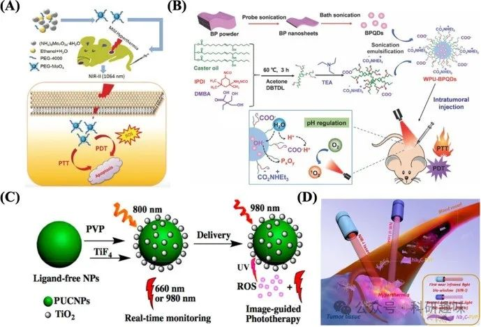

 

#  近红外光疗纳米材料——无机非金属纳米粒子 
 

## 近红外光疗纳米材料——无机非金属纳米粒子

# 碳纳米粒子（C NPs）

碳基纳米粒子（C NPs），作为光热疗法（PTT）中最早应用的光热剂（PTAs）之一，其独特的电学、热学以及显著的近红外吸收特性使其成为该领域的研究热点。这一大类材料，涵盖碳纳米管、氧化石墨烯、石墨烯量子点、碳点及其复合材料，能够在近红外光照射下持续且稳定地产生局部热效应，有效实现癌细胞的消除。

进一步地，C NPs因其固有的疏水性，被开发为高效的药物递送平台，能够负载并稳定携带药物分子，实现PTT与药物治疗的协同增效。Marangon等人创新性地制备了装载m-四羟基苯基氯（mTHPC）的C纳米管，应用于抗卵巢癌的PTT/光动力疗法（PDT）联合治疗。他们发现，mTHPC与C纳米管的结合不仅增强了光稳定性，还促进了癌细胞对药物的摄取，同时减少了药物的非特异性分布（https://doi.org/10.1016/j.carbon.2015.08.023）。

在提升PTT效果方面，Yang等人通过精细调控非共价PEG包覆的超小还原氧化石墨烯（nRGO-PEG）的尺寸与表面覆盖率，在动物实验中实现了更高的体内治疗效率。这一研究强调了材料设计与优化在提升光疗效果中的关键作用（https://doi.org/10.1016/j.biomaterials.2011.11.064）。

然而，尽管C NPs在光疗领域展现出巨大潜力，其临床应用仍面临诸多挑战。首要问题是药物在器官中的累积以及长期潜在的细胞毒性，这要求我们在材料设计与使用策略上不断探索与创新。此外，C NPs的晶格缺陷可能诱导正常细胞发生过氧化损伤，而由其引发的炎症反应更是可能触发成纤维细胞系的急性炎症及DNA损伤，这些安全性问题在推动C NPs临床转化前必须得到妥善解决。

图 5：（A）PEG-MoOx NPs 的合成及 NIR-II 1064 nm 激光诱导的协同 PTT 和温和热疗条件下的肿瘤 PDT 的示意图。(B) WPU-BPQD 治疗示意图。(C）使用 PUCNPs@TiO2 进行实时监测和图像引导光疗的光开关 PDT 方案。(D）二维生物可降解 Nb2C（用 PVP 修饰）在近红外-I 和近红外-II 生物窗口中用于体内光热消融肿瘤的示意图。

# 黑磷纳米粒子（BP NPs）

黑磷（BP），作为磷的一种独特同素异形体，其结构由层层堆叠、易于剥离至超薄纳米尺度的皱褶磷层构成。BP纳米粒子（BP NPs）凭借其卓越的单线态氧（^1O2）生成效率与强大的近红外光吸收能力，在光动力疗法（PDT）与光热疗法（PTT）领域展现出非凡的应用前景。Guo等人的研究聚焦于BP量子点（BPQD）的合成，深入探索了其优异的光敏性能与生物相容性。实验结果显示，BPQD不仅具备高效的1O2生成能力，即便在最高浓度下对HeLa或LO2细胞也几乎不产生暗毒性，进一步验证了在BPQD与光照联合作用下，高达86.8%的癌细胞被有效杀灭，彰显了BP在癌症光疗领域的巨大潜力(https://doi.org/10.1002/smll.201702815)。

为克服BPQD在环境稳定性及水分散性方面的局限，Lu等人创新性地设计了包覆有阴离子水性聚氨酯纳米粒子（WPU NPs）的BPQD（WPU-BPQDs）。这一策略不仅显著提升了BPQD产生活性氧（ROS）的效率，而且WPU NPs独特的电化学双层结构还能有效调节BPQD降解过程中产生的酸性环境，该环境通常对ROS的生成具有抑制作用。通过这一调控机制，ROS的生成得到增强，进而提升了活体光导疗法的治疗效果（如图5B所示）(https://doi.org/10.1039/d0tb02101f)。

尽管BP NPs在生物医学应用中展现出良好的生物相容性与光稳定性，但其进一步的研究与发展仍面临诸多挑战。首要难题在于如何实现BP NPs的大规模、均一化生产；其次，如何通过精细的功能化修饰策略提升其在肿瘤组织中的靶向效率；最后，对BP NPs的生物降解机制及长期生物安全性的深入研究也是不可或缺的，这些问题的解决将是推动BP NPs在临床医学中广泛应用的关键所在。

# 上转化纳米粒子 (UCNPs)

上转换纳米粒子（UCNPs），作为一类将长波长近红外光高效转换为可见光或短波紫外光的纳米材料，其独特的发光机制基于镧系金属、过渡金属或掺锕系元素离子在无机晶体基质中的稳定嵌入。这一特性赋予了UCNPs在光疗领域显著的优势，包括低光损伤、深组织穿透能力、弱光漂白效应以及卓越的光稳定性。自2007年Zhang等人开创性地将NaYF4:Yb3+/Er3+ UCNPs应用于光动力疗法以来，该领域便迎来了新的突破。这些UCNPs在974纳米低能量红外光激发下，能够发射出537和635纳米附近的高能可见光，进一步通过多孔二氧化硅壳层中嵌入的美洛青540（一种光敏剂），实现了ROS的有效生成与MCF-7/AZ乳腺癌细胞的毒性消融，展现了光疗与纳米技术的完美结合（https://doi.org/10.1021/ja0700707）。

UCNPs不仅提升了光治疗剂的光能利用效率，还激发了科研人员对多功能UCNPs的探索热情，特别是在图像引导光疗与多模式疗法方面。Zuo等人设计的TiO2包覆的NaErF4@NaYF4@NaYbF4:0.5%Tm@NaYF4 UCNPs，通过实现紫外-蓝色区域的全光切换，并结合发射光谱的体内监测，成功应用于图像引导下的光导治疗，为精准医疗提供了有力工具（图5C）（https://doi.org/10.1021/acsnano.7b07393）。

尽管UCNPs在光疗领域展现出非凡的光学性能与稳定性，但其较低的转换量子产率（普遍&lt;3%）及有限的生物相容性仍是制约其临床转化的瓶颈。此外，尽管近红外光对生物组织相对安全，但980纳米波长的热效应仍是体内应用时需谨慎考虑的因素。因此，探索更低热效应的激发波长（如915或808纳米）成为研究热点，旨在减少组织损伤。同时，对于UCNPs发射的紫外线可能带来的光致癌等潜在风险，也需在临床应用前进行全面而深入的评估。

# 组合纳米材料（MXenes）

MXenes，作为一类由过渡金属（主要集中在元素周期表的第3和第4族）与碳（C）、氮化物（N）或碳氮化合物组成的二维材料，其化学通式可简化为Mn+1Xn（n = 1-3），其中M代表如钛（Ti）、锆（Zr）、铬（Cr）、钒（V）、铪（Hf）、铌（Nb）、钪（Sc）、钽（Ta）、钼（Mo）等早期过渡金属，X则为C或N。这类材料以其卓越的生物相容性、强烈的近红外光吸收能力以及出色的光电转换效率（PCE），在光疗领域引起了广泛的研究兴趣。

尤为值得注意的是，MXenes表面密布着羟基、氧和氟等官能团，赋予其优异的亲水性和表面可修饰性，为实现自适应的表面功能化提供了可能。Szuplewska等人开创性地探索了Ti2C纳米颗粒（NPs）作为新型、高效且选择性的光热治疗（PTT）试剂的潜力，其在体外实验中展现了显著的近红外光诱导癌细胞消融能力，预示着其作为未来癌症光治疗剂的巨大潜力（https://doi.org/10.1016/j.msec.2019.01.021）。

近红外光谱区域可细分为近红外-I区（650-950纳米）和近红外-II区（1000-1500纳米）。引人注目的是，基于MXene的材料在这两个波段均表现出强大的光吸收能力和高PCE，这显著提升了光能的利用效率并增强了激光在组织中的穿透深度。例如，Lin等人制备的新型碳化铌（Nb2C）MXene，在NIR-I和NIR-II波段均成功实现了对小鼠肿瘤异种移植物的光热破坏。该Nb2C NPs不仅展现出极高的PCE（在NIR-I区为36.4%，在NIR-II区为45.65%），还具备优异的光热稳定性。因此，经Nb2C NPs治疗的小鼠肿瘤在16天内完全消退，且在随后的50天内未出现复发（图5D）（https://doi.org/10.1021/jacs.7b07818）。

尽管MXenes在癌症光疗领域展现出巨大的应用前景，但其临床转化之路仍布满挑战，如MXene NPs的细胞摄取机制尚需深入探究，以及表面修饰对其生物相容性的影响需进一步评估。这些问题的解决将是推动MXenes在光疗领域迈向临床应用的关键所在。

## 参考文献

> Zhang, Y.; Zhang, Y.; Zhang, G.; Wu, J.; Wang, L.; Dong, Z.; Zheng, Y.; Huang, Q.; Zou, M.; Liao, R.; Wang, F.; Liang, P. Recent Advances and Clinical Challenges of Phototherapeutic Nanoparticles in Cancer Monotherapy or Combination Therapy. Coordination Chemistry Reviews 2024, 518, 216069. https://doi.org/10.1016/j.ccr.2024.216069.

#### 相关阅读

### 1. [【JACS】近红外二区刺激响应，多重ROS，精准靶向，无视血脑屏障，外泌体助力纳米催化剂治疗胶质母细胞瘤](http://mp.weixin.qq.com/s?__biz=MzkzOTI1OTMwNg==&amp;mid=2247489348&amp;idx=1&amp;sn=c0aaebb7424e5ebd085ae89c5cb118a3&amp;chksm=c2f2f381f5857a9771ef9e8b92aa286e3fe21e37af073bad36ec84394e0e51708f120aea9c15&amp;scene=21#wechat_redirect)

### 2. [【光动力治疗】一文足够，最全PDT之肿瘤免疫疗法（4）- 光动力材料及调控方法](http://mp.weixin.qq.com/s?__biz=MzkzOTI1OTMwNg==&amp;mid=2247490717&amp;idx=1&amp;sn=f252352c9fa088848a53917ec53e1385&amp;chksm=c2f2f858f585714e016f1e66081a426aa8bddcfb4569684dcc3a2f8606d6c637ac7c128ba5e7&amp;scene=21#wechat_redirect)

### 3. [【Adv. Mater.】纳米药物新综述，用于检测和治疗眼部细菌感染](http://mp.weixin.qq.com/s?__biz=MzkzOTI1OTMwNg==&amp;mid=2247484435&amp;idx=1&amp;sn=f1a023541b4636333bac2a138d11cba3&amp;chksm=c2f2e0d6f58569c0faa99a17197462d6afcf5f343e25ec8f391081e793ba4b70e1ba9e40e5e4&amp;scene=21#wechat_redirect)

预览时标签不可点

素材来源官方媒体/网络新闻

 [阅读原文](javascript:;) 

  继续滑动看下一个 

 轻触阅读原文 

    

