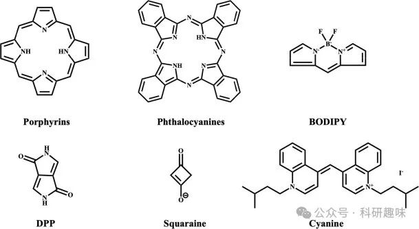
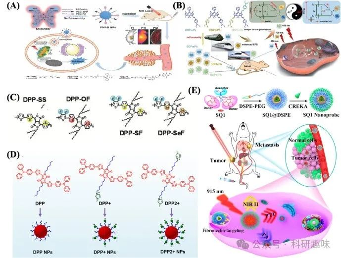
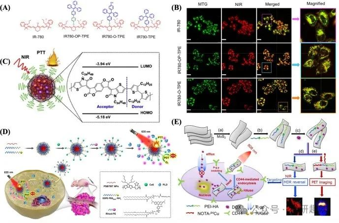

 

#  近红外光疗纳米材料——有机纳米粒子 
 

## 近红外光疗纳米材料——有机纳米粒子

有机光治疗剂包括近红外响应小分子和有机半导体聚合物纳米粒子（NPs）。具有代表性的分子光治疗剂的化学核心结构如图 6 所示。

图 6.具有代表性的分子光治疗剂的化学核心结构。

# 卟啉 NPs

卟啉，作为一种典型的18π电子芳香族大环化合物，其独特的可见光区特征吸收光谱，加之其高效的单线态氧（1O2）生成能力、优异的光热转换特性及荧光性能，在光疗领域展现出非凡的潜力与独特优势。然而，卟啉固有的低水溶性及易于自聚集的缺点，极大地限制了其在癌症光疗中的药物吸收效率与亚细胞定位精度。为解决这一问题，科研人员通过两亲性卟啉分子的自组装策略，成功制备了卟啉纳米粒子（NPs），有效改善了其亲水性能，并显著提升了生物利用度。例如，Pucelik团队合成的两亲性氟化卟啉，不仅实现了精准的细胞内定位，还展现出增强的光毒性及高产量的1O2生成，为癌症光疗提供了新的策略（https://doi.org/10.3390/ijms21082786）。此外，Jin等人开发的叶酸共轭卟啉，通过增强药物的选择性，使得纳米药物在癌细胞中的内化效率较非靶向药物提升了惊人的58.7倍，实现了体内肿瘤的完全消融（https://doi.org/10.1002/adhm.201300651）。

金属有机框架（MOFs），作为一类由金属离子/离子簇与有机配体通过配位键连接而成的多孔有机-无机杂化材料，因其高孔隙率、良好的可功能化特性，在药物/货物递送及癌症治疗领域展现出广阔的应用前景[74]。特别是基于卟啉基有机配体构建的智能MOFs，能够应用于局部光动力治疗（PD），显著提升抗肿瘤的靶向效率。Zhou等人利用Zr6金属簇与四（4-羧基苯基）卟啉配体，结合叶酸（FA）修饰，合成了Zr（IV）基卟啉MOF（PCN-44）。其中，PCN-224表面的FA修饰显著增强了MOF的主动靶向性，从而提高了局部放疗的治疗效果（https://doi.org/10.1021/jacs.6b00007）。

尽管卟啉在光疗领域展现出诸多优势，但其肿瘤穿透力的局限性限制了其在深层或不可触及肿瘤治疗中的应用，主要集中于皮肤癌、膀胱癌等浅表性肿瘤。值得注意的是，卟啉钠（Photofrin®），作为首代获临床批准的光敏剂（PS），以其可忽略的长期副作用、良好的重现性及无耐药性特点，在延长无法手术肿瘤患者的生存期方面发挥了重要作用。然而，治疗过程中伴随的皮肤光敏反应及代谢紊乱问题仍需引起高度重视（https://doi.org/10.1080/14756366.2020.1755669）。

# 酞菁纳米粒子(Pc NPs)

酞菁纳米粒子（Pc NPs）凭借其卓越的热稳定性、高消光系数以及在近红外区域的强烈吸收特性，在光导治疗、半导体技术及非线性光学领域受到了广泛而深入的研究。当前，一种创新的ZnPc光敏剂正处于中国临床II期试验阶段，其推荐的有效剂量设定为0.20 mg/kg（对应于治疗时血浆浓度约1.578 μM），该光敏剂在光动力疗法（PDT）中对抗癌症已展现出显著的临床效果（https://doi.org/10.1007/s00280-020-04096-y）。Li等人通过合成一种具备近红外吸收能力的2-吡啶酮修饰锌酞菁（ZnPc-PYR），旨在提升光在生物组织中的穿透深度，并促进在缺氧肿瘤微环境（TME）中单线态氧（1O2）的释放。此外，该修饰还通过下调缺氧诱导因子-1（HIF-1）的表达，增强了癌细胞对PDT的敏感性，从而实现了治疗效果的显著提升（https://doi.org/10.1039/d1cc00645b）。

Abrahamse等人的研究表明，优化后的金属锌基酞菁（ZnPcSmix）能够有效消融结肠腺癌细胞（如DLD-1和Caco-2），并实现了在溶酶体和线粒体中的精确定位。尤为有趣的是，他们在溶酶体内观察到了由蛋白水解酶cathepsin D诱导的线粒体细胞色素C延迟释放及pH值下降的现象，这进一步揭示了ZnPcSmix介导的PDT诱导细胞凋亡可能与酸性溶酶体的激活密切相关（https://doi.org/10.3390/ijms20133254）。

在2020年，Vendette等人利用封装有氯氰铝酞菁的壳聚糖纳米胶囊对12例宫颈上皮内瘤变（CIN）患者进行了临床治疗尝试。结果显示，其中11例患者（91.7%）在首次评估时宫颈细胞学检查结果转为阴性，而仅有1例（8.3%）未见疗效。值得注意的是，在初次治疗反应良好的11名患者中，虽有两人病情复发，但经过第二轮PDT治疗后，其细胞学结果均得到缓解，并在后续随访中持续保持阴性状态，且所有参与患者均未报告严重副作用（https://doi.org/10.1080/02656736.2020.1804077）。需强调的是，此临床试验仅限于CIN1和CIN2患者，未纳入CIN3或浸润性宫颈癌病例。

另一方面，硅Pc4也已成功完成针对光化性角化病、鲍温氏病及皮肤癌的一期临床试验（Clinical Trials.gov 标识符：NCT00103246）。然而，在针对皮肤癌的初步研究中，尚缺乏全面的药代动力学评估及最大耐受剂量的确立（https://doi.org/10.3389/fonc.2011.00014）。

尽管Pcs展现出诸多优势，但其易在水溶液中聚集及体内清除速率缓慢的问题不容忽视，这些问题不仅降低了其内在荧光强度，还限制了其在PDT中产生活性氧（ROS）的能力，从而构成了Pcs在临床应用中的关键挑战。

# BODIPY纳米粒子 （BODIPY NPs)

BODIPY纳米粒子（NPs）作为一类拥有卓越近红外吸收与发射性能的小分子纳米探针，在癌症光疗领域因其杰出的光稳定性、优异的生物相容性、高摩尔消光系数以及高效的单线态氧（^1O2）生成能力而备受瞩目[83]。Chen等研究团队通过巧妙地将PEG-叶酸与三苯基膦进行功能化修饰，成功制备了具备线粒体双重靶向特性的近红外光响应氮杂-BODIPY衍生物——MeOABBr（即FMAB NPs）。此类NPs在近红外光照射下，能够高效产生活性氧（ROS）并引发高热效应，直接破坏线粒体的能量代谢途径，诱导线粒体功能障碍，最终触发细胞凋亡机制（如图7A所示）[https://doi.org/10.1039/c8tb01347k]。

Zou等人则另辟蹊径，合成了三种智能型BODIPY化合物（BDPmPh、BDPbiPh、BDPtriPh），这些化合物通过引入不同数量的二乙基氨基苯基基团进行调控，展现出对肿瘤特异性信号的响应能力，实现了在肿瘤治疗中的可控穿透深度（如图7B所示）。尤为引人注目的是，BDPtriPh NPs在813纳米波长处展现出最长的近红外吸光度，并达到了60.5%的高光子转换效率（PCE），这一特性不仅意味着其光穿透能力极强，还预示着在光疗应用中能够实现卓越的治疗效果。通过胰蓝染色实验进一步验证了BDPtriPh NPs出色的生物相容性与光毒性特性。此外，这些NPs在酸性肿瘤微环境（TME）中的质子化过程还能进一步提升其PCEs，为癌症的光动力疗法（PDT）/光热疗法（PTT）提供了波长与pH值双重调控的新策略[https://doi.org/10.1039/c8sc02443j]。

图 7：（A）用于多模态成像引导的 PDT/PTT 的 FMAB NPs。(B) BDPmPh、BDPbiPh 和 BDPtriPh NPs 的制备和应用示意图，以及 pH 触发 NPs 增强 PDT/PTT 的机理[85]。(C) DPP-SS、DPP-OF、DPP-SF 和 DPP-SeF 的化学结构 (D) DPP、DPP+ 和 DPP2 + NPs 的制备示意图 (E) 用于转移性乳腺癌 NIR-II/PA 双模成像和光热消融的水杨酸染料 SQ1 的分子工程和纳米功能化

鉴于共价有机框架（COFs）所固有的优异有机特性、杰出的水稳定性、高度结晶性以及多孔结构，它们已逐渐崭露头角，成为一类极具潜力的纳米药物候选材料。Guan及其团队巧妙地将BODIPY分子与COF LZU-1相结合，通过精准的键合缺陷功能化策略，成功制备了LZU-1-BODIPY-2I纳米颗粒（NPs）。尽管BODIPY在NPs中的浓度相对较低，但LZU-1-BODIPY-2I NPs却展现出了对HeLa和MCF-7癌细胞系显著的消融能力。尤为重要的是，LZU-1对MCF-10A正常细胞表现出极低的细胞毒性，这一发现不仅凸显了COFs材料卓越的生物相容性，也为其在协同光疗抗癌领域的应用奠定了坚实的基础[https://doi.org/10.1016/j.isci.2019.03.028]。

尽管BODIPY相关领域的研究近年来取得了长足进展，但其在生物学层面的探索仍处于起步阶段。此外，当前BODIPY NPs的细胞摄取效率相较于多数商业化抗癌药物而言仍显不足。因此，为了进一步提升NPs的内吞能力，增强治疗效果，并推动其向临床应用的转化，亟需深入探索主动靶向技术。通过优化NPs的表面修饰、引入特异性识别基团等手段，有望实现BODIPY NPs在生物体内的精准定位与高效递送，从而为癌症治疗开辟新的途径。

# DPP NPs

DPP（二苯并[b,d]噻吩并[3,2-b]噻吩）因其可调谐的光物理性质、高分子吸收系数、卓越的光稳定性及低暗毒性，在有机太阳能电池、荧光传感以及生物成像等前沿领域展现出广泛应用潜力[87]。DPP的独特供体-受体分子架构促进了HOMO（最高占有分子轨道）与LUMO（最低未占有分子轨道）的有效分离，同时缩小了S1（单重激发态）与T1（三重激发态）间的能隙，进而促进了单线态氧（^1O2）的高效生成，这对于光动力疗法（PDT）尤为重要。

Liu等科研团队深入探索了引入硫原子与氟原子的DPP衍生物（DPP-SeF），通过增强π-π堆叠与F⋯H相互作用，成功将光电转换效率（PCE）从32%提升至62%（如图7C所示），显著增强了光响应性能。在808纳米激光照射下，DPP-SeF对A549癌细胞的半数抑制浓度（IC50）由15.14 μg/mL降低至8.36 μg/mL，显示出增强的细胞毒性。尤为值得关注的是，DPP-SeF还展现出了优异的肿瘤组织光声成像能力和体内光热转换效应，为癌症的光声成像引导光热治疗（PTT）提供了新策略[https://doi.org/10.1039/d0bm01569e]。

为了实现更为精准的细胞器靶向，Li等人设计并合成了阳离子咪唑官能化的线粒体靶向DPP²⁺纳米颗粒（DPP2⁺ NPs）。该纳米系统显著提升了细胞对靶向线粒体的药物摄取效率，同时维持了较高的细胞膜电位，从而优化了PDT与PTT的协同治疗效果，并有效减少了非特异性毒性（如图7D所示）[https://doi.org/10.1021/acsami.0c06144]。

此外，Gao等研究团队聚焦于分子异构化对光电性能的影响，开发了结合顺/反-萜烯基苯酚的DPP NPs。特别是反式构型的萜烯基苯酚通过其醌共振效应增强了DPP的平面骨架稳定性，延长了有效共轭长度，在808纳米波长处实现了强吸收光谱。这一创新设计使得反式DPP NPs的PCE高达61.4%，相较于顺式DPP NPs（29.4%）提升了近210%，为提升DPP基光疗材料性能开辟了新的途径[https://doi.org/10.1021/acsami.0c16064]。

尽管DPP NPs在光疗领域取得了显著进展，但其临床应用仍面临挑战。首要问题是许多DPP NPs依赖增强渗透与滞留（EPR）效应被动富集于肿瘤组织，可能伴随正常组织的非特异性损伤。因此，在生物应用中需全面评估DPP衍生物的体内降解情况。此外，深入探索DPP衍生物的结构-性能关系，对于克服基于DPP的光疗局限性、推动其临床转化具有重要意义。

# 方酸 NPs

方酸染料，作为一类拥有缺电子中心四元环π-共轭结构的共振稳定齐聚物分子，凭借其独特的平面构型与齐聚物特性，在荧光发射、近红外吸收以及结构稳定性方面展现出卓越性能，近年来成为科学界关注的焦点。特别是在纳米制备过程中，方酸纳米粒子（NPs）通过J型聚集效应，能够显著地将吸收光谱红移至近红外区域，从而拓宽了其应用范围。Sun及其团队精心设计并合成了J型聚集的方酸NPs（SQP-NPs(J)），其近红外吸光度峰值达到901 nm，荧光发射峰则位于1036 nm，相较于H型聚集的SQP-NPs(H)，其发射强度实现了4.8倍的提升。此外，SQP-NPs(J)的光电转换效率（PCE）高达36%，在药物内化和光照条件下，对肿瘤细胞的光消融效果更为显著[https://doi.org/10.1039/c8cc08096h]。

近期，Yao等研究人员通过引入丙二腈这一强吸电子基团，对方酸受体进行了强化改造，成功开发出一种适用于NIR-II区域的方酸染料（SQ1）。为了提升乳腺癌肺转移的治疗效率，他们进一步将SQ1 NPs表面修饰以活性靶向配体CREKA肽（图7E），实现了对肿瘤细胞的精准识别与结合。在NIR-II成像与光声成像的双重引导下，实现了对肿瘤细胞的全面光热消融，为癌症治疗开辟了新的路径[https://doi.org/10.1021/acsami.9b20147]。

尽管方酸染料在光疗领域展现出巨大潜力，但其发展仍面临诸多挑战。首要问题是方酸染料分子中的四元碳环结构易受亲核攻击，因此迫切需要进行结构优化以提高其稳定性。此外，增溶配体或封装策略虽能有效提升方酸染料的生物相容性，但同时也可能带来介质体积增加、削弱EPR效应（增强渗透与滞留效应）等不利影响。因此，在未来的研究中，需深入探索更加高效、安全的方酸染料改性方法，以推动其在生物医学领域的广泛应用。

# Cyanine NPs

花菁染料，作为一类由π-共轭聚甲基链与多种氮杂环（诸如吡咯、咪唑、噻唑、苯并噻唑、吡啶或喹啉）构筑的化合物，其结构的多样性源于这些杂环的灵活组合。这类染料凭借其高摩尔吸收率、狭窄的吸收/发射光谱带、合理的荧光量子产率、可调谐的近红外荧光分布、良好的生物相容性以及低毒性，成为了成像引导治疗领域生物学研究的优选材料。市场上现有的花菁染料种类繁多，包括但不限于吲哚菁绿（ICG）、IR-125、IR-820、IR-830、Cy7.5、DiR、HITCI、IRDye800cw、IR-783、IR12-N3、Cy7、IR-775、IR-780、IR-806、IR-797、IR-140、CF770 和 Alex Fluo@750等。其中，ICG以其卓越的近红外吸收能力、鲜明的荧光特性及低暗毒性，在肝脏、心血管及前哨病变的诊断中展现出广阔前景。此外，ICG还被证实为一种有效的光热剂，能在近红外光照射下通过诱导氧化应激来抑制肿瘤生长。

然而，ICG亦存在光稳定性差、光漂白显著及对癌细胞特异性不足等缺陷。为克服这些局限，研究者们不断探索新型花菁染料。例如，Atchison等人开发了IR-783的碘化衍生物，旨在增强ISC过程并优化单线态氧（^1O2）的生成。与ICG相比，该衍生物在BxPC-3和MIA PaCa-2胰腺癌细胞系及小鼠模型中的光动力治疗（PDT）效果显著提升，预示着IR-783介导的PDT有望成为治疗高度侵袭性肿瘤的一种有前景的姑息性策略[https://doi.org/10.1039/c6cc09624g]。

另一典型花菁基光疗剂IR780，因其能特异性靶向肿瘤细胞线粒体而备受关注。然而，其光稳定性不足严重限制了其临床应用。为此，Zhao等人巧妙地引入了聚集诱导发光（AIE）特性的四苯乙烯（TPE）单元至七甲基花菁IR-780中，合成了IR780-O-TPE。这一创新不仅显著改善了IR-780的光稳定性、细胞吸收能力及靶向效率（图8A），还通过TPE的加入优化了其疏水性，增强了与线粒体膜的相互作用，从而实现了更高效的线粒体靶向（图8B）。在治疗效果上，IR780-O-TPE展现出了更高的细胞毒性，其IC50值在无光照条件下为3.3 μM，而在光照条件下降低至0.3 μM，明显优于IR-780。此外，在4T1肿瘤小鼠模型中，IR780-O-TPE也展示了比IR780更为有效的光热治疗（PTT）反应，标志着花菁治疗剂物理性质的优化，为其在临床光疗中的广泛应用奠定了坚实基础[https://doi.org/10.1021/acsami.0c01715]。

图 8. (A) IR-780 探针的结构。(B) 用于线粒体追踪的 IR-780 探针的细胞器靶向。(C) 用于光热疗法的 NPPBTPBF-BT 的制备示意图。(D) PLD 可激活的肿瘤图像和 PTT/PDT 联合疗法。(E）MoS2-PEI-HA 纳米片作为一种多功能平台，在 PET 成像引导下对 MCF-7-ADR 细胞进行靶向和多重刺激响应治疗。

目前，梅洛青 540 已被用于临床前模型和美国的一项 I 期临床试验，用于对受白血病或淋巴瘤污染的自体骨髓移植物进行体外净化，并产生了相当大的细胞损伤[https://doi.org/10.1016/s1011-1344(00)00021-x]。然而，氰基 NPs 的优势并不稳定，有关氰基荧光团的光电转换反应的基本机制仍不清楚。

# 有机半导体聚合物 (SP) NPs

SP纳米颗粒（SP NPs）作为一类先进的有机光学纳米材料，凭借其卓越的吸收系数、优异的光稳定性、良好的生物相容性以及易于表面功能化的特性，在光治疗剂领域展现出巨大潜力。这些纳米颗粒的核心结构通常由SP分子与两亲性聚合物基质精心构建，相较于单独的SP分子，SP NPs在光学性能和生物相容性方面实现了显著提升。

为了深化SP NPs在光疗中的应用深度，Cao等人创新性地开发了有机PBTPBF-BT NPs。这类纳米粒子在1064纳米的近红外-II区域展现出了强大的吸收能力，其光电转换效率（PCE）高达66.4%，标志着光热转换效率的重大突破（图8C）。实验证明，即使在较低的功率密度条件下，PBTPBF-BT NPs也能有效促进肿瘤细胞的消融，同时在肿瘤区域获取的光声（PA）图像中，信号强度在注射后8小时内迅速攀升至峰值，充分展示了其在成像引导光热治疗（PTT）中的巨大应用前景[https://doi.org/10.1016/j.biomaterials.2017.11.016]。

近期，Bao等人在SP NPs的基础上，进一步开发出了一种集生物标记识别与光疗功能于一体的治疗纳米平台——PSBTBT NPs。该平台不仅能够应用于放射生物成像，还能引导协同的光动力治疗（PDT）与光热治疗（PTT），实现了治疗手段的多元化与精准化（图8D）。尤为值得关注的是，该平台巧妙地利用了人类恶性肿瘤中特异性过表达的生物标记物PLD，该标记物能够特异性裂解罗丹明B，从而恢复其荧光，这一机制不仅为肿瘤的诊断提供了可激活的荧光成像手段，还增强了光疗的靶向性，实现了对肿瘤细胞的精准打击[https://doi.org/10.1021/acs.biomac.0c01567]。

尽管聚合物材料在生物医学领域的应用已日趋广泛，但SP NPs对于特定细胞类型（如红细胞、免疫细胞及干细胞）命运与功能的影响机制尚不完全清晰，这要求我们在未来的研究中进一步深入探索，以全面评估并优化SP NPs的生物安全性与治疗效果。

## 参考文献

> Zhang, Y.; Zhang, Y.; Zhang, G.; Wu, J.; Wang, L.; Dong, Z.; Zheng, Y.; Huang, Q.; Zou, M.; Liao, R.; Wang, F.; Liang, P. Recent Advances and Clinical Challenges of Phototherapeutic Nanoparticles in Cancer Monotherapy or Combination Therapy. Coordination Chemistry Reviews 2024, 518, 216069. https://doi.org/10.1016/j.ccr.2024.216069.

#### 相关阅读

### 1. [【JACS】近红外二区刺激响应，多重ROS，精准靶向，无视血脑屏障，外泌体助力纳米催化剂治疗胶质母细胞瘤](http://mp.weixin.qq.com/s?__biz=MzkzOTI1OTMwNg==&amp;mid=2247489348&amp;idx=1&amp;sn=c0aaebb7424e5ebd085ae89c5cb118a3&amp;chksm=c2f2f381f5857a9771ef9e8b92aa286e3fe21e37af073bad36ec84394e0e51708f120aea9c15&amp;scene=21#wechat_redirect)

### 2. [【JACS】不要光，不要氧，无副作用，新型ROS治疗试剂实现更智能的癌症治疗](http://mp.weixin.qq.com/s?__biz=MzkzOTI1OTMwNg==&amp;mid=2247488411&amp;idx=1&amp;sn=705561c7c1dfc50cf9e83ab2c78c0434&amp;chksm=c2f2f75ef5857e48a06ff806844244f72abefb445b1990cbf488ca179e44646435440d6e515f&amp;scene=21#wechat_redirect)

### 3. [【JACS】热激活延迟荧光（TADF）和热激活延迟磷光（TSDP）的有机结合](http://mp.weixin.qq.com/s?__biz=MzkzOTI1OTMwNg==&amp;mid=2247490722&amp;idx=1&amp;sn=91fb1e6748572b4f1366116d6c7f75c8&amp;chksm=c2f2f867f5857171107bbae42faad9d656d8454a8a9939c8cd631df3517f55dea620843832c6&amp;scene=21#wechat_redirect)

预览时标签不可点

素材来源官方媒体/网络新闻

 [阅读原文](javascript:;) 

  继续滑动看下一个 

 轻触阅读原文 

    

