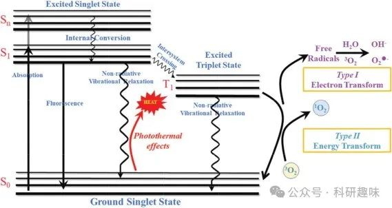
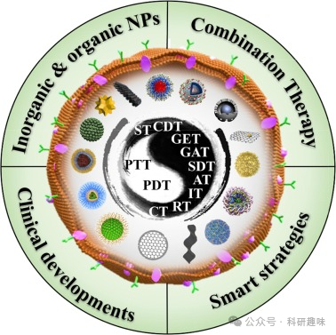

 

#  近红外光疗纳米材料——肿瘤光疗的原理 
 

## 近红外光疗纳米材料——肿瘤光疗的原理

# 简述

癌症，这一全球肆虐的恶性疾病，以其高发病率与死亡率，对人类健康构成了严峻挑战。据美国癌症协会最新预测，2023年，美国境内将新增癌症病例高达1,958,310例，并有609,820人将不幸因癌症离世。鉴于此，癌症治疗不仅是一项全球性任务，更是对社会福祉的深刻影响。当前，临床实践中主要依赖手术、化学疗法及放射疗法作为抗癌手段。然而，这些方法常因复发风险高、副作用显著及全身毒性等问题，其疗效往往难以达到理想状态，尤其是手术对于中晚期已发生转移的肿瘤，其治疗效果尤为有限。此外，即便微小至单个的癌症干细胞残留，亦可能重新激发肿瘤生长。化疗药物在长期应用中则易引发耐药性，限制其持续疗效；而放疗虽为常规治疗手段，却也不可避免地对周边健康组织造成一定损伤。因此，探索更为安全、高效的肿瘤治疗新技术显得尤为迫切。

光疗，作为一种非侵入性治疗手段，在肿瘤治疗领域展现出了巨大潜力，其高效性、高选择性和低耐药性特点，正逐步成为研究热点。光疗主要包括光热疗法（PTT）与光动力疗法（PDT）两大分支。PTT利用光热转换剂（PTA）将光能转化为热能，局部升温以直接消融肿瘤细胞；而PDT则依赖于光敏剂（PSs）在特定波长光照下激发分子氧生成细胞毒性活性氧（ROS），通过氧化应激机制杀伤癌细胞。PDT作为光疗的经典代表，已在临床实践中应用了四十余年，自1993年卟啉钠作为首代PS获批用于治疗复发性浅表乳头状膀胱癌以来，多种PS已被成功应用于前列腺癌、皮肤癌及食管癌等多种实体瘤的治疗中。

鉴于肿瘤微环境（TME）的复杂特性，光疗对激发光的高穿透性提出了严格要求。传统可见光因穿透深度不足而受限，相比之下，近红外（NIR）光因其对生物组织（如蛋白质、黑色素、血红蛋白、胶原蛋白及水）的低吸收性，成为光疗的理想光源，能有效减少脱靶效应，提升治疗精准度与效果。因此，近红外光治疗剂备受瞩目，其应用不仅能减少手术需求，缩短康复周期，保护器官功能，还能显著降低局部与全身治疗的复发率。

尽管传统光疗已步入临床应用，但肿瘤深度、药物靶向性及毒性控制等问题仍制约其疗效的进一步提升。为此，光治疗剂的分子设计与结构优化成为关键突破点。纳米技术的飞速发展，为新型光治疗纳米粒子（NPs）的研发开辟了新途径。纳米药物凭借其高比表面积与纳米尺度效应，能更有效地通过肿瘤组织的增强渗透与滞留（EPR）效应实现局部蓄积，并通过能量依赖的内吞作用进入肿瘤细胞，从而在降低药物剂量、耐药性及副作用的同时，最大化光疗效果。然而，单光疗模式因光的穿透深度限制、活性氧快速耗散及热休克蛋白（HSPs）耐热性等固有缺陷，往往难以达到理想疗效。

为解决这一问题，非侵入性光疗与其他治疗手段的联合应用应运而生，为肿瘤治疗提供了更为全面、高效的解决方案。联合疗法不仅能够增强各治疗手段的协同效应，使整体疗效远超单一疗法之和，还能通过优化给药效率、加速药物释放等途径，弥补光疗的不足之处，共同激发最大的治疗效果。这一创新策略，无疑为肿瘤治疗领域带来了新的曙光。

在这篇综述中，我们将全面介绍近红外光疗纳米材料的最新进展及其在精确癌症单一疗法中的应用。为了总结癌症光疗的最大治疗应用并概述其在癌症治疗中的潜在功能，我们还集中介绍了纳米材料与其他治疗方法（如化疗、放疗、免疫疗法、抗血管生成疗法、声动力学疗法、气体疗法、基因疗法和饥饿疗法）的联合光疗。此外，还综述了光治疗剂的智能改性。此外，还介绍了用于癌症治疗的光治疗剂的实际临床案例。最后，我们对光疗在癌症治疗及其临床应用方面的当前挑战和未来前景进行了公正的概述。

# 历史

光疗法在医学领域的应用可追溯至三千余年前的古代文明，古埃及与印度的先民们便智慧地运用阳光激活草药中的补骨脂素成分，以治疗白癜风病症（https://doi.org/10.1021/cr900300p）。这一古老实践预示着光疗潜力的萌芽。至19世纪末，科学界迎来了光疗发展历程中的一次重要转折。1900年，奥斯卡-拉布（Oscar Raab）偶然间发现，在特定染料与光线的共同作用下，寄生虫能被有效杀灭，而这一效应在无光环境中则不复存在，这一发现催生了“光动力作用”这一科学术语的诞生（https://doi.org/10.3390/jcm8101581）。

1903年，Von Tappeiner与Jesionek的开创性工作更是将光动力疗法（PDT）推向了临床应用的前沿，他们首次利用局部曙红结合白光成功治疗了皮肤肿瘤（https://doi.org/10.3390/cancers9020019），标志着PDT时代的正式开启。

时间流转至20世纪70年代，医学界迎来了PDT发展的又一里程碑。梅奥诊所的R. L. Lipson与S. Schwartz引入了第一代光敏剂——血卟啉衍生物（HpD），将其应用于癌症治疗，这一创新不仅极大地推动了PDT领域的发展，更为癌症治疗开辟了新的路径（https://doi.org/10.1038/bjc.1975.30）。随后，在1993年，加拿大率先批准了纯化后的血卟啉衍生物Photofrin用于治疗膀胱癌，进一步巩固了PDT在癌症治疗中的地位（https://doi.org/10.1089/clm.1996.14.219）。

然而，随着研究的深入，第一代PSs因其复杂的化学成分、高频率的皮肤过敏反应及有限的光穿透深度等局限性，逐渐难以满足临床需求。在此背景下，第二代PSs应运而生，它们包括卟啉、卟吩、金属酞菁及融合环醌衍生物等，展现出更高的吸光度（集中在650-800纳米范围）及更为优越的治疗特性。尽管如此，第二代PSs仍面临着生物相容性差、特异性不足、严重皮肤过敏反应及显著副作用等挑战，限制了其广泛应用。

为克服上述难题，当前研究正聚焦于开发具有更强靶向能力及更佳生物相容性的第三代光敏剂（PSs）或光热转换剂（PTAs），这些新型治疗剂在实验室研究与临床应用中均展现出巨大潜力，有望成为未来抗癌治疗的新希望。

# 肿瘤光疗的定义及机理

在光疗的广阔领域中，依据其独特的治疗机制，可明确划分为光动力疗法（PDT）与光热疗法（PTT）两大类别，如图1所示（https://doi.org/10.1002/adhm.201701211）。PDT作为一种非侵入性的癌症治疗手段，其核心在于光、光敏剂（PS）与氧这三者的协同作用。具体而言，PS在吸收特定波长的光能后，可经由I型或II型PDT路径，触发电子转移或能量传递过程，进而生成细胞毒性活性氧（ROS），这些ROS对肿瘤细胞构成致命威胁，诱导其凋亡或坏死。

另一方面，PTT则是一种利用光热效应诱导细胞凋亡的创新策略，其核心机制在于通过光吸收激发电子，随后发生非辐射性衰变，释放出的动能转化为热能，从而提升组织温度至高温状态（hyperthermia）。鉴于肿瘤组织内血管结构的异质性，相较于正常组织，肿瘤组织对高温表现出更高的敏感性。当生物组织周围环境温度攀升至43°C以上时，这一高温环境将对细胞内的蛋白质结构及DNA功能造成难以逆转的损害，进而触发细胞凋亡与坏死过程，实现治疗目的。

图 1.用于光疗的雅布隆斯基示意图（https://doi.org/10.1039/d1tb00349f）

# 光诊疗试剂的分类

在光治疗领域，一系列基于分子的光敏剂，诸如porfimer、氨基乙酰丙酸及temoporfin等，凭借其卓越的单线态氧产量与强大的抗肿瘤活性，已成功步入临床应用阶段，并取得了显著的治疗效果。然而，这些分子光疗药物面临的疏水性挑战、潜在的皮肤光毒性风险以及有限的靶向性能力，促使科研界积极探索创新策略。通过将光敏剂分子进行封装与纳米组装，形成纳米颗粒（NPs），不仅显著增强了药物的生物相容性，还实现了更为精准的靶向递送，为肿瘤光疗的深入发展铺平了道路。

近年来，随着纳米技术的飞速发展，一系列先进的纳米材料应运而生，它们在肿瘤光疗中展现出巨大潜力。这些纳米材料涵盖了无机与有机单一光疗NPs（如表1所示）、融合了多种治疗机制的组合光疗NPs、以及采用智能策略设计的肿瘤光疗纳米药物。此外，还有部分纳米制剂已成功进入临床试验阶段（如图2所示），这些成果共同验证了纳米材料在提升肿瘤治疗效率方面的显著优势。通过精准调控纳米材料的尺寸、形状、表面性质及功能化修饰，研究者们能够进一步优化药物的体内分布、增强肿瘤组织穿透力、减少副作用，并实现对肿瘤细胞的精准打击，从而为癌症患者带来更加安全、有效的治疗选择。

Table 1. Phototherapeutic agents and their therapeutic activities.

| Phototherapeutic agent | Mechanism | Advantages | Disadvantages |
| --- | --- | --- | --- |
| Au | PTT | Efficient PCE, great biocompatibility and penetrate deep tissues | Instability and retention possibility in vivo |
| Ag | PDT/PTT | Anti-bacterial properties and oxidatively stressing tumors | Oxidation and poor biocompatibility |
| Cu | PDT/PTT | Widely tunable absorption in the NIR region | Unpredictable pharmacokinetics, undesired biocompatibility, and detention toxicity |
| Fe | PTT | Distinctive magnetism | Lack of study on long-term effects on the living body |
| W | PTT | Strong NIR absorption and high PCE | The possibility of long-term toxicity |
| Mo | PDT/PTT | Great biocompatibility, high PCE, and excellent NIR absorption | Lack of study in potential toxicity and biological safety along with drug metabolism |
| C | PDT/PTT | Stably generating local hyperthermia and using it as drug delivery platforms | Causing peroxidation damage for normal cells and inducing acute inflammation |
| BP | PDT/PTT | High production efficiency of 1O2 and great NIR absorption | Lack of biodegradation mechanism and long-term biosafety |
| UC | PDT | Minimized photodamage, weak photobleaching, and great photostability | Potential side effects of emitted UV light |
| MXenes | PTT | High biocompatibility, strong NIR absorption, and excellent PCE | Lacking of cellular uptake pathway |
| Porphyrins | PDT/PTT | High 1O2 production efficiency, photothermal property, and outstanding fluorescence performance | Low water-solubility and easy self-aggregation |
| Phthalocyanines | PDT | Thermal stabilities and high extinction coefficients | Easy aggregation in aqueous solution and slow clearance from the body |
| BODIPY | PDT/PTT | Desired 1O2 generation, biocompatibility, and photostability | Low cellular uptake efficiencies |
| DPP | PDT/PTT | Tunable photophysical property, excellent photostability, and low dark toxicity | Damage to normal tissue and longer post-treatment darkroom processing times |
| Squaraine | PDT/PTT | Significant fluorescence, strong NIR absorption, and distinguish stability | Susceptible to being attacked by nucleophilic effects |
| Cyanine | PDT/PTT | High molar absorptivity, narrow absorption/emission band, and reasonable fluorescence quantum yield | Instability in light |
| SP | PDT/PTT | Excellent photostability, and good biocompatibility | Unclear the impact of SP NPs on the fate and function of certain cell types |

图 2.不同类型的光疗 NPs。我们指出了最常报道的纳米粒子的结构。插入：PTT：光热疗法；PDT：光动力疗法；CT：化疗；RT：放疗；IT：免疫疗法；AT：抗血管生成疗法；SDT：声动力疗法；GAT：气体疗法；GET：基因疗法；CDT：化学动力疗法；ST：饥饿疗法。

## 参考文献

> Zhang, Y.; Zhang, Y.; Zhang, G.; Wu, J.; Wang, L.; Dong, Z.; Zheng, Y.; Huang, Q.; Zou, M.; Liao, R.; Wang, F.; Liang, P. Recent Advances and Clinical Challenges of Phototherapeutic Nanoparticles in Cancer Monotherapy or Combination Therapy. Coordination Chemistry Reviews 2024, 518, 216069. https://doi.org/10.1016/j.ccr.2024.216069.

#### 相关阅读

### 1. [【Angew】分子光，更有潜力的活体成像及光动力治疗方法！](http://mp.weixin.qq.com/s?__biz=MzkzOTI1OTMwNg==&amp;mid=2247484977&amp;idx=1&amp;sn=add31a28465297107e65c1d2e73dc75b&amp;chksm=c2f2e2f4f5856be252e4b51e36de62a178402b643dcd14a6dc8368f5e8daa157195e7476e711&amp;scene=21#wechat_redirect)

### 2. [【光动力治疗】一文足够，最全PDT之肿瘤免疫疗法（1）——前言](http://mp.weixin.qq.com/s?__biz=MzkzOTI1OTMwNg==&amp;mid=2247490712&amp;idx=1&amp;sn=bdd4163593e10d73dfdc419b7d8bca9c&amp;chksm=c2f2f85df585714babf8fdcccb886ba6603b8687a83d8db7c06009ef4afccd3a310396e72d5b&amp;scene=21#wechat_redirect)

### 3. [【PDT诊疗探针】ROS/RNS/H₂S可激活治疗诊断探针](http://mp.weixin.qq.com/s?__biz=MzkzOTI1OTMwNg==&amp;mid=2247489674&amp;idx=1&amp;sn=e85eeda5ea87f6af2e733dabc040f66e&amp;chksm=c2f2fc4ff58575594e1101818b555279733739ee9dcf2a4a225ed23be2bb832d94f3e0a3eb92&amp;scene=21#wechat_redirect)

预览时标签不可点

素材来源官方媒体/网络新闻

 [阅读原文](javascript:;) 

  继续滑动看下一个 

 轻触阅读原文 

    

