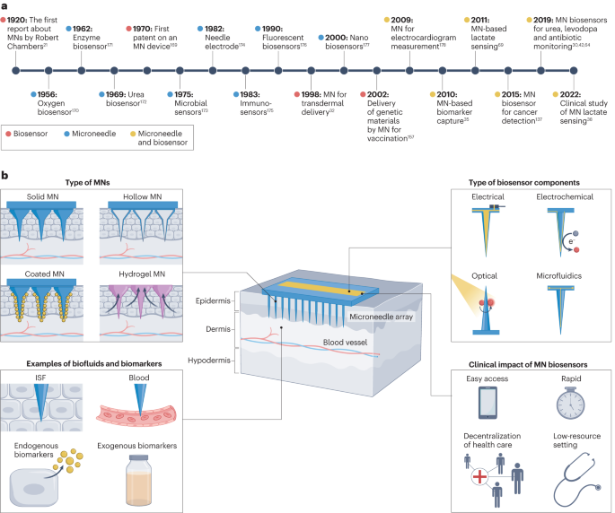
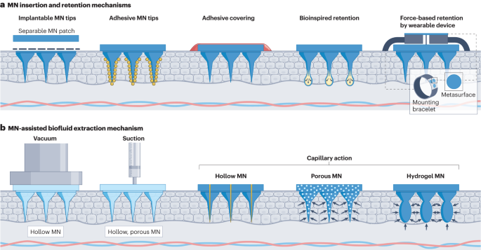
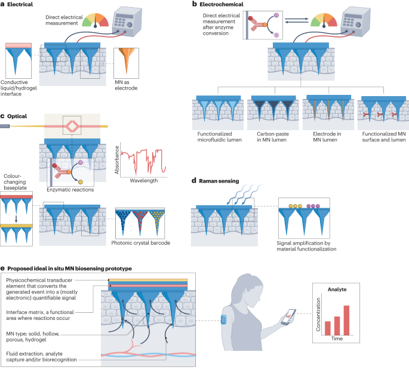
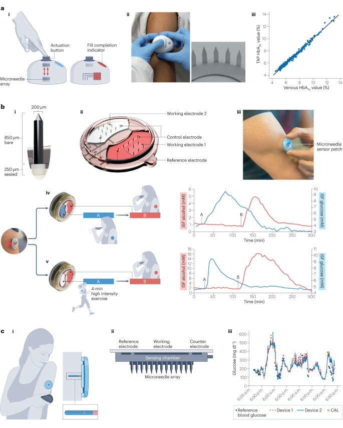

 

#  【Nat. Rev. Bioeng.】重磅综述，基于微针的生物传感器 
 
 原创

微针

Microneedle

微针（MNs）是微小的针头，通过微创方式应用于皮肤，旨在促进透皮给药和/或吸收皮肤间质中的各种生物标记代谢物。一旦采集了这些代谢物，可以进行采样后分析或实时原位生物传感，以用于疾病诊断和药物监测。

**目**

**录**

- **前言**
- **用于生物传感的MNs类型**
- **与生物传感器相结合的 MNs**
- **临床应用**
- **转化方面的考虑**

前言

代谢物既是基因组输出的结果，也是环境输入的产物。检测、鉴定和定量内源性（基因相关）和外源性（环境相关）代谢物，即代谢轮廓分析，有助于深入了解疾病状态，促进精确诊断和个性化治疗。虽然血液采样通常被视为金标准，但其侵入性和高成本促使人们寻求替代方法，如从唾液、汗液和泪液中采集生物标记物。皮肤间质（ISF）含有丰富的生物标记物，因此使用微针（MNs）技术可实现无创采样和监测。

图1. A）微针（MNs）和生物传感器领域主要发展和里程碑。B）基于微针的生物传感器概念图。

用于生物传感的 MNs 类型

多孔介质能够无痛穿透皮肤角质层，形成微小孔隙，用于有效传递那些不适合经皮给药的药物和疫苗。除了用于给药，微针（MNs）还在诊断领域被广泛应用。根据它们穿透皮肤的深度，它们可以用于提取皮肤间质液（ISF）和血液。MNs还可用作皮肤内电极。MNs设备可以通过简单的贴片或手持涂抹器的方式使用。此外，基于MNs的生物传感器可以整合到设备中，例如腕带。有几种类型的MNs已用于传感器或其他诊断应用，包括固体、包覆、多孔、溶解、水凝胶和空心MNs。固体MNs通常由金属制成，需要额外的采样步骤。包覆MNs改进了固体MNs，可用于检测多种生物标志物。多孔MNs具有微孔结构，可提高ISF吸收。空心MNs通过中心的空心孔提取ISF或血液，并可用于不同分析技术。水凝胶成型MNs是由可吸收液体的聚合物制成，可用于诊断和传感应用。

图2. A)微针（MNs）插入和保留在皮肤内进行生物标记取样的机制。B)利用真空、抽吸和毛细作用，通过空心 MNs和多孔 MNs 以及水凝胶 MNs 的膨胀，实现 MNs 辅助间质液体提取技。

与生物传感器相结合的 MNs

生物传感微针（MNs）设备设计通常采用两种策略：功能化材料或集成传感模块。选择取决于MNs类型、目标分析物和分析难度。这两种策略都支持原位和原位反馈，以实时或离线方式进行分析，并可进行多重分析。其中，电传感器和电化学传感器通常与多孔和空心MNs结合，用于监测ISF成分、皮肤屏障或电解质平衡。电传感器积聚分析物在电极上，然后MNs取下进行分析。电化学传感器在MNs电极上涂有化学成分，检测电势变化来量化生物分析物，如葡萄糖。这些电极可通过MNs材料功能化，将酶固定在上面，实现特定分析物的检测。也可使用带有微流体通道的MNs来分析分析物。光学传感器可通过光流体技术与MNs集成，测量光线强度以检测生物标志物。拉曼传感可通过功能化MNs实现原位分析，用于葡萄糖等分析物的检测。不同MNs材料和功能化方法可用于多种分析物的选择性检测。

图3. 原位生物传感机制包括a）电传感器；b）电化学传感器；c）光学传感器；d）拉曼传感器。

临床应用

基于微针（MNs）的生物传感器技术在不同应用领域都具有广泛的潜力，以下是一些相关应用和原型示例：

- **表层和深层体液传感：**表层传感示例：二氧化硅空心 MNs 可导入皮下组织，结合葡萄糖氧化酶生物传感器，用于监测皮肤 ISF 中的葡萄糖水平。深层体液传感示例：基于 MNs 的传感器可以直接插入肿瘤微环境或感染部位，以监测生物标志物或感染情况。
- **治疗药物监测：**基于 MNs 的一次性使用传感器可以用于监测治疗药物浓度，例如，连续监测帕金森病药物左旋多巴的浓度。可穿戴 MNs 设备可以实时监测药物浓度，帮助医护人员个性化调整患者的治疗。
- **癌症和感染诊断：**基于 MNs 的传感器可用于癌症诊断，例如，通过检测皮肤中的酪氨酸酶过度表达来诊断恶性黑色素瘤。用于感染诊断，例如，检测 SARS-CoV-2 抗体，可快速诊断 COVID-19。
- **一次性使用和实时监测：**一次性使用的 MNs 设备可以用于采集生物样本，如血液或 ISF，进行分析。

基于 MNs 的传感器可用于连续、实时监测多种生物标志物，例如葡萄糖、乳酸和酒精。

这些技术可以改善医疗保健的效率，减少患者的不适，提供更准确的诊断和治疗，有望在未来广泛应用于医疗领域。但需要解决一些转化方面的问题，以实现商业化和广泛应用。

图4. A）基于微针 (MNs) 的装置，用于一步式无痛采集毛细血管血液样本。B）用于连续监测多种生物标志物的集成式可穿戴 MNs 生物传感器。C）集成了三个安培传感器电极的 MNs 贴片，用于连续葡萄糖监测。

**05**

转化方面的考虑

机会方面，可穿戴传感器的需求正在增长，特别是针对在家中进行检测，有望减少医院就诊次数，减轻医疗压力。微针（MNs）生物传感器具备无痛、自行应用和实时监测的特点，可为方便的家庭检测和早期疾病诊断提供可能性，还可用于低资源国家和偏远地区的疾病监测。因此，促进学术界和工业界的合作对于加速MNs生物传感器技术的生产规模化和商业化至关重要。

然而，MNs生物传感器面临一些挑战。首先，缺乏监管指南阻碍了其规模化生产。其次，现有的原型需要进一步改进，以确保符合人体工程学，提高用户舒适度。此外，需要使用成本效益的材料制造MNs生物传感器，以保持市场价格可承受，尤其是对资源匮乏地区的个人。还需要考虑用户培训、测量准确性和数字数据隐私等问题。长期监测设备性能和监管部门批准后的监测也至关重要，以发现潜在的安全问题。通过积极合作与监管机构并听取学术界的意见，有助于应对这些挑战，推动早期设备成功，为更先进的MNs生物传感器的发展铺平道路。

总之，MNs生物传感器代表了一项潜在革命性的医疗技术，有望提供更便捷和个性化的患者监测和治疗方法，但仍需进一步研究和发展来解决相关挑战。

Vora, Lalitkumar K., Akmal H. Sabri, Peter E. McKenna, Achmad Himawan, Aaron R. J. Hutton, Usanee Detamornrat, Alejandro J. Paredes, Eneko Larrañeta, and Ryan F. Donnelly. “Microneedle-Based Biosensing.” Nature Reviews Bioengineering, September 26, 2023. https://doi.org/10.1038/s44222-023-00108-7.

**关注并回复文章DOI获取全文：**

10.1038/s44222-023-00108-7

[【Chem.Soc.Rev】深圳大学屈军乐/杨志刚，活细胞超分辨荧光显微成像荧光染料的选择与设计](http://mp.weixin.qq.com/s?__biz=MzkzOTI1OTMwNg==&amp;mid=2247484305&amp;idx=1&amp;sn=ef18440bf0c9a7eb11cd7710c611dea9&amp;chksm=c2f2e754f5856e4260820abc41d7dd5b45724e9c952c94a0e72e345a1b51c71e6b00fd52c14c&amp;scene=21#wechat_redirect)

[【Chem. Soc. Rev】超全的方法总结教你怎么把可见光荧光材料转换成近红外](http://mp.weixin.qq.com/s?__biz=MzkzOTI1OTMwNg==&amp;mid=2247484264&amp;idx=1&amp;sn=5e856045fbd75648a389d7e7258b58fb&amp;chksm=c2f2e7adf5856ebb91e48cd529d688af4b90dd3e9f8928f171dd883801ec9a8b08b5deb8c333&amp;scene=21#wechat_redirect)

[【Angew】发愁吸收波长不够？看看这种设计思路](http://mp.weixin.qq.com/s?__biz=MzkzOTI1OTMwNg==&amp;mid=2247484091&amp;idx=1&amp;sn=4be856d9ec100c467cb9bf607fb4f0ec&amp;chksm=c2f2e67ef5856f6822e7b085b4d6c2d116f82297e80dd8bf26fff6d0485e5b2ebeaad06ba539&amp;scene=21#wechat_redirect)

预览时标签不可点

素材来源官方媒体/网络新闻

  继续滑动看下一个 

 轻触阅读原文 

    

