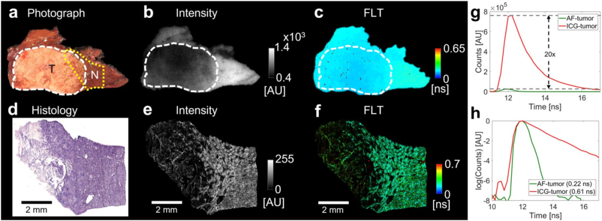
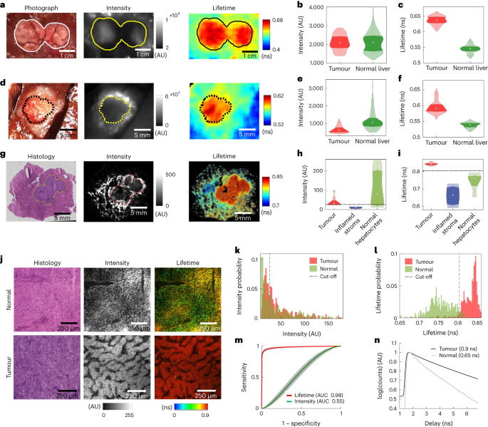
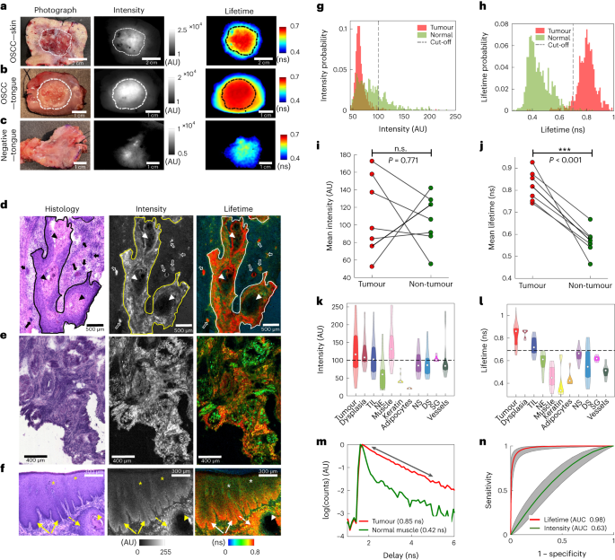
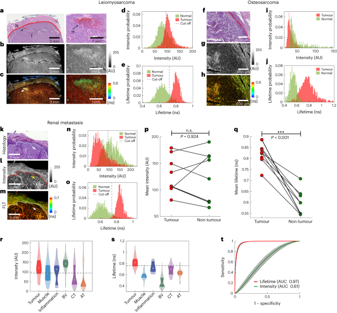
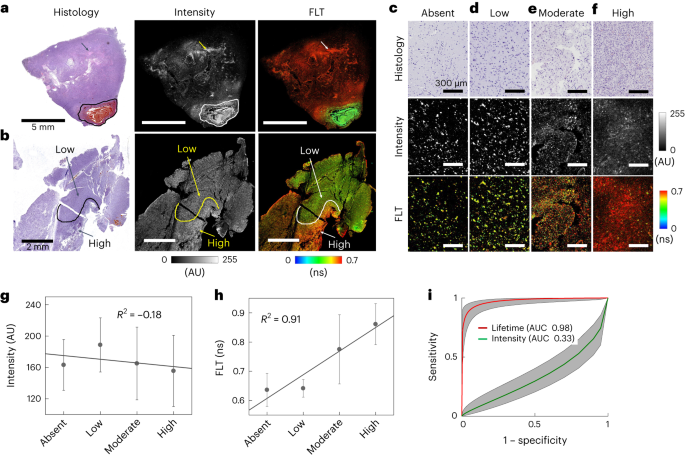
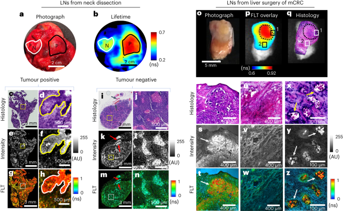
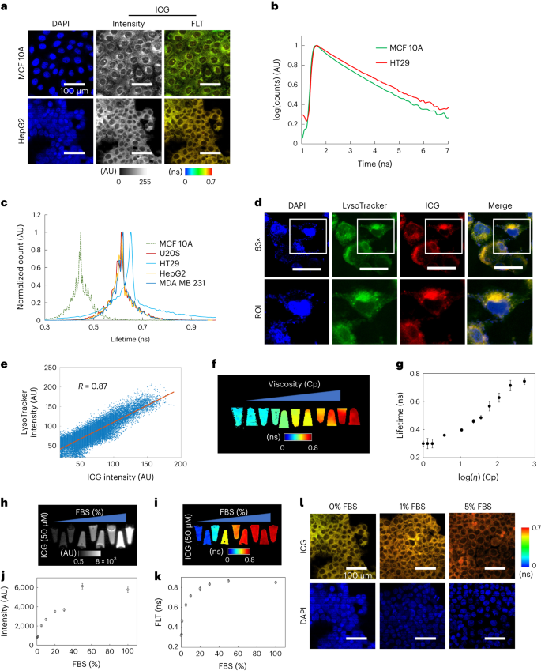

 

#  【 Nat. Biomed. Eng. 】同样使用ICG做手术导航，这种方法肿瘤识别精准率高达97% 
 

Grenemal

读完需要

16

全文字数 5077

**Introduction**

引言

在过去二十年里，术中肿瘤识别的分子靶向荧光示踪剂和成像系统取得了显著进展。目前已开发出针对肿瘤特异性分子表达、酶活性或肿瘤微环境异常生理状态的荧光探针，并且一些探针已进入后期临床试验，甚至最近，FDA最近批准了5-氨基乙酰丙酸（5-ALA）和帕呋拉西宁（OTL38）作为首批术中肿瘤显像剂。5-ALA可产生脑肿瘤可见荧光，而OTL38则是一种近红外叶酸受体α靶向荧光团。虽然美国FDA批准的近红外染料吲哚菁绿（ICG）并非专为肿瘤设计，但在癌症图像引导手术中得到了广泛应用。无论采用哪种靶向机制，肿瘤对荧光探针的摄取情况都存在异质性，导致灵敏度低、假阳性率高。现有的成像剂在人类多种癌症类型的细胞特异性上尚未得到证实。限制现有探针性能的一个重要因素是它们与基于荧光强度的成像技术结合使用，而荧光强度取决于肿瘤的大小和深度、染料吸收、探测器效率、照明功率、与目标的距离以及其他与系统相关的参数，因此，很难对不同成像系统和患者的肿瘤特异性对比度进行绝对量化，这可能会阻碍荧光成像在临床上的广泛应用和手术引导的标准化。

**Results**

结果

**Liver cancer**

肝癌

研究人员对原发性和转移性肝肿瘤手术患者进行的实验，研究发现，在肝细胞癌（HCC）中，肿瘤内的荧光强度不均匀，存在亮区和暗区（图 1a），并且与正常组织的荧光有重叠（图 1b）。此外，肿瘤内的荧光寿命（荧光寿命）明显长于周围正常肝实质（图 1a 右）。此外，对于分化较差的转移性结直肠癌，荧光强度沿肿瘤边界较高，表明染料在肿瘤周围积累（图 1e），这种现象是由于 ICG 在肿瘤周围的肝细胞和纤维组织中积累所致，而荧光寿命则显示，与正常肝相比（0.54 ± 0.01 ns），肿瘤内的荧光寿命（图 1d 右和图 1f）要长得多（0.62 ± 0.002 ns）。为了证明这种现象源自于肿瘤内部的ICG而非组织自发荧光，作者测定了8名为注射ICG的患者的肝脏肿瘤，结果表明其之前测定的长荧光寿命确实是来自肿瘤中的 ICG，而细胞层面的荧光寿命成像（FLIM）（图 1g 右和图 1i）也进一步说明了肿瘤中荧光寿命比正常组织的要长。此外，利用组织学定义的肿瘤和正常肝实质进行肿瘤/正常分类的接收器操作特征（ROC）分析利用组织学定义的肿瘤和正常肝实质进行肿瘤/正常分类的接收器操作特征（ROC）分析显示（图 1k 和图 1m ），基于FLM肿瘤识别的准确率（曲线下面积，AUC）为 98%，灵敏度为 94.3%（95% 置信区间 (CI) 92-96%）和特异性 95%（95% 置信区间 (CI) 92.7-96.6%）；而对应的基于荧光强度（J = 13.9%）的准确性为 55%，灵敏度为 57.3%（95% 置信区间 (CI) 53.1-61.4%）和特异性为 49.8%（95% 置信区间 (CI) 45.3-54.2%）。除了在麻省总医院（MGH）进行的临床研究外，作者还回顾性地检查了莱顿大学之前进行的 ICG 临床试验的 mCRC 患者标本（n = 3），并发现肿瘤荧光寿命明显增加，虽然还需要进一步研究确定肝脏肿瘤最佳分类性能的剂量和注射时间，但这些数据支持肝脏肿瘤中荧光寿命增强的细胞来源，以及使用荧光寿命比荧光强度更高的肿瘤与正常分类性能准确性。

图1. a）患者刚切除的 HCC 标本的照片、荧光强度和荧光寿命图，b,c） Violin 图显示了肿瘤和正常肝各像素的强度（b）和 荧光寿命（c）分布。虚线表示临床确定的肿瘤边界。e,f）显示了 d 所示标本中肿瘤和正常肝像素的强度（e）和 荧光寿命（f）分布。h、i）Violin 图显示了 g 中所示标本中经组织学证实的肿瘤边界（g 中的黄线）、发炎的基质和正常肝细胞区域内各像素的强度（h）和 荧光寿命（i）分布情况。j）g 中正常组织和 HCC 组织区域的高分辨率（20 倍放大率）组织学图像（左列）、荧光强度图像（中列）和荧光寿命图像（右列）。k,l）g 中组织学定义的肿瘤边界内（红色）和边界外（绿色）的荧光强度（k）和 荧光寿命（l）直方图。m）g 中标本中肿瘤与正常组织分类的 ROC 曲线，基于 荧光寿命（红色）和强度（绿色）分类的准确率（AUC）分别为 98% 和 55%。灰色阴影区域代表 95% 的置信区间。n）肿瘤细胞（黑色）和正常肝细胞（灰色）的代表性 TD 荧光衰减曲线。

**Head and neck cancer**

头颈部癌症

在8例头颈部（HN）癌症患者的口腔鳞状细胞癌（OSCC）标本中，有7例显示肿瘤中的荧光寿命相比正常组织更长，只有一个异常的纺锤形细胞癌患者例外。荧光图像显示长荧光寿命局限于肿瘤边界内，而无肿瘤组织的荧光强度和荧光寿命相对较低。由于无法获得包含肿瘤和正常组织的全侧切片，对HN标本的宽视野图像未能进行组织学验证，因此，研究人员将从新鲜标本切下的组织横截面（约10微米）的FLIM与相同切片的组织学进行了比较，以验证荧光寿命增强的显微特异性。在FLIM图像中，观察到了荧光寿命较长的区域与组织学图像上浸润肿瘤细胞的显微巢之间近乎。

多名HN癌患者的共聚焦显微镜数据表明，正常组织中有大量ICG保留，肌肉、血管、正常基质的荧光强度与肿瘤、发育不良和肿瘤浸润淋巴细胞相当。然而，在所有患者中，肿瘤、发育不良上皮细胞和肿瘤浸润淋巴细胞的荧光寿命比几种正常组织类型要长得多。ROC分析显示，使用荧光寿命对肿瘤与正常组织分类的准确率为98%，而使用强度进行分类的准确率为63.3%，相比之下，基于强度的分类的准确度、灵敏度和特异度明显低于基于荧光寿命的分类。

此外，对使用较高ICG剂量（5 mg/kg）的HN手术患者标本进行了评估，结果显示肿瘤荧光寿命仍然明显增加，但正常组织荧光寿命也相应升高，这可能与高剂量ICG未完全清除有关。

图2. a-c）SCC患者的彩色照片（左）、宽场荧光强度（中）和荧光寿命图（右），他们分别患有左耳皮肤 SCC（a）、舌头口腔 SCC（b）和组织学上无肿瘤的舌头标本（c）。d,e）左下颌 OSCC 标本（d）和舌 OSCC 标本（e）的组织学、显微荧光强度和 FLIM。f）在舌部的 OSCC 标本中，与浸润性肿瘤相邻的增生不良上皮中也观察到与肿瘤细胞相当的长荧光寿命值。g,h）舌 SCC 标本中肿瘤（红色）和正常组织（绿色）内的荧光强度（g）和 荧光寿命（h）直方图显示。i,j）每个患者（n = 7）的肿瘤（红色）和正常组织（绿色）的平均荧光强度（i）和 荧光寿命（j）显示为组织学鉴定的肿瘤和正常组织的多个 ROI（大于 40）的平均值。k,l） Violin 图显示多个患者（n = 7）HN 肿瘤和正常组织类型中荧光强度（k）和 荧光寿命（l）的分布。NE，正常上皮；NS，正常基质；DS，脱鳞基质；SG，唾液腺。m）OSCC 肿瘤和正常口腔肌肉组织的代表性 TD 衰减曲线。n）所有研究患者（n = 7）的灵敏度与假阳性率（1 - 特异性）的 ROC 图。

**Bone and soft tissue cancers**

骨和软组织癌症

针对骨和软组织癌症的研究，作者选择了包括原发性肉瘤和转移性结肠、乳腺以及肾癌等临床样本。结果表明，尽管在荧光强度图像（图 3b、g、l）中可以看到出血区、纤维组织和肌肉中存在较高的非特异性 ICG 摄取，但是在荧光寿命图像中可以看到原发性肉瘤以及肾癌和乳腺癌的骨转移荧光寿命都有明显的增强，尽管在荧光强度图像中存在非特异性 ICG 摄取。有趣的是，一名子宫肌瘤患者，即使在术前麻醉诱导时注射 ICG，也能观察到相当大的肿瘤与正常荧光寿命对比。

按患者进行的分析显示，不同患者的平均荧光强度差异很大，其中三名患者正常组织的荧光强度高于肿瘤。然而，所有患者的平均肿瘤荧光寿命都明显长于正常组织 荧光寿命。ROC 分析显示，基于荧光寿命的肿瘤与正常分类的准确率、灵敏度和特异性高于基于强度的分类。对于接受新辅助放疗或化疗的肉瘤患者，肿瘤边界内外出现不均匀的 ICG 摄取，导致肿瘤与正常强度对比度较低。但是在所有接受治疗的患者标本中，存活肿瘤区域内荧光寿命一致长于正常组织。

图3. a-e）一名注射了 ICG的患者的子宫肌层肉瘤标本中的荧光寿命图。f-j）骨肉瘤中的荧光寿命图。k-o）肾转移至骨的荧光寿命图。p,q）肿瘤（红色）和正常组织（绿色）的患者（n = 8）平均荧光强度（p）和 荧光寿命（q）r,s） Violin 图，显示多名患者（n = 10）肉瘤癌细胞和几种正常组织类型的荧光强度（r）和 荧光寿命（s）的分布情况。BV，血管；CT，结缔组织；AT，脂肪组织。t）十名患者标本数据中肿瘤与正常分类灵敏度与 1 - 特异性的 ROC 图。

**Brain tumours**

肿瘤

脑肿瘤胶质母细胞瘤（GBM）是一种高度浸润性的肿瘤。在接受GBM手术的患者中，输注5毫克/千克的ICG后，福尔马林固定的标本进行成像。与共聚焦组织学和荧光强度图像相比，荧光寿命图像显示肿瘤细胞和出血区域的ICG荧光强度较高，且只有在肿瘤区域观察到明显较长的荧光寿命。相比于其他肉瘤或头颈癌，GBM中的坏死瘤核显示出更高的ICG保留率和较长的荧光寿命。

针对GBM标本，通过评分反映肿瘤细胞密度，将获得的ROI分成无、低、中、高四个组织学组。各组的ICG荧光强度相当，但荧光寿命从低密度ROI到高密度ROI逐渐增加，导致平均荧光寿命与肿瘤密度呈很强的正相关。

患者间ROC分析，将无肿瘤和低密度ROI组合作为阴性组，将中度和高密度ROI组合作为阳性组。ROC曲线结果显示，基于荧光寿命的分类准确率为97.5%，灵敏度为90.7%，特异性为96.2%（J = 84.3%）；而基于荧光强度的分类准确率为33%，灵敏度为53%，特异性为20%（J = 26.9%）。

总的来说，对接受ICG注射的GBM标本进行荧光寿命测量，能够准确区分中高密度区与低密度区（或无肿瘤区），可用于在GBM手术中确定肿瘤的浸润边界。

图4. a、b）两名患者的高级别 GBM 10 µm FFPE 组织切片的组织学（左）、荧光强度（中）和 FLIM（右）。c-f）四个组织学类别的代表性组织学图像（上排）、荧光强度图像（中排）和荧光寿命图像（下排），即无肿瘤（c）、低密度（d）、中等密度（e）和高密度（f）。i） 使用 荧光寿命（红色）和强度（绿色）的灵敏度与 1 - 特异性的 ROC 曲线。

**Detecting metastatic LNs**

检测转移性淋巴结

除了对原发性肿瘤进行准确的边缘检测外，在手术过程中对肿瘤阳性 LN 和阴性 LN 进行有效区分也十分重要。作者通过对接受颈部根治性切除术的患者进行荧光寿命成像，发现其中一个LN的ICG 荧光寿命较长，经组织学确认为恶性；而荧光寿命较短的LN则经组织学确认为良性。共聚焦FLIM图像进一步证实了成像结果，显示荧光寿命较长的LN含有转移性肿瘤结节，而荧光寿命较短的LN没有肿瘤浸润的迹象。此外，在一名行肝部分切除术的转移性结肠癌（mCRC）患者中，切除的区域LN也显示出类似的荧光寿命增强，与组织学证实的转移性肿瘤结节相符。总的来说，作者对13个LN进行了评估，除了一个未显示ICG摄取的阳性LN外，其余12个LN都能通过FLIM准确识别。8个阳性LN在浸润肿瘤巢内显示出长荧光寿命。而所有阴性的正常淋巴结显示了来自血管的高ICG荧光强度，且其荧光寿命相对较短。

图5. a）一名口腔 SCC 患者在颈部根治性切除术中切除的 LN 标本照片。b）整个标本的广域荧光寿命图像显示.0。c-h）所示为肿瘤阳性 LN 组织切片的组织学（c,d）、荧光强度（e,f）和 FLIM（g,h）图像。i-n）肿瘤阴性 LN 组织切片的组织学（i,j）、荧光强度（k,l）和 FLIM（m,n）图像显示血管中 ICG 强度高但荧光寿命短（i,k 和 m 中的箭头）。j、l 、n ）分别是 i、k 和 m 中所勾画的 ROI 的放大图。r-t）p 和 q 中矩形区域 "1 "的组织学（r）、荧光强度（s）和 FLIM（t）显示。u-w）p 和 q 中 "2 "区域的组织学和 FLIM（肿瘤边界外）显示出与 "1 "区域相当的强度（v），但 荧光寿命（w）较短，与组织学（u）中 "2 "区域没有肿瘤细胞相对应。x-z）同一患者另一个淋巴结切片的 FLIM（未显示广域荧光寿命图像），显示转移癌细胞巢（x，箭头），强度高（y，箭头），荧光寿命 长（z，箭头），周围是正常淋巴组织，荧光寿命短。

**机制**

Mechanism

为了确定ICG在癌细胞中FL增强的因素，作者对多个人类癌细胞系（HepG2、U2OS、HT29和MDA-MB-231）进行了验证，结果表明，尽管ICG的摄取和荧光强度几乎相同，但是肿瘤细胞中ICG的荧光寿命比正常细胞系（MCF 10A）长。此外，ICG在进入癌细胞后会在溶酶体内富集，而肿瘤细胞内偏酸性的环境可能是荧光寿命增强的诱导因素之一，但是这一猜想在进一步的pH实验中被否定。另外，ICG的荧光寿命会随着溶剂粘度的增加而改变，而癌细胞内的较高细胞粘度可能会在影响ICG的荧光寿命。除了组织环境参数外，ICG与血清蛋白结合也会增加其的荧光量子产率。在实验条件下，ICG的荧光量子产率与浓度关系不大，但随着浓度升高，荧光强度增加。此外，当有胎牛血清时，ICG的荧光强度和寿命都会增加，这是因为ICG与白蛋白结合后环境的特性发生了变化。成像实验证实了血清蛋白结合对肿瘤细胞内ICG荧光特性的影响，表明了在肿瘤细胞中观察到的荧光寿命增强可能是ICG与血清蛋白结合和肿瘤细胞相对于正常细胞具有较高细胞内粘度的综合结果。

图6. a）在无血清（FBS）培养基中生长的 HepG2 和 MCF 10A 细胞的代表性荧光强度和荧光寿命图像。b）在无血清培养基中，癌细胞 HT29（红色）和正常细胞 MCF 10A （绿色）细胞质中的代表性荧光衰减曲线。c）各种癌细胞（U2OS，红色；HT29，淡蓝色；HepG2，黄色；MDA MB 231，蓝色）胞质中荧光寿命分布直方图与 MCF 10A 中荧光寿命分布（绿色）的比较。d）U2OS 肉瘤细胞荧光显微镜观察，显示 ICG 与细胞孵育 1 小时后定位于溶酶体中。蓝色：核染色（DAPI）；绿色：溶酶体染色（LysoTracker Deep Red）；红色：ICG；黄色：共定位：e）根据多个像素点上 LysoTracker 和 ICG 荧光强度的相关性（R = 0.87）测量 ICG 与溶酶体的共定位分析。f）ICG荧光寿命与溶剂粘度的关系。h-l） ICG荧光寿命与血清蛋白结合的关系。

**Discussion**

结论

这篇研究证明使用ICG作为通用成像标记物对多种实体瘤进行成像是具有临床应用前景的。临床数据显示，从皮肤、口腔、肝脏、结直肠、骨骼等多种实体瘤中ICG的荧光寿命明显长于正常组织。共聚焦FLIM技术可以高分辨率地分析单个肿瘤细胞，对良性和恶性淋巴结以及大型切除标本中的肿瘤和正常组织进行分类，准确率超过97%。

研究还发现，除了肿瘤外，某些非肿瘤组织也可能呈现出与肿瘤荧光寿命相当的增强。这是因为一些成分，如TILs和纤维瘤囊，显示了与肿瘤类似的荧光寿命对比度。此外，研究揭示了ICG在癌细胞内部的内化机制，并与溶酶体共定位。荧光寿命的变化与粘度密切相关，癌细胞内溶酶体的高粘度可能导致ICG的荧光寿命增强。

最后，研究提出了在临床实践中利用荧光寿命成像的前景。通过设定合适的荧光寿命阈值，可以快速、准确地确定手术切除边缘，同时对大型标本进行自动化综合病理评估，为临床治疗提供了新的可能性。近红外荧光寿命成像在癌症治疗中的广泛应用前景也被强调，涵盖了诊断、术中引导和术后组织病理学等多个方面。

Pal, R.; Lwin, T. M.; Krishnamoorthy, M.; Collins, H. R.; Chan, C. D.; Prilutskiy, A.; Nasrallah, M. P.; Dijkhuis, T. H.; Shukla, S.; Kendall, A. L.; Marshall, M. S.; Carp, S. A.; Hung, Y. P.; Shih, A. R.; Martinez-Lage, M.; Zukerberg, L.; Sadow, P. M.; Faquin, W. C.; Nahed, B. V.; Feng, A. L.; Emerick, K. S.; Mieog, J. S. D.; Vahrmeijer, A. L.; Rajasekaran, K.; Lee, J. Y. K.; Rankin, K. S.; Lozano-Calderon, S.; Varvares, M. A.; Tanabe, K. K.; Kumar, A. T. N. Fluorescence Lifetime of Injected Indocyanine Green as a Universal Marker of Solid Tumours in Patients. Nat. Biomed. Eng 2023. https://doi.org/10.1038/s41551-023-01105-2.

**关注并回复文章DOI获取全文：**

10.1038/s41551-023-01105-2

**点击蓝字 关注我们**

[【Adv. Mater.】"背"上细菌不仅能促进M1型转变，还能重新极化肿瘤相关巨噬细胞](http://mp.weixin.qq.com/s?__biz=MzkzOTI1OTMwNg==&amp;mid=2247484419&amp;idx=3&amp;sn=4bbeac46f0a5792cf647a8f175ce0edc&amp;chksm=c2f2e0c6f58569d0650117a88809c3f7951a88eafa1dfc1cb6ce0f047dc14e8e45b5ee345220&amp;scene=21#wechat_redirect)

[【Adv. Mater.】纳米药物新综述，用于检测和治疗眼部细菌感染](http://mp.weixin.qq.com/s?__biz=MzkzOTI1OTMwNg==&amp;mid=2247484435&amp;idx=1&amp;sn=f1a023541b4636333bac2a138d11cba3&amp;chksm=c2f2e0d6f58569c0faa99a17197462d6afcf5f343e25ec8f391081e793ba4b70e1ba9e40e5e4&amp;scene=21#wechat_redirect)

[【Nat. Rev. Bioeng.】重磅综述，基于微针的生物传感器](http://mp.weixin.qq.com/s?__biz=MzkzOTI1OTMwNg==&amp;mid=2247484325&amp;idx=1&amp;sn=41abf435330ab036ece931665dfb5537&amp;chksm=c2f2e760f5856e765a8abb630f7f408e592e59c2016b00d2a001737383e90695d0a4199c6c5a&amp;scene=21#wechat_redirect)

预览时标签不可点

素材来源官方媒体/网络新闻

  继续滑动看下一个 

 轻触阅读原文 

    

