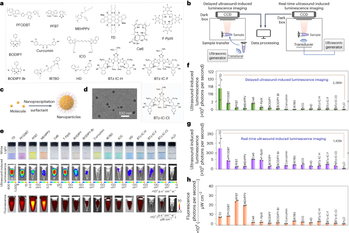
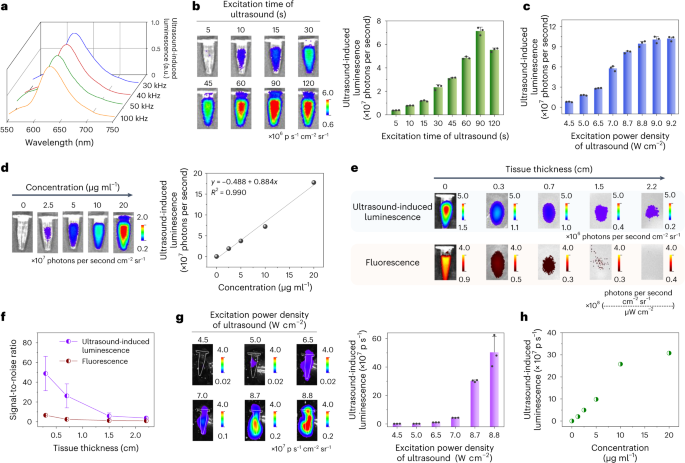
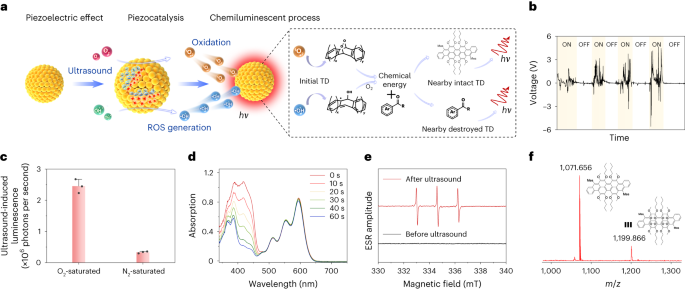
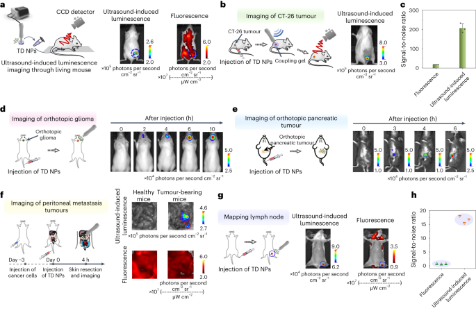
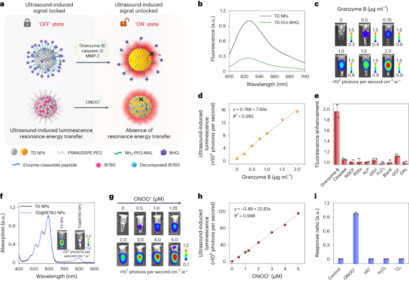
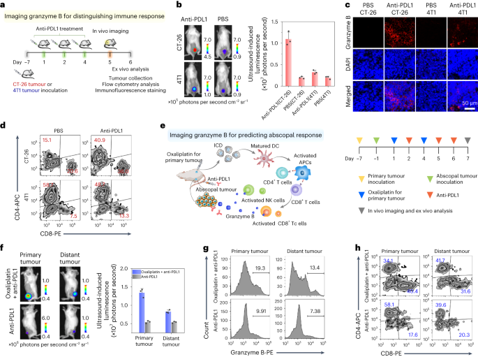

 

#  【Nat. Photon.】超声诱导发光成像：更深、更亮 
 

Grenemal

读完需要

30

全文字数 10400 字

超声诱导发光成像的核心在于利用超声波的压电效应，将机械波动转化为化学能，随后通过化学发光效应引发发光现象。作者展示了超声诱导发光成像的两种模式：一种实现了超声激励停止后的延迟成像，另一种则实现了超声激励期间的实时成像。与传统的H₂O声致发光相比，作者的成像方法发光强度提升了2000倍，与荧光成像相比，信噪比提高了10倍，空间分辨率达到了1.46毫米，组织穿透力更是高达2.2厘米。此外，作者还展示了该技术在皮下和原位肿瘤成像、淋巴结定位以及腹膜转移肿瘤筛查等方面的应用潜力。为了进一步提高成像的精准度和功能性，作者还设计了基于共振能量转移的可分析物激活发光探针，这不仅能够评估药物引起的肝毒性，还能区分药物治疗后肿瘤的反应性。展望未来，作者期望这项技术能够进一步拓展其在临床前和临床应用中的潜力，如活体动物组织病理学病变的研究、肿瘤的早期检测、生物分子的精确分析，以及癌症治疗或预后的实时监测等。这一领域的研究和应用，有望为生物医学领域带来革命性的突破。

**引言**

分子成像，作为一种非侵入性技术，旨在可视化和量化分子及细胞生物过程，对于疾病的检测、诊断、预测和监测具有至关重要的作用。其中，光学成像凭借其高灵敏度、特异性和实时检测能力，成为分子成像领域的重要组成部分。目前，分子或材料通过光激发、化学/生化相互作用、放射性核素或X射线等多种方式实现发光。然而，实时光激发的荧光成像易受到组织自发荧光的影响，从而影响其在活体生物体中的灵敏度和特异性。相比之下，化学发光、生物发光、切伦科夫发光或X射线激活发光等成像方式则能有效消除生物组织的自发荧光干扰。尽管如此，这些发光方式也面临着如酶活性、底物分布或高剂量放射性同位素带来的潜在风险。

超声成像作为一种广泛应用的、成本效益高、实时、非侵入性且安全的成像技术，通过声波可视化人体内部，因其非电离辐射特性，常用于临床解剖和功能成像。鉴于其诸多优点，超声波在激活发光方面展现出巨大潜力。声致发光，一种以高强度超声下液体空化作用产生微弱光发射为特征的现象，自1934年以来一直是研究热点。尽管声致发光因发光效率低、强度弱、曝光时间长、寿命短等原因未被视为有效成像技术，但结合化学发光底物如鲁米诺与超声空化产生的活性氧（ROS）反应，可增强其发光强度。然而，目前对于超声发光的基本机制及专门为此目的的分子设计仍缺乏深入了解，这表明超声触发发光在生物医学应用中仍处于发展的早期阶段。

在这项研究中，作者提出了一种新型的超声诱导发光成像技术，该技术利用两步能量转换过程显著增强发光强度，并成功应用于体内成像。作者将15种发光分子转化为水溶性纳米颗粒，构建了两种超声诱导光子收集的成像模型：延迟超声诱导发光成像和实时超声诱导发光成像。通过利用纳米粒子的压电效应和压电催化作用，作者显著提高了超声诱导发光强度。在测试的纳米颗粒中，基于三蒽衍生物的纳米颗粒（TD NP）在延迟超声诱导发光成像中展现出最高的发光强度。TD NPs通过压电效应产生极化电荷，随后通过压电催化生成大量ROS。生成的ROS与TD分子反应，通过化学发光过程发射光子。相较于荧光成像，超声诱导发光成像因超声激发与光信号发射之间无串扰而表现出更高的灵敏度和信噪比，从而在延迟成像和实时成像中实现背景信号最小化。作者成功验证了超声诱导发光成像在皮下和原位肿瘤、腹膜转移肿瘤和淋巴结体内成像中的可行性。此外，作者还展示了利用可激活的超声诱导发光探针在免疫治疗或药物诱导的肝毒性过程中对酶和活性物质进行体内分子成像的潜力。

**结果**

**分子筛选和纳米颗粒设计**

作者成功地将15种不同类型的发光分子转化为水溶性纳米颗粒，这些分子包括卟啉、BODIPY、花青、三蒽衍生物、A–D–A'–D–A 共轭分子（其中D代表电子供体，A代表电子受体）以及半导体聚合物。在合成过程中，作者使用了表面活性剂（如图1a、c所示）。透射电子显微镜（TEM）图像和动态光散射分析结果显示，TD NPs呈现出球形形态，尺寸分布狭窄，平均粒径约为30-40纳米（如图1d所示）。
图 1：用于超声诱导发光成像的发光纳米颗粒的合成和测量。
a，各种发光分子的化学结构。b，延迟超声诱导发光成像（左）和实时超声诱导发光成像（右）两种模式的实验装置示意图。c，纳米粒子制备的图示。d，TD NP 的代表性 TEM 图像。e，纳米颗粒（20 μg ml −1 ，200 µl）的照片（上）、延迟超声诱导发光图像（中）和荧光图像（下）。f，e中延迟超声诱导发光成像模式下各种纳米粒子的发光强度的量化。g，超声激发期间实时超声诱导发光成像模式下各种纳米颗粒的发光强度的量化（30 kHz，8.7 W cm −2 ）。h，e中各种纳米粒子的荧光强度的量化。 为了高效收集超声诱导的发光光子，作者设计并构建了一种新颖的成像装置，如图 1b 和扩展数据图 1 所示，具体的构建细节和操作步骤已详细记载于补充方法中。此装置支持两种超声诱导发光成像模式：一种是超声激发停止后的延迟发光成像；另一种是超声激励期间的实时发光成像。
在延迟成像模式中，作者将超声换能器置于溶液样品下方/中或动物的组织表面上，并使用超声耦合凝胶来激发纳米粒子。一旦超声波激发停止，作者会立即将样品或动物转移至成像暗箱中，并使用冷却的CCD（电荷耦合器件）相机（来自IVIS Lumina XR成像系统）在无光激发的条件下获取图像。这种设置确保了只有在超声激发期间产生的发光光子被捕获，从而提供了关于纳米粒子发光性质的精确信息。
在实时成像模式中，超声换能器被放置在成像暗箱内，样品在暗箱内直接受到超声波的激发。这种设置允许作者同时获取超声诱导发光图像，无需转移样品，从而大大提高了实验的效率和便捷性。为了评估不同纳米颗粒的超声诱导发光性能，作者首先使用超声波激发来研究它们的延迟超声波诱导发光。结果表明，除了基于姜黄素和IR780的纳米颗粒外，其他纳米颗粒均显示出超声波诱导发光光子发射。特别值得一提的是，卟啉基纳米粒子（如Ce6和F-PpIX）相较于BODIPY和花青基纳米粒子（如ICG和HD）展现出更高的发光强度。在基于半导体聚合物的纳米粒子中，基于PFODBT的纳米粒子表现出最为突出的发光强度。值得注意的是，TD纳米颗粒在所有测试的纳米颗粒中展现出最强的发光强度，其发光强度相较于H₂O、PFODBT和Ce6基纳米粒子分别提高了2,389.6倍、71.6倍和71.3倍（如图1e和f所示）。随后，作者进一步收集了超声激发期间纳米颗粒的实时超声诱导发光数据。与延迟成像结果相似，TD NP、基于卟啉的纳米颗粒和基于PFODBT的纳米颗粒在实时成像中也表现出更强的发光强度。特别地，TD NPs在所有测试的纳米颗粒中再次展现出最高的发光强度，其发光强度相较于H₂O提高了1,428.1倍（如图1g所示）。此外，作者还在荧光模式下使用适当的激发光获得了荧光图像和强度信息，以便与超声诱导发光成像结果进行对比和分析（如图1e和h所示）。

**超声诱导发光成像的研究**

作者对TD NPs在延迟超声诱导发光成像模式下的发光性能进行了深入研究，该模式主要关注超声激发停止后的成像效果。在优化表面活性剂后，作者发现涂有DSPE-PEG的TD NP展现出最高的发光强度。为了进一步探索，作者利用不同频率（即30、40、50和100 kHz）的超声波对TD NP进行预激发，并观察到一致的发光光谱，峰值位于625-650 nm，与荧光光谱相吻合（如图2a所示）。随着超声激发时间的延长，TD NPs的发光强度逐渐增强，并在90秒时达到峰值（如图2b所示）。同样地，增加超声激发的功率密度也导致TD NP发光强度的提升（如图2c所示）。此外，TD NPs的超声诱导发光强度与纳米颗粒浓度之间存在正线性关系（如图2d所示）。

当超声激发停止后，作者观察到TD NP发出的持久信号持续时间超过7小时，其半衰期约为180秒。为了评估TD NP发出的超声波诱导发光在组织中的穿透深度，作者在不同厚度的组织下进行了测试。尽管超声诱导发光和荧光信号均随着组织厚度的增加而减弱，但相较于荧光成像，超声诱导发光成像展现出更高的信噪比和更大的组织穿透力，最高可达2.2 cm（如图2e、f所示）。同时，作者还发现随着组织厚度的增加，超声功率传输效率（η）有所降低。此外，作者通过半高全宽测量来评估超声诱导发光的空间分辨率。结果表明，在0 mm组织下的空间分辨率为1.46 mm。这些结果共同表明，TD NPs在超声诱导发光成像中具有优异的性能和潜力。随后，作者深入研究了TD NPs在超声波激发过程中的实时超声诱导发光性能。结果表明，随着超声激发功率密度的增加，TD NPs的发光强度逐渐增强（如图2g所示）。此外，作者还发现TD NPs的实时超声诱导发光强度与其浓度呈正相关性，即随着纳米颗粒浓度的增加，发光强度也相应增加（如图2h所示）。在连续30分钟的超声激发过程中，TD NPs的发光强度呈现出先增后减的趋势。具体而言，发光强度在0至6分钟内持续上升，于6分钟时达到峰值，随后开始下降。为了进一步探索高频超声对TD NPs发光性能的影响，作者研究了1 MHz和3 MHz的超声刺激。实验结果显示，随着超声激发功率密度的增加和激发时间的延长，TD NPs的延迟超声诱导发光强度持续增强。同时，作者也观察到更高的纳米颗粒浓度有助于提升发光强度。综上所述，TD NPs的超声诱导发光性能受到多种因素的共同影响，包括成像模式、激发持续时间、激发功率密度、超声频率、纳米颗粒表面活性剂的种类和浓度以及信号采集的时间点等。值得注意的是，尽管这些因素都可能影响发光性能，但作者的实验结果显示超声诱导发光光谱与激发频率之间并无明显关联。
图 2：TD NP 延迟超声诱导发光成像性能的研究。
a，用不同超声频率（分别为30、40、50和100 kHz）激发的TD NP的超声诱导发光光谱。b，不同激发时间（30 kHz，6.5 W cm −2 ，30 kHz）激发 30 s 的 TD NP（2.5 μg ml −1 ，200 µl）的超声诱导发光强度。d，不同浓度的TD NPs的超声诱导发光图像（左）和强度（右），用超声（30 kHz，6.5 W cm −2 ）激发15秒。R，多重相关系数。e，TD NPs穿过不同厚度组织的超声诱导发光图像（顶部）和荧光图像（底部），使用补充图11所示的测试模式I。f，超声诱导发光的信噪比TD NP 的荧光和荧光作为组织厚度的函数，使用测试模式 I。g，TD NP 的实时超声诱导发光图像（左）和强度（右）（20 μg ml −1 ，200 µl）在不同功率密度（30 kHz）下激发。h，超声激发（30 kHz，8.7 W cm −2 ）期间不同浓度TD NPs的实时超声诱导发光强度。

**超声诱导发光的机制**

为了深入探究超声波诱导发光的机制，作者进行了一系列精心设计的实验。这些实验的目的在于验证TD NP的压电效应，探索超声波激发过程中ROS的产生，检查TD NP与ROS之间的化学反应，并评估所产生的化学发光。通过观察施加超声波时开路电压的增加，特别是来自TD分子的开路电压的增加，作者证实了TD NP的压电效应的存在（如图3b）。此外，与O2-饱和条件相比，TD NPs或TD分子的超声诱导发光信号在N2-饱和条件下受到抑制，这表明O2在发光过程中起着至关重要的作用（如图3c）。1,3-二苯基异苯并呋喃在416 nm处的吸收峰降低为作者提供了TD NP产生ROS的直接证据（如图3d所示）。电子自旋共振（ESR）谱进一步证实了超声波处理过程中TD NPs产生了单线态氧（1O2）和羟基自由基（HO•）（如图3e所示）。当1O2和H2O•与TD NPs直接孵育时，产生了强烈的化学发光。而ROS自由基清除剂的添加则有效抑制了超声诱导的TD NP发光强度，这突显了ROS与纳米颗粒中的TD分子发生反应以诱导化学发光的重要性，同时过量的ROS扩散出来并与自由基清除剂相互作用。值得注意的是，将TD NP直接加热至40°C并没有产生任何明显的发光，这强烈表明观察到的发光不能归因于超声激发期间的热效应。这一发现为作者深入理解超声波诱导发光的机制提供了新的视角。图 3：超声波诱导发光的机制。
a，TD NPs 超声诱导发光机制示意图。hν，光子能量。b，超声波换能器（30 kHz）打开和关闭时TD的可再现电压输出。c，在O 2 -饱和或N 2 -饱和条件下超声激发（40 kHz）30 s后TD NPs在水中的超声诱导发光强度。数据以平均值±标准差表示。（n = 3）。d，TD NP 的 ROS 生成作为激发时间的函数。ROS 的产生是通过 1,3-二苯基异苯并呋喃在 416 nm 处的降解来确定的。e，从 TD NP（200 µg ml −1 ，100 µl）生成并使用 4-oxo-2,2 捕获的 1 O 2 的 ESR 光谱，超声激发之前或之后的水中的 6,6-四甲基哌啶（1 M，100 µl）。f，超声激发 30 分钟后 TD 分子的 MALDI-TOF-MS 谱。

基于上述结果，作者提出了一个超声诱导发光的可能机制（如图3a所示）。在超声波的振动下，TD NPs通过压电效应产生极化电荷，进而通过压电催化作用生成单线态氧（1O2）和羟基自由基（H2O•）。这些活性氧物种（ROS）与TD分子反应，形成一系列中间体。通过MALDI-TOF MS（基质辅助激光解吸/电离-飞行时间质谱）分析，作者证实了这些中间体的存在。初始的TD分子被1O2或H2O•氧化，导致H2O•物质的添加和氧原子的引入，从而形成了TD-•-OH中间体(I)和二氧杂环丁烷中间体(II、III)（分子量分别为1,086、1,103和1,199）（如图3f所示）。这些二氧杂环丁烷中间体(II、III)逐渐裂解，而TD-•-OH中间体(I)与O2反应，导致C-C键断裂，并逐渐释放化学能。最后，这些中间体的化学能转移到附近的完整或破坏的TD分子，从而引发发光现象。在明确了超声诱导发光的机制后，作者设计了一种复合纳米颗粒，旨在增强基于PFODBT的纳米颗粒（PFODBT NP）中较弱的超声诱导发光强度。作者将各种化学发光底物，如HBA-COOH、SO、CPPO和HBA-Cl，掺杂到PFODBT NP中。具体而言，与未掺杂的PFODBT NP相比，将HBA-COOH掺杂到PFODBT NP（PFODBT@HBA NP）中，其发光强度增强了121.4倍。在复合纳米颗粒中，PFODBT的压电效应将超声波能量转化为ROS，随后与HBA-COOH反应产生更高的化学发光强度。类似地，掺杂HBA-COOH也能分别增强基于BTz-IC-H-、BODIPY-Br-和PFBT的纳米颗粒的超声诱导发光强度，增强倍数分别为19.3倍、5.5倍和2.3倍。这些增强效应均基于相似的原理。

**体内超声诱导发光成像**

得益于纳米粒子的优良细胞相容性，作者主要采用了延迟超声诱导发光成像模式来探究这些粒子在体内超声环境下的诱导发光能力。为此，作者将TD NP溶液置于小鼠腹部下方，随后进行超声激发。值得注意的是，从小鼠的上方观察到了由超声波诱导的强烈发光信号，相比之下，荧光信号与背景几乎难以区分，这充分证明了超声波诱导发光在体内具有出色的穿透性（如图4a所示）。

在另一项实验中，作者将TD NPs注入荷瘤小鼠体内。当肿瘤区域受到超声波激发时，表现出了强烈的发光，而小鼠的其他部位则几乎没有检测到背景信号（如图4b所示）。经过计算，作者发现超声诱导发光的信噪比约为206，这比荧光信号高出了11.7倍（如图4c所示）。
为了进一步验证TD NP的肿瘤靶向能力，作者进行了静脉注射TD NP的实验。在注射后的6小时，作者用超声激发肿瘤区域，结果肿瘤区域发出了强烈的发光信号。此外，在实时超声诱导发光成像模式下，作者也观察到在超声激励过程中，肿瘤区域始终表现出强烈的发光信号。这些结果均表明TD NP具有良好的肿瘤靶向性和超声诱导发光能力。图 4：体内延迟超声诱导发光成像。
a，将TD NPs溶液（20 μg ml −1 ，200 µl）置于小鼠下方1.6 cm深度（左），收集超声诱导的发光和荧光图像（右） 。用于荧光成像：DsRed（荧光蛋白）通道，激发波长为 535 nm。对于延迟超声诱导发光成像，用超声（30 kHz，4.5 W cm −2 ）预激发纳米颗粒 15 秒。b，皮下CT-26肿瘤成像示意图（左）。肿瘤内注射 TD NP（1 mg ml −1 ，10 µl）后，荷瘤小鼠的超声诱导发光图像（右）。肿瘤区域用超声（30 kHz，4.5 W cm −2 ）预激发15秒。c，b中荧光和超声诱导发光的信噪比。数据以平均值±标准差表示。（n = 3）。P = 2 × 10 −4 。d，原位胶质瘤成像示意图（左），以及荷胶质瘤小鼠静脉注射TD NPs（1 mg ml −1 ，200）后不同点的超声诱导发光图像µl)（右）。头部区域用超声波（1 MHz，1.5 W cm −2 ）预激发 15 秒。e，原位胰腺肿瘤成像示意图（左）和荷瘤小鼠静脉注射TD NPs（1 mg ml −1 ， 200 µl）（右）。肿瘤区域用超声（1 MHz，2 W cm −2 ）预激发30秒。f，腹膜转移瘤成像示意图（左），以及静脉注射TD NPs（1 mg ml −1 ）预激发 15 秒。g，淋巴结成像示意图（左），以及皮内注射TD NPs（1 mg ml −1 ，50 µl）后30分钟超声诱导的淋巴结发光和荧光图像进入小鼠的后爪（右）。对于超声诱导发光成像，用超声（30 kHz，4.5 W cm −2 ）对淋巴区域进行预激发 15 秒。h，g 中荧光和超声诱导发光图像的淋巴结信噪比。

作者在小鼠体内成功构建了多形性胶质母细胞瘤（GBM）肿瘤模型，并通过脑切片的苏木精和伊红（H&E）染色进行了验证（图4d）。随后，作者对原位GBM小鼠进行了静脉注射TD NP，并在超声激发后观察到其头部区域出现了动态增强的信号，这证明了该成像系统对于深部肿瘤的诊断潜力（图4d）。此外，作者还利用TD NP对胰腺肿瘤小鼠进行了超声诱导发光成像研究（图4e）。结果显示，随着时间的推移，原位胰腺肿瘤小鼠的胰腺区域信号逐渐增强（图4e），这进一步验证了该成像方法的有效性。为了探究超声诱导发光成像在转移性肿瘤诊断中的应用，作者对荷瘤小鼠的肠道进行了检测。结果显示，肠道中出现了强烈的发光点，这表明存在转移性肿瘤，而健康小鼠则未观察到明显信号（图4f）。H&E染色结果进一步证实了转移性肿瘤的存在。值得注意的是，与荧光图像相比，超声诱导发光成像在检测转移性肿瘤时具有更高的信噪比，从而能够更准确地识别肿瘤。为了研究淋巴结的超声诱导发光成像，作者将TD NP直接注射到小鼠的后爪中（图4g）。结果显示，腹股沟淋巴结在超声激发下呈现出强烈的发光信号，并且其信噪比高于荧光信号（图4h）。此外，这种超声诱导的发光可以重复激发三次而不出现明显的强度衰减，这证明了其多次纵向体内成像的能力。在安全性方面，作者对研究中使用的超声条件进行了全面评估。结果表明，在测试条件下，TD NPs对细胞和组织的潜在损害可忽略不计，且表现出优异的生物相容性。

**可激活的超声波诱导发光探针**

酶在生物过程中起着至关重要的作用，因此，对其动态活动的可视化显得尤为重要。在本研究中，作者提出了一种基于共振能量转移的策略，通过设计酶可激活的超声诱导发光探针，将特定的酶可裂解肽序列作为供体-受体对之间的连接桥梁。具体来说，作者引入了颗粒酶B可切割的肽序列（Ile-Glu-Phe-Asp，简称IEFD）作为TD NP（供体）和BHQ-3（受体）之间的连接物，从而构建了颗粒酶B可激活的超声诱导发光探针TD-Grz-BHQ（图5a）。

为了验证TD-Grz-BHQ的性能，作者进行了吸收光谱和荧光光谱的表征。结果显示，所得的TD-Grz-BHQ探针在590 nm和690 nm处呈现两个明显的吸收峰。此外，TD-Grz-BHQ的微弱荧光发射进一步证实了BHQ-3在空间受限时的有效发光猝灭作用（图5b）。这些结果为后续的生物应用奠定了坚实的基础。

图 5：用于酶和 ONOO − 成像的可激活超声诱导发光探针。

a，用于酶或ONOO成像的可激活超声诱导发光探针的示意图 − 。PSMA，苯乙烯-马来酸酐共聚物；MAL，马来酰亚胺。b，TD NP 和 TD-Grz-BHQ 探针的荧光光谱。c，在不同浓度的颗粒酶 B 存在下，TD-Grz-BHQ（1.5 µg ml −1 ，200 µl）的延迟超声诱导发光成像。用 40 kHz 超声预激发探针。d，c 中发光强度的量化。e，TD-Grz-BHQ 在各种酶存在下的响应比。NQO1，NAD(P)H醌氧化还原酶1；PDE、磷酸二酯酶；ALP、碱性磷酸酶；还原型谷胱甘肽（GSH）、谷胱甘肽；GGT、γ-谷氨酰转移酶；GAL，β-半乳糖苷酶。f，TD@IR780 NPs的吸收光谱（450-650 nm处的峰对应于TD，780 nm处的峰对应于IR780）。插图显示了 TD NP 和 TD@IR780 NP 的延迟超声诱导发光成像。g，在不同浓度的 ONOO – 存在下，TD@IR780 NP（6.25 µg ml −1 ，100 µl）的延迟超声诱导发光成像。探针用 30 kHz、4.5 W cm −2 的超声波进行预激发。h，发光强度的定量，单位为 g。i，TD@IR780 NPs 在各种 ROS 或 ONOO − (5 µM) 存在下的响应比，其中 TD@IR780 NPs 对 ONOO − 显示出更高的选择性。

随后，作者对TD-Grz-BHQ作为颗粒酶B体外检测传感器的性能进行了评估。通过与颗粒酶B的孵育，作者测量了TD-Grz-BHQ的超声诱导发光信号。正如预期，IEFD肽TD NP和BHQ-3之间的连接在颗粒酶B的存在下被裂解，从而产生了强烈的超声诱导发光信号。这一结果证明了TD-Grz-BHQ探头的传感器功能具有理想的“信号开启”行为（图5c）。定量分析显示，发光强度与颗粒酶B浓度之间存在线性关系（图5d）。重要的是，TD-Grz-BHQ在其他酶或生物分子的存在下并未显示出明显的信号激活，这进一步证实了该探针在检测颗粒酶B时的特异性（图5e）。基于这种共振能量转移机制，TD-Grz-BHQ可以作为构建各种酶响应超声诱导发光探针的通用平台。通过引入不同的酶可切割肽序列作为连接子，如Gly-Pro-Leu-Gly-Ile-Ala（GPLGIA；基质金属蛋白酶-2（MMP-2）的可切割肽序列）或Asp-Glu-Val-Asp（DEVD；caspase-3的可裂解肽序列），作者可以构建出如TD-MMP-BHQ和TD-caspase-BHQ等探针，分别用于检测MMP-2和caspase-3（图5a）。此外，作者将IR780（一种对过氧亚硝酸盐（ONOO-）敏感的花青染料）掺入TD NPs中，构建了TD@IR780 NPs探针，用于ONOO-的成像和共振能量转移研究（图5a、f-i）。

**活体小鼠的免疫反应监测**

癌症免疫治疗通过激活患者自身的免疫系统并诱导长期免疫记忆，有效遏制肿瘤的复发和转移，从而显著改善患者预后。然而，不同肿瘤类型及其对应的治疗策略所展现的免疫治疗效果存在显著差异。早期区分免疫治疗后的反应者与无反应者，对于及时调整治疗方案、避免无效治疗至关重要。尽管肿瘤体积的变化是一个重要指标，但在体积差异显现之前，区分高反应者与低反应者仍充满挑战。

颗粒酶B，作为一种丝氨酸蛋白酶，在免疫反应过程中由CD8+ T细胞和自然杀伤（NK）细胞释放，对于通过细胞毒性淋巴细胞介导的癌细胞死亡起着关键作用。因此，开发实时、精确的颗粒酶B成像技术，以区分不同肿瘤类型在免疫治疗中的反应，具有深远的意义。

在本研究中，作者利用TD-Grz-BHQ对颗粒酶B进行成像，并观察了两种肿瘤模型在接受抗程序性细胞死亡配体1（抗PDL1）治疗后的免疫反应。如图6a所示，经过抗PDL1治疗后，CT-26肿瘤中检测到了TD-Grz-BHQ的超声诱导发光信号，且信号强度高于4T1肿瘤。相比之下，用磷酸盐缓冲液（PBS）处理的肿瘤，无论是CT-26还是4T1，均未显示出明显的发光信号激活（图6b）。

通过免疫荧光染色和流式细胞术分析，作者进一步证实了颗粒酶B、细胞毒性T淋巴细胞和NK细胞在抗PDL1治疗后的表达情况。结果显示，与4T1肿瘤相比，CT-26肿瘤在接受抗PDL1治疗后展现出更高的颗粒酶B、CD8+ T细胞和NK细胞水平（图6c、d以及补充图49和50）。TD-Grz-BHQ探针在肿瘤区域激活的超声诱导发光信号，归因于活化的CD8+ T细胞和NK细胞释放的颗粒酶B增加。这些发现不仅表明TD-Grz-BHQ能有效监测CT-26肿瘤的免疫治疗反应，还展示了其在区分CT-26和4T1肿瘤免疫反应中的潜力。

图 6：TD-Grz-BHQ 可激活的超声诱导体内颗粒酶 B 发光成像。

a，TD-Grz-BHQ可激活超声诱导发光成像示意图，可区分不同肿瘤类型的免疫反应。b，注射 TD-Grz-BHQ 后各组小鼠的延迟超声诱导发光图像（左）和强度（右）。c，每组的用颗粒酶 B 抗体（红色）染色的肿瘤切片的共焦荧光图像。DAPI，4',6-二脒基-2-苯基吲哚。d，各组肿瘤组织内细胞毒性T淋巴细胞（CD8 + 和CD4 + ）细胞的流式细胞术。APC，别藻蓝蛋白；PE，藻红蛋白。e，奥沙利铂和抗PDL1联合诱导的远隔效应示意图（左）和治疗后颗粒酶B成像的详细给药程序（右）。ICD，免疫原性细胞死亡；DC，树突状细胞。f，注射 TD-Grz-BHQ 后每组的延迟超声诱导发光图像（左）和原发肿瘤和远处肿瘤的强度（右）。g，各组肿瘤组织内颗粒酶B的流式细胞术。h，各组肿瘤组织内细胞毒性T淋巴细胞（CD8 + 和CD4 + ）细胞的流式细胞术。

作者深入研究了TD-Grz-BHQ超声诱导发光成像在可视化远隔反应方面的潜力。在肿瘤学中，远隔效应指的是免疫治疗不仅能够消除原发肿瘤，还能抑制远处肿瘤的生长。然而，由于肿瘤区域可能存在的广泛耐受性，预测免疫治疗反应变得极具挑战性。为了应对这一难题，作者采用TD-Grz-BHQ超声诱导的颗粒酶B水平发光成像来评估接受奥沙利铂联合抗PDL1治疗的小鼠的远隔反应。在CT-26荷瘤小鼠模型中，作者首先用奥沙利铂或PBS治疗原发肿瘤，随后注射抗PDL1并进行超声诱导发光成像（如图6e所示）。通过对原发肿瘤的成像，作者发现与PBS治疗相比，奥沙利铂治疗后的原发肿瘤展现出更高的发光信号。进一步地，与用PBS处理原发性肿瘤的小鼠相比，用奥沙利铂处理原发性肿瘤的小鼠的远处肿瘤也显示出增强的发光信号（如图6f所示）。这一发现表明，TD-Grz-BHQ能够用于监测奥沙利铂联合免疫检查点阻断治疗期间原发肿瘤和远处肿瘤中的颗粒酶B水平。为了进一步验证这些结果，作者采用免疫荧光染色和流式细胞术分析来测量肿瘤中颗粒酶B的表达水平以及细胞毒性T淋巴细胞和NK细胞的数量（如图6g，h所示）。这些结果表明，联合治疗（原发肿瘤奥沙利铂联合静脉注射抗PDL1）导致原发肿瘤和远处肿瘤中CD8+ T细胞和NK细胞的浸润增加以及颗粒酶B水平升高，与单一治疗（静脉注射抗PDL1）相比效果更为显著。此外，TD@IR780 NPs探针展示了在药物诱导的肝毒性模型中检测过氧亚硝酸盐（ONOO-）的能力。

**结论**

本研究展示了通过两步粒子内能量转换过程实现强烈的活体超声诱导发光成像的最新进展。值得强调的是，与传统的荧光成像相比，超声诱导发光不仅在强度上超越了声致发光，而且在背景噪声、信噪比、成像灵敏度和成像深度等方面均表现出显著的优势。

此外，与X射线激活发光、生物发光或切伦科夫发光等成像技术相比，超声诱导发光成像技术具有多个关键优势。首先，它是一种无辐射操作，从而保证了实验过程的安全性。其次，该技术可采用手持式激发方式，极大地提高了操作的便捷性和实用性。再者，其易于使用的特性使得该技术更加普及化，无需专业背景知识即可进行操作。最后，超声诱导发光成像技术无需昂贵的仪器设备，有效降低了实验成本。

综上所述，超声诱导发光成像技术凭借其独特的优势，在活体成像领域具有广阔的应用前景。

Wang, Y., Yi, Z., Guo, J. et al. In vivo ultrasound-induced luminescence molecular imaging. Nat. Photon. (2024). https://doi.org/10.1038/s41566-024-01387-1

**关注并回复文章DOI获取全文：**

10.1038/s41566-024-01387-1

**点击蓝字 关注我们**

预览时标签不可点

素材来源官方媒体/网络新闻

 [阅读原文](javascript:;) 

  继续滑动看下一个 

 轻触阅读原文 

    

