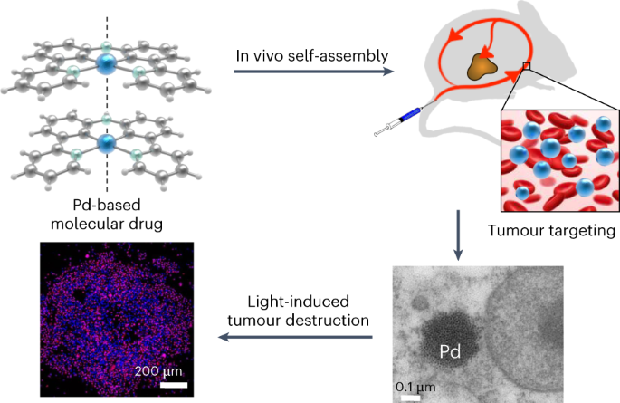
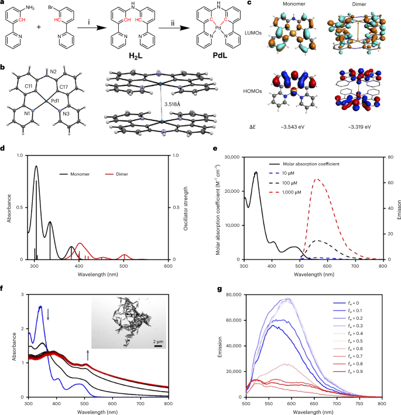
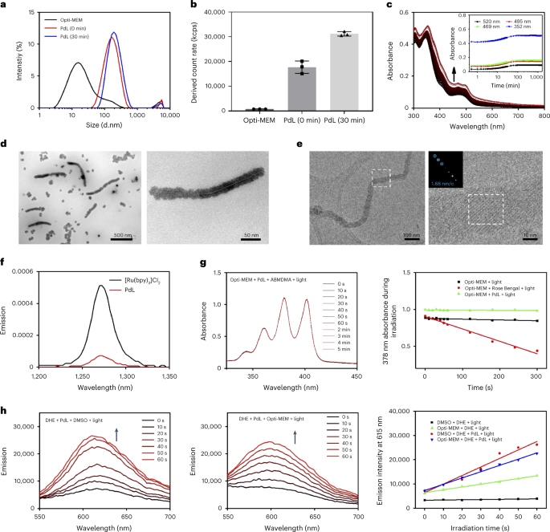
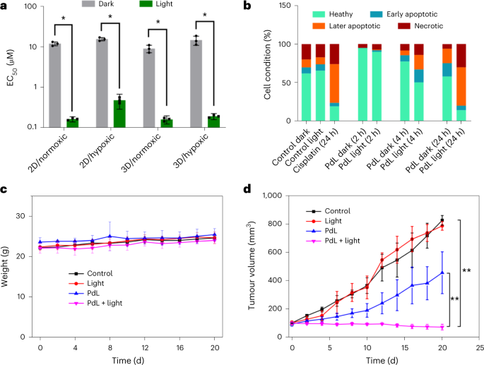
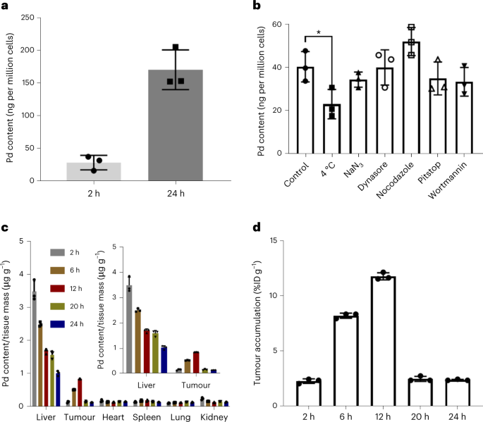

 

#  Nature Chemistry:聚集增强的亲金属作用的纳米光敏药物 
 
 原创

Drug Delivery

药物递送

治疗癌症是当代医学面临的最艰巨挑战之一，而目前癌症治疗体系中使用的比较频繁的化疗却有着明显的副作用，他们对癌症组织没有特异性，会在血清中被快速清除，而且在肿瘤部位的积聚率低。为了克服化疗小分子的这些弊端，研究人员通常选择通过共价或者非共价的方式讲他们结合到合适的纳米载体上，通过这些载体来提升药物的递送效率。

①

【设计、合成与表征】

如同最近被批准用于临床光动力疗法（PDT）的padeliporfin光敏剂一样，**PdL**小分子（图1a）也包含一个钯（II）金属中心。然而，与padeliporfin不同的是，**PdL**是一个双环金属化的钯化合物，其特点是存在两个Pd-C共价键（图1b）。它的单晶结构（图1b）表明了**PdL**在晶体状态中会呈现头-尾的二聚体构型，同时两个**PdL**平面间的距离仅有3.4Å，而两个Pd原子间的距离也只有3.518Å，这表明PdL在固态下是存在亲金属相互作用的，而理论计算结果也支持这一结论（图1c,d）。

接着，作者研究了**PdL**的光物理特性，当它溶于含有空气的二甲亚砜（DMSO）时，**PdL**显示出低的量子产率（φp = 0.0016）和短的寿命（τ = 0.295 μs）（图1e），而在除氧的条件下，**PdL**的量子产率和寿命增加了1-2个数量级（分别为0.07和29.6μs），这表明**3PdL\***能有效地与分子氧发生作用。通气和除氧条件下的瞬态光谱表明，最初形成的单线态激发态**1PdL\***进行了快速的系统间跨越，变成**3PdL\***（速率=34.5 ns-1），然后通过电子转移与O2反应，生成**PdL+**阳离子。这一结果再次表明，**PdL**可能参与PDT I型反应性，通过电子转移产生超氧自由基（O2-）。

在纯DMSO中，**PdL**（100μM）大部分是单体的，紫外-可见光谱随温度的微小变化初步表明低亲和力的二聚化，相反，在DMSO/H2O 1/9混合物（100 µM）中，观察到基线的快速增加（&lt;1分钟）和504 nm处新吸光峰的产生（图1f），这是典型的由Pd⋯Pd相互作用引起的金属-金属-配体电荷转移激发态，而透射电子显微镜（TEM）图像也证实了这一假设（图1f）。通常，Pd⋯Pd超分子键的形成伴随着一个长波长的发射峰，事实上，DMSO/H2O混合物中H2O含量的增加导致了在564 nm的单体发射峰逐渐被593 nm（fw=0）的新发射最大值取代，最后移动到610-670 nm（fw = 0.9），伴随着沉淀物的形成（图1g），而在THF/H2O体系中同样观测到了这种现象。总的来说，**PdL**似乎很容易在水的存在下进行自组装，尽管所产生的自组装完全取决于它所溶解的溶剂的详细组成。

图1.a, H2L和PdL的合成。b，PdL的位移椭圆图（50%的概率水平）及其在110(2)K的堆积结构。c，PdL作为单体或二聚体的HOMO（底部）和LUMO（顶部）的DFT计算理论水平：d，PdL作为单体（黑线）或二聚体（红线）的TDDFT计算光谱。e, PdL在不同浓度的纯DMSO溶液中的吸收光谱（黑色实线）和发射光谱。f，PdL的H2O/DMSO溶液（100 µM；fw = Vwater/Vtotal = 0.9）在298 K下30分钟（30s间隔）的吸收光谱的时间演变；g，不同体积比fw的H2O/DMSO混合物中PdL（100 µM）的发射光谱。

②

【组装及光动力性质】

接着，作者在Opti-MEM 细胞生长培养基中研究**PdL**的自组装行为，在浓度为25 µM时，**PdL**立即发生了聚集，动态光散射（DLS；图2a）测定的其流体力学直径约为164 nm，而30分钟后，虽然直径只增加到190 nm，但颗粒的数量明显增加（图2b）。溶液的紫外吸收吸收（图2c）在最初的2小时内显示也显现出纳米颗粒生长的光散射的特征。通过TEM观察到PdL主要是以纳米点（图2d）存在，但这些纳米点会自组装成规则的纳米纤维，并逐渐加长，而冷冻电镜（Cryo-EM）成像证实了纳米纤维的形成（图2e）。另外值得注意的是，PdL聚集体的光致发光寿命被溶液中的O2大幅淬灭，这表明聚集体与O2的反应甚至比单分子PdL（在DMSO中）更快。另外，与DMSO/H2O（图1f）或THF/H2O混合物中的纳米棒相比，他们的形状并不相同，这表明纳米棒的形成可能涉及介质中的蛋白质，因此，作者通过蛋白质凝胶和BCA蛋白质检测试剂盒来测定细胞培养基中形成的纳米聚集体的蛋白质含量。结果表明，在培养基中参与稳定纳米颗粒的蛋白质量很低，在这种条件下观察到的不同形状应该是其他因素造成的，如化合物浓度、溶剂极性、pH值、离子力、盐的存在、粘度等，当然，Pd的亲金属作用在这其中一定也扮演了重要的角色。

接着，作者考察了自组装对PdL的光化学性质的影响。在蓝光照射（450 nm）下，单分子PdL的1O2生成率非常低（φΔ=0.09；图2f），而PdL自组装体的1O2生成量同样很低（φΔ = 0.04），这说明PdL是一种很差的PDT II型致敏剂，相反，当PdL（25 µM）的DMSO或Opti-MEM溶液在绿光照射时，能有效地产生氧化产物2-羟基乙锭（图2h），这些结果表明它可能是PDT I型光敏剂，通过电子转移产生其光动力效应。

图2. a，Opti-MEM培养基及其PdL（25 µM）溶液在0分钟（红线）或30分钟（蓝线）的粒度分布。b，PdL溶液在Opti-MEM培养基中0和30分钟的DLS计数率。c, PdL (25 µM)在Opti-MEM培养基中24小时内的吸收光谱。d,e, 室温下从PdL (25 µM)的Opti-MEM培养基溶液中制备的样品的TEM（d）和冷冻EM图像（e）。f, [Ru(bpy)3]Cl2（黑色）和PdL（红色）在CD3OD中用蓝光（λex = 450 nm; 50 mW; 0.4 W cm-2）照射时的单线态氧发射光谱。g，在绿光照射（515 nm；2.0 mW）下，9,10-蒽二基-双（亚甲基）二马龙酸（ABMDMA）Opti-MEM溶液（100 µM）在5分钟内的吸收光谱（左）和378 nm处的吸光度的时间演化（右）。h，DMSO（左）或Opti-MEM（中）中的DHE溶液在绿光照射（515 nm；2.0 mW）60秒内的发射光谱（左，中）和615 nm处的发射强度（右）的时间演变。

③

【体内、体外活性】

考虑到PdL在520 nm处的良好吸收（ε=915 M-1 cm-1）及其PDT I型特性，作者首先在体外使用肺癌（A549）、表皮癌（A431）和皮肤黑色素瘤（A375）细胞系评估了其细胞毒性。在常氧（21% O2）和缺氧（1% O2）条件下，PdL对这三种癌细胞系显示出中等程度的暗毒性（半最大有效浓度（EC50）&gt;10 µM）。相反，在常氧和缺氧条件下，经绿光照射（520nm；13J cm-2），PdL表现出高光毒性，具有亚微摩尔EC50和高光指数（EC50,dark/EC50,light=32-72；图3a）。在光照组中，2小时内没有观察到明显的毒性，但在4小时和24小时后，凋亡和坏死细胞的数量有所增加，这表明PdL在辐照4小时后通过两种细胞死亡机制诱发了癌细胞死亡（图3b）。而PdL在三维多细胞肿瘤模型（A549和A375）中的细胞毒性也得到相同的结果。

为了解释了解造成这种光毒性的原因，作者进行了一些机制研究。首先，作者发现在有PdL存在的情况下，光照后细胞内的ROS，特别是超氧化物水平明显增加，而谷胱甘肽水平下降。这些结果表明电子转移（PDT类型I）可能是细胞中PdL聚集体光毒性的主要来源。之后作者发现PdL聚集在细胞的膜部分（包括细胞、线粒体和溶酶体膜）和细胞核，因此PdL可能与DNA光分解有关。然而，实验表明PdL并不会对DNA造成影响，因此PdL出色的光毒性可能更多的是来自于富含膜的细胞器中ROS水平的增加，而不是来自于细胞核中的DNA损伤。

进一步的，作者使用小鼠黑色素瘤模型评估了PdL的消除肿瘤特性，在尾部静脉注射后，小鼠在20天内表现出恒定的体重（图3c），重要器官保持健康，表明该化合物剂量下的系统毒性低。在无光照下，PdL显示出适度的肿瘤生长抑制效果，但在绿光照射下，PdL显现出了明显的肿瘤生长抑制率（图3d），并且，最然肿瘤组织明显受损，但其他组则没有显示出任何明显的效果。

图3. a，PdL在A375二维和三维球状体癌细胞中的EC50值。b, 流式细胞仪定量分析健康、早期凋亡、晚期凋亡和坏死的A375细胞。c，治疗后20天内小鼠体重的时间变化。d，尾部静脉注射治疗的不同组小鼠的A375肿瘤生长抑制。

④

【摄取、生物分布和肿瘤靶向性】

作者通过ICP-MS分析了药物在体外和体内的吸收情况。结果发现细胞对PdL（2 µM）的吸收与时间（图4a）和温度（图4b）有关。进一步的共存实验（图4b）表明，主动内化是通过凝集素介导的内吞作用（pitstop）和微蛋白细胞作用（wortmannin）发生的。总的来说，这些结果强调了PdL的细胞摄取可能是通过不依赖能量和依赖能量两个途径一起实现的，表明PdL可能以单分子和纳米聚集体的形式通过细胞膜。

另一个要了解的基本问题是PdL在体外形成的纳米颗粒的过程是否也会在体内发生，因此，作者对注射了PdL的小鼠体内的纳米结构的存在和形态进行了研究。首先，在小鼠尾部静脉注射5分钟后，从小鼠眼窝中提取的血样显示的纳米颗粒大致为球形，其平均尺寸为181±75纳米。与注入的纳米颗粒相似，此外，我们还向一只小鼠注射了PdL（4.2mM）的纯、非聚集的DMSO溶液，5分钟后的血液样本表明确实形成了直径约为100纳米的富钯圆形纳米颗粒，与静脉注射PdL时观察到的纳米颗粒相似。

为了量化药物递送效率，在静脉注射数小时后（2、6、12、20和24小时），用ICP-MS测定Pd在A375小鼠异种移植中的生物分布情况。如图4c所示，该复合物在心脏、肾脏和肺部的累积量较低（低于0.27微克/克组织），而肝脏的累积量明显较高（每克组织高于1.0微克）。值得注意的是，PdL在肝脏中的积累水平随着时间的推移逐渐下降，同时，肿瘤组织显示出不断增加的Pd积累，从2小时后的每克组织0.17微克到12小时的每克组织0.87微克的峰值，相当于每克注射剂量的10.2%（% ID g-1）（图4c,d），最后在24小时时下降到每克组织0.17微克。这些结果突出表明，PdL纳米颗粒在血液中的循环时间长（约8小时），导致其肿瘤蓄积率非常高，在12小时达到峰值。

图4. a，用PdL（2 µM）处理2或24小时后A375皮肤黑色素瘤细胞的Pd含量（ICP-MS）。b，用PdL（5 µM）和不同的吸收抑制剂处理2小时后，A375皮肤黑色素瘤细胞单层的Pd含量（ICP-MS）。c, 钯的生物分布。d，小鼠尾部静脉注射PdL后不同时间点的肿瘤钯积累效率。

⑤

【 结论 】

该研究设计的PdL的药物具有很好传递特性，包括长循环时间(12小时)和在肿瘤组织中良好的积累水平(高达10.2% ID/g)。从光化学角度讲，与卟啉不同，PdL复合物在聚集状态下保持良好的光动力学性质，即使在缺氧的肿瘤微环境中也是如此。有了这些结果，该研究得出结论，亲金属相互作用可以潜在地用于构建具有改善肿瘤积聚的高性能超分子纳米载体，并且与PdL等复合物观察到的Pd⋯Pd相互作用可以产生光动力系统，在缺氧下保持其光毒性。该研究用光激活的DSDS证明了亲金属相互作用在活小鼠的血液循环中存活，自组装纳米颗粒在人类皮肤黑色素瘤异种移植中显示出出色的肿瘤靶向和光治疗特性。

Zhou, X.-Q.; Wang, P.; Ramu, V.; Zhang, L.; Jiang, S.; Li, X.; Abyar, S.; Papadopoulou, P.; Shao, Y.; Bretin, L.; Siegler, M. A.; Buda, F.; Kros, A.; Fan, J.; Peng, X.; Sun, W.; Bonnet, S. In Vivo Metallophilic Self-Assembly of a Light-Activated Anticancer Drug. Nat. Chem. 2023. https://doi.org/10.1038/s41557-023-01199-w.

**关注公众号并回复doi，可获得原文下载链接**

[JACS:荧光材料何必只做成像](http://mp.weixin.qq.com/s?__biz=MzkzOTI1OTMwNg==&amp;mid=2247483894&amp;idx=1&amp;sn=cf6ef0d3c2deaf9c549a264449cc3bb3&amp;chksm=c2f2e533f5856c2595509d15f8e384f8d88b00685f0dfe4d82af30339211bec69a907905363a&amp;scene=21#wechat_redirect)

[JACS:还在用叠氮-炔？快来试试新型的生物正交反应](http://mp.weixin.qq.com/s?__biz=MzkzOTI1OTMwNg==&amp;mid=2247483883&amp;idx=1&amp;sn=6efed231961a5b2f378ab44c1fe718ee&amp;chksm=c2f2e52ef5856c38a8f02ae4314f4a7fe7165c0f077be7b6352af23746c9d7f6fe8c16d4c7bc&amp;scene=21#wechat_redirect)

[JACS:是时候抛弃偶氮苯了，新型的可见光开关](http://mp.weixin.qq.com/s?__biz=MzkzOTI1OTMwNg==&amp;mid=2247483849&amp;idx=1&amp;sn=3f65047f764eada0b4ba27c1ebb811cb&amp;chksm=c2f2e50cf5856c1ae10eac3962c18edd925aecea291fd5fc68464a70610783e309f018f95a59&amp;scene=21#wechat_redirect)

预览时标签不可点

  继续滑动看下一个 

 轻触阅读原文 

    

