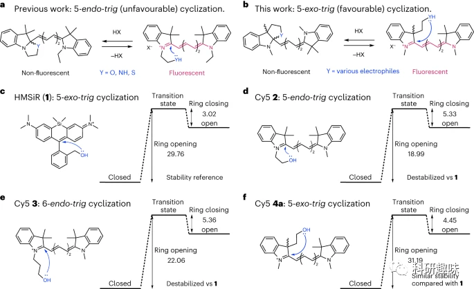

 

#  【Nat. Chem.】解决你的荧光需求！全新策略让你轻松拥有高性能花菁类染料 
 

Grenemal

读完需要

6

全文字数 1731  字

**引言**

作者首先介绍了荧光显微镜在细胞结构和功能研究中的重要性，特别是荧光蛋白标签和小分子荧光团的作用。同时，也介绍了荧光探针的开发和应用，特别是基于罗丹明染料的荧光探针。这些染料具有平衡状态敏感性和优异的荧光性能，可以用于免清洗、多色、活细胞荧光成像实验。此外，文中还提到花菁类染料在细胞、组织和整个有机体成像中的广泛应用，以及近红外区域染料的发展限制。最后，作者提出了一种用于活细胞成像的荧光多亚甲基染料的通用策略，通过经典有机化学启发式方法设计出有利的环化反应，从而制造出高信噪比的聚甲基染料。

**结果与讨论**

**Probe design and validation**

作者首先强调了高效致荧染料的要求，即非结合状态下应以非荧光形式存在，只有与目标结合后才显现荧光。对于基于环化的致荧性，需要确保开环能垒很高和闭环能垒很低。

在选择环化类型时，作者提到了使用鲍德温规则来估算极性环化反应的有利程度。作者指出，相较于之前尝试的5-内向-三位环化反应，采用5-外向-三位环化反应可能是一种更有效的替代方法。

图1. 花菁类染料和HMSiR的分子内环化反应

为了验证理论，文本使用密度泛函理论（DFT）计算了一种硅罗丹明衍生物（HMSiR）的开环和闭环能量，并将其与其他Cy5衍生物进行了比较。实验结果表明，HMSiR的开环能较大，闭环能较小。

接下来，通过合成不同类型的Cy5衍生物，包括经过不同环化反应的探针，进行了实验验证。在活细胞成像实验中，5-内向-三羟甲基探针在线粒体中显示出明亮的荧光，而5-外向-三羟甲基探针主要定位于溶酶体。

图2. 两种Cy5衍生物的合成及成像特性

此外，作者还探讨了探针与自标记蛋白质标签（SNAP-tag）结合后的荧光开启效应，以及一种设计模拟HMSiR环化平衡的探针。最后，通过活细胞SMLM成像实验证明，该设计的探针具有自发闪烁特性，可获得超分辨率荧光图像。

**A fluorogenic Cy5 derivative**

在接下来的部分中，作者描述了采用5-exo-trig合环策略开发的一种免洗、可致荧的Cy5衍生物。他们合成了几种衍生物并测试了pH值和极性对其环化平衡的影响。随后，他们将9c的甲酯基转化为N-甲基酰胺12，并制备了相应的环化产物13和Cy5探针14。

这些衍生物与苄基鸟嘌呤10结合后，生成了探针15和16。在与纯化的SNAP标记蛋白混合后，探针15的吸光度和荧光明显增加，表明与SNAP-tag结合后开环并提高了发射量子产率。相比之下，探针16在与SNAP-tag结合后，吸光度和荧光增加较少，表明其相对较弱的膜渗透性。

图3. 新型染料的成像验证

接下来，作者进行了免洗活细胞成像，比较了探针15、16和JF646的性能。在HeLa细胞中，探针15在细胞核中显示出明亮的荧光信号，而非特异性背景信号非常微弱，与JF646-BG相当。相反，探针16的荧光信号较弱，主要定位于囊泡中，表明5-内向三聚Cy5衍生物不适合作为免洗开启染料。

最后，作者测试了与其他大分子靶标结合是否也能诱导探针15的荧光开启。通过制备与肌动蛋白和DNA结合的探针17和18，他们发现这些探针在与大分子靶标结合后能够选择性地显示出强烈的荧光信号。这表明，5-exo-trig Cy5衍生物的致荧性不仅局限于SNAP-tag，其他大分子靶标也能诱导荧光开启。

**Fluorogenic Cy3 and Cy7 derivatives**

在这一部分中，作者探索了5-exo-trig荧光策略是否适用于拓展到Cy3和Cy7染料，以提供两个额外的成像通道。作者推测Cy5的LUMO能比Cy7高而比Cy3低，因此Cy3更偏向于形成开环结构而Cy7更偏向于形成闭环结构，因此，为了平衡Cy3和Cy7的趋势，他们在Cy3上使用了CF3，在Cy7上用一个缺电子的酰胺替代了N-甲基酰胺。

作者制备了用于SNAP标记的Cy3衍生物19和Cy7衍生物20。这两种探针与纯化的SNAP标记蛋白结合后显示出荧光行为，荧光的大幅开启表明与SNAP标记的结合大大提高了这些探针的发射量子产率。这些探针随后被用于对转染了H2B-SNAPf-mTurquoise2质粒的HeLa细胞进行免洗活细胞成像实验，证实了它们的特异性。

图4. Cy3和Cy7的结构及成像图谱

探针15、19和20覆盖了可见光谱的大部分，并延伸至近红外区域。它们与SNAP-tag结合后显示出极好的亮度和光稳定性。在多色成像实验中，通过与含有荧光剂的Cy5染料15和JF549-Halo染料进行成像，证实了这些荧光探针与罗丹明-HaloTag偶联物的交叉性。作者还探讨了Cy3衍生物19和JF549-Halo的荧光信号是否可以通过它们的激发态寿命来区分，通过荧光寿命成像（FLIM）成功地通过它们的平均激发态寿命区分了它们。

**结论**

在这篇文章中，作者介绍了一种通过5-exo-trig闭环方法赋予聚甲基染料致荧光性的通用策略。这些染料可以通过两个高产步骤轻松合成，并且易于通过改变吲哚鎓结构单元或闭环分子进行衍生。作者通过生成自发闪烁的Cy5染料、含荧光剂的Cy3和Cy5染料以及明亮、光稳定的近红外含荧光剂Cy7，展示了这种含荧光剂聚甲醛支架的潜力。

Martin, A., Rivera-Fuentes, P. A general strategy to develop fluorogenic polymethine dyes for bioimaging. Nat. Chem. (2023). https://doi.org/10.1038/s41557-023-01367-y

**关注并回复文章DOI获取全文：**

10.1038/s41557-023-01367-y

**点击蓝字 关注我们**

预览时标签不可点

素材来源官方媒体/网络新闻

  继续滑动看下一个 

 轻触阅读原文 

   

