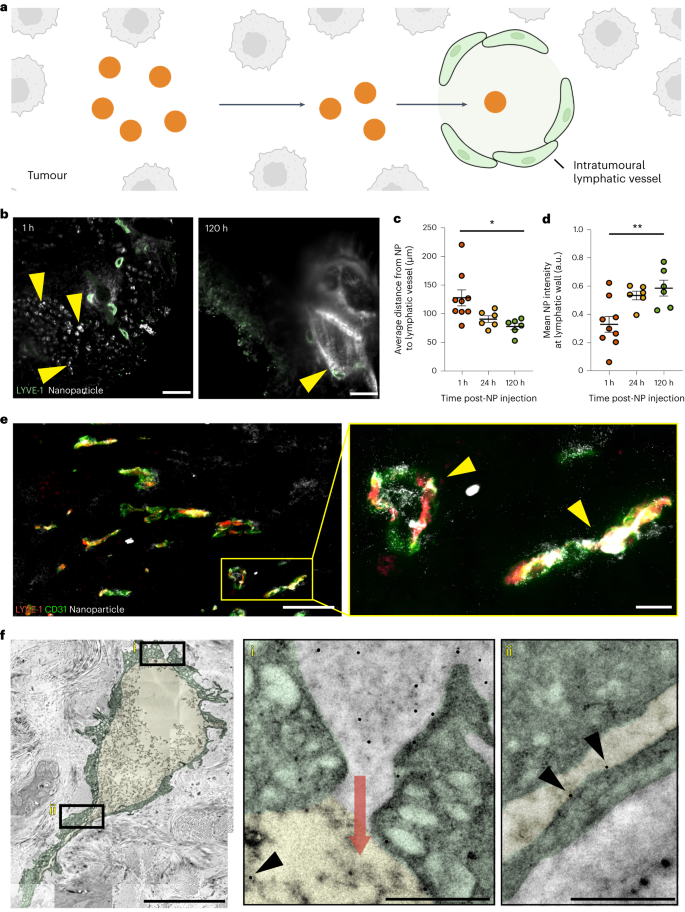
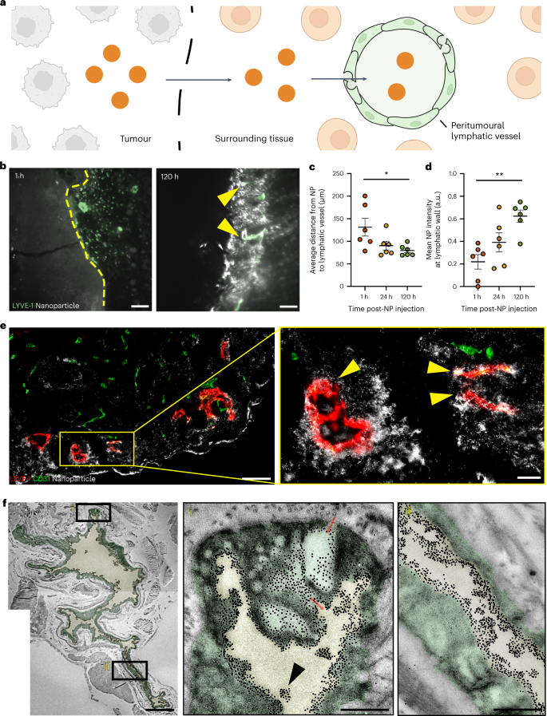
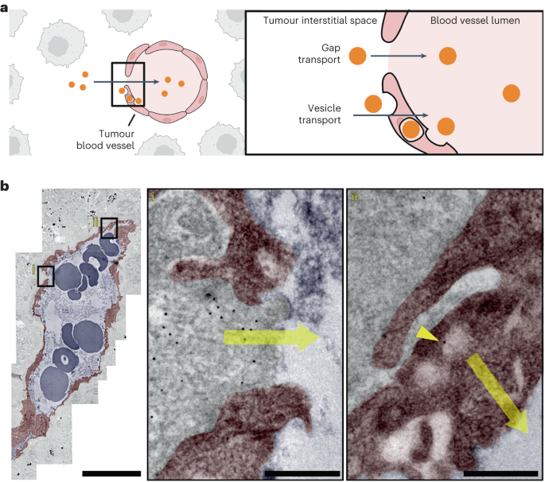
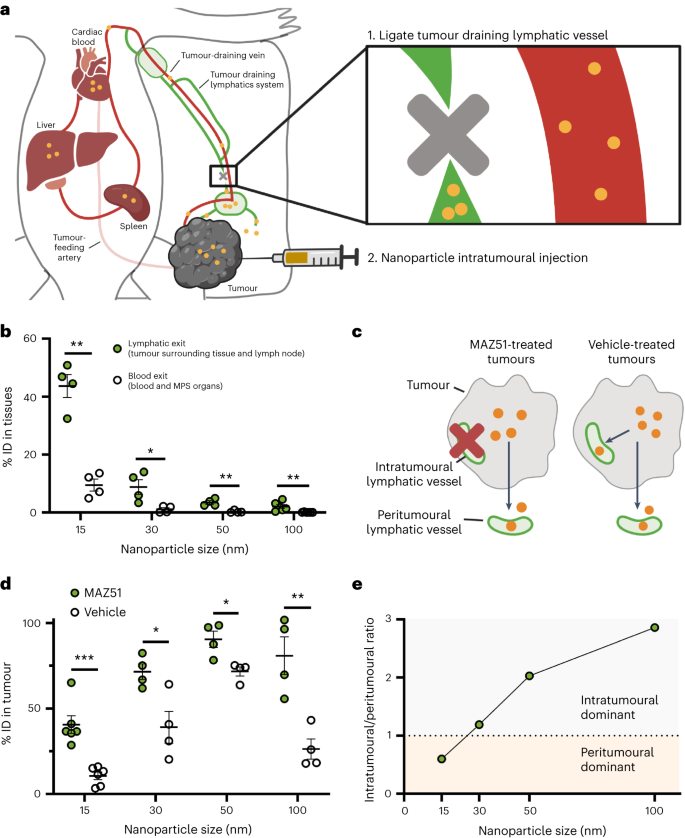
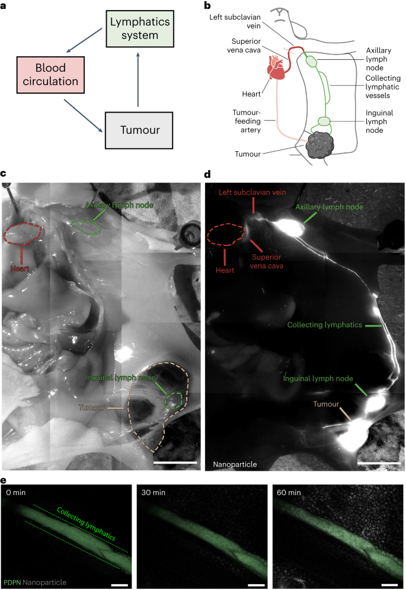
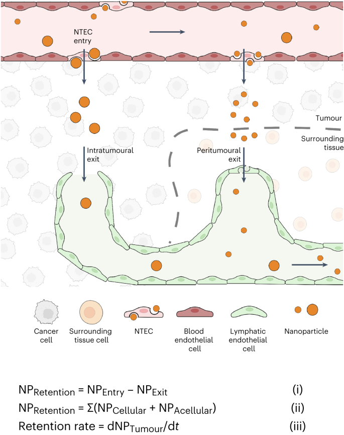

 

#  【Nat. Mater.】揭示纳米药物肿瘤传输的全新机制，EPR解释不了的现象ART可以！ 
 

Grenemal

读完需要

18

全文字数 5677 字

**Introduction**

引言

纳米颗粒给药系统的设计需要深入了解纳米颗粒进出实体瘤的过程，目前，科研人员普遍接受和使用的理论是EPR效应，然而，现有文献对纳米粒子无法通过淋巴管排出肿瘤的观点提出了质疑。药代动力学研究表明，纳米粒子在肿瘤中的浓度达到最大值后会随着时间的推移而降低，量子点、碳纳米管和其他纳米材料在肿瘤内注射后会在肿瘤排泄淋巴结中积聚。

**Result**

实验结果

通过使用金纳米粒子作为模型纳米材料，并对其在组织中的含量进行精确定量，作者量化了纳米粒子从肿瘤中排出的过程。作者通过向罹患肿瘤的小鼠静脉注射一定数量的金纳米粒子，并切除不同时间点的肿瘤样本，用ICP-MS分析纳米粒子的数量，从而捕捉纳米粒子在肿瘤内的积累和排出过程。研究结果显示，注射后48小时后，纳米粒子的排出过程主导了肿瘤药代动力学曲线，使肿瘤积聚量比测量的最大值减少了45%。之后，文中探讨了使纳米粒子排出的三种不同的血管途径：瘤内淋巴管、瘤周淋巴管和肿瘤血管。

**通过肿瘤内淋巴管排出**

作者首先探讨了纳米粒子是否能够通过肿瘤内的淋巴管（即肿瘤内淋巴管）排出肿瘤。根据当前的理论，这些淋巴管呈现塌陷的状态，这意味着其管腔尺寸过小，纳米粒子无法通过。为验证此理论，作者分析了瘤内淋巴管引流纳米粒子的特征。大多数肿瘤淋巴管在光学显微镜成像时显示为塌陷，因为其结构尺寸接近或低于衍射极限（即激发波长的一半）。为克服这一局限，作者采用了透射电子显微镜（TEM）进行观察。TEM 扫描结果显示，所有肿瘤淋巴管的管腔尺寸均大于 286 纳米。这些 TEM 结果证明，**肿瘤淋巴管的管腔足够大，纳米粒子可以通过**。

为进一步研究纳米粒子是否通过瘤内淋巴管排出肿瘤，作者首先确定纳米粒子是否会向淋巴管移动并进入淋巴管（图 1a）。作者将 15 nm 金纳米粒子通过静脉注射进入 B16F10 肿瘤小鼠体内。随后，作者利用三维（3D）暗视野和荧光显微镜对注射后 1 小时、24 小时和 120 小时的纳米粒子（以白色显示）和淋巴管（以绿色显示）进行了成像（图 1b ）。这些时间点捕捉了纳米粒子的积累和从肿瘤中排出的过程。通过计算分析这些图像，作者确定了纳米粒子与淋巴管的相关位置。120 小时后，纳米粒子与瘤内淋巴管的距离缩短了 50.1 μm（图 1c）。从注射后1小时至120小时，淋巴管壁上的纳米粒子强度从0.33 a.u.增加到0.58 a.u.（图1d）。在所有观察时间点，纳米粒子均位于管腔内。这些结果表明，**纳米粒子会向肿瘤内淋巴管移动，到达血管壁并在血管腔内被发现**。

作者利用组织学方法和透射电子显微镜（TEM）作为补充证据，证实了肿瘤内淋巴管能排出纳米粒子。组织学方法可以量化较大的肿瘤淋巴管群，而TEM则能够观察到单个纳米粒子的运动。作者将15 nm纳米粒子直接注入B16F10肿瘤，随后在1小时后制备肿瘤切片进行组织学或TEM分析。需要注意的是，瘤内注射并不会影响瘤内淋巴管的大小和密度（补图11）。

在组织学切片中，作者使用暗视野显微镜观察到了金纳米粒子的位置。结果显示，纳米颗粒（以白色显示）与80.7%的瘤内淋巴管（以红黄色显示）存在定位关系，其中还包括有可见管腔的淋巴管（图1e）。TEM成像则显示了单个纳米粒子通过细胞间通道穿过淋巴管壁的过程（图1f(i)）。在淋巴管腔内，作者观察到了单个纳米颗粒（以黑色箭头标示）（图1f(i)、(ii)）。此外，作者还发现在肿瘤淋巴管内存在100 nm的纳米粒子，但其中包含100 nm纳米粒子的淋巴管数量只有包含15 nm纳米粒子的淋巴管的一半。而且，100 nm纳米粒子在淋巴管中的数量是15 nm纳米粒子的21倍。

随后，作者利用组织学方法对不同纳米粒子尺寸和材料类型、肿瘤模型以及注射方案的瘤内淋巴引流情况进行了研究。结果显示，53%的50纳米金纳米粒子、61%的100纳米金纳米粒子、67%的100纳米硅纳米粒子和47%的100纳米脂质体都与瘤内淋巴管存在定位关系。在免疫功能正常的4T1肿瘤模型和自发性MMTV-PyVT肿瘤模型中，15纳米金纳米粒子分别与73%和75%的瘤内淋巴管存在定位关系。此外，静脉注射的15纳米、50纳米和100纳米金纳米粒子分别出现在33%、54%和85%的瘤内淋巴管中。

这些数据充分表明，**无论是在不同的纳米粒子设计、肿瘤模型还是注射方案下，纳米粒子都有能力通过肿瘤内淋巴管排出肿瘤**。

图 1：纳米颗粒排入瘤内淋巴管。

**通过瘤周淋巴管**

作者接着研究了纳米粒子是否通过肿瘤周围的淋巴管（称为瘤周淋巴管）排出肿瘤。这一过程要求纳米粒子运出肿瘤边缘，积聚在周围组织中，然后由肿瘤周围淋巴管排出（图 2a）。这一过程可能受到肿瘤生长因子和注射的蛋白质的影响，但在纳米粒子上也出现过。作者采用与瘤内淋巴管相同的实验方法，研究了纳米粒子是否通过瘤周淋巴管排出肿瘤。瘤周淋巴管的三维成像（图 2b ）显示，120 小时后，纳米粒子到血管的距离减少了 51.8 μm（图 2c）。注射后 1 小时至 120 小时期间，血管壁上的纳米粒子平均强度从 0.21 a.u. 增加到 0.62 a.u. （图 2d）。在注射后 1 小时和 24 小时，在肿瘤周围淋巴管内观察到较低的纳米粒子信号。注射后 120 小时观察到大的纳米粒子团。瘤周淋巴管的组织学检查显示，74%的瘤周淋巴管都有纳米颗粒（白色）定位（黄色箭头；图 2e ）。

TEM 成像显示，单个纳米粒子通过相互连接的囊泡和空泡群穿过瘤周淋巴管壁（图 2f(i)）。这些小泡和空泡可将胶体和大分子运送到健康皮肤的淋巴管中。在血管腔内，包括在小于光学显微镜衍射极限的区域，都能观察到单个纳米颗粒（图 2f(i)、(ii) ）。ICP-MS 和组织学证实，在相同的实验条件下，这些由肿瘤周围淋巴管排出的纳米粒子是被运出肿瘤的，而不是通过血液循环独立产生的。这些证据表明，**肿瘤周围淋巴管具有将纳米粒子从肿瘤中排出的功能。**

为了测试不同条件下瘤周淋巴管的引流情况，作者使用组织学方法进行了全面研究。实验结果显示，不同尺寸和材料类型的纳米粒子、不同的肿瘤模型以及注射方案均对瘤周淋巴管的引流情况产生了影响。具体来说，50 nm 金纳米粒子、100 nm 金纳米粒子、100 nm 硅纳米粒子和 100 nm 脂质体分别定位了 40.0%、36.6%、20.0% 和 30.0% 的瘤周淋巴管。在 4T1 和 MMTV-PyVT 肿瘤模型中，15 nm 金纳米粒子分别定位了 73.3% 和 91.7% 的瘤周淋巴管。这些结果表明，**不同来源的纳米粒子均可通过瘤周淋巴管从肿瘤中排出**。

图 2：纳米颗粒排入肿瘤周围淋巴管。

**通过血管排出**

作者接着研究了纳米粒子是否通过血管排出肿瘤。作者推测这一排出机制可能涉及间隙和运输泡，因为这些结构为纳米粒子的进入提供了途径（图 3a）。作者将 15 nm 纳米粒子直接注入 B16F10 肿瘤，1 小时后对肿瘤进行 TEM 处理。结果显示，1 小时后大部分纳米粒子仍留在肿瘤内，仅有 0.026% 的纳米粒子进入血液循环。考虑到血液循环中的纳米粒子数量，作者计算出间隙和囊泡中的纳米粒子有超过 97% 的概率（分别为 0.997 和 0.977）从肿瘤转移到血管中。

为了进一步分析这一过程，作者使用 TEM 观察了总周长为 1.5 mm 的血管。结果显示，在内皮细胞间隙和囊泡中均发现 15 nm 的纳米颗粒（图 3b(i)、(ii)）。这种成像结果证实了纳米粒子确实可以通过血管离开肿瘤，但这一过程并不常见，**与通过淋巴管离开肿瘤的纳米粒子相比，其概率要小得多**。

通过血管运输的纳米粒子的密度在间隙和囊泡中分别仅为每毫米 7.2 纳米粒子和 10.4 纳米粒子。这些数值与瘤内和瘤周淋巴管相比有显著差异，后者每毫米分别传输了 43.5 纳米粒子，同样发现纳米粒子很少通过间隙和囊泡运输。

图 3：纳米粒子通过血管进入肿瘤。

**主导机制**

dominant mechanism

接着，作者确定了主要的排出机制。首先，作者研究了纳米粒子是通过淋巴管（瘤内和瘤周）还是血液机制排出肿瘤。利用淋巴管造影术，作者明确了肿瘤的引流淋巴系统，随后进行血管结扎，防止纳米粒子从淋巴系统转移到血液循环中（图4a）。接着，作者向B16F10肿瘤注入了15nm、30nm、50nm和100nm的金纳米粒子。在24小时后处死小鼠，此时大部分纳米粒子已从肿瘤中排出。由于肿瘤引流淋巴系统被结扎，通过淋巴管排出肿瘤的纳米粒子会停留在周围组织和肿瘤引流淋巴系统中。而通过血管排出肿瘤的纳米粒子则留在血液和主要的器官（肝脏和脾脏）中。接着，作者切除了肿瘤周围的组织、肿瘤引流淋巴结、血液和器官，并使用ICP-MS对纳米粒子的数量进行了量化。结果显示，43.6%的15nm纳米粒子通过淋巴管排出肿瘤，而只有9.4%的15nm纳米粒子通过血管排出肿瘤。这表明**淋巴机制是血液机制的4.6倍**（图4b）。

为了进一步确定两种机制中哪一种占主导地位，作者首先抑制了瘤内淋巴管的排出功能，同时保持瘤周淋巴管不变（图4c），以区分它们的贡献。使用血管内皮生长因子受体-3抑制剂MAZ51抑制瘤内淋巴管，该抑制剂可阻止淋巴管向肿瘤内生长。每天将MAZ51或载体（对照组）直接注射到肿瘤内，连续注射五天。第六天向肿瘤内注射纳米颗粒，24小时后切除肿瘤并进行组织学或ICP-MS处理。组织学验证显示MAZ51治疗抑制了瘤内淋巴引流途径，但对瘤周淋巴管或血管没有影响。随后，作者使用ICP-MS对从MAZ51处理过的肿瘤和药物处理过的肿瘤中排出的纳米粒子数量进行了量化。对于15nm纳米粒子，24小时后分别有40.6%ID和10.6%的纳米粒子留在MAZ51处理过的肿瘤和药物处理过的肿瘤内（图4d）。结果显示对于MAZ51处理的肿瘤，纳米粒子排出方式主要是瘤周淋巴管，而对于载体处理过的肿瘤，纳米粒子则主要通过瘤内和瘤周淋巴机制排出。15nm纳米粒子的瘤内和瘤周淋巴出路之比为0.6（图4e）。作者对30nm、50nm和100nm纳米粒子重复了这一实验。结果显示，通过这两种淋巴机制排出肿瘤的30纳米粒子的数量相似。但值得注意的是，50 nm和100 nm的粒子通过瘤内淋巴管流出的比例高于通过瘤周淋巴管流出的比例（分别高出2.03倍和2.86倍）。这些趋势对于静脉注射纳米粒子也同样适用。15nm金纳米粒子定位的瘤周淋巴管比瘤内淋巴管多8%，而50nm和100nm金纳米粒子定位的瘤内淋巴管和瘤周淋巴管分别多44%和74%。这些证据表明，**主导的排出机制是纳米粒子的大小。较小（15nm）和较大（50nm和100nm）的纳米粒子分别主要通过瘤周和瘤内淋巴管排出肿瘤。中等大小（30nm）的纳米粒子通过瘤内和瘤周淋巴管排出肿瘤的比例相似。**

图 4：主要排出机制是纳米粒子尺寸

**循环**

circulation

淋巴系统通过胸导管和右淋巴干与血液脉管相连。口服和皮下注射的纳米粒子可通过这些途径从淋巴系统进入血液循环。作者在此证实，通过淋巴机制从肿瘤中排出的纳米粒子也会通过胸导管进入血液循环（图 5a）。作者对罹患 B16F10 肿瘤的小鼠进行经心灌注，将Cy5修饰的 15 nm 金纳米粒子注入肿瘤，并对肿瘤引流的淋巴系统进行荧光成像（图 5b）。心脏灌注清除锁骨下静脉和上腔静脉中的血液，以观察荧光信号。在肿瘤引流的淋巴系统（图 5c、d）中观察到纳米颗粒（白色），包括腹股沟淋巴结和腋窝淋巴结，以及连接这些组织和肿瘤的淋巴管。纳米粒子位于腋窝淋巴结、锁骨下静脉和上腔静脉通往心脏的淋巴管内（图 5c、d）。由于组织较厚，作者没有观察到来自心脏的荧光信号。作为阴性对照，未注射纳米颗粒时也没有荧光信号。显微成像进一步证实了纳米粒子在该系统中的传输（图 5e）。ICP-MS 证实，当动物未被麻醉时，15 nm 金纳米粒子会从淋巴系统转移回血液循环。在肿瘤引流淋巴系统、血液循环和连接这两个系统的部位也发现了 100 纳米二氧化硅纳米粒子和脂质体。这些证据表明，**纳米粒子通过淋巴机制从肿瘤排出后又被转移回血液循环。这些纳米粒子有可能在全身再循环，并在另一个通道与肿瘤相互作用。**

图 5：通过淋巴管排出肿瘤的纳米粒子又回到血液循环中。

**与健康组织对比**

comparable to healthy tissues

作者测试了EPR效应提出的肿瘤淋巴引流是否比健康组织淋巴引流更“差”。结果表明：

1. 纳米粒子的肿瘤滞留性与健康组织相当；
2. 肿瘤组织的淋巴吸收程度因时间点不同而与健康组织不同；
3. 肿瘤组织的淋巴吸收率超过健康组织；
4. 肿瘤内淋巴管的结构与健康组织淋巴管的结构相当，而肿瘤周围淋巴管比健康组织淋巴管大。

这四点证据表明，**两种肿瘤小鼠模型的淋巴引流与健康组织的淋巴引流相当**。

**讨论**

Discussion

**作者的研究结果使作者提出了一种替代EPR效应的纳米粒子向实体瘤输送的机制**。1986年提出的EPR是设计用于肿瘤靶向应用的纳米材料的指导机制。这一机制促使研究人员将重点放在设计具有长循环、多种特性和功能的微粒上，而且微粒要足够小，以便通过间隙扩散，被动地进入肿瘤。然而，由于纳米粒子在癌症应用中的临床转化效果不佳，作者和其他人开始质疑这一原理。如果这一机制是正确的，为什么那么多纳米粒子在临床试验中失败？关于这个问题有很多观点和看法。研究人员考虑了肿瘤的异质性以及人类和小鼠肿瘤的不同生理机能。虽然这些理由都是合理的，但很少有原创研究文章对其进行探讨或量化。

十年前，作者决定研究最简单的原因：EPR机制可能不正确。作者从第一原理的角度解决了这个问题。作者研究了特定的纳米粒子进出路径，以及这些路径如何决定纳米粒子的传输。作者系统地进行了这些研究，以便将研究结果拼凑成一个具体的中心概念。2020年，作者发现主要的进入机制是通过主动过程。在此，作者将重点放在纳米粒子的排出机制上。

截至2023年，原创研究文章、综述、观点和主要资助机构仍将EPR机制描述为淋巴管功能障碍。尽管有研究观察到聚合物、量子点和其他纳米级材料被输送到肿瘤引流淋巴系统和淋巴结，但这种观点依然存在。作者对这些证据的主要贡献在于确定了瘤内、瘤周、肿瘤血管和血液再循环机制对纳米粒子出口的贡献及其对纳米粒子尺寸的依赖性。作者的比较研究以及过去研究人员的知识使作者能够描述纳米粒子的排出机制。

现在，作者可以从更广阔的视角来看待纳米粒子的肿瘤传输过程。**纳米粒子通过主动运输过程进入肿瘤，包括跨内皮、囊泡器和旁观者效应。纳米粒子通过细胞机制或流体动力机制在肿瘤环境中传输。然后，纳米粒子根据其大小通过瘤内或瘤周淋巴管排出肿瘤。通过淋巴机制排出肿瘤的纳米粒子通过淋巴系统排出肿瘤，其中包括多个淋巴结和血管。这些纳米粒子最终会再次进入血液循环，从而再次将它们送入肿瘤。在这幅图中，纳米粒子滞留是指纳米粒子从进入到排出的运输延迟所导致的肿瘤中的纳米粒子数量。这种延迟是传输机制（例如，扩散、对流、基于细胞的传输）以及纳米粒子与肿瘤细胞和细胞成分相互作用。这些相互作用可能会将纳米粒子永久性地困在肿瘤内。由于生物组成的不同，这些相互作用在不同的肿瘤模型中可能会有所不同，从而导致不同的纳米粒子滞留量。作者将这些转运过程的集合称为主动转运和滞留（ATR）原理**（图6）。

图 6：主动迁移和滞留 (ATR) 原理。

**Outlook**

展望

作者的重要突破是发现了ATR原理，这一机制普遍存在于固体和软性纳米粒子以及多种肿瘤模型中。作者提出的原理已经引发了深入的辩论和讨论，同时激励了新的研究活动以进一步探究ATR原理的细节。作者确定了四个主要的研究领域：

1. 确定纳米粒子通过内皮细胞的转运机制。
2. 研究纳米粒子与肿瘤微环境成分的相互作用，了解其在影响肿瘤滞留方面的作用。
3. 深入探讨肿瘤淋巴管与健康组织淋巴管在功能和生理上的差异，如通透性变化、液体传输能力等。
4. 研究功能性淋巴管对肿瘤内纳米粒子传输的影响。

这些基础研究将建立起ATR原理的设计规则和数学模型。最终，这一原理将颠覆作者为肿瘤递送设计微粒和材料的传统策略。它将引导研究人员通过纳米粒子与生物系统之间的分子相互作用来控制纳米粒子的传输和保留，从而提高传输效率，作者希望这将改善纳米药物在人类患者身上的临床应用。

**点击蓝字 关注我们**

**关注并回复文章DOI获取全文：**

10.1038/s41563-023-01630-0

Nguyen, L. N. M.; Lin, Z. P.; Sindhwani, S.; MacMillan, P.; Mladjenovic, S. M.; Stordy, B.; Ngo, W.; Chan, W. C. W. The Exit of Nanoparticles from Solid Tumours. Nat. Mater. 2023, 22 (10), 1261–1272. https://doi.org/10.1038/s41563-023-01630-0.

[【 Nat. Biomed. Eng. 】同样使用ICG做手术导航，这种方法肿瘤识别精准率高达97%](http://mp.weixin.qq.com/s?__biz=MzkzOTI1OTMwNg==&amp;mid=2247484548&amp;idx=1&amp;sn=15c8c0c805c4ed45821482c8a7f429e7&amp;chksm=c2f2e041f5856957fc3e6ec801f48429bad92696c8e808f98682190c084d573b466669aaaab0&amp;scene=21#wechat_redirect)

[【Cell】揭秘结核菌秘密武器：蛇形索状结构为何抵御抗生素？研究突破引领抗结核新纪元！](http://mp.weixin.qq.com/s?__biz=MzkzOTI1OTMwNg==&amp;mid=2247484547&amp;idx=1&amp;sn=d3d253afcc8c3e0172f0456b7a92c074&amp;chksm=c2f2e046f5856950331005598dd885fa37c83c2188c52a0f821366705e83c32ef7dbd9ec08bb&amp;scene=21#wechat_redirect)

[【Adv. Mater.】纳米药物新综述，用于检测和治疗眼部细菌感染](http://mp.weixin.qq.com/s?__biz=MzkzOTI1OTMwNg==&amp;mid=2247484435&amp;idx=1&amp;sn=f1a023541b4636333bac2a138d11cba3&amp;chksm=c2f2e0d6f58569c0faa99a17197462d6afcf5f343e25ec8f391081e793ba4b70e1ba9e40e5e4&amp;scene=21#wechat_redirect)

预览时标签不可点

素材来源官方媒体/网络新闻

  继续滑动看下一个 

 轻触阅读原文 

    

