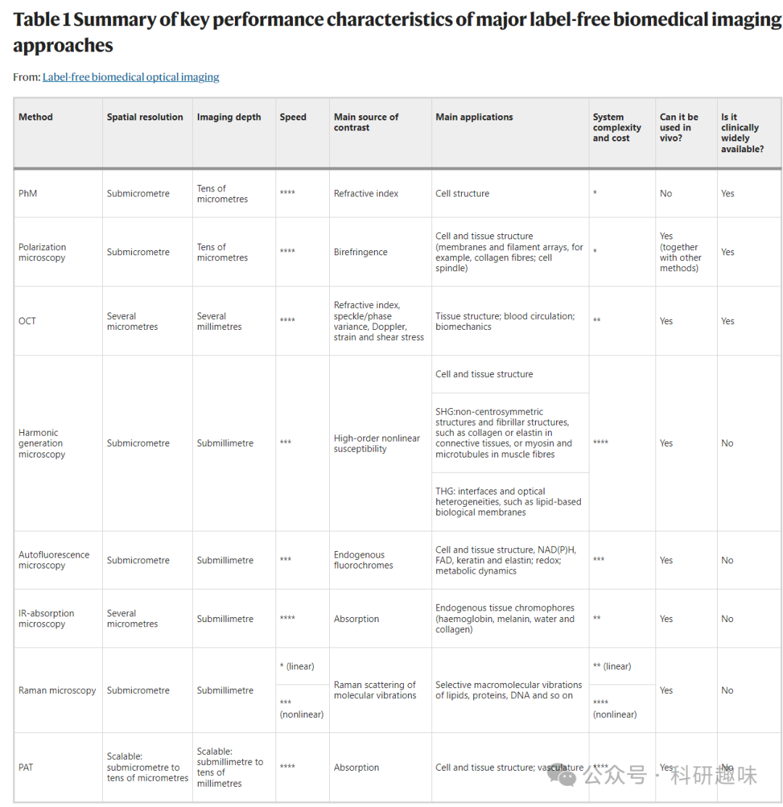
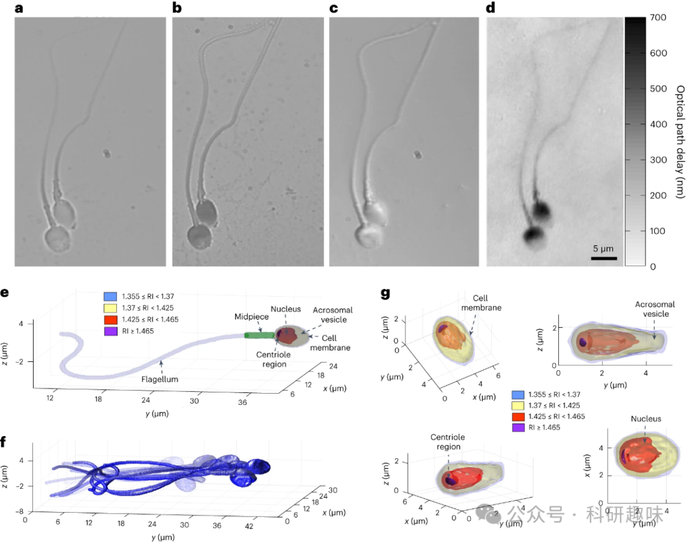
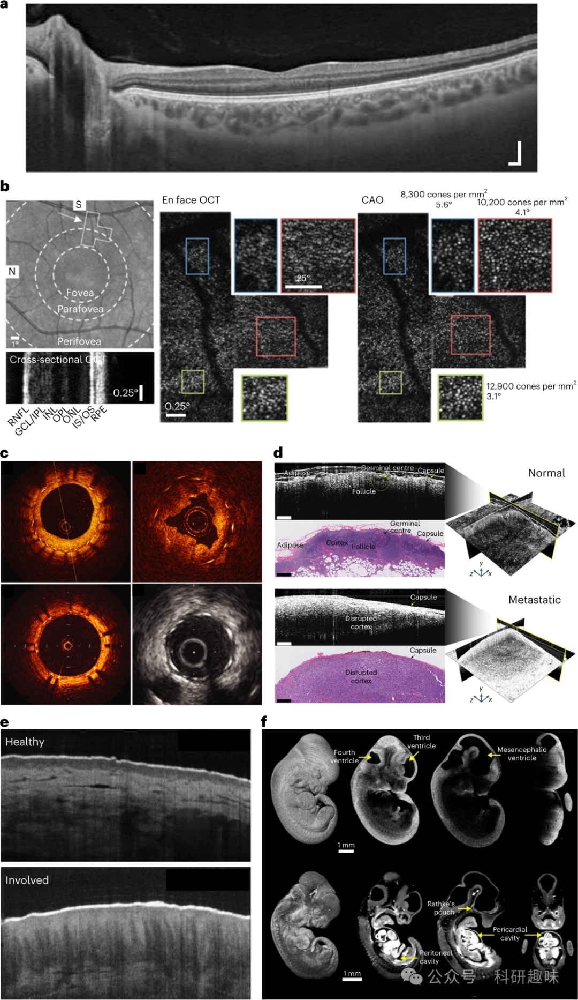
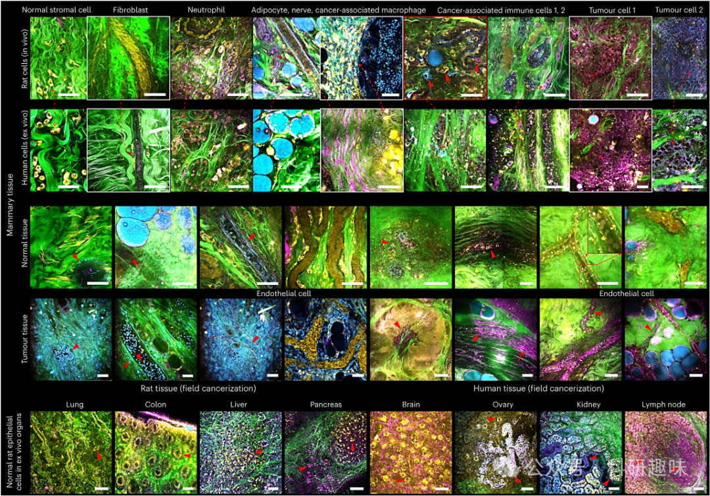
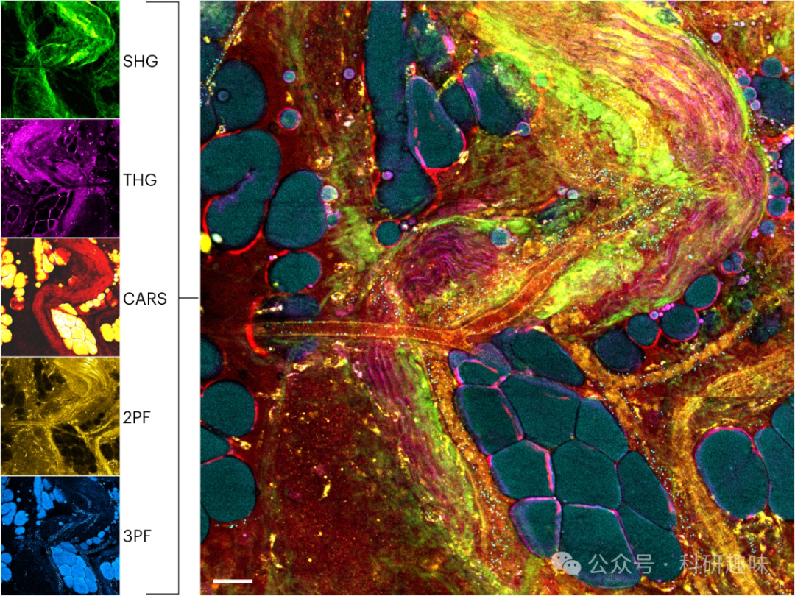
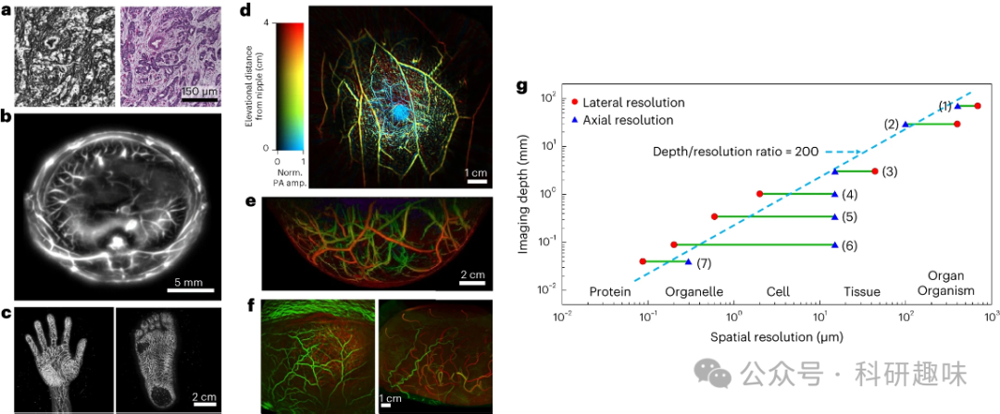

 

#  【Nat. Photon.】无标记生物光学成像，从此抛弃荧光标记？ 
 

Grenemal

读完需要

23

全文字数 8200 字

**Main**

生物医学光学成像，顾名思义，是利用光线捕捉体外或体内生物样本图像的多点测量技术。然而，生物样本的光学透明度导致成像对比度不足，进而可能遗漏重要的生物细节。例如，某些细胞仅引起轻微的光吸收，使得传统光学成像的对比度大大降低。

为了解决这一问题，通常会引入外源性标记剂，如荧光染料，与生物样本中的特定成分结合。此外，还可以通过基因修饰使细胞或生物体表达特定的光学特性。这些技术广泛应用于动物研究和体外诊断，但有其局限性。外源性标记和基因修饰会干扰活体细胞的自然过程，降低样本活性，并可能影响长期研究。而且，这些标记技术还可能带来定量和可重复性问题。因此，对于医学诊断和治疗中的体内成像，尤其是对人体参与者而言，基于标记的成像技术并不适用。

无标记光学成像则完全不同，它利用样本的固有特性，如折射率变化、自发荧光等，来生成成像对比度。这种技术不干扰测量和后续分析，但需确保光学能量不会损害细胞或组织的结构和功能。无标记成像技术的光学设置需根据其成像对比度机制进行调整。一些简单技术如Zernike相差成像已在生物学家和临床医生中广泛使用。而更复杂的技术则可能需要特定的光学设置，如拉曼散射所需的激发源和成像光谱仪。

本综述旨在让更多跨领域的研究人员和用户了解无标记成像技术。首先介绍了如何选择最适合特定应用的无标记成像形式，然后探讨了该领域的未来挑战和领先的生物医学应用。作者希望通过这种方式促进无标记成像领域的交流与合作，推动技术进步和生物物理学的新发现，并为临床疾病的检测、诊断和监测提供新途径。

**Comparative analysis**

在无标记成像的发展和应用中，主要存在两种情况。首先，在某些情况下，标记是不被允许的，例如需要进行后续治疗、免疫治疗药物测试、再生医学（在没有特定标记剂的情况下）、毒理测量、体内应用，或在手术过程或护理中需要进行检测、诊断或引导（例如，光生物样本检查和体内显微镜下的术中诊断）的临床应用。在这些情况下，无标记成像技术成为首选，因为它们不会干扰样本的自然状态或后续处理。另一种情况是允许使用标记，但无标记成像技术能够提供更好的性能。这通常出现在需要获取更多量化和信息丰富的数据层的情况下。无标记成像能够提供更直观、更准确的测量结果，而不需要对样本进行标记或修改。

表1中列出了各种无标记成像技术的比较。在选择适合的无标记成像技术时，关键的标准是应用中的内在对比度机制，以及所选技术的物理性质及其在所测量样本中的存在。例如，基于干涉的相位显微镜（PhM）可以用于测量细胞的折射率，这与细胞干质量表面密度成正比。这个参数无法通过基于标记的成像技术来测量，因为标记剂通常只能指示标记的细胞器的位置，而无法对图像中每个点的灰度值进行定量解释。为了获得单个细胞的三维（3D）图像，可以使用干涉式计算机断层扫描。这种技术可以从多个角度进行定量的相位显微镜成像，生成分辨率小于半微米的3D细胞折射率图像。这样的高分辨率图像可以提供关于细胞结构和功能的重要信息，有助于更深入地了解细胞的生长、代谢和行为。

图1: 不同方法对人类精子细胞成像的比较。a. 无标记亮场成像，显示出低对比度，无法观察到细胞内部结构。b. 有标记亮场成像（在人体体外受精过程中不允许使用）。c. 无标记差分干涉对比（DIC）显微镜。d. 无标记的定量相移（PhM）方法。e、f. 通过干涉式计算机断层扫描成像获得的高分辨率无标记三维动态成像图，显示了游动的精子细胞。g为从不同视角观察的精子细胞头部的三维折射率剖面。

偏振显微镜主要用于分析因分子有序而产生的光学各向异性，这种有序性在某些生物样本中尤为明显，如含有大量膜的视网膜光感受器或纤维排列的胶原纤维和细胞有丝分裂纺锤体。

光学相干断层扫描（OCT）则是利用光的干涉效应来获取组织折射率的差异，进而生成图像。这种技术能提供高分辨率的三维图像，适用于多种组织，包括但不限于眼部、冠状动脉、癌症检测以及胃肠道内窥镜等。此外，OCT对运动检测也具有高度敏感性，如细胞活动或视网膜微血管的流动。

图2: 无标记的光学相干层析成像（OCT）应用。a. 人类视网膜眼科OCT（横截面）。b. 计算自适应光学用于纠正人眼的光学像差。c. 基于光纤导管的径向人类冠状动脉OCT。d. 术中OCT用于手术肿瘤学指导。e. 人类皮肤的OCT，揭示因特应性皮炎而产生的结构差异。               
f. 小鼠胚胎发育的三维OCT，实时功能评估心脏动力学。

谐波发生显微镜则利用样本的非线性极化率生成图像对比度。例如，二次谐波发生（SHG）主要在非中心对称的分子结构或界面上产生，如胶原纤维或肌肉纤维中的肌球蛋白和微管。三次谐波发生（THG）则常见于折射率大变化的界面，如生物膜与周围环境之间。

自体荧光显微镜则是通过测量生物分子如NAD(P)H、FAD等的荧光来进行成像。这些生物分子的荧光能提供细胞和组织的代谢活性信息。此外，还有多标志无标记自体荧光多谐波显微镜（SLAM）结合了多种技术，如双光子、三光子自体荧光、SHG和THG。研究者利用这些技术来评估细胞的代谢状态，这种评估方式比传统的染色或固定方法更为准确。

图3: 通过SLAM获得的图像图谱。显示了来自新鲜、未染色的人类和大鼠活体和离体活检标本的各种正常和癌细胞组织的图像，展示了不同的内源性对比通道。黄色，FAD的2PF荧光；蓝色，NAD(P)H的3PF荧光；绿色，纤维结构（胶原蛋白）的SHG信号；洋红色，脂质-水界面的THG信号。其他颜色是覆盖通道之间相对颜色混合的结果。红色箭头指向感兴趣的特定细胞和结构。带箭头的虚线红线绘制了大鼠和人类组织中细胞特征之间的相关性。

无标记高光谱成像能捕捉每个像素点的连续光谱，从而检测生理变化。这种技术虽然对分子的特异性有限，但能有效地检测组织成分如血红蛋白、黑色素和水等。红外吸收显微镜则利用细胞和组织成分在特定波长下的辐射吸收特征进行成像，特别是当使用可调谐的量子级联激光器时，能够实现高光子密度的红外激发，进而补偿水吸收带的影响。而光热红外显微镜则是基于吸收的能量转化为热能，进而引起样本局部的膨胀和折射率变化进行成像。

拉曼显微镜是通过检测非弹性拉曼散射来分析分子内部的化学键振动，这涉及到脂质、碳水化合物、色素、DNA、RNA和蛋白质等重要生物分子。然而，由于拉曼散射截面较小，获取大面积组织的高光谱拉曼图像具有挑战性。为了解决这一问题，研究者引入了非线性相干拉曼散射技术，如相干逆斯托克斯拉曼散射（CARS）和受激拉曼散射。这些技术显著增强了固有的弱拉曼信号，并减少了自体荧光背景的干扰。然而，它们只能针对一种或少数几种特征拉曼峰进行成像，导致分子选择性有所降低。

图4: 单次拍摄的无标记多模非线性成像。使用单一的光纤激光泵浦光子晶体光纤源来产生超连续光照，结合并行多通道光电倍增管探测器，可以同时激发组织中的多个非线性过程，并检测以生成组织微结构、分子组成、功能和代谢的空间和时间共注册的无标记图像（SHG、THG、CARS、2PF和3PF）。

光声成像（PAT）则是基于光声效应提供三维成像的方法。当光被分子吸收并转化为热能时，热弹性膨胀产生声波，通过无散射的声波检测形成高分辨率的层析图像。这一技术结合了分子吸收的光学对比与超声分辨率，提供了多尺度的结构和功能成像，甚至能够突破光在人体皮肤中的传播极限（约1毫米），实现深层的体内成像。在聚焦扫描PAT中，超声换能器的声波聚焦或物镜的光学聚焦提供了横向分辨率，而声波飞行时间则提供了轴向分辨率。在光声计算层析成像中，通过使用数百至数千个非聚焦超声换能器同时接收光声波，结合逆重建算法来重建层析图像，可以大大提高成像速度并实现更均匀的空间分辨率。

PAT的应用范围广泛，涵盖了从亚细胞器到人体器官或小动物生物体的多个尺度，具有多种对比度来源。这种成像技术能够为生物医学研究提供深入的细胞和组织结构信息，并有望在未来的临床诊断和治疗中发挥重要作用。

图5：分子吸收的多尺度无标记光声成像。a、光声病理学。左图：未染色的乳腺癌标本的光声显微图像。右图：同一乳腺癌标本的常规组织学图像，染以血红素与伊红染剂。b、在全环形探测几何下获得的活体全身光声图像（啮齿动物）。c、人手（左图）和脚（右图）的活体三维光声图像。d、在全环形探测几何下，单次呼吸停顿时获取的乳腺光声图像。Norm.表示归一化；PA amp.表示光声振幅。e、在半球形探测几何下获取的乳腺光声图像。f、在半球形探测几何下获取的人脑功能光声图像（左图）与功能磁共振成像图像（右图）对比。g、图表说明光声成像的可扩展性。图表上标注的范围为：（1）低频光声断层扫描；（2）光声宏观成像；（3）声学分辨光声显微镜；（4）光学分辨光声显微镜；（5）亚微米光声显微镜；（6）亚波长光声显微镜；（7）超分辨率光声显微镜。

在选择合适的无标记成像方法时，除了确定样本中是否存在某种内在特性外，还需考虑其他关键参数。这些参数包括目标成像深度、空间分辨率和采集时间。而选择这些参数需要深入了解光学系统和对比机制的物理知识。通常，高分辨率和大成像深度之间存在权衡关系。例如，光声成像技术由于超声物理学的特性，可以在成像深度和空间分辨率之间进行灵活权衡。另一个例子是时域光学相干断层扫描，其横向分辨率极限与光源波长除以成像系统的数值孔径成正比，而焦深度与光源波长除以成像系统的数值孔径的平方成正比。因此，获得更小的分辨率极限会减小焦深度。

此外，外源性荧光染料在高速成像时可能因光漂白而导致对比度变化的不确定性。当需要快速成像时，荧光光子数量可能过少，导致信噪比降低。因此，对于高速动态现象的成像，无标记成像技术更为适用。根据动态速度，可以选择不需要样本扫描的无标记成像技术，如相移显微镜、偏振显微镜、荧光寿命成像或光学参量门控显微镜等。

当然，系统构建和使用的复杂性以及整体成本也是需要考虑的因素。非线性无标记成像技术，如谐波产生显微镜、相干拉曼显微镜等，通常需要使用超短光脉冲并具备足够的峰值功率来引发生物样本中的非线性效应。这些效应通常较弱，因此需要更复杂的成像系统。最近，高强度超短脉冲激光器的应用在无标记成像方面取得了显著进展，提高了穿透深度、光学分辨率和采集速度。例如，通过同时吸收两个或三个光子，可以实现高定位度（2PF和3PF），或产生高次谐波产生信号。然而，非线性成像方法可能需要更高的照明强度。因此，必须在最大化光功率以产生更大信号的同时，最小化光热或光机效应对细胞和组织的损伤。在优化光功率时，需要考虑脉冲能量、像素停留时间、照明波长和照明模式等多个因素的相互作用。通过利用越来越敏感的光学探测器和光学信号放大技术来检测成像中的弱谐波产生信号，可以解决这种权衡问题，从而实现无标记成像。

**Future challenges**

无标记成像技术利用生物样本的内在固有信号，避免了使用特定的外源标记物，从而在形态和化学组成方面提供了丰富的信息。这一方法避免了与靶向相关的混淆因素，并且不会产生生化干扰和潜在毒性，从而具有更高的可靠性。此外，由于无需药物批准，无标记成像能够快速实现临床应用，对新鲜组织和体内样本进行成像。这一技术还能够记录新的对比形式和提取新的特征，这是使用外源标记物时无法实现的，从而为人工智能分析提供高维度的数据。

具体来说，无标记成像可以提供结构、功能和代谢成像，基于多种对比机制和物理学原理实现高度多重和多模态成像。尽管具有这些巨大的优势，无标记成像仍面临一些挑战。内源对比物的来源有限是其主要的限制因素，可能导致较低的分子特异性和信号较弱且来源不清晰。为了弥补信号较弱的问题，一些方法可能会使用较高的入射能量/功率，但这样做可能会导致光能沉积。

另外，每种无标记成像方法通常都需要专门的硬件系统，以调整和适应各种分子成像。这推动了多模态成像系统的发展。相比之下，外源标记物通常可以使用相同的硬件系统进行成像。这意味着系统复杂性的负担转移到了化学方面。

在无标记成像中，某些内部对比机制并不特定于细胞器、细胞膜上的受体或生物分子，这使得获得无标记的特异性成为一个巨大的挑战。例如，细胞核的折射率可能与细胞质的折射率相近，甚至更低。因此，基于折射率的无标记成像技术很难准确界定细胞核的边界，而使用外源标记剂时则相对容易得多。

最近，基于人工智能的方法取得了重大进展，实现了所谓的虚拟组织和细胞染色。这种方法也被称为计算染色或虚拟组织学。在这种情境下，深度神经网络被用于同时处理无标记和有标记的图像进行训练。经过训练后，该网络能够接收与训练过程中使用的无标记图像相同类型的无标记图像，并将其转化为类似于经过化学标记的样本。这些技术已被证明在体外组织切片和单个细胞的虚拟组织病理学中非常有效，从而避免了化学染色可能带来的标准化问题。它还为禁止使用化学细胞染色的情况提供了虚拟染色的图像，例如在体外受精过程中。这些基于人工智能的方法在无标记成像的多模态成像实施中发挥了辅助作用，只要无标记图像能够以集体的方式充分定义训练深度网络的基础。即使在单图像水平上视觉染色不能直接完成时，它们也能发挥作用。人工智能不仅有助于识别无标记信号的来源，还能在实施多模态无标记成像时区分多个信号来源。具体来说，人工智能自动解释无标记高光谱数据集能够提供从原始信息中提取次生数据和结论的新方法，而不仅仅是依赖肉眼观察。作者相信，随着计算处理能力的增强和快速采集与成像技术的进步，这些基于人工智能的技术将在体内虚拟染色应用中得到更广泛的应用。此外，光子学和人工智能专家之间的紧密跨学科合作有望实现无标记成像领域的新技术概念，从而开发出新的基于硬件的人工智能集成系统。这些系统将进一步推动无标记成像技术的发展，并为未来的生物医学研究和诊断提供更强大、更精确的工具。

实现无标记的纳米显微成像，即在无需使用外源化学标记物的情况下对纳米尺度对象进行成像，仍是一个尚未解决的挑战。传统的远场光学显微镜由于光的衍射限制，通常只能观察到约200-500nm的尺度。然而，近年来在超分辨荧光显微镜领域取得了重大突破，如光激活定位显微镜（PALM）和随机光学重建显微镜（STORM）。这些技术利用特定的纳米尺度荧光发射物，成功实现了基于标记的生物细胞的纳米显微镜成像。

尽管如此，克服远场衍射极限并在无细胞标记的情况下进行成像仍然极具挑战性。主要原因在于未标记的纳米尺度对象产生的光子数目非常有限，尤其是在快速三维成像时。尽管如此，已有一些研究展示了无标记超分辨率成像的初步成果，涉及定量相位成像、拉曼光谱以及光声和光热效应等领域。

另一种获得无标记纳米显微镜的潜在方法是利用无标记纳米颗粒的定位技术。具体来说，干涉散射显微镜允许作者以记录散射信号的方式无标记定位至少5nm大小的纳米颗粒，包括病毒和蛋白质。通过结合干涉散射显微镜与质谱测定等技术，作者能够观察到特定蛋白质的组装和解聚过程。然而，随着检测到的纳米颗粒尺寸逐渐减小，信噪比呈指数级下降，需要极为敏感的探测器才能实现全视场成像。

为了将无标记定位技术转化为无标记纳米显微技术，作者仍需寻找类似PALM和STORM中的荧光物质的散射体。这些散射体应具备随机或可切换的机制，从而在无标记成像中自然激活。未来，作者期望能够利用实验无标记光学技术与计算光学或基于人工智能的方法相结合的方式，推动无标记纳米显微技术的发展。

体内无标记成像面临的另一个挑战是如何忽略患者的自然动态，如呼吸或心动，这对任何体内成像技术来说都是一大挑战。尽管一些无标记成像技术，如光学相干层析成像（OCT）和光声成像（PAT），已被广泛应用于体内成像，但其他技术，如相位显微镜（PhM），由于光子产生和收集速率较低以及组织的散射特性，在体内应用上更具挑战性。这导致图像噪声较大，难以解读。此外，这些技术通常采用传输模式而非反射模式。

基于光纤的无标记成像技术通过各种导管、内窥镜和针探头在内部器官中实现了有限深度的成像。这些技术对于深入体内成像非常有价值，尤其是在便携式成像系统用于诊疗环境（如手术室）时。具体来说，为了替代病理学家对固定染色的组织标本进行体外检查，体内内窥镜检查变得越来越重要。在无法使用耗时程序的情况下，需要新的方法来进行可靠的术中组织诊断，而无标记成像方法备受青睐。

举例来说，临床中已使用拉曼光纤探头结合现场可部署的便携式拉曼显微镜和内窥镜来进行术中肿瘤检测。然而，未来需要在光束传输设备方面进行创新，如开发手持探针、基于光纤的导管和内窥镜以及针探头，以实现在人体深处的无标记非线性光学成像。实现这种非线性多模态体内组织筛查的显微探针概念是一项重大的技术挑战。

芯片上的实现有助于降低光学系统的复杂性，并使得直接在临床体内或体外使用的无标记成像技术更易于实现。例如，最近的研究已经利用光子集成波导光栅在芯片上实现了OCT，以及利用纳米光子波导在波导附近激发和收集信号在芯片上实现了拉曼显微镜。这些高效的芯片上实现通常需要先进的制造技术，而这些技术有望在未来得到进一步的改进。具体来说，光学超表面的最新进展可能会为各种无标记成像技术带来新的高效芯片上实现。

考虑到每种无标记成像技术可能基于不同的对比机制并提供不同的定量数值，多模态成像方法具有显著的优势。作者可以考虑两种策略来结合不同的无标记成像方法。一种是结合具有类似采集速度和分辨率的成像模式，所有这些模式都由同一激光源高效激发，并可以同时检测。

具体来说，通过使用超连续光源发射超快脉冲进行单次激发，然后通过快速并行检测，SLAM技术可以提供2PF、3PF、SHG、THG甚至CARS的精确时空相关性，如图3和图4所示。这种模式的结合为无标记的癌症鉴定提供了巨大的潜力，甚至可以在体内进行。未来的研究重点是在无扰动染料或染料的情况下，实时调查肿瘤-组织微环境的动态变化，并能在临床现场进行。例如，通过对组织、血清和尿液中的细胞外囊泡进行无标记成像，以单囊泡时空分辨率诊断癌症的潜力已经在体内得到了证实。与此相反，其他所有当前的方法都需要提取组织和分离囊泡，同时丢失这些囊泡及其癌症特征的时空背景。这种方法不涉及药物（外源标记物），有助于快速进行临床研究、试验和最终应用。

其他无标记多模态成像应用的示例，包括利用快速荧光寿命成像（FLIM）、光学相干断层扫描（OCT）和其他技术，实现对神经元和星形胶质细胞的代谢动力学的表征。此外，通过3PF和THG技术，可以在神经细胞培养中无标记地检测和表征神经活动和连接性。同时，通过3PF和THG技术，可以对脑组织切片中的淀粉样蛋白斑块进行无标记的检测和表征。而在手术过程中，联合使用SHG、3PF和CARS技术可以对肿瘤边界进行无标记的检测。

在上述应用中，一个重要的进展是通过光谱引导消融结合内窥镜技术，实现实时监测消融组织的特征。这种共注册的多模态图像数据集非常适合进行高维度的人工智能分析，并用于关联不同对比机制和底层物理特性。另一方面，成像速度和组织穿透深度的不同成像模态可以相互补充，使得快速但化学特异性较低的方法可以提供组织体积的概览，而较慢、分子特异性的方法则用于对快速成像模式在可疑区域检测到的组织进行详细分类。其中一种方法是将OCT或FLIM与拉曼显微镜结合使用。

这些无标记成像模式的发展还提供了纵向成像的优势，能够捕捉几秒钟至几分钟、甚至几小时内的动态变化。由于无需担心染料的光漂白、潜在的毒性和对生物过程的干扰性变化，这些无标记成像技术特别适合用于探索各种时间相关的细胞活动和生物功能。例如，快速精子动力学、神经活动、细胞死亡过程以及细胞间通过细胞外囊泡和细胞器转运进行的相互沟通。利用无标记生物医学成像的独特动态和非干扰特性，科学家们可以发现新的生物原理以及疾病指示性的新生物标志物。

最后，除了强度分布之外，光场的新特性也带来了新的概念和技术可能性。例如，产生无噪声量子态的新型光源可能会催生出依赖于光子间以及探测器系统间相关性的无标记成像方法。

总的来说，与基于标记的成像相比，非标记成像在研究细胞和组织中的活体生物过程时更具优势。外源标记物可能会干扰所研究的生物学过程，尤其是在纵向研究或监测中。在未来，尤其是在术中诊断中，非标记成像普遍优于使用外源标记物。这是因为使用外源标记物既耗时，又需要获得相关规定和安全批准，可能需要数年的时间。因此，尽管该领域仍存在待解决的挑战，但非标记成像在生物学实验和临床应用中正变得越来越吸引人和流行。

Shaked, N.T., Boppart, S.A., Wang, L.V. *et al.* Label-free biomedical optical imaging. *Nat. Photon.* 17, 1031–1041 (2023). https://doi.org/10.1038/s41566-023-01299-6

**关注并回复文章DOI获取全文：**

10.1038/s41566-023-01299-6

**点击蓝字 关注我们**

预览时标签不可点

素材来源官方媒体/网络新闻

 [阅读原文](javascript:;) 

  继续滑动看下一个 

 轻触阅读原文 

   

