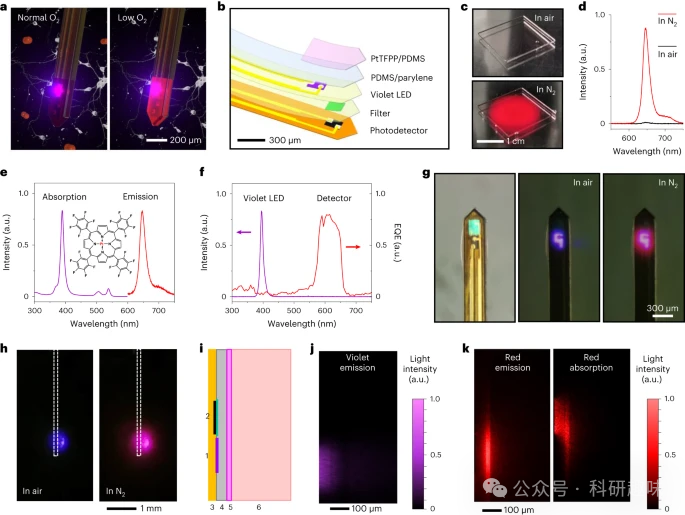
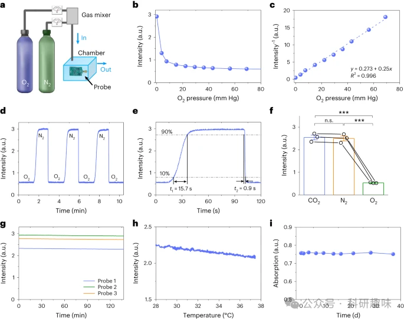
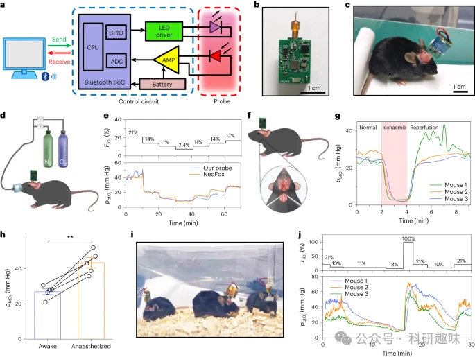
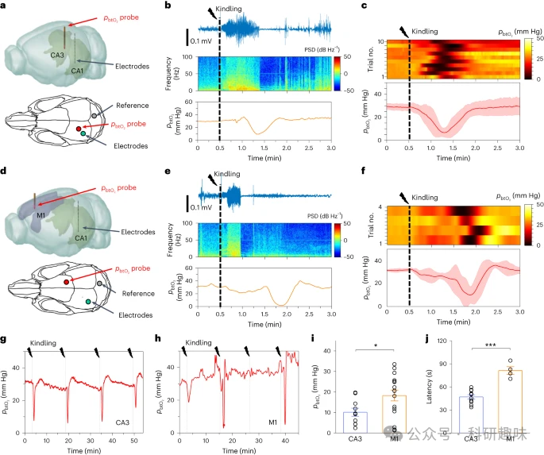
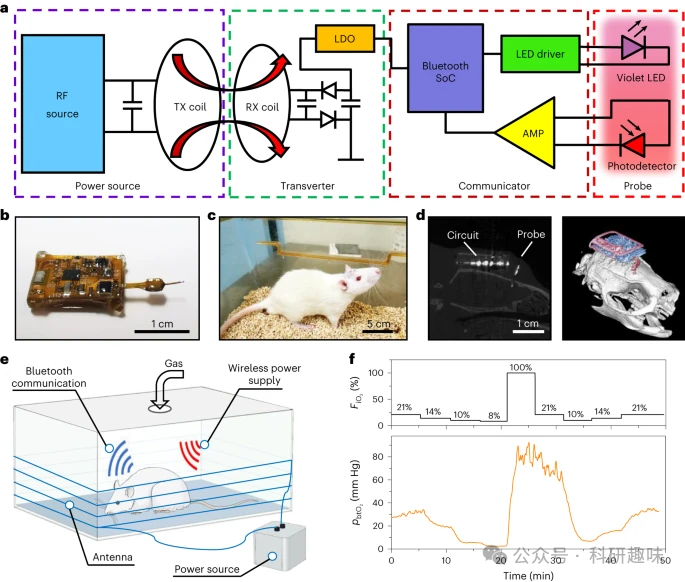

 

#  【Nat. Photon.】脑部氧气探针，实时监控深层组织中的氧压变化 
 

Grenemal

读完需要

21

全文字数 6700 字

## **摘要**

实时监测神经系统中的组织氧合，对于神经科学研究和临床诊断具有至关重要的意义。在脑组织中，氧分压（pbtO2）作为血液氧合水平的补充，对调节局部神经活动和新陈代谢起着关键作用。为此，作者研发了一种植入式光电探针，能够无线连续监测自由移动的啮齿动物大脑深部的pbtO2信号。

这种薄膜微型植入物集成了发光二极管和光电探测器，表面涂有一层氧敏感磷光薄膜。通过电池或感应线圈供电，微型电路能够记录并无线传输pbtO2信号。这种无线微型探针可以捕捉到小鼠在不同情况下的脑缺氧状态，包括吸入氧浓度的变化和急性缺血等。

在癫痫发作的小鼠模型中，这种微型探针成功地将多个大脑区域的时间pbtO2变化与施加到海马体的电刺激联系起来。这一创新型探针及其方法不仅为神经代谢耦合的神经科学研究提供了重要见解，还为植入式无线光电探针在临床上的应用开辟了新的道路。

**引言**

氧气（O2）是维持人体正常新陈代谢的关键因素。当组织氧合低于正常水平时，缺氧便会产生，这可能导致生物细胞和器官的功能障碍、损伤甚至死亡。作为O2的主要消耗者，人类大脑仅占体重的约2%，但却消耗了身体总O2供应量的约20%以维持其正常功能。急性脑部异常如中毒、脑外伤和蛛网膜下腔出血，以及脑部疾病如脑积水、脑肿瘤等引发的脑缺氧，可能会导致脑部不可逆的损伤，进而导致残疾或死亡。此外，脑缺氧还与癫痫、中风等神经脑血管疾病以及各种神经退行性疾病紧密相关。因此，实时监测脑氧合状态至关重要，不仅有助于了解O2与大脑活动之间的代谢耦合，而且对于改善临床实践具有重要意义。

目前检测大脑中O2的传统生物技术主要依赖于近红外光谱和功能磁共振成像。然而，近红外光谱和其他侵入式O2传感探针主要评估脑血氧饱和度（StO2），反映的是通过血管输送的血液中Hb和HbO2的浓度，而非直接检测O2分压（pbtO2）。而磁共振成像中的血氧水平依赖性（BOLD）成像则关注血流中Hb的浓度。这两种方法都存在一定的局限性，无法准确反映组织内的实时氧合状态。

为了更准确地测量局部pbtO2信号，目前临床可用的技术通常需要将电化学或光学探针插入目标区域。电化学方法利用克拉克型电极或其他导电线通过氧化反应检测pbtO2信号，但这些化学电极在检测过程中会消耗O2，需要一定的时间才能稳定，且容易受到干扰物质的污染。相比之下，光学技术利用磷光染料，其发光效率或寿命会随着O2的添加而衰减，通过成像或光谱设置来感测组织氧合。传统的光学工具利用光纤系统进行光传输和收集，而最近的研究表明，使用超声波驱动的光电装置可以在活体绵羊的深层周围组织中进行基于光学的O2传感。

在此背景下，作者开发了一种微型光电探针，可实时无线监测体内的pbtO2信号。该探针基于磷光染料的猝灭来测量局部pbtO2水平，通过集成的发光二极管（LED）和光电探测器来激发和收集磷光染料的光信号。微型电路可以使用电池或感应线圈供电，捕获并无线传输pbtO2数据。在体外和体内研究中，该系统展现出了动态pbtO2记录能力，并且在啮齿动物癫痫发作模型中通过电生理活动捕获了脑缺氧情况。这一创新型探针为神经科学研究提供了重要见解，并为植入式无线光电探针在临床上的应用开辟了新的道路。

**结果**

**用于pbtO2监测的微型光电探头**

作者设计并制造了一种微型光电探针，用于监测大脑深部的 pbtO2 变化。图1a和图1b详细展示了探针的设计与构造。该微探针从上至下由多个组件构成，包括嵌入铂（II）-5的聚二甲基硅氧烷（PDMS）薄膜、10,15,20-四-(2,3,4,5,6-五氟苯基)-卟啉（PtTFPP）磷光染料、PDMS/聚对二甲苯封装层、氮化铟镓（InGaN）紫色LED、介质滤光片以及镀铜聚酰亚胺（PI）基板上的磷化铟镓（InGaP）光电探测器。

pbtO2的传感机制依赖于PtTFPP的光致发光（PL）猝灭原理，并通过这一机制感知pO2的水平。为了实现最佳的吸收和发射性能，作者将PtTFPP以0.1 wt%的浓度混合至PDMS涂层中。图1e展示了PtTFPP/PDMS薄膜的紫外-可见光谱，其中紫光的吸收峰位于389 nm，并在646 nm出具有PL发射峰。

InGaN紫色LED的电致发光峰值波长为395 nm，可作为PtTFPP的理想激发源。其PL发射则由InGaP探测器捕获。与先前报道的基于硅或砷化镓（GaAs）的植入式探测器相比，InGaP光电二极管具有更大的带隙，因此暗电流密度更低。此外，InGaP的稳定性优于硅，且毒性低于GaAs。在InGaP探测器上，多层二氧化硅/二氧化钛长通滤光片优化了其在红色光谱范围内的灵敏度，从而在570至655 nm之间产生波段选择性吸收。

图1f展示了LED和探测器的光学特性，与PtTFPP的特性相匹配。图1g显示了集成的pbtO2传感探针图像，其中PtTFPP/PDMS涂层的厚度约为30 μm。当环境从空气切换至纯氮气（N2）时，微探针展现出更强的红色磷光发射。当探针插入大脑模型时，同样观察到相似的反应，如图1h所示。

此外，作者建立了光学模型来模拟微探针和周围组织内的光分布（图1i）。图 1j 表明 LED 发出的紫光主要被 PtTFPP/PDMS 涂层吸收，PtTFPP 几乎没有泄漏到周围组织中。相比之下，PtTFPP 发射的下转换红色磷光可以更深入地渗透到组织中，并被相邻探测器部分捕获（图 1k）。

图1：用于监测脑组织氧合的微型光电探针（pbtO2）。 a，植入脑组织并对 O2 浓度变化做出光学响应的探针示意图（左：正常条件；右：低 O2 浓度）。b，探针设计的放大视图，包括（从上到下）PI 基板上的 PtTFPP/PDMS 传感膜、PDMS/聚对二甲苯封装层、InGaN 紫色 LED、滤光片和 InGaP 光电探测器。c，PtTFPP/PDMS 薄膜在空气中（上）和纯 N 2 环境中（下）受紫光激发的照片。d，PtTFPP/PDMS薄膜在空气和N 2 中的PL光谱。e，PDMS 中 PtTFPP 的吸收和 PL 光谱。插图：PtTFPP 的分子结构。f，紫色 LED 的电致发光光谱和带有滤光片的检测器的外量子效率 (EQE) 光谱。g，探针的俯视光学图像（左：LED 关闭；中：LED 在空气中亮起；右：LED 在 N 2 中亮起）。h，比较植入大脑模型的探针（侧视图）在空气中（左）和纯 N 2 （右）中发出的光的实验照片。i，光学建模中使用的探针结构示意图（侧视图）：（1）LED；(2)带滤光片的检测器；(3) PI；(4)PDMS/聚对二甲苯；(5) PtTFPP/PDMS；(6)脑组织。j，来自 LED 的紫色激发光的模拟强度分布。k，PtTFPP 染料的模拟红色 PL 发射（左）和 N 2 中检测器捕获的红色 PL 发射（右）。

**pbtO2 传感探针的体外性能**

作者通过在含有不同N2分压（PO2）的气室中进行性能测试，以及通入O2气流进行实验（图2a）。在0.5mA的LED注入电流下，作者观察了0至70mmHg范围内PO2水平下，PtTFPP/PDMS涂层的PL强度（图2b和补充图2）。在高O2压力下，非零信号的出现主要是由于泄漏的紫光所引发。PL强度与PO2之间的线性关系符合Stern-Volmer方程（图2c）。这种非线性关系表明，微探针在较低的PO2水平时对O2波动更为敏感。在室温条件下，作者测得的PO2检测分辨率低于0.8mmHg，在PO2为3.8mmHg和低于13mmHg时，汞柱高度达到56毫米。

作者还对微探针进行了多个循环的动态响应测试，其中包括交替的O2和N2流（图2d）。当气体流量为10升/分钟，在O2和N2之间切换时，记录的信号上升和衰减时间分别为15.7s和0.9s（图2e）。与之前报道的光学传感器和克拉克电极技术相比，作者的微探针系统的瞬态响应速度更快。此外，PtTFPP中的PL猝灭机制确保了微探针相对于其他气体（包括N2和CO2）具有高度的O2选择性（图2f）。经过预处理后，微探针可以连续监测PO2超过2小时，且没有明显的光漂白现象（图2g）。

除了光稳定性外，微探针还表现出良好的热稳定性（图2h）。在体外和体内操作期间，LED由0.5mA的脉冲电流驱动，导致温升小于1℃（补充图4）。因此，设备的加热对测量精度和正常组织功能的影响很小。最后，当浸入磷酸盐缓冲盐水（PBS）溶液一个多月时，PtTFPP/PDMS涂层的吸收率保持不变（图2i）。

图 2： **pbtO2 传感探针的体外表征**。a，测量探针对不同浓度 O2 的响应的实验装置示意图。气室尺寸为10×10×6 cm 3 ，N 2 和O2 气体流量不同。b，记录不同 O2 分压下的 PL 强度。c，校准曲线显示PL强度的倒数与O2 分压之间的线性关系。R，决定系数。d，探头在交替 O2 分压（0 至 760 mm Hg）下的动态响应。e，d的部分放大曲线，表示上升时间t 1 = 15.7 s，衰减时间t 2 = 0.9 s。f, 记录的探头响应不同气体（CO2 、N 2 和 O2 的信号，压力为 ∼1 atm 或 ∼760 mm Hg ）。进行单向 ANOVA（方差分析）和 LSD（最小显着性差异）事后比较。g，室温下在纯氮气中测量的三种不同探针（LED注入电流= 0.5 mA）的信号稳定性 。h，不同温度（28 至 37.5 °C）下的探针响应。i，PtTFPP/PDMS 薄膜的长期稳定性。将薄膜在 PBS 中浸泡 1 个多月，并在不同日期测量峰值吸收（390 nm）。

**使用无线探头进行实时体内 pbtO2 监测**

为了对活体动物进行连续pbtO2监测，作者设计了一种植入式光电探头，并为其配备了一个定制的无线控制电路。如图3a所示，该电路的核心元件包括LED驱动器、运算放大器、蓝牙集成系统以及可充电电池。通过校准，作者可以将收集的数据准确转换为对应的pbtO2值。这个电路模块具有小巧的尺寸，仅为12.3 × 17.3 mm2，重量为1.8 g（如图3b所示）。此外，探头的头部经过精心设计，使其能够安装在自由移动的动物身上，持续监测pbtO2（如图3c所示）。

为了全面评估这一传感系统的性能，作者通过调整小鼠吸入的O2混合物的比例（即吸入氧分数，FiO2），对其进行了急性测试。这些实验数据显示了探头的准确性和响应速度（如图3d所示）。同时，作者还将无线微型探头与碳基电化学电极的性能进行了比较，结果发现两者在时间响应上表现出相似的特性（扩展数据图5）。作者还利用这一微型探针，记录了小鼠在急性缺血/再灌注周期中的实时pbtO2数据。实验中，通过夹紧和松开双侧颈动脉来诱导缺血和再灌注。结果显示，在约1分钟的缺血后，记录的pbtO2水平下降至低于3 mmHg，并在再灌注后逐渐恢复（如图3f所示）。此外，作者还对比了清醒和麻醉状态下小鼠的pbtO2水平。结果显示，异氟烷麻醉显著提高了小鼠的pbtO2水平，这与之前的研究结果一致（如图3h所示）。

最重要的是，该无线电路模块支持从多个自由行为动物的多个微探针采集和传输数据，这是传统的系留光纤系统所无法实现的（如图3i所示）。当提供不同的FiO2值时，三只动物的pbtO2值均显示出相似的波动模式（如图3j所示）。这些研究结果充分证明了作者的无线微探针在实时监测动物复杂行为和生理反应相关的pbtO2活动方面的独特优势。

图3：探针与无线控制电路相结合，连续监测自由行为小鼠大脑中的 pbtO2 。a，无线系统框图，由计算机、电池供电的控制电路和植入式探头组成。b，与无线电路连接的探头的图像。CPU，中央处理单元；GPIO，通用输入/输出端口；ADC，模数转换器；AMP，运算放大器；SoC，片上系统。c，照片显示带有植入探针和头戴式电路的自由活动的小鼠。d，设置示意图，显示无线探头监测小鼠的 pbtO2 ，该小鼠提供不同比例的激发 O2 ( ）。e，作者的无线探头和商业产品同时检测到的 FiO2 （上）和 pbtO2 结果（下）的动态变化光纤记录系统（NeoFox、海洋光学）。f，示意图显示了在由双侧颈动脉的夹紧和松开引起的急性缺血/再灌注期间监测小鼠 pbtO2 的探针。g，急性缺血/再灌注期间记录的 pbtO2 结果（n = 3只小鼠）。h，小鼠在清醒和麻醉状态下测量的 pbtO2 结果的比较。进行配对 t 检验（n = 5 只小鼠，\*\*P &lt; 0.01，双尾 P 值为 0.002）。值表示为平均值±s.e.m。i，三只自由移动的小鼠的照片，其 pbtO2 值由无线探头同时监测。j，在三只小鼠中同时检测到的 FiO2 （上）和 pbtO2 结果（下）的动态变化。

**电刺激下海马体pbtO2 的动态变化**

在哺乳动物的大脑中，局部的pbtO2水平与神经活动紧密相关。海马体的电刺激可以引发后放电（AD），甚至可能触发运动性癫痫。当神经活动变得更为剧烈时，局部的新陈代谢会加速，导致O2消耗增加，并使pbtO2水平下降。作者利用开发的微型探针，研究了pbtO2如何响应大脑深部的电刺激产生的局部变化。

如图4a所示，刺激和记录电极被精确植入研究用小鼠的海马体（CA1）。同时，光电微探针被植入同侧海马的另一区域（CA3），以持续监测pbtO2的变化。图4b展示了小鼠癫痫发作的一个实例，作者可以观察到其运动行为、CA1的电活动以及CA3中pbtO2水平的同步动态变化。在此示例中，CA1中一个短暂的1秒脉冲引发了明显的AD，伴随着LFP振荡的增强，并有时伴随着严重的抽搐。LFP爆发持续约40秒，随后微探针记录到pbtO2急剧下降，表明强烈的神经活动导致了局部O2消耗的增加。

值得注意的是，并非所有刺激都能触发AD和相关的pbtO2下降，特别是当两个刺激之间的时间间隔过短时。统计数据显示，在每次AD后，CA3区域大约在30秒内会经历严重的缺氧状态（pbtO2&lt;10mmHg），并在约60秒内恢复（图4c）。这种时间关系表明，局部过度的神经活动导致神经元消耗更多的O2。由此产生的缺氧状态会抑制神经活动并终止小鼠的癫痫行为。

为了更深入地理解O2在组织中的扩散与消耗过程，作者建立了一个基于有限元分析的扩散模型。在癫痫等异常情况下，由于O2从HbO2解离和O2运输都很快，可能会导致严重的后果。当神经活动加剧，O2消耗过多时，无法通过O2供应进行完全补偿，最终可能导致严重缺氧。

图4：**电刺激下小鼠不同脑区 pbtO2 信号的记录。** a，三维（3D；上）和二维（2D；下）示意图，显示 pbtO2 传感探头 (CA3) 和刺激/记录电极的位置(CA1)植入小鼠同侧海马。b，在点燃下同时记录 CA1 中的电生理活动和 CA3 中的 pbtO2 电生理活动：LFP 迹线（上）；LFP 的功率谱密度 (PSD)（中）；pbtO2 配置文件（底部）。c，CA3 中记录的 pbtO2 的动态响应：来自 n = 10 只小鼠的 10 次单独试验的热图（上）；平均 pbtO2 信号（底部）。实线和阴影区域分别表示平均值和标准差。d、3D（上）和2D（下）示意图，显示 pbtO2 探针的位置以及植入对侧初级运动皮层（M1）和海马（CA1）的电极）的老鼠。e，在点燃下同时记录 CA1 和 M1 中 pbtO2 的电生理活动：LFP 迹线（上）；LFP 的 PSD（中）；pbtO2 个人资料（底部）。f，M1 中记录的 pbtO2 的动态响应：来自 n = 3 只小鼠的四次单独试验的热图（上）；平均 pbtO2 信号（底部）。实线和阴影区域分别表示平均值和标准差。g,h，在连续点燃期间连续监测 CA3 (g) 和 M1 (h) 中的 pbtO2 。i, 点燃后同侧 CA3（10 次试验，n = 5 只小鼠）和对侧 M1（16 次试验，n = 4 只小鼠）区域记录的最低 pbtO2 值的比较在CA1。(\*P &lt; 0.05，双尾 P 值为 0.036。) j, CA1 中点燃到 CA3 中达到最低 pbtO2 的潜伏时间比较（十次试验，n = 5 只小鼠）和 M1（四次试验，n = 3老鼠）。（\*\*\*P &lt; 0.001，双尾 P 值为 0.000038。）对于 i 和 j，统计分析基于独立样本的 t 检验。值表示为平均值±s.e.m。

此外，作者还利用微型探针记录了CA1区海马体诱发过程中，远处的区域（即对侧初级运动皮层（M1））的pbtO2水平变化。如图4e、f所示，诱发引起的AD也会导致M1区域缺氧。有趣的是，尽管几乎所有在CA1中刺激都能在同侧的CA3区域诱发相应的缺氧事件（图4g），但在大约25%的试验中（来自四只小鼠的16项试验），作者也观察到了M1中的类似pbtO2下降（图4h）。与CA3中的结果相比，M1中观察到的类似缺氧事件不太明显（图4i），并且具有更高的潜伏期（图4j）。这可能是由于在复杂的脑网络中，神经活动的传播和迁移所导致的。

为了更深入地了解小鼠海马区的血氧饱和度，作者根据HbO2和Hb之间光吸收的差异，进一步检查了同一区域（海马）的血氧饱和度（StO2）。通过将光纤植入CA3区域，并测量660和810nm透射光的动态变化，作者确定了脑血管系统中的StO2水平。当改变FiO2时，记录的StO2的动态变化与pbtO2水平密切相关。然而，在刺激条件下，这两个信号的响应存在明显的差异。尽管作者的pbtO2探针捕获了明显的缺氧情况，但光纤在刺激后立即记录到升高的StO2。这种差异清楚地表明，StO2和pbtO2是衡量脑部氧合状态的两种不同代谢指标。

**pbtO2 传感探针的体内生物相容性**

为了评估pbtO2传感探针在小鼠海马CA3区的生物相容性，作者进行了组织学分析。通过尼氏染色，作者观察到冠状切片上微探针产生的病变区域。在植入的不同阶段，作者进行了胶质纤维酸性蛋白（GFAP）的免疫荧光染色，揭示了病变区域周围星形胶质细胞的生长和纤维化形成。同时，利用血管内皮细胞（血小板内皮细胞粘附分子-1，CD31）和抗体的免疫染色，作者能够在探针植入后的不同阶段评估组织出血状况。

此外，作者还对微探针在体内的长期运行特性进行了评估。在九天后，装置发生降解和故障，这主要是由于水渗透到组织中。为了增强器件的防水性，作者计划使用多层无机/有机封装剂。进一步的优化可能涉及减小探针尺寸，并使用更具生物相容性的涂层（例如水凝胶45）进行表面修饰，以最大程度地减少组织损伤、减轻纤维化并减少出血。

**用于 pbtO2 监测的完全植入、无电池探头**

要实现更进一步的优化，作者考虑开发一种无线、无电池的电路模块，这种模块可以完全植入皮下。如图5a和补充图5所示，这种无电池系统相较于依赖电池供电的探头，具有更高的灵活性、更轻的重量，并且能够实现更持久的不间断数据采集。

在防水封装剂的保护下，整个电路可以被完全植入自由活动的大鼠的头皮下，如图5b、c。X射线计算机断层扫描（CT）图像可以清晰地显示出pbtO2探针在大鼠大脑中的位置以及电路模块的位置，如图5d所示。

作为功率转换器，环形天线能够接收来自外部射频（RF）源的电流，并在外壳中产生磁场，以实现动物行为的研究，如图5e所示。在正常操作下，该电路的温升低于3.5°C，确保了在动物体内的安全性。

图5f中的概念验证研究展示了无线连续监测大鼠pbtO2的能力，以响应FiO2大约50分钟。这一技术突破为实现长时间、连续的脑部氧合状态监测提供了可能，为深入了解脑部生理和病理过程开辟了新的途径。

图 5：完全植入的无电池探针系统监测活体大鼠大脑中的 pbtO2 。a，系统框图，包括射频电源、接收线圈、蓝牙通信模块和植入式探头。TX，初级线圈（发射功率）；RX，次级线圈（接收功率）；LDO，低压差稳压器。b，与无电池电路连接的探头的图像。c，照片显示带有完全植入的探针系统的自由移动的大鼠。d，矢状 CT 图像显示植入系统在大鼠体内的位置（左），重建的 3D CT 图像显示设备相对于头骨的位置（右）。e，监测大鼠 pbtO2 的设置示意图。f，在大鼠中监测的 FiO2 （上）和 pbtO2 （下）动态变化的结果。

**讨论**

在这项研究中，作者监测了癫痫模型中电刺激引起的pbtO2的变化。在未来的研究中，作者计划在自发性癫痫发作之前、期间和之后进行pbtO2的监测，以更深入地了解其变化规律。尽管PtTFPP能够捕获缺氧事件（pbtO2&lt;20 mm Hg），但在高氧条件下（pbtO2&gt;20 mm Hg），其性能受到限制。为了更好地检测正常和高氧条件，作者正在探索使用替代发光体以提高传感性能。

目前，作者的微型探针能够在持续数十秒的AD期间监测小鼠海马相对较大的大脑区域（约200 μm）中的pbtO2。然而，为了在更小的区域甚至在细胞尺度上检测快速的O2动态，作者需要开发一种足迹更小、响应速度更快的探针。

除了记录PL强度外，作者还在探索使用先进的电路系统根据PL寿命变化来检测pbtO2。这种方法不易受染料光漂白的影响，并可能提供更准确的测量。此外，结合电生理活动与pbtO2的测量将有助于作者更深入地了解神经血管和神经代谢耦合的机制。

电池供电和无电池电路方案都已被引入用于监测啮齿动物大脑中的pbtO2，并且它们也有潜力应用于临床应用。通过结合这两种策略，作者可以同时实现稳定供电和无线充电，进一步拓展了其在神经科学研究和医学诊断中的潜在用途。

Cai, X., Zhang, H., Wei, P. et al. A wireless optoelectronic probe to monitor oxygenation in deep brain tissue. Nat. Photon. (2024). https://doi.org/10.1038/s41566-023-01374-y

**关注并回复文章DOI获取全文：**

10.1038/s41566-023-01374-y

**点击蓝字 关注我们**

预览时标签不可点

素材来源官方媒体/网络新闻

 [阅读原文](javascript:;) 

  继续滑动看下一个 

 轻触阅读原文 

   

