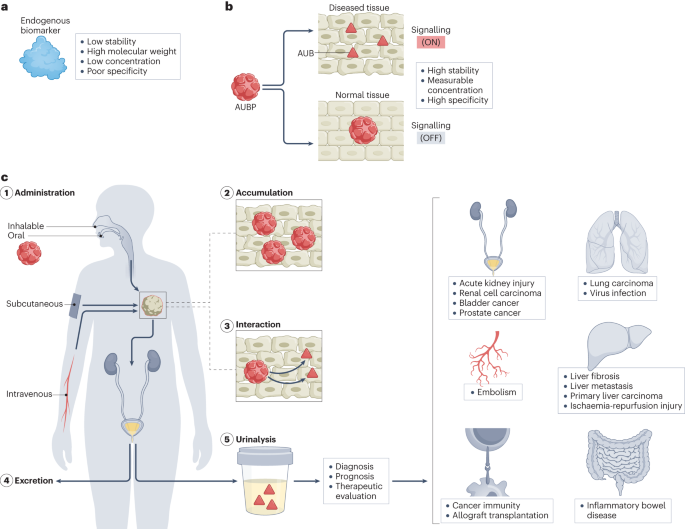
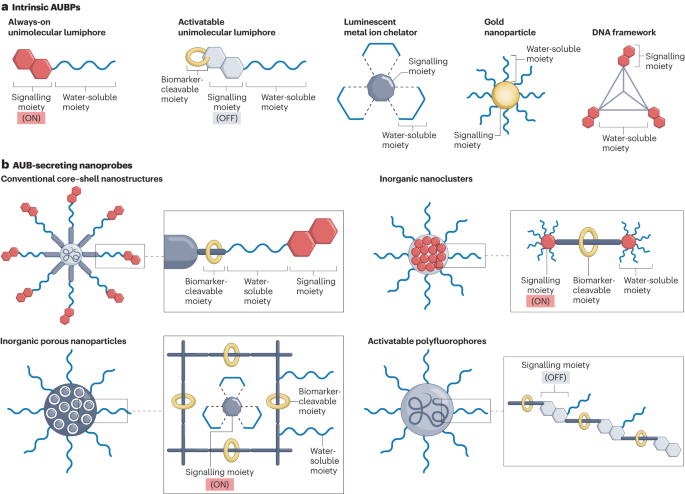
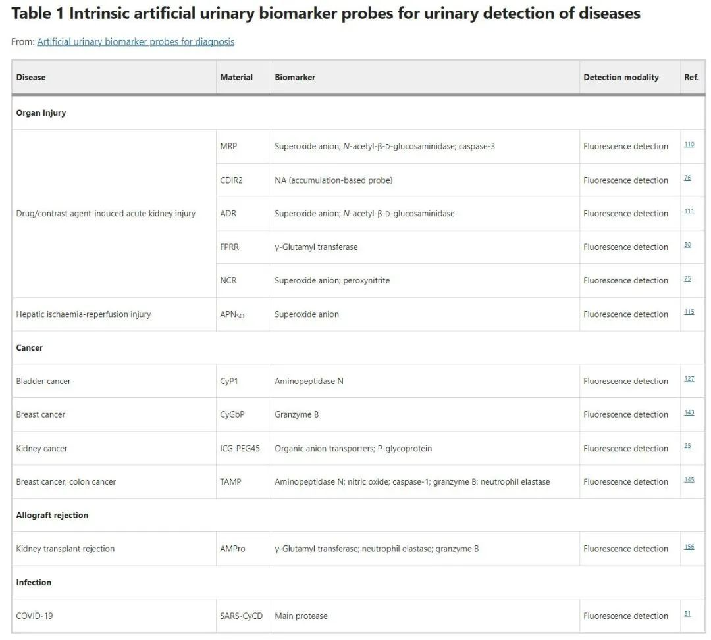
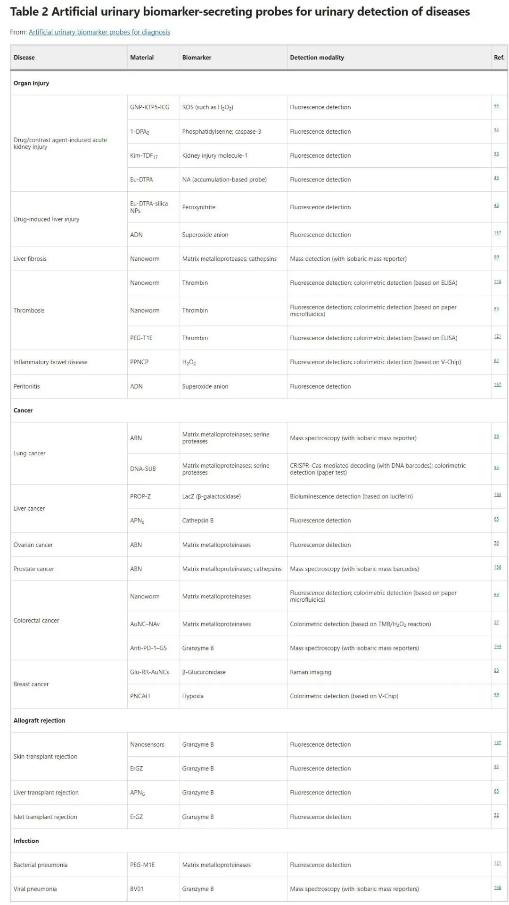
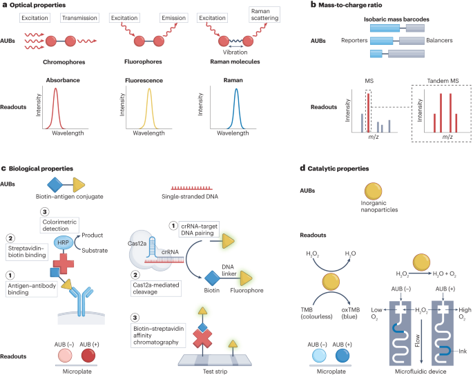
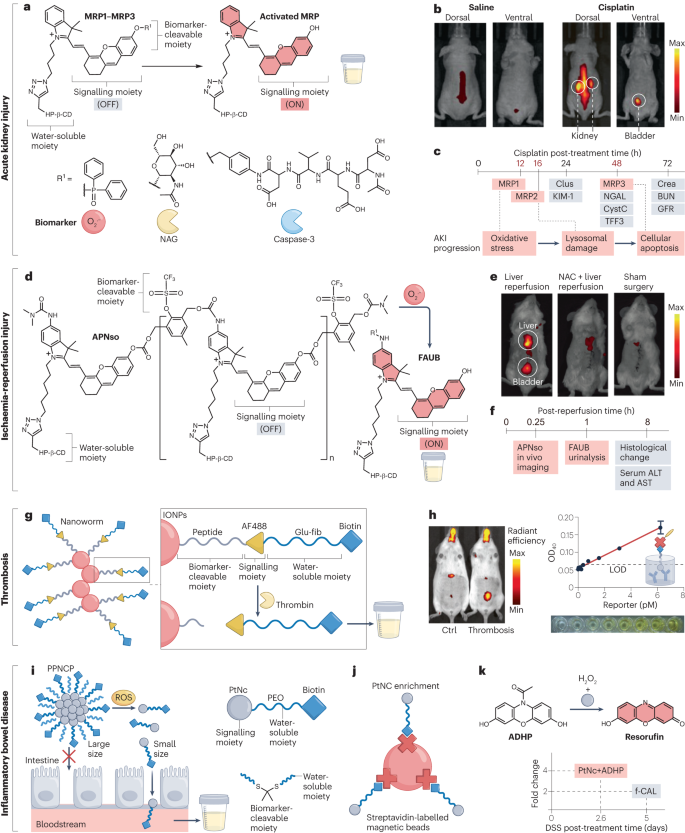
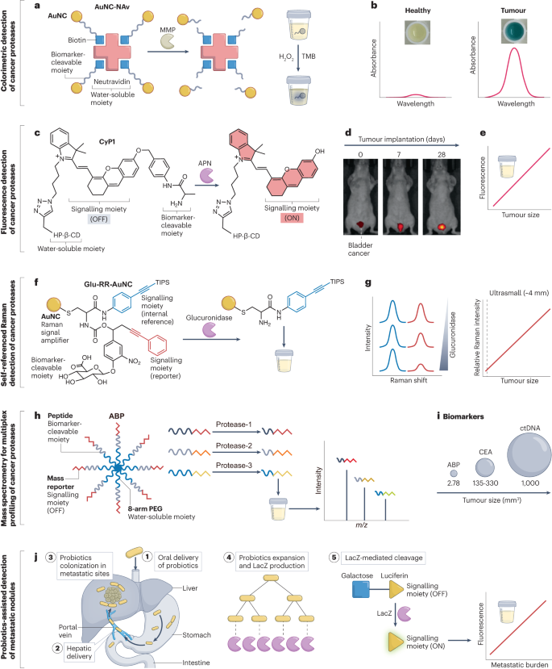
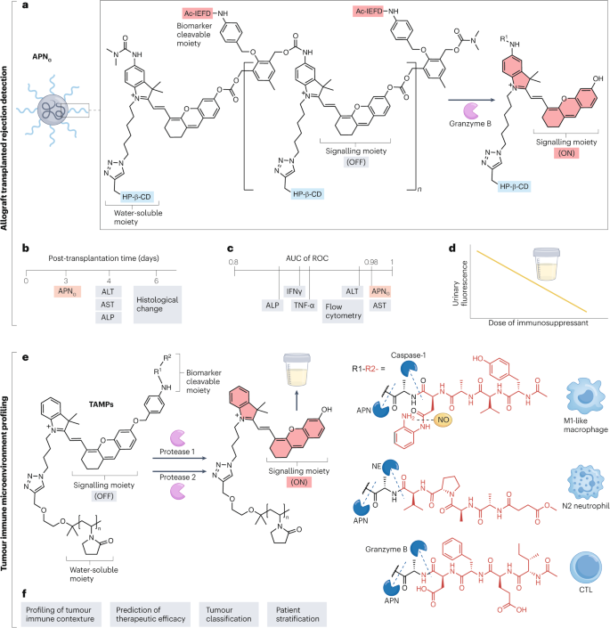

 

#  【Nat. Rev. Bioeng.】用于尿液检测探针：设计、原理及应用 
 

Grenemal

读完需要

38

全文字数 14600 字

**介绍**

尿液分析，这一历史悠久的诊断手段，至今仍广泛应用于健康监测和疾病诊断之中。其起源可追溯至尿道镜检查，这一术语源于几千年前医生们仅凭尿液的颜色、气味、味道及沉淀物等外观特征来诊断疾病的实践。随着1600年代的显微镜技术的引入，尿液分析领域得到了极大的拓展，医生们开始能够观察到尿液中的晶体、管型和细胞等微观结构。
在现代临床实践中，尿液分析已成为一种常见、简单且微创的筛查检查手段。它能够为临床医生提供关于患者整体健康状况的重要信息，如水合水平、酸碱平衡状态、尿路感染、糖尿病以及肝脏或肾脏疾病等。此外，随着即时检测装置和设备（如“智能马桶”）的发展，尿液分析变得更加便捷，使得患者能够更轻松地进行自我诊断。例如，妊娠试验就是一种常见的自诊断方法，用于检测人绒毛膜促性腺激素（hCG）水平；而商业化的半定量试纸则可以同时检测尿液中的数十种代谢物。然而，尽管尿液分析在代谢和泌尿系统疾病诊断方面取得了显著成就，但由于尿液中内源性生物标志物的浓度较低且特异性较差，其在器官损伤、癌症、感染和免疫排斥等疾病的诊断中仍存在一定局限性（如图1a所示）。大多数内源性疾病生物标志物难以穿越生理屏障在尿液中富集。例如，活性氧（ROS）会被血清中的抗氧化剂迅速清除，在血液中的存在时间极短；同样地，与疾病相关的循环游离DNA在血液中会经历酶促降解过程，产生对尿液分析无用的片段。尽管蛋白质等大分子在血流中相对稳定，但它们很难穿过肾小球滤过膜（其典型尺寸阈值约为6-8纳米或40千道尔顿）。因此，一些重要的生物标志物，如卵巢癌的血清生物标志物碳水化合物抗原12-5（CA12-5），由于其分子量超过3-5百万道尔顿且预计线性长度达到1-5微米，很难从尿液中排出并用于诊断分析。
图 1：基于 AUBP 的尿液分析用于疾病诊断。
               
a，尿液分析的内源性生物标志物。大多数与疾病相关的内源性生物标志物在血流中稳定性较低且分子量较高，这限制了肾小球滤过，导致尿液浓度较低。一些生物标志物也是由正常组织产生的，导致诊断特异性较差。b，用于尿液分析的人工尿液生物标志物（AUB）是由人工尿液生物标志物探针（AUBP）响应患病组织中存在的疾病相关生物标志物而产生的。AUB 稳定且足够小，可以在尿液中过滤，以进行特异性和准确的疾病诊断。c，通过各种途径给药后，AUBP 可以在疾病区域积聚，在那里它们对特定的内源生物标志物做出反应，释放 AUB。
内源性生物标志物的特异性不足，成为了尿液分析精确性的主要挑战之一，因为这些生物标志物在正常组织或良性合并症中也存在。举例来说，膀胱肿瘤抗原（BTA）在健康个体中的检测特异性高达99%，但在感染、肾病、癌症或泌尿生殖创伤患者中的特异性仅为46%。此外，内源性生物标志物的水平还会受到饮食、运动和激素分泌等多种因素的影响，从而产生波动。为了应对这些问题，研究人员尝试使用外源性药物来辅助尿液分析。例如，菊粉作为一种生物惰性多糖，自1935年以来一直是评估肾小球滤过率和肾功能障碍的“金标准”。它通过静脉输注后经过肾脏过滤。然而，这类诊断剂的供应有限，检测过程繁琐，且其应用通常仅限于特定疾病。

为了推进尿液分析技术的发展，一种名为人工尿液生物标志物探针（AUBP）的新型诊断剂应运而生。AUBP是一种小分子或纳米尺寸的成像探针，其设计初衷是通过与体内疾病相关的内源性生物标志物相互作用，从而释放人工尿生物标志物（AUB）（如图1b所示）。这些探针可以通过多种途径给药，包括静脉、口服（胃内）、肺部（气管内或吸入）和皮下（或经皮）（如图1c所示）。随后，它们穿越生物屏障并分布到病变部位，在那里对内源性生物标志物产生响应。这种响应可以是物理性的，如主动结合或被动积累，也可以是化学性的，导致信号片段的产生。这些信号片段随后经过肾脏过滤并在尿液中富集，作为AUB提供易于测量的读数。迄今为止，AUBP已在各种动物模型的诊断、预后和治疗应用中得到了验证，显示出广阔的临床应用前景。

尽管基于内源性生物标志物的尿液分析和肾脏可清除的分子显像剂已受到广泛关注，但关于能够释放人工生物标志物并排泄用于体内尿液分析的探针的研究仍是一个新兴且有前途的领域，尚未进行系统的评价。在这篇综述中，作者将首先介绍AUBP，包括固有AUBP和AUB分泌纳米探针，并重点介绍材料设计方面的进展。随后，作者将讨论检测AUB的不同方法以及AUB的临床前应用。最后，作者将总结基于AUBP的尿液分析在临床转化过程中所面临的挑战。

**材料设计**

AUBP主要分为两类：内在AUBP和分泌AUB的纳米探针（如图2所示）。内在AUBP通常表现为单分子探针或超小型纳米探针，它们能够通过肾脏过滤或直接分泌至尿液中，从而在功能上与AUB相当（参见表1）。由于大多数内在AUBP的尺寸小于肾小球的滤过阈值，它们能够轻松地穿越肾小球屏障。而部分探针则与近端肾小管细胞上的转运蛋白，例如有机阴离子转运蛋白和P-糖蛋白，发生相互作用，从而由肾小管周围毛细血管进入肾小管腔。相对而言，AUB分泌纳米探针属于大尺寸纳米结构，尺寸通常在6-8纳米以上，因此无法通过过滤或分泌的方式进入尿液。这类探针的主要功能是对疾病相关的内源性生物标志物产生响应，进而分泌出小片段的信号分子作为AUB（参见表2）。

图 2：AUBP 的设计。
a，内在人工尿生物标志物探针（AUBP）包括常亮单分子发光体、可激活单分子发光体、发光金属离子螯合剂、超小无机纳米颗粒（例如金纳米颗粒）和超小DNA框架。b，人工尿生物标志物（AUB）分泌纳米探针包括传统的核壳纳米结构、无机纳米团簇、无机多孔纳米颗粒和可激活的多荧光团。表1 用于尿液疾病检测的内在人工尿液生物标志物探针表2 用于尿液疾病检测的人工尿液生物标志物分泌探针                

**内在AUBP**

有机单分子探针是内在AUBP的一个亚型，可细分为常开探针和可激活探针。常开探针由信号分子和水溶性部分构成，其中信号分子具有固有光学特性，如荧光、化学发光和光声信号。水溶性部分，如聚乙二醇（PEG）、葡聚糖和环糊精，不仅确保了探针在活生物体中的生物相容性，还促进了尿液排泄。这些探针通常在患病组织中的积累和保留时间长于正常组织，导致不同的肾脏清除率，从而可以通过尿液检测疾病。例如，由于正常肾小管细胞中外排泵P-糖蛋白的表达水平高于癌性肾小管细胞，因此在原位乳头状肾小鼠模型中，正常近端肾小管比癌性肾小管更有效地分泌吲哚菁绿-PEG45缀合物，导致肾癌中吲哚菁绿-PEG45的保留时间更长，荧光信号更亮。相对而言，可激活探针由三个关键部分构成：可裂解部分，该部分对疾病生物标志物具有反应性；信号分子；以及水溶性部分。这些探针在完整状态下保持光学静音，即使在过滤到尿液中后也能确保最小的背景噪音。然而，当与特定疾病生物标志物相互作用时，它们的光学信号被激活，产生阳性尿液读数。例如，半花青染料是一种广泛使用的近红外发射荧光团，可以通过使用生物标志物可裂解部分来阻断分子内电荷转移，从而实现其沉默。对氨基苯甲醇是一种自消连接体，插入染料和可裂解部分之间，在去除可裂解部分后自发降解。该过程恢复染料内的电荷转移，从而开启荧光。这种“光开关”与多种疾病生物标志物兼容，例如ROS、糖苷酶和蛋白酶。具体而言，酶生物标志物在其底物上表现出高催化转化率，AUBP可以利用这一特性并从单个酶中释放多个AUB，从而导致信号放大，从而显着提高检测灵敏度。除了纯有机AUBP之外，还开发了金属离子螯合有机配体，例如镧系元素螯合剂。例如，铕-二亚乙基三胺五乙酸复合物表现出与单分子AUBP相当的肾脏清除功效，并且其使用能够实现无背景时间分辨光致发光以增强尿液分析灵敏度。超小纳米颗粒是一类独特的内在AUBP，其典型直径低于6nm。它们具有与小分子类似的网状内皮系统清除率低、组织分布快和肾脏过滤快的特点，同时还表现出在目标组织中的选择性积累和延长保留，因此类似于传统的大尺寸纳米颗粒（直径通常为20-200nm）。例如，对皮下乳腺肿瘤小鼠进行静脉注射后，发光谷胱肽包被的金纳米颗粒（直径2nm）在注射后12小时内肿瘤与肝脏的比率（定义为靶向效率）为1.5，比白蛋白包被的金纳米颗粒（直径60nm）高出一倍。此外，即使在注射后24小时，76%的注射剂量的谷胱肽包被的金纳米颗粒仍保留在肿瘤中，而小分子IRDye 800CW（LI-COR Biosciences的市售近红外荧光团）的比例低于5%。这些可通过肾脏清除的金纳米颗粒与硒化镉硫化锌量子点一起表现出尺寸依赖性发射，从而实现基于荧光的尿液分析。此外，不发光的无机点，例如铂和银纳米团簇，可以通过它们的过氧化氢酶或过氧化物酶样催化活性来检测。有机纳米结构，例如荧光团标记的四面体DNA框架，具有精确的几何形状并且易于功能化，也可以设计为AUBP。然而，开发可激活的超小纳米颗粒可能具有挑战性，因为很难找到可以抑制无机材料固有光学或催化特性的可裂解部分。此外，还需要解决掺入可裂解部分后有机材料的不稳定性和异质尺寸问题。
内在的AUBP可以通过选择性识别并结合疾病相关生物标志物的主动靶向部分进行功能化，从而改善患病区域的积累和激活。例如，1-DPA2（一种可激活caspase-3的近红外荧光探针）的锌-二吡啶胺基团与凋亡过程中肾小管细胞外膜上暴露的磷脂酰丝氨酸结合，从而使探针有足够的时间被caspase-3激活并释放荧光AUB以诊断肾损伤。AUBP的其他靶向基团包括针对肾脏的肾靶向肽、针对受损肾脏的肾损伤分子1（KIM-1）以及针对大多数肾脏的环状精氨酰-甘氨酰-天冬氨酸肽肿瘤。

**AUB 分泌纳米探针**

这些纳米探针通常呈现核壳结构，其中核心由无机纳米颗粒（如氧化铁纳米颗粒）、聚合物（例如八臂PEG）及生物分子（如亲和素）等构成。壳层则包含一系列信号分子、生物标志物响应的可裂解连接基团以及水溶性组分，如可激活的内在AUBP。这些组分通过化学相互作用（如硫醇-金键）或物理相互作用（例如中性亲和素-生物素结合）稳固地结合在一起。相较于内在AUBP，分泌AUB的纳米探针拥有显著优势。它们较大的尺寸（通常大于6nm）阻碍了肾脏清除，从而确保尿液中的背景噪音维持在极低水平。因此，分泌AUB的纳米探针内的信号部分可以保持“始终开启”状态，这简化了涉及信号分子笼蔽和去笼蔽的复杂化学过程。肾脏过滤的限制进一步延长了它们在血液中的循环时间，提高了到达目标病变部位的机会。此外，核心材料作为成百上千个信号链的基石，使得AUB在局部高度集中，有利于信号的放大。具体来说，通过将不同的信号分子负载到核心材料上，可以实现信号的多重化，从而提高诊断的特异性。除了表面修饰外，信号部分还可以整合到经历生物标志物触发分解的核心材料中。例如，具有ROS可裂解连接基的二氧化硅纳米颗粒可以作为荧光镧系元素螯合剂（如AUB）的载体。这些螯合剂在响应体内炎症病变中的过氧亚硝酸盐分解时从纳米探针中释放出来。此外，信号部分（如超小无机点）可以通过生物标志物可裂解接头（例如与ROS可裂解硫缩酮接头交联的铂纳米点）相互交联来构建核心材料。此外，AUB分泌探针可以设计为在存在疾病相关生物标志物的情况下同时发生尺寸转变和信号激活。例如，半花青染料通过组织蛋白酶B可裂解的肽相互缀合，形成一种多荧光团缀合物。该缀合物具有荧光信号弱、尺寸较大的特点，使其无法被肾脏清除。在含有高水平调节的组织蛋白酶B的小鼠原位肝肿瘤中，多荧光团缀合物发生解聚作用，导致尺寸减小并激活荧光信号。这种设计策略为开发高效、灵敏的疾病诊断方法提供了新的思路。
**检测方法**

AUB的检测可借助多种技术，充分利用其光学、质量、生物和催化特性。其中，光学特性涵盖吸光度、荧光以及拉曼散射（如图3a所示）。这些光谱特征为AUB提供了独特的化学指纹，使其得以与内源性物质区分开来。值得一提的是，信号强度与AUB的浓度之间存在直接的比例关系，从而能够进行定量分析。发色团因其独特的吸光度和颜色，甚至可以通过肉眼进行观察。这一光学特性对于家庭测试套件的开发尤为重要，因为它避免了复杂实验室仪器的需求。然而，当尿液因水合状态不足或肝脏和/或肾脏出现并发症而呈现深色时，比色读数可能会受到影响。
图 3：AUB 特性和尿液分析检测方法。
a，使用光谱仪或分光镜检测具有光学特性（包括吸光度、荧光和拉曼信号）的人工尿生物标志物（AUB）。b，通过色谱和质谱（MS）根据质荷比（m/z）检测AUB。c，基于抗原和抗体、亲和素和生物素、或CRISPR-Cas12和DNA之间的相互作用检测AUB。d，基于催化特性（包括类过氧化物酶和类过氧化氢酶活性）检测AUB。crRNA、CRISPR RNA；HRP，辣根过氧化物酶；oxTMB，TMB 的氧化形式（3,3',5,5'-四甲基联苯胺）。
相较于吸光度方法，基于光激发时具有特定发射的单分子或纳米尺寸荧光团的荧光成像展现出极高的灵敏度，提升了数个数量级。在尿液分析中，近红外荧光团因其出色的抗干扰能力而受到青睐，它们能够有效抵御内源性尿液物质发射的紫外至可见光干扰。相对而言，拉曼光谱检测则依赖于特定分子键振动的拉曼散射。市售的拉曼活性分子种类丰富，使得拉曼光谱在灵敏度和选择性上均超越了荧光成像数个数量级。然而，拉曼信号强度较弱，检测过程中常面临挑战，通常需借助金或银纳米颗粒的表面增强共振散射来增强信号。以Glu-RR-AuNCs为例，它由两个拉曼活性分子（三异丙基甲硅烷基封端的烯基和苯基炔）吸附在金纳米簇（AuNCs）上组成，静脉注射后能在尿液中富集皮下携带乳腺肿瘤的小鼠。随着AuNC生长为金纳米星，能产生强大的表面增强共振散射效应，从而放大生物拉曼沉默窗口（1,800–2,800 cm−1）中的拉曼信号，并消除尿液中的背景干扰。质荷比是物质的固有属性，可以通过质谱法进行检测（如图3b所示）。例如，基于金属纳米颗粒的AUBP可以通过电感耦合等离子体质谱法轻松检测。然而，由于内源代谢物的干扰，传统质谱法在区分有机AUBP时可能遇到困难。为此，有机同量异位编码标签的应用显得尤为重要，它们具有独特的质量特性，能够通过质谱进行区分，从而实现蛋白质的高通量、多重和绝对测定。这些标签通常由报告基团、平衡基团和胺反应基团组成，其中报告分子和平衡分子是含有“重”氨基酸（同位素）的肽；平衡器用于补偿报告器的质量差异，确保不同标签的总质量相等。胺反应基团则与疾病相关蛋白酶的肽底物结合。以谷氨酸纤维蛋白肽B为例，它是一种肾可清除肽，通过与不同同位素缀合被设计为同量异位标签。这些标签被附加到每个蛋白酶底物上，并进一步与Fe3O4纳米虫缀合，形成AUBP。当底物在肿瘤微环境中被相应的蛋白酶裂解时，谷氨酸纤维蛋白肽B标签从纳米虫中释放。由于总质量相等，所有标签都易于通过质谱法收集；收集后，每个报告者都会在碎片化后被识别。这一策略允许对蛋白酶进行多重检测并提高检测特异性。然而，同量异位标签价格昂贵，且质谱读数需要复杂的仪器和广泛的数据解释，因此在资源匮乏的环境中并不适用。生物分子间的相互作用通常依赖于特异性识别和高亲和力结合机制，这些相互作用可以激活或抑制生物活性。例如，抗原/抗体、亲和素/生物素和核苷酸/CRISPR-Cas系统（如图3c所示）已广泛应用于通过酶联免疫吸附测定（ELISA）、免疫染色或活细胞RNA成像来检测内源生物标志物。在蛋白酶裂解后，DNA条形码从纳米结构中释放出来，在尿液中过滤，并与含有Cas12和特定核酸底物（两侧有猝灭剂和荧光团）的溶液混合。DNA条形码与Cas12的结合激活了Cas12的核苷酸剪接能力，导致核酸底物分解并引发荧光激活。值得注意的是，一个CRISPR-Cas系统可以导致报告探针约1000倍的附带裂解，从而实现强大的信号放大。此外，猝灭剂可以被生物素取代，然后生物素被锚定在测试条上的链霉亲和素捕获。比色读数可以显示完整和切割的底物，这些底物可能与小鼠肺转移性结肠肿瘤的负担相关。
在各种金属纳米颗粒中，催化性能得到了广泛观察。例如，金纳米颗粒通常表现出模拟过氧化物酶的特性，能够促进过氧化氢（H2O2）和3,3',5,5'-四甲基联苯胺（TMB）之间的电子转移（如图3d所示）。这个过程将无色的TMB转化为绿色产物，从而实现比色检测。同样地，铂纳米点具有类似过氧化氢酶的特性，能够加速H2O2的分解并产生氧气。产生的氧气增加了微流体系统（称为V型芯片）通道内的压力，驱动墨水前进。这种策略允许在尿液中检测超小的铂纳米点，这是使用直接光学测量无法实现的。

**基于 AUBP 的应用**

**器官损伤**

**急性肾损伤**

急性肾损伤（AKI）是一种危及生命的疾病，其主要特征是肾功能的突然下降。肾脏作为关键的解毒和清除器官，是多种肾毒素的储存库，包括化疗药物和碘造影剂。这些肾毒素对肾单位结构造成损害，降低肾血液灌注，导致肾小球滤过率显著下降，甚至可能引发肾衰竭。随着肾脏清除率的降低，持续存在的成像探针会在肾脏中积累，造成尿液中的信号强度低于健康肾脏。然而，这些基于积累的探针主要在AKI晚期才表现出有效性，此时肾脏损伤往往已不可逆。
AKI的临床诊断主要依赖于血液和尿液生物标志物，如凝聚素、血清肌酐和血尿素氮。然而，这些指标在检测AKI发作方面存在局限性。例如，AKI的诊断通常依赖于血清肌酐水平的加倍，但这只有在肾小球滤过率下降50%后才会出现。KIM-1作为一种内源性生物标志物，可用于检测AKI的早期发作，但其异常水平通常需要24小时才能达到可识别的程度。为了克服这一挑战，研究人员开发了一系列可激活的小分子AUBP（称为MRP1-MRP3），这些AUBP能够响应肾损伤生物标志物，如超氧阴离子（O2•−）、N-乙酰基-β-D-氨基葡萄糖苷酶和caspase-3。当与这些生物标志物接触时，MRP的荧光和化学发光特性能够在顺铂诱导的AKI小鼠模型中依次对氧化应激、溶酶体损伤和细胞凋亡进行体内纵向和双重成像。值得注意的是，基于MRP1的尿液分析在区分AKI和健康肾脏方面，比临床内源性生物标志物（包括KIM-1）早至少12小时，显示出其在AKI早期诊断中的临床潜力。此外，基于MRP的尿液分析还能有效报告对比剂诱发的AKI，其检测时间比肾小球滤过率下降和肾组织损伤至少早8小时。另一个值得关注的例子是γ-谷氨酰转移酶（GGT）敏感的荧光光声聚合物肾报告基因。在AKI中，该酶的表达水平会升高。通过深部组织光声成像和尿液分析，这种荧光光声聚合物肾报告基因能够在顺铂诱导的AKI小鼠模型中，比血清生物标志物和肾脏组织学变化提前48小时检测到AKI的发作。
图 4：基于 AUBP 的器官损伤诊断。
[
a，分子肾探针 1-3 (MRP1-MRP3) 及其作为人工尿生物标志物 (AUB) 响应生物标志物的激活形式，包括其各自的生物标志物 — 超氧阴离子 (O 2 •− •− 用于检测缺血再灌注损伤（IRI） ）。e，静脉注射 APNso 后患有肝脏 IRI 的小鼠的体内荧光图像。在 IRI 诱导和假手术之前用 N-乙酰半胱氨酸 (NAC) 治疗的小鼠被设置为对照。f，比较用于检测肝脏 IRI 的基于 APNso 的体内成像、尿液分析和临床生物标志物的时间线。g，纳米虫及其响应凝血酶的 AUB 激活形式，用于检测血栓形成。h，静脉注射纳米虫后肺血栓形成小鼠的体内荧光图像和体外尿液分析。i，基于铂纳米簇 (PtNC) 的纳米聚集体 (PPNCP) 及其作为 AUB 的激活形式，用于检测炎症性肠病。j，通过磁珠富集 PtNC。k，比较基于 PPNCP 的尿液分析和临床生物标志物粪便钙卫蛋白 (f-CAL) 的时间线。PPNCP 催化非荧光 ADHP 转化为荧光试卤灵。ADHP，10-乙酰基-3,7-二羟基吩恶嗪；AF488、Alexa Fluor 488；ALT，丙氨酸转氨酶；AST，天冬氨酸转氨酶；BUN，血尿素氮；Clus，簇素；Crea，肌酸酐；Ctrl，控制；CystC、半胱氨酸蛋白酶抑制剂-C；DSS，葡聚糖硫酸钠；GFR，肾小球滤过率；Glu-fib，谷氨酸纤维蛋白肽 B；HP-β-CD、羟丙基-β-环环糊精；IONPs，氧化铁纳米颗粒；KIM-1，肾损伤分子-1；LOD，检测限；NGAL，中性粒细胞明胶酶相关脂质运载蛋白；PEO，聚环氧乙烷；ROS，活性氧；TFF3，三叶因子-3。

**缺血再灌注损伤**

缺血再灌注损伤（IRI）是一种由血液供应受限后恢复灌注并伴随再氧合引发的病理状态，这种变化往往导致细胞破裂和坏死。在这一过程中，活性氧（ROS）如超氧阴离子（O2•−）引发的氧化应激是IRI损伤的关键标志，这一特点为设计特定响应的AUBP提供了可能。超氧阴离子激活聚合物纳米探针（APN SO）是一种专门响应超氧阴离子的可激活荧光团。在形成荧光人工尿液生物标志物的过程中，它能够通过尿液分析实现远程检测肝脏IRI的能力（如图4d所示）。值得注意的是，APN SO在再灌注后15分钟内即可通过体内成像检测到肝脏IRI，而在再灌注后1小时，通过尿液分析也能准确检测到IRI。相比之下，临床常用的IRI指标，如血清丙氨酸转氨酶（ALT）和天冬氨酸转氨酶（AST），其升高时间要延迟至8小时，且存在异常的组织学变化（如图4e，f所示）。这一结果凸显了APN SO在早期诊断肝脏IRI方面的潜在优势。
**血栓形成**

血栓形成是一种由血管凝血功能障碍引发的严重疾病，对生命构成威胁。凝血酶，作为凝血级联反应中的核心丝氨酸蛋白酶，其存在可以被凝血酶响应的纳米虫所检测（如图4g所示）。这些AUBP设计独特，内嵌了可被凝血酶裂解的底物-报告基因串联肽，通过高灵敏度的ELISA或单分子ELISA检测方法，仅需微量的尿液样本（飞升水平）即可实现。AUBP的信号与凝血酶相关的凝血过程紧密相关，能够在肺血栓形成小鼠模型中通过基于ELISA的比色尿液分析进行实时监测（如图4h所示）。与传统的血液生物标志物如凝血酶原片段和D-二聚体相比，这种基于纳米虫的尿液分析方法具有更高的灵敏度，能够直接测量凝血酶的水平，且不受抽血过程中可能出现的伪影影响。然而，一个潜在的挑战在于这些探针在体内给药后的快速清除，这可能导致在疾病发生初期无法及时检测到。为了解决这个问题，研究人员对纳米虫进行了改进，通过PEG重新配制并采用皮下注射的方式，形成了一个能够在1天内持续释放到血液中的药物储存库。这些AUBP在发病前2小时即可通过简单的纸条测试区分出栓塞小鼠和健康小鼠，为长期监测出院后高危患者的血栓形成风险提供了可能。
**炎症性肠病**

炎症性肠病（IBD）是一种慢性复发性自身免疫性疾病，特征在于胃肠道进行性炎症和高活性氧（ROS）水平。在IBD小鼠模型的炎症肠道区域中，口服的铂纳米点基纳米聚集体能够在ROS的触发下解离并释放超小的铂纳米点（如图4i所示）。随后，利用链霉亲和素标记的磁珠，这些释放的生物素化铂纳米点可以被有效地从尿液中富集（图4j）。进一步地，这些铂纳米点能够催化非荧光的10-乙酰基-3,7-二羟基吩恶嗪转化为荧光的试卤灵，从而便于检测（图4k）。值得一提的是，该平台能够在粪便钙卫蛋白（一种临床上用于检测IBD的生物标志物）之前3天区分出IBD小鼠和健康小鼠。具体来说，基于铂纳米点的纳米聚集体的检测性能在接收操作曲线下的面积（AUC）达到了0.97，这一数值在区分结肠炎和健康对照方面超过了基于fCAL的ELISA测定（AUC为0.89）。此外，铂纳米点的催化特性还能加速H2O2的分解，产生氧气。这一反应可以推动墨水溶液在微流体系统中前进。这一独特的过程使得作者能够通过肉眼直接进行IBD的诊断和治疗评估，为临床实际应用提供了新的可能。
**癌症**

为了寻求更广阔的生长空间和营养来源，肿瘤细胞会分泌蛋白酶，这些蛋白酶能够降解细胞外基质，并激活促肿瘤细胞因子和糖苷酶。这一过程不仅促进了肿瘤细胞活跃的葡萄糖代谢和能量供应，同时也为评估肿瘤负荷提供了关键的生物标志物。在众多生物标志物中，酶因其突出的表现而备受关注，成为了开发用于评估肿瘤负荷的AUBP的重要候选。以AuNC为例，它通过与生物素化底物和中性抗生物素蛋白的缀合，实现了对小鼠肿瘤的比色尿液检测。这些AUBP在癌症相关蛋白酶的作用下发生裂解（如图5a所示），释放出可经肾脏清除的AuNC。这些AuNC在体外能够催化TMB被H2O2氧化，使得与健康小鼠相比，比色尿液信号显著增强13倍（如图5b所示）。此外，还有一种名为CyP1的单分子荧光探针，它可以通过静脉注射后过滤到尿液中，直接到达小鼠膀胱。在膀胱癌生物标志物氨肽酶N（APN）的作用下，CyP1能够释放其荧光片段（如图5c所示）。体内成像和尿液分析结果显示，这些探针发出的信号与肿瘤大小密切相关。更值得一提的是，CyP1能够在小鼠膀胱接种肿瘤细胞后的第7天便报告肿瘤的发生（如图5d和e所示），显示出其在早期诊断方面的巨大潜力。图 5：基于 AUBP 的癌症诊断。[a,纳米金簇-neutravidin（AuNC-Nav）及其活化形式对肿瘤上调的基质金属蛋白酶（MMP）的反应。释放的 AuNCs 可作为人工尿液生物标记物（AUBs），在加入 TMB（3,3',5,5'-四甲基联苯胺）和 H2O2 后通过比色成像进行检测。c、CyP1 及其活化形式作为 AUBs 用于检测原位膀胱癌的结构。d、静脉注射 CyP1 后原位膀胱肿瘤小鼠的体内荧光图像。e, AUBs 的尿液荧光信号与肿瘤大小之间的相关性。f, β-D-葡萄糖醛酸可溶解拉曼报告物-共轭金纳米团簇（Glu-RR-AuNCs）及其活化形式作为 AUBs 用于检测皮下乳腺癌。g, 内参和报告物分子的拉曼信号用于自参照检测肿瘤。相对信号强度与肿瘤大小相关。h. 基于活性的纳米传感器及其活化形式，用于检测气管内注射后的原位肺癌。i, 基于活性的探针 (ABPs)、癌胚抗原 (CEA) 和循环肿瘤 DNA (ctDNA) 对肿瘤大小的检测限。j, 益生菌辅助尿液分析检测肿瘤转移。口服工程大肠杆菌从胃肠道进入肝脏，在肝脏定植肿瘤转移结节。它们的扩张会导致大量 LacZ 的产生，从而特异性地激活半乳糖笼状荧光素。尿液中被激活的荧光素的荧光与转移负荷相关。APN，氨肽酶 N；AuNC，金纳米簇；Glu，葡萄糖苷酶；HP-β-CD，羟丙基-β-环环糊精；PEG，聚乙二醇；TIPS，三异丙基硅基。拉曼活性分子与AuNC的共轭也被成功开发为一种用于癌症检测的AUBP（如图5f所示）。当与葡萄糖醛酸酶（一种在多种肿瘤类型中过度表达的溶酶体酶）发生反应后，与蛋白酶底物连接的拉曼活性分子被释放，而与不可切割接头连接的分子则保留在AuNC上。这些保留在AuNC上的拉曼活性分子作为内参，用于计算与肿瘤大小相关的相对拉曼信号（图5g）。值得注意的是，该平台的表面增强共振散射介导的信号放大技术，使得即使在具有低内源性生物标志物干扰的小鼠中，也能检测到微小的肿瘤（直径仅为4毫米）。在多数研究中，肿瘤负荷的评估主要依赖于AUBP响应单一酶生物标志物的尿液信号。然而，这种方法可能会遇到特异性低的问题，例如基质金属肽酶9（MMP9）在肝纤维化和癌症中都存在过度表达的情况。为了解决这个问题，肿瘤蛋白酶的多重检测成为了一个可行的解决方案。例如，通过蛋白酶底物连接子将质量条形码报告基因与八臂PEG缀合，成功开发了一种新型的AUBP（如图5h所示）。在气管内递送至小鼠肺部后，该探针能与癌症相关蛋白酶发生反应，以AUB的形式释放切割片段。随着针对更多类型蛋白酶的质量条形码的增加，接收操作曲线的AUC值也逐渐提高。当在正常邻近组织的肺腺癌分类中鉴定出15种癌症蛋白酶时，AUC最终达到0.99。这种多重AUBP不仅能区分由Kras或Trp53突变或Eml4-Alk融合驱动的癌症，还能识别出直径仅为2.78毫米的超小肿瘤，其性能优于癌胚抗原和癌症相关循环肿瘤DNA等临床生物标志物（如图5i所示）。为了避免使用质谱的复杂性，研究人员还开发了一种以DNA报告基因取代的AUBP。这种AUBP在经过蛋白酶裂解后能分泌DNA，然后通过CRISPR–Cas12在未处理的尿液样本中进行检测。这些探针可用于比色检测的试纸条测试，这种方法对于资源有限地区的蛋白酶分析和肿瘤检测具有重要意义。除了多重尿液分析之外，通过向肿瘤区域引入外源酶也可以改善肿瘤检测的效果。由于肿瘤部位免疫监视较差和缺氧的特点，细菌可以畅通无阻地到达肿瘤部位。这一特性被用来设计不同的主动靶向肿瘤治疗诊断系统。例如，经过特殊基因电路改造的益生菌E. coli Nissle 1917（带有LacZ的可编程益生菌）在口服给药后能在小鼠肝脏的转移性病灶中定植（如图5j所示）。在转移结节中，这些细胞传感器能稳定产生LacZ，这是一种半乳糖苷酶，能裂解半乳糖笼中的荧光素以激活其荧光。该信号与转移性肿瘤负荷相关（AUC为0.93），为检测早期转移提供了可行且可靠的方法。
**疾病相关免疫**

移植排斥反应主要由过度反应的T细胞引起，这些细胞常常导致植入物的损伤甚至失败。T细胞作为排斥反应的主要媒介，其标志分子颗粒酶B常被用于设计可激活的成像探针。例如，将颗粒酶B可切割肽与猝灭剂和报告分子结合，进而与氧化铁纳米颗粒缀合。这些纳米传感器在皮肤移植小鼠模型中，能够被局部升高的颗粒酶B水平裂解，从而释放荧光团用于尿液分析。这种方法不仅允许无创检测排斥反应的发生，还可为免疫抑制剂他克莫司的剂量调整提供依据。类似地，通过交联荧光团与颗粒酶B可切割肽接头，可设计出颗粒酶B的可激活多荧光团纳米传感器（APN G）（如图6a所示）。在全身注射后，APN G会在含有高水平T细胞和颗粒酶B的小鼠移植肝脏中积聚。当颗粒酶B裂解肽时，APN G会解聚并释放半花青素染料作为AUB。这种智能探针在移植后仅3天即可报告同种异体移植排斥反应，其AUC值（0.98）高于临床内源性生物标志物（如AST和ALT）以及细胞毒性T细胞群的流式细胞术读数（如图6b、c所示）。此外，APN G还能测量免疫相关蛋白酶，从而实现对免疫治疗效果的长期监测（如图6d所示）。图 6：基于 AUBP 的疾病相关免疫诊断。[
a，颗粒酶 B (APN G ) 的可激活多荧光团纳米传感器及其激活形式作为人工尿液生物标志物，用于检测同种异体移植排斥反应。b，将基于 APN G 的尿液分析与临床血液生物标志物和组织学变化进行比较以检测同种异体移植排斥反应的时间线。c，受试者工作特征 (ROC) 的曲线下面积 (AUC)——反映特异性和选择性——基于 APN G 的尿液分析和临床检测方法。d，尿荧光与免疫抑制剂剂量之间的相关性。免疫抑制剂降低颗粒酶 B 活性，导致尿液中 AUB 减少。e，串联激活分子探针（TAMP）及其激活形式作为人工尿液生物标志物，用于检测肿瘤免疫微环境中的M1样巨噬细胞、N2中性粒细胞和细胞毒性T细胞（CTL）。f，基于 TAMP 的尿液分析的潜在应用。Ac-IEFD，N-乙酰基-Ile-Glu-Phe-Asp-OH肽；ALP、碱性磷酸酶；ALT，丙氨酸转氨酶；APN，氨肽酶N；AST，天冬氨酸转氨酶；HP-β-CD、羟丙基-β-环环糊精；IFNγ，干扰素-γ；NE，中性粒细胞弹性蛋白酶；NO，一氧化氮；TNF，肿瘤坏死因子。
白细胞在肿瘤进展中扮演着关键的角色。为了监测这些细胞在肿瘤中的活性，研究者们利用白细胞特异性生物标志物开发出了多种分子成像探针。值得注意的是，某些生物标志物还可以作为AUBP使用。例如，CyGb是一种可激活的荧光团，它能够感测肿瘤浸润T细胞中的颗粒酶B。这一特性使得CyGb成为筛选免疫治疗药物及其最佳剂量的重要指标。颗粒酶B不仅是肿瘤对免疫检查点阻断剂产生反应的预兆，而且通过与具有颗粒酶B可切割接头的抗PD-1抗体缀合，设计了一种称为抗PD-1抗体修饰颗粒酶B传感器（抗PD-1–GS）的AUBP。这种探针能够靶向PD-1过表达的肿瘤区域，并在活性T细胞存在的情况下以AUB的形式释放荧光团。这种策略不仅提供了关于细胞毒性T细胞抗肿瘤效力的信息，还有助于预测抗PD-1抗体治疗后的肿瘤预后。为了进一步分析肿瘤微环境中的白细胞活性，作者研发了三种多锁串联荧光探针，这些探针能够检测皮下乳腺肿瘤（免疫学“冷”）和结肠肿瘤（免疫学“热”）小鼠模型中的M1巨噬细胞、中性粒细胞和细胞毒性T细胞。这种多锁设计涉及白细胞和肿瘤生物标志物的顺序激活，以及激活信号部分的尿液检测，从而增加了肿瘤免疫分析的特异性。因此，这些探针能够实现肿瘤免疫原性的非侵入性评估、免疫治疗反应的动态监测以及各种治疗下肿瘤生长的准确预测（如图6f所示）。
**感染**

通过运用针对特定蛋白酶的AUBP（激活型生物探针），作者可以实现高效的病毒检测。这类探针之所以具有高特异性，是因为其目标酶在哺乳动物细胞中并不表达。以SARS-CoV-2为例，首个用于该病毒感染尿液分析的蛋白酶激活近红外荧光AUBP（SARS-CyCD）便是针对其主要蛋白酶（Mpro）设计的。Mpro在SARS-CoV-2感染过程中扮演着关键角色，负责介导病毒的复制和转录。为了最大化探针的效用，作者通过气管内注射方式将探针直接送达高病毒载量小鼠的肺部（剂量为0.15 mg kg-1，相当于Mpro的量），从而避免了首过代谢，即药物在到达目标部位前因代谢作用导致活性降低的问题。当存在活性状态的病毒时，Mpro会裂解与之结合的肽链，释放出与环环糊精结合的荧光片段，便于后续的尿液分析。这种基于AUBP的尿液分析方法为作者提供了一种非侵入性、实时检测SARS-CoV-2的新手段。除了直接针对病毒的蛋白酶外，作者还可以利用抗感染宿主免疫过程中产生的蛋白酶来设计AUBP。例如，名为BV01的颗粒酶B蛋白酶活性传感器就包含了颗粒酶B的可裂解底物，它能响应细胞毒性T细胞和自然杀伤细胞分泌的质量编码AUB报告基因，从而实现对社区获得性肺炎病因的分类。同样地，利用MMP9可裂解的PEG支架纳米颗粒（PEG-M1E），作者可以检测到由中性粒细胞产生的MMP9。中性粒细胞是应对铜绿假单胞菌引起的肺炎的主要免疫细胞。然而，需要注意的是，MMP不仅在感染时由免疫细胞大量表达，而且在大多数类型的癌症中也同样高表达。因此，为了提高特异性，作者还可以选择细菌蛋白酶作为AUBP的靶标，例如来自铜绿假单胞菌的LasA蛋白酶就是一个更为特异的选择。
**展望**

AUBP在尿液分析中具有广阔的应用前景，能够显著扩展可检测的生物标志物和疾病范围。通过与特定疾病生物标志物的相互作用，AUBP能够将体内难以获取的疾病信息转化为可体外检测的AUB。相较于血液检测中分析物的高度稀释（约5升），尿液浓缩能够增加AUB的浓度（数十毫升），从而提高检测精度。此外，AUBP相较于内源性生物标志物能够产生更多数量的AUB，特别是在与高周转酶相互作用时，这种信号放大能够显著提高检测灵敏度，特别是对于传统成像方法（如荧光成像）难以检测到的隐藏疾病或低表达生物标志物的疾病。因此，AUBP可作为临床成像方法的宝贵配套测试，用于快速且经济有效的疾病复发和治疗反应监测。
与体内成像相比，AUBP的另一个显著优势在于它们能够在体外使用正交报告基因进行多重检测生物标志物。然而，基于AUBP的尿液分析也存在局限性，主要是在设计特异性和复杂性之间需要权衡。更智能的设计虽然可以提高诊断特异性，但往往以繁琐的程序和复杂的合成为代价，这些过程并不适合大规模工业生产。此外，复杂的化学反应可能增加毒素引入的风险。给药时间和途径也是影响AUBP体内药代动力学的关键因素。长循环时间（数小时至数天）可能增加主要器官中与蓄积相关的毒性风险，而短循环时间（数分钟至数小时）则可能降低在病变部位的蓄积并导致某些疾病被遗漏。错误的给药途径同样可能增加疾病漏诊的风险。例如，静脉注射的AUBP可能无法在肠腔内的结肠癌中积聚，从而无法获得可靠的泌尿信号。此外，非侵入性或微创给药途径如口服、鼻腔、气管内、皮肤和皮下施用等涉及不利的生理屏障，可能损害具有化学脆弱成分的AUBP。这些障碍限制了AUBP可诊断的疾病类型。例如，目前尚未开发出针对脑部疾病的AUBP，这主要归因于争议性的疾病生物标志物、大脑可及性的有限性以及AUB退出途径的不确定性。在诊断读数方面，大多数临床前研究采用单一生物标志物检测。然而，由于患者之间的水合状态、疾病模型和肾功能的差异，这些系统中的AUB浓度和信号强度可能受到尿量变化的显著影响。例如，水合状态较低的患者预计尿液浓度较高，这可能导致内源性和人工尿液生物标志物的浓度异常增加，从而产生假阳性读数。在设计AUBP时，还需要考虑它们的应用地点和方式。例如，供医院使用的AUBP可以设计为静脉注射剂，以便快速进入各种组织和器官进行检测。此外，AUBP应与现有的临床成像方式（如超声检查、磁共振成像和正电子发射断层扫描）兼容，以提高诊断准确性。对于家庭测试而言，AUBP的配方应适应更简单的给药途径，如口服、吸入、透皮给药和皮下注射（如胰岛素注射）。在患者出院前，还可以探索在体内使用植入物或装置作为另一种方法。同时，确保尿液样本（最好是未经处理的尿液）的轻松处理和结果的直接解释也至关重要。这些目标可以通过将AUBP与芯片、纸测试或试纸集成来实现。
随着材料科学、医学和计算机科学方法的结合，AUBP的检测特异性和灵敏度有望进一步提高。例如，通过结合生物信息学与下一代测序、组学技术和可公开访问的数据库，可以选择与疾病相关的内源性生物标志物来指导AUBP的分子设计。分子模拟还可以在计算机中模拟AUBP的体内行为，从而优化配方并确定给药途径。此外，对非人类灵长类动物和人类进行的肾可清除探针的体内动力学研究可以为AUBP的设计提供宝贵信息。为了避免探针在疾病发作前快速清除，AUBP可以被配制为持续和/或受控的药物输送系统（如悬浮液和水凝胶）或可植入医疗设备。这些策略将允许持续释放AUBP以发现高危患者的疾病发作，但同时也需要更高的物理和化学稳定性。为了最大限度地减少水合效应的影响，可以在AUBP中引入内参部分（如AuNC上三异丙基甲硅烷基封端的烯基），或与AUBP共同施用参考部分（如IRDye 800CW）。此外，智能手机可用于自动图像分析和计算，从而使患者能够自行解读结果。这些创新将推动AUBP在临床诊断和家庭监测中的广泛应用，为疾病管理和患者护理带来革命性的变革。

Xu, C., Pu, K. Artificial urinary biomarker probes for diagnosis. Nat Rev Bioeng (2024). https://doi.org/10.1038/s44222-024-00153-w

**关注并回复文章DOI获取全文：**
10.1038/s44222-024-00153-w
**点击蓝字 关注我们**

预览时标签不可点

素材来源官方媒体/网络新闻

 [阅读原文](javascript:;) 

  继续滑动看下一个 

 轻触阅读原文 

   

