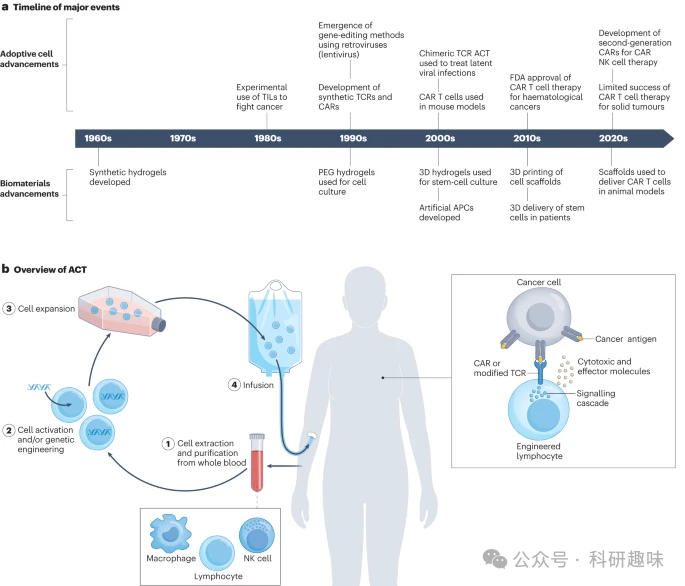
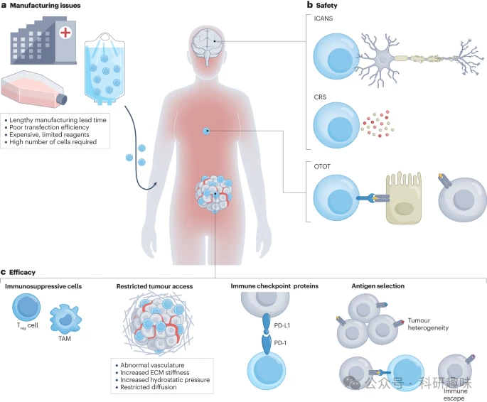
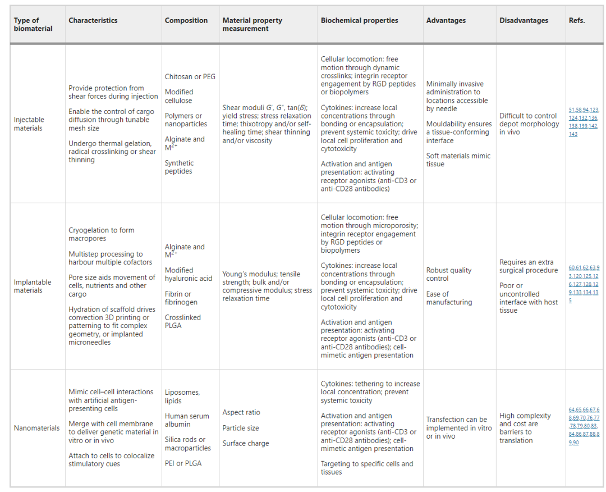
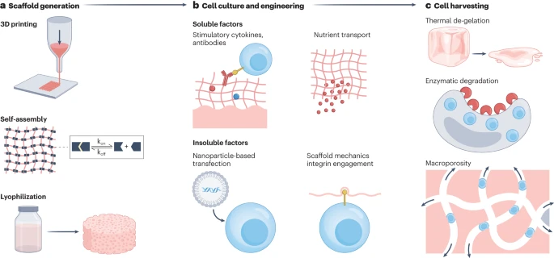
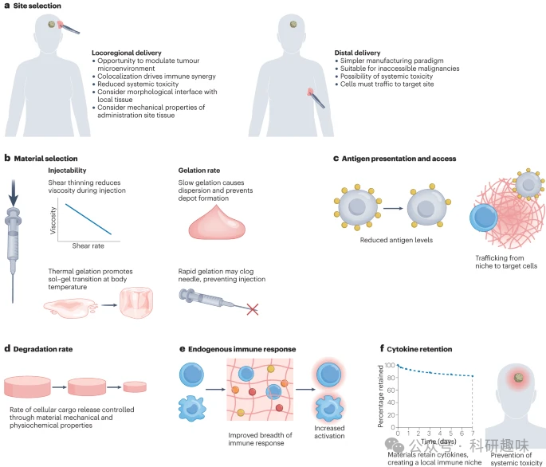

 

#  【Nat. Rev. Bioeng.】过继细胞疗法（ACT）与生物材料技术的结合，从癌症到普适性免疫疾病 
 

Grenemal

读完需要

50

全文字数 16700 字

**要点**

- 生物材料在用于过继细胞疗法 （ACT） 的多种免疫细胞类型的生产、工程和递送中具有重要应用。
- 三维支架、人工抗原呈递细胞和体内生产有望提高ACT的可靠性和可扩展性，并降低其成本和生产时间。
- 含有刺激性辅助因子的局部给药和缓释制剂可降低与目前批准联合疗法相关的风险。
- 基于生物材料的ACT的应用可以扩展到非肿瘤学环境，如自身免疫性疾病和传染病。

**介绍**

过继细胞疗法（ACT）在治疗晚期血液系统恶性肿瘤方面展现出显著的效果。作为一种免疫疗法，ACT涉及患者自身或免疫相容供体的免疫细胞的体外扩增。这些经过基因工程改造的免疫细胞随后被输回患者体内。嵌合抗原受体（CAR）T细胞疗法是ACT的一种形式，在治疗耐药、复发或难治性B细胞恶性肿瘤患者中实现了高完全康复率，有时与其他疗法联合使用。

尽管ACT已经取得了显著的成果，但其实施仍面临着一些挑战。例如，需要过继转移超大剂量的免疫细胞，对治疗安全性的担忧，以及确保将转移的细胞有效递送至感兴趣的组织等。这些障碍限制了ACT在血液系统恶性肿瘤中的应用。

为了克服这些挑战，研究人员正在利用一系列基于生物材料的解决方案，以改善用于ACT的免疫细胞的生产、递送和有效性。这些生物材料可用于缓解ACT的高成本和时间密集型制造，并实现对工程细胞的扩增和释放进行空间和时间控制，同时降低其产生耗竭表型的倾向。

综上所述，生物材料作为增强ACT的制造平台和递送载体具有巨大的潜力，有望改善治疗结果，为患者带来更好的生存希望。

图1：生物材料与过继细胞疗法的发展。

**专栏1 过继细胞疗法的类型**

**自体疗法**

目前市场上所有形式的过继细胞疗法（ACT）均采用自体细胞，即将患者的免疫细胞进行体外扩增和改造后再输回患者体内。这种自体疗法能够避免与宿主免疫系统的不相容问题，并利用患者自身的抗肿瘤免疫反应。

肿瘤浸润淋巴细胞（TIL）是从患者身上分离出的免疫细胞混合物，通常在实体瘤手术切除过程中获取。TIL包括T细胞、B细胞和自然杀伤（NK）细胞，经过肿瘤抗原特异性筛选、体外扩增后重新输注到患者体内。尽管有一些有希望的结果，但TIL ACT的持续障碍包括肿瘤细胞的免疫逃逸、免疫抑制性肿瘤微环境以及辅助白细胞介素2（IL-2）治疗的毒性。

在基于嵌合T细胞受体（TCR）的ACT中，从患者血液中分离的T细胞被扩增和改造，以表达能够识别来自肿瘤抗原的肽的TCR。为了使这些T细胞有效地靶向携带靶抗原的肿瘤细胞，工程基因序列必须编码一个完整的TCR复合物，该复合物能够识别人类白细胞抗原和肿瘤相关抗原的特定组合。当抗原与这些TCR结合时，会激活T细胞并诱导靶细胞杀伤。重要的是，有效的基于TCR的ACT需要肿瘤抗原由主要组织相容性复合体（MHC）呈递，而许多癌细胞类型可能会下调或丢失MHC表达。

基于嵌合抗原受体（CAR）T细胞的ACT是目前最成功的ACT形式。几种CAR T细胞疗法已获得美国食品和药物管理局（FDA）批准。CAR T细胞被设计为表达一种CAR，该CAR可以与完整的肿瘤抗原结合，而与MHC呈递无关。这种特性避免了其他ACT类型所经历的一些障碍，包括MHC表达的丧失和导致移植物抗宿主病的人白细胞抗原错配。慢病毒或γ逆转录病毒载体是临床试验和已批准的CAR T细胞ACT中最常见的基因转导方法，但转导效率往往有限。基于纳米材料的转导方法（如脂质纳米颗粒）可能会提高转导功效。基因编辑方法如CRISPR-Cas9可以精确地定制淋巴细胞基因组以掺入CAR或敲除特定基因。CRISPR-Cas9编辑的CAR T细胞已经经历了几次成功的临床试验，并取得了可喜的结果。

基于NK细胞的ACT受到了广泛关注。NK细胞是先天效应淋巴细胞，对一系列抑制和激活信号做出反应，超出特异性抗原识别。追求基于NK细胞的ACT的一个主要动机是它有可能开发依赖于输注未修饰的NK细胞的仿制药，尽管这种方法仅取得了中等疗效。相比之下，CAR修饰的NK细胞在血液系统癌症和一些实体瘤中都显示出显著的疗效，在某些情况下表现出优于CAR T细胞的疗效。CAR NK细胞可能具有降低引发细胞因子释放综合征的倾向，从而提高了这些治疗的安全性。这些优势导致人们对这种细胞类型的兴趣日益浓厚，目前有60多项CAR NK临床试验正在进行中。

**非自体疗法**

自体ACT的高成本和长时间的制造过程，使得同种异体ACT成为了人们关注的焦点。然而，同种异体ACT也面临着其特有的挑战。由于同种异体细胞的受体和抗原与患者的受体和抗原存在差异，这可能导致免疫排斥和自身免疫功能障碍。

诱导多能干细胞（iPSC）为解决这些问题提供了新的途径。利用iPSC产生的淋巴细胞用于ACT，可以避免自体细胞疗法中的免疫排斥问题，并且能够将原本需要自体细胞的长时间生产过程缩短数周。此外，iPSC相较于患者来源的淋巴细胞，更易于进行基因修饰。

值得一提的是，iPSC衍生的NK细胞展现出了与自体工程NK细胞相似的抗肿瘤功效。这为未来的ACT治疗提供了新的策略和可能性，尤其是在利用iPSC技术加速淋巴细胞生产和提高治疗效果方面。

**其他免疫细胞类型**

在临床前研究中，经过工程改造以表达CAR的巨噬细胞展现出有希望的抗肿瘤细胞毒性，目前正在临床试验中作为潜在的同种异体ACT进行评估。

调节性（T）细胞是CD4+Treg细胞亚群，具有维持免疫稳态和防止自身免疫的功能。基于Treg细胞的ACT已被用于治疗一些自身免疫性疾病，包括系统性红斑狼疮、1型糖尿病和多发性硬化症。

B细胞ACT可以提供长期的抗体来源，已被研究用于治疗慢性感染，也可能在病毒性疾病中发挥作用。此外，γδT细胞ACT已被研究用于治疗血液学和实体恶性肿瘤，因为这些细胞能够分化为促炎或抗炎表型并识别肿瘤应激抗原，并且它们不依赖MHC表达。

**过继细胞疗法的障碍**

**制造成本高且复杂**

尽管ACT在治疗血液系统恶性肿瘤方面取得了显著的成功，但目前的ACT范式仍面临着一系列临床和工程问题（图2）。目前，每个患者的免疫细胞都必须通过白细胞分离术获得，然后经历一个复杂的制造过程，包括纯化、活化、工程改造（对于工程化ACT）以及扩增至临床给药所需的数量。此外，还需要进行质量控制和输注到患者体内。

在许多患者中，收集必要数量的淋巴细胞是一项挑战，因为免疫细胞计数通常会因先前的恶性肿瘤治疗和/或晚期疾病的存在而降低。为了达到移植所需的细胞数量（通常约为10E8个细胞）以及执行基因工程步骤，需要采用细胞培养来扩增和/或分化收集的细胞。

目前常用的细胞培养系统包括摇床、搅拌罐和灌注生物反应器。然而，这些平台可能无法模拟T细胞或其他免疫细胞的自然环境，导致表型变化，从而限制了它们在ACT中的有效性。在目前的范式下，ACT的制造过程通常需要大约3-5周的时间，这对于患者的健康状况可能是不利的。

此外，治疗生产、物流和管理的复杂性导致成本高昂。例如，用于治疗淋巴瘤的CAR-T细胞疗法的疗程总成本估计超过400,000美元。因此，ACT的规模化应用和实施面临着巨大的挑战。通过减少ACT所需的生产时间和/或细胞计数，可以大大降低这些挽救生命的治疗的成本。

图2：可以使用生物材料解决的过继细胞疗法的当前挑战。

**安全问题**

当前市场上的大多数联合疗法都存在引发严重不良反应的重大风险。特别是全身炎症反应综合征，例如细胞因子释放综合征（CRS），这种反应涉及到T细胞过度活化，引发大量的炎性细胞因子释放。

在接受经批准的CAR T细胞疗法的患者中，至少有70%的患者会出现CRS。为了应对这种情况，治疗方案通常需要在CAR T细胞治疗前预防性地使用抗CRS药物，例如托珠单抗，这是一种针对白细胞介素-6（IL-6）的单克隆抗体。

CRS的症状包括持续发热、低血压、高铁蛋白血症和器官功能障碍。随着CAR T细胞疗法增强免疫效应细胞的数量，还可能引发免疫效应细胞相关神经毒性综合征（ICANS），这是一种表现为表达性言语障碍、震颤、意识模糊和头痛的疾病。

尽管及早发现的话，CRS和ICANS都可以得到有效的治疗，但它们对患者构成了重大和持续的风险。针对B细胞靶标（如CD19）的CAR T细胞治疗也可能导致B细胞再生障碍，因为CAR T细胞会攻击健康的B细胞，将B细胞计数降低到危险的低水平。

此外，实体瘤上的潜在靶抗原通常也在健康细胞上表达，这可能导致危险的“靶向、非肿瘤”（OTOT）毒性作用，其中CAR T细胞不仅攻击肿瘤细胞，还会攻击健康细胞。

为了防止ACT的这些不良全身反应，需要发展能够将修饰的细胞和抗炎细胞因子局部递送至特定免疫生态位的技术。这将为未来的疗法提供更安全、更有效的途径。

**在实体瘤中的疗效有限**

尽管CAR T细胞在治疗B细胞恶性肿瘤方面取得了显著的成功，但在实体瘤治疗方面，其效果并不理想。实体瘤细胞上抗原的多样性使得设计出能够有效靶向大多数肿瘤细胞的CAR变得极具挑战性，这使得实体瘤难以被免疫系统识别和治疗。

此外，淋巴细胞向实体瘤部位的运输也是一大难题。目前的ACT递送范式主要依赖于全身给药，一旦输送到血液中，免疫细胞可以轻易地攻击血液中的癌细胞。然而，由于多种原因，免疫细胞难以渗透到实体瘤内部，包括从血液到组织的运输障碍、免疫细胞浸润不良以及实体瘤内部的免疫抑制微环境。

实体瘤内部的免疫抑制微环境是有效免疫治疗的主要障碍。实体瘤中含有大量的免疫抑制细胞和蛋白质，可以诱导淋巴细胞无功能、抑制其活性或促使其增殖，从而显著减少其在肿瘤中的数量。此外，淋巴细胞也会受到来自各种免疫抑制细胞（如T调节性细胞、髓源性抑制细胞、肿瘤相关树突状细胞和肿瘤相关巨噬细胞）产生的化学信号的干扰，这些信号分子（如IL-10、血管内皮生长因子和转化生长因子-β）会阻止淋巴细胞进入实体瘤。此外，由于肿瘤内部胶原蛋白含量增加导致的组织硬度上升也构成了物理屏障，阻碍了免疫细胞的浸润。

扩大规模和患者间的临床变异性也为将ACT扩展到不同种类的癌症带来了挑战。这些挑战并非仅通过细胞工程方法就能解决，而是凸显了当前开发技术的不足。开发技术的未满足需求包括：不仅将转移的细胞限制在特定的免疫生态位，还要保持其肿瘤反应性表型。

**用于ACT生产的生物材料**

生物材料在制造基于细胞的疗法中发挥着至关重要的作用。基于生物材料的细胞培养和转导策略有望提升ACT的可扩展性、通量、可靠性和灵活性。例如，与使用传统的细胞培养系统相比，使用3D多孔支架进行细胞培养能够更精确地模拟生理微环境的机制，从而使细胞表型更接近于体内观察到的状态。此外，基于生物材料的培养系统还有助于促进更容易浸润实体瘤的T细胞群的发育。

通过利用机械和生化刺激，开发新型的细胞活化和培养方案，有望产生更为高效的基于细胞的疗法。这为未来的生物医学研究提供了新的思路和可能性。

**生物材料特性和平台**

在细胞培养系统中，生物材料的机械性能对于调节生物材料与免疫细胞之间的相互作用具有重要意义。例如，粘弹性生物材料的特性能够改变细胞的运动、表型以及活性。

粘弹性是指材料同时具有类固体（弹性）和类液体（粘性）的特性，这两种特性在不同时间尺度上起作用。这些特性可以通过测量材料的动态剪切模量来表征，包括储能模量 G′（代表类固体行为）、损耗模量 G“（代表类液体行为）以及比值 G”/G′，也称为 tan（δ）。

此外，其他具有时间依赖性的粘弹性参数，如应力松弛、半衰期和触变粘度恢复时间，也会影响生物材料在细胞培养系统中的性能。而屈服应力（材料抵抗变形的应力值）也会对细胞的迁移和表型产生影响。

材料的弹性性能可以通过杨氏模量（描述对单轴应力的弹性抵抗力）或压缩模量或体积模量（描述材料对压缩力的抵抗力）进行衡量。这些特性在细胞培养系统的设计和优化中起到了关键作用，有助于更好地模拟生理环境，从而提高细胞培养的效率和效果。

表1 用于过继细胞治疗的生物材料

对于许多细胞类型，包括免疫细胞，培养基质的机械性能对其行为有着显著的影响。较硬的材料（具有较高的储能模量G′或杨氏模量）通常能促进细胞的增殖并减少细胞凋亡。大多数细胞倾向于从较软的区域迁移到较硬的区域。然而，如果基质硬度过高，以至于无法允许营养物质扩散和细胞运动，反而会导致细胞死亡。

例如，T细胞虽然不是贴壁细胞，但它们能够感知外部环境的机械力，并且其运动性受到底物化学特性的影响。事实上，细胞外基质（ECM）的硬度会对T细胞的表型和增殖产生影响。因此，精确调整用于ACT的T细胞的机械环境能够提高其抗肿瘤效果。

生物材料表现出多层次的结构，其聚合物网片尺寸和孔径对作为细胞支架的性能具有重要影响。在水凝胶中，聚合物网孔尺寸决定了构成材料的聚合物链之间的间隙。一般来说，小于网孔尺寸的分子可以在网络中自由扩散，而大于网孔尺寸的分子则被困在其中。较小的网孔尺寸可能会限制细胞在通过水凝胶时的运动，因为较小的网孔尺寸会导致细胞周围的交联密度增加，从而降低整体运动速度。

淋巴细胞的直径大约为7-10μm，在体内具有高度的流动性，能够在血液和组织之间迁移。然而，这些细胞通常不能自由地穿过聚合物网络，除非聚合物链通过生化反应部分交联或由可被包埋的细胞重新排列的物理相互作用组成。为了允许细胞在支架内自由运动以及营养物质、气体和废物的扩散，可以通过调整孔隙和网孔尺寸来优化支架的结构。对于基于T细胞的ACT，培养系统必须维持一个适合的环境，使T细胞不仅能够与抗原呈递细胞（APC）结合，还能与其他共刺激因子相互作用。

除了机械线索外，可溶性和不溶性生化线索也提供了控制和操纵免疫细胞表型所需的信号。常见的ECM相关不溶性生化线索包括细胞粘附配体，如RGD肽，可促进整合素结合。常见的可溶性线索包括刺激T细胞活化和增殖的刺激性细胞因子。支架可以设计为包含反应性部分，以实现生物分子（如细胞因子、抗体或Toll样受体激动剂）的双正交偶联。这些生物分子提供了将细胞信号转向以最大化T细胞存活或功能或改变DC活性的机会。或者，可以与细胞因子结合的蛋白质（如肝素）可以掺入支架中，以改善细胞因子的保留和对T细胞的呈递。

**细胞培养和基因工程**

在用于ACT的细胞修饰和基因工程领域，支架材料发挥着关键作用。这些材料范围广泛，从软水凝胶到刚性大孔支架都有所涉及。其中，可逆热凝胶水凝胶支架在细胞增殖后，有助于从凝胶中收获细胞。而冷冻再水化的凝胶材料，通过产生流体对流，能促进大量流体流动，从而提高病毒转染的效率。

细胞粘附的RGD基序被纳入支架中，有助于增强机械转导，进而大大加速CAR T细胞的扩增。此外，海藻酸盐支架能够将逆转录病毒载体颗粒与人血液单核细胞结合在一起，使细胞增殖和转染阶段得以在一个步骤中完成。这种支架还可以设计成包含多种化学信号，例如利用点击化学技术结合到支架上的抗CD3和抗CD28抗体，从而促进T细胞活化并增强逆转录病毒基因转移。同时，细胞因子如IL-2也可以封装到支架中，以驱动细胞增殖。

通过精确控制物理和生化线索的能力，生物材料平台为操纵患者来源的免疫细胞提供了所需的灵活性和控制力，有助于进一步优化ACT的治疗效果。

图3：生物材料在过继细胞疗法生产中的应用。

**抗原呈递**

支架材料在模仿APC功能以激活T细胞方面具有巨大的潜力。在适应性免疫反应中，APC与T细胞之间的相互作用是一个高度有序的过程：APC在其表面呈递抗原，并与MHC II类蛋白质复合物结合，进一步与共刺激蛋白结合并激活幼稚T细胞。

因此，设计出能够概括APC抗原呈递功能的支架（也称为人工APC）可以优化免疫细胞反应。重要的是，人工APC的纵横比和大小能够改变T细胞的活化程度。在传统的CAR T细胞制造中，使用与CD3和CD28分子偶联的磁化聚合物微粒（称为Dynabeads）是激活和分离修饰T细胞的常见手段。

尽管人工APC的开发引起了极大的兴趣，但将它们整合到ACT应用的完整培养系统中仍然面临挑战。然而，一些特殊的支架，如涂有脂质双层的硅棒或基于微粒的支架，能够模仿天然活化的T细胞的脂质双层，提供比传统细胞培养技术更强大的T细胞扩增能力，同时促进所需的CD8+细胞毒性表型的形成。

此外，连接抗CD3和抗CD28抗体的聚合物支架也能够结合并激活T细胞。这种支架上的抗体展现出半柔性的性质，这种特性模仿了天然APC的抗原呈递方式，相较于附着在刚性珠子上的相同抗体，能够更有效地激活T细胞。还有基于流的设备中包含了水凝胶膜，这些水凝胶膜可以为T细胞提供激活抗体，并实现快速、高效的T细胞激活。

**细胞分化**

在再生医学领域，利用生物材料传递生物力学和化学线索来指导干细胞的分化已经得到了广泛研究，这种方法在免疫治疗中同样具有重要价值。基于同种异体分化干细胞的青蒿素联合疗法能够消除对提取和纯化患者自身免疫细胞的需求，从而最大限度地减少延迟，并使这种“现成的”治疗更具可扩展性。

与目前的ACT生产同基因方法相比，提前扩增、验证和储存免疫细胞群的能力提供了更大的灵活性、速度和易于治疗。生物材料已被用于帮助引导各种干细胞谱系向T细胞或自然杀伤（NK）细胞分化。例如，CD117+造血干细胞的双重海藻酸盐和明胶封装能够将它们引导至NK表型。这些细胞的物理封装也导致细胞因子分泌增加，这比传统的细胞培养条件更有效地促进了它们的分化。

此外，三维类器官培养条件也被用于引导CAR工程诱导多能干细胞（iPSC）分化为CAR T细胞。从3D类器官衍生的iPSC CD19-CAR T细胞显示出常规的αβT细胞表型，尽管其CAR表达低于常规生产的CD19-CAR T细胞。当与IL-15共同递送时，iPSC CD19-CAR T细胞在携带CD19人类肿瘤异种移植物的免疫缺陷小鼠中显示出比传统CD19-CAR+T治疗更有效的抗肿瘤作用。这些研究表明，利用生物材料和类器官培养技术，可以更有效地生产和优化免疫细胞疗法，为未来的免疫治疗提供更多可能性。

**基于纳米颗粒的转导**

纳米颗粒在CAR T细胞的转染中发挥了重要作用，有助于克服与基于逆转录病毒的方法相关的挑战。例如，脂质体或脂质纳米颗粒被用于封装编码CAR或其他相关蛋白质的信使RNA分子。与逆转录病毒载体技术相比，脂质体转染具有更高效的转染效率和更低的安全风险。

其他方法利用含有DNA或RNA的聚合物或磁性纳米颗粒。这些纳米颗粒被细胞内吞后，必须经历内体逃逸过程以释放其核酸货物。聚乙烯亚胺（PEI）和其他能够穿过细胞膜的聚合物已被用于封装遗传物质并递送至T细胞。通过将这些聚合物结构化为自组装纳米颗粒、环形或环形结构，可以增强其浓缩DNA的能力并降低细胞毒性，从而提高递送效率。然而，由于T细胞的内体逃逸能力有限，目前仅实现了中等程度的转染成功。

基于纳米颗粒的技术还可以用于对具有抗性的细胞类型（如巨噬细胞）进行工程改造。通过使用非病毒、基于纳米颗粒的转染方法来扩展ACT以利用更多样化的免疫细胞谱系是一种有前途的方法，可以提高此类治疗的安全性和有效性。

**体内制造**

生物材料在体内生成ACT细胞的过程中具有重要作用，有望加速和简化这种治疗方法。这些材料通过在治疗部位共定位细胞、转染剂和激活信号，促进ACT细胞的体内生成。

例如，基于海藻酸盐的冷冻凝胶支架可以植入体内，作为T细胞转导和扩增的局部生态位。这种支架能够保留提取的单核细胞以及逆转录病毒基因转移和T细胞扩增所需的信号和试剂，包括CD3激动剂、CD28激动剂和IL-2等细胞因子。

此外，携带修饰基因的纳米材料（例如脂质纳米颗粒）可以将遗传物质直接转运到内源性免疫细胞中，例如T细胞和巨噬细胞。这种方法已被用于产生CAR T细胞，这些细胞能够特异性裂解心脏组织中活化的成纤维细胞，从而减少纤维化并恢复受伤后的心脏功能。

水凝胶也可用于递送遗传物质。例如，一种载有工程外泌体模拟物的壳聚糖基水凝胶已被用于招募和重编程内源性巨噬细胞，从而促进吞噬作用并抑制免疫功能正常小鼠的肿瘤复发和转移。

通过利用可注射或可植入材料，研究人员可以继续加速和改进ACT，为未来的免疫治疗提供更多可能性。

**用于递送ACT的生物材料**

**基本生物材料特性**

对于在体内形成持久仓库的植入材料，其降解性能决定了修饰细胞从材料中释放以及向靶位点运输的速率。重要的是，植入的生物材料必须能够承受体内复杂环境中的各种应力和变化。对于用于体外产生ACT细胞的生物材料，可以与产生的细胞相互作用的生化线索也可以被整合到生物材料中，以增强ACT的递送效果和功效。在此背景下，我们需要深入考虑用于递送ACT的生物材料的特性，以确保其能够满足实际应用的需求。

**体内用生物材料**

载细胞生物材料的物理与机械特性对细胞进入体内的速度具有调控作用。材料的降解速率直接影响到转移的T细胞（及其他货物）到达目标位点的速度，以及它们在宿主体内的驻留时间。与传统的全身给药方式相比，如通过输注进行ACT，生物材料的缓释特性具有显著优势。这种缓释特性能够减轻全身给药可能引发的细胞因子释放综合征（CRS）。

某些流变特性能够预测材料库的持久性。例如，增加的储能模量、屈服应力和零剪切粘度都表明，物理交联和共价交联水凝胶的体内持久时间得到延长。此外，交联的化学性质也会影响材料的降解行为。例如，海藻酸盐凝胶依赖于添加钙或其他二价阳离子进行交联；然而，钙是许多细胞类型（包括淋巴细胞）的关键第二信使，因此钙水平的增加可能会引发免疫刺激。

纯胶原蛋白基生物材料具有低免疫原性；然而，一旦暴露在湿润环境中，它们会失去机械强度和结构稳定性。因此，用于体内使用的基于胶原蛋白的生物材料必须与其他聚合物结合或进行独立交联。另一方面，基于透明质酸的生物材料能够强烈促进细胞迁移和增殖，但通常会在体内迅速清除（皮下空间的半衰期约为1天）。相比之下，聚乙二醇（PEG）等合成材料能够抵抗清除，因为它们不受蛋白水解的影响，且水解动力学缓慢。

在选择用于ACT递送的生物材料时，必须深入分析和考虑这些聚合物的化学性质，因为它们对转移的T细胞的驻留以及ACT的药代动力学和结果具有显著影响。此外，生物材料支架的免疫原性也是一个被低估的设计标准，因为在ACT的临床前研究中，大多数小鼠模型都缺乏免疫系统。

转移细胞、材料成分和相关生物分子的药代动力学是ACT中被低估的关键因素。单次输注CAR T细胞ACT的药代动力学包括几个阶段：由于重新分布导致细胞数量的初始下降，然后是大约2周的群体扩增期，之后CAR T细胞数量急剧下降。只有少量CAR T细胞在1个月后持续存在。使用缓释材料平台可以灵活控制ACT的药代动力学。同时测量支架递送的CAR T细胞和细胞因子的药代动力学的研究也可以提供对ACT疗效的深入见解。此外，包膜细胞的流出速率可能与共包膜细胞因子或辅因子的流出速率有很大差异；保留刺激性细胞因子的生物材料有助于推动局部免疫生态位中细胞的增殖。因此，治疗性辅因子（如细胞因子）的药代动力学特征应与转移细胞的药代动力学特征一起单独和协同测量，以微调ACT中使用的细胞类型的扩增和生长曲线。

**生化线索**

在ACT中，面临的主要挑战包括产生足够数量的自体工程细胞、实现这些细胞在体内的长期功能持久性，以及使它们能够渗透到免疫抑制性肿瘤微环境中。为了应对这些挑战，生化线索被广泛用于辅助ACT。因此，将这些合适的分子封装在生物材料中共递送对于ACT的成功至关重要。

细胞因子和其他免疫信号分子是生物材料辅助ACT中常用的共同递送分子。细胞因子具有广泛的功能，包括通过旁分泌和自分泌信号调节抗肿瘤免疫反应。例如，细胞因子能够使细胞产生活性氧、分泌其他促炎细胞因子并介导细胞毒性等作用。在基于T细胞的疗法中，细胞因子有助于T细胞及其发育中的亚群的活化、扩增和分化。此外，细胞因子还可以与基于材料的ACT共同递送，以增强体内T细胞的增殖和活性。

白细胞介素是一类具有强大免疫作用的细胞因子，可用于肿瘤的预防和治疗。虽然白细胞介素在治疗癌症方面的临床试验取得了一定的疗效，但由于全身毒性和细胞因子释放综合征（CRS）等严重不良反应，其治疗效果仍有限。为了改善白细胞介素的递送效果，生物材料已被广泛应用于共同递送免疫细胞和细胞因子（包括白细胞介素）方面，显示出巨大的潜力。例如，IL-2作为CD4+T细胞和NK细胞的生长因子，与IL-15和IL-7一样，可以促进活化CD8+T细胞的克隆扩增。IL-15和IL-7则增加活化T细胞分化为效应T细胞亚群，并且分别是记忆淋巴细胞亚群（如长寿命干细胞样记忆T（TSCM）细胞）的生成和扩增所必需的。因此，细胞因子，特别是白细胞介素，是生物材料中进行ACT递送的重要生化线索。

除了细胞因子外，刺激性抗体和抑制性抗体也在生化线索中发挥重要作用。与细胞因子一样，刺激性抗体有助于患者来源的T细胞的体外分化和扩增。例如，携带修饰的TCR或CAR的幼稚T细胞通过暴露于抗CD3和抗CD28抗体而被激活。在递送ACT时，其他刺激性抗体可用于调节转移细胞以及周围免疫细胞的活性。共刺激途径可以通过递送激动性抗体来触发，这些抗体可增强过继转移的T细胞的扩增和功能。例如，用抗4-1BB抗体治疗可以延长过继转移后T细胞的存活率，从而有助于肿瘤消退。相反，抑制性通路也可以在ACT递送的同时以类似的方式被阻断。例如，细胞毒性淋巴细胞相关抗原4（CTLA4）和PD-1是活化T细胞表面的抑制分子，在阻止细胞周期进程和抑制细胞毒性细胞因子（如IL-2）的产生方面具有重要作用。这些抑制分子可以通过与ACT结合递送的拮抗抗体来有效阻断，从而抵消T细胞的抑制作用，提高T细胞的活性。

此外，免疫调节药物的共同递送也可以增强ACT的抗肿瘤反应。例如，在疫苗接种策略中通常用作佐剂的IFN基因刺激因子（STING）通路的成分可以在免疫系统检测和根除肿瘤细胞方面发挥重要作用。与ACT一起激活STING通路的环核苷酸（如cGAMP（2′3′-环GMP-AMP）或DMXAA（5,6-二甲基氧杂蒽酮-4-乙酸）的共同递送促进了修饰的T细胞向肿瘤部位的运输，并驱动了积极的抗肿瘤反应。其他调节肿瘤微环境的共同递送药物可促进免疫细胞的浸润、增殖和存活等作用。

综上所述，通过使用适当的生物材料封装和共同递送生化线索、免疫调节药物和其他相关分子，可以有效增强ACT的抗肿瘤反应并改善患者预后。这些策略不仅有助于克服当前ACT面临的挑战，还为未来的免疫治疗提供了更多可能性。

**目前的做法**

目前，科研人员正在深入研发各种植入式、注射式和仿生生物材料，旨在优化ACT的递送方式。基于材料的ACT技术具备将转移细胞精准导向肿瘤位置的独特优势，无论是原发肿瘤还是切除后的部位。这种方法有助于解决全身输注面临的挑战，显著提高了移植细胞的肿瘤靶向性。

更令人振奋的是，生物材料的应用甚至使研究人员能够成功地将经过改造的免疫细胞递送到远离肿瘤的远端区域。即便这些区域远离引流淋巴结，依然能够创造出短暂的炎症生态位，进而清除肿瘤。这一突破性的成果，如图4a所示，为未来的癌症治疗开辟了新的可能性。

图4：生物材料在过继细胞治疗中的应用。

**植入式支架**

植入式支架通常选用坚固且具有大孔结构的材料，如海藻酸盐、其他天然聚合物或适合承载细胞与生化辅因子的合成聚合物。这些材料在生物应用中具有显著优势，因为它们易于降解、可定制性强，并且在配置后不会引发免疫反应。部分植入式支架经过特殊处理，可以冷冻并冻干，从而形成足够大的孔洞，以预先装载药物、蛋白质和细胞。

植入式支架的优势在于其严格的质量控制和制造简便。然而，它们的植入通常需要通过手术进行，并且体内植入部位的复杂几何形状可能导致与宿主组织的融合不佳。此外，为了提高生物相容性和转移细胞的活性，研究者们常在支架中加入天然聚合物以促进淋巴细胞的自然迁移。

以透明质酸为例，这种重要的ECM模拟材料在结构修饰或交联后能保持其机械完整性。通过冷冻和自由基交联技术，透明质酸支架已被用于递送NK和CAR T细胞ACT。在一项研究中，这种支架显著增强了携带乳腺癌的小鼠模型中转移细胞的运输能力和肿瘤浸润能力。此外，使用3D打印的大孔海藻酸盐-明胶支架已在多种体外肿瘤模型中展现出改善NK细胞抗肿瘤效果的作用。

纤维蛋白支架则是通过在钙存在下将可溶性ECM衍生的纤维蛋白原与凝血酶混合而产生的。这一过程与血液凝固、伤口愈合和组织再生紧密相关。因此，纤维蛋白支架提供了一个可生物降解的环境，不会引发炎症、组织坏死或纤维化。纤维蛋白凝胶已在手术切除后的多形性胶质母细胞瘤肿瘤腔中成功形成，用于局部递送CAR T细胞。这种支架材料不仅为CAR T细胞提供了营养物质，还显著提高了其活力和功能。

除了支架本身，其他治疗剂的共同递送也能有效调节转移细胞的活性。例如，促进迁移的大分子（如GFOGER肽）以及激活刺激的抗CD3、抗CD28和抗CD137抗体都能整合到3D支架中。为了达到更彻底的肿瘤清除效果，高浓度的免疫刺激性STING激动剂环di-GMP被添加到海藻酸盐支架中，以促进T细胞的启动。从植入生物材料中释放的环状di-GMP与CAR T细胞共同作用，引发了宿主DC的协同激活，进而导致大量T细胞活化、局部肿瘤消除以及远隔效应的产生（即触发足以预防转移并有效治疗远处和异质性肿瘤的全球抗肿瘤免疫反应）。

此外，小分子药物如二甲双胍与支架的共同递送也能调节免疫细胞反应。这意味着植入式支架可以作为递送工程细胞和其他共递送治疗剂的有效平台。然而，由于支架必须植入肿瘤部位或其附近，该技术的应用受到一定限制，主要适用于手术可及的位置。尤其在切除后的环境中，预先存在的手术部位使得植入式支架尤为实用；但需注意选择适当的降解率材料，因为长期留置的植入物可能会对正常器官功能造成损害。

**注射式水凝胶**

注射式材料作为ACT的输送系统具备多种优势。由亲水性聚合物网络组成的水凝胶是一种有吸引力的支架材料，因为它具有生物相容性、可调特性，以及由于其交联结构而保持不溶于水的能力。与植入式支架相似，用于ACT递送的注射水凝胶必须保持适合细胞转运的网状尺寸和交联类型。然而，与植入式支架不同，注射水凝胶还必须具备物理和化学特性，以实现通过针头注射所需的粘度瞬时变化以及随后的凝胶重整。

注射材料的可注射性是通过多种材料特性得以实现的，这些特性适用于ACT的微创输送（表1）。一些可注射材料在注射时会经历剪切变薄，即在注射的高应变条件下粘度降低。其他材料在注射过程中处于溶胶状态，然后在体内发生交联。例如，当纤维蛋白原暴露于凝血酶和钙时，会发生热凝胶化或纤维蛋白形成。此外，注射材料可以将生物材料输送到手术无法进入或形状不规则的部位。然而，注射材料的缺点在于难以控制体内存储库的形成，可能导致结构不规则或无定形，并且如果凝胶化过早发生，存在针头堵塞的风险（图4b）。

聚酰胺、PEG及其衍生物等合成聚合物由于其高度可控的物理和化学特性而常用于可注射生物材料。基于三甘醇取代的多异氰肽（PIC）的合成水凝胶已被用于递送预活化的T细胞。PIC聚合物能够调节水凝胶的形态和力学性能，以产生类似于天然组织的机械行为，并允许通过针头直接进行细胞封装和输送。此外，合成聚合物的高度可控性使得叠氮化物点击反应可用于将RGD肽掺入材料中。这种合成聚合物平台支持大规模体外扩增，并在4周的时间跨度内实现T细胞ACT的体内递送。

用于注射水凝胶的天然聚合物包括多糖（如壳聚糖）、海藻酸盐和肽类（如胶原蛋白及其衍生物），它们具有模仿ECM的特性。一些天然聚合物在生理条件下能够形成凝胶，而另一些则需要经过功能修饰或与合成聚合物混合才能形成凝胶。壳聚糖是一种常用的注射凝胶材料，因为它具有良好的生物相容性和易功能化特性。当壳聚糖用PEG修饰后，可以形成热可逆水凝胶，这些水凝胶已用于将T淋巴细胞ACT局部递送至胶质母细胞瘤的体外模型。此外，低粘度水凝胶也被用于帮助胶质母细胞瘤小鼠模型中肿瘤特异性CAR-T细胞的颅内输注。可注射水凝胶载体由巯基化透明质酸和明胶组成，能够将CAR-T细胞连续、高速地输注到大脑中，同时不会影响细胞的迁移能力或细胞毒性。这种水凝胶载体还通过防止递送系统内的细胞沉降来提高处理效率，这在采用盐水载体时是常见问题。

可注射水凝胶平台是递送ACT和增强其在体内对抗实体瘤疗效的有效手段。例如，基于自组装肽的水凝胶平台可以在其结构中使用ECM衍生的免疫刺激部分。在小鼠模型中，这种水凝胶平台成功地将携带CAR基因的纳米胶束递送至切除腔中的巨噬细胞和小胶质细胞，从而产生对残留胶质母细胞瘤干细胞具有杀伤活性的CAR-巨噬细胞。原位生成的CAR-巨噬细胞刺激了适应性抗肿瘤免疫反应，从而防止了神经胶质瘤的术后复发。壳聚砂-PEG水凝胶已用于将神经节苷脂2肿瘤抗原特异性、IL-15释放的CAR-T细胞局部递送至视网膜母细胞瘤肿瘤，这是一种难以手术治疗的癌症。此外，聚合物纳米颗粒水凝胶的非共价交联被用于共包封CAR-T细胞和细胞因子（如IL-15）。这种聚合物纳米颗粒水凝胶的动态交联可以控制网格尺寸，并通过剪切稀化辅助注射。共包封的CAR-T细胞和IL-15可以减轻与全身细胞因子给药相关的毒性作用，同时增强免疫缺陷小鼠中CAR-T细胞的活化和扩增。此外，这种聚合物纳米颗粒水凝胶导致CD39+的CAR-T细胞表达增加，这与人髓母细胞瘤肿瘤的治疗效果提高有关。其他交联策略包括具有双细胞因子和CAR-T细胞共包封的可注射明胶甲基丙烯酰凝胶，可以原位光固化以创建ACT持续释放的库。这种系统能够促进免疫功能正常小鼠的黑色素瘤肿瘤消退。

目前正在使用各种类型的ACT的生物材料（插文1）。DC ACT一直受到移植细胞的脆弱性和短寿命的限制。自组装肽水凝胶已被用于修饰DC，从而改善ACT的递送效果。这种凝胶含有外源性DC、抗原和生物分子辅因子，能够有效地保持移植DC的活力、保留和功能。在体外，这种水凝胶有助于DC吸收抗原和成熟。这种水凝胶的应用在体内增强了免疫功能正常小鼠的黑色素瘤肿瘤治疗效果。

此外，一些研究正在探索使用其他类型的细胞，如NK细胞、T调节细胞、巨噬细胞和DC细胞，进行ACT治疗。这些细胞也正在通过可注射水凝胶平台进行递送，以提高疗效。这些新型细胞疗法的开发为许多难以治疗的疾病提供了新的治疗策略。

总的来说，可注射水凝胶平台为ACT的递送提供了一种有效的方法，通过改善细胞的存活、功能和递送，增强了治疗效果。随着技术的不断进步和材料的持续改进，可注射水凝胶在未来的细胞疗法中将发挥越来越重要的作用。

**纳米材料**

纳米材料，特别是纳米颗粒，在增强ACT的功效方面具有巨大潜力。这些纳米材料不仅提高了移植细胞的存活和植入效果，还具备将治疗药剂输送到体内难以接近部位的能力，例如穿越血脑屏障。纳米颗粒的另一项优势在于能够绑定蛋白质或其他生物分子，从而显著增强免疫细胞的存活和功能。

脂质体纳米颗粒在药物和基因传递领域的应用已经相当成熟。这些由磷脂双层组成的球形结构可以包裹各种亲水性和疏水性分子，使其成为递送治疗剂、药物和显像剂的理想选择。特别值得一提的是，经过工程改造的聚乙二醇化脂质体，能够直接调节免疫细胞功能。这些脂质体已被证实能够防止淋巴细胞效应功能丧失，并帮助细胞在体内扩增。通过与抗CD90或抗CD45抗体或重组IL-2的偶联，聚乙二醇化脂质体还能靶向ACT细胞的特异性抗原，并携带大量共包膜的免疫刺激分子。

脂质体纳米颗粒的另一项重要应用是在ACT之前对肿瘤微环境进行预处理。这些脂质体含有磷酸肌醇3-激酶抑制剂（抑制免疫抑制性肿瘤细胞）和合成免疫刺激性糖脂α-半乳糖基神经酰胺（激活NK T细胞）。为了进一步提升脂质体的靶向效果，其表面还可以用iRGD（一种含有环状RGD的九肽）进行装饰。iRGD能够与肿瘤细胞上的整合素结合，从而暴露出触发脂质体内吞作用的第二个表位。在胶质母细胞瘤免疫功能正常小鼠的实验中，与单独使用CAR T细胞ACT治疗相比，随后使用脂质体纳米颗粒预处理的动物展现出T细胞的强劲扩增，并显著改善了抗肿瘤效果。

聚合物纳米颗粒在调节和改善ACT的递送方面也发挥了关键作用。由于其良好的生物相容性和对特定细胞或组织的分子功能化能力，聚合物纳米颗粒已成为这一领域的理想选择。此外，这些纳米颗粒还能控制治疗性细胞因子或药物的释放，从而减轻与其全身递送相关的毒性。聚合物纳米颗粒的另一个优势在于能够将特定的蛋白质或药物拴系到过继转移的T细胞上，从而直接增强其在体内的功能。例如，将人血清白蛋白与纳米颗粒拴系可提高药物的生物利用度，同时降低其毒性作用并逃避宿主免疫反应。此外，将IL-12纳米兴奋剂与人血清白蛋白组装在一起，再通过点击化学与叠氮化物标记的CAR T细胞结合，可在免疫缺陷的淋巴瘤小鼠模型中促进额外细胞因子的分泌以及CAR T细胞的进一步募集和扩增。

除了上述应用外，纳米颗粒还具备间接提高治疗效果的潜力。例如，金纳米颗粒已被用于分散热能，重塑肿瘤微环境，降低ECM的刚度，并促进CAR T细胞和其他免疫细胞的浸润。这些研究充分证明了基于纳米材料的方法在增强ACT递送方面的巨大效用和潜力。

**仿生生物材料**

生物材料在仿生产品开发中发挥着关键作用，特别是在增强ACT的递送方面。这些仿生产品旨在模仿活体组织的自然特性，以克服生物系统的各种限制。在利用纳米材料进行ACT递送时，我们偶尔会面临肿瘤靶向性差、体内快速清除以及稳定性不足的问题。然而，仿生学的出现为我们提供了一种创新的解决方案，通过直接模仿活细胞的自然功能，克服这些挑战。

人工APC与ACT的共同递送为提高治疗效果开辟了新的途径。内源性APC通过迁移至T细胞被激活的次级淋巴器官来促进ACT。因此，人工APC需要具备类似的迁移能力，能够到达这些器官并将抗原呈递给T细胞，以确保T细胞的有效活化和免疫反应。

为了实现这一目标，研究人员开发了一种由两亲性聚合物脂质尾部与CAR偶联组成的新型两亲性配体（也称为amph配体）。这种amph配体的功能与体内的内源性APC类似。它们能够将CAR T细胞配体运输至淋巴结，并与内源性免疫细胞相互作用，促进转移的T细胞群的扩增，增强免疫功能正常小鼠肿瘤模型中供体细胞的多样性和抗肿瘤功效。此外，由于amph配体能够促进免疫串扰，它们也被成功应用于胶质母细胞瘤肿瘤的肿瘤疫苗增强策略，为治疗具有大量抗原异质性的肿瘤提供了新的可能。

纳米结构的人工APC，特别是纳米颗粒，在体内刺激CD8+T细胞方面展现了巨大潜力。例如，使用聚乳酸-乙醇酸（PLGA）制成的椭球体颗粒，通过薄膜拉伸成型技术，可作为T细胞活化剂。这些颗粒实现了高细胞附着力和低内化率，减少了非特异性摄取，并扩大了接触表面积。此外，PLGA还被用于开发含有抗PD-1单克隆抗体的人工APC，以防止CD8+T细胞效应功能的抑制。这种人工APC技术成功地引发了免疫活性小鼠体内肿瘤微环境和脾脏内CD8+T细胞的抗原特异性增殖。

综上所述，人工APC作为一种极具前景的仿生疗法，不仅增强了ACT的递送效果，还为在体内设计转移的T细胞提供了新的可能性。这种仿生疗法将继续发挥关键作用，推动生物材料和免疫疗法领域的创新发展。

**未来展望**

**提高治疗安全性和有效性**

生物材料在解决ACT当前面临的一些紧迫挑战方面具有巨大潜力。通过巧妙运用这些材料，我们可以设计出新型疗法，旨在减少不良反应、精确调控细胞表型，并与现有免疫疗法实现协同作用。

CRS和ICANS是许多青蒿素联合疗法中常见的临床不良反应。这些不良反应的产生，主要源于过继转移细胞在活化后的快速扩增过程中所释放的大量炎性细胞因子。为了减轻这些不良反应的影响，当前面临的一项重要挑战是如何进行有效的控制。基于材料的解决方案为我们提供了一个全新的视角，通过调控细胞从材料库流出并进入体内的速度，有望避免血液中T细胞数量的急剧增加。通过调整材料的特性，我们可以实现对细胞药代动力学的精细控制，从而降低这种急剧增加的现象，并减弱细胞因子反应。

OTOT毒性作用是设计高效ACT的另一个常见障碍。特别是在基于TCR的ACTs中，我们必须完全避免使用许多肿瘤抗原，因为它们与健康组织中低水平的抗原表达相关，可能导致毒性作用。本地递送的基于材料的解决方案为我们提供了一种可能的方法，通过有效地将转移的细胞引导至目标位置（如实体瘤），并减少转移细胞与其他身体组织的接触，例如通过控制转移细胞的生物分布来预防或减轻OTOT毒性。这种方法有望提高ACT的靶向性和安全性，为患者带来更好的治疗体验。

**未来的生物材料应用**

基于材料的解决方案在狭窄或免疫特权区域如大脑或眼睛等治疗实体瘤方面具有独特的优势。由于T细胞和其他免疫细胞难以进入这些组织，传统的静脉注射ACT方法可能无法有效发挥作用。实际上，已有临床试验成功将ACT局部注射到大脑中，并取得了显著的治疗效果。这一成功表明，利用缓释库精确控制转移的T细胞的生物分布，并创建局部增殖生态位，可以有效提高密闭区域内的肿瘤细胞清除率。此外，将其他治疗药物共同递送到同一区域，还可以进一步刺激局部T细胞的增殖。

转移的T细胞的表型对ACT的效果起着至关重要的作用。特别是，具有较低分化程度的记忆TSCM细胞群可以增强过继转移细胞在体内的持久性，从而提高治疗效果。有助于其他治疗分子（如IL-15或IL-7）共递送的材料能够富集T细胞中的转移TSCM细胞群。通过在同一材料中共制造或共递送细胞和治疗剂，转移的细胞可以充分暴露于目标治疗剂。此外，与其他治疗药物的共同递送还可以减少T细胞耗竭或增强其肿瘤浸润能力。然而，转移细胞表型对ACT的安全性和有效性的影响相当复杂，目前尚未完全了解。随着个性化医疗的广泛应用，针对特定患者的肿瘤负荷或免疫状态定制细胞表型的能力将变得至关重要。生物材料可以作为一个模块化平台，共同递送选定治疗药物，以引导转移细胞的表型向最有可能为给定患者提供有效治疗的细胞转变，同时降低对额外细胞工程的需求。

目前，科研人员正致力于开发基于材料的ACT以及能够与内源性免疫系统协同的免疫疗法。治疗剂的共同递送，包括激活特定免疫细胞亚群的抗体或靶向特定免疫级联反应的药物，可以在空间或时间上与ACT协同作用并提高其疗效。然而，仍需进一步研究以开发能够共同递送所有这些药物的材料，同时避免诱发CRS、ICANS或其他与ACT相关的副作用。此外，转移的免疫细胞可以与其他细胞共同递送，这些细胞可根据内源性或外源性刺激产生可调和连续的生物分子线索。这种“智能”联合疗法可以提高ACT的灵活性和稳健性。

除了肿瘤适应症外，ACT模式还正在开发用于非肿瘤适应症，如自身免疫性疾病、传染病和纤维化等。通过使用生物材料设计和递送用于ACT的细胞，可以实现或改进这些应用。将免疫细胞定位到特定损伤部位有助于提高治疗效果并减少脱靶不良反应。同时，材料募集和/或设计内源性免疫细胞的能力也有助于模仿对疾病的自然免疫反应。控释平台提供的持续治疗暴露增加了ACT的持久性，并能够治疗通常需要长期给药的疾病。此外，材料释放的生化线索可以防止转移细胞中出现衰竭表型的发展，从而有望将ACT扩展到治疗由潜伏病毒感染引起的疾病。例如，T ACT在1型糖尿病的动物模型中显示出疗效，尽管这种方法在人体试验中仅显示出中等成功，可能是由于转移的Treg细胞的快速清除。在这种情况下，材料平台可以延长和增加Treg和其他治疗细胞的释放；将用IL-2修饰的PLGA纳米颗粒拴系到过继转移的Treg细胞上，增加了它们在非肥胖糖尿病小鼠中减缓或阻止1型糖尿病发作的能力。

**未来的挑战**

尽管生物材料策略有望增强ACT的潜力，但仍需克服一系列重要挑战，包括安全性、可扩展性和监管批准。迄今为止，用于ACT的生物材料仅在临床前研究中得到评估。随着这些技术的进步，只有可扩展且安全的材料才能用于临床人体试验。目前正在开发的许多材料需要经过漫长而昂贵的合成途径，才能扩大生产规模并进行优化。即便在这些过程之后，生物材料增强ACT的成本可能仍高于传统的仅细胞治疗。此外，治疗的复杂性也可能增加。例如，涉及多组分制剂或细胞上样的青蒿素联合疗法可能需要在治疗前直接在床边制备。现有的ACT配方已经相当复杂，添加生物材料成分无疑会进一步增加这种复杂性。

值得一提的是，该领域的新兴研究表明，具有现成功能的青蒿素联合疗法有望很快问世。然而，新材料的引入和处理方式可能需要额外的监管要求，因为必须为这些新的生物材料定义良好的生产规范。此外，需要进行严格的安全测试，以评估ACT成分及其代谢物的毒性，并监测植入材料可能引发的潜在异物免疫反应和/或移植物抗宿主病。更为重要的是，基于新材料的治疗方法必须证明它们在治疗相同恶性肿瘤方面优于现有的青蒿素联合疗法，这代表了比第一批青蒿素联合疗法所面临的更高的门槛。在选择开发新形式的青蒿素联合疗法的疾病时，必须谨慎考虑。在已经存在成功疗法的疾病（例如B细胞恶性肿瘤）中，新的青蒿素联合疗法可能会面临更高的监管障碍。相比之下，针对目前基本上无法治愈的疾病（如多形性胶质母细胞瘤），新的青蒿素联合疗法可能会更容易获得监管机构的批准。目前，很少有生物材料技术被商业化，但随着更多技术的涌现，这一领域有望在未来取得突破性进展。

Eckman, N., Nejatfard, A., Cavet, R. *et al.* Biomaterials to enhance adoptive cell therapy. *Nat Rev Bioeng* (2024). https://doi.org/10.1038/s44222-023-00148-z

**关注并回复文章DOI获取全文：**

10.1038/s44222-023-00148-z

**点击蓝字 关注我们**

预览时标签不可点

素材来源官方媒体/网络新闻

 [阅读原文](javascript:;) 

  继续滑动看下一个 

 轻触阅读原文 

    

