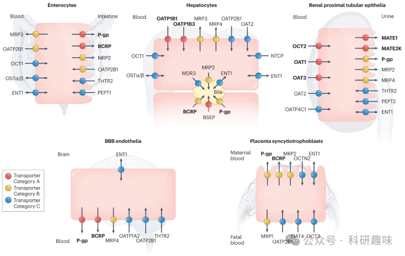
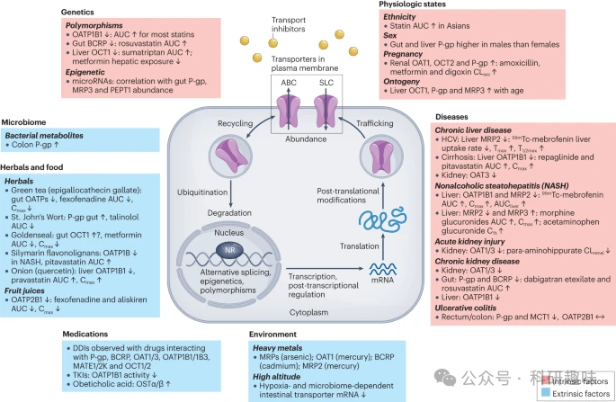
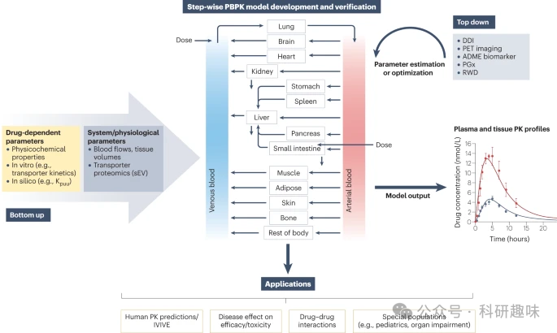
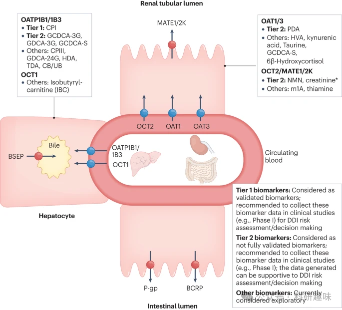
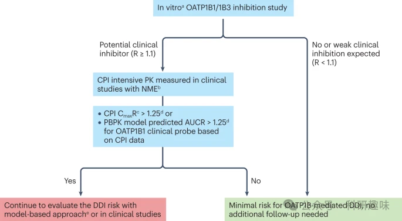
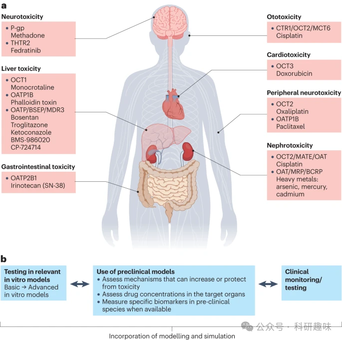
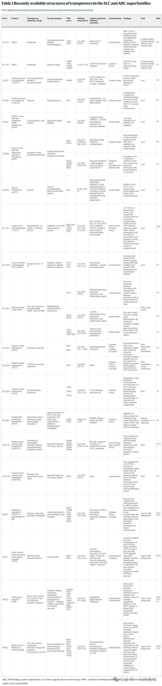

 

#  【Nat. Rev. Drug Discov. 】不可忽视的膜转运蛋白，药物运输及精准医疗的决定因素 
 

Grenemal

读完需要

50

全文字数 18000 字

**导言**

自从国际转运蛋白联盟在《自然-药物发现评论》上发表文章以来，人们对于膜转运蛋白在药物处置和反应中的作用有了更深入的理解。该联盟的初步研究确定了具有特殊临床意义的转运蛋白子集，并构建了用于预测转运蛋白活性变化的临床重要性决策树。后续的ITC出版物则重点关注了解决药物开发中与转运蛋白相关的复杂问题的方法和工具的开发，同时评估了临床前和临床数据，为转运蛋白介导的药物间相互作用（DDI）提供了最新建议。

本文将药物开发中的转运蛋白作为主要研究对象，特别是两大家族——溶质运载体（SLC）家族和ATP结合盒（ABC）家族中的转运蛋白。尽管家族众多，但本文将根据最新的文献分析，重点介绍在特定组织中参与DDI和/或药物毒性的转运蛋白子集。根据我们最近的分析结果，这些被关注的转运蛋白与ITC早期对药物开发中相关转运蛋白的评估有所不同。

本文所讨论的转运蛋白具有多特异性，能够与不同药理类别的药物发生相互作用，并与DDIs和/或毒性有关。此外，部分转运蛋白的基因多态性与药物毒性和/或无应答有关。这些信息对于深入了解药物处置、药效和安全性具有重要意义，并为未来的药物研发提供了有力的支持。

图 1：质膜上具有临床意义的吸收和流出转运蛋白。

本文首先探讨了内在因素（如遗传、种族、年龄、性别、生理状态和器官疾病）和外在因素（如饮食、草药或药物使用、微生物组和环境暴露）在调节转运蛋白功能和丰度方面的作用。然而，要充分了解这些因素对转运蛋白功能的影响机制，还需要进一步的研究。

接着，本文概述了在开发和应用建模方法以预测和了解转运蛋白在药物处置和DDI中的作用，以及预测疾病和特定人群药代动力学（PK）变化方面所取得的进展。此外，本文还讨论了自最初的ITC出版物以来，在发现和验证作为转运蛋白功能生物标志物的内源性底物方面所取得的巨大进步，以及这些底物在评估转运蛋白介导的DDI风险方面的应用。

此外，本文还探讨了药物转运蛋白如何直接或间接导致药物引起的器官毒性，并讨论了包括神经毒性和心脏毒性、胆汁淤积症以及正在发展中的重金属等环境毒素领域在内的突出例子。

在第五部分中，本文探讨了转运蛋白介导的DDI所涉及的监管问题。具体而言，对监管提交过程中的不同建模方法进行了批判性评述，同时还考虑了作为转运蛋白抑制剂的药物代谢物以及作为评估转运蛋白介导的DDI的额外临床工具的内源性生物标记物。

最后两节总结了转运蛋白研究的主要技术进展，如转运蛋白的结构测定和通过基因组编辑调节转运功能，以及转运蛋白研究的未来应用方向。此外，还考虑了从组织源性小细胞外囊泡（sEV）分析中获得的信息，以及人们对营养物/内源性转运日益增长的兴趣。

**调节转运蛋白活性的因素**

尽管目前人们普遍认识到转运蛋白在药物处置和反应中的关键作用，但对影响其在人体内的表达、丰度、定位和功能的表观遗传学、转录和翻译后调控等因素仍缺乏深入的理解。本章节将全面梳理当前关于内在和外在因素对转运蛋白丰度和功能的影响的知识，并重点强调为充分理解转运蛋白活性的调节机制所必需的研究工作。

**内在因素**

图 2：影响药物转运蛋白丰度和/或活性的内在（粉色）和外在（蓝色）因素以及可能涉及的机制，包括特定的调节途径和/或抑制作用。

**遗传学**

随着功能基因组学研究的深入，我们发现一些药物转运蛋白存在常见的功能降低多态性，这些多态性与个体间的药物反应差异具有密切关联。如果转运蛋白多态性能够引发功能变化，并在候选基因研究和全基因组关联研究中显示出显著的相关性，那么它就被认为与临床实践具有相关性。

以OATP1B1转运蛋白为例，其功能降低的变异与编码SLCO1B1蛋白的肝细胞中的药物转运能力下降有关。这导致他汀类药物的血浆暴露量（血浆浓度-时间曲线下面积AUC和/或最大血浆浓度Cmax）增加，进而可能导致肌病或横纹肌溶解症。这是遗传因素对转运蛋白功能影响的一个成熟且具有临床意义的例子。此外，肠道ABC G2变体的功能降低也会导致罗伐他汀的暴露量增加。针对SLCO1B1和ABCG2多态性患者的剂量调整建议已在CPIC PGx网站上发布。

此外，SLC22A1的功能减低变异会影响肝脏对药物的摄取，从而增加舒马曲坦、吗啡和昂丹司琼等药物底物的血浆暴露量。这些发现有助于解释某些药物间相互作用（DDI）的复杂性，并为意外的药效学效应提供依据。

除了基因多态性外，表观遗传学（如微核糖核酸）和其他调控机制对转运蛋白功能的影响也是值得进一步探究的领域。通过应用深度突变扫描和其他技术，全面了解基因变异对转运蛋白功能、膜转运和总体蛋白水平的影响，对于揭示内在和外在因素对转运蛋白介导的药物处置的影响至关重要。

**种族、性别、妊娠和发育过程**

与白人相比，在美国居住至少12个月的中国人和日本人在接触几种他汀类药物，尤其是罗伐他汀时，其暴露量相对较高。有研究指出，中国人和日本人中出现频率较高的功能降低的ABCG2变体（c.421A，p.141K）可能是导致这一现象的原因之一。然而，这并不排除其他因素的影响。例如，有研究发现，在日本参与者中，OATP1B1介导的辛伐他汀摄取存在与基因型无关的种族差异。

性别差异对药物转运蛋白的影响研究相对较少。目前已知，男性肝脏和肠道中P-gp的丰度略高于女性，这可能导致男性在服用沙奎那韦时全身暴露量较低，清除率较高。有趣的是，聚乙二醇（PEG400）会对P-gp产生与性别相关的调节作用，导致男性西咪替丁的尿排泄量增加58%，而女性则不会。此外，在SLCO1B1基因型为c.521TT的参与者中，女性的普伐他汀血浆暴露量高于男性。

妊娠对药物转运蛋白的影响不如代谢酶那样明确。尽管如此，临床研究显示妊娠期间某些药物的肾脏净分泌清除率会增加，如阿莫西林（&gt;50%）、二甲双胍（~40%）和地高辛（107%），这可能与OAT1/3、OCT2和P-gp的肾脏转运增加有关。

药物转运的成熟通常依赖于转运蛋白和器官，这可能导致药代动力学的变化，尤其是在新生儿和婴儿中。发育模式的差异可能导致特定转运或代谢途径在儿童与成人药物处置中的贡献不同。现有的临床相关转运蛋白随年龄变化的蛋白质丰度数据表明，一般来说，转运蛋白与年龄相关的变化不如代谢酶那么明显。然而，为了成功预测儿科药代动力学，仍需进一步研究转运蛋白功能的本体。

**肝病**

肝脏疾病长久以来与药物清除率降低的问题紧密相关，这主要源于肝脏中CYPs和其他参与药物代谢酶的表达减少。最近，肝脏疾病对肝脏转运蛋白的影响及其对肝胆药物处置的影响得到了深入探讨。肝脏转运蛋白的变化取决于肝病的类型和严重程度。例如，患有慢性丙型肝炎病毒和不同程度肝纤维化的患者中，由OATP1B1/1B3介导的99mTc-mebrofenin肝摄取相对于对照组受损；99mTc-mebrofenin的肝暴露增加表明MRP2功能受损。对受丙型肝炎病毒感染的人类肝脏样本进行的蛋白质组分析结果显示，MRP2、MRP4、NTCP、OATP2B1和OCT1的功能下调。

随着肝功能损害程度的增加，患者的OATP1B活性逐渐降低。根据OATP1B生物标志物共卟啉I（CPI）的血浆浓度和21种底物药物的全身暴露情况，估计严重肝功能损害（Child-Pugh C类）患者的OATP1B活性会降低约90%。以前曾总结过特定肝病患者体内OATP1B1和其他转运蛋白的蛋白质组数据。与对照组相比，慢性肝病患者（Child-Pugh B类或C类肝硬化患者）的血浆中瑞格列奈暴露量增加，这与OATP1B1、CYP2C8和CYP3A4丰度显著降低相一致。同样，与健康对照组相比，肝硬化患者（Child-Pugh B）的匹伐他汀血浆暴露量增加了约三倍。

尽管肥胖和其他与非酒精性脂肪肝相关的合并症可能会干扰药代动力学的改变，但在非肝硬化性非酒精性脂肪性肝炎（NASH）患者中，OATP1B1/1B3和MRP2功能的降低导致99mTc-mebrofenin的全身和肝脏暴露量增加，这与这些转运蛋白糖基化的降低是一致的。在非肝硬化成人和小儿NASH患者中，吗啡和对乙酰氨基酚的葡萄糖醛酸轭合物的全身浓度分别较高，这与MRP2减少和MRP3增加外流是一致的。

**肾功能损伤**

多年来，人们一直认为肾功能损害主要影响肾脏的药物清除率，这是由于肾小球的缺失以及与之相关的滤过和肾小管清除率的下降。然而，最近的研究揭示了肾脏疾病对肝脏和肾脏药物清除率的复杂影响，尤其是对药物转运蛋白的影响。

在急性肾损伤中，炎症会导致血浆中白细胞介素（如IL-1、IL-6、IL-8）、肿瘤坏死因子α（TNF-α）和干扰素γ等促炎细胞因子浓度升高。这些细胞因子会影响膜转运蛋白40，进而影响药物的转运和清除。例如，在缺血再灌注损伤诱发急性肾损伤的肾移植患者中，OAT1底物对氨基海波酸的总清除率降低了8.6倍。这与OAT1/3重新分布到近端肾小管细胞顶端质膜以及随后转运蛋白在尿液中的排泄有关。

慢性肾脏病（CKD）也会影响药物的药代动力学。经过肾脏和非肾脏消除的药物在CKD中的药代动力学可能会发生改变。例如，CKD会增加肝脏清除药物的全身暴露，如匹伐他汀（OATP1B1/1B3底物）和非索非那定（OATP1B1/1B3/2B1和P-gp底物）。此外，CKD也可能影响肠道BCRP和/或P-gp，因为在不同阶段的CKD患者口服微量达比加群酯、罗舒伐他汀和阿托伐他汀后，利福平对非结合血浆Cmax的抑制作用比对非结合AUC0-inf的抑制作用更明显。

CKD影响转运蛋白的机制尚不清楚，但可能是因为血浆中的尿毒症毒素升高抑制了转运蛋白或调节了转运蛋白的丰度。虽然在不同程度的CKD患者中未观察到全身性尿毒症毒素水平升高与OATP1B抑制之间的相关性，但几种尿毒症毒素可在体外抑制OAT1/3。

**外在因素**

转运蛋白的功能和水平还可能受到外在因素的影响，如饮食、草药或药物的使用、微生物组和环境暴露。在某些情况下，其机制已被阐明，但在另一些情况下，确切的机制仍然未知。

**微生物组**

微生物组在药物处置和药物转运蛋白调控中的作用已成为一个备受关注的研究领域。尿毒症毒素，这些由肠道微生物群产生的物质在慢性肾脏病（CKD）中大量积累，并抑制了转运蛋白的功能。此外，肠道微生物群产生的短链脂肪酸和次级胆汁酸也与P-gp的水平上调有关。有趣的是，抗生素治疗导致的小鼠微生物群紊乱会降低P-gp的水平，这一发现得到了溃疡性结肠炎患者数据的支持。这些研究结果揭示了微生物组与药物转运蛋白之间的复杂相互作用，为未来的药物研发和个性化治疗提供了新的思路。

**食物和草药**

食物-药物相互作用一直是研究的热点，尤其是涉及葡萄柚汁和CYP3A4的相互作用。然而，除了CYP3A4，转运蛋白在食物-药物相互作用中也扮演着重要角色。例如，橙汁和苹果汁通过抑制肠道OATP2B1，导致阿利吉仑的血浆暴露量减少约60%。此外，葡萄柚、苹果和橙汁也能使非索非那定的暴露量减少约77%。

然而，关于OATP2B1与其他转运蛋白或果汁在肠道DDI中的作用，其机理数据与临床观察结果存在冲突。OATP2B1在肠道中的定位尚不明确，SCLO2B的多态性影响也不一致。此外，关于肠道中是否存在OATP1A仍存在争议。

近年来，人们发现了一些可能抑制肠道转运蛋白的化合物。类黄酮被认为是果汁中可能的成分，它能抑制药物代谢酶和肠道转运蛋白。除此之外，蔓越莓汁中的阿维菌素和绿茶中的儿茶素也被证实可以抑制药物转运。

此外，许多食物中的黄酮类化合物，如洋葱中的槲皮素，可以抑制OATP1B1介导的他汀类药物转运。尽管槲皮素对普伐他汀的全身暴露量增加不大，但膳食成分与转运蛋白的相互作用仍值得进一步研究，尤其是那些作为草药补充剂使用的成分。

一些植物天然产品对P-gp的影响也有文献记载。例如，圣约翰草的有效成分金丝桃素可以诱导肠道P-gp，导致P-gp底物Talinolol的口服生物利用度降低。虽然金线莲提取物中的成分在体外是几种临床相关药物转运蛋白的强效抑制剂，但在口服药物鸡尾酒（包括呋塞米、二甲双胍和罗伐他汀）后，仅观察到二甲双胍的血浆暴露量显著减少。

总的来说，食物-药物相互作用是一个复杂的研究领域，需要进一步的研究来建立标准方法。选择合适的探针底物和剂量在鸡尾酒研究中非常重要，以便更准确地评估天然产物与药物转运蛋白之间的相互作用。

**药物**

自ITC首次发表关于转运蛋白的文章以来，我们对转运蛋白的抑制和诱导机制有了更深入的了解。对于转运蛋白（如OATP1B）的DDI风险的初步评估，通常基于重组细胞系或膜囊泡的体外底物和抑制剂研究。在研究中，竞争性抑制的存在被假定。例如，OATP1B1抑制剂（如环孢素）的预孵育已被证明可以提高其抑制效力，并被推荐用于评估OATP1B1/1B3。

此外，几种酪氨酸激酶抑制剂（TKIs）是LYN激酶的强效抑制剂，可降低OATP1B1磷酸化，这与细胞系中人OATP1B1活性降低有关。这种降低会导致罗伐他汀血浆暴露量增加，至少在小鼠中是这样的。这提示我们，TKIs的药理活性有可能部分解释这类药物引起的DDI。

同样值得注意的是，用类法尼类X受体激动剂Obeticholic acid处理夹心培养的人肝细胞，也会增加OSTα/β的蛋白水平和活性。显然，转运蛋白调控是一个新兴领域，未来仍需要做更多的研究工作。

**环境**

目前，我们对环境因素如何影响转运蛋白的机制了解仍然较为有限。环境中接触重金属（如汞、镉）可能会直接或间接抑制转运蛋白的活性，进而产生一系列不良影响。例如，这可能会增加胎儿接触其他有害BCRP底物（如黄曲霉毒素B1和杂环胺）的风险。这些因素将在后续章节“转运蛋白与毒性”中详细探讨。

**建模和模拟**

基于生理学的药代动力学（PBPK）建模已成为药物开发领域的重要转化工具，尤其适用于评估作为转运蛋白底物或抑制剂的药物。PBPK模型已被监管部门广泛认可和应用，并已拓展到多种应用领域。例如，它可以描述转运蛋白介导的药物在不同人群中的处置机制，包括健康人群和其他特殊人群。这些应用在图3和下文中进行了详细阐述。

图 3：转运蛋白介导过程的生理学药代动力学模型的开发、验证和应用。

**转运蛋白介导的药物处置/清除**

转运蛋白底物的器官清除主要受到转运蛋白-转运蛋白或转运蛋白-酶相互作用的影响；这些独立的过程由扩展清除概念所定义。PBPK模型与转运蛋白介导的体外-体内外推法（IVIVE）的整合，能够多机制地研究其相互作用，对于预测转运蛋白底物的药代动力学/DDI具有重大价值。

相对表达因子（REF）方法得益于定量蛋白质组学的进步，能够纠正体外系统与组织之间单个蛋白质水平的差异。基于IVIVE原理，机理PBPK模型已被用于预测某些药物76,77和特定疾病人群（如肥胖症78、克罗恩病79）由转运蛋白介导的处置。然而，其在疾病中的广泛应用仍待验证，同时还需要建立不同组织和疾病状态下转运蛋白水平与功能活性之间的相关性，这将增强在PBPK建模中使用转运蛋白组数据的信心。

虽然肝细胞和重组细胞系等细胞系统已经建立了几种药物转运蛋白的IVIVE，但新型复杂细胞模型如微观生理系统等的此类数据的转化能力仍有待确定。

PBPK模型在捕捉转运蛋白介导的肝脏和肾脏处置能力方面得到了广泛的描述和评估，部分原因是临床药代动力学数据可用于模型验证和/或优化转运蛋白活性/蛋白丰度。相反，IVIVE方法在口服吸收或局部组织分布等领域的评估并不广泛，主要原因是外排转运蛋白体外数据的定量解读存在局限性，以及/或用于模型验证的体内数据有限。新出现的蛋白质组或组织成像数据对于完善基于PBPK的组织暴露预测至关重要（图3）。

尽管取得了成功，但预测转运蛋白介导的药物处置和组织暴露变化的PBPK模型仍面临一些挑战：存在多个转运蛋白同源物、缺乏底物特异性、选择性抑制剂有限、难以为单个转运蛋白推导出基于蛋白质组学的标量、体外方法在描述多种转运机制/速率限制步骤方面存在局限性，以及缺乏定量蛋白质组学方法来区分活性和非活性蛋白质。需要进一步开展研究来弥补这些具体差距。

**转运蛋白介导的 DDI**

PBPK模型已被广泛用于预测转运蛋白介导的药物-药物相互作用（DDI），为剂量调整和豁免研究提供了重要依据。由于转运蛋白主要分布在肝细胞或近曲小管细胞的基底侧膜，确定单个转运蛋白的转运贡献以及被动扩散在总体摄取中的作用至关重要。这些信息在预测转运蛋白介导的DDI机理时具有关键作用。

在评估作为转运蛋白抑制剂的在研药物时，PBPK模型需要考虑多种相互作用机制。当前，由于实验方法的差异（如细胞系统、培养条件）、底物依赖性抑制等因素，体外检测的抑制相互作用参数（IC50/Ki）存在不确定性。直接使用这些参数进行预测可能导致对转运蛋白介导的DDI的预测偏小。因此，在应用模型预测特定途径的DDI之前，使用相关临床数据验证初步的“自下而上”模型至关重要。

为了验证和完善转运蛋白相互作用参数，可以利用内源性生物标记物替代传统的临床DDI数据。例如，利用生物标记物的药代动力学或肾清除率的变化来验证模型参数。最近的研究表明，利用基于CPI数据的体内Ki值建立的生物标志物PBPK模型能够成功预测多种OATP1B抑制剂在不同程度抑制下的临床DDI大小，这证明了将生物标志物信息与PBPK模型相结合在研究转运蛋白介导的DDI方面的潜力。

另外，细胞内未结合的药物浓度可能高于血浆浓度，这增加了作为肝脏CYP酶或外排转运蛋白抑制剂或诱导剂的风险。因此，在预测体内细胞内浓度时，必须首先评估体外细胞内浓度，然后通过PBPK模型进行预测。值得注意的是，为全身药代动力学研究而建立的PBPK模型可能无法准确预测肝脏暴露量，可能需要进一步通过组织暴露数据或相关药效学数据进行验证71。尽管缺乏全面的体外工具以及非结合细胞内暴露预测的挑战，但在机理建模和模拟中仍应考虑摄取转运蛋白底物的CYP调节风险。

肠道外排转运蛋白BCRP和P-gp是临床相关DDI的关键位置。已经建立了机制模型来研究体内抑制剂/诱导剂对这些机制的影响，或探讨肠道区域差异和与肇事药物的相互作用。最新研究表明，利用体外抑制数据可以充分预测BCRP介导的DDI，这意味着PBPK建模方法可以有效预测涉及肠道外排的药物开发中的DDI风险。

**疾病状态和特定人群**

近年来，PBPK建模在特定人群中的应用取得了令人瞩目的进展，涵盖了各类疾病患者（如器官受损、非酒精性脂肪性肝炎，NASH）以及儿科和妊娠人群。在某些情况下，如癌症和NASH中，转运蛋白蛋白质组数据的增加为模型开发提供了重要支持。然而，现有儿科蛋白质组数据显示，与代谢酶相比，转运蛋白的丰度随年龄的变化相对较小。值得注意的是，目前对于肝外器官转运蛋白的发育生物学仍知之甚少，这在开发儿科PBPK模型时需特别考虑。

在转运蛋白蛋白质组数据匮乏的领域，分析特定患者体内多种底物药物的临床数据对了解PBPK模型中系统参数与疾病相关的变化至关重要。例如，在慢性肾脏病（CKD）的严重阶段，除了肾小球滤过率下降外，肾脏OAT1/3转运蛋白活性也可能下降50%。此外，利用转运蛋白探针药物和/或内源性生物标记物的临床数据可建立PBPK模型，以深入了解疾病对转运蛋白功能的影响。例如，CPI和几种底物药物的PBPK建模显示，肝功能受损患者的OATP1B介导摄取量可能减少约90%，而CKD患者的摄取量可能减少约40%。这些实例突显了在将模型应用于特定患者群体之前，根据健康参与者的药代动力学和DDI数据验证模型的重要性，正如近期4-吡哆酸的研究所示。尽管取得了一定进展，但监管机构尚未完全信任特定人群中转运蛋白介导过程的前瞻性PBPK建模在探索未经验证/"假设"情景方面的作用。

**内源性生物标志物**

近年来，生物标志物的发现与验证在转运蛋白介导的药物-药物相互作用（DDI）评估中发挥了重要作用。这些内源性底物物质作为转运蛋白功能的指标，为早期药物开发中新分子实体作为转运蛋白调节剂的评估提供了可能性。然而，由于体外抑制数据的不确定性以及转运蛋白间的复杂相互作用，转运蛋白抑制的DDI定量预测具有挑战性。基于体外数据和某些假设的静态DDI预测模型可能产生假阴性或假阳性结果。

为了解决这一问题，学术界和业界正致力于发现和验证各种药物转运蛋白的生物标志物。这些标志物包括肝脏（OATP1B1、OATP1B3 和 OCT1）和肾脏转运蛋白（OAT1、OAT3、OCT2、MATE1 和 MATE2K）。2018年的一份重要出版物对这些生物标志物的特性进行了总结，并为如何识别和验证这些标志物提供了指导方法，以评估特定的DDI。

自那时以来，该领域取得了以下进展：

1.发现了更多具有高灵敏度和选择性的新型生物标志物，这些标志物针对多个肝/肾转运蛋白。

2.积累了丰富的临床数据集，进一步验证了选定生物标志物的选择性和灵敏度。

3.对转运蛋白在患病人群中的功能和DDI进行了评估，特别是在器官受损患者中。

4.开发了生物标记物建模方法，以支持其鉴定和定量转换生物标记物数据，从而预测转运蛋白介导的DDI。

根据对各种转运蛋白生物标志物体内动力学特性的深入了解，ITC建议在临床I期研究中监测几种肝脏和肾脏转运蛋白的生物标志物。图4展示了肝脏和肾脏转运蛋白的内源性生物标记物的分类建议，以及在药物开发中应用这些标记物以改进DDI风险评估和管理策略的建议。该分类基于生物标志物的选择性、敏感性和可预测性。

特别值得一提的是CPI（1级生物标志物），由于其出色的选择性、灵敏度和预测性能，其数据可用于OATP1B的DDI风险评估。在早期临床研究中，建议收集GCDCA-3G（OATP1B1）、GDCA-3G（OATP1B1）、GCDCA-S（OATP1B）、4-吡哆酸（PDA）（OAT1/3）、N1-甲基烟酰胺（NMN）和肌酐（OCT2和MATE1/2K）作为二级生物标记物的数据。

最近的研究表明，这些二级生物标记物在不同程度上与转运蛋白的DDI风险相关。然而，需要仔细考虑药物对这些生物标志物的影响，因为它们尚未得到充分验证。与CPI不同，所有胆汁酸共轭物的基线昼夜变化较大，可能受到食物的潜在影响，这需要在数据解释/研究设计中加以考虑。

生物标志物的另一个重要用途是证明没有或只有有限的转运蛋白介导的DDI风险（图5中的决策树），从而无需进行单独的专门临床研究。目前，CPI已被认为是为此目的进行了验证的唯一一级生物标志物（补充表S1a）。随着我们对转运蛋白介导的DDI的深入了解，以及新生物标志物的发现与验证，未来的药物开发将更加高效和安全。

图 4：肝脏和肾脏转运蛋白的内源性生物标记物分类以及国际转运蛋白联盟关于将其应用于药物开发的建议。

图 5：有机阴离子转运多肽（OATP1B）介导的共卟啉 I 药物相互作用风险评估决策树。

此外，临床开发方面有几个关键的考量因素（如图5中的图例所示）。获取生物标记物动力学数据是临床研究设计中的重要环节。例如，如果在初步人体试验中监测生物标记物，且参与临床试验的人数有限，那么原始观测数据可能不足以检测到微弱的转运蛋白抑制作用。在这种情况下，我们可以利用群体PK建模等基于模型的方法，从更广泛的剂量范围内获取数据。

为了确保生物标记物观察结果的可靠性，我们不仅要关注相互作用程度的点估计值，还要提供置信区间。这个区间可以是原始观测数据的统计摘要，也可以是基于模型的方法。将这个置信区间与预期的临床研究结果进行比较是至关重要的。所需的置信度会根据临床开发的阶段而有所不同——在初步人体试验中，相对有限的数据可能足以作为二期或三期临床研究的纳入/排除标准。在进行确证性研究的同时，我们可以逐步积累更多的数据。

生物标记物的最终应用是根据其动力学特性定量预测DDI的程度，并为联合用药提供依据。这需要基于模型的方法，如建模与模拟部分所述，图3和图5提供了相关的实例说明。

**转运蛋白和毒性**

考虑到已有证据显示药物转运蛋白能够调节未结合药物的全身和局部浓度，药物转运蛋白直接或间接导致药物引起的器官毒性也就不足为奇了。在过去的十年里，有多篇论文研究了转运蛋白在药物毒性中的作用。此外，最近的研究进一步揭示，某些转运蛋白的组织特异性表达可能导致局部药物蓄积和DDI，而转运蛋白的功能性改变则直接影响个体对药物诱导的器官损伤的易感性。

本节将重点介绍转运蛋白介导的药物毒性的典型实例（图6a）、引导这些毒性效应的新方法以及可用的风险评估工具。通过深入了解这些关键概念，我们将更好地理解药物转运蛋白在药物毒性和DDI中的作用，并为其风险评估和管理提供更准确的指导。

图 6：药物引起的器官损伤。

尽管SLC转运蛋白在人体必需的微量营养素和宏量营养素的吸收和处置方面发挥着核心作用，但它们也可能介导药物和其他异生物的吸收，从而在这些分子的作用下发挥出意想不到的效果，有时甚至是有害的。例如，对神经元和心脏的伤害分别导致外周神经毒性和心脏毒性，这在癌症治疗药物中尤为常见。虽然人们对这些副作用的机理仍不完全清楚，但多项研究表明，许多细胞毒性抗癌药物会在健康细胞（如外周神经元和心肌细胞）中广泛蓄积，而这一过程至少部分导致了对这些细胞的选择性毒性。

有一些研究已经证实，在健康细胞中广泛蓄积的某些SLCs可以转运多种临床相关的异种生物，包括奥沙利铂和多柔比星等抗癌药物。尽管在很大程度上仍未进行探索，但一种可提供神经保护或心脏保护的策略是用药物有意抑制这种转运过程，以限制药物进入损伤部位，从而防止药物蓄积导致临床毒性表现。

在SLCs中，OCTs作为神经元和心脏摄取药物的介质的重要性已经得到了相当充分的证实。这项集体工作已经证明了OCT2对奥沙利铂的转运和OCT3对多柔比星的转运的贡献。同样，某些OATPs也参与了啮齿类动物体内神经毒性化疗药物紫杉醇的转运，其转运机制对TKI尼罗替尼的药理抑制敏感。相比之下，SLC抑制剂可直接破坏细胞对营养物质的吸收和利用，从而导致一系列毒性效应。费拉替尼与韦尼克脑病有关，据认为这是因为它能够抑制硫胺素转运蛋白2（THTR2）介导的肠道摄取，并有可能抑制其进入大脑。

通过基因改变或抑制降低ABC转运蛋白的功能会产生毒性后果。BSEP和MDR3的基因多态性与被称为进行性家族性肝内胆汁淤积症（PFIC）2型和3型的胆汁淤积性肝病有关，其中胆汁淤积性损伤是由于胆汁外流减少导致细胞内胆汁酸浓度增加，以及胆汁磷脂从肝细胞转运到胆汁的能力降低导致游离胆汁酸增加。异种生物对BSEP或MDR3的抑制与胆汁淤积和药物性肝损伤有关。MDR3的抑制也与胆管增生和胆囊炎有关。血脑屏障中的另一种ABC转运蛋白P-gp可调节用于治疗阿片类药物成瘾的美沙酮的神经毒性。使用美沙酮过量致死后，与表达野生型转运蛋白的患者相比，在表达与功能降低有关的P-gp多态变体的患者中检测到较高的脑血比。

重金属（包括饮用水污染物砷和无处不在的环境污染物汞）的摄入和排出转运蛋白也参与细胞暴露，导致对人类健康的不利影响。人类主要通过饮食、吸烟或工业用途接触重金属镉。镉通过BCRP和MRP2排出体外，但排出效率不如吸收/螯合效率高，从而对肾、肝、骨、肺和心血管系统造成不良健康影响。

最近，人们研究了针对转运途径的治疗方法，以减少毒性。虽然还需要进一步研究才能确定这种方法在临床上的可行性，但也存在一些注意事项，包括需要特定于转运途径的转运蛋白抑制剂。由于缺乏选择性底物/抑制剂配对、稳健的体外和体内测试系统、物种差异大以及缺乏明确的体外到体内的转化，从机理上将转运蛋白与潜在毒性联系起来的研究具有挑战性。例如，虽然携带BSEP基因突变的个体会出现与PFIC2相关的胆汁淤积性损伤，但Bsep基因敲除的啮齿类动物可以生育和存活，并且只出现轻微的非进行性肝内胆汁淤积。因此，越来越需要能再现体内功能的更全面、更贴近生理的体外系统（如三维培养、原代细胞共培养、微生理系统）。然而，针对转运蛋白功能的先进细胞系统的表征和优化仍处于早期阶段。

需要将体外测试系统、动物安全性数据和数学建模方法结合起来，以降低风险并预测转运蛋白诱发器官毒性的临床结果。制药行业已越来越多地采用体外BSEP抑制性评估在研药物。然而，仅凭体外BSEP IC50无法准确预测临床药物诱导的肝损伤。在某些情况下，除了BSEP抑制外，还要研究与胆汁酸在肝细胞中蓄积有关的其他机制。通过采用定义明确的测试策略，确保实施适当的体外/体内测试模型，可以及早终止与毒性结果相关的候选药物，并推进最有可能成功的安全分子。

**监管科学考虑因素**

药物-药物相互作用（DDIs）的评估在药物开发过程中占据着至关重要的地位。这些相互作用可能涉及对多种转运蛋白的调节，进而影响药物在全身循环和/或在特定组织中的浓度，从而对药物的疗效和/或安全性产生显著影响。在此背景下，我们将深入探讨监管层面的考量因素，并特别关注由转运蛋白介导的药物-药物相互作用。

**抑制剂导致的转运蛋白介导的 DDI**

监管机构在药物开发过程中强调了对药物-药物相互作用（DDIs）评估的重要性。这些相互作用可能涉及对多种转运蛋白的调节，进而影响药物在全身循环和/或在特定组织中的浓度，从而对药物的疗效和/或安全性产生显著影响。为了更好地理解和预测这些相互作用，监管指导文件建议评估在研药物对几种关键转运蛋白的抑制潜力，包括BCRP、MATE1、MATE2K、OAT1、OAT3、OATP1B1、OATP1B3、OCT2和P-gp等。

初步评估药物在体内抑制转运蛋白的可能性时，通常采用基本模型进行定性评估。如果这些基本模型不能排除药物相互作用的可能性，则需要进一步通过临床DDI研究或使用更复杂的模型（如PBPK模型）进行定量预测。在选择临界值时，应尽量减少假阴性预测，但不可避免地会导致假阳性预测。例如，对于P-gp和BCRP抑制剂的肠腔浓度，使用剂量除以250毫升的方法进行估算可能会高估溶解度差的药物的抑制剂浓度，从而导致假阳性预测。对于OATP1B1/3抑制的评估，各种决策标准的预测性能进行了评估，结果显示阳性预测误差值在27%至43%之间。此外，这些预测转运蛋白介导的DDI的决策框架提供的是定性（是/否）预测，主要是根据体外抑制数据排除药物在体内抑制转运蛋白的可能性，并不对DDI的程度进行定量预测。

静态模型和PBPK模型已被用于对转运蛋白介导的DDI进行定量预测。虽然与PBPK模型相比，静态模型所需的资源和数据较少，但它们无法捕捉与相互作用相关位点的肇事者和底物的动态轮廓，这对评估转运蛋白介导的DDIs是一个重大限制。相比之下，PBPK模型具有更广泛的功能，例如模拟药理学和毒理学相关部位的全身和组织浓度-时间曲线，这对于研究涉及多个转运蛋白和/或转运蛋白-酶相互作用的复杂DDI情景至关重要。

除了完善抑制剂的PBPK模型外，还应建立转运蛋白底物（受害药物）的模型，并通过适当的临床研究加以验证。除了体外方法外，该值还可从使用对单个转运蛋白具有相对特异性的强抑制剂进行的底物临床DDI研究中得出。然而，转运蛋白抑制剂通常是非选择性的，会影响多个转运蛋白和/或酶。同样具有挑战性的是，转运蛋白底物通常与其他转运蛋白/酶具有相同的底物特异性。因此，分解单个转运蛋白对观察到的DDI效应的贡献并得出ft并不简单。

药物转运蛋白的内源性生物标记物作为支持评估和预测转运蛋白介导的体内DDIs的一种可能的额外临床工具，受到了广泛关注。近年来，在确定OATP1B1/3和OAT1/3的各种生物标记物方面取得了重大进展。目前，对几种生物标志物的评估已被纳入开发流程。其中，CPI是迄今为止研究最广泛的生物标记物之一，它可以作为评估药物摄取和排泄功能的潜在工具。虽然这些生物标记物为临床提供了有价值的信息，但仍需进一步研究以验证其在预测DDIs中的准确性和可靠性。

**作为转运蛋白抑制剂的药物代谢物**

在评估药物-药物相互作用（DDIs）时，仅通过体外方法将母体药物作为抑制剂可能导致对药物代谢物的忽视。事实上，药物的代谢物也可能导致DDI，从而产生意想不到的相互作用。例如，吉非罗齐葡萄糖醛酸苷对吉非罗齐的OATP1B抑制作用具有显著贡献。另一个例子是Norverapamil，其浓度与维拉帕米相当，且是比维拉帕米更强效的P-gp抑制剂。然而，与母药相比，关于代谢物的数据或具有决策标准的预测模型相对较少。

评估母药的一般原则和策略可以酌情应用于代谢物。ICH M12 DDI指南草案对转运蛋白的评估建议与CYP相同。从实用角度出发，该指南建议进行体外实验，以评估AUCmetabolite/AUCparent ≥ 25%的代谢物的转运蛋白抑制潜力，这些代谢物也是主要代谢物（即根据质量平衡研究的放射性数据，至少占血液循环中药物相关物质的10%）。这种方法有助于生成更多数据以填补知识空白，并在获得更多数据后重新审议该建议。

**诱导引起的转运蛋白介导的 DDI**

与CYP酶的诱导相比，关于转运蛋白诱导的研究相对较少。P-gp是最为研究的转运蛋白之一，可以被核受体孕烷X受体（PXR）的激活剂诱导。有趣的是，PXR也能调节CYP3A4的表达。尽管P-gp的诱导性似乎低于CYP3A4，但ICH M12 DDI指南草案考虑了多种因素，包括研究药物对CYP3A的诱导程度，以提出是否需要对P-gp底物进行临床DDI研究的建议。

然而，关于OATP1B的诱导作用，目前仍缺乏共识。解释临床转运蛋白介导的DDI数据所面临的一个挑战是，底物通常是非特异性的，其他转运蛋白或酶的潜在参与可能会混淆临床数据的解释。因此，有必要进一步研究OATP1B1/3诱导的临床意义和机制，以更好地理解其在药物相互作用中的作用。

**新兴技术和进步**

在过去的十年里，新技术的应用极大地推动了SLC和ABC转运蛋白的基础研究、转化研究和临床研究，这一点在ITC最近的一份出版物中得到了详尽的阐述。在此背景下，我们将聚焦于两个之前较少涉及的主要领域：一是通过低温电子显微镜（cryo-EM）获得的新结构，尤其是配体结合结构；二是通过CRISPR-Cas9对转运蛋白功能的调控。

转运蛋白在底物识别、结合、转运和释放等复杂的分子事件中发挥着关键作用。此外，许多转运蛋白利用离子梯度结合底物并逆浓度梯度转运。实验结构、功能研究和分子/计算模拟的进展，帮助我们深入理解这些复杂的机制。
              
表 1 SLC 和 ABC 家族转运蛋白的最新结构
**SLC 和 ABC 转运蛋白的新结构和配体结合结构**

在过去的几年里，我们在确定SLC和ABC家族转运蛋白的蛋白质结构方面取得了显著的进步。目前，人类ABC家族中约有50%的转运蛋白的结构信息已经获得，这为我们深入了解这一重要家族中许多成员的底物结合和转运机制提供了新的视角。相比之下，尽管人类SLC家族也取得了一些进展，但仅有约15%的成员拥有结构数据。

自2022年ITC综述以来，已有一些关于SLC和ABC转运蛋白的新结构发表（表1）。其中，一些与药物开发特别相关的结构包括在甲氨蝶呤处置中发挥作用的还原叶酸载体SLC19A1；有机阴离子转运多肽SLCO1B1和SLCO1B3；以及有机阳离子转运蛋白SLC22A1、SLC22A2和SLC22A163、164等。这些转运蛋白在多种药物和内源性分子的处置中发挥着关键作用。

通过与作为抑制剂、底物或诱导剂的配体结合后的低温电子显微镜结构，我们能够确定与配体结合的精确残基，进一步了解转运蛋白功能的结构决定因素（见表1中的示例）。这些信息对于设计和开发针对转运蛋白的药物至关重要。随着更多可用结构的出现、AlphaFold2的全新预测和/或比较建模的发展，将为转运蛋白的药物设计和配体发现提供更合理的依据。

**通过 CRISPR-Cas9 基因组编辑调节转运蛋白功能**

CRISPR-Cas9及其相关技术的进步为基因组编辑带来了革命性的变革，无需先前技术中耗时且昂贵的蛋白质工程步骤，即可实现精确的基因组编辑。这些技术突破为开发更精确的体外和体内转运蛋白研究工具，以及采用全基因组方法解析转运机制奠定了坚实基础。

为了更好地研究转运蛋白，研究人员经常使用过表达异源转运蛋白的细胞系。然而，由于宿主细胞系中内源性转运蛋白的背景表达，对转运机制的描述变得复杂，且针对单个转运蛋白的选择性抑制剂也较为稀缺。CRISPR-Cas9基因组编辑技术的出现为解决这些问题提供了有力支持。例如，在常用的宿主犬Mdr1/P-gp（Abcb1）细胞中，通过应用CRISPR-Cas9技术成功消减了犬Mdr1/P-gp（Abcb1）的表达和功能，这种细胞常用于评估人类ABC外排转运蛋白，如中枢神经系统暴露的评估。另外，转染人P-gp（ABCB1）或BCRP（ABCG2）的犬基因敲除细胞改善了底物外流的分类，调和了早期检测方法间的差异，并证明了底物外流的物种差异。类似地，在常用的肠道药物吸收模型Caco-2中，通过选择性敲除P-gp、BCRP或MRP2，可在更接近活体的复杂系统中解析药物外流途径，其中多个转运蛋白共同影响药物渗透性。此外，通过靶向CRISPR-Cas9方法敲除NCI-H441细胞中的MRP1（ABCC1），发现5(6)-羧基荧光素是研究MRP1功能活性的合适探针。CRISPR-Cas9系统还被用于在人类诱导多能干细胞系中敲除转运蛋白，以验证全基因组关联研究的结果。

几十年来，小鼠基因剔除模型在评估各种转运蛋白的体内作用方面发挥了重要作用。然而，由于其他转运或代谢途径可能发生代偿性变化，解读数据时必须谨慎。最初，Zn-finger技术以及最近的CRISPR-Cas9技术已被用于其他物种中建立类似的模型，这些物种在非临床药代动力学和安全性研究中常用。例如，大鼠Mdr1a/b（Abcb1a/b）、Oatp1b2（Slco1b2）或Oat1/3组合（Slc22a6/Slc22a8）的CRISPR-Cas9基因敲除模型已被报道，分别表明模型底物地高辛、匹伐他汀和呋塞米的全身暴露发生了改变。CRISPR-Cas9已成为产生基因敲除小鼠用于临床前药物评估的重要工具。

使用CRISPR进行选择性编辑相对容易，只需改变引导RNA，就能使用相同的设置针对多个基因组区域进行编辑，这大大简化了对涉及特定表型基因的全基因组和重点筛选。例如，在单倍体HAP1细胞中采用以SLC为重点的CRISPR筛选方法，确定了以前未知的细胞毒性药物转运蛋白相互作用。在测试的60种化合物中，有近80%证明了一种或多种SLC基因的功能依赖性。类似的方法还用于鉴定OATP1A2和OATP1B3为多柔比星心脏毒性的介质以及ENT3与雷米替韦细胞毒性的关联。另一种方法是使用CRISPR-Cas9来引入受控转录激活，从而发现了SLC转运蛋白，这些转运蛋白可使细胞在缺乏必需营养物质的情况下存活。

**未来方向**

**了解转运蛋白在全身药代动力学之外的作用**

到目前为止，我们已通过药物相互作用（DDIs）和功能性药物基因变异确定了许多转运蛋白的临床相关性，这些变化导致了药物全身药代动力学的变化（如图1所示）。因此，药物研发主要关注以下三个方面：（1）肝脏和肾脏摄取转运蛋白，如OATPs、OATs和OCTs；（2）肠道外排转运蛋白，如P-gp、BCRP；（3）MATEs的肾脏排泄。

虽然已经讨论了清除器官中的外排转运蛋白（如P-gp、BCRP）的作用，但为药物研发提供实际建议仍然具有挑战性。抑制这些外排机制可能会导致药物在清除器官中蓄积并产生毒性，但对全身药代动力学的影响可能并不显著。因此，建模和模拟方法在预测P-gp或BCRP底物/抑制剂药物的细胞内浓度，以及确定其与全身或药效学效应之间的关系方面发挥了重要作用（另见“建模和模拟”部分）。

临床研究的目的是进一步验证这些模型，以便用于预测未经验证的情况或难以进行临床研究的情境。最近的一些药物相互作用研究采用了鸡尾酒临床探针药物（治疗或微量剂量水平）或监测转运蛋白生物标志物与临床探针的方法，以从机理上了解涉及多个转运蛋白和酶的复杂药物相互作用。

为了更全面地了解转运蛋白对药物安全性和有效性的影响，未来的一个重要方向是扩大药物相互作用研究的设计范围，而不仅仅局限于系统药代动力学和暴露比终点的变化。根据涉及的具体转运途径，这种方法的复杂性可能会有所不同。通过更深入地了解转运蛋白在药物处置中的作用，我们可以更好地预测和管理药物相互作用，从而提高药物的疗效并降低潜在的毒性风险。

**肾脏 DDI 和毒性中的转运蛋白**

除了观察全身药代动力学数据，我们还可以通过分析尿液排泄数据来评估肾脏转运蛋白介导的药物-药物相互作用（DDI）。在临床研究中，按照预定的计划进行尿液的定量收集是推动药物开发模式转变的关键要素。同时采集全身和尿液药代动力学数据有助于确定肾近曲小管的顶端排泄是否受到干扰，而根据全身药代动力学数据，这种情况可能并不总是很明显。此外，了解尿液药物回收率的变化有助于评估口服生物利用度是否受到影响186。如果没有成像数据或生物反应（如毒性）或生物标志物水平的变化作为补充，则很难直接评估肾脏排泄受损时肾脏药物暴露量可能增加的情况。最后，获得全身和尿液药代动力学数据对于验证或完善肾脏药物暴露的生理药代动力学（PBPK）模型模拟至关重要。通过这种方式，我们可以更准确地预测不同个体内的药物暴露情况，从而为临床决策提供更有力的支持。

**肝脏 DDI 和毒性中的转运蛋白**

评估转运蛋白介导的药物-药物相互作用（DDI）对肝脏排泄影响的临床研究更具挑战性，因为胆汁不像尿液那样容易获取。尽管已经开展了包括收集人体胆汁的研究，但这些方法在药物开发中的应用仍然较少，主要是因为从后勤和实际操作角度来看，这些研究并不容易开展。

不过，成像技术已被用于显示当胆汁排泄受损时，肝脏药物暴露可能会显著增加。在预计转运蛋白介导的胆汁排泄会受到干扰的情况下，如果可行，可以考虑将药物组织分布的临床成像纳入临床DDI研究。此外，对于以肝脏为作用部位且药效学或毒效学生物标志物反应迅速的药物，当肝脏药物暴露预计会受到干扰时，也应考虑采用这些替代方法。例如，二甲双胍就是一个很好的例子13。

遗憾的是，观察他汀类药物药效学改变所需的时间（&gt;2 周）对于药物开发中的DDI研究来说并不现实。然而，对于其他以肝脏为作用部位且药效学或毒效学生物标志物反应迅速的药物来说，当肝脏药物暴露预计会受到干扰时，应考虑采用这些替代方法。通过这些方法，我们可以更深入地了解药物在肝脏中的处置情况，从而为临床决策提供更有力的支持。

**营养缺乏症中的转运蛋白**

除了药物-药物相互作用（DDIs）中涉及的转运途径外，ITC 还讨论了营养物/内生物转运抑制作为药物毒性的一种假定机制。然而，这些建议仅限于对临床安全性观察的回顾性理解，而不是在药物开发过程中对这些转运蛋白进行前瞻性测试。

要理解药物对营养/内源性生物平衡的扰动所面临的挑战在于所涉及的多种转运和代谢机制以及生理因素（如饮食、疾病）的复杂性。在将 BSEP 数据解释为肝毒性警报时，需要考虑到其他途径，这就凸显了这一挑战。

随着药物开发领域的文化转变，药物毒性的机理越来越受到关注，而不是在不了解潜在机理的情况下报告高水平的研究结果。例如，THTR2 抑制被认为是导致非瑞替尼（fedratinib）诱发脑病的一个因素，而叶酸转运途径（PCFT、RFC、FRα）的调节则是针对整个 HIV 整合酶抑制剂类药物进行的研究。

阐明药物毒性机理的研究最终可能为前瞻性筛选转运蛋白作为毒性警报提供证据，如上文讨论的 BSEP。通过深入了解药物对转运蛋白的作用机理，我们可以更好地预测和预防潜在的药物毒性，从而为患者提供更安全的治疗方案。

**作为药物靶点的转运蛋白**

人们正越来越多地将转运蛋白作为治疗疾病的药物靶点开展研究。例如，SGLT2抑制剂（如canagliflozin、dapagliflozin、empagliflozin）已被批准为治疗2型糖尿病的新型降糖化合物。目前正在开发URAT1抑制剂，用于治疗高尿酸血症和痛风。此外，一种以ASBT（SLC10A2）为靶点的药物已获准用于治疗胆汁淤积性疾病，这标志着药物开发在针对转运蛋白靶点方面取得了重要进展。

未来药物开发中的转运蛋白研究将进一步增进我们对转运蛋白的了解，从其对药代动力学的影响到药物毒性的作用机制，以及生物标志物的应用等方面进行深入研究。此外，确定转运蛋白作为治疗常见病和罕见病的新靶点，并阐明其在体内平衡中的重要角色，将有助于推动药物开发的创新与发展。

**生物标记物和体内转运蛋白活性测量方法**

预计将结合生理药代动力学（PBPK）建模，对经过验证的1级和2级转运蛋白生物标记物进行监测，以完善设计并指导决策，确定专门的临床转运蛋白介导的药物-药物相互作用（DDI）研究的优先级/必要性（图4-5）。尽管在确定肝脏和肾脏转运蛋白的多种潜在生物标志物方面取得了重大进展（图4），但肠外流转运蛋白P-gp还没有生物标志物，BCRP的可用数据也很有限。

除了降低转运蛋白介导的DDI风险外，内源性生物标记物作为评估疾病和特定人群中转运蛋白功能调节的工具也具有巨大潜力。目前报道的数据主要集中在CPI，以及使用该生物标记物研究轻度至重度肝肾功能损害、高脂血症儿童、类风湿性关节炎和某些癌症人群中OATP1B活性的变化。然而，在其他患者群体中CPI的参考值以及其他转运蛋白（如肾脏）生物标志物数据的可用性方面仍存在知识空白。

解释数据时需要考虑的重要因素是，除了转运蛋白活性的潜在调节外，疾病也可能改变生物标志物的合成率。最近对严重肾功能损害的CPI数据进行的建模说明了与疾病相关的CPI合成减少和通过OATP1B1的主动吸收，以及肾脏消除和蛋白结合之间复杂的相互作用。

新出现的数据表明，组织来源的血浆sEVs可作为“液体活检”，是一种无创检测技术，用于检测吸收、分布、代谢和/或排泄相关器官中的药物代谢酶(DME)和转运蛋白概况。然而，由于asialoglycoprotein受体（ASGPR）的独特表达，目前只有肝脏特异性sEVs被鉴定出来，而其他器官的类似标记物仍有待鉴定/验证。这种方法尤其适用于无法获得组织样本和/或样本有限的疾病和特定人群。例如，从29名肝癌患者的血液中分离血浆外泌体时，观察到归一化血浆外泌体mRNA表达与匹配肝组织中OATP1B1、MRP2、P-gp、BCRP和12种DMEs蛋白水平之间存在良好的相关性。肝脏特异性sEVs中OATP1B和CYP3A蛋白水平的定量分析证实，多剂量利福平（众所周知的CYP3A和P-gp诱导剂）诱导了CYP3A4，但没有诱导肝脏OATP1B1和OATP1B3。

sEVs很有希望成为有价值的下一代工具，为不同疾病和生理状态下DME和转运蛋白水平的变化提供独特而丰富的信息。虽然sEV具有独特的优势，如微创性、临床样本的常规可及性和测量的定量性，但sEV只能提供蛋白质水平的信息，与转运蛋白功能相关的数据有限。对同一人的血浆样本进行液体活检（转运蛋白水平）与生物标记物数据（转运蛋白活性）的比较，将有助于确定转运蛋白丰度与功能之间的关系是否以及在多大程度上因基因多态性或疾病而发生变化。

**结论**

在过去的二十年中，我们对于膜转运蛋白在药物安全性和有效性中的作用有了更深入的了解，并将这些信息有效地转化为对药物研发人员和临床医生的实用指导，取得了显著的进步。学术界、监管部门和制药行业的专家们紧密合作，在ITC的推动下，不断推动转运蛋白科学的发展。然而，正如本文所强调的，要充分利用转运蛋白知识来优化个体患者的药物治疗，仍有许多关键问题有待解答。

随着单细胞RNA测序、CRISPR-Cas9基因组编辑、低温电子显微镜、先进的omics功能、基于外泌体的液体活检、人工智能、机器学习、真实世界数据以及增强的建模和模拟工具等技术的快速发展，转运蛋白科学将迎来更多的突破和知识填补。改进的生理学相关体外模型、研究内在和外在因素对转运蛋白功能影响的最先进工具、新型内源性生物标记物的鉴定以及PBPK和定量系统药理学/毒理学建模和模拟的进步，将有助于解决目前转运蛋白数据解读的复杂性。

转运蛋白与二甲双胍一样，在药物处置方面具有至关重要的地位。在某些情况下，转运蛋白是选择合适药物以及优化药物剂量方案的关键因素，以提高疗效和减少毒性。事实上，我们正处于转运蛋白研究的激动人心时代，随着研究的飞速发展，转运蛋白有望为实现精准医疗的承诺提供有力支持。

Galetin, A., Brouwer, K.L.R., Tweedie, D. et al. Membrane transporters in drug development and as determinants of precision medicine. Nat Rev Drug Discov (2024). https://doi.org/10.1038/s41573-023-00877-1

**关注并回复文章DOI获取全文：**

10.1038/s41573-023-00877-1

**点击蓝字 关注我们**

预览时标签不可点

素材来源官方媒体/网络新闻

 [阅读原文](javascript:;) 

  继续滑动看下一个 

 轻触阅读原文 

    

