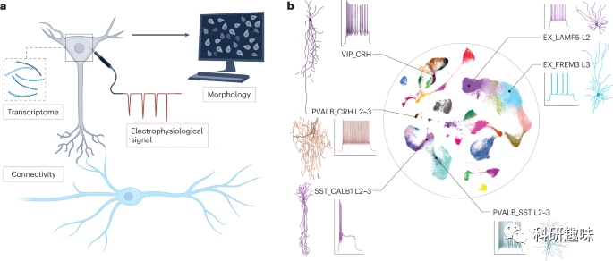
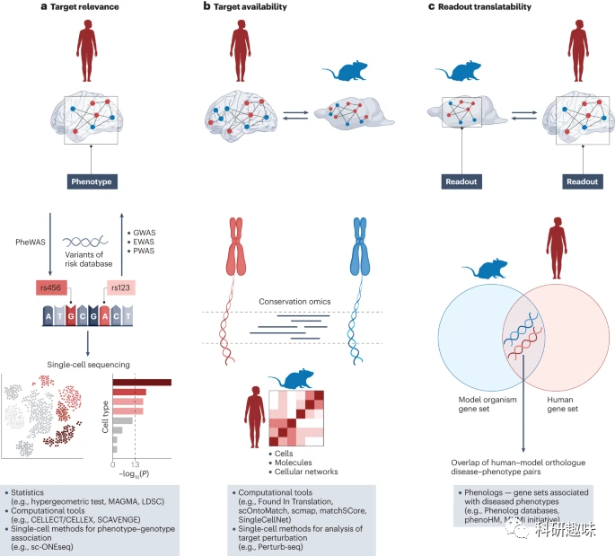
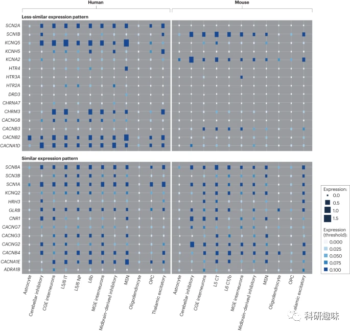
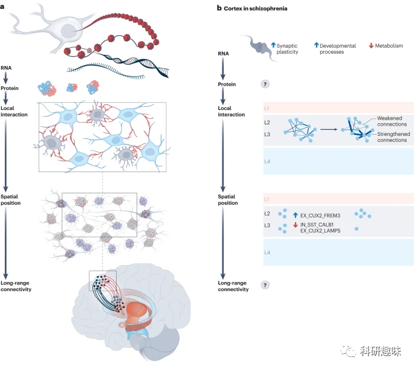

 

#  【Nat. Rev. Drug Discov. 】怎么提升药物的开发效率？ 
 

Grenemal

读完需要

20

全文字数 6000 字

**文章信息**

Khodosevich, K.; Dragicevic, K.; Howes, O. Drug Targeting in Psychiatric Disorders — How to Overcome the Loss in Translation? Nat Rev Drug Discov 2023. https://doi.org/10.1038/s41573-023-00847-7.

***目录***

1. **Abstract**
2. **Introduction**
3. **Target relevance**
4. **Target availability**
    1. **Model selection based on target availability**
    2. **Additional considerations**
5. **Readout translatability**
6. **Example implementation of the framework**
7. **Additional considerations and potential limitations**
8. **Conclusions**

**Abstract**

尽管近几十年在精神科药物的开发上进行了大量投入和努力，但多数临床试验仍以失败告终。目前，临床医生仍在使用多年前的药物进行治疗。药物研发遭遇的困境有多个原因，其中一个关键的生物学因素是临床前模型中的药物靶点与患者体内相应的靶点存在差异。鉴于单细胞分析技术的进步，研究者提出了一个新的框架，结合单细胞和空间组学研究的知识，旨在在临床前研究阶段对模型进行评估，预期能增强其转化预测能力。研究者认为，这些策略有望提高药物评估的准确性，减少后续临床试验的失败，从而更好地促进精神科药物的研发。

**Introduction**

精神病学的初代药物基于临床观察而发现，并经过病人实证研究后推出。随着对这些药物作用机理的深入了解，第二代药物逐渐出现，这些药物在保持初代效果的同时进行了改进，如减少副作用。近期的研究趋势是寻找具有新或更优靶点特异性的候选药物，这些靶点的发现多基于人类遗传学和组学研究。

尽管某些候选药物在动物模型中显示出调节精神障碍的效果，但它们在临床试验中未能展现出期望的疗效。这也导致了大多数新型精神疾病药物的研发中止。值得注意的是，近十年来，精神病学仅有12种新药获得了美国食品与药物管理局的批准，而神经病学领域则有50种，其中仅两种属于新型药物。

多种原因解释了精神科药物研发的失败，包括临床试验的挑战、生物异质性、试验程序的差异以及对转化生物机制的不足了解。尽管存在这些问题，但研究者认为，药物靶点选择和验证的低效率是主要生物学原因。在临床前模型中，药物靶点与患者体内相应的靶点存在显著差异，这阻碍了研究结果的有效转化。

为了解决这些问题，研究者建议深入研究脑细胞的多样性，确定其与功能的关联，并开发更为准确的疾病模型。近期的高分辨率技术进步显示，大脑的复杂性远超过以往预期。在人类大脑皮层，如颞叶皮层，已经描述了70多种神经元亚型。而在啮齿动物中，如小鼠，这一数字更高，达到近400种。细胞的多样性不仅仅限于转录组，还包括形态学、电生理学和连接性等其他特征，使得研究者对大脑的理解更加复杂。

图 1：人脑和精神疾病中细胞亚型的多样性。

大脑细胞的多样性对特定药物的治疗效果和副作用有深远的影响。过去的研究可能仅考虑了影响“大脑”的药物，例如影响某种受体的激动剂或拮抗剂。但现在，研究者了解到大脑内有多种细胞亚型，如某种血清素受体的表达就涉及多种不同的细胞亚型。这些细胞亚型分布于大脑的不同区域，具有独特的特性和连接方式，参与各种大脑功能。考虑到这种细胞多样性，研究者需要重新思考药物如何影响大脑功能以及研究者的药物靶点选择策略。本文旨在提供一个三步策略：首先，在临床前模型中选择效果与实际患者相似的靶点；其次，在这些模型中筛选适合调节的分子；最后，将合适的候选药物推进到临床试验。

首先，研究者需基于多种人类数据，如遗传、成像、高分辨率组学和空间数据，深入了解靶点与人类疾病之间的联系。虽然基础生物学研究在模型中的角色重要，但模型的内容和筛选方式必须由人类数据来指导，以确保模型的准确性和相关性。

其次，一旦靶点的相关性确定，研究者应从分子、细胞和回路的角度评估其在不同环境下的可用性，特别是在患者和潜在模型的感兴趣的脑区、脑回路和细胞类型中的差异。这些差异性数据将有助于研究者选择最合适的模型进行靶点调节剂的筛选。

第三，模型中评估的靶点调节效果，如神经活动的脑成像评估，应能够转化为人类研究。简而言之，模型的读数必须与人类疾病相关。如果模型中对靶点的调节可以预测人体中的效应，并有可能产生治疗效果，那么研究者可以进行更大规模的临床试验，进一步验证其效果。只有当这些效果在患者中得到验证，研究者才能确信靶点和筛选系统的有效性，并为其未来的优化和研究提供坚实基础。

图 2：精神病药物靶点发现的最新概念--从人类到模型再到人类。

**Target relevance**

该框架的首要步骤是确定潜在靶点对患者产生预期效果的相关性。从临床观察到大脑中的分子变化，不同层面均可展现出预期效果。尽管临床观察记录似乎更为直接，但其结果仍依赖于分子机制。因此，研究者建议首先在人体组织的分子水平上评估目标相关性。

考虑到大脑的复杂性，研究者需要深入研究并确定药物靶点是否相关。为实现这一目标，研究者建议从表型到分子的因果关系重建。虽然在人类中完成这种因果关系的重建具有挑战性，但研究者至少可以进行稳健的预测。这可以通过将临床观察与脑成像分析结合来实现，以揭示患者与健康受试者之间的功能和结构差异。这些差异可以通过相关脑区的分子和细胞组成解释。连接性分析可进一步预测这些区域内和区域间的连接性，从而验证或补充结构和/或功能数据。

尽管要完全揭示人脑细胞的多样性尚需更多工作，但高分辨率研究已经揭示了不同区域的分子和细胞组成。具体而言，针对人类大脑皮层的研究已经深入，其他脑区的数据也已涌现。最近的多区域单细胞分析揭示了超过3000种脑细胞转录组亚型。这种高分辨率的研究有望解开精神疾病大脑中复杂变化的谜团，例如精神分裂症和自闭症。

死后大脑组织的分析揭示了精神疾病患者大脑中的复杂变化。在精神分裂症中，上层皮质网络的细胞组成和基因表达水平发生强烈变化，提示精神分裂症患者的上层皮质网络更为脆弱。自闭症病例显示了基因表达的前后梯度变化，且特定功能皮质区域的特征基因表达特征建立有所延迟。在MDD患者中，背外侧前额叶皮层的细胞类型受影响最大。这些研究不仅揭示了精神疾病的大脑异质性，还为将单细胞技术应用于治疗反应的研究提供了可能性。

将分子和细胞组成与脑成像数据连接起来需要分析局部和远距离回路的连通性。虽然以单细胞分辨率研究人脑细胞的连接性具有挑战性，但有多种方法可用于研究细胞之间的相互作用和连接性。这些方法包括高分辨率的空间转录组学、基于单细胞转录组学数据的神经元连接网络预测，以及测量功能和结构连接的单细胞水平技术。这些研究将有助于更好地理解局部和长程网络，并将脑成像数据与高分辨率分子和细胞数据连接起来。

最后，将这些高分辨率的研究与正在进行的其他大规模项目结合，可以更全面地揭示精神疾病的大脑回路。随着脑成像技术的不断进步，这些方法的改进将进一步促进临床相关读数与分子和细胞数据的连接，从而更准确地预测导致大脑功能和连接性变化的分子目标。

**Target availability**

在确定了靶点相关性后，接下来的步骤是在动物或人体细胞模型中选择合适的设置来模拟药物靶点调节的效果（参见图 2b 和补充图 1）。

要减轻行为异常，药物靶点需要存在于影响这些异常的神经元或神经胶质细胞中。然而，由于大脑中的药物靶点在不同物种之间存在显著差异，这可能是导致药物在人体中失效的原因。

尽管已经认识到物种差异的存在，但长期以来，该领域缺乏能够高分辨率地研究靶点表达的工具。因此，药物开发者对于患者与模型之间的差异性质和程度了解不足。幸运的是，最近随着单细胞分析技术的进步以及高分辨率图谱的创建，研究者可以为健康和患病的细胞类型提供特征，并建立起人脑及动物模型中药物靶点表达模式的对应关系。虽然关于大脑药物靶点的重点研究仍然很少，但已有的数据集显示了在啮齿动物、非人灵长类动物和人类之间受体和其他药物分子的表达模式。例如，某些电压门控钙通道基因在小鼠和人类之间的表达显示出良好的对应性，而其他基因则表现出较差的相关性（参见图 3）。

图 3：人类和小鼠脑细胞类型中过去和未来潜在药物靶点的基因表达模式比较。

高精度的目标可用性测量技术可以确定多个脑区、数百个神经元和非神经元亚型以及个体间的变异性和其他参数。这些数据可通过现代图谱获取，例如单细胞分辨率下的人脑区域分析、小鼠大脑的高分辨率空间转录组学图谱，以及人类个体间单神经元水平的变异性。

尽管研究显示啮齿类动物和人类大脑中的某些基因表达保持一致，但许多基因的表达存在显著差异。精神病学研究中的许多常见药物靶点在啮齿类动物和人类之间的表达模式也存在差异。因此，从啮齿类动物模型得出的研究结果难以直接转化到人类，导致临床试验的结果难以预测。一些药物靶点的表达模式，如α7-烟碱乙酰胆碱受体、5-羟色胺受体等，在啮齿类动物和人类之间存在显著差异。但也有些药物靶点，如SCN8A、KCNQ2 或 GLRB，表达模式与啮齿类动物模型相符。

如果动物模型与患者在靶点可用性上存在巨大差异，人类细胞模型，如iPSC衍生的二维培养物，可以作为药物发现的替代。这些细胞模型虽然不能完全模拟整个电路，但对于研究特定的人类细胞类型、了解药物治疗反应和其他机制非常有用。体外实验允许对基因表达进行操作，从而评估靶点的可用性。

鼓舞人心的是，人体细胞模型已经显示出与精神疾病研究相关的细胞类型的表达模式。此外，脑器官模型不仅可用于分子和细胞机制的研究，还可用于研究回路层面的机制。但每次使用这些模型时，都需要对靶点的可用性进行测试，以确保其模拟了人脑中的实际情况。

**Model selection based on target availability**

为了评估动物模型和人类细胞模型的目标可用性，研究者提议从几个层面入手：mRNA、蛋白质、细胞类型以及回路层面。目前，凭借人类、啮齿动物和NHP大脑图谱的大规模数据，研究者至少可以在mRNA和细胞类型这两个层面进行深入评估，并通过计算分析来预测回路层面。

首先，研究者应从mRNA水平出发，对感兴趣的脑区的基因表达与人脑进行比较，考虑到大脑的年龄、性别和成熟阶段。例如，对于针对青少年的潜在药物，研究者可以利用青少年时期的大脑图谱进行比对。但需注意的是，mRNA水平并不能全面反映细胞功能状态，因为转录后修饰、翻译速度和蛋白质稳定性可能导致其与蛋白质水平的不同。虽然蛋白质定量方法进步显著，但高分辨率的蛋白质分析技术仍有待发展。

接着，研究者需要检查模型中的mRNA是否在人类与模型的相同类型细胞中表达。尽管人类与小鼠的神经元表达吻合度高，但在某些复杂区域存在显著差异，这些差异对于精神分裂症等疾病的研究尤为关键。

最后，在匹配人类与模型时，考虑到电路层面的差异是必要的。这涉及到局部和长程的连接性，以及人类与小鼠大脑结构的不同。尽管单细胞分辨率的连通性图谱制作较为困难，但新的技术和计算工具提供了研究精神疾病的新视角。

综上所述，动物和人类细胞模型各有其优势和局限。动物模型在电路水平上具有明显优势，而人体细胞模型在分子水平上更具有潜力。因此，为了更全面地研究药物靶点，研究者应综合使用这两种模型。

图 4：目标可用性评估。

**Additional considerations**

在选择基于靶点的模型时，除了目标可用性外，还需考虑其他因素。首先，针对特定的高度特异性药物，其靶点的研究相对直接，因为通常只需考虑一个基因的表达。但对于涉及多个靶点的药物，考虑到多个基因的编码，研究变得更为复杂。在这种情况下，合理的选择标准包括：专注于具有高药物亲和力的靶点，以及根据功能性证据设置“最高亲和力阈值”。值得注意的是，高度特异性药物从啮齿动物模型转化到人类的成功机会可能较低，因为它们的作用在不同物种间依赖于不同基因。相对地，具有多个靶点的药物在转化时可能更易产生脱靶效应，但它们在人脑中的效果可能更为全面。

其次，对于与人类不匹配的某些药物靶点，当前的模型可能不太适用。这并不意味着在研究这些靶点时应降低质量标准，而是需要开发更合适的模型或暂时停止相关临床前研究。

最后，计算外推法为模型数据与人体数据之间建立联系提供了一个有效的途径。这种方法不仅增强了模型数据与人体差异表达的相关性，还能揭示模型和人体细胞之间的药物调节路径。另外，考虑到临床试验中的生物异质性，机器学习等先进的计算方法可以帮助鉴别具有相似临床表现的患者，从而提高模型转化的效率和准确性。

**Readout translatability**

为了提高转化成功率，在研究者的策略框架中，关键的最后一步是确保模型评估的靶点调节读数与患者相关，并能为临床研究提供价值。这要求靶点的选择基于其特性及预期药物效果，如逆转病变或减轻症状。然而，模型评估的读数通常反映这些效果的上游活动，因此，为了获得全面的读数和表型，研究者建议在临床前研究之前对模型进行综合评估。

在临床前研究中，评估药物靶点调节的效果需要使用多种不同的读数。例如，评估改善认知功能的药物可能需要模拟认知任务，而功能成像技术可能用于评估药物效果的电路水平。另外，在人类细胞模型中，细胞水平的读数是常见的。

关于读数的选择，研究者强调确保其与人类患者相关，这符合“快速失败”策略的要求。例如，对于脆性X综合征中的电路过度兴奋，尽管动物模型的数据显示了潜在的治疗效果，但仍需开发更适合临床前研究的可转化测量方法。

此外，即使模型和人脑中的靶点可用性相似，其调节的生物过程和读数也可能存在差异。例如，当研究通过调节mGluRs来治疗精神分裂症时，即使神经元亚型和mGluR在模型和人类中表达相似，不同的神经调节剂（如神经肽）的存在可能导致模型和人类的效果差异。

最后，计算方法如机器学习为读数转化性的预测提供了有力工具。这些方法可以从多个层面预测读数的转化，确保临床前实验的稳健性。值得注意的是，由于大脑在发育过程中逐渐成熟，因此模型的成熟阶段应与人脑相一致。交叉检查工具已经证明不同哺乳动物物种的不同脑区成熟速度，这再次强调了交叉检查的重要性。

**Example implementation of the framework**

为了研究MDD（抑郁症）的药物靶点，研究者采用了多种方法和数据源。首先，研究者融合了来自MDD的全基因组关联研究（GWAS）的人类遗传数据和猕猴抑郁模型前额叶皮层的单核RNA序列（snRNA-seq）数据。这样做是为了确定与MDD最相关的细胞类型。进一步地，研究者使用DISGENET数据库的疾病术语，对这些细胞类型进行了深入分析，从而突出了与MDD最相关的药物靶点。

其次，在评估靶点的可用性时，研究者对比了MDD患者和猕猴抑郁模型前额叶皮层snRNA-seq数据集之间的基因表达差异。这种关联性的研究为研究者提供了有关靶点是否可用的信息。

最后，为了确保研究者的研究结果在人类中的适用性，研究者尝试将从猕猴获得的分子读出结果转化为人类的分子读出结果。为此，研究者定量评估了MDD研究中发现的人类差异表达基因在与目标最相关的细胞类型——VIP抑制性神经元中的富集情况。

总的来说，尽管研究者提供了这些步骤的一个具体示例来说明，但它为研究者提供了对MDD药物靶点的深入洞见。

**Additional considerations and potential limitations**

在进行精神疾病潜在候选药物的临床前和临床研究之前，研究者提出了一个评估框架。此框架包括目标相关性、目标可用性和读数可转化性的评估。但这只是开始，还需要考虑其他因素，如单细胞数据的质量、多基因建模的挑战、环境干扰、模型与患者之间血脑屏障的差异、药物的血脑屏障穿透性、脑回路的复杂性和药代动力学等。

值得注意的是，许多这些问题可以通过单细胞全息技术得到解决。例如，现有的单细胞RNA序列图谱已经为研究者提供了有关血脑屏障的详细信息，从而帮助研究者了解药物如何渗透到脑组织中。此外，这些数据还能揭示多基因风险因素和环境影响如何影响脑细胞，以及药物如何作用于这些细胞。

然而，单细胞技术仍存在一些局限性。例如，细胞功能主要是由蛋白质介导的，而不是mRNA。尽管转录组图谱为研究者提供了有关疾病机制的洞察，但蛋白质组学的分辨率和通量远远低于转录组学。此外，虽然研究者已经在精神障碍的研究中取得了一些进展，但仍需要大量的数据来建立完整的高分辨率图谱。

再者，单细胞全息方法也不能解决所有的问题。例如，即使是同一个药物靶点，不同的药物可能会有不同的效果。这些差异可能与药物的结构、吸收、代谢和相互作用有关。因此，除了单细胞分析外，还需要结合其他方法和研究来全面评估药物的效果和机制。

**Conclusions**

近年来，研究者逐渐认识到传统的精神疾病临床前建模方法存在很大不足，这也导致了许多精神疾病药物的临床试验失败。受此影响，一些制药公司已经减少了对精神病药物的投资或选择退出这个领域。但幸运的是，近期在对模型和患者组织的高分辨率分析技术上的进步为研究者提供了新的机会，使研究者能够选择或开发更为准确地反映患者效果的临床前模型。研究者期待未来几年内，单细胞和空间组学技术在精神病学研究中的应用将日益增多。这不仅可能导致新型和改进的模型的出现，还可能推动大脑功能障碍机制的深入理解，最终为新型药物靶点和临床试验的发展奠定基础。

**关注并回复文章DOI获取全文：**

10.1038/s41573-023-00847-7

**点击蓝字 关注我们**

预览时标签不可点

素材来源官方媒体/网络新闻

 [阅读原文](javascript:;) 

  继续滑动看下一个 

 轻触阅读原文 

   

