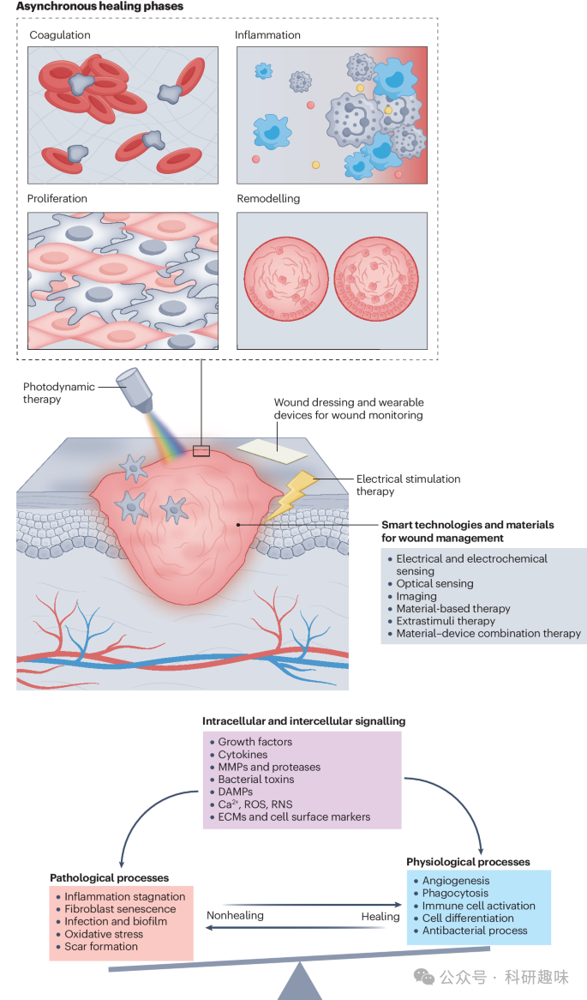
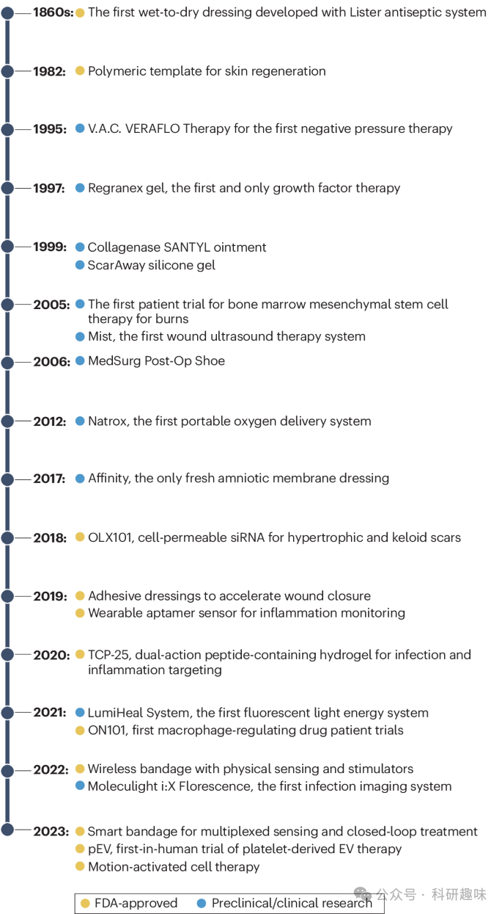
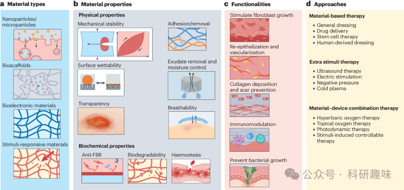
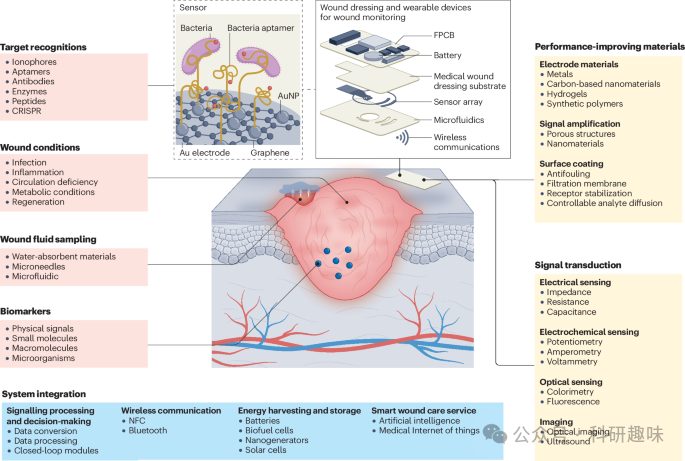

 

#  【Nat. Rev. Mater.】万字解读伤口敷料，临床需求、材料进展、开发要点、技术发展、医疗注册等 
 

Grenemal

读完需要

50

全文字数 16000 字

**伤口敷料及技术**

Wound Materials and Technologies

**Abstract**

慢性伤口作为一项全球性的重大健康问题，其带来的经济和社会负担不容忽视。为追求高效的伤口愈合策略，我们需采取跨学科的研究方法，其中，材料科学与生物工程的飞速发展，为新型伤口愈合生物材料和技术的研发提供了坚实基础。

在本文综述中，我们回顾了伤口管理的历史演变及其所面临的挑战，同时聚焦于伤口愈合生物材料的当前技术前沿。我们着重介绍了那些有望革新慢性伤口治疗和监测领域的新兴技术，这些技术不仅展现了高度的专业性和创新性，而且为伤口愈合领域带来了新的希望。

此外，我们还深入探讨了与伤口愈合策略紧密相关的临床和商业考虑因素。这些因素涵盖了转化过程中的监管路径和关键环节，为确保新型生物材料和技术能够顺利进入临床应用提供了重要指导。同时，我们也指出了当前存在的转化差距，并对将创新理念转化为主流临床实践过程中所面临的持续挑战进行了深入分析。

展望未来，持续的创新和跨学科合作将成为推动伤口护理领域发展的关键动力。我们坚信，这些努力将铺平通向更好伤口护理效果的道路，并有望显著改善日益增长的老龄化人口的生活质量。在这一进程中，化学和材料学等专业领域的深入参与和贡献将发挥至关重要的作用。

**Introduction**

伤口愈合是一个动态而复杂的过程，对于维护皮肤和邻近组织的完整性与功能性至关重要。皮肤作为一道天然屏障，其有效愈合对于预防感染、维持体内稳态具有决定性作用。伤口可大致分为急性和慢性两种，为医疗保健系统带来了显著挑战。急性伤口通常遵循一个可预测的愈合顺序，即炎症、增生（或修复）和重塑阶段。然而，慢性伤口往往与糖尿病、血管疾病或压力损伤等病理状态相关，常处于持续的炎症阶段，导致愈合过程延长、感染风险增加，进而可能导致发病率和死亡率上升（如图1所示）。

先进的智能技术和材料的创新设计为解决这一复杂问题提供了可能，并为优化伤口管理提供了个性化的动态策略。这些技术和材料在伤口护理领域的应用正在不断发展。伤口给医疗保健系统带来的负担是巨大的，每年影响数百万人，相关费用估计超过280亿美元。据最新研究报道，全球有4000-6000万人受到糖尿病足溃疡（DFU）的影响，由于监测方法、定义和护理获取途径的差异，患病率可能有所不同。在北美洲，DFU的患病率为13%，欧洲较低（5.1%），全球平均患病率为6.4%。非洲和南美洲的发病率有所上升（15%），且男性和2型糖尿病患者更易受到影响。手术伤口、压力伤和烧伤是造成这一负担的主要原因，因此，实施有效的伤口管理策略显得尤为重要。

当前的护理标准包括通过清创、冲洗和闭合技术等方法为伤口床做好准备。然而，随着技术的不断进步，从先进的伤口敷料到针对特定病理生理因素的治疗技术，伤口护理领域的创新正在不断涌现。这些创新为伤口管理提供了更多可能性，有望在未来进一步减轻伤口带来的负担。

慢性伤口的致死风险远超人们的一般认知。例如，糖尿病慢性溃疡等慢性伤口患者的5年死亡率高达70%，这一数据显著超过了大肠癌、乳腺癌和前列腺癌等疾病的5年死亡率。与癌症治疗相比，医护人员、患者及公众对伤口护理的教育和认知存在显著的鸿沟。为了缩小这些教育差距并推广有效的预防措施，加强社区参与和患者教育至关重要。

商业伤口护理产品不再局限于传统的被动式生物材料伤口敷料，而是向能够实时监测和主动干预的智能伤口敷料发展。慢性伤口常涉及细菌感染、过度炎症、灌注不良和血管堵塞等问题。传统伤口敷料在提供复杂伤口微环境实时信息方面存在限制，影响了伤口的最佳愈合。将可穿戴传感器集成到智能伤口敷料中，成为克服这一限制的有效手段。此外，智能生物电子系统的出现为个性化伤口护理带来了巨大潜力，其可穿戴性、成本效益高、应用简便等优点备受瞩目。

尽管目前已有众多伤口护理产品问世，但每种产品都需遵循不同的临床和监管路径。只有少数产品获得了临床批准，许多在转化过程中遭遇失败。根据美国食品和药物管理局（FDA）的指导方针，深入了解损伤的病理生理过程是开发靶向疗法的基础。跨学科的合作以及与临床医生的早期沟通，对于确定未满足的临床需求并创建基于证据的靶向产品简介至关重要。此外，能够准确反映人体组织反应的临床前模型对于实现从实验室到临床的成功转化也至关重要。

自2017年以来，伤口护理技术经历了显著的增长，这主要得益于多种因素的汇聚，包括生物技术、纳米技术和数字健康技术的融合。这些技术的融合为智能敷料、生物活性材料等创新伤口护理解决方案的开发提供了基础。此外，政府和私人对伤口护理研究的投入也显著增加。据估计，2022年伤口护理市场价值为201.8亿美元，预计到2030年底将达到305.2亿美元。

图2. 慢性伤口管理技术的发展时间表

本综述旨在深入探讨针对特定临床应用的伤口护理技术的设计原则，旨在缩小应用研究与转化成果之间的差距。我们全面评估了伤口护理在材料设计原则方面的进展，涵盖组织再生、伤口敷料、智能绷带以及细胞或药物在伤口护理应用中的输送等多个领域。

在慢性伤口管理方面，我们着重探讨了最新进展，并强调了多学科方法的重要性。借助材料科学和生物工程领域的突破，我们致力于实现个性化慢性伤口评估。新型材料的整合不仅有助于保持生理微环境的稳定，还能实现可控、可持续的治疗药物输送至伤口部位。

此外，我们还对诊断医疗设备，特别是可穿戴生物传感器的最新进展进行了深入探讨。这些设备能够非侵入式地实时监测和分析伤口状况，为及时干预提供了可能，并有助于提高患者的依从性。为满足慢性伤口护理中尚未满足的需求，开发此类材料和技术已成为当务之急。

在转化过程和监管途径方面，我们也进行了介绍，以强调有效开发伤口管理策略的重要性。最后，我们以图文并茂的方式对伤口护理产品的各种分类进行了概述，为不断发展的伤口护理技术提供了一个全面的视角。这不仅有助于推动伤口护理领域的技术进步，也为临床医生和研究人员提供了宝贵的参考。

**Emerging materials for advanced wound management**

伤口管理涉及一系列精心设计的材料，这些材料旨在精细调控伤口微环境，从而协调愈合过程的关键环节。这些材料在促进成纤维细胞增殖、加速再上皮化、促进血管新生、优化胶原沉积、调节免疫反应以及缓解感染、疼痛、出血和组织疤痕形成等并发症方面展现出显著作用。在伤口愈合的四个典型阶段（凝血、炎症、增殖和重塑）中，定制化的材料和方法显得尤为重要（如图所示），尽管慢性伤口的愈合过程可能并不严格遵循这一线性顺序。

在初始阶段，水凝胶和壳聚糖等材料因其良好的凝血促进能力和抗菌特性而被广泛应用。随着愈合进入炎症阶段，智能敷料通过控制释放抗炎剂，有效缓解炎症反应。在增殖阶段，生物可降解的支架材料如胶原蛋白，为新生组织的形成提供了理想的生长环境。而在重塑阶段，为了尽量减少疤痕的形成，硅胶片和仿生材料等成为首选。

鉴于慢性伤口可能偏离典型的愈合过程，所选材料必须具备高度的适应性，能够同时解决愈合的多个方面，以应对慢性伤口护理的复杂动态。这种材料设计策略对于实现有效的慢性伤口管理至关重要。

Rational material and technology design for clinical applications

为了实现高效的伤口护理，我们需针对临床应用的具体需求，对材料和技术进行策略性的开发。在设计用于伤口愈合的生物材料时，我们必须细致考虑其对生理微环境的维护以及所需的治疗功能（如图3所示）。

a. 用于慢性伤口治疗的各种材料类型，包括纳米颗粒/微粒、生物支架、生物电子材料和刺激响应材料。b. 物理特性，包括机械稳定性、粘附性、润湿性、湿度控制、透明度和透气性，以及生化特性，如抗异物反应（FBR）、生物降解性和止血。这些特性可控制一系列细胞功能和治疗效率。c, 这些材料旨在实现成纤维细胞生长刺激、再上皮化、血管化、胶原沉积、疤痕预防、免疫调节和感染预防等功能。

**Mechanical properties**

在伤口管理过程中，材料的机械特性对于减少二次损伤并促进愈合过程具有不可或缺的作用。人体表皮所能承受的最大应变率约为15%，这一数据凸显了选择具有适当弹性的材料以确保与组织的良好粘附性，并防止组织与设备之间发生损伤的重要性。

材料的强度、弹性和适应性不仅是保护伤口的关键，更是对细胞行为产生深远影响的因素。伤口敷料和支架的机械属性会直接影响组织再生的质量、炎症反应的调控以及疤痕的形成。例如，当基底硬度设定为10千帕，并且敷料长度控制在7-9厘米时，这种配置能够促进力的有效传递，为成纤维细胞的增殖提供理想条件，因为这一机械环境接近皮肤组织的自然状态。

因此，具有可调机械特性的材料在伤口护理领域展现出广阔的应用前景。这些材料能够在潮湿的伤口表面提供可控的持续收缩，从而优化伤口愈合过程，提高治疗效果。

**Porosity, breathability and transparency**

在伤口管理中，支架的孔隙率对于细胞浸润和血管化具有决定性作用。这是因为相互连接的孔隙网络能显著促进营养物质、氧气和代谢废物的有效运输。除了孔隙率，伤口敷料的透气性也是关键要素，它不仅允许氧气渗透到伤口区域，促进愈合，同时也是防止细菌污染的有效物理屏障。

此外，材料的透明度在伤口监测和观察中扮演着不可忽视的角色。这一特性使得医护人员能够实时、直观地监测伤口愈合的进展情况。特别是在使用透明伤口敷料或设备时，集成防紫外线辐射层显得尤为重要。这一设计能够有效防止紫外线引起的皮肤色素改变，保障材料的长期稳定性和其内部嵌入组件的持续功能性，从而确保伤口管理过程的高效和安全。

**Wettability**

在伤口管理中，保持湿度与促进蒸发之间的平衡至关重要，以避免液体积聚，液体积聚可能导致浸渍和感染。水蒸气透过率（WVTR）是衡量敷料性能的重要指标，它随伤口类型和愈合阶段而变化。例如，正常皮肤的水蒸气透过率范围约为每天204-278克/平方米，而一级烧伤和肉芽肿伤口则高达每天5,138 ± 202克/平方米（参考文献）。

当敷料的水蒸气吸收率低于每天840克/平方米-2时，可认为其具备足够的保湿性能（参考文献）。然而，过高的水蒸气渗透率可能导致伤口过快干燥，进而促进疤痕形成；而渗透率过低的敷料则可能阻碍渗出物的正常排出，减缓愈合过程并增加感染风险。因此，在伤口敷料的设计和应用中，需要综合考虑材料的润湿性、水蒸气透过率等性能参数，以实现最佳的伤口愈合效果。

**Adhesion**

在伤口护理中，粘合敷料因其便捷性而逐渐占据重要地位，它无需进行复杂的切割和粘贴手术胶带操作，即可直接应用于伤口。这种直接应用的方式不仅确保了伤口被稳固地覆盖，同时也维持了伤口与敷料之间界面的稳定性。然而，在使用粘合敷料时，我们必须谨慎处理，因为过度的粘附可能会导致角质层的大量脱落，这既包括新形成的上皮组织，也可能涉及伤口周围健康的皮肤组织。因此，在选择和使用粘合敷料时，需要充分考虑其对伤口及其周围组织的潜在影响。

**Haemostasis**

在伤口护理中，确保敷料材料上能够有效保留止血成分显得尤为重要，因为这些成分不仅有助于止血，还能为进入的细胞和生长因子提供必要的支撑结构。这种强大的保留能力为伤口的再生和愈合带来了极大的希望。以具有固有止血能力的合成纳米粘土材料——青金石为例，其独特的性质使得其剪切稀化性能得到显著提升，因此成为了伤口敷料三维打印技术中广泛应用的优质材料。这种材料的应用不仅能够实现快速止血，还能为伤口的愈合提供一个理想的微环境。

**Biochemical properties**

伤口生物材料的生化特性涵盖生物相容性、与伤口微环境的相互作用、支架的降解特性以及治疗剂的夹带与释放机制。在使用过程中，敷料和设备会迅速吸附一层蛋白质，这会引起免疫系统的响应并触发异物反应。为了降低炎症和并发症、优化设备效能以及提升整体功能，抗异物反应特性显得尤为重要。生物材料的降解速率与其所处的局部微环境密切相关。例如，慢性伤口富含蛋白酶，这会加速肽源基质的降解过程。相反，生物材料释放的信号离子，如藻酸盐释放的钙离子，能够积极调节局部微环境，既可作为止血信号，也可作为成纤维细胞增殖的促进信号。

伤口护理策略的选择不仅受到临床因素的影响，还受到经济因素以及是否有合格护理人员的影响。这些因素共同强调了采用全面、适应性强的伤口护理方法的重要性。这种方法旨在满足伤口的特殊需求，同时解决更广泛的患者福祉问题。

Advanced materials for wound treatment

尖端材料在伤口愈合过程中及减轻并发症方面扮演着核心角色。它们作为保护屏障，能够重新分布压力并有效抵御外部污染。在需要稳定、固定伤口或精确调控压力的情况下，硬质材料医疗器械，如负压疗法装置、用于伤口预测和预后的矫形器以及骨折石膏等，提供了专业且定制的解决方案。这些量身定制的设备能够满足患者的个性化需求，助力伤口实现最佳恢复效果。

然而，尽管传统材料能提供必要的支撑，但它们往往难以贴合身体轮廓，且透气性不足。这些问题可能导致患者在伤口愈合过程中感到不适，增加皮肤并发症的风险，并需要频繁调整。因此，开发适应性更强、更舒适、更有利于整体愈合的新型材料成为了研究的热点。

基于材料的新兴治疗方法在伤口愈合领域展现出巨大的潜力。与传统刚性材料提供的被动伤口支撑不同，这些新型材料通常具备柔韧性和可穿戴性，能够提升患者的舒适度，并实现个性化的敏感治疗。这种治疗方法能够加速组织再生，降低感染风险（如图c所示）。通过利用胶体、水凝胶、纳米纤维和其他功能化材料，这些治疗方法展现出良好的生物相容性，能够维持和调节伤口的生理微环境。

在这些新型材料的推动下，伤口愈合技术取得了显著进展，包括靶向和可控给药、生物电子刺激、光动力疗法、伤口负压疗法（NPWT）、高压氧疗法以及基因和细胞疗法等。这些基于材料的创新疗法的整合有望彻底改变伤口管理的格局，提升愈合效果，并降低医疗成本。以患者为中心的护理理念体现在提高患者舒适度、最小化并发症风险以及改善伤口护理的整体治疗效果上（如图d所示）。

**Microparticles and nanoparticles**

微纳米粒子凭借其可定制的特性，如高比表面积、可调特性及封装治疗剂的能力，在直接治疗与药物输送领域展现出巨大潜力。这些微纳米粒子，涵盖金属、陶瓷、聚合物、自组装结构、复合材料以及水凝胶嵌入纳米粒子，其功能多样，成为促进伤口愈合过程的宝贵工具。

为了减轻皮肤刺激和系统并发症，并保持其功能的完整性，微纳米粒子常通过金属外壳、聚合物或表面活性剂等材料进行稳定化处理，并在其表面涂覆低致敏性物质。

微纳米粒子能直接影响细胞行为与生理平衡。例如，氧化锌（ZnO）纳米粒子能够调节炎症反应，促进上皮化，以及恢复皮肤止血功能。它们通过调节参与再生与免疫反应的细胞活性来影响伤口愈合过程。值得注意的是，经过微孔退火颗粒处理的伤口表现出显著的再生外观，包括髓细胞募集的增强、组织结构的改善和血管生成的增加，这些均表明皮肤向更健康、更正常的状态恢复。

微纳米粒子广泛应用于以可控方式将药物直接输送到伤口部位。这些微粒可封装抗生素、消炎药、生长因子及遗传物质（如DNA或RNA）等治疗剂，实现高效给药。其持续释放能力对于延长治疗效果至关重要，尤其在伤口愈合过程中，持续的药物供应有助于维持最佳的愈合环境。此外，封装在微纳米颗粒中的药物还能免受伤口环境中酶和pH值条件引起的过早降解。

然而，在伤口愈合和监测过程中使用微纳米粒子也面临一些挑战。细胞毒性风险是一个主要问题，因为某些材料（如金属和金属氧化物）可能引发不良的细胞反应，从而影响伤口愈合。此外，如何精确控制颗粒在伤口部位的输送和滞留也是一个挑战，因为定位不当可能降低疗效并增加脱靶效应的风险。同时，复杂伤口微环境（如不同pH值、酶和渗出液）会影响纳米粒子的稳定性和功能性，因此需采用强有力的粒子设计和表面修饰策略。

为应对这些挑战，需进行全面的临床前测试，并开发创新的工程解决方案，以充分利用微纳米粒子的功能，推动伤口护理领域的发展。

**Bioelectronic materials**

皮肤细胞具有产生并响应生物电信号的能力，这一发现催生了伤口电气评估和调节技术的革新。为了寻求精确增强伤口处生物电信号的方法，研究者们开始开发能够将电子技术无缝融入伤口护理和组织修复过程中的新型材料和策略。

电活性材料，以其产生或响应电信号的能力，为伤口管理策略注入了动态元素。这些材料通常由导电基质或元件封装而成，展现出卓越的电子-离子转换效率，且不受电压和频率的影响。它们具有显著的电容特性，能在广泛的频率范围内高效工作，同时保持导电性、强度、柔韧性和生物兼容性，这些特性对于实现最佳性能至关重要。例如，低频（&lt;10 Hz）单相脉冲微电流能够促进成纤维细胞的增殖和迁移，而高频（&gt;1 kHz）疗法则有助于减轻疼痛和抗菌治疗。纳米发电机产生的电场同样有助于促进伤口愈合。

将电子导体（如碳纳米管、金属纳米颗粒和石墨烯氧化物）融入生物材料中，能够显著提升电信号的传输效率。然而，导电材料的不均匀分散可能导致电信号传输中断或不规则，为此需采取有效的分散技术。同时，还需对这些材料的长期安全性进行评估，以排除潜在毒性风险。导电有机聚合物，如聚苯胺、聚吡咯和聚(3,4-亚乙二氧基噻吩)：聚苯乙烯磺酸盐等，在制造可拉伸电极方面展现出巨大潜力，这些电极能够适应伤口组织的动态变化。

通过电线索，生物电子材料能够促进细胞迁移、增强组织再生并调节炎症反应。此外，电活性材料还可用于可控给药、实时监测伤口愈合进度以及创建电刺激环境，从而加速整个愈合过程。在伤口护理中运用电活性材料时，需综合考虑生物相容性、电气特性的精确调节、机械耐久性与适当降解率之间的平衡。同时，将电活性材料融入现有医疗设备并确保其临床应用的可扩展性也是一项重大挑战。为克服这些挑战，需采用多学科方法，确保这些材料安全、有效，并与人体动力学和现有医疗技术相兼容。

**Natural and synthetic bioscaffolds**

生物支架，受天然细胞外基质的启发，为人体内在愈合过程提供了一个优化的平台，革新了伤口管理的理念。这类支架利用诸如胶原蛋白、壳聚糖、蚕丝和海藻酸盐等天然材料，紧密模拟人体自身的细胞外基质，为组织再生营造了一个理想的环境。这些天然生物支架不仅展现了高生物相容性，还提供了细胞迁移、增殖所需的受体，支持新血管生成，并有助于实现无疤痕愈合。尽管异种来源（如猪和牛）和人体组织的产品作为伤口敷料的支架在多项研究和临床试验中得到了探索，且部分产品含有供体的生长因子，但天然生物支架的生物来源差异可能导致其特性不一致，进而影响愈合效果。此外，天然支架还面临免疫反应或疾病传播的风险，因此需经过严格的纯化程序以确保其安全性和有效性。

相比之下，合成生物支架如聚乙二醇、聚（乳酸-共-乙醇酸）和聚己内酯等，允许我们精确控制孔隙率、降解率和机械强度等特性。这种高度的可定制性使得我们能够根据特定的伤口护理需求定制支架。通过提供机械支撑、促进细胞附着以及调节生化线索，这些合成支架能够加速伤口愈合过程，并最小化疤痕的形成。此外，这些支架还可通过微调以实现生物活性分子和治疗药物的可控释放。例如，聚丙烯酰胺水凝胶可通过调整硬度，范围涵盖0.1千帕至25千帕，以适应干细胞分化的不同需求。然而，这些合成支架的生物相容性和生物活性可能逊于天然支架，因此，对其表面进行如细胞粘附素分子涂覆等改良措施，以增强细胞间的相互作用，是提升其性能的关键。

**Stimuli-responsive materials**

刺激响应材料，亦称为智能材料，在伤口愈合领域备受瞩目，因其能敏感响应伤口微环境的内部变化（如温度、pH值、代谢物和酶）以及外部刺激场（如力场、电场、磁场和超声场）。

通过利用材料的物理特性，如较低的临界溶液温度，可以设计出与伤口环境中常见病理条件相匹配的响应性伤口护理产品。例如，液态水凝胶作为药物载体，在体温下发生凝固转变，实现药物的缓释，确保持续给药效果。此外，这些材料能够根据温度变化动态调整尺寸，提供收缩力，进而加速伤口愈合过程。同时，结合支架和交联剂设计的响应材料，能够响应伤口中的生化物质而降解，释放治疗药物。例如，DNA交联水凝胶在病原体分泌的脱氧核糖核酸酶（DNase）作用下发生降解，释放中性粒细胞参与伤口修复。

纳米发电机为伤口护理提供了新途径，通过转化人体运动或外部压力产生的机械能为电能。压电材料在机械应力作用下产生的电信号，可用于刺激对组织修复和再生至关重要的细胞过程。这一特性特别适用于动态伤口敷料，通过直接向伤口部位提供持续电刺激，以非侵入性的方式积极促进伤口愈合。

刺激场的直接应用也在伤口治疗中展现出巨大潜力。超声波诱导的空化作用能够分解和侵蚀坏死组织，为伤口清创提供新思路。这一过程有助于清除坏死、受损或感染的组织，提高剩余健康组织的愈合潜力，是治疗慢性伤口特别是坏死组织伤口的关键步骤。尽管取得显著进展，但仍需面对挑战，如材料使用寿命、药物释放剂量的精确控制以及长期治疗效果的维持等。

**Emerging technologies for wound monitoring**

在伤口评估领域，传统的目测和主观评价方法正逐步被新兴技术所取代，这些技术能够提供客观、实时且精确的数据。这一转变正引领伤口护理走向更加预测性、个性化和高效的新模式。随着可穿戴设备与成像技术的融合，我们站在了工程与临床实践的交汇点上，为未来的伤口监测与管理铺设了前所未有的精确道路。

这种方法不仅能够显著降低并发症的发生率，还能有效加速伤口愈合过程，标志着伤口护理领域的一大飞跃。先进的伤口护理监测技术，通过信号传导技术和系统的深度集成，能够灵活地适应各种伤口状况和多重生物标记的需求，为智能伤口管理的开发和应用构建了一个综合性的平台（如图4所示）。

图 4：用于伤口分析和监测的先进材料与技术

Biomarkers for wound healing

新兴的生物传感器和成像技术正在变革我们对伤口特性的描述以及对多种生物大分子的监测能力。这些生物大分子涵盖了代谢物（如葡萄糖、尿酸、乳酸盐）、电解质（如pH值、Na⁺、Ca²⁺、NH₄⁺）、营养物质（如维生素、氨基酸、脂肪酸）、蛋白质（如细胞因子、C反应蛋白）以及治疗药物（如生长因子、质粒、抗生素）等。这些生物标记物与感染和炎症等生理与病理状态密切相关。

在评估愈合过程和指导治疗方面，关键蛋白质的检测发挥着至关重要的作用。这些蛋白质包括生长因子和细胞因子，如血小板衍生生长因子、转化生长因子-β、表皮生长因子、血管内皮生长因子和白细胞介素，它们能够调节修复过程中必需的细胞功能。基质金属蛋白酶（MMPs），如MMP2和MMP9，参与细胞外基质的重塑，其水平升高通常指示慢性伤口的存在。此外，结构蛋白如胶原蛋白、弹性蛋白和纤连蛋白对组织的形成和完整性至关重要。炎症标志物，如C反应蛋白和降钙素原，则是炎症阶段的信号。

通过监测这些生物标记物，我们能够全面了解伤口愈合的各个阶段以及潜在的并发症。例如，脓细胞蛋白和细菌DNA片段等毒力因子的存在可作为感染的早期预警信号。基于这些深入的洞察，我们可以及时调整治疗方案，提高疗效。这些先进的伤口监测设备不仅有助于我们更好地了解伤口环境、分类和愈合过程，还在药物筛选和预后预测等方面发挥着重要作用。

Wound sampling

鉴于伤口渗出物是生物标志物的重要来源，高效、精确的伤口渗出物样本采集对于伤口护理研究和管理至关重要。为确保生物标志物数据的准确性和相关性，样本采集过程中必须严格区分新鲜和陈旧的伤口渗出液。陈旧的渗出物可能包含降解产物，无法准确反映伤口的当前状态，而新鲜渗出液则能即时揭示伤口的实时状况。因此，有效捕获新鲜渗出液并即时传输至分析模块对于实现可靠的伤口评估至关重要。连续且高效的原位采样技术，通过单次提取过程分离新鲜渗出液，为此提供了一条前景广阔的途径，尽管其实际应用和成功仍需进一步验证和完善。

为提升渗出物采样效率，已研发出具有卓越渗出物吸收能力和自泵功能的敷料。然而，此方法亦面临挑战，如生物材料的潜在污染风险，以及从敷料支架中无损提取液体的技术难题。此外，NPWT（负压伤口治疗）和微针技术虽能从深层组织提取液体，提供更全面的伤口环境信息，但可能无法全面反映伤口表面状况。

不同的伤口渗液测量方法可能导致结果差异显著。一项对14名患者的比较研究显示，使用敷料每日收集的渗出液量为0.17-0.21克/cm²，而采用NPWT则高达1.3克/cm²。这种伤口分析方法和样本采集的不一致性，不仅阻碍了对伤口愈合过程的精确描述，也影响了不同研究结果之间的有效比较。

为应对这些挑战，我们引入了基于微流体的取样技术，用于现场间歇储存和精确管理伤口渗出液。此方法显著降低了稀释、混合或交叉污染的风险。然而，微流控采样技术的主要挑战在于其收集的伤口渗出液量有限，通常介于每日0.05-0.4克/cm²之间。尽管微流控技术在伤口取样领域已有诸多报道，但尚无直接从动物或患者身上收集伤口渗出液的报道。

Sensors

传感器，作为化学、材料学领域的关键工具，具备将生物标志物浓度精准转化为可测量信号的功能。利用可穿戴传感器实时追踪特定生物标志物的动态变化，对于个性化医疗监测和及时干预各类健康状况至关重要。为实现伤口环境中生物标志物的选择性检测，通常需要结合特定的目标识别材料或受体，这些受体包括但不限于离子选择性电极、酶、特异性抗体、适配体以及分子印迹聚合物。在伤口护理的研究与实践中，诸多传感器通过电化学或光学原理，实现高效、准确的信号传导机制，为伤口状况的实时监测与评估提供了强有力的技术支持。

**Electric and electrochemical sensors**

电传感器主要依赖于阻抗测量技术来监测由温度和皮肤阻抗等物理参数变化引起的电信号变化，从而为感染、水合状态以及炎症提供关键信息。相比之下，电化学传感器则通过应用安培计、电位计以及伏安法等先进技术，精确地量化传感器界面上的电信号变化，从而实现对化学和生物过程的深入分析。

对于离子（如Na⁺、Ca²⁺和NH₄⁺）以及pH值的监测，电位计法是一种常用技术。这种方法依赖于离子选择性电极，其电极上修饰有离子亲和剂（如缬氨霉素），这些亲和剂能够选择性和可逆性地与离子或离子敏感材料（如用于pH值传感的聚苯胺）结合。离子选择性电极与参比电极之间的电压差与待测分析物的浓度呈对数线性关系。

在代谢物的检测中，如葡萄糖、尿酸和乳酸，我们通常采用固定有特定酶（如葡萄糖氧化酶、尿酸酶和乳酸氧化酶）的安培酶电极。这些酶电极能够催化目标分析物的氧化反应，从而实现对这些代谢物的检测。为了增强信号传导效率和减少其他电活性分子的干扰，我们通常会使用如普鲁士蓝等氧化还原介质。在此情况下，测得的电流信号与目标分析物的浓度呈线性关系。

在检测基于蛋白质的伤口愈合生物标记物时，如转化生长因子-β和白细胞介素，我们常需结合使用抗体或适配体受体与电化学氧化还原探针或场效应晶体管。然而，由于这些生物标记物的浓度通常较低，且原位传感器的再生较为困难，因此实现对它们的连续监测仍是一大挑战。

在选择生物标记物的测量方法时，必须充分考虑到其生理浓度范围。例如，伤口渗出物中的葡萄糖浓度可能高达数十毫摩尔，而尿酸浓度则可能在100 µM左右。此外，特定生物标志物的存在和浓度还会受到伤口愈合阶段和伤口类型的影响。例如，在伤口进入增殖和重塑阶段时，pH值通常会降低。而在糖尿病伤口中，乳酸水平可能会超过非糖尿病伤口通常的5-15毫摩尔范围，这揭示了糖尿病伤口愈合所面临的新陈代谢挑战。

**Optical sensors**

光学传感器在化学与生物反应中的应用在于通过反应过程引起的特定分子或材料光学特性的变化来检测信号。这些变化通常表现为光吸收率（如颜色变化）或光发射（如荧光或发光）的变动，这些变动与分析分子的浓度或活性直接相关。

在伤口护理领域，光学传感器，尤其是比色传感器，已被成功应用于监测关键参数，如温度、pH值以及氧气和氨基酸等小分子物质的浓度。比色传感器在伤口护理中的优势在于其直观性、设计简便、成本效益高和易于操作。然而，与电化学传感器相比，比色传感器的响应速度相对较慢，通常需要外部读出系统来进行定量测量。

比色传感器的工作原理基于化学反应导致的颜色变化，这需要一定的时间累积至可观察的程度，随后再由外部系统进行量化。这与电化学传感器相比，后者能够提供更快速、实时的电子数据转换。因此，在需要高频率连续数据收集的应用中，比色传感器可能会面临挑战。

此外，比色传感器的灵敏度和选择性还可能受到环境因素的影响，如周围的光线条件和伤口基质的光学特性。这些因素可能会干扰颜色的识别和量化，从而降低测量精度。因此，在使用比色传感器进行伤口护理监测时，需要充分考虑这些潜在的影响因素，并采取适当的措施来减少其对测量结果的影响。

**Imaging sensors**

多种成像技术为伤口评估提供了直观且定量的信息，涵盖了伤口的大小、深度、体积和组织构成等关键特征。传统数字摄影在伤口表面可视化方面发挥着重要作用，它有助于追踪伤口大小和外观随时间的变化。

红外热成像技术作为一种先进的伤口温度监测手段，通过绘制伤口温度图来揭示炎症的存在。温度的升高可作为炎症的可靠指标，预示着溃疡、感染以及潜在的截肢风险。相反，温度降低则可能表明血液供应不足，是潜在缺血的征兆。

在护理点战略性地部署荧光成像设备，能够实时、非接触式地可视化伤口内部组织和细菌。通常，组织在特定波长下会发出绿色荧光，而细菌在紫光激发下则会发出红色或青色荧光。红色荧光是卟啉（细菌产生血红素的副产物）的存在标志，而青色荧光则指示吡咯烷酮，尤其是铜绿假单胞菌的存在。这些荧光信号来源于细菌的自然过程，对于伤口感染的早期诊断和治疗至关重要。例如，便携式护理点设备MolecuLight i:X（MolecuLight Inc.）便是一款专门用于细菌成像的先进工具。

超声成像技术则超越了表层伤口的评估，能够精确测量伤口的深度和体积，这对于确定伤口的严重程度和愈合阶段至关重要。此外，超声成像还有助于检测潜在的结构问题，如骨骼受累或窦道的存在，这些信息对于制定适当和有针对性的治疗计划至关重要。

Materials for enhanced in situ wound monitoring

在开发用于增强伤口生物标记原位分析的传感器方面，先进材料发挥着举足轻重的作用。由于金属、碳纳米材料、水凝胶或聚合物等材料具备高导电性、生物兼容性、电化学稳定性以及承载生物识别和信号转导元件的能力，它们常被选为传感器的理想基体。

鉴于伤口愈合生物标记物的浓度极低，为了实现理想的灵敏度，原位信号放大策略至关重要。纳米材料或多孔结构能有效增加传感器的表面积，进而强化识别元件的功能化并促进电子转移。与传统荧光染料相比，新兴材料如量子点和吡喃展现出更高的亮度和更强的抗光漂白能力。

伤口环境与电极之间复杂的相互作用可能导致生物污垢等挑战，从而影响传感器的寿命和性能。为了应对这一问题，聚乙二醇、水凝胶、Nafion和壳聚糖等防污涂层被广泛应用。这些保护性涂层通过引入所需的表面亲水性、电荷或孔隙率，最大限度地减少蛋白质吸附和细胞粘附，确保传感器在复杂伤口液体中的功能。此外，使用聚偏氟乙烯或聚四氟乙烯等材料制成的过滤膜可选择性地允许目标分析物通过，同时排除较大的干扰物质。

为了提高抗体或酶等受体的稳定性，通常采用受体稳定涂层（如硅基材料和聚乙烯醇）和交联剂（如戊二醛或碳化二亚胺）。这些交联剂能有效保护敏感元件免受伤口环境恶劣条件的影响。此外，涂层（包括用于调节渗透性的水凝胶涂层）还能调节分析物到达传感器的速度，确保检测的一致性和可控性。这些涂层元素是开发先进伤口传感器不可或缺的一部分，为伤口管理和治疗提供了可靠而精确的数据支持。

为实现与皮肤的保形接触并进行可靠的原位生物标记监测，可拉伸生物传感器应运而生。这通常通过在聚二甲基硅氧烷或苯乙烯-丁二烯-苯乙烯等弹性体中加入金属或碳基纳米材料来实现。这种方法不仅提高了传感器的灵活性和适应性，还确保了即使在动态和具有挑战性的伤口环境中也能保持最佳性能。

综上所述，通过明智地选择和集成先进材料，结合信号放大和防污策略的实施，我们能够开发出满足伤口生物标记原位分析要求的传感器。这些进步为提高监测伤口愈合过程的准确性、寿命和可靠性奠定了坚实基础。

System integration and data processing

随着先进伤口监测技术的涌现以及远程医疗与伤口护理的深度融合，慢性伤口管理领域正迎来革命性变革。无线智能绷带的开发，标志着闭环伤口监测与治疗的崭新篇章。这些高科技绷带集成了伤口状态数据收集系统、尖端数据处理能力、可调治疗输送系统以及无线通信和能量供应单元。

然而，随着AI驱动的伤口评估工具在临床环境中的普及，其准确性必须经过严格的验证。确保这些工具能提供精确的伤口评估，对于临床医生提供基于证据的知情护理至关重要。这一技术进步有望通过提供数据驱动的洞察力来支持更明智的临床决策，从而深刻改变伤口护理实践。

尽管AI潜力巨大，但要开发稳定可靠的人工智能伤口护理系统，仍需构建庞大的训练数据集，并在各种复杂的临床场景中验证其性能。同时，由于数据传输和存储的数字化特性，确保患者数据的隐私和安全也面临严峻挑战。此外，培训医疗保健专业人员以熟练使用和解释这些先进系统生成的数据，同样是一项重要且需要投入大量资源的任务。

可穿戴闭环系统为远程医疗带来了无限可能，使得伤口状况分析和远程医疗服务成为现实。远程医疗的兴起使慢性伤口患者能够在家中持续获得专业、优质的护理服务，无需频繁前往医院。这尤其有利于农村地区或行动不便的患者，提高了专业伤口护理服务的可及性，并为他们提供实时咨询和监测服务。这些应用不仅为患者和医疗服务提供者带来了便利，还提高了疗效和患者的依从性，因此得到了快速发展。

无线智能绷带与远程医疗平台的整合，使得医疗服务提供商能够远程监控伤口进展，并基于实时数据做出明智的治疗调整决策，从而极大地提高了伤口管理的整体效率。

**Regulatory and commercialization considerations**

在化学和材料学领域，开发新型的伤口愈合技术与生物材料是一个多维度的挑战，它要求巨额的研发投资。除了面临科学和技术层面的难题外，对于监管与商业化方面的把握亦同样关键。具体来说，伤口管理策略的转化过程及其监管途径涉及多个核心步骤。此外，伤口愈合策略所固有的临床和商业考量因素，对于其成功应用与市场推广同样具有决定性的意义。

首先，在研发阶段，需要针对伤口愈合的生物化学机制进行深入研究，并设计相应的生物材料，以实现更高效的伤口愈合效果。其次，这些新技术和材料的商业化过程需要遵循严格的监管要求，包括临床试验、安全性评估以及产品注册等步骤。

在临床应用方面，伤口愈合策略必须考虑到患者的个体差异、伤口类型以及治疗环境等多种因素。同时，从商业角度来看，这些新技术和材料的成本效益、市场接受度以及潜在竞争环境等因素也需要被充分考虑。

Regulatory and communication path

在处理伤口管理策略转化的过程中，我们需兼顾全球通用的和地区特有的临床实践及监管框架。在全球范围内，确保伤口护理产品的安全性、有效性和质量是共同的目标。然而，在地方层面，这些策略必须适应多样化的监管标准。这种从全球到地方的差异强调了在全球范围内成功实施先进伤口愈合策略所需的监管路径和沟通策略的多样性。本节将深入剖析监管过程中的具体情况，并提供在美国及全球其他地区的见解。

美国食品和药物管理局（FDA）对伤口护理产品的审批流程十分严谨，需要在启动临床试验前提交大量材料。这些流程旨在评估伤口敷料和治疗产品的物理和化学特性。FDA将伤口护理产品细分为药物、器械、生物制品或组合产品等类别。尽管推动伤口护理的发展至关重要，但这些产品的临床转化仍面临多重挑战，包括伤口愈合过程的复杂性、过时的伤口分类和评估工具、产品市场的拥挤与低效、FDA对伤口闭合结果的特定要求以及缺乏统一标准的数据收集实践。这些挑战导致了伤口愈合产品市场的重叠和冗余。为了改善这一状况，需要政策制定者和立法者共同合作，制定全面的战略计划，以优化和发展更为高效的伤口护理生态系统。

医疗器械根据其风险等级被分为I类、II类或III类，并受到相应的监管控制以确保安全性和有效性。I类器械风险较低，仅受一般控制，无需进行510(k)上市前申报。例如，非吸收性外用纱布、海绵、亲水性伤口敷料、闭塞性伤口敷料、水凝胶伤口敷料和烧伤敷料均属于I类器械。风险高于I类的伤口护理产品可能属于II类，需要进行实质等同性审查和特定控制，通常通过提交510(k)上市前通知进行评估。典型的II类器械包括使用动物源材料的伤口敷料、可吸收合成伤口敷料、伤口治疗生物电子器械（如负压伤口治疗和高压氧治疗）以及伤口生物传感器。第三类器械由于具有高风险或维持生命的功能，通常涉及创新成分和临床应用，需要申请上市前批准(PMA)。PMA是美国FDA针对高风险医疗器械设计的一项严格程序，这些器械用于支持或维持人类生命，或具有潜在的、不合理的疾病或伤害风险。PMA要求提供安全性和有效性的充分证据，通常包括临床试验结果。相比之下，510(k)程序适用于那些实质上等同于已合法上市设备的器械，这些器械不受PMA限制，因此审批流程相对简化。器械和放射卫生中心（CDRH）负责监管各种伤口护理器械，这些器械根据其预期用途和技术特性的不同而进行分类。值得注意的是，与药物结合的伤口敷料（如含抗菌剂的伤口敷料）属于未分类产品代码FRO，通常通过510(k)途径进行监管，而旨在促进伤口愈合的交互式伤口和烧伤敷料则属于III类器械。

表 1：推进伤口管理策略的转化与监管路径

|  | Class I (low risk) | Class II (intermediate risk) | Class III (high risk) | Unclassified |
| --- | --- | --- | --- | --- |
| Categories | Non-resorbable gauze/sponge for external use  Hydrophilic wound dressings  Occlusive wound dressings  Hydrogel wound dressings and burn dressings | Wound dressings with animal-derived material  Absorbable synthetic wound dressings  Wound therapy bioelectronics (NPWT, ultrasound and HBOT)  Wound biosensors | Interactive wound and burn dressings that promote or accelerate wound healing  Product code MGR | Antimicrobial-containing wound dressings |
| Regulatory pathway | Most are exempt from premarket notification 510(k)  Should not contain drugs, biologics or animal-derived material | 510(k) pathway under the KGN product code  Substantial equivalence  Special controls | Premarket approval and effectiveness  Intended for wound treatment  Intended to be a skin substitute  Life-supporting or life-sustaining | Product code FRO (dressing, wound and drug)  No classification regulation  510(k) pathway |
| Examples | WOUND FREE; Comfeel Plus; Dynarex Xeroform; Persys Woundstop Care Fibracol Plus; GraftJacket; DermACELL; EpiFix (HCT/Ps); TheraSkin (HCT/Ps) | Talymed; Oasis; Promogran; Algisite; Tegaren; Hyalomatrix; SonicOne Ultrasonic Wound Care System; 3M Prevena Therapy | Integra; Apligraf; Dermagraft | AMNIOFIX; Titan SGS; Omeza Collagen Matrix; Promogran Prisma Matrix |

本流程为新型设备划分至I类或II类提供了明确的途径。近期案例涵盖NPWT（负压伤口治疗）设备、针对难愈合伤口的体外冲击波设备、细菌蛋白酶活性检测器、压疮管理工具及伤口自动荧光成像设备等。此动态分类过程旨在适应新兴技术发展趋势，推动伤口护理领域的创新。

当非临床测试不足以证明实质等效性时，临床数据将作为上市前申请的关键要素。这些临床数据可通过研究性器械豁免（IDE）研究、文献综述、真实世界证据（RWE）或其他科学证据形式提供。为确保开发过程的顺利进行，强烈建议开发人员提交预提交材料（Q-Submission）以获取反馈，特别是对于采用新型材料或具有创新适应症的设备。CDRH（器械和放射健康中心）致力于支持以合作方式开发创新型伤口护理器械，提供如突破性器械计划等项目，并引导利用真实世界证据进行监管决策。我们鼓励各方积极探索这些途径，与FDA合作，共同推动伤口护理领域的创新。

2018年，FDA宣布了510(k)计划的现代化改革，旨在确保新医疗器械能够反映技术进步并符合现代安全和性能标准。此举旨在鼓励采用能够改善患者护理的现代功能。FDA致力于淘汰过时且超过10年的前提条件，并计划发布一份在线清单，列出与这些前提条件基本等同的已通过审查的器械。实现现代化的初步措施包括在2019年发布更新的指南草案，重点关注特定器械（不包括组织工程产品）的上市前性能标准和测试方法。

总之，监管市场的改革旨在提升监管流程的效率和审查的一致性。然而，对于赞助商而言，获取产品批准的最有效策略仍然是基于坚实的临床前和临床科学数据。

**方框 1：美国食品及药物管理局（FDA）伤口护理产品监管审批流程概述**

在将新型的伤口护理产品推向市场时，深入理解监管环境是不可或缺的一环。FDA的各种审批途径旨在确保患者的安全以及产品的疗效，同时根据设备的新颖性和风险程度设定不同的要求。以下是市场授权的主要路径概述：

**510(k) 预先通知**

510(k) 程序是针对与市场上已有设备相似的一类和二类设备的快速上市途径，通常需要约90天的时间。该程序要求提交证据证明新设备与已合法上市的设备在安全性和有效性上相当。例如，各种伤口敷料和非处方产品（如Band-Aid和Tegaderm）常常通过此途径获得批准。

**上市前批准（PMA）**

上市前批准（PMA）是一项严格的科学和监管审查，用于评估第三类医疗器械（高风险设备）的安全性和有效性。通常，PMA器械会将创新疗法推向市场，如Dermagraft（用于治疗糖尿病足溃疡）和RECELL（用于治疗烧伤）。

**de novo 分类**

de novo 程序为中低风险但尚未在市场上合法上市的新型器械提供了分类途径。它包含一个灵活的时间框架，允许FDA在采取特殊控制措施以确保安全性和有效性的前提下，授予上市许可。此途径可能涵盖更复杂的护理系统，如SNaP伤口护理系统，这是一种便携式、轻型的负压伤口治疗设备，利用机械动力产生必要的真空以促进伤口愈合，无需电池。

在引入安全有效的伤口护理产品方面，每种审批途径都发挥着至关重要的作用。510(k) 途径适用于与现有产品相似的产品，而PMA和de novo途径则适用于新型或高风险设备。这些监管框架确保了新的伤口护理产品经过严格测试并符合高标准，从而为医护人员和患者对所采用的治疗方法提供了信心。

Challenges and opportunities beyond clinical translation

伤口愈合是一个复杂且动态的化学与生物学过程，其前沿研究已跨越传统临床护理的界限，既带来了挑战也孕育了机遇。在伤口愈合领域，临床前研究在弥合创新与有效疗法之间的差距、提高伤口管理实践的整体质量上发挥着至关重要的作用。

在概念与可行性研究阶段，临床前研究为理解设备预期功能相关的生物学基础提供了关键知识，为产品的设计和开发提供了坚实的科学依据。在进入临床试验之前，研究者需进行详尽的临床前测试，以满足监管要求，并向美国食品及药物管理局（FDA）提交研究性设备豁免（IDE）等形式的实质性证据。这些研究是评估伤口护理干预措施安全性、有效性和可行性的基础，对确保产品的临床成功至关重要。

创新的临床前研究方法，如芯片上器官模型、先进的成像技术和多组学分析，不仅提高了临床前研究的预测价值，还加速了临床相关伤口护理干预措施的开发。然而，伤口护理产品的商业化并非仅限于获得监管部门的批准和临床验证，还需考虑市场接受度、生产可扩展性以及与患者和医疗服务提供者的有效沟通。

在商业化过程中，确保产品的成本效益、与现有医疗方案的无缝整合以及与支付方和提供方优先事项的一致性至关重要。此外，扩大生产规模、吸引患者参与、实施全面的教育计划以提高对新技术的认识和采用率，也是确保新技术从临床验证过渡到常规医疗保健的重要组成部分。

辅助诊断策略在指导治疗开始和结束、优化治疗效果方面发挥着关键作用。特别是在后疫情时代，能够支持家庭远程监测和管理的技术显得尤为重要。然而，随着远程医疗的发展，数据隐私和安全问题也日益凸显。确保远程医疗的私人空间、数据安全、提高数字素养以及应对远程医疗报销政策和培训挑战，是建立对远程伤口护理技术信任和促进其有效使用的关键。

综上所述，伤口愈合领域的研究已突破传统临床护理的界限，临床前研究在满足监管要求、推动产品创新和提高治疗效果方面发挥着重要作用。同时，商业化过程中还需考虑市场、生产、患者教育和远程医疗等多个方面，以确保新技术在更广泛的医疗生态系统中得到有效应用。

**Conclusions and perspectives**

本综述聚焦于伤口愈合生物材料与技术领域的显著进展。这些创新技术不仅有望为慢性伤口的治疗提供有效方案，还可能颠覆现有的临床伤口管理模式。我们的探讨还涉及了监管审批和商业化过程的重要考量，并强调了临床前研究与临床研究在产品开发阶段的关键作用。这种综合方法对于弥合开创性研究与实际应用之间的鸿沟至关重要。

展望未来，伤口管理领域将继续迎来新的探索与创新。新型生物材料、生物工程技术和远程医疗技术的不断进步，为提升患者疗效、减轻慢性伤口负担提供了诱人机遇。再生医学与组织工程的前沿技术，特别是干细胞疗法和三维生物打印技术，为受损组织和器官的再生带来了希望。先进的制造技术为多功能个性化伤口护理设备的开发打开了新门路，这对处理复杂多变的伤口结构和类型至关重要。例如，三维生物打印技术可制造与患者伤口地形精确匹配的定制化伤口护理设备，如敷料和植皮。这种个性化方法不仅能改善物理贴合度和患者舒适度，还能确保与伤口床的有效接触和整合，从而提升治疗效果和监测效率。此外，3D打印技术还能将多种材料和活性成分（如抗菌剂、生长因子或干细胞）集成到一个平台中。在个性化设备中整合不同功能，旨在通过提供全面解决伤口管理多方面问题的综合方案，进一步提高愈合效果。

解决全球伤口护理领域的差异问题至关重要。在北美、欧洲等发达地区，先进的伤口管理策略和个性化疗法正成为新的研究前沿。然而，在撒哈拉以南非洲、亚洲部分地区等发展中地区，由于医疗资源匮乏和传染病流行，慢性伤口管理变得更加复杂，迫切需要具有成本效益和可扩展性的解决方案。这种差异凸显了在资源有限环境中开发创新、经济实惠的伤口护理解决方案的紧迫性，并强调了国际合作在研究和培训方面的潜力。例如，在低收入和中等收入国家，伤口护理管理的独特需求强调了需要开发易于获取、经济实惠、使用便捷且能应对当地疾病流行的材料和技术。这包括为医护人员提供培训、使解决方案适应当地气候和资源，以及加强以社区为基础的护理服务。为了满足这些要求，我们特别关注那些可在当地生产或采购的材料。伤口护理领域必须努力推动技术进步的公平分配，确保在全球不同环境下都能实现有效的伤口管理，并缩小不同经济和地理区域之间的差距。

## **参考文献**

**Ref**

Wang, C., Shirzaei Sani, E., Shih, CD. et al. Wound management materials and technologies from bench to bedside and beyond. Nat Rev Mater (2024). https://doi.org/10.1038/s41578-024-00693-y

**点击蓝字 关注我们**

相关阅读

Technology

技

术

**1**

[【Nat. Rev. Bioeng.】过继细胞疗法（ACT）与生物材料技术的结合，从癌症到普适性免疫疾病](http://mp.weixin.qq.com/s?__biz=MzkzOTI1OTMwNg==&amp;mid=2247485901&amp;idx=1&amp;sn=6f02c5c7591bc3f6db1fb1e7feae4d7b&amp;chksm=c2f2ed08f585641e0943ac94c6e4b05facab8e763aa073919054ff24d7e5defc6d6ec3ba7212&amp;scene=21#wechat_redirect)

**2**

[【Adv. Mater.】基于生物仿生AIE纳米粒子的生物成像和治疗应用：突破性进展与未来挑战](http://mp.weixin.qq.com/s?__biz=MzkzOTI1OTMwNg==&amp;mid=2247490233&amp;idx=1&amp;sn=8f3d55404a4f672f38f316da257ef7c5&amp;chksm=c2f2fe7cf585776a931153ac8560f054c89c7e3e9807b627f412fa30c94de0731c91d6288311&amp;scene=21#wechat_redirect)

**3**

[【Nat. Rev. Bioeng.】用于尿液检测探针：设计、原理及应用](http://mp.weixin.qq.com/s?__biz=MzkzOTI1OTMwNg==&amp;mid=2247486256&amp;idx=3&amp;sn=7cb0d3f899ba18f7d69ec1c359c24a24&amp;chksm=c2f2eff5f58566e30f0a5d8cb722acb1578ad3a827172a1609de92f8dcdd0e49733c24617584&amp;scene=21#wechat_redirect)

预览时标签不可点

 [阅读原文](javascript:;) 

  继续滑动看下一个 

 轻触阅读原文 

    

