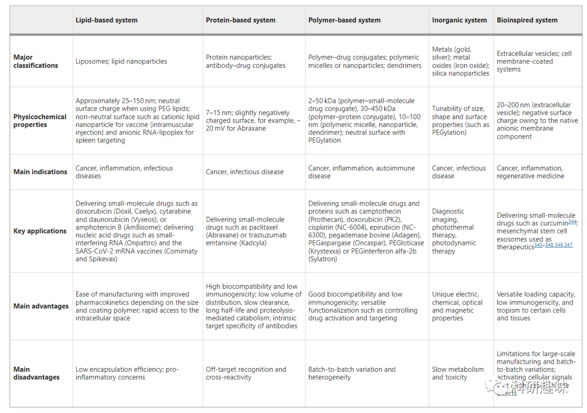
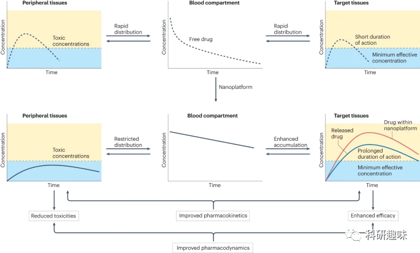
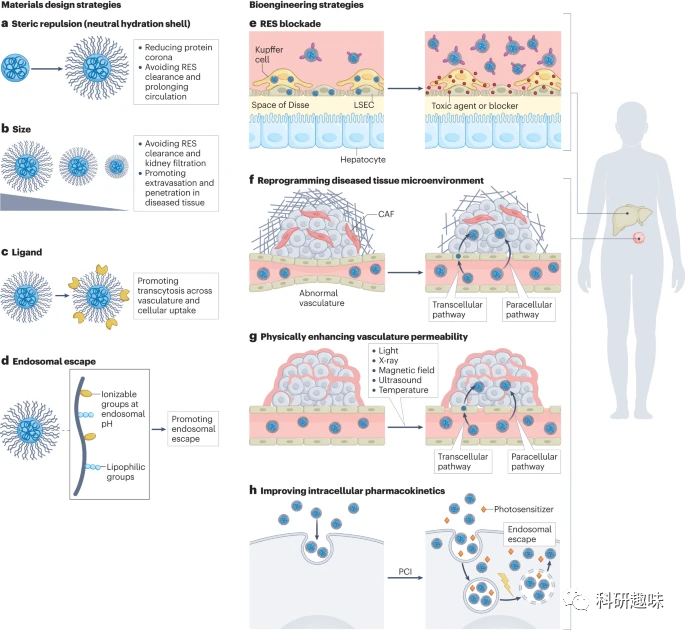
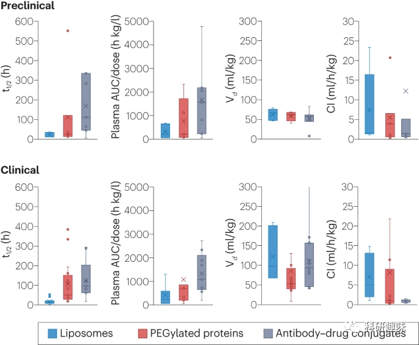

 

#  【Nat Rev Bioeng】一文了解如何优化纳米药物的血液循环、生物分布、组织渗透性及临床药效表现 
 

Grenemal

读完需要

36

全文字数 12000 字

***目录***

1. Key points
2. Introduction
3. Clearance and distribution of nanomedicines
    1. Extending blood circulation
        1. Size
        2. Surface charge
        3. Stability
        4. Shear forces
        5. Release rate
        6. Steric stabilization
    2. Accelerated blood clearance
        1. Immunogenicity
        2. Protein corona
    3. Targeting
        1. Installing ligands on nanomedicines
        2. Targeting diseased tissues beyond cancer
4. Efficacy and toxicity of nanomedicines
5. Preclinical and clinical analysis of pharmacokinetics
6. Controlling biodistribution
    1. Blocking RES
    2. Tumour reprogramming
    3. Applying external forces
        1. Light
        2. Radiotherapy
        3. Magnetic field
        4. Ultrasound
        5. Hyperthermia
        6. Activating paracellular and transcellular pathways
7. Outlook

**Key points**

- 与不含载体的药物相比，纳米药物可以提高生物利用度、靶向能力、疗效和安全性，但其临床应用还很有限。
- 了解影响纳米药物血液循环、生物分布和组织可及性的机制有助于克服这些限制。
- 研究纳米药物的结构、功能及其生物相互作用之间的相互作用有助于开发出具有更高给药效率的纳米药物。
- 生物工程策略可用于优化纳米药物设计、操纵生物屏障和增强组织靶向性，从而提高临床疗效。

**Introduction**

纳米药物是纳米载体，它们通过功能设计来增强药物的药代动力学和药效学特性，如促进药物在目标组织中的积累、延长药物循环时间、调节免疫反应等，从而减少对非靶组织的毒性。自21世纪初以来，纳米药物已在肿瘤、疫苗、成像和响应式治疗等领域得到批准应用。尽管如此，从II和III期临床研究中可以看出，其治疗效果仍有待提高。

纳米药物在体内的清除和分布对其药理特性至关重要，因为在达到目标时，纳米药物必须克服生物障碍。为此，必须设计能够规避如如肝窦状内皮细胞（LSECs）和巨噬细胞等清除细胞的纳米药物，并提高其针对性、疗效和安全性。

在此综述中，我们将详细探讨纳米药物在临床前和临床研究中的分布和清除机制，以期为基于纳米药物的治疗策略提供有益的指导。

**Clearance and distribution of nanomedicines**

纳米药物在临床上和临床前用于再生目的或治疗癌症、炎症、传染病和自身免疫性疾病等。这些纳米载体的理化性质各不相同，用途也不尽相同，因此需要不同的药代动力学调控策略（表 1）。

纳米药物可以通过多种途径如静脉注射、口服、腹腔注射等方式进入体内，但在这些途径中，复杂的把关机制（注解 1）会影响其给药效果。传统的小分子药物药代动力学分析将药物的进入和排出过程分为α期和β期。然而，这种分析方法并不完全适用于纳米药物。纳米药物的血药浓度下降与网状内皮系统（RES）清除相关（α期），而随后当RES结合位点饱和时，纳米载体的清除减缓，从而导致其循环时间延长（β期）。

理想的隐形纳米载体在体内应该表现出与整个血液容积相似的分布行为，如图1所示。在血液中，这些隐形纳米载体的浓度应该呈对数刻度线性下降，这反映了它们受到的恒定清除速率，从而避免了被RES系统饱和。相对而言，非隐形纳米载体会经历α和β两个不同的时期，其清除速率则会受到注射量的影响。然而，真正能够做到隐形效果的纳米载体，例如某些载有特定药物如顺铂的聚合物胶束，却相对较为罕见。因此，为了更深入地了解和确定纳米药物在体内的清除机制，我们需要采用准确且高效的分析方法，这一点在注释2中得到了解释。

**图 1：靶向纳米药物的理论假设。纳米载体旨在通过促进药物在靶组织中的蓄积和活化，以及限制药物在外周组织中的分布来改善药物的药代动力学，从而降低毒性，提高疗效。**

纳米载体在α期后的清除模型与传统的药代动力学模型存在明显的差异，使得其难以被预测和解释。这需要我们使用更为复杂的模型来进行研究。在考察纳米载体的药代动力学特性时，需要综合考虑多种因素的综合作用，例如蛋白质冠、RES的摄取速率、细胞和组织的吸附-解吸过程，以及血液循环中有效载荷的泄漏。这些因素可能会对纳米载体的清除机制产生多样化的影响。值得注意的是，当泄漏的有效载荷与血液成分相互作用时，它可能会与结合在纳米载体上的有效载荷产生不同的影响，进一步影响纳米载体的清除和分布过程。

**Extending blood circulation**

纳米载体在血液循环中的表现受到多种因素的影响，包括其成分、大小、形状、弹性、表面特性（如电荷、亲水性或疏水性、粗糙度以及表面基团的灵活性和配体）、稳定性以及药物释放机制。尽管在临床前的研究中对这些参数进行调整相当有效，但在实际的临床应用中，其转化却受到限制。特别是，纳米药物在化学、制造和控制方面的一大挑战是确保批次间的可重复性。由于纳米药物的微小的理化特性变化可能会影响其预期的性能，因此必须实施严格的质量控制策略，并在生产过程中对这些关键特性进行持续评估。在此背景下，我们将简要探讨目前在临床中使用的几种关键理化特性的控制方法。

**图 2：通过纳米载体设计和生物屏障工程来调节药代动力学的策略。设计纳米载体（左图）的策略包括：修饰纳米载体表面，以减少蛋白质电晕和网状内皮系统（RES）清除，从而延长循环时间（a 部分）；调整尺寸，以避免 RES 清除和肾脏过滤，并促进外渗和穿透病变组织（b 部分）；用配体修饰表面，促进血管内的转囊作用，提高细胞吸收率（c 部分）；用可电离基团和亲油基团进行功能化，促进内质体逸出，实现细胞输送（d 部分）。新出现的生物工程策略（右图）包括通过占据 RES 清除途径阻断 RES（e 部分）；重新规划病变组织的微环境（如血管正常化、固体应力释放）（f 部分）；物理增加血管通透性（使用光、X 射线、磁场、超声波、热疗）（g 部分）；以及改善细胞内药代动力学（如光化学内化（PCI））（h 部分）。CAF：癌症相关成纤维细胞；LSEC：肝窦状内皮细胞。**

**Size**

纳米载体的大小调整在影响其体内行为方面起着关键作用。特别是，适当的大小能够防止纳米载体被肾小球过滤，这在多肽和蛋白质输送中是一个重要的考量。通过直接使用聚合物（例如聚乙二醇，简称PEG）对纳米载体进行修饰或将其大小增加至6纳米以上，可以有效延缓肾脏的滤过速率。此外，纳米载体的尺寸还会影响其在脂质和聚合物系统中的网状内皮系统（RES）清除率。具体而言，大于100纳米的纳米载体显示出更高的抵抗力，这可能归因于它们较低的曲率减少了蛋白质的吸附和随后的清除。但是，关于纳米载体尺寸如何影响内皮细胞的清除机制仍存在许多未解之谜。例如，研究发现，当小鼠接受静脉注射中性电荷并在血液中稳定的交联多离子复合物纳米载体时，其脾脏摄取量会在超过150纳米的临界尺寸后增加。这种增加可能与脾脏内皮间隙的特性有关。鉴于脾脏在免疫调节中的重要性，纳米载体尺寸的微调可能为改善免疫治疗提供新的策略。

**Surface charge**

具有中性或轻微负电荷表面的纳米载体能够延长其在体内的血液循环。实验证明，纳米载体的净正或负电荷可以通过与蛋白质和细胞的非特异性相互作用，影响其在静脉注射后的血浆保留时间，并促进小鼠巨噬细胞及内皮细胞受体介导的主动摄取。在肾脏清除方面，表面电荷同样起到关键作用。特别是，正电荷纳米载体可能会与肾小球基底膜和荚膜细胞的带负电荷表面发生静电相互作用，从而加速其被肾脏清除的速度。而正电荷还可能影响肾脏对纳米载体的再吸收，尽管这方面的研究尚不充分。值得注意的是，通过在纳米载体表面引入具有电荷的分子，可以实现电荷驱动的血浆清除效应。这种策略允许特定的器官，如脾脏，用于针对性的疫苗或免疫细胞工程应用。

**Stability**

纳米载体的结构变化，如解离、聚集或非破坏性结构的调整，都可能影响其血浆清除率。例如，LiPlaCis是一种顺铂脂质体制剂，但由于其稳定性差，导致了临床试验的提前终止。衡量自组装纳米载体稳定性的一个关键指标是其临界结合浓度，这与其疏水性、亲水性以及其他物理和化学特性有关。为了确保纳米载体的稳定性，可以采用超分子相互作用，如二级结构、疏水性和静电力，或通过共价交联的方法进行控制。

为了增强生物制药的稳定性，可以采用PEG化、与Fc融合或与白蛋白结合等策略。分层纳米载体，例如脂质和聚合物纳米颗粒，已经被用于改善某些生物制药的稳定性输送，例如 mRNA 疫苗和Onpattro。在多聚体系统中，基于多阳离子和核酸的纳米载体，Y 型嵌段聚合物能够与多阳离子段形成单位多离子复合物（uPIC）。这种uPIC不仅可以保护siRNA或反义寡核苷酸，还能实现Y 型嵌段聚合物和siRNA之间的动态交换。由于其小的体积，uPIC能在血液循环中保持稳定，并渗透到渗透性较差的组织中。

**Shear forces**

在血液中，纳米载体经常受到相对较高的剪切应力，其范围通常在约10到100 dyn/cm^2之间。尽管这种剪切力对纳米载体的稳定性有着明显的影响，但它在研究中很少被重视。这种对剪切应力的关注在多聚体基因递送系统的研究中表现得尤为明显，这种系统被用于创建非病毒的基因递送载体。在由PEG聚合物构建的系统中，PEG水合壳产生的立体斥力能够防止核酸酶的活性，并延长纳米载体在静脉注射后的血液循环时间。但是，剪切应力确实可能引发多聚体的聚集和结构的退化，例如在PEG-b-聚(L-赖氨酸)-质粒DNA(pDNA)系统中所观察到的情况。幸运的是，这种系统中多聚体核心的可逆交联能够增强其抗剪切应力的性能，从而提高其在血液中的稳定性。

**Release rate**

药物的释放速率对纳米载体的效果和安全性产生直接影响。在不稳定的制剂中，药物可能会过早释放，这种情况类似于游离药物的分布和清除。但是，为了确保纳米载体能在目标位置释放药物，它必须首先在目标区域积累。过度的稳定性可能导致药物积聚不足，这对于控制疾病的进展和预防药物耐受性是不利的。因此，药物的释放速率与结构的稳定性之间需要达到一个平衡。

NC-6004是一个30纳米的胶束系统，由顺铂和PEG-b-聚谷氨酸复合物自组装而成。其独特的α-螺旋结构在顺铂的释放和纳米载体的稳定性之间实现了平衡。这种结构能够稳定纳米载体，同时以一种类似侵蚀的方式促进药物的释放。在胰腺肿瘤的小鼠模型中，这种机制使得顺铂得以同步释放，保持纳米载体的结构稳定，并且在静脉注射后延长了血液循环时间。

为了更精确地控制药物在肿瘤中的释放，研究人员还开发了刺激响应型纳米载体。例如，ADC（如布伦妥昔单抗维多汀）是一种带有可裂解连接体的抗体-药物共轭物，因其针对性而在此领域取得了显著的进展。其他如基于聚（N-（2-羟基丙基）甲基丙烯酰胺）的共轭物、脂质体（LiPlaCis）和聚合物胶束（NC-6300）等也已进入临床试验。特别值得注意的是，NC-6300是一个表柔比星共轭胶束，它通过pH敏感的腙键与PEG-b-聚（天冬氨酸）相连，不仅避免了在血液中的药物泄漏，而且增强了在肿瘤组织中的药物释放率。

如果仅依靠生物刺激来触发药物释放是不足够的，研究者们还提出了一种策略，即通过改变微环境来增强纳米载体的响应性。例如，基于醛修饰的PEG-聚（天冬氨酸）纳米载体能够与表观遗传c-Myc抑制剂结合，并根据c-Myc的表达程度来调整药物的释放速率，从而提高其在特定类型的肿瘤治疗中的效果。

**Steric stabilization**

功能性涂层在纳米载体上的应用具有多重好处：它不仅可以减少载体的聚集倾向，从而避免免疫系统的识别，还能延长其在血液中的循环时间。为实现这些目标，PEG化技术被广泛采纳。PEG，因其出色的柔韧性和立体阻碍效应，可以显著提高纳米载体对于抗体、酶和巨噬细胞的稳定性，从而优于未涂层的纳米载体。但是，PEG链的分子量与纳米载体在血液中的行为密切相关。较长的PEG链分子量意味着更大的尺寸，从而增加了其在肾脏中被排泄的可能性。这也使得其与蛋白质和细胞的相互作用减少。在使用胶体纳米载体时，通过调整PEG涂层的密度和厚度，可以进一步延长其在体内的血液循环。然而，需要注意的是，过度的PEG化可能带来“PEG困境”，即纳米药物的细胞摄取可能会减少，内体逃逸率也可能下降。此外，反复使用PEG化的纳米颗粒可能导致免疫系统产生中和抗体，这可能会影响其治疗效果并引起不良反应。

**Accelerated blood clearance**

PEG，一个常用的涂层材料，被认为是导致加速血液清除（ABC）现象的主要原因。这意味着带有PEG的纳米载体在体内可能会被迅速清除，这种现象并非PEG独有，其他亲水性聚合物和蛋白质也可能导致相似的结果。更具体地说，当PEG纳米载体在体内积聚时，它们可能会导致抗PEG抗体的产生，这些抗体可以与PEG结合并降低其稳定性。这种现象与纳米载体在脾脏的积累有关，并通过B细胞和T细胞的互动来发挥作用。

然而，不是所有的PEG纳米载体都会导致ABC现象，这可能与载体与抗PEG抗体的摩尔比有关。某些制剂可能需要特定的剂量才能被清除。此外，虽然大多数人体内都存在抗PEG抗体，但它们的水平存在差异，这可能会影响不同人对PEG纳米载体的反应。

在COVID-19疫苗接种的背景下，超过10亿人接种了涂有PEG的mRNA疫苗，大多数接种者反应良好。但是，一些研究发现不同的疫苗可能在诱导抗PEG抗体方面存在差异。这些差异可能与疫苗的成分、PEG的来源以及其他因素有关。

**Immunogenicity**

纳米载体的免疫原性可能导致其在体内快速清除和在RES中的长时间滞留，从而可能引发不良反应，尤其是在接触后的短时间内可能出现过敏反应。这些过敏反应可以归类为四种类型：I型（IgE介导的即时反应）、II型（IgG或IgM介导的反应）、III型（免疫复合物介导的反应）和IV型（细胞毒性、细胞介导的延迟反应）。尽管在人体和动物模型中都观察到了无机纳米颗粒引发的I型反应，但纳米载体介导的各种类型的过敏反应仍然不太明确。

相对于其他类型的免疫反应，补体激活相关假性过敏（CARPA）反应已被广泛研究。CARPA与I型过敏反应有相似的症状，并可能与补体系统有关。然而，关于补体系统的确切作用在学术界仍存在争议，有研究表明巨噬细胞也可能在不涉及补体的情况下引发假性过敏反应。尽管存在这些争议，但普遍认为，纳米载体的血液清除特性与其引发的假过敏反应有关。因此，减缓纳米载体的输注速度和考虑其血液循环的快速下降作为假性过敏反应的一个指标是合理的。进一步的研究旨在阐明纳米药物引发的过敏反应的机制，并可能为开发特异性的抑制剂提供指导。

**Protein corona**

纳米载体在体内会与血液中的众多蛋白质相互作用，这些蛋白质的吸附会改变纳米载体的物理化学特性，如大小、表面电荷和功能，进而影响其在体内的清除和分布。不同的纳米载体，如PEG化纳米颗粒和脂质体，会形成蛋白质电晕。这种电晕是一个动态层，其中亲和力强且停留时间长的蛋白质形成"硬电晕"，而亲和力较弱且停留时间短的蛋白质形成"软电晕"。通常，浓度和流动性最高的蛋白质会最先吸附，然后被亲和力较高但浓度和流动性较低的蛋白质所替代，这被称为弗罗曼效应。环境因素，如肿瘤或器官，也会影响蛋白质电晕的组成。通过在肿瘤内注射纳米粒子并在其表面诱导特定的蛋白质冠层，可以制备原位的个性化疫苗。

抗PEG抗体可能干扰纳米载体上蛋白电晕的形成，从而改变其生物分布和增强体内清除。然而，与聚合物胶束不同，接枝纳米载体的蛋白质电晕形成受到更大的限制，这可能与其高密度的PEG屏蔽有关。

值得注意的是，纳米载体中的蛋白质不仅受到载体自身的影响，还受到体内环境和个体差异的影响。例如，注射到健康小鼠和肿瘤小鼠体内的脂质体上的蛋白电晕成分存在差异。此外，与健康人体内的蛋白电晕相比，纳米载体在癌症、糖尿病或肥胖症患者的血清中的蛋白电晕也会发生变化。因此，考虑到这些变异性，设计具有特定清除或分布特性的纳米载体可能存在挑战。同时，即使常见的样品处理步骤（如离心）也可能改变蛋白质的电晕组成，这一点也应该引起关注。

**Targeting**

纳米载体的靶向效应对于提高治疗效果、降低剂量和减少毒性至关重要。这种靶向效应主要是通过增强渗透性和滞留性（EPR）效应来实现的，该效应最初是在小鼠模型中观察到的。EPR效应使得纳米载体能够在肿瘤组织中积累，尽管不同的纳米载体可能具有不同的积累机制。

EPR效应导致的肿瘤积累与肿瘤内血管的特性有关，特别是与血管内皮间的间隙和栅栏状的肿瘤内皮细胞有关。肿瘤内部的压力变化和血管的受限性可能会影响纳米载体的渗透和积累。尽管有研究报告称大分子在动物模型中可以有效积累在肿瘤中，但纳米载体的实际效果仍然存在争议。

临床研究表明，EPR效应的效果取决于多种因素，如纳米载体的属性和肿瘤的特性。虽然某些纳米载体可能从EPR效应中受益，但肿瘤的异质性、纳米载体的大小和电荷等因素都可能影响其在肿瘤中的积累。对于纳米载体和纳米材料在肿瘤中的积累进行的分析显示，仅有很小的一部分注射剂量能够到达肿瘤组织。因此，对于纳米载体的疗效和靶向效果，我们需要更深入和准确的评估方法，而不仅仅是基于EPR效应。

**图 3：临床批准的纳米药物的临床前和临床参数分析。分布容积（Vd）和清除率（Cl）根据每个物种的固定体重（小鼠：20 克；大鼠：300 克；猴子：7 千克；人类：70 千克）进行归一化处理。PEG，聚乙二醇；t1/2，半衰期；AUC，曲线下面积。**

纳米药物领域面临的核心挑战之一是如何提高其在肿瘤中的积累，并超越EPR效应所能实现的效果。一种策略是通过与TEC进行互动，绕过肿瘤的血管壁，促进纳米药物的转移至肿瘤组织。值得注意的是，TECs与健康组织中的内皮细胞有所不同，它们具有活跃性，能够提供触发因素来促进物质的外渗。例如，纳米载体可以通过调整其表面性质，如pH敏感性或电荷，与TECs相互作用，从而增强其在肿瘤中的积累。

另一个挑战是如何提高纳米药物在肿瘤组织中的穿透能力。相对于小分子药物，纳米药物由于其较大的体积而难以通过扩散进行有效穿透。尽管纳米药物的主要传输方式是对流，但肿瘤内的高内压和异常的肿瘤微环境，如肿瘤基底膜、壁细胞和细胞外基质(ECM)，都会限制其在肿瘤组织中的分布和穿透。特定大小的纳米载体，如小于50 nm的载体，可能能够穿越这些障碍。而具有特定表面性质，如疏水性或正电荷的纳米载体，可能因其高的细胞吸收率而在肿瘤组织中显示出更好的渗透性。

**Installing ligands on nanomedicines**

为了提高纳米药物在目标部位的分布和滞留，可以向其添加特定的配体来针对病变细胞或组织受体。在肿瘤治疗中，功能化的纳米药物可通过配体与血液中的特定细胞相互作用，如TEC，从而实现更高的肿瘤蓄积。例如，针对脑肿瘤中的特定血管类型，可以使用特定的肽功能化纳米药物来提高其在体内的渗透性；而针对其他类型的肿瘤，如前列腺肿瘤或特定的肿瘤内皮，也可以选择适当的配体进行功能化。

配体的密度和方向对于纳米载体的非目标分布和清除率同样起着关键作用。例如，较高的配体密度可能增加与清除细胞的互动，从而加速某些器官（如RES）的积累。而使用特定的配体，如CD47，可以改变纳米载体与机体的相互作用，从而延长其在血液中的循环时间。

**Targeting diseased tissues beyond cancer**

纳米药物的多功能性不仅限于癌症治疗，而是可以覆盖多种疾病和组织。除了常见的靶点，如肝脏、肾脏和脾脏，难以进入的组织，如脑、心脏、肺、肌肉、胰腺和骨骼，也成为了可能的治疗目标。例如，在某些疾病状态下，如炎症期，纳米药物的渗透性得到提高，从而增加其在特定组织中的积累。在肌肉炎症模型中，使用特定尺寸的聚合物纳米载体展示了其在肌肉中的显著蓄积。

然而，某些组织由于其特定的生物学性质，使得纳米药物的传递变得具有挑战性。这些组织中的细胞间隙通常较小，不适合标准的纳米载体传输，而低的转囊率进一步增加了难度。为了克服这些问题，一种策略是通过短暂刺激细胞内的囊泡转运来实现。例如，通过特定的血糖控制策略，可以增强特定葡萄糖转运体的活性，从而促进纳米药物跨越血脑屏障并在大脑中积累。这种方法可能为纳米药物在难以达到的组织中提供了一个有效的途径。

**Efficacy and toxicity of nanomedicines**

药物的效应与剂量之间的关系被称为剂量-反应关系，它描述了药物暴露与其效应之间的关联。分析这种关系有助于确定药物的治疗安全窗口，即在此范围内药物既有效又安全。在癌症治疗中，纳米药物被认为能够提高药物的治疗安全窗口。这是因为纳米药物能更准确地靶向肿瘤，从而降低最小有效剂量并提高最大耐受剂量。

但值得注意的是，纳米药物并不总是比游离药物更安全。例如，某些脂质体制剂可能在某些情况下比游离药物毒性更低，但其在体内的分布方式可能导致其他类型的毒性反应。因此，纳米药物的给药剂量可能需要低于游离药物的推荐剂量。

纳米药物的联合治疗也显示出协同效应，这有助于改善治疗效果并优化剂量-反应曲线。例如，纳米结构在接受X射线治疗时可以增强放疗效果，而某些纳米药物与免疫疗法结合使用时可以增强抗肿瘤免疫反应。同时，结合载入多种药物的纳米载体也可以协调地控制药物的释放和效应，从而降低全身毒性并增强治疗效果。

**Preclinical and clinical analysis of pharmacokinetics**

虽然临床前模型对纳米药物和载体制剂的优化至关重要，但由于动物与人类在生理和遗传上的差异，这些模型在预测纳米药物的临床效果时存在局限性。尽管动物研究中观察到的纳米药物特性如半衰期延长和血浆AUC增加可以推广到人体，但在临床试验中，纳米药物的实际效果可能会与预期有所不同，这可能与纳米药物的分布和目标疾病的生物学变化有关。

我们对多种已临床批准的纳米药物进行了研究，比较了临床前和临床阶段的药代动力学参数。结果显示，纳米药物能够通过改善血液循环，如延长半衰期和减少分布容积，提高其在人体中的效果。然而，纳米药物在动物与人体中的分布方式存在差异，这可能与动物与人类的生物通透性、炎症、肥胖等因素有关。此外，纳米药物与血浆蛋白的相互作用也可能影响其在组织中的分布。考虑到这些因素，了解纳米药物分布容积的变化机制并在动物模型中进行验证是至关重要的，以确保其在临床应用中的安全性和有效性。

**Controlling biodistribution**

通过修改RES的生理功能和调整目标组织的通透性，可以调控纳米药物的分布和清除，这可以通过药物、聚合物或纳米材料的预处理或施加外力来实现。

**Blocking RES**

在给药前，可以通过饱和RES清除途径来调整纳米药物的清除和生物分布。这种策略的灵感源自20世纪50和60年代，当时的药理制剂和胶体材料被发现可以抑制人体的RES吞噬功能。脂质体也证实了这一观点，并发现饱和清除细胞可以延长脂质体的循环时间。不过，这种方法也带来了挑战，如长期的阻断可能需要重复给药，存在毒性风险；RES的清除能力可能会被耗尽，导致病原体和废物在血液中积累；而且，纳米载体在RES中的积聚和化疗药物的细胞毒性可能已经无意中导致了RES的阻断。此外，动态阻断的实现也面临障碍，因为多种细胞和受体参与了RES的清除过程。但有研究指出，某些策略如使用无毒的PEG化低聚，可以同时阻断巨噬细胞和清除内皮细胞，将纳米药物引导至目标，并通过肝胆排泄逐渐排除体外，从而降低了累积毒性。

**Tumour reprogramming**

肿瘤的特点如异常的血管结构、固体应力的增加和高 IFP 对纳米药物的积累产生影响。这些特性与肿瘤内部的信号，如促血管生成和免疫抑制，以及不同的基质细胞类型（如 TECs、CAFs 和巨噬细胞）相关。改善肿瘤的血管结构和功能有助于加强药物输送、减少肿瘤缺氧，并提高治疗效果。使用抗血管生成疗法可以暂时修复肿瘤血管，减少渗漏和促进血管成熟。然而，这可能会减少渗透性，影响大型纳米载体的EPR效应。

另一个策略是缓解肿瘤中的固体应力。这种应力主要由基质中的细胞和细胞外基质（如 ECM）引起。例如，CAFs可以过度产生ECM蛋白，并通过收缩力改变肿瘤组织，从而产生固体应力。这种应力会影响血管和淋巴管的功能。一些机制治疗药物，如地塞米松和洛沙坦，可以减少固体应力，从而改善纳米药物的肿瘤蓄积。此外，一些治疗药物，如地塞米松，还可以促进血管和基质的正常化，进一步提高药物输送效率。总的来说，这些策略提供了多种方法来优化纳米药物的治疗效果，尤其是在肿瘤内部的复杂微环境中。

**Applying external forces**

促进纳米药物靶向性的另一种方法是利用外源物理刺激激活其药理功能。

**Light**

光动力疗法（PDT）和光热疗法都利用光敏剂来产生特定的效应，分别是产生ROS和产生热量。光动力疗法因其光穿透深度的限制，更适合于浅表病变的治疗。这种治疗方式已经在多种癌症，如皮肤癌、头颈癌、肺癌等，得到了临床批准。此外，PDT不仅可以对肿瘤细胞和血管产生氧化损伤，增加其渗透性，还可以通过破坏细胞外基质(ECM)来优化纳米药物的递送。与此同时，PDT和光热疗法还可以激活免疫反应，进一步提高肿瘤的透过性。

纳米技术为光动力疗法提供了更高的效率。纳米载体可以有效地将光敏剂运输到肿瘤区域，增强ROS的生成。例如，一些特定的纳米载体已被证明在治疗浅表癌前病变和皮肤癌时具有优势。全身的光敏剂纳米载体也显示出在多种肿瘤模型中的有效性。值得注意的是，ASP-1929，一种特定的抗体-光敏剂共轭物，已在头颈癌患者中展示出显著的疗效，并在日本获得了批准。

但是，PDT在低氧环境下的效果受到限制，因为ROS的产生会受到影响。为了应对这个问题，研究者已经开发了一系列纳米药物，这些药物可以提高肿瘤区域的氧含量，从而增强PDT的疗效。

**Radiotherapy**

放疗是一种常见的治疗方法，透过产生自由基来导致肿瘤的氧化损伤，因此被超过一半的癌症患者所采用。然而，其效果会受到肿瘤微环境（TME）的特性影响，如血流、缺氧状态和抗放疗的癌症干细胞。研究表明，调整肿瘤微环境，如优化肿瘤血流，可以增强放疗的效果。而放疗本身也能够改变TME，包括肿瘤的血管结构和基质，从而影响治疗效果。在小鼠模型中，放疗已被证实可以增强纳米载体如脂质体在肿瘤中的积累。

为了进一步增强放疗效果，研究者正在探索使用纳米载体递送放射增敏剂的方法。例如，脂质体多柔比星可以与放疗相互作用，增强其反应效果，尤其在某些癌症如肺癌、乳腺癌和头颈癌中已有临床应用。此外，放疗还能诱导特定的细胞分子表达，如E-选择素和ICAM1，纳米药物可以利用这些分子来提高其对肿瘤的靶向性。

X射线已经被认为是一种有效的方法来激活深部肿瘤中的光敏剂。通过使用纳米粒子，可以将X射线的能量转移到光敏剂上，从而实现对深部肿瘤的治疗。

**Magnetic field**

Freeman和他的团队在1960年首次提出了磁性靶向技术。到1996年，该技术在晚期实体瘤患者中得到了首次临床尝试，使用了与表柔比星结合的铁流体。然而，这种疗法的主要问题是其半衰期过短，不到1小时，且很快从肝脏排出。随后的临床试验采用了与多柔比星结合的磁性纳米载体，并通过经肝动脉途径给予肝细胞癌患者治疗，以提高治疗效果。但在一个包含240名患者的大型试验中，并未达到预定的治疗目标，导致该疗法于2004年被终止。虽然有观点认为磁性纳米载体的尺寸和分布（0.5-5 μm）可能是导致失败的原因，但具体的失败机制尚未明确。值得注意的是，近期对纳米载体和磁性系统的改进可能会为该技术带来新的发展机遇。

**Ultrasound**

超声波技术已获得美国食品及药物管理局的批准，主要用于诊断。在肿瘤治疗方面，超声波与微气泡或脂质微球结合，可以增强肿瘤的通透性，进而提高纳米药物在肿瘤中的蓄积。这一技术目前正处于早期临床试验阶段，并与各种纳米粒子（如磁性、碳和金属）结合，用于肿瘤和转移成像，以及癌症组织的消融。同时，超声波还有助于将治疗药物输送到如大脑等BBB（血脑屏障）难以渗透的区域。例如，通过超声波与微气泡的组合，成功地在胶质母细胞瘤患者中破坏了BBB，从而实现了更好的卡铂药物输送，且在随后的治疗中没有出现副作用。临床数据还显示，BBB破坏程度较深的患者的生存期明显延长。

**Hyperthermia**

热疗是一种通过加热来杀死癌细胞的治疗方法，其方法可以分为局部（如微波、磁性纳米粒子、光照射或超声波）、区域（如术中腹腔内热化疗）和全身三种方式。根据所施加的温度，高热可以进一步细分为低温、轻度和高温。临床和临床前的研究都指出，高温会引发血管损伤，导致肿瘤微环境中的酸度上升和缺氧加剧，而轻度的高热则有助于改善肿瘤的血流和氧供。

值得注意的是，轻度的热疗不仅可以增强抗肿瘤免疫反应，还能提高放疗的疗效，这种联合治疗在晚期宫颈癌患者中已被推荐。此外，高热还能增强纳米药物在实体瘤中的输送，尤其是多柔比星这类药物。然而，一些联合治疗虽然在耐受性上表现出色，但在治疗效果上并未带来明显改善。

为了进一步提高热疗的效果，目前正探索如何更加精准地实现药物的激活和肿瘤的特异性加热，其中包括开发新的纳米载体配方和治疗方法。

**Activating paracellular and transcellular pathways**

外力可以增强纳米药物在肿瘤中的蓄积，主要是通过细胞旁途径实现的，这一点目前得到了广泛的关注。但是，关于这种机制，尤其是与跨细胞途径之间的关系，仍然存在争议。在小鼠实验中，低强度聚焦超声已经显示出可以提高脑内药物的通透性，但这一效应并不是通过破坏血脑屏障（BBB）实现的。虽然关于超声如何影响跨细胞渗透的具体机制尚未完全明确，但一些研究提出，这可能与内皮细胞上的机械感应器—洞穴有关。这些洞穴在受到机械刺激时可能会发生数量的变化，从而影响细胞的通透性。

更深入地理解外力如何影响这些机械感应器的功能对于优化纳米药物的靶向策略至关重要。此外，为了更好地利用这种机制，我们还需要深入研究纳米载体的转运机制，以及找到可靠的生物标志物来区分细胞旁途径和跨细胞途径。

**Outlook**

优化纳米药物的血液循环可以通过调节其清除率和组织分布来实现。这种优化旨在减少RES的吸收，从而提高药物的生物利用度和治疗选择性。然而，纳米药物在临床上的疗效与自由给药的化疗药物相比仍然有限。这一问题可能源于肿瘤蓄积、激活的不足、抗药性癌细胞以及免疫抑制性的肿瘤表型。

针对ADC的开发，一些策略已被采用，包括采用更强效的有效载荷、使用稳定的连接体以减少脱靶激活，并优化抗体药物的数量。这些改进策略已经使得一些ADC制剂如Kadcyla、Adcetris和Enhertu获得了临床批准。因此，将这些策略应用到其他纳米药物的开发中，以提高抗肿瘤效果，显得非常必要。

另外，利用核磁共振成像或PET扫描来诊断纳米粒子，以确定哪些肿瘤患者适合接受纳米药物治疗，也是一个有前景的方法。然而，这些方法仍然存在局限性，例如可能会排除一些患者。

对于纳米药物在肿瘤中的优先积聚，根据肿瘤的物理和生物特征，可以进一步研究和开发。纳米载体与肿瘤血管的接触，使其能够主动外渗到肿瘤内部。此外，对于TECs和其他疾病相关的内皮细胞的了解，可以帮助设计出更具有针对性的纳米载体。

纳米药物的胞内分布是一个复杂的过程，受多种因素的影响。虽然已有一些模型来描述这一过程，但由于纳米药物和纳米载体的种类繁多，所以需要更多的研究来提高这些模型的准确性和适用性。

此外，纳米载体与生物体的相互作用，如免疫原性和新陈代谢的变化，也可能影响纳米药物的效果。对这些相互作用的深入了解，对于开发更为安全和有效的纳米药物疗法至关重要。

**注解 1 纳米药物在体内的历程**

纳米药物在给药后首先通过血液循环，随后穿过血管壁实现外渗，进而穿透特定的靶点如肿瘤，最终内化到靶细胞中。有些纳米药物还可被设计为进入细胞内的亚细胞区。然而，在进入血液循环时，纳米药物面临着蛋白质富集的恶劣环境，这些蛋白质可能吸附在纳米载体上，从而改变其生物分布和清除情况，甚至可能导致载体或有效载荷的降解。

此外，人体内的网状内皮系统（RES），包括肝脏、肾脏、脾脏、肺部和骨骼中的相关细胞，会根据纳米颗粒的大小、硬度和表面特性，对血液中的颗粒进行清除。这里需要区分RES与单核吞噬细胞系统，后者是RES的组成部分，包括吞噬细胞。这些细胞能够将吸附了蛋白质的微颗粒（最大可达45 μm）内化。具体到RES的细胞，如肝脏的肝窦状内皮细胞（LSECs）和肾脏的肾小球内皮细胞（GECs）在纳米载体的清除中起着关键作用。这些细胞表面的特性决定了纳米药物的吸收效率和路线。

例如，人类GEC的总表面积为6,000平方厘米，而LSEC的表面积约为1,500,000平方厘米。这些细胞具有特定的结构，如GEC的直径为60-80 nm的栅栏，对肾小球过滤至关重要。而LSEC具有50-300 nm的栅栏，其特性决定了大于100 nm的纳米载体会被困在LSEC上，而较小的纳米颗粒则可以通过并进入其他空间。此外，LSEC上的无差别清道夫受体的表达进一步增强了纳米载体的吸收，尤其是在蛋白质电晕形成后。

**注解2 药代动力学评估**

药代动力学评估提供了纳米药物的半衰期、血液稳定性、释放率和与蛋白质或组织的结合动态等关键信息。考虑到纳米药物在人体内可能会发生变化，这些评估方法必须不仅针对纳米载体，还要包括所有药物组分，如总量、封装和释放部分。

萃取技术是一种经济、快速的方法来测量纳米药物的总药物浓度或游离药物组分。然而，它们不适用于评估蛋白质结合的药物部分，因为降解可能会导致结果高于实际值。透析和超滤方法可以检测药物的释放，但不能区分封装的药物和蛋白质结合的药物。

液相色谱-质谱法不仅可以鉴定药物组分，还可以检测药物的代谢物。对于带有荧光的药物，可以利用成像方法如基质辅助激光解吸电离成像质谱法或荧光显微镜来分析其在组织中的分布。但这些方法有其局限性，如受取样时间的限制和可能的伪影问题。

相较于基于样本的方法，体内成像技术，如光学、超声、PET、SPECT、MRI和CT等，能够实时地提供纳米药物在临床前和临床环境中的分布信息。尽管这些技术多数需要标记纳米载体并且分析通常是半定量的，但它们能够直观地显示血液循环、组织可达性、清除和靶向累积情况。此外，这些成像方法可以进行高通量测量，从而减少动物实验的数量。

将成像与治疗相结合的纳米药物在疾病管理中展现了巨大的潜力，可以通过精确的治疗提高其选择性。但需要注意的是，基于成像的方法可能会受到标记造成的偏见，如疏水或带电的探针与非特异性的蛋白质和组织结合可能会影响药代动力学的观察结果。

Cabral, H.; Li, J.; Miyata, K.; Kataoka, K. Controlling the Biodistribution and Clearance of Nanomedicines. *Nat Rev Bioeng* **2023**. https://doi.org/10.1038/s44222-023-00138-1.

**关注并回复文章DOI获取全文：**

10.1038/s44222-023-00138-1

**点击蓝字 关注我们**

预览时标签不可点

素材来源官方媒体/网络新闻

 [阅读原文](javascript:;) 

  继续滑动看下一个 

 轻触阅读原文 

    

