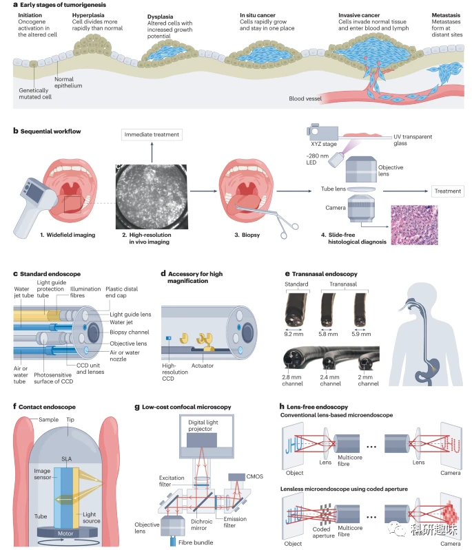
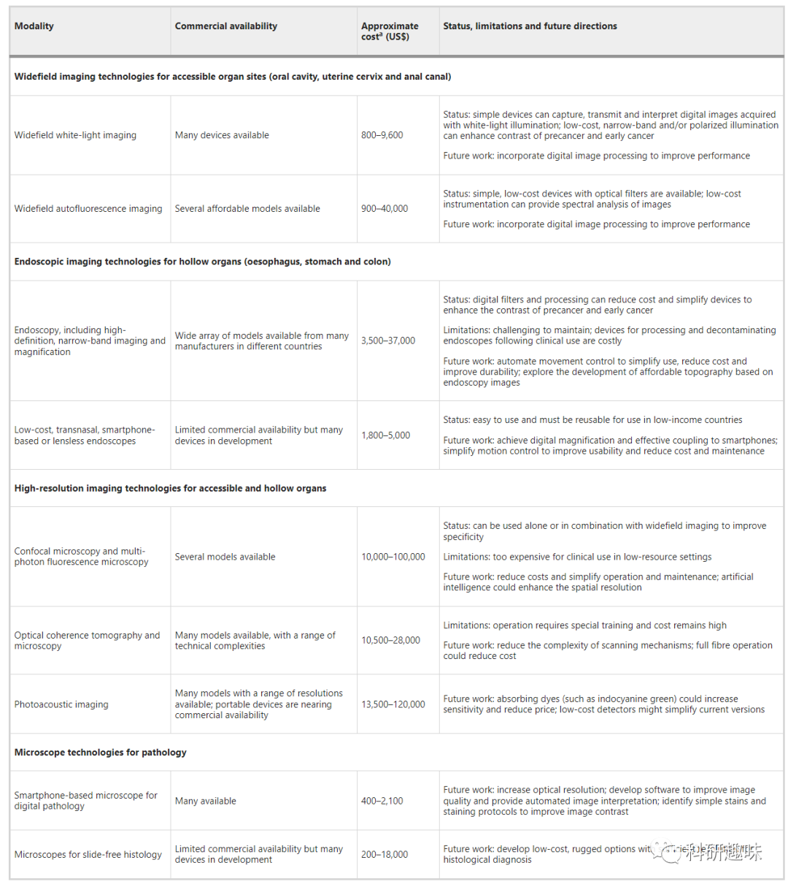
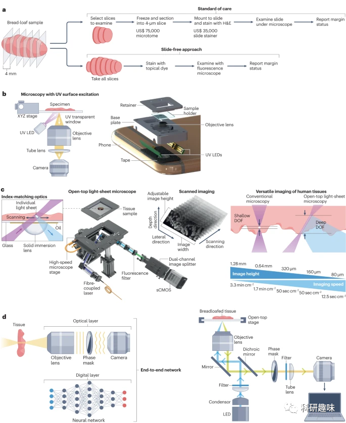

 

#  【Nat Rev Bioeng】光学成像如何在早期癌症检测中广泛应用？ 
 

Grenemal

读完需要

30

全文字数 10700 字

***目录***

1. Key points
2. Introduction
3. Optical imaging for cancer detection
    1. Widefield imaging
    2. High-resolution imaging
    3. Increasing access to optical imaging
4. In vivo optical imaging
    1. Helping to eliminate cervical cancer
        1. Low-cost colposcopes
        2. Mobile detection devices
        3. Deep learning-based approaches
        4. High-resolution imaging
        5. Multi-modal imaging
    2. Achieving early oral cancer diagnosis
        1. Autofluorescence imaging
        2. Combined white-light and autofluorescence imaging
        3. Confocal microscopy
    3. In vivo imaging for global anal cancer screening
    4. Low-cost endoscopy for early oesophageal cancer detection
    5. Challenges and potential of optical imaging
5. Microscopes for point-of-care pathology
    1. UV surface excitation
    2. Optical sectioning
    3. Wavefront encoding
6. Outlook

**Key points**

- 全球癌症的公平性差距正在扩大。早期诊断可以提高患者的预后，但在资源有限的环境中，如基础设施、人力、财政或社会资源受到限制，这些地方的筛查和诊断项目却相对匮乏，导致医疗保健的提供受到限制。
- 随着消费级成像工具（如发光二极管、数码相机和塑料镜片）的进步，现在可以利用高性能、低成本、便携式的光学成像系统观察癌前病变和早期癌症的细胞、血管和结构特征。
- 活体光学成像技术有望提高宫颈癌、口腔癌、食道癌、肛门癌等上皮性癌症的早期检测能力，但需要进行大规模的研究，并使用市场上可购得的低成本设备。
- 为了在人手不足的资源匮乏环境中推广光学成像技术以改善癌症筛查和早期诊断，相关技术应具备操作简便、易于维护的特点。因此，技术开发者在设计过程中应强调其易用性。
- 利用低成本显微镜可以实现高质量的无切片组织学检查，以提高诊断准确性和治疗指导，但这需要使用标准化的染色方案和商业化系统进行大规模验证。
- 机器学习技术可以通过自动化图像解读来提高成像性能并减少人力资源需求；但为了开发和验证便携式算法，需要来自相关人群的大量、经过精选的图像数据库。

**Introduction**

在全球134个国家中，癌症是导致过早死亡的主要原因。预计到2040年，全球癌症发病率将增加50%。尤其是在低收入和中等收入国家，这些国家的癌症病例数量高，但资源和基础设施却有限。到2030年，全球75%的癌症死亡病例预计将在这些国家出现。即使在高收入国家，如美国，资源分配也存在不均，导致某些种族和群体的癌症治疗差异。

"低资源环境"指的是由于各种原因（如基础设施、资金、医疗服务等）导致的医疗保健系统未能满足国际或国家标准。可持续发展目标旨在到2030年将癌症死亡率降低三分之一，并提供80%的经济负担得起的癌症服务。**为了实现这些目标，必须发展出价格适中、准确和便捷的癌症筛查和检测技术。**

上皮组织癌症占所有癌症的80-90%，如果在早期阶段发现，它们是可以预防或治愈的。光学成像技术能够检测早期的形态和分子变化，但在低资源环境中的应用仍受限。

筛查计划可以增加对癌前病变和早期癌症的检测率，但在资源有限的环境中，筛查的频率和准确性可能受到限制，导致癌症诊断和治疗的延迟。

图 1：宽场和高分辨率成像系统可改善癌前上皮病变的早期检测。a.上皮癌的发展过程类似，从开始和增生开始，经过不同程度的发育不良，最终发展为浸润性癌症。b.光学成像工具可以通过观察癌前上皮细胞的结构和形态生物标志物、基质血管生成和基底膜下上皮细胞的微小浸润，改进癌前病变和早期癌症的检测。c.标准内窥镜，使用CCD和物镜获取相关区域的光学图像。d.高清晰度内窥镜的光学扩展附件，其中的光学镜头可移动以实现高放大率（高达 ×150）。e.用于无麻醉病人上消化道内窥镜检查的超薄经鼻内窥镜。f. 基于商业接触式图像传感器技术的自聚焦镜头阵列（SLA）的低成本扫描内窥镜。g.用于宫颈组织活体成像的低成本线扫描共焦显微内窥镜的设计。h.无透镜微内窥镜，通过用编码光圈和计算图像复原（下图）取代远端透镜（上图），可同时实现微型化和宽场。

**Optical imaging for cancer detection**

医学成像技术是观察肿瘤存在的关键手段。这些技术包括超声波、计算机断层扫描（CT）、磁共振成像（MRI）、正电子发射断层扫描（PET）以及光学成像技术如阴道镜和内窥镜。为了确诊，医生可能会使用活检针或活检钳进行活检。这些活检通常在成像过程或手术中由专家医师进行。随后，病理学家会对活检样本进行固定、切片、染色，并在光学显微镜下检查。接下来，作者将重点介绍几种关键的光学技术，它们有潜力改善上皮癌前病变的早期检测，并可以与上述成像流程相结合。

**Widefield imaging**

光学成像技术在上皮癌前病变的早期检测中展现出了重要的潜力，特别是在低成本、定量宽场和高分辨率方面。对于可触及的上皮表面，目视检查或数字白光成像，如在白光下观察上皮表面的颜色或纹理变化，可以帮助识别癌前病变。阴道镜和其他高倍放大的显微镜提供了进一步的光学放大，用于检查子宫颈等部位，增加了癌前病变的识别准确性。

绿光照明技术可以增强血管的对比度，助力于识别与癌前病变相关的血管形变。与此同时，局部使用特定造影剂如醋酸或鲁戈碘，可以改善健康组织与癌前病变组织之间的对比度，有助于定位病变。蓝光照明不仅可以突出血管的形变，还可以通过激发组织的内源性荧光提供额外的诊断信息。特别是，在口腔组织中，蓝绿色照明下的自发荧光成像显示出比传统白光检查更高的灵敏度，这对于癌前病变的检测尤为关键。

**High-resolution imaging**

近年来，高分辨率成像技术在揭示上皮细胞内部的细胞和亚细胞变化方面取得了显著进展。其中，共聚焦显微镜利用针孔孔径来排除多重散射光子，能够全面成像上皮细胞核的大小、形状和间距，这些都是癌前病变的标志性特征。通过使用局部造影剂如醋酸，共聚焦显微镜中的核散射和对比度可以得到进一步增强。荧光染料的应用，如2-[N-（7-硝基苯并-2-氧杂-1,3-二唑-4-基）氨基]-2-脱氧葡萄糖，使得我们可以测量葡萄糖摄取和细胞核形态的变化。另一种多光子荧光显微镜则通过使用近红外（NIR）激发光束，限制了激发荧光的组织体积，为上皮细胞提供了高空间分辨率的图像。

然而，虽然共焦显微镜和多光子显微镜可以提供亚细胞级别的图像，但其穿透深度通常受到限制，无法穿透整个上皮厚度。与此相反，光学相干断层扫描（OCT）采用相干门技术实现高空间分辨率，但其成像深度通常仅限于2毫米，虽然能够在上皮表面下发现微小的浸润性癌症，但其亚细胞分辨率有限。光声成像则结合了脉冲激光和超声技术，通过检测血红蛋白等发色团的声波反射，为我们提供了在深度和分辨率上均衡的成像能力，特别适用于皮肤癌和乳腺癌的早期检测。

**Increasing access to optical imaging**

随着便携式精密光学成像系统质量的显著提升，许多高性能光学组件的成本也大幅降低。得益于消费级成像设备（如手机摄像头）的革命，我们现在有了多种经济、高效的光学部件：如低成本的发光二极管（LED）用于照明、高分辨率的电荷耦合器件（CCD）和互补金属氧化物半导体（CMOS）摄像头进行检测，以及性能优越的塑料光学成像元件。此外，低功耗且高效的计算机为图像存储和处理提供了强大支持。这些技术正在被整合和应用于设计满足低资源环境需求的低成本光学成像系统。值得注意的是，许多光学系统采用了内源性造影剂，减少了对昂贵或难以存储的造影剂的依赖。

然而，尽管光学技术发展迅速，但其实际应用仍需受到训练有素的临床人员的指导和解读。在某些低资源地区，如撒哈拉以南非洲，病理学家的数量相对稀缺。具体来说，每100万患者仅有一名病理学家，这一比例远低于高收入国家。为了应对这一挑战，机器学习策略被提出，利用自动图像分析技术，不仅可以实现图像解读，还能提高图像质量，满足癌症检测的高要求。

**In vivo optical imaging**

尽管成像技术为癌症的早期检测提供了可能，但许多光学成像技术在资源有限的环境中因其复杂性和高成本而难以应用。为了在临床实践中实现这些技术的有效利用，研究者需要致力于开发和推广简便、耐用且经济实惠的设备。接下来，我们将详细探讨光学成像在宫颈癌、口腔癌、肛门癌和食道癌等癌症早期诊断中的应用，尤其是在资源匮乏的环境中的潜在价值。

**Helping to eliminate cervical cancer**

2018年5月，世卫组织提出了一个旨在消除宫颈癌的全球行动计划。该计划的核心目标包括全球90%的女童在15岁前接种HPV疫苗，以及在35和45岁时，70%的覆盖率通过高效的筛查方法进行检测。特别是在低收入和中等收入国家，这些计划的需求尤为迫切，因为这些国家的宫颈癌病例超过了90%。尽管存在一些宫颈癌前病变规划工具来辅助决策，但现有的筛查和诊断技术尚不能满足这些目标。在高资源环境中，标准护理需要三次就诊，并涉及多个步骤和专业医生，但在低资源环境中，这种模式经常导致妇女失去随访机会和不完整的治疗。

为了解决这一问题，世卫组织在2021年的指南中提出了“筛查、分流和治疗”的方法，建议根据不同的筛查结果来决定是否进行治疗。这种方法考虑到了成本、培训、资源和当地可行性等因素。然而，由于各种原因，如成本和基础设施限制，这些分流检测在低收入和中等收入国家中并不普及，且部分策略的可靠性有待提高。

为了解决这些挑战，光学技术被看作是一个有潜力的解决方案，因为它可以提供即时和准确的分流检测。目前，有多种光学成像方法正在研发和评估，包括低成本的手持式阴道镜和高分辨率的光学成像系统。这些技术可以为医疗服务提供者提供高质量的图像，从而更好地进行诊断和决策。

**Low-cost colposcopes**

目前，低成本的阴道镜技术已经得到了发展和应用。其中，AV Magnivisualizer是一种低成本（160美元）的手持式放大设备，利用卤素灯进行宫颈观察，并在研究中与价格为4,000美元的高清视频阴道镜COLpro222DX的性能进行了比较。在这项研究中，两种设备的诊断准确性相当。此外，Gynocular是另一种低成本的便携式阴道镜，价格为3500美元，采用LED照明并具有不同的放大倍率。研究显示，使用Gynocular或标准阴道镜进行检测在灵敏度和特异性上并没有显著差异。特别是在孟加拉国的研究中，受过VIA培训的护士使用Gynocular的准确性与医生相当。这些研究均指出，低成本阴道镜技术在训练有素的护士和医生手中可以实现与高成本设备相当的宫颈癌筛查和诊断效果。

**Mobile detection devices**

使用手机摄像头进行宫颈癌筛查或分流已成为研究的焦点。这种方法能够持续获取高质量的数字图像，这些图像与使用×5放大镜的手机设备和阴道镜检查的结果一致。数字图像记录功能还可用于观察宫颈癌前病变的随时间变化和培训目的。智能手机应用程序的集成进一步提供了决策支持、临床决策记录、预防计划跟踪和专家指导。在埃斯瓦提尼的实践中，护士们已成功使用手机进行宫颈筛查，并得到远程专家的支持和反馈，从而提高了筛查的可靠性和可重复性。

尽管这些技术取得了进展，目前市场上只有两款移动式数码阴道镜：MobileODT EVA系统和袖珍阴道镜。MobileODT EVA系统能够提供阴道镜级别的图像，并支持数字工具的使用，有助于记录和分享检查结果。袖珍阴道镜是专为阴道插入设计的，能够提供与高成本阴道镜相当的图像质量。研究显示，使用袖珍阴道镜的诊断结果与使用标准阴道镜的结果一致，其检测灵敏度和特异性也与标准阴道镜相似。

**Deep learning-based approaches**

在光学图像采集领域，尽管低成本系统能够获得高质量的图像，但对于解读这些图像仍需具备丰富经验的医疗专家。这在资源有限的地区尤其是一个挑战，因为这些地方可能缺乏专业的医疗人员。为了应对这种情况，基于深度学习的方法提供了一个有前景的解决方案，它能够客观且准确地解读宫颈数字图像。

"自动视觉评估"（Automated Visual Evaluation）是其中一个深度学习算法的例子，该算法能够从阴道镜图像中识别和区分癌前病变。这种算法是在一个基于人群的长期临床试验中训练的，这个试验收集了大量的宫颈图像数据，并配备了确诊活检。该算法的性能显著，可以检测出高级别的宫颈癌前病变（CIN2+）和晚期癌症，其ROC曲线下的面积超过了0.9。

然而，这种基于深度学习的算法在前瞻性研究或对于不同阴道镜采集的图像分类时，性能可能会下降。例如，某项研究使用了来自五种不同设备的宫颈图像数据集来开发和优化深度学习模型，该模型的性能范围在0.73至0.79的ROC曲线下面积，这远低于早期的估计。

再如，在尼日利亚的一个研究中，利用基于深度学习的聚类方法可以高达97%的准确率来区分三种不同系统采集的图像。这表明为了开发一个强大的机器学习分类器以检测癌前病变，我们需要一个经过验证的大型训练图像数据集，这样的数据集可以从像医学影像和数据资源中心这样的机构中获取。

**High-resolution imaging**

近年来，为了提高宫颈癌前病变的检测和诊断，研究者们已经开发了多种低成本、高分辨率的宫颈上皮成像策略。其中，荧光显微内窥镜 (HRME) 是一种光纤荧光显微镜，能够提供原位诊断，而不需要进行活检和病理服务。这种技术不仅成本低廉，据报道其系统的成本甚至低至1,200美元，还具有实时显示用丙黄嘌呤染色的细胞核图像的功能。更为重要的是，它的软件可以根据核形态的变化自动报告是否存在癌前病变。

在巴西，HRME技术已经在移动车上得到应用，用于促进单次就诊、快速检验筛查、分流和治疗方法。这项技术的应用带来了明显的效果，与被转诊到中心医院的患者相比，被转诊到流动车的患者的诊断随访完成率提高了37%。此外，HRME在宫颈筛查中的表现与阴道镜检查相似，特别是在检测CIN3+方面的灵敏度和特异性。有趣的是，机器学习方法进一步证实了HRME的高准确性。

尽管HRME技术带来了很多优势，但共聚焦成像系统也显示了其在抑制杂散光方面的潜力。这种共聚焦荧光成像技术可以深入观察上皮表面及其下的核形态，其高灵敏度的核形态算法有望在癌前病变的早期检测中起到关键作用。然而，市场上的共聚焦显微镜仍然昂贵且复杂，需要进一步的技术进步和成本降低。另外，光学相干显微镜的结合技术也在不断地为宫颈癌前病变的检测提供新的可能性。

**Multi-modal imaging**

为了增强宫颈癌前病变的诊断效率，研究人员采用了多模态成像策略，结合了低成本的宽场成像和高分辨率的成像技术。其中，一种将OCT与显微镜相融合的系统在LEEP手术期间切除的标本图像中表现出色，其在识别高级别癌前病变方面的诊断准确性达到了灵敏度88%和特异性69%。这表明，结合OCT和阴道镜技术有助于提高高级别鳞状上皮内病变的检测率。此外，一种结合袖珍阴道镜和高速HRME的多模态阴道镜被开发，它能够在大面积组织上进行快速成像，通过实时图像分类在原位识别宫颈癌前病变。

**Achieving early oral cancer diagnosis**

口腔癌在低资源环境中的影响日益显著。全球每年约有377,000人患上唇和口腔癌，其中178,000人不幸因此而死亡，尤其是在低收入和中等收入国家。早期诊断对于口腔癌患者尤为关键，因为它可以降低治疗相关的风险并提高患者的生存率。但在低收入国家，由于多种原因，包括社会经济因素和医疗资源限制，口腔癌往往在晚期被诊断出来。

特别是在一些地区，如博茨瓦纳，研究发现那些原发部位在口腔深处或居住在社会经济水平较低地区的患者更容易被诊断为晚期口腔癌。全球范围内的研究也显示，受教育水平低和经济状况不佳的人群更容易罹患口腔癌。

在美国，尽管口腔癌筛查的方法和标准已经存在，但仍有很多人没有得到及时的筛查，尤其是那些受教育水平较低和没有医疗保险的人。与此同时，非洲裔美国人在头颈癌的诊断和治疗中面临更高的死亡率。

口腔癌的筛查方法多种多样，但主要包括传统的口腔检查和触诊，以及进一步的活检。尽管存在一些挑战，如诊断的主观性和误差，但口腔癌筛查的潜力巨大。例如，一项在印度进行的大规模研究显示，经过三轮口腔癌筛查后，早期诊断率显著提高，并且患者的死亡率大大降低。

**Autofluorescence imaging**

近年来，为了更早地检测口腔癌及其前兆，已经研发了多种非侵入性辅助成像技术。这些技术包括自发荧光成像、共焦成像、OCT以及灌注成像。其中，自发荧光成像已被证明可以提高口腔癌及其前兆的早期检测灵敏度。

在市场上，已经有几款低成本的自发荧光成像系统，如VELScope。这种手持式系统售价约为2,000美元，可以通过蓝色LED照明激发自发荧光，并通过适配器与手机连接，以获取数字图像。通过这种方式，医生可以清晰地看到癌前病变与健康组织的差异，因为癌前病变通常会导致蓝绿荧光的减少。

然而，关于自发荧光成像的临床价值，学界存在一些争议。一些研究指出，自发荧光能够高度敏感地识别癌前病变，但在区分良性炎症和癌前病变方面，其特异性不足。尽管如此，还有其他研究表明，通过对数字图像进行定量分析，可以提高自发荧光成像检测癌前病变的特异性。

对于这种技术的总体效果，一项荟萃分析研究显示，自发荧光成像的综合灵敏度为82%，而综合特异度为62%。与传统的口腔检查相比，自发荧光成像在灵敏度上具有明显优势，这得益于其能够增强对比度，从而使癌前病变与周围健康组织的边界更为明确。

**Combined white-light and autofluorescence imaging**

结合数字白光和自发荧光成像，可以实现口腔癌及其癌前病变的早期检测。为此，已经推出了一款低成本的设备，它将这两种成像技术结合到一个基于手机的平台上。这款设备采用了405纳米的蓝色LED作为外置光源，配合长通滤波器，为自发荧光成像提供所需的照明。随后，数据会上传到云端，供远程专家进行场外的质量控制和诊断。

在印度进行的实地评估测试中，这款设备得到了99名参与者的试用，他们都有不同程度的口腔健康问题。测试结果显示，该设备在远程专家和基于卷积神经网络（CNN）的算法的诊断上都表现出了很高的灵敏度和特异性。具体来说，远程专家的诊断灵敏度为93%，特异性为87%；而基于CNN的算法灵敏度为85%，特异性为89%。但令人担忧的是，只有47%的图像通过了质量控制，这意味着图像质量仍有提高的空间。为了进一步评估这种技术的准确性，还进行了一次规模更大的实地评估。在这次评估中，与现场专家合作的一线医疗工作者使用了这款设备对752名患者进行了诊断，结果由远程专家进行评估。与现场专家的诊断相比，远程专家的准确性更高，灵敏度达到95%，特异性为84%。而手机集成的CNN在识别病变方面的灵敏度为82%。

**Confocal microscopy**

荧光共聚焦显微镜和反射模式技术为口腔上皮活体组织学观察以及口腔癌及其前兆的诊断提供了有前景的方法。这些技术在口腔癌组织中显示出与健康组织不同的多形性、核与细胞质比率增加和结构混乱的特征。然而，传统的共聚焦显微镜由于其复杂性和高昂的成本，使得它在资源有限的环境中难以应用。此外，共聚焦显微镜还面临一些技术限制，如穿透深度不足和在角质化组织或炎症浸润区域的光线散射问题。相对而言，结合自发荧光成像和低成本的高分辨率荧光显微内窥镜检查的方法可以增强其诊断特异性。以一个研究为例，当结合自发荧光和高分辨率成像的算法进行分类时，对于30名患者的100个口腔正常和异常部位，有98%的部位被正确地分类为正常或肿瘤；而使用基于自发荧光的简化算法时，只有76%的部位被准确分类。

**In vivo imaging for global anal cancer screening**

在美国，HIV感染者患肛门癌的风险是HIV阴性感染者的30倍以上。这与免疫系统受损导致艾滋病病毒感染者更容易与人乳头瘤病毒共感染有关，而人乳头瘤病毒与90%的肛门癌病例相关。为了降低这一风险，治疗肛门癌前病变显得尤为重要。因此，专家建议使用肛门细胞学和/或HPV检测进行筛查。当筛查呈阳性时，参与者需要再次就诊，进行高分辨率肛门镜检查（HRA）来确定疑似区域，并进行活检评估。

但HRA引导下的活检需要高度专业的知识，因为医生可能需要大约200次操作才能准确识别所有的癌前病变或AIN2+的肛门上皮内瘤变。一旦确诊为AIN2+，受试者需要进行第三次复诊以接受治疗。然而，这种多次就诊的方式可能导致高的随访失误率，如一个研究显示，只有58%的确诊AIN2+患者最终返回接受治疗。

为简化这一问题，光学方法被提出，其目标是在HRA期间进行活体诊断，从而进行更为精准的活检。例如，高分辨率或多模态成像技术可以实时区分正常和肿瘤粘膜，这有助于改善筛查和治疗方法，减少失访人数。但目前关于开发早期检测肛门癌的光学成像策略的努力仍然有限。一项利用商用平板扫描仪的研究成功地开发出了一个售价150美元的低成本设备，可以在10秒内对整个肛管进行成像。虽然这种设备的空间分辨率低于HRA，但其检测AIN2+的准确性与专家HRA相似。

**Low-cost endoscopy for early oesophageal cancer detection**

食道癌在全球是第六大常见癌症，每年有604,000人被确诊，导致544,000人死亡。尽管美国的化疗和放疗技术不断进步，食道癌患者的5年生存率仍低于20%。而在低收入和中等收入国家，由于晚期诊断，这一比率低至5%以下。事实上，当肿瘤突破粘膜层时，患者的存活率会显著下降，因此早期发现尤为关键。虽然全球受影响的地区广泛，但南美、伊朗和中国的食道癌发病率尤为高。

内镜检查是评估食道癌风险者是否患有巴雷特食管相关腺癌或食管鳞状细胞癌的主要方法，但其操作成本高且具有创伤性。尽管在中国，有组织的内窥镜筛查已经提高了食道癌的早期诊断率，但这种方法的经济效益仍有待评估。近年来，高清晰度和放大内窥镜等技术的出现为提高早期诊断提供了希望，特别是当结合图像增强策略时，其准确率可达90%以上。

然而，由于高昂的成本和专业技术要求，许多低收入和中等收入国家很难实施基于内镜的筛查。一些替代方法，如超薄鼻内窥镜和胶囊内窥镜，为食道疾病的检测提供了更为经济和便捷的选择。例如，某些基于智能手机的内窥镜系统，其成本仅为700-1,500美元，已在某些小型研究中显示出其诊断潜力。

随着无镜头成像技术的发展，传统内窥镜的大小和成本可能会进一步减小。这些技术使用随机二进制空间掩膜替代纤维束远端透镜，使得系统可以在不同深度进行重新聚焦，并且不需要额外的元件来调整色差。但目前这些系统的视场仍然相对较小，需要进一步的技术改进和研究。

**Challenges and potential of optical imaging**

低成本光学成像技术显示出显著的潜力，可以用于宫颈癌前病变、口腔癌、肛门癌和胃肠道癌的筛查和早期检测。为满足这些临床需求，开发并应用成熟的技术已经成为生物医学光学的核心任务。表1概述了在低资源环境下用于早期癌症检测的光学成像技术的现状、局限性以及未来的发展方向。

在宫颈癌筛查中，低成本的数字宽场成像技术因其自动算法和高准确性而具有特别的发展潜力。与此同时，低成本的高分辨率和多模态成像方法为集筛查、诊断和治疗为一体的单次就诊方法提供了更高的特异性。

对于口腔癌，如VELscope等手持式和经济实惠的成像系统已经可用于早期检测。但为了更准确的评估，这些设备的临床表现需要在大型多中心研究中进行验证，并与组织学诊断结果进行对比。

尽管内窥镜检查技术为胃肠道癌症的早期检测提供了方法，但其高昂的成本和维护难题使其在资源有限的环境中难以实施。因此，努力降低这些硬件的成本并开发可重复使用的替代品成为改善早期癌症检测的关键。

为确保新的成像工具在低资源环境下得到有效应用，它们必须经过大型临床研究的验证，并确保价格合理。特别是在资源有限的国家，技术转移面临着额外的挑战。因此，在设备设计时，必须考虑到不同国家在资源和基础设施上的差异，如根据世界卫生组织的数据，各国的卫生支出存在显著差异。

Table 1 Optical imaging technologies for early cancer detection in low-resource settings

**Microscopes for point-of-care pathology**

组织病理学在识别癌症和癌前病变中起到了关键作用。通过显微镜对细胞和组织进行检查是确定癌症的核心方法。尽管显微镜技术已被广泛采纳，但由于其高昂的设备成本和需要专业训练的人员，如组织技术人员和病理专家，导致在许多地区，特别是低收入和中等收入国家，病理服务的覆盖率仍然有限。

低资源环境中的病理服务面临多重挑战，如劳动力短缺、基础设施欠缺、培训不足以及缺乏标准和认证。这些限制不仅影响了疾病的早期诊断，还可能延误治疗，对患者的预后造成不良影响。因此，一些建议在低收入和中等收入国家的所有医院都建立二级病理实验室，为高质量的组织病理服务提供支持。

为了克服这些挑战，结合智能手机和标准显微镜的技术被提出，可以远程发送高质量的数字切片图像给专家进行审查。这种方法已在多个研究中证明其与传统方法的一致性。例如，在巴西的一个研究中，利用基于智能手机的低成本扫描仪，与传统扫描仪相比，其图像分类的准确性相当高。

尽管传统显微镜已被广泛采用，但它仍然存在局限性，如景深受限和光学对比度不足。这些问题需要通过复杂的样本处理和染色来解决，增加了操作的复杂性和成本。为了进一步提高诊断效率和准确性，研究人员正在开发更先进、更便捷的技术来完善现有的组织病理学方法。

**UV surface excitation**

随着紫外线（UV）发光二极管、先进的光学制造技术和人工智能的快速进步，新型无切片病理显微镜应运而生，有效地解决了传统显微镜的限制。这些技术的融合为显微镜带来了前所未有的优势。

紫外表面激发显微镜（MUSE）是一个典型的例子。由于紫外线穿透深度有限，仅为几微米，标准荧光显微镜使用紫外激发时可以将激发范围限制在组织表面，避免了对样本的物理切片。MUSE能够在短时间内使用成本效益的局部荧光染料生成高分辨率的诊断图像。与使用传统H&E组织学技术的样本相比，MUSE图像展现出了相似的诊断细节。虽然在描绘细胞质细节方面有所不足，但MUSE仍能够识别与基底细胞癌相关的诊断特征。

除了传统的MUSE，还有一种基于智能手机的小型显微镜系统——Pocket MUSE。这种系统结合了MUSE技术和消费级电子产品部件，为无切片组织学提供了高质量的多通道荧光显微镜。智能手机摄像头在记录高倍率荧光图像时表现出色，为我们呈现出亚微米级的高分辨率图像。

尽管配备MUSE的显微镜在成本和耐用性方面都表现出色，并适合于资源有限的环境，但它们仍需通过大规模的研究来验证染色程序的有效性以及其在早期癌症检测中的诊断能力。

图 2：实现快速、低成本、无切片组织学的显微镜方法。a, 标准护理组织学工作流程与无切片方法的比较。b, 紫外线（UV）表面激发显微镜（MUSE）示意图，c. 开顶式光片显微镜示意图。d，DeepDOF 显微镜使用 10 美元相位掩模对光场进行编码，增强了点扩散函数的深度不变性。

**Optical sectioning**

光片显微镜代表了无载玻片病理学的新方法，允许快速获取大量临床样本的高分辨率图像，与传统组织学图像相媲美。这种技术的关键在于使用光学切片，通过对样本的照射和收集荧光来实现。该技术利用低数值孔径照亮样本并使用高数值孔径收集荧光，从而实现高空间分辨率和扩展的深度。一种特别的开顶光片显微镜技术已被开发，该技术通过在平面玻璃板上放置样本并使用固体浸入式透镜从下方成像来工作。

该技术已被用于获得多种组织的高质量图像，包括前列腺和乳腺组织。这些图像展现出了与传统组织学相似的诊断特征。特别是，在乳腺肿瘤的情境下，这些开顶光片图像与传统方法的质量相当，甚至在某些方面超越了传统方法。此外，光片显微镜在一个小规模的试验中显示出了超过90%的灵敏度和特异性。

除了开顶光片显微镜外，还有其他光学切片显微镜技术，如选择性平面照明显微镜（OpenSPIM）和微型光片显微镜（miniSPIM）。这些技术旨在提高光片显微镜的普及率并降低成本。例如，miniSPIM是一个低成本的光片显微镜，其成本不超过200美元，并可以使用移动照相设备进行图像捕捉。

尽管这些技术在增加病理诊断效率和降低成本方面显示出巨大潜力，但在资源有限的环境中使用它们仍然面临挑战。这些挑战包括高昂的设备成本和时间消耗较长的处理过程。然而，随着技术的进步和研究的深入，这些障碍有望得到克服，从而使这些先进的光学显微镜技术在更广泛的应用中发挥作用。

**Wavefront encoding**

波前编码提供了一种独特的方法，旨在打破深度和分辨率之间的关联，从而实现对新鲜组织的高分辨率成像。传统的显微镜技术，即使使用标准物镜，也在达到亚细胞水平的分辨率时受到了深度限制，大约只能达到30 μm的深度。然而，新鲜组织的表面变化可能延伸到200 μm的深度。DeepDOF 显微镜采用了一个创新的方法，通过在传统荧光显微镜的瞳孔平面上插入一个成本低廉的相位掩膜来实现波前编码，这有助于增强深度不变性，并有效地克服了深度限制问题。通过结合优化的图像重建算法，DeepDOF 显微镜可以在扩展深度至200 μm的同时，保持对亚细胞特征的高分辨率观察。

这种技术在成像切除的口腔手术标本时显示出了巨大的潜力。DeepDOF 显微镜可以在高度不规则的切除组织表面上持续观察核形态和其他关键的诊断特征，而无需频繁地重新聚焦。值得注意的是，在资源有限的环境中，这种波前编码策略可以轻松地应用于现有的显微镜技术中。

除此之外，无切片显微镜，如MUSE和其他基于波前编码的方法，为扩展组织病理学服务的可及性提供了低成本的解决方案。当这些技术与基于机器学习的图像分析算法结合时，其潜力更为巨大。为了确保在低资源环境中有效地应用这些技术，有必要进行大规模的研究，优化染色方案，并验证其性能。

**Outlook**

癌症在全球范围内都是一个紧迫的健康挑战，尤其是在低收入和中等收入国家，其癌症的发病率和死亡率增长速度更快。全球存在的癌症公平差距正在扩大，而采取成本效益的筛查和诊断措施可以缩小这一差距。早期癌症的检测具有明显的优势，包括改善治疗效果、降低治疗成本和减少患者的生活负担。但在资源匮乏的环境中，治疗晚期癌症的挑战尤为艰巨。

新兴的早期癌症检测技术，如光学技术，虽然在高收入地区显示出潜力，但在低收入地区的应用受到成本和技术复杂性的限制。需要进一步的研究和投资来使这些技术更加实用、耐用和成本效益高。目前，大多数研究都是在高资源环境下进行的，缺乏对低资源环境的实际适应性评估。

机器学习为非专业的医疗服务提供者提供了在低资源环境中进行高精度筛查的机会。这种技术不仅可以提高图像的质量，还可以与远程专家进行虚拟共享，进一步加强了诊断和治疗的效率。

从经济和实际应用的角度看，将光学技术与现有的癌症治疗方法相结合，可以为早期癌症患者提供更为广泛和有效的治疗选择。

最后，为了更好地解决这些问题，各方，包括政府、学术机构和医疗系统管理者，都需要制定和实施相关策略，以支持技术的开发、转化和推广。此外，为了培养下一代的创新者和实践者，大学和其他教育机构也需要进行相应的课程改革和教学方法创新。

Richards-Kortum, R.; Lorenzoni, C.; Bagnato, V. S.; Schmeler, K. Optical Imaging for Screening and Early Cancer Diagnosis in Low-Resource Settings. *Nat Rev Bioeng* **2023**. https://doi.org/10.1038/s44222-023-00135-4.

**关注并回复文章DOI获取全文：**

10.1038/s44222-023-00135-4

**点击蓝字 关注我们**

预览时标签不可点

素材来源官方媒体/网络新闻

 [阅读原文](javascript:;) 

  继续滑动看下一个 

 轻触阅读原文 

    

