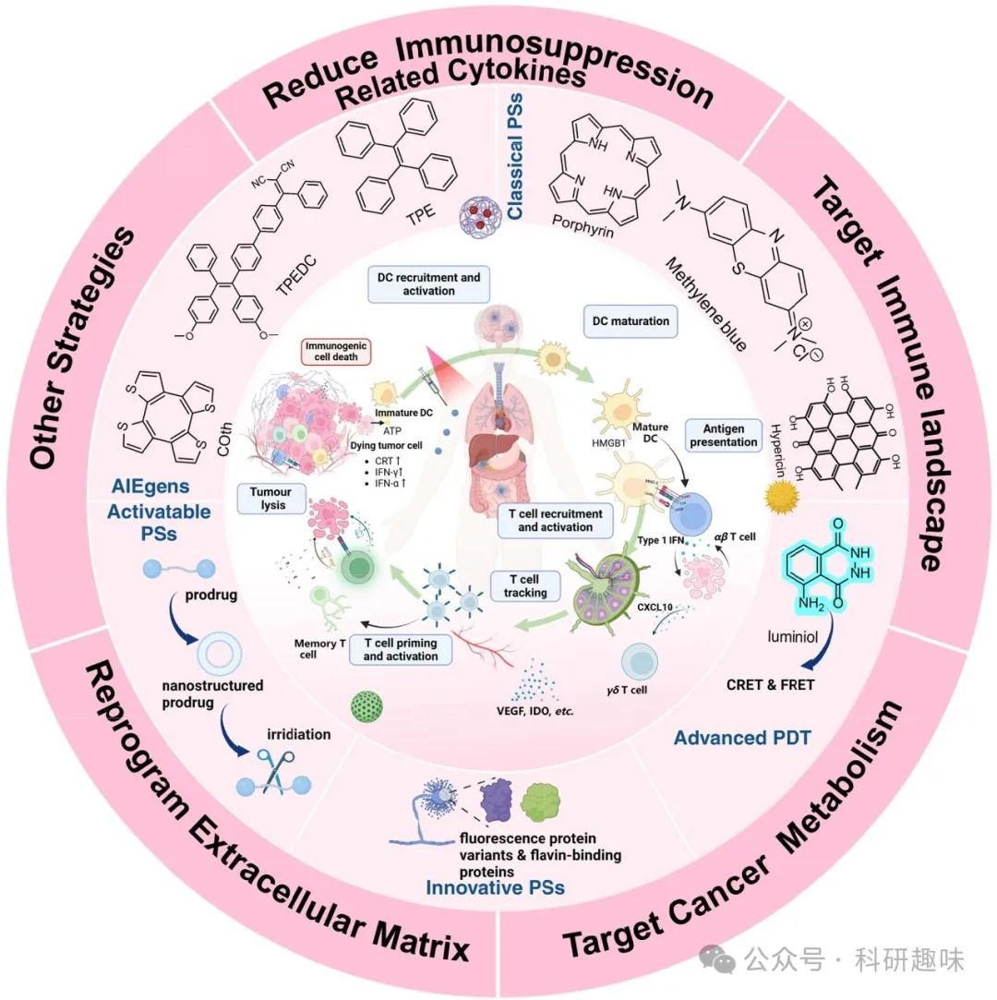

 

#  【光动力治疗】一文足够，最全PDT之肿瘤免疫疗法（1）——前言 
 

# 本节主要介绍了光动力疗法和肿瘤免疫疗法的发展

随着高灵敏度单细胞分析技术的飞速发展，我们对错综复杂的肿瘤微环境（TME）的认知达到了前所未有的深度，促使临床策略的核心逐渐聚焦于单细胞水平的肿瘤分层亚群表型解析。针对肿瘤免疫微环境（TIME）的精准干预策略，为实现癌症治疗的个性化与高效化开辟了新途径。尽管免疫疗法的兴起为肿瘤治疗带来了革命性变化，其面临的挑战亦不容忽视，特别是免疫逃逸现象及伴随的免疫相关不良反应，显著制约了免疫疗法的整体疗效。

鉴于此，为了安全且高效地激发机体抗肿瘤免疫反应，免疫疗法往往需与多种治疗手段联合探索。其中，光动力疗法（PDT）凭借其独特的细胞毒性直接作用、对肿瘤血管系统的破坏力及激发强大免疫应答的能力，在弥补当前癌症免疫治疗短板方面展现出巨大潜力。近年来，PDT与肿瘤免疫景观之间的相互作用机制成为研究热点，人们普遍认为，将PDT与靶向肿瘤免疫景观的策略相结合，有望成为抗癌治疗的新“金钥匙”。

然而，传统给药方式在深入穿透致密肿瘤组织及减少正常组织毒性方面存在局限，这大大限制了PDT的临床应用前景。为此，基于多功能纳米材料的给药系统应运而生，它们不仅实现了药物释放的精准调控，还能有效促进与其他治疗手段的协同效应，成为连接PDT与免疫治疗的桥梁。

本文首次系统性地回顾了以纳米材料为媒介的光动力免疫疗法在靶向调控肿瘤相关免疫景观中的协同作用机制。遵循“基础研究向临床应用转化”的理念，我们深入剖析了这些纳米材料的协同治疗分子机制，详细阐述了其设计原理与方法论，并广泛探讨了这些前沿纳米技术在最新临床应用中的先进实例、面临的转化挑战以及未来发展趋势。这不仅为光动力免疫疗法的进一步优化提供了理论依据，也为肿瘤治疗领域的创新发展指明了方向。

近十年来，癌症治疗领域见证了从传统广谱抗癌药物向基于单克隆抗体的免疫疗法（Immunotherapy, IT）的深刻转变，这一变革旨在通过刺激或激活肿瘤特异性免疫反应，揭示并利用肿瘤免疫微环境（Tumor Immune Microenvironment, TIME）中的治疗潜力，以促进患者的整体健康恢复。免疫环境，这一复杂网络，涵盖了影响抗癌免疫反应的多重因素，随着高分辨率单细胞技术的飞速发展，临床策略已逐渐从组织病理学层面的肿瘤亚型分类，细化至单细胞表型的精准分层，为个体化治疗方案的制定提供了更为精确的指导。

自2011年首个免疫检查点阻断剂（Immune Checkpoint Blockade, ICB）药物伊匹单抗（ipilimumab）获得美国食品药品监督管理局（FDA）批准以来，IT已成为癌症治疗领域的核心支柱。然而，随着临床实践的深入，IT的局限性也逐渐显现，包括主动癌症疫苗和被动免疫疗法（如针对PD-1或CTLA-4的免疫检查点抑制剂ICIs，以及CAR-T疗法）在内的多种策略，均面临半衰期短、患者响应率低（约20%）、脱靶效应及免疫相关不良事件（irAEs）等挑战。因此，探索与其他疗法的联合应用，以减轻副作用或优化药物剂量，成为抗肿瘤治疗研究的热点。

光动力疗法（Photodynamic Therapy, PDT）作为一种临床验证的微创治疗手段，因其基于非侵入性光化学反应诱导局部细胞死亡的特性而备受瞩目。光敏剂（Photosensitizers, PSs）通过复杂的能量与电子转移机制、光化学反应及光物理过程，展现出强大的光生物活性。通过优化PSs在病变区域的选择性聚集及精确控制光照条件，PDT能够最大限度地减少对周围正常组织的损伤。PDT的抗肿瘤机制涉及三个方面：直接的细胞毒性作用、对肿瘤血管系统的破坏，以及诱导机体产生有效的抗肿瘤免疫反应。这一疗法在弥补当前IT领域中的不足，如免疫抑制性微环境及T细胞激活受限等方面，展现出巨大潜力。

PDT与靶向免疫景观疗法的结合，建立在坚实的生物学基础之上。PDT不仅能够触发多种免疫原性反应，生成损伤相关分子模式（DAMPs），进而激发全身性抗肿瘤免疫反应，还能通过增强抗原呈递、缓解免疫抑制等途径，提升治疗效果。然而，单纯PDT治疗亦存在局限性，如诱导免疫抑制因子产生、细胞凋亡加剧，以及在缺氧及免疫抑制性TIME中疗效受限等。因此，将全身性IT作为PDT的辅助疗法，成为提升治疗效果的新思路。

在光动力免疫疗法（Photodynamic Immunotherapy, PDIT）的临床实践中，已取得了一系列令人振奋的成果。例如，首个针对头颈部恶性肿瘤的PDIT药物（PSs“IR700”与人工抗体“Akalux”复合物）已于2020年获批上市。此外，多项临床试验结果显示，PDT治疗后肿瘤及瘤周基质中细胞毒性与调节性T细胞（Tregs）比例显著增加，与ICI联用更可实现协同增效。

然而，PDIT的广泛应用仍面临诸多挑战，主要包括：PSs依赖肿瘤部位氧气生成活性氧（ROS）的限制、对PDIT与免疫系统相互作用机制的不完全理解，以及传统给药方式导致的疗效下降等。为解决这些问题，材料科学的快速发展为PDIT提供了有力支持。纳米材料凭借其独特的理化性质及优势，在改善药物靶向性、延长循环时间、增强肿瘤组织穿透力及减少正常组织损伤等方面展现出巨大潜力。特别是基于荧光共振能量转移（FRET）原理的具有自发荧光特性的生物材料（如功能化上转换纳米粒子UCNPs），能够在低能量激光（近红外光）照射下实现深部光导治疗及图像引导治疗，为PDIT的临床应用开辟了新途径。

Table 1. Photosensitizers (PSs) for cancer therapy.

| Approaches | Typical cases | Strengths | Weaknesses |
| --- | --- | --- | --- |
| Classical PSs | First-generation PSs: haematoporphyrin derivatives (HpD), porfimer sodium | good water solubility;   well-tolerated by patients at clinical doses | poor photostability;   skin photosensitivity;   limited absorption of red light when administered intravenously to patients; |
| Second-generation PSs: chlorin,   cyanine dyes,   phenothiazinium salts | higher PDT efficiency than the first-generation PSs;   higher photoconversion efficiency than the first-generation PSs;   ease of chemical modification;   shorter skin photosensitivity periods | low organisational penetration;   therapeutic range is limited to local administration;   poor circulation lifetime;   undesired self-aggregation |  |
| Third-generation PSs: nanomaterials-based PSs | enhanced photosensitivity;   high selectivity for tumor;   good biocompatibility | cumbersome preparation process and additional quality control considerations;   demand for more advanced analysis and purification techniques;   massive production and secure implementation continue to pose a significant issue;   more expensive than even existing therapies; |  |
| Aggregation-induced Emission PSs | Tetraphenylethylene (TPE); cyclooctatetrathiophene (Coth); Tetraphenylethylene and dicyanovinyl moieties (TPEDC) | high quantum yield, large Stokes shift, high signal-to-noise ratios (compared with classic PSs), and tunable emission properties;   the luminescence and PDT effect make them simultaneously treating tumor and studying the therapeutic mechanism | widespread biological effects remain to be explored in detail;   short wavelength absorption and broad emission; aggregation dependent brightness;   high working concentrations makes it unsuitable for in vivo or clinical studies. |
| Activatable PSs | mPEG-GALGLPG-PPa | selective PS accumulation and focused laser irradiation ensuring a highly specific tumor-local PDT response;   easier to synthesis, more readily orally accessible, and more stable compared to other advanced drug delivery techniques;   high translatability into low-resource settings; | inter-individual variations might hinder the deployment of prodrugs;   may not as effective as the parent drug;   rapid renal clearance and hepatic metabolism. |
| Innovative PSs | KillerRed, miniSOG | avoiding photobleaching reactions; precise and controlled intracellular localization; highly efficient 1O2 generation; precision targeting and spatial control of PDT;   the mechanism of ROS production needs to be further characterized | It is necessary to study the genes encoding PSs for delivery of proteins by tumor-specific delivery systems while overcoming low-expression genes. |

综上所述，对光动力疗法（PDT）与靶向肿瘤相关免疫景观策略的及时且全面的回顾显得尤为重要。本系列文章不仅深入阐述了光动力免疫疗法（PDIT）的基本原理与实际应用案例，还首次通过一系列典型实例，系统地总结了PDT对肿瘤免疫微环境（TIME）中关键反应因子（涵盖细胞因子、反应性免疫细胞亚群及微生物组等）的调控作用。这些反应因子在免疫系统中的复杂互作，为设计高效的纳米材料基PDIT策略提供了科学依据。

鉴于这些反应因子在免疫调节中的不同角色与功能，本系列文章进一步探讨了当前及前沿的策略，旨在指导如何合理地利用纳米材料的独特性质，以优化PDIT的治疗效果。这些策略不仅关注于纳米材料对药物输送效率的提升，还涉及增强药物在肿瘤部位的靶向积聚、促进药物与免疫细胞的相互作用，以及调节免疫反应的时序与强度等多个方面。

此外，本系列文章还深刻剖析了从药物设计到临床转化过程中可能遭遇的关键挑战，如纳米材料的生物相容性、体内稳定性、免疫原性及规模化生产等难题，并针对性地提出了相应的解决方案。同时，对于PDIT纳米材料的未来发展方向，本系列文章也提出了批判性的见解，旨在引导读者全面认识该领域面临的机遇与挑战，激发科研人员对这一重要癌症治疗领域的探索热情与创新思维。

 光动力疗法与靶向肿瘤免疫原理和方法相结合的示意图。

预览时标签不可点

素材来源官方媒体/网络新闻

 [阅读原文](javascript:;) 

  继续滑动看下一个 

 轻触阅读原文 

   

